---
tags:
  - entry_point
  - xgboost
  - pipeline_catalog
  - ml_pipelines
  - dag_variants
keywords:
  - xgboost pipelines
  - end to end workflow
  - model training
  - pipeline variants
topics:
  - XGBoost pipelines
  - pipeline variants
  - ML workflows
language: python
date of note: 2025-11-09
---

# XGBoost Pipelines Index & Documentation Hub

## Overview

This index card serves as the comprehensive navigation hub for all XGBoost pipeline variants in the Cursus framework. XGBoost pipelines provide flexible, reusable workflow definitions for gradient boosting machine learning tasks, ranging from simple training workflows to comprehensive end-to-end production pipelines with calibration, evaluation, and deployment.

## Quick Navigation

### Pipeline Complexity Levels
```
XGBoost Pipelines (13 Variants)
├── Simple Pipelines (2)         → Basic training workflows
├── Standard Pipelines (5)       → Training with single enhancement
├── Advanced Pipelines (2)       → Training with multiple enhancements
└── Comprehensive Pipelines (4)  → Complete end-to-end workflows
```

### All XGBoost Pipeline Variants

**Simple Pipelines (2)**
- `xgboost_simple` - Basic training with data loading
- `xgboost_training_evaluation_dummy` - Training + evaluation with dummy data

**Standard Pipelines (5)**
- `xgboost_training_evaluation` - Training + evaluation
- `xgboost_training_calibration` - Training + calibration
- `xgboost_training_calibration_fs` - Training + calibration + feature selection
- `xgboost_training_stratified` - Training + evaluation + stratified sampling
- `xgboost_complete_e2e_dummy` - Complete E2E with dummy data

**Advanced Pipelines (2)**
- `xgboost_training_preprocessing` - Training + evaluation + advanced preprocessing
- `xgboost_training_feature_selection` - Training + evaluation + comprehensive preprocessing + feature selection

**Comprehensive Pipelines (4)**
- `xgboost_complete_e2e` - Full production pipeline
- `xgboost_complete_e2e_wiki` - Full pipeline + wiki generation
- `xgboost_complete_e2e_testing` - Full pipeline + calibration/testing paths
- `xgboost_complete_e2e_percentile_calibration` - Full pipeline + percentile calibration

---

## 1. Pipeline Variants Catalog

### 1.1 Simple Pipelines

#### xgboost_simple

**Purpose**: Basic XGBoost training workflow with separate training and calibration data paths.

**DAG Structure** (5 nodes, 3 edges):
```
Entry Points: CradleDataLoading_training, CradleDataLoading_calibration
Exit Points: XGBoostTraining, TabularPreprocessing_calibration

CradleDataLoading_training → TabularPreprocessing_training → XGBoostTraining
CradleDataLoading_calibration → TabularPreprocessing_calibration
```

**Mermaid Diagram**:
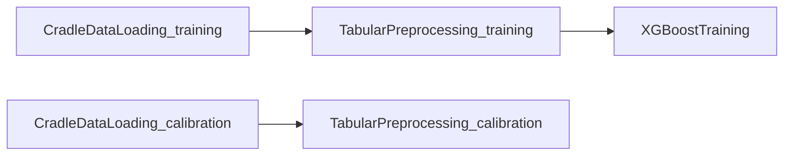

**Steps Involved**:
- **CradleDataLoading_training**: [Data Load Step](../steps/builders/data_load_step_cradle.md) | Contract: [Cradle Data Loading](../steps/contracts/cradle_data_loading_contract.md)
- **TabularPreprocessing_training**: [Tabular Preprocessing Step](../steps/builders/tabular_preprocessing_step.md) | Contract: [Tabular Preprocess](../steps/contracts/tabular_preprocess_contract.md)
- **XGBoostTraining**: [XGBoost Training Step](../steps/builders/training_step_xgboost.md) | Contract: [XGBoost Train](../steps/contracts/xgboost_train_contract.md)
- **CradleDataLoading_calibration**: Same as training variant
- **TabularPreprocessing_calibration**: Same as training variant

**Code References**:
- DAG Definition: `src/cursus/pipeline_catalog/shared_dags/xgboost/simple_dag.py`
- Builder: `src/cursus/steps/builders/builder_xgboost_training_step.py`
- Config: `src/cursus/steps/configs/config_xgboost_training_step.py`
- Spec: `src/cursus/steps/specs/xgboost_training_spec.py`
- Script: `dockers/xgboost_atoz/pipeline_scripts/xgboost_train.py`

**Unique Characteristics**:
- Minimal complexity for quick prototyping
- Separate calibration data preparation without evaluation
- No model deployment steps

---

#### xgboost_training_evaluation_dummy

**Purpose**: Training and evaluation workflow using dummy data loading instead of Cradle services.

**DAG Structure** (6 nodes, 5 edges):
```
Entry Points: DummyDataLoading_training, DummyDataLoading_evaluation
Exit Points: XGBoostModelEval

DummyDataLoading_training → TabularPreprocessing_training → XGBoostTraining → XGBoostModelEval
DummyDataLoading_evaluation → TabularPreprocessing_evaluation → XGBoostModelEval
```

**Mermaid Diagram**:
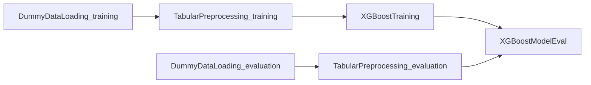

**Steps Involved**:
- **DummyDataLoading**: Dummy data loading for testing without external services
- **TabularPreprocessing**: [Tabular Preprocessing Step](../steps/builders/tabular_preprocessing_step.md)
- **XGBoostTraining**: [XGBoost Training Step](../steps/builders/training_step_xgboost.md)
- **XGBoostModelEval**: [XGBoost Model Eval Step](../steps/builders/model_eval_step_xgboost.md) | Script: [Model Evaluation](xgboost_model_eval_script.md)

**Code References**:
- DAG Definition: `src/cursus/pipeline_catalog/shared_dags/xgboost/training_with_evaluation_dummy_dag.py`

**Unique Characteristics**:
- No external service dependencies
- Ideal for testing and development
- Complete training and evaluation flow

---

### 1.2 Standard Pipelines

#### xgboost_training_evaluation

**Purpose**: Standard training workflow with model evaluation on separate dataset.

**DAG Structure** (6 nodes, 5 edges):
```
Entry Points: CradleDataLoading_training, CradleDataLoading_evaluation
Exit Points: XGBoostModelEval

Training Path: CradleDataLoading → TabularPreprocessing → XGBoostTraining
Evaluation Path: CradleDataLoading → TabularPreprocessing → XGBoostModelEval
Model Flow: XGBoostTraining → XGBoostModelEval
```

**Mermaid Diagram**:
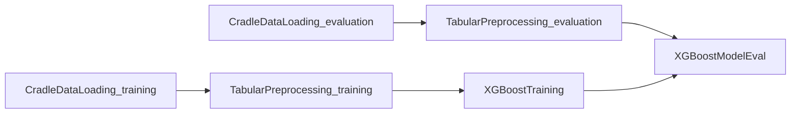

**Steps Involved**:
- **CradleDataLoading**: [Data Load Step](../steps/builders/data_load_step_cradle.md) (training & evaluation variants)
- **TabularPreprocessing**: [Tabular Preprocessing Step](../steps/builders/tabular_preprocessing_step.md) (training & evaluation variants)
- **XGBoostTraining**: [XGBoost Training Step](../steps/builders/training_step_xgboost.md)
- **XGBoostModelEval**: [XGBoost Model Eval Step](../steps/builders/model_eval_step_xgboost.md)

**Code References**:
- DAG Definition: `src/cursus/pipeline_catalog/shared_dags/xgboost/training_with_evaluation_dag.py`
- Config: `src/cursus/steps/configs/config_xgboost_model_eval_step.py`

**Unique Characteristics**:
- Separate evaluation dataset processing
- Model performance metrics generation
- Standard ML workflow pattern

---

#### xgboost_training_calibration

**Purpose**: Training workflow with model calibration for probability adjustment.

**DAG Structure** (6 nodes, 5 edges):
```
Entry Points: CradleDataLoading_training, CradleDataLoading_calibration
Exit Points: ModelCalibration_training

Training Flow: CradleDataLoading → TabularPreprocessing → XGBoostTraining → ModelCalibration
Calibration Data: CradleDataLoading → TabularPreprocessing → ModelCalibration
```

**Mermaid Diagram**:
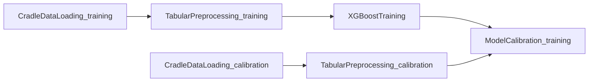

**Steps Involved**:
- **CradleDataLoading**: [Data Load Step](../steps/builders/data_load_step_cradle.md) (training & calibration variants)
- **TabularPreprocessing**: [Tabular Preprocessing Step](../steps/builders/tabular_preprocessing_step.md) (training & calibration variants)
- **XGBoostTraining**: [XGBoost Training Step](../steps/builders/training_step_xgboost.md)
- **ModelCalibration_training**: Model calibration step with training variant | Script: [Model Calibration](model_calibration_script.md)

**Code References**:
- DAG Definition: `src/cursus/pipeline_catalog/shared_dags/xgboost/training_with_calibration_dag.py`
- Builder: `src/cursus/steps/builders/builder_model_calibration_step.py`
- Config: `src/cursus/steps/configs/config_model_calibration_step.py`

**Unique Characteristics**:
- Probability calibration for better confidence estimates
- Separate calibration dataset
- Isotonic or Platt scaling

---

#### xgboost_training_calibration_fs

**Purpose**: Training with calibration and feature selection for enhanced model performance.

**DAG Structure** (8 nodes, 8 edges):
```
Entry Points: CradleDataLoading_training, CradleDataLoading_calibration
Exit Points: ModelCalibration_training

Training: DataLoad → Preprocess → FeatureSelection → Training → Calibration
Calibration: DataLoad → Preprocess → FeatureSelection → Calibration
Feature Selection Artifacts: FeatureSelection_training → FeatureSelection_calibration
```

**Mermaid Diagram**:
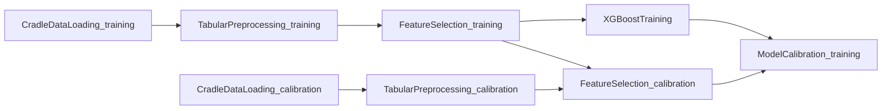

**Steps Involved**:
- **CradleDataLoading**: [Data Load Step](../steps/builders/data_load_step_cradle.md) (training & calibration variants)
- **TabularPreprocessing**: [Tabular Preprocessing Step](../steps/builders/tabular_preprocessing_step.md) (training & calibration variants)
- **FeatureSelection**: Feature selection step (training & calibration variants) | Design: [Feature Selection Design](../1_design/feature_selection_script_design.md)
- **XGBoostTraining**: [XGBoost Training Step](../steps/builders/training_step_xgboost.md)
- **ModelCalibration_training**: Model calibration step

**Code References**:
- DAG Definition: `src/cursus/pipeline_catalog/shared_dags/xgboost/training_with_calibration_fs_dag.py`
- Builder: `src/cursus/steps/builders/builder_feature_selection_step.py`
- Config: `src/cursus/steps/configs/config_feature_selection_step.py`

**Unique Characteristics**:
- Feature selection for dimensionality reduction
- Feature artifacts shared between training and calibration
- Improved model interpretability

---

#### xgboost_training_stratified

**Purpose**: Training with stratified sampling for balanced class distribution.

**DAG Structure** (7 nodes, 6 edges):
```
Entry Points: CradleDataLoading_training, CradleDataLoading_evaluation
Exit Points: XGBoostModelEval

Training: DataLoad → Preprocess → StratifiedSampling → Training → Eval
Evaluation: DataLoad → Preprocess → Eval
```

**Mermaid Diagram**:
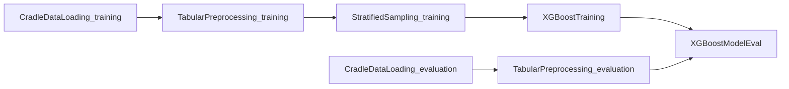

**Steps Involved**:
- **CradleDataLoading**: [Data Load Step](../steps/builders/data_load_step_cradle.md) (training & evaluation variants)
- **TabularPreprocessing**: [Tabular Preprocessing Step](../steps/builders/tabular_preprocessing_step.md) (training & evaluation variants)
- **StratifiedSampling_training**: Stratified sampling step for class balance
- **XGBoostTraining**: [XGBoost Training Step](../steps/builders/training_step_xgboost.md)
- **XGBoostModelEval**: [XGBoost Model Eval Step](../steps/builders/model_eval_step_xgboost.md)

**Code References**:
- DAG Definition: `src/cursus/pipeline_catalog/shared_dags/xgboost/training_with_stratified_dag.py`
- Builder: `src/cursus/steps/builders/builder_stratified_sampling_step.py`
- Config: `src/cursus/steps/configs/config_stratified_sampling_step.py`

**Unique Characteristics**:
- Stratified sampling for imbalanced datasets
- Multiple allocation strategies (proportional, equal, optimal)
- Improved model performance on minority classes

---

#### xgboost_complete_e2e_dummy

**Purpose**: Complete end-to-end pipeline with dummy data loading for testing.

**DAG Structure** (10 nodes, 11 edges):
```
Entry Points: DummyDataLoading_training, DummyDataLoading_calibration
Exit Points: Registration

Full workflow with dummy data: Training → Evaluation → Calibration → Package → Registration
```

**Mermaid Diagram**:
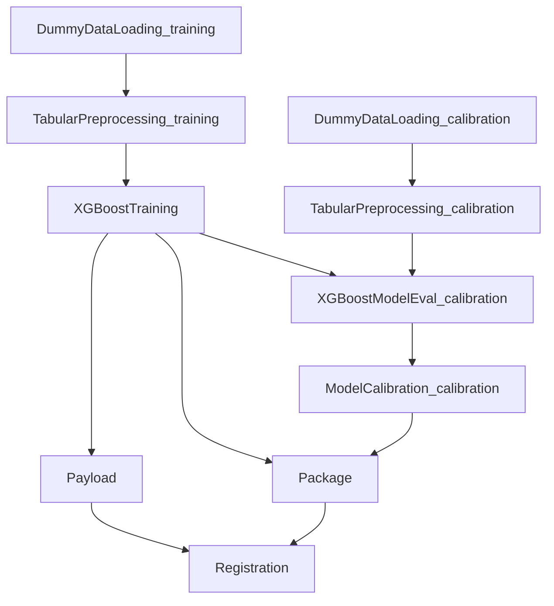

**Steps Involved**: All core pipeline steps with DummyDataLoading instead of CradleDataLoading

**Code References**:
- DAG Definition: `src/cursus/pipeline_catalog/shared_dags/xgboost/complete_e2e_dummy_dag.py`

**Unique Characteristics**:
- No external dependencies
- Full production workflow testing
- Deployment-ready structure

---

### 1.3 Advanced Pipelines

#### xgboost_training_preprocessing

**Purpose**: Training with advanced preprocessing including missing value imputation and risk table mapping.

**DAG Structure** (10 nodes, 11 edges):
```
Entry Points: CradleDataLoading_training, CradleDataLoading_evaluation
Exit Points: XGBoostModelEval

Training: DataLoad → Preprocess → MissingValueImputation → RiskTableMapping → Training → Eval
Evaluation: DataLoad → Preprocess → MissingValueImputation → RiskTableMapping → Eval
Preprocessing Artifacts: Training preprocessing → Evaluation preprocessing
```

**Mermaid Diagram**:
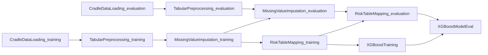

**Steps Involved**:
- **CradleDataLoading**: [Data Load Step](../steps/builders/data_load_step_cradle.md) (training & evaluation variants)
- **TabularPreprocessing**: [Tabular Preprocessing Step](../steps/builders/tabular_preprocessing_step.md) (training & evaluation variants)
- **MissingValueImputation**: Missing value imputation step (training & evaluation variants) | Design: [Missing Value Imputation Design](../1_design/missing_value_imputation_design.md)
- **RiskTableMapping**: [Risk Table Mapping Step](../steps/builders/risk_table_map_step.md) | Contract: [Risk Table Mapping](../steps/contracts/risk_table_mapping_contract.md) | Script: [Risk Table Mapping](risk_table_mapping_script.md)
- **XGBoostTraining**: [XGBoost Training Step](../steps/builders/training_step_xgboost.md)
- **XGBoostModelEval**: [XGBoost Model Eval Step](../steps/builders/model_eval_step_xgboost.md)

**Code References**:
- DAG Definition: `src/cursus/pipeline_catalog/shared_dags/xgboost/training_with_preprocessing_dag.py`
- Builder (Imputation): `src/cursus/steps/builders/builder_missing_value_imputation_step.py`
- Config (Imputation): `src/cursus/steps/configs/config_missing_value_imputation_step.py`
- Builder (Risk): `src/cursus/steps/builders/builder_risk_table_mapping_step.py`
- Config (Risk): `src/cursus/steps/configs/config_risk_table_mapping_step.py`

**Unique Characteristics**:
- Advanced data preprocessing pipeline
- Preprocessing artifacts shared across variants
- Statistical imputation and risk scoring

---

#### xgboost_training_feature_selection

**Purpose**: Comprehensive preprocessing with feature selection for optimal feature sets.

**DAG Structure** (12 nodes, 14 edges):
```
Entry Points: CradleDataLoading_training, CradleDataLoading_evaluation
Exit Points: XGBoostModelEval

Training: DataLoad → Preprocess → MissingValue → RiskTable → FeatureSelection → Training → Eval
Evaluation: DataLoad → Preprocess → MissingValue → RiskTable → FeatureSelection → Eval
Preprocessing Artifacts: Training steps → Evaluation steps
```

**Mermaid Diagram**:
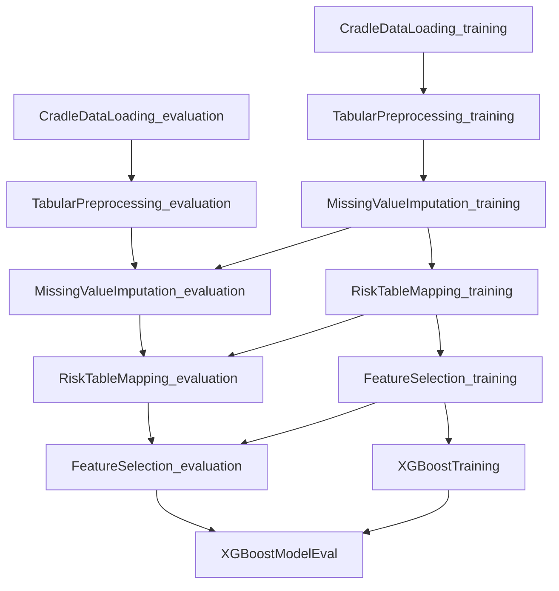

**Steps Involved**:
- All steps from training_with_preprocessing plus:
- **FeatureSelection**: Feature selection step (training & evaluation variants) | Design: [Feature Selection Design](../1_design/feature_selection_script_design.md)

**Code References**:
- DAG Definition: `src/cursus/pipeline_catalog/shared_dags/xgboost/training_with_feature_selection_dag.py`

**Unique Characteristics**:
- Complete preprocessing pipeline
- Multiple statistical and ML-based feature selection methods
- Ensemble combination strategies
- Maximum model performance optimization

---

### 1.4 Comprehensive Pipelines

#### xgboost_complete_e2e

**Purpose**: Complete production-ready end-to-end pipeline with training, evaluation, calibration, packaging, and registration.

**DAG Structure** (10 nodes, 11 edges):
```
Entry Points: CradleDataLoading_training, CradleDataLoading_calibration
Exit Points: Registration

Training → Evaluation → Calibration → Package → Payload → Registration
```

**Mermaid Diagram**:
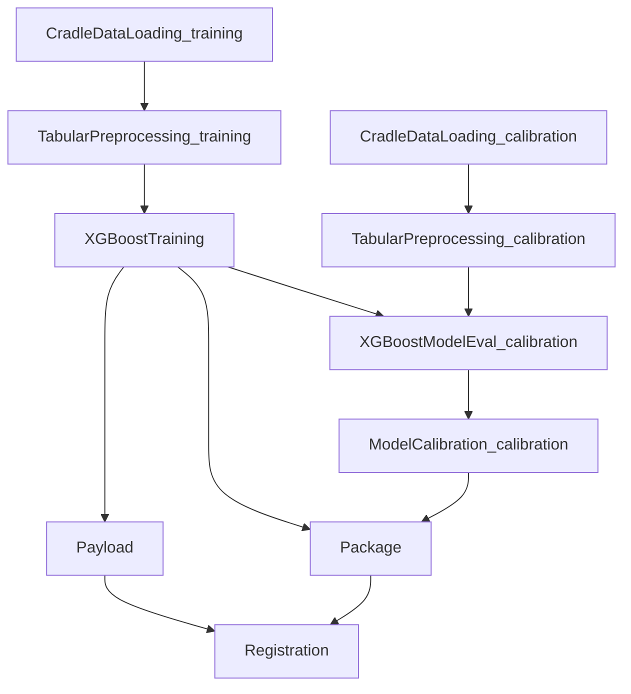

**Steps Involved**:
- **CradleDataLoading**: [Data Load Step](../steps/builders/data_load_step_cradle.md) (training & calibration variants)
- **TabularPreprocessing**: [Tabular Preprocessing Step](../steps/builders/tabular_preprocessing_step.md) (training & calibration variants)
- **XGBoostTraining**: [XGBoost Training Step](../steps/builders/training_step_xgboost.md)
- **XGBoostModelEval_calibration**: [XGBoost Model Eval Step](../steps/builders/model_eval_step_xgboost.md)
- **ModelCalibration_calibration**: Model calibration step | Script: [Model Calibration](model_calibration_script.md)
- **Package**: [MIMS Packaging Step](../steps/builders/mims_packaging_step.md) | Contract: [MIMS Package](../steps/contracts/mims_package_contract.md) | Script: [MIMS Package](package_script.md)
- **Payload**: [MIMS Payload Step](../steps/builders/mims_payload_step.md) | Contract: [MIMS Payload](../steps/contracts/mims_payload_contract.md) | Script: [MIMS Payload](payload_script.md)
- **Registration**: [MIMS Registration Step](../steps/builders/mims_registration_step.md) | Contract: [MIMS Registration](../steps/contracts/mims_registration_contract.md) | Script: [MODS MIMS Registration](mims_registration_script.md)

**Code References**:
- DAG Definition: `src/cursus/pipeline_catalog/shared_dags/xgboost/complete_e2e_dag.py`
- Pipeline Example: [XGBoost End-to-End Pipeline](../examples/mods_pipeline_xgboost_end_to_end.md)

**Unique Characteristics**:
- Production-ready deployment pipeline
- Model packaging and registration
- Payload testing for inference validation
- Complete MLOps workflow

---

#### xgboost_complete_e2e_wiki

**Purpose**: Complete pipeline with automated documentation generation using wiki generator.

**DAG Structure** (12 nodes, 13 edges):
```
Entry Points: CradleDataLoading_training, CradleDataLoading_calibration
Exit Points: Registration, ModelWikiGenerator

Full workflow with wiki: Training → Inference → Metrics → Wiki
Plus: Calibration → Package → Registration
```

**Mermaid Diagram**:
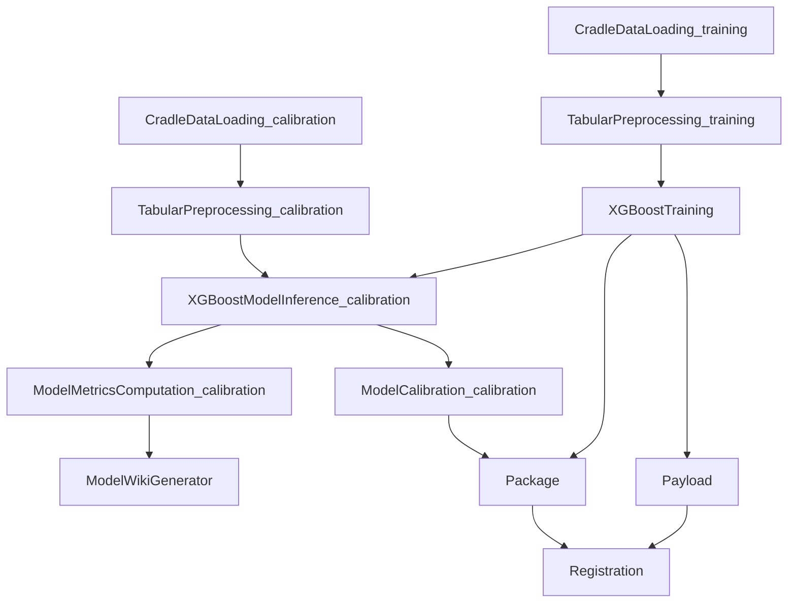

**Steps Involved**:
- All steps from complete_e2e plus:
- **XGBoostModelInference_calibration**: XGBoost model inference step | Design: [XGBoost Model Inference Design](../1_design/xgboost_model_inference_design.md)
- **ModelMetricsComputation_calibration**: Model metrics computation step | Design: [Model Metrics Computation Design](../1_design/model_metrics_computation_design.md)
- **ModelWikiGenerator**: Model wiki generator step | Design: [Model Wiki Generator Design](../1_design/model_wiki_generator_design.md)

**Code References**:
- DAG Definition: `src/cursus/pipeline_catalog/shared_dags/xgboost/complete_e2e_with_wiki_dag.py`

**Unique Characteristics**:
- Automated model documentation
- Separate inference and metrics computation
- Wiki page generation for model cards
- Enhanced model governance

---

#### xgboost_complete_e2e_testing

**Purpose**: Complete pipeline with both calibration path and testing path for comprehensive model validation.

**DAG Structure** (15 nodes, 16 edges):
```
Entry Points: CradleDataLoading_training, CradleDataLoading_calibration, CradleDataLoading_testing
Exit Points: Registration, XGBoostModelEval_calibration, ModelWikiGenerator

Calibration Path: Uses ModelCalibration (slower, calibrated output)
Testing Path: Skips ModelCalibration (faster, raw predictions)
```

**Mermaid Diagram**:
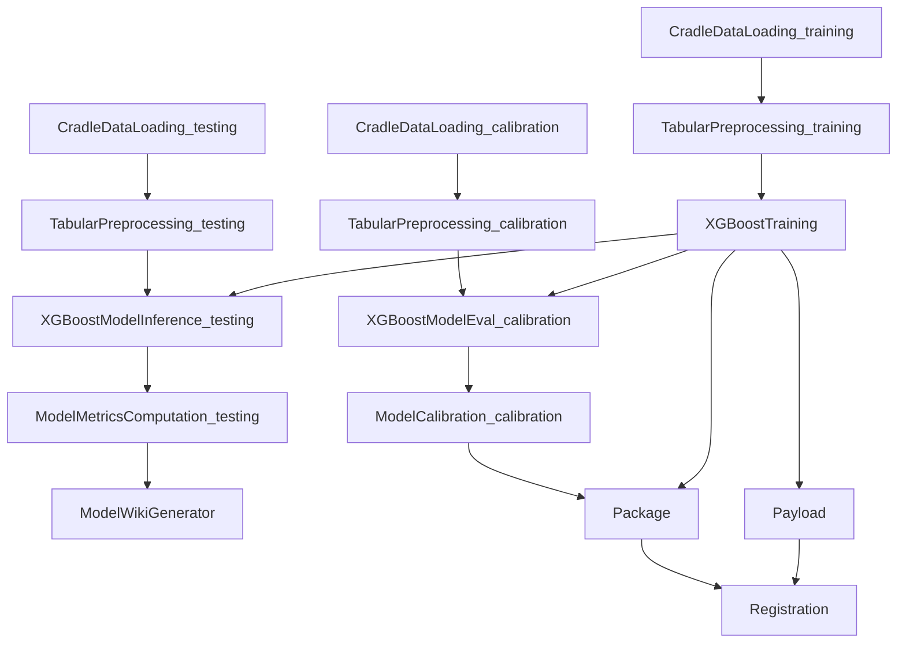

**Steps Involved**:
- All steps from complete_e2e_wiki plus:
- **CradleDataLoading_testing**: Additional testing data path
- **TabularPreprocessing_testing**: Testing data preprocessing
- **XGBoostModelInference_testing**: Testing path inference
- **ModelMetricsComputation_testing**: Testing path metrics

**Code References**:
- DAG Definition: `src/cursus/pipeline_catalog/shared_dags/xgboost/complete_e2e_with_testing_dag.py`

**Unique Characteristics**:
- Dual evaluation paths (calibration vs testing)
- Faster testing path without calibration overhead
- Comprehensive model validation
- Production and testing metrics comparison

---

#### xgboost_complete_e2e_percentile_calibration

**Purpose**: Complete pipeline with percentile-based model calibration for consistent risk interpretation.

**DAG Structure** (15 nodes, 16 edges):
```
Entry Points: CradleDataLoading_training, CradleDataLoading_calibration, CradleDataLoading_testing
Exit Points: Registration, XGBoostModelEval_calibration, ModelWikiGenerator

Uses PercentileModelCalibration instead of ModelCalibration
ROC curve analysis for percentile mapping
```

**Mermaid Diagram**:
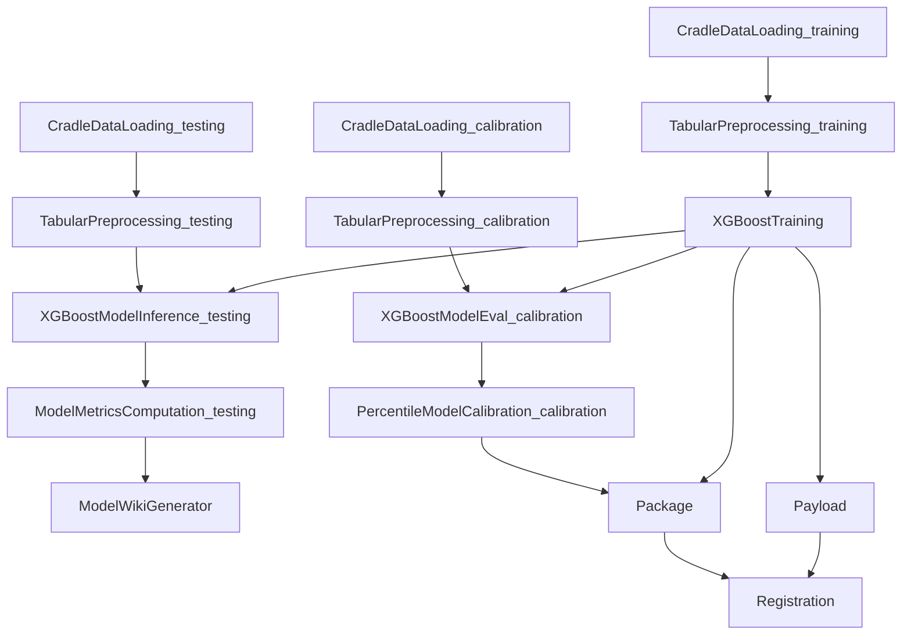

**Steps Involved**:
- All steps from complete_e2e_testing except:
- **PercentileModelCalibration_calibration**: Percentile model calibration step | Design: [Percentile Model Calibration Design](../1_design/percentile_model_calibration_design.md)

**Code References**:
- DAG Definition: `src/cursus/pipeline_catalog/shared_dags/xgboost/complete_e2e_with_percentile_calibration_dag.py`
- Builder: `src/cursus/steps/builders/builder_percentile_model_calibration_step.py`
- Config: `src/cursus/steps/configs/config_percentile_model_calibration_step.py`

**Unique Characteristics**:
- Percentile-based calibration using ROC analysis
- Consistent risk score interpretation across models
- Calibration path and testing path separation
- Better calibrated probability estimates

---

## 2. Common Pipeline Components

### 2.1 Core Steps

All XGBoost pipelines use a common set of core components. Below are the key steps with links to their documentation:

**Data Loading**
- [CradleDataLoading](../steps/builders/data_load_step_cradle.md) - Production data loading from Cradle services
- DummyDataLoading - Testing data loading for development

**Data Preprocessing**
- [TabularPreprocessing](../steps/builders/tabular_preprocessing_step.md) - Standard tabular data preprocessing
- [MissingValueImputation](../1_design/missing_value_imputation_design.md) - Statistical missing value handling
- [RiskTableMapping](../steps/builders/risk_table_map_step.md) - Risk score mapping for categorical features
- [FeatureSelection](../1_design/feature_selection_script_design.md) - Multiple feature selection methods
- [StratifiedSampling](../steps/builders/risk_table_map_step.md) - Stratified sampling for class balance

**Model Training**
- [XGBoostTraining](../steps/builders/training_step_xgboost.md) - XGBoost model training step

**Model Evaluation**
- [XGBoostModelEval](../steps/builders/model_eval_step_xgboost.md) - Combined inference and metrics
- [XGBoostModelInference](../1_design/xgboost_model_inference_design.md) - Standalone inference
- [ModelMetricsComputation](../1_design/model_metrics_computation_design.md) - Comprehensive metrics calculation

**Model Calibration**
- [ModelCalibration](model_calibration_script.md) - Standard probability calibration
- [PercentileModelCalibration](../1_design/percentile_model_calibration_design.md) - Percentile-based calibration

**Model Deployment**
- [Package](../steps/builders/mims_packaging_step.md) - Model packaging for deployment
- [Payload](../steps/builders/mims_payload_step.md) - Payload testing for inference validation
- [Registration](../steps/builders/mims_registration_step.md) - Model registration in MIMS

**Documentation**
- [ModelWikiGenerator](../1_design/model_wiki_generator_design.md) - Automated model documentation

### 2.2 Script Contracts

Script contracts define the interface between pipeline steps and their execution scripts:

- [Cradle Data Loading Contract](../steps/contracts/cradle_data_loading_contract.md)
- [Tabular Preprocess Contract](../steps/contracts/tabular_preprocess_contract.md)
- [XGBoost Train Contract](../steps/contracts/xgboost_train_contract.md)
- [Model Evaluation Contract](../steps/contracts/model_evaluation_contract.md)
- [Risk Table Mapping Contract](../steps/contracts/risk_table_mapping_contract.md)
- [MIMS Package Contract](../steps/contracts/mims_package_contract.md)
- [MIMS Payload Contract](../steps/contracts/mims_payload_contract.md)
- [MIMS Registration Contract](../steps/contracts/mims_registration_contract.md)

### 2.3 Configuration Classes

All XGBoost pipeline steps follow the three-tier configuration pattern:

**Core Configs**:
- `XGBoostTrainingConfig` - `src/cursus/steps/configs/config_xgboost_training_step.py`
- `XGBoostModelEvalConfig` - `src/cursus/steps/configs/config_xgboost_model_eval_step.py`
- `TabularPreprocessingConfig` - `src/cursus/steps/configs/config_tabular_preprocessing_step.py`
- `ModelCalibrationConfig` - `src/cursus/steps/configs/config_model_calibration_step.py`

**Design Reference**:
- [Three-Tier Config Design](../0_developer_guide/three_tier_config_design.md)
- [Config Manager Implementation](../1_design/config_manager_three_tier_implementation.md)

---

## 3. Design Documentation

### 3.1 Core Design Documents

**XGBoost-Specific Designs**:
- [XGBoost Model Inference Design](../1_design/xgboost_model_inference_design.md)
- [XGBoost Semi-Supervised Learning Pipeline Design](../1_design/xgboost_semi_supervised_learning_pipeline_design.md)
- [XGBoost Semi-Supervised Learning Training Design](../1_design/xgboost_semi_supervised_learning_training_design.md)
- [Active Sampling Step Builder Patterns](../1_design/active_sampling_step_patterns.md) - Complete step builder patterns for intelligent sample selection in semi-supervised and active learning pipelines with XGBoost
- [Pseudo Label Merge Script Design](../1_design/pseudo_label_merge_script_design.md) - Unified data combination engine for merging labeled and pseudo-labeled data in SSL pipelines with split-aware merge, auto-inferred split ratios, and format preservation
- [Simplified XGBoost Config Implementation Plan](../2_project_planning/2025-07-25_simplified_xgboost_config_implementation_plan.md)
- [Specification-Driven XGBoost Pipeline Plan](../2_project_planning/2025-07-04_specification_driven_xgboost_pipeline_plan.md)

**Pipeline Architecture**:
- [Abstract Pipeline Template Design](../2_project_planning/2025-07-09_abstract_pipeline_template_design.md)
- [Specification-Driven Step Builder Plan](../2_project_planning/2025-07-07_specification_driven_step_builder_plan.md)
- [DAG Config Factory Implementation Plan](../2_project_planning/2025-10-15_dag_config_factory_implementation_plan.md)

**Preprocessing & Feature Engineering**:
- [Missing Value Imputation Design](../1_design/missing_value_imputation_design.md)
- [Feature Selection Script Design](../1_design/feature_selection_script_design.md)
- [Temporal Sequence Normalization Design](../1_design/temporal_sequence_normalization_design.md)
- [Temporal Feature Engineering Design](../1_design/temporal_feature_engineering_design.md)

**Model Evaluation & Calibration**:
- [Model Metrics Computation Design](../1_design/model_metrics_computation_design.md)
- [Percentile Model Calibration Design](../1_design/percentile_model_calibration_design.md)
- [Model Wiki Generator Design](../1_design/model_wiki_generator_design.md)

### 3.2 Implementation Plans

**Phase Implementations**:
- [Phase 1 Solution Summary](../2_project_planning/phase1_solution_summary.md)
- [Phase 3 Completion Summary](../2_project_planning/2025-08-13_phase3_completion_summary.md)
- [Code Alignment Standardization Plan](../2_project_planning/2025-08-11_code_alignment_standardization_plan.md)

**Testing & Validation**:
- [Universal Step Builder Test Enhancement Plan](../2_project_planning/2025-08-07_universal_step_builder_test_enhancement_plan.md)
- [Pipeline Runtime Testing Implementation Plan](../2_project_planning/2025-09-30_pipeline_runtime_testing_step_catalog_integration_implementation_plan.md)
- [Alignment Validation Visualization Integration Plan](../2_project_planning/2025-08-15_alignment_validation_visualization_integration_plan.md)

---

## 4. Usage & Examples

### 4.1 Pipeline Examples

**Complete Examples**:
- [XGBoost End-to-End Pipeline](../examples/mods_pipeline_xgboost_end_to_end.md) - Full production workflow
- [XGBoost End-to-End Simple Pipeline](../examples/mods_pipeline_xgboost_end_to_end_simple.md) - Streamlined version

**Usage Patterns**:
```python
from cursus.pipeline_catalog.shared_dags.xgboost import create_xgboost_complete_e2e_dag
from cursus.api.factory import DAGConfigFactory

# Create DAG
dag = create_xgboost_complete_e2e_dag()

# Initialize factory
factory = DAGConfigFactory(dag)

# Set configurations for each step
factory.set_step_config("CradleDataLoading_training", config_training)
factory.set_step_config("TabularPreprocessing_training", config_preprocessing)
factory.set_step_config("XGBoostTraining", config_xgboost)

# Generate pipeline
pipeline = factory.generate_pipeline()
```

### 4.2 Developer Guides

**Step Development**:
- [Adding New Pipeline Step](../0_developer_guide/adding_new_pipeline_step.md)
- [Step Builder Guide](../0_developer_guide/step_builder.md)
- [Script Development Guide](../0_developer_guide/script_development_guide.md)
- [Script Contract Guide](../0_developer_guide/script_contract.md)
- [Step Specification Guide](../0_developer_guide/step_specification.md)

**Configuration**:
- [Config Field Manager Guide](../0_developer_guide/config_field_manager_guide.md)
- [Hyperparameter Class Guide](../0_developer_guide/hyperparameter_class.md)

---

## 5. Comparison: XGBoost vs Other Frameworks

### 5.1 XGBoost vs PyTorch Pipelines

| Aspect | XGBoost Pipelines | PyTorch Pipelines |
|--------|------------------|-------------------|
| **Framework** | Gradient boosting (tree-based) | Deep learning (neural networks) |
| **Pipeline Variants** | 13 variants | 7 variants |
| **Complexity Range** | Simple to Comprehensive | Standard to Complete |
| **Training Approach** | Built-in XGBoost estimator | Custom PyTorch training scripts |
| **Feature Engineering** | Heavy preprocessing emphasis | Embedding and transformation layers |
| **Calibration** | Standard + Percentile options | Standard calibration only |
| **Use Cases** | Tabular data, structured features | Sequential data, images, text |

### 5.2 Pipeline Complexity Comparison

**Simple Pipelines** (XGBoost: 2, PyTorch: 1):
- Minimal preprocessing
- Quick prototyping
- Development and testing

**Standard Pipelines** (XGBoost: 5, PyTorch: 2):
- Single enhancement feature
- Production-ready with constraints
- Focused optimization

**Advanced Pipelines** (XGBoost: 2, PyTorch: 1):
- Multiple preprocessing steps
- Feature engineering emphasis
- Performance optimization

**Comprehensive Pipelines** (XGBoost: 4, PyTorch: 3):
- Complete MLOps workflows
- Deployment and documentation
- Production-grade systems

---

## 6. Step Registry & Naming

### 6.1 XGBoost Step Names

All XGBoost-related steps registered in `src/cursus/registry/step_names_original.py`:

**Training Steps**:
- `XGBoostTraining` - SageMaker step type: Training
- `DummyTraining` - SageMaker step type: Processing (uses pretrained model)

**Evaluation Steps**:
- `XGBoostModelEval` - SageMaker step type: Processing
- `XGBoostModelInference` - SageMaker step type: Processing

**Model Steps**:
- `XGBoostModel` - SageMaker step type: CreateModel

**Related Documentation**:
- [Step Names Registry](../registry/step_names.md)
- [Builder Registry](../registry/builder_registry.md)
- [Hyperparameter Registry](../registry/hyperparameter_registry.md)

### 6.2 Hyperparameters

**XGBoost Hyperparameters Class**:
- Location: `src/cursus/steps/hyperparams/hyperparameters_xgboost.py`
- Base Class: `ModelHyperparameters`
- Registry Entry: `XGBoostHyperparameters`

**Key Parameters**:
- Boosting parameters: `num_round`, `eta`, `max_depth`, `subsample`
- Tree parameters: `min_child_weight`, `gamma`, `colsample_bytree`
- Regularization: `alpha`, `lambda`
- Objective functions: Binary/multiclass classification, regression

---

## 7. Related Documentation

### 7.1 Core Framework

- [Cursus Package Overview](./cursus_package_overview.md) - System architecture
- [Cursus Code Structure Index](./cursus_code_structure_index.md) - Code-to-doc mapping
- [Step Design and Documentation Index](./step_design_and_documentation_index.md) - All step types
- [Processing Steps Index](./processing_steps_index.md) - Processing steps catalog

### 7.2 Pipeline Catalogs

- [Core and MODS Systems Index](./core_and_mods_systems_index.md) - MODS integration
- [Pipeline Catalog README](../pipeline_catalog/README.md) - Pipeline catalog overview

### 7.3 Validation

- [Validation System Index](./validation_system_index.md) - Validation framework
- [Validation Framework Guide](../0_developer_guide/validation_framework_guide.md) - Validation usage

---

## 8. Quick Reference

### 8.1 Choosing a Pipeline Variant

**For Quick Prototyping**:
- Use `xgboost_simple` or `xgboost_training_evaluation_dummy`
- Minimal steps, fast iteration

**For Production Deployments**:
- Use `xgboost_complete_e2e` or `xgboost_complete_e2e_wiki`
- Full MLOps workflow with packaging and registration

**For Model Performance Optimization**:
- Use `xgboost_training_preprocessing` or `xgboost_training_feature_selection`
- Advanced preprocessing and feature engineering

**For Imbalanced Datasets**:
- Use `xgboost_training_stratified`
- Stratified sampling for class balance

**For Consistent Risk Interpretation**:
- Use `xgboost_complete_e2e_percentile_calibration`
- Percentile-based calibration

**For Comprehensive Validation**:
- Use `xgboost_complete_e2e_testing`
- Dual calibration/testing paths

### 8.2 Common Tasks

**Creating a New XGBoost Pipeline**:
1. Choose appropriate DAG variant
2. Load shared DAG: `from cursus.pipeline_catalog.shared_dags.xgboost import create_xgboost_<variant>_dag`
3. Configure each step with appropriate configs
4. Use `DAGConfigFactory` to generate pipeline

**Extending an Existing Pipeline**:
1. Load base DAG
2. Add custom steps using `dag.add_node()` and `dag.add_edge()`
3. Register custom step builders
4. Configure and generate pipeline

**Testing a Pipeline**:
1. Use dummy data variant for development
2. Validate with `validate_dag_structure()`
3. Check metadata with `get_dag_metadata()`
4. Run unit tests on individual steps

---

## Maintenance Notes

**Last Updated:** 2025-11-09

**Update Triggers**:
- New XGBoost pipeline variant implementation
- DAG structure changes
- Step additions or modifications
- Design document updates

**Maintenance Guidelines**:
- Keep DAG diagrams current with code
- Update step links when documentation moves
- Maintain consistency with PyTorch pipelines index
- Track new preprocessing steps
- Document unique characteristics clearly

---

## Statistics

**Pipeline Variants**: 13
- Simple: 2
- Standard: 5
- Advanced: 2
- Comprehensive: 4

**DAG Complexity Range**:
- Smallest: 5 nodes, 3 edges (xgboost_simple)
- Largest: 15 nodes, 16 edges (xgboost_complete_e2e_testing, xgboost_complete_e2e_percentile_calibration)

**Common Steps Across All Variants**:
- CradleDataLoading / DummyDataLoading: 13/13 pipelines
- TabularPreprocessing: 13/13 pipelines
- XGBoostTraining: 13/13 pipelines

**Unique Features**:
- Feature Selection: 2 variants
- Stratified Sampling: 1 variant
- Percentile Calibration: 1 variant
- Wiki Generation: 3 variants
- Dual Paths (Calibration/Testing): 2 variants
