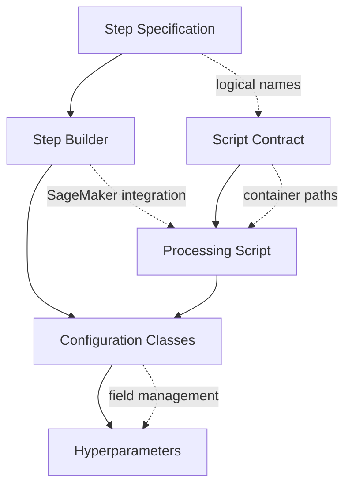

# Detailed Component Guide

This guide provides detailed information about the key components involved in creating a new pipeline step. Each component plays a specific role in the architecture, and understanding how they fit together is crucial for successful integration.

## Overview of Components

The pipeline architecture follows a specification-driven approach with a six-layer design:

1. **Step Specifications**: Define inputs and outputs with logical names
2. **Script Contracts**: Define container paths for script inputs/outputs
3. **Processing Scripts**: Implement SageMaker-compatible business logic with unified interface
4. **Step Builders**: Connect specifications and contracts via SageMaker with workspace-aware registration
5. **Configuration Classes**: Define three-tier config structure with field management
6. **Hyperparameters**: Define model-specific configuration parameters (for training steps)

## Component Relationships

The components are related as follows:

- **Step Specifications** define how steps connect with other steps in the pipeline using logical names
- **Script Contracts** define the interface between scripts and the SageMaker environment with container paths
- **Processing Scripts** implement the actual business logic and are executed in SageMaker containers
- **Step Builders** transform configurations and specifications into SageMaker steps with workspace-aware registration
- **Configuration Classes** define the three-tier config structure (Essential, System, Derived fields) with field management
- **Hyperparameters** (for training steps) define model-specific configuration parameters

## Detailed Component Guides

For detailed guidance on developing each component, refer to the following sections:

- [Script Contract Development](script_contract.md): How to create and validate script contracts
- [Step Specification Development](step_specification.md): How to define step specifications for pipeline integration
- [Processing Script Development](script_development_guide.md): How to develop SageMaker-compatible scripts with unified interface
- [Step Builder Implementation](step_builder.md): How to implement the builder that creates SageMaker steps
- [Configuration Classes Development](three_tier_config_design.md): How to implement three-tier config design with field management
- [Config Field Manager Guide](config_field_manager_guide.md): How to use the config field manager for advanced field handling
- [Adding a New Hyperparameter Class](hyperparameter_class.md): How to create custom hyperparameter classes for training steps

## Component Alignment

The alignment between components is crucial for successful integration:



**4-Tier Alignment Validation System**:
1. **Script-Contract Alignment**: Scripts must use exactly the paths and arguments defined in contracts
2. **Contract-Specification Alignment**: Contract input/output paths must have matching logical names in specifications
3. **Specification-Dependency Alignment**: Step specification dependencies must match upstream steps' outputs
4. **Builder-Configuration Alignment**: Step builders must use configuration values correctly and register with UnifiedRegistryManager

**Key Alignment Requirements**:
- **Unified Main Function Interface**: All scripts must implement the standardized main function signature
- **SageMaker Container Compatibility**: Scripts must work with standard container paths
- **Three-Tier Config Structure**: Configuration classes must follow Essential/System/Derived field classification
- **Config Field Management**: Proper use of ConfigFieldManager for field derivation and validation
- **Workspace-Aware Registration**: Step builders must register with appropriate workspace context
- **Property Path Consistency**: All property paths must be validated across the entire chain

## Validation and Testing

Each component should be validated using our comprehensive validation framework:

1. **Processing Scripts**: 
   - Unit test the main function with various inputs
   - Integration test in simulated container environment
   - Validate unified main function interface compliance

2. **Script Contracts**: 
   - Validate against actual script implementation
   - Check path alignment and argument consistency
   - Verify environment variable requirements

3. **Step Specifications**: 
   - Validate property path consistency and contract alignment
   - Check dependency chain integrity
   - Verify logical name consistency

4. **Step Builders**: 
   - Test input/output generation and environment variable handling
   - Validate workspace-aware registration
   - Check SageMaker step configuration

5. **Configuration Classes**: 
   - Validate three-tier config structure (Essential/System/Derived)
   - Test config field manager functionality
   - Check field derivation and validation logic

6. **Integration**: 
   - Test end-to-end integration with other steps
   - Run 4-tier alignment validation
   - Validate workspace-aware functionality

**Validation Commands**:
```bash
# Validate step alignment (4-tier validation)
cursus validate-alignment --step YourStepType --workspace your_workspace

# Run comprehensive builder tests
cursus validate-builder --step YourStepType --workspace your_workspace

# Validate registry integration
cursus validate-registry --workspace your_workspace
```

For comprehensive validation guidance, see the [Validation Framework Guide](validation_framework_guide.md).

For more details on specific components, refer to the relevant sections linked above.
