---
tags:
  - design
  - implementation
  - active_learning
  - active_sampling
  - script_separation
keywords:
  - active sampling
  - semi-supervised learning
  - uncertainty sampling
  - diversity sampling
  - BADGE
  - core-set
  - sample selection
topics:
  - active learning
  - sampling strategies
  - script modularity
  - sample selection
language: python
date of note: 2025-11-17
---

# Active Sampling Script Design

## What is the Purpose of the Active Sampling Script?

The Active Sampling Script serves as a **unified sample selection engine** supporting TWO distinct machine learning workflows:

### Use Case 1: Semi-Supervised Learning (SSL)
**Goal**: Select **high-confidence** predictions for automatic pseudo-labeling (no human intervention)

**Selection Criteria**: Confidence-based (select samples where model is certain)

**Downstream**: Pseudo-labels assigned → Combined with labeled data → Model fine-tuning

### Use Case 2: Active Learning (AL)
**Goal**: Select **most informative** samples for human labeling (maximize learning from limited human effort)

**Selection Criteria**: Uncertainty or diversity-based (select samples where model is uncertain or feature space is under-represented)

**Downstream**: Human labeling → Add to training set → Model retraining

---

**The core purpose is to:**
1. **Load inference results** - Access prediction scores and optional embeddings from upstream inference steps
2. **Apply appropriate strategies** - Execute confidence-based (SSL) OR uncertainty/diversity-based (AL) selection
3. **Select high-value samples** - Identify samples that maximize pseudo-labeling quality (SSL) or learning value (AL)
4. **Output structured selections** - Provide selected sample indices with metadata
5. **Prevent strategy misuse** - Validate strategy alignment with use case to avoid degraded model performance

**Upstream Inference Sources:**
The script accepts standardized inference outputs from:
- **Model Inference**: XGBoost, LightGBM, PyTorch model predictions
- **LLM Inference**: Bedrock batch processing, Bedrock processing outputs
- **Rule-Based Inference**: Label ruleset execution results

All sources provide compatible formats with ID, scores/probabilities, and optional embeddings.

## Core Design Principles

The Active Sampling Script is built on several key design principles:

1. **Strategy Modularity** - Pluggable sampling strategies (uncertainty, diversity, hybrid)
2. **Model Agnosticism** - Works with both deep learning and GBDT models
3. **Testability** - Clean separation of concerns following testability guidelines
4. **Format Flexibility** - Support multiple input/output formats (CSV/Parquet)
5. **Performance Optimization** - Efficient processing of large unlabeled pools
6. **Reproducibility** - Deterministic sample selection with seed control

## Architecture Overview

The active sampling script architecture consists of five main components:

```mermaid
graph TD
    subgraph "🔧 Data Loading Component"
        DataLoader["Inference Data Loader<br/>• Model inference outputs<br/>• LLM inference outputs<br/>• Ruleset execution outputs<br/>• Format detection (CSV/Parquet)"]
    end
    
    subgraph "🎯 Sampling Strategy Component"
        StrategyRouter["Strategy Router<br/>• Strategy selection<br/>• Configuration validation"]
        UncertaintySampler["Uncertainty Sampler<br/>• Margin sampling<br/>• Entropy sampling<br/>• Least confidence"]
        DiversitySampler["Diversity Sampler<br/>• Core-set selection<br/>• Leaf core-set<br/>• k-center algorithm"]
        HybridSampler["Hybrid Sampler<br/>• BADGE<br/>• Gradient embeddings<br/>• Combined scoring"]
    end
    
    subgraph "📊 Selection Engine Component"
        SelectionEngine["Selection Engine<br/>• Batch size management<br/>• Class balancing<br/>• Deduplication"]
    end
    
    subgraph "💾 Output Management Component"
        OutputManager["Output Manager<br/>• Selected indices<br/>• Selection metadata<br/>• Confidence scores<br/>• Format handling"]
    end
    
    DataLoader --> StrategyRouter
    StrategyRouter --> UncertaintySampler
    StrategyRouter --> DiversitySampler
    StrategyRouter --> HybridSampler
    UncertaintySampler --> SelectionEngine
    DiversitySampler --> SelectionEngine
    HybridSampler --> SelectionEngine
    SelectionEngine --> OutputManager
    
    subgraph "📊 Input Channel"
        InferenceData["Inference Data Channel<br/>/opt/ml/processing/input/inference_data<br/>• Inference predictions/scores<br/>• Prediction probabilities<br/>• Optional feature embeddings<br/>• From: XGBoost/LightGBM/PyTorch inference<br/>• From: Bedrock batch/processing<br/>• From: Label ruleset execution"]
    end
    
    subgraph "📈 Output Channel"
        OutputData["Selection Output<br/>/opt/ml/processing/output/selected_samples<br/>• Selected sample indices<br/>• Confidence scores<br/>• Selection metadata"]
    end
    
    InferenceData --> DataLoader
    OutputManager --> OutputData
```



## Core Components

### 1. Inference Data Loading Component

The loading component handles inference outputs from multiple sources:

```python
def load_inference_data(
    inference_data_dir: str,
    id_field: str = "id",
) -> pd.DataFrame:
    """
    Load inference data from various upstream sources.
    
    Supports inference outputs from:
    - XGBoost/LightGBM/PyTorch model inference
    - Bedrock batch processing / Bedrock processing
    - Label ruleset execution
    
    Args:
        inference_data_dir: Path to inference output data
        id_field: Name of ID column
        
    Returns:
        DataFrame with:
        - ID column
        - Feature columns (optional, depends on source)
        - Score/probability columns:
          * Model inference: prob_class_0, prob_class_1, ...
          * Bedrock/LLM: confidence_score, prediction_score, etc.
          * Ruleset: rule_score, label_confidence, etc.
        - Optional: embedding columns (emb_0, emb_1, ...)
    """
    # Auto-detect format
    csv_files = glob.glob(os.path.join(inference_data_dir, "*.csv"))
    parquet_files = glob.glob(os.path.join(inference_data_dir, "*.parquet"))
    
    if parquet_files:
        df = pd.read_parquet(parquet_files[0])
    elif csv_files:
        df = pd.read_csv(csv_files[0])
    else:
        raise FileNotFoundError(
            f"No inference data files found in {inference_data_dir}"
        )
    
    # Validate required columns
    if id_field not in df.columns:
        raise ValueError(f"ID field '{id_field}' not found in data")
    
    logger.info(f"Loaded inference data with shape {df.shape}")
    return df


def extract_score_columns(
    df: pd.DataFrame,
    score_field: Optional[str] = None,
    score_prefix: str = "prob_class_",
) -> List[str]:
    """
    Extract score columns from inference data based on configuration.
    
    Priority:
    1. If SCORE_FIELD specified, use that single column
    2. Otherwise, use SCORE_FIELD_PREFIX to find all matching columns
    3. Fall back to auto-detection if prefix doesn't match
    
    Args:
        df: DataFrame with inference data
        score_field: Single score column name (for binary or custom scoring)
        score_prefix: Prefix for finding multiple score columns
        
    Returns:
        List of score column names
        
    Raises:
        ValueError: If no valid score columns found
    """
    # Priority 1: Use explicit SCORE_FIELD if provided
    if score_field:
        if score_field in df.columns:
            logger.info(f"Using explicit score field: {score_field}")
            return [score_field]
        else:
            logger.warning(f"Specified SCORE_FIELD '{score_field}' not found in data")
    
    # Priority 2: Use SCORE_FIELD_PREFIX to find matching columns
    score_cols = [col for col in df.columns if col.startswith(score_prefix)]
    if score_cols:
        logger.info(f"Found {len(score_cols)} score columns with prefix '{score_prefix}': {score_cols}")
        return score_cols
    
    # Priority 3: Fall back to auto-detection
    logger.info(f"No columns found with prefix '{score_prefix}', attempting auto-detection")
    
    # Check for LLM/Bedrock format
    llm_patterns = ["confidence_score", "prediction_score", "score"]
    for pattern in llm_patterns:
        matching = [col for col in df.columns if pattern in col.lower()]
        if matching:
            logger.info(f"Auto-detected score columns: {matching}")
            return matching
    
    # Check for ruleset format
    rule_patterns = ["rule_score", "label_confidence", "label_score"]
    for pattern in rule_patterns:
        matching = [col for col in df.columns if pattern in col.lower()]
        if matching:
            logger.info(f"Auto-detected score columns: {matching}")
            return matching
    
    # Last resort: use all numeric columns
    numeric_cols = df.select_dtypes(include=[np.number]).columns.tolist()
    if numeric_cols:
        logger.warning(f"No standard score columns found. Using all numeric columns: {numeric_cols}")
        return numeric_cols
    
    raise ValueError(
        f"No valid score columns found. Tried: "
        f"SCORE_FIELD='{score_field}', "
        f"SCORE_FIELD_PREFIX='{score_prefix}', "
        f"auto-detection patterns"
    )


def normalize_scores_to_probabilities(
    df: pd.DataFrame,
    score_cols: List[str],
) -> pd.DataFrame:
    """
    Normalize various score formats to probability distributions.
    
    Handles:
    - Model probabilities (already normalized)
    - LLM confidence scores (may need normalization)
    - Rule-based scores (may need softmax)
    
    Args:
        df: DataFrame with score columns
        score_cols: List of score column names
        
    Returns:
        DataFrame with normalized prob_class_* columns
    """
    df_norm = df.copy()
    
    # Check if already in probability format
    if all(col.startswith("prob_class_") for col in score_cols):
        return df_norm
    
    # Extract scores
    scores = df[score_cols].values
    
    # Check if scores are already normalized (sum to ~1)
    row_sums = scores.sum(axis=1)
    if np.allclose(row_sums, 1.0, atol=0.01):
        # Already normalized probabilities
        pass
    else:
        # Apply softmax normalization
        exp_scores = np.exp(scores - scores.max(axis=1, keepdims=True))
        scores = exp_scores / exp_scores.sum(axis=1, keepdims=True)
    
    # Create standardized prob_class_* columns
    for i, col in enumerate(score_cols):
        df_norm[f"prob_class_{i}"] = scores[:, i]
    
    return df_norm
```

### 2. Sampling Strategy Component

The strategy component implements both simple and advanced sampling approaches:

#### 2.1 Simple Strategies (For SSL Baseline)

##### 2.1.1 Confidence Threshold Strategy

```python
class ConfidenceThresholdSampler:
    """Simple confidence-based selection for SSL pipelines."""
    
    def __init__(
        self,
        confidence_threshold: float = 0.9,
        max_samples: int = 0,
        random_seed: int = 42,
    ):
        self.confidence_threshold = confidence_threshold
        self.max_samples = max_samples
        self.random_seed = random_seed
    
    def select_batch(
        self,
        probabilities: np.ndarray,
        indices: Optional[np.ndarray] = None,
    ) -> np.ndarray:
        """
        Select samples where max probability exceeds threshold.
        
        Args:
            probabilities: Array of shape [N, C] with class probabilities
            indices: Optional array of valid indices
            
        Returns:
            Array of selected indices
        """
        if indices is None:
            indices = np.arange(len(probabilities))
        
        # Calculate max probability for each sample
        max_probs = np.max(probabilities, axis=1)
        
        # Select high-confidence samples
        high_conf_mask = max_probs >= self.confidence_threshold
        selected_indices = indices[high_conf_mask]
        
        # Limit sample count if specified
        if self.max_samples > 0 and len(selected_indices) > self.max_samples:
            # Sort by confidence and take top-k
            selected_probs = max_probs[high_conf_mask]
            top_k_idx = np.argsort(selected_probs)[-self.max_samples:][::-1]
            selected_indices = selected_indices[top_k_idx]
        
        return selected_indices
```

**Use case**: SSL pipelines where simple confidence filtering is sufficient

##### 2.1.2 Top-K Per Class Strategy

```python
class TopKPerClassSampler:
    """Balanced selection ensuring representation across classes."""
    
    def __init__(
        self,
        k_per_class: int = 100,
        random_seed: int = 42,
    ):
        self.k_per_class = k_per_class
        self.random_seed = random_seed
    
    def select_batch(
        self,
        probabilities: np.ndarray,
        indices: Optional[np.ndarray] = None,
    ) -> np.ndarray:
        """
        Select top-k most confident samples per predicted class.
        
        Args:
            probabilities: Array of shape [N, C] with class probabilities
            indices: Optional array of valid indices
            
        Returns:
            Array of selected indices (max k * n_classes samples)
        """
        if indices is None:
            indices = np.arange(len(probabilities))
        
        # Get predicted labels and confidences
        max_probs = np.max(probabilities, axis=1)
        pred_labels = np.argmax(probabilities, axis=1)
        
        # Select top-k per class
        selected = []
        for class_idx in range(probabilities.shape[1]):
            # Get samples predicted as this class
            class_mask = pred_labels == class_idx
            class_indices = indices[class_mask]
            class_probs = max_probs[class_mask]
            
            if len(class_indices) == 0:
                continue
            
            # Take top-k for this class
            k = min(self.k_per_class, len(class_indices))
            top_k_idx = np.argsort(class_probs)[-k:][::-1]
            selected.extend(class_indices[top_k_idx])
        
        return np.array(selected)
```

**Use case**: SSL pipelines with imbalanced classes requiring balanced pseudo-labeling

#### 2.2 Advanced Uncertainty Sampling

```python
class UncertaintySampler:
    """Uncertainty-based sampling strategies."""
    
    def __init__(
        self,
        strategy: str = "margin",  # "margin", "entropy", "least_confidence"
        random_seed: int = 42,
    ):
        self.strategy = strategy
        self.random_seed = random_seed
    
    def compute_scores(
        self,
        probabilities: np.ndarray,
    ) -> np.ndarray:
        """
        Compute uncertainty scores for each sample.
        
        Args:
            probabilities: Array of shape [N, C] with class probabilities
            
        Returns:
            Uncertainty scores [N] - higher is more uncertain
        """
        if self.strategy == "margin":
            # Margin: difference between top-2 probabilities
            sorted_probs = np.sort(probabilities, axis=1)
            margin = sorted_probs[:, -1] - sorted_probs[:, -2]
            scores = -margin  # Negative so higher = more uncertain
            
        elif self.strategy == "entropy":
            # Shannon entropy
            eps = 1e-10
            scores = -np.sum(
                probabilities * np.log(probabilities + eps), axis=1
            )
            
        elif self.strategy == "least_confidence":
            # 1 - max probability
            scores = 1 - np.max(probabilities, axis=1)
            
        else:
            raise ValueError(f"Unknown strategy: {self.strategy}")
        
        return scores
    
    def select_batch(
        self,
        probabilities: np.ndarray,
        batch_size: int,
        indices: Optional[np.ndarray] = None,
    ) -> np.ndarray:
        """
        Select batch of most uncertain samples.
        
        Returns:
            Array of selected indices
        """
        scores = self.compute_scores(probabilities)
        
        # Get top-k uncertain samples
        if indices is None:
            indices = np.arange(len(scores))
        
        top_k_idx = np.argsort(scores)[-batch_size:][::-1]
        return indices[top_k_idx]
```

#### 2.2 Diversity Sampling (Core-Set)

```python
class DiversitySampler:
    """Core-set and leaf core-set diversity sampling."""
    
    def __init__(
        self,
        metric: str = "euclidean",
        random_seed: int = 42,
    ):
        self.metric = metric
        self.random_seed = random_seed
    
    def select_batch(
        self,
        embeddings: np.ndarray,
        batch_size: int,
        indices: Optional[np.ndarray] = None,
    ) -> np.ndarray:
        """
        Select batch using k-center/farthest-first algorithm.
        
        Args:
            embeddings: Array of shape [N, D] with sample embeddings
            batch_size: Number of samples to select
            indices: Optional array of valid indices
            
        Returns:
            Array of selected indices
        """
        if indices is None:
            indices = np.arange(len(embeddings))
        
        n_samples = len(embeddings)
        selected = []
        
        # Initialize with random point
        np.random.seed(self.random_seed)
        first_idx = np.random.randint(n_samples)
        selected.append(first_idx)
        
        # Compute initial distances
        min_distances = self._compute_distances(
            embeddings, embeddings[first_idx:first_idx+1]
        ).flatten()
        
        # Iteratively select farthest points
        for _ in range(batch_size - 1):
            # Select point with maximum minimum distance
            farthest_idx = np.argmax(min_distances)
            selected.append(farthest_idx)
            
            # Update minimum distances
            new_distances = self._compute_distances(
                embeddings, embeddings[farthest_idx:farthest_idx+1]
            ).flatten()
            min_distances = np.minimum(min_distances, new_distances)
        
        return indices[np.array(selected)]
    
    def _compute_distances(
        self,
        X: np.ndarray,
        Y: np.ndarray,
    ) -> np.ndarray:
        """Compute pairwise distances between X and Y."""
        if self.metric == "euclidean":
            return np.sqrt(
                np.sum((X[:, None, :] - Y[None, :, :]) ** 2, axis=2)
            )
        elif self.metric == "cosine":
            X_norm = X / (np.linalg.norm(X, axis=1, keepdims=True) + 1e-10)
            Y_norm = Y / (np.linalg.norm(Y, axis=1, keepdims=True) + 1e-10)
            return 1 - np.dot(X_norm, Y_norm.T)
        else:
            raise ValueError(f"Unknown metric: {self.metric}")
```

#### 2.3 Hybrid Sampling (BADGE)

```python
class BADGESampler:
    """BADGE: Batch Active learning by Diverse Gradient Embeddings."""
    
    def __init__(
        self,
        metric: str = "euclidean",
        random_seed: int = 42,
    ):
        self.metric = metric
        self.random_seed = random_seed
        self.diversity_sampler = DiversitySampler(metric, random_seed)
    
    def compute_gradient_embeddings(
        self,
        features: np.ndarray,
        probabilities: np.ndarray,
    ) -> np.ndarray:
        """
        Compute gradient embeddings for BADGE.
        
        Args:
            features: Array of shape [N, D] with features or embeddings
            probabilities: Array of shape [N, C] with class probabilities
            
        Returns:
            Gradient embeddings of shape [N, C*D]
        """
        # Get pseudo-labels (argmax of probabilities)
        pseudo_labels = np.argmax(probabilities, axis=1)
        
        # Create one-hot encoding
        n_samples = len(probabilities)
        n_classes = probabilities.shape[1]
        one_hot = np.eye(n_classes)[pseudo_labels]
        
        # Compute gradient: (p - one_hot) ⊗ features
        delta = probabilities - one_hot  # [N, C]
        
        # Outer product: delta[:, :, None] * features[:, None, :]
        gradient_embeddings = (
            delta[:, :, None] * features[:, None, :]
        ).reshape(n_samples, -1)
        
        return gradient_embeddings
    
    def select_batch(
        self,
        features: np.ndarray,
        probabilities: np.ndarray,
        batch_size: int,
        indices: Optional[np.ndarray] = None,
    ) -> np.ndarray:
        """
        Select batch using BADGE algorithm.
        
        Returns:
            Array of selected indices
        """
        # Compute gradient embeddings
        gradient_embeddings = self.compute_gradient_embeddings(
            features, probabilities
        )
        
        # Use diversity sampling on gradient embeddings
        return self.diversity_sampler.select_batch(
            gradient_embeddings, batch_size, indices
        )
```

### 3. Selection Engine Component

The selection engine coordinates the sampling process:

```python
def select_samples(
    df: pd.DataFrame,
    strategy: str,
    batch_size: int,
    strategy_config: Dict[str, Any],
    id_field: str = "id",
) -> pd.DataFrame:
    """
    Main selection function coordinating all sampling strategies.
    
    Args:
        df: DataFrame with processed data and predictions
        strategy: "uncertainty", "diversity", "badge"
        batch_size: Number of samples to select
        strategy_config: Strategy-specific configuration
        id_field: Name of ID column
        
    Returns:
        DataFrame with selected samples including:
        - ID column
        - All original columns
        - selection_score: Strategy-specific score
        - selection_rank: Rank within batch (1 = highest priority)
    """
    # Extract probability columns
    prob_cols = [col for col in df.columns if col.startswith("prob_class_")]
    probabilities = df[prob_cols].values
    
    # Get indices
    indices = np.arange(len(df))
    
    # Apply sampling strategy
    if strategy == "confidence_threshold":
        # Simple strategy for SSL baseline
        sampler = ConfidenceThresholdSampler(
            confidence_threshold=strategy_config.get("confidence_threshold", 0.9),
            max_samples=strategy_config.get("max_samples", 0),
            random_seed=strategy_config.get("random_seed", 42),
        )
        selected_idx = sampler.select_batch(probabilities, indices)
        scores = np.max(probabilities, axis=1)  # Use max probability as score
        
    elif strategy == "top_k_per_class":
        # Simple strategy for balanced SSL
        sampler = TopKPerClassSampler(
            k_per_class=strategy_config.get("k_per_class", 100),
            random_seed=strategy_config.get("random_seed", 42),
        )
        selected_idx = sampler.select_batch(probabilities, indices)
        scores = np.max(probabilities, axis=1)  # Use max probability as score
        
    elif strategy == "uncertainty":
        # Advanced uncertainty strategy
        sampler = UncertaintySampler(
            strategy=strategy_config.get("uncertainty_mode", "margin"),
            random_seed=strategy_config.get("random_seed", 42),
        )
        selected_idx = sampler.select_batch(probabilities, batch_size, indices)
        scores = sampler.compute_scores(probabilities)
        
    elif strategy == "diversity":
        # Extract or compute embeddings
        emb_cols = [col for col in df.columns if col.startswith("emb_")]
        if emb_cols:
            embeddings = df[emb_cols].values
        else:
            # Use features as embeddings
            feature_cols = strategy_config.get("feature_columns", [])
            embeddings = df[feature_cols].values
        
        sampler = DiversitySampler(
            metric=strategy_config.get("metric", "euclidean"),
            random_seed=strategy_config.get("random_seed", 42),
        )
        selected_idx = sampler.select_batch(embeddings, batch_size, indices)
        scores = np.ones(len(df))  # Diversity doesn't have per-sample scores
        
    elif strategy == "badge":
        # Extract features or embeddings
        emb_cols = [col for col in df.columns if col.startswith("emb_")]
        if emb_cols:
            features = df[emb_cols].values
        else:
            feature_cols = strategy_config.get("feature_columns", [])
            features = df[feature_cols].values
        
        sampler = BADGESampler(
            metric=strategy_config.get("metric", "euclidean"),
            random_seed=strategy_config.get("random_seed", 42),
        )
        selected_idx = sampler.select_batch(
            features, probabilities, batch_size, indices
        )
        scores = np.ones(len(df))  # BADGE uses gradient embeddings internally
        
    else:
        raise ValueError(f"Unknown strategy: {strategy}")
    
    # Create output dataframe with selected samples
    selected_df = df.iloc[selected_idx].copy()
    selected_df["selection_score"] = scores[selected_idx]
    selected_df["selection_rank"] = np.arange(1, len(selected_idx) + 1)
    
    return selected_df
```

### 4. Output Management Component

The output component handles result formatting:

```python
def save_selected_samples(
    selected_df: pd.DataFrame,
    output_dir: str,
    output_format: str = "csv",
    metadata: Dict[str, Any] = None,
) -> str:
    """
    Save selected samples with metadata.
    
    Args:
        selected_df: DataFrame with selected samples
        output_dir: Output directory path
        output_format: "csv" or "parquet"
        metadata: Optional metadata dictionary
        
    Returns:
        Path to saved file
    """
    os.makedirs(output_dir, exist_ok=True)
    
    # Save selected samples
    if output_format.lower() == "parquet":
        output_path = os.path.join(output_dir, "selected_samples.parquet")
        selected_df.to_parquet(output_path, index=False)
    else:
        output_path = os.path.join(output_dir, "selected_samples.csv")
        selected_df.to_csv(output_path, index=False)
    
    # Save metadata
    if metadata:
        metadata_path = os.path.join(output_dir, "selection_metadata.json")
        with open(metadata_path, "w") as f:
            json.dump(metadata, f, indent=2)
    
    return output_path
```

## Script Testability Interface

Following the testability guidelines, the script implements a clean main interface:

```python
def main(
    input_paths: Dict[str, str],
    output_paths: Dict[str, str],
    environ_vars: Dict[str, str],
    job_args: argparse.Namespace,
) -> None:
    """
    Main function for active sample selection.
    
    Args:
        input_paths: Dictionary with keys:
            - inference_data: Path to inference outputs (predictions with scores)
        output_paths: Dictionary with keys:
            - selected: Path for selected samples output
        environ_vars: Dictionary with environment variables:
            - ID_FIELD: ID column name (default: "id")
            - STRATEGY: Sampling strategy (default: "uncertainty")
            - BATCH_SIZE: Number of samples to select (default: "32")
            - OUTPUT_FORMAT: Output format (default: "csv")
            - UNCERTAINTY_MODE: Uncertainty mode (default: "margin")
            - METRIC: Distance metric (default: "euclidean")
            - RANDOM_SEED: Random seed (default: "42")
        job_args: Command-line arguments:
            - job_type: Type of sampling job
    """
    # Extract configuration
    id_field = environ_vars.get("ID_FIELD", "id")
    strategy = environ_vars.get("STRATEGY", "confidence_threshold")
    use_case = environ_vars.get("USE_CASE", "auto")
    batch_size = int(environ_vars.get("BATCH_SIZE", "32"))
    output_format = environ_vars.get("OUTPUT_FORMAT", "csv")
    
    # Validate strategy for use case (optional safety check)
    validate_strategy_for_use_case(strategy, use_case)
    
    # Build strategy configuration based on strategy type
    strategy_config = {
        "random_seed": int(environ_vars.get("RANDOM_SEED", "42")),
    }
    
    # Add SSL-specific parameters
    if strategy in ["confidence_threshold", "top_k_per_class"]:
        strategy_config["confidence_threshold"] = float(
            environ_vars.get("CONFIDENCE_THRESHOLD", "0.9")
        )
        strategy_config["k_per_class"] = int(environ_vars.get("K_PER_CLASS", "100"))
        strategy_config["max_samples"] = int(environ_vars.get("MAX_SAMPLES", "0"))
    
    # Add Active Learning-specific parameters
    if strategy in ["uncertainty", "diversity", "badge"]:
        strategy_config["uncertainty_mode"] = environ_vars.get("UNCERTAINTY_MODE", "margin")
        strategy_config["metric"] = environ_vars.get("METRIC", "euclidean")
    
    # Load inference data
    logger.info(f"Loading inference data from {input_paths['inference_data']}")
    df = load_inference_data(input_paths["inference_data"], id_field)
    logger.info(f"Loaded {len(df)} samples from inference output")
    
    # Extract score columns based on configuration
    score_field = environ_vars.get("SCORE_FIELD")
    score_prefix = environ_vars.get("SCORE_FIELD_PREFIX", "prob_class_")
    
    logger.info(f"Extracting scores with SCORE_FIELD={score_field}, SCORE_FIELD_PREFIX={score_prefix}")
    score_cols = extract_score_columns(df, score_field, score_prefix)
    
    # Normalize scores to probabilities if needed
    if not all(col.startswith("prob_class_") for col in score_cols):
        logger.info(f"Normalizing {len(score_cols)} score columns to probabilities")
        df = normalize_scores_to_probabilities(df, score_cols)
        # Update score_cols to use normalized names
        score_cols = [col for col in df.columns if col.startswith("prob_class_")]
    
    # Detect feature columns for diversity/BADGE strategies
    feature_cols = [col for col in df.columns 
                   if col not in [id_field] + score_cols 
                   and not col.startswith("prob_class_")
                   and not col.startswith("emb_")]
    if feature_cols:
        strategy_config["feature_columns"] = feature_cols
        logger.info(f"Detected {len(feature_cols)} feature columns")
    
    # Select samples
    logger.info(f"Selecting {batch_size} samples using {strategy} strategy")
    selected_df = select_samples(
        df=df,
        strategy=strategy,
        batch_size=batch_size,
        strategy_config=strategy_config,
        id_field=id_field,
    )
    
    # Prepare metadata
    selection_metadata = {
        "strategy": strategy,
        "batch_size": batch_size,
        "total_pool_size": len(df),
        "selected_count": len(selected_df),
        "strategy_config": strategy_config,
        "timestamp": datetime.now().isoformat(),
    }
    
    # Save results
    logger.info(f"Saving selected samples to {output_paths['selected_samples']}")
    output_path = save_selected_samples(
        selected_df=selected_df,
        output_dir=output_paths["selected_samples"],
        output_format=output_format,
        metadata=selection_metadata,
    )
    logger.info(f"Selection complete. Output saved to {output_path}")


# Container path constants - aligned with script contract
CONTAINER_PATHS = {
    "INFERENCE_DATA_DIR": "/opt/ml/processing/input/inference_data",
    "SELECTED_SAMPLES_DIR": "/opt/ml/processing/output/selected_samples",
}


if __name__ == "__main__":
    # Parse command-line arguments
    parser = argparse.ArgumentParser(description="Active sample selection")
    parser.add_argument("--job_type", type=str, required=True,
                       help="Type of sampling job")
    args = parser.parse_args()
    
    # Set up paths using contract-defined paths
    input_paths = {
        "inference_data": CONTAINER_PATHS["INFERENCE_DATA_DIR"],
    }
    
    output_paths = {
        "selected_samples": CONTAINER_PATHS["SELECTED_SAMPLES_DIR"],
    }
    
    # Collect environment variables
    environ_vars = {
        "ID_FIELD": os.environ.get("ID_FIELD", "id"),
        "STRATEGY": os.environ.get("STRATEGY", "uncertainty"),
        "BATCH_SIZE": os.environ.get("BATCH_SIZE", "32"),
        "OUTPUT_FORMAT": os.environ.get("OUTPUT_FORMAT", "csv"),
        "UNCERTAINTY_MODE": os.environ.get("UNCERTAINTY_MODE", "margin"),
        "METRIC": os.environ.get("METRIC", "euclidean"),
        "RANDOM_SEED": os.environ.get("RANDOM_SEED", "42"),
        # Score field configuration
        "SCORE_FIELD": os.environ.get("SCORE_FIELD"),  # Optional: single score column
        "SCORE_FIELD_PREFIX": os.environ.get("SCORE_FIELD_PREFIX", "prob_class_"),  # Default: prob_class_*
    }
    
    # Ensure output directory exists
    os.makedirs(output_paths["selected_samples"], exist_ok=True)
    
    # Call main function
    main(input_paths, output_paths, environ_vars, args)
```

## Strategy Alignment and Use Case Validation

### ⚠️ Critical: Strategy-Use Case Compatibility

**Strategies are NOT interchangeable between workflows!** Using the wrong strategy for your use case will degrade model performance.

| Strategy | SSL | Active Learning | Selection Behavior |
|----------|-----|-----------------|-------------------|
| **confidence_threshold** | ✅ YES | ❌ NO | Selects HIGH confidence → Good for pseudo-labels, wastes human effort |
| **top_k_per_class** | ✅ YES | ❌ NO | Selects HIGH confidence per class → Balanced pseudo-labels |
| **uncertainty** | ❌ NO | ✅ YES | Selects LOW confidence → Bad for pseudo-labels, informative for humans |
| **diversity** | ⚠️ Rarely | ✅ YES | Selects diverse samples → Usually want confidence for SSL |
| **BADGE** | ❌ NO | ✅ YES | Selects uncertain+diverse → Same issue as uncertainty for SSL |

### Use Case Validation (Optional Safety Feature)

The script supports optional `USE_CASE` validation to prevent strategy misuse:

```python
# Environment variable
USE_CASE = os.environ.get("USE_CASE", "auto")  # "ssl", "active_learning", or "auto"

# Strategy validation
SSL_STRATEGIES = {"confidence_threshold", "top_k_per_class"}
ACTIVE_LEARNING_STRATEGIES = {"uncertainty", "diversity", "badge"}

def validate_strategy_for_use_case(strategy: str, use_case: str) -> None:
    """Prevent strategy misuse by validating against use case."""
    if use_case == "auto":
        return  # No validation - user takes responsibility
    
    if use_case == "ssl":
        if strategy not in SSL_STRATEGIES:
            raise ValueError(
                f"Strategy '{strategy}' is NOT valid for SSL! "
                f"SSL requires confidence-based strategies: {SSL_STRATEGIES}. "
                f"Strategy '{strategy}' selects UNCERTAIN samples, which create "
                f"noisy pseudo-labels and degrade model performance."
            )
    
    elif use_case == "active_learning":
        if strategy not in ACTIVE_LEARNING_STRATEGIES:
            raise ValueError(
                f"Strategy '{strategy}' is NOT recommended for Active Learning! "
                f"Active Learning uses: {ACTIVE_LEARNING_STRATEGIES}. "
                f"Strategy '{strategy}' selects CONFIDENT samples, which wastes "
                f"human labeling effort on easy samples."
            )
```

**Configuration Examples:**

```python
# SSL with validation (RECOMMENDED for production)
environ_vars = {
    "STRATEGY": "confidence_threshold",
    "USE_CASE": "ssl",  # ← Validates strategy is appropriate
    "CONFIDENCE_THRESHOLD": "0.9",
}

# Active Learning with validation
environ_vars = {
    "STRATEGY": "uncertainty",
    "USE_CASE": "active_learning",  # ← Validates strategy
    "UNCERTAINTY_MODE": "margin",
}

# No validation (for advanced users)
environ_vars = {
    "STRATEGY": "confidence_threshold",
    "USE_CASE": "auto",  # ← No validation
}
```

## Environment Variables and Configuration

### Required Environment Variables
- `ID_FIELD` - Column name for record identifiers (default: "id")
- `STRATEGY` - Sampling strategy (default: "confidence_threshold")
  - **SSL strategies**: "confidence_threshold", "top_k_per_class"
  - **Active Learning strategies**: "uncertainty", "diversity", "badge"
- `BATCH_SIZE` - Number of samples to select (default: "32")

### Optional Environment Variables

#### Use Case Validation
- `USE_CASE` - Optional use case validation: "ssl", "active_learning", or "auto" (default: "auto")
  - **"ssl"**: Validates strategy is confidence-based, prevents uncertainty strategies
  - **"active_learning"**: Validates strategy is uncertainty/diversity-based
  - **"auto"**: No validation, user takes responsibility

#### SSL-Specific Parameters (for confidence_threshold and top_k_per_class)
- `CONFIDENCE_THRESHOLD` - Minimum confidence for selection (default: "0.9", range: 0.5-1.0)
- `K_PER_CLASS` - Number of samples per class for top_k_per_class (default: "100")
- `MAX_SAMPLES` - Maximum samples to select for confidence_threshold (default: "0" = no limit)

#### Active Learning-Specific Parameters (for uncertainty, diversity, badge)
- `UNCERTAINTY_MODE` - For uncertainty strategy: "margin", "entropy", "least_confidence" (default: "margin")
- `METRIC` - Distance metric for diversity/BADGE: "euclidean", "cosine" (default: "euclidean")

#### Score Field Configuration
- `SCORE_FIELD` - Single score column name for binary classification or custom scoring (default: None)
  - If specified, uses this single column for scoring
  - Example: "prob_class_1" for binary, "confidence_score" for LLM
- `SCORE_FIELD_PREFIX` - Prefix for multiple score columns in multiclass (default: "prob_class_")
  - Used when SCORE_FIELD is not specified
  - Finds all columns starting with this prefix
  - Example: "prob_class_" matches "prob_class_0", "prob_class_1", etc.

#### Strategy Configuration
- `UNCERTAINTY_MODE` - For uncertainty strategy: "margin", "entropy", "least_confidence" (default: "margin")
- `METRIC` - Distance metric for diversity/BADGE: "euclidean", "cosine" (default: "euclidean")
- `RANDOM_SEED` - Random seed for reproducibility (default: "42")

#### Output Configuration
- `OUTPUT_FORMAT` - Output format: "csv" or "parquet" (default: "csv")
- `SAVE_METADATA` - Whether to save selection metadata (default: "true")

### Input/Output Channels

Following SageMaker processing container conventions:

**Input Channel**: `/opt/ml/processing/input/inference_data/`

#### Required for ALL Strategies
- **ID field**: Unique identifier for each sample (configurable via `ID_FIELD` env var)
- **Score/Probability columns**: Model predictions (configurable via `SCORE_FIELD` or `SCORE_FIELD_PREFIX`)

#### Strategy-Specific Requirements

**Uncertainty Sampling** (margin/entropy/least_confidence):
- ✅ **Required**: Probability columns (`prob_class_0`, `prob_class_1`, ...) OR single score column
- ❌ **Not needed**: Embeddings or features

**Diversity Sampling** (core-set):
- ✅ **Required**: Vector representations for distance computation
  - **Option A (Preferred)**: Embedding columns (`emb_0`, `emb_1`, ..., `emb_D`)
  - **Option B (Fallback)**: Feature columns (all numeric columns except ID and scores)
- ⚠️ **Quality note**: Embeddings provide better diversity signal than raw features

**BADGE Sampling** (hybrid):
- ✅ **Required**: Both probabilities AND vector representations
  - Probabilities: `prob_class_*` columns (for uncertainty)
  - Vectors: `emb_*` columns OR feature columns (for diversity)

#### Data Format Examples

**From Model Inference** (XGBoost/LightGBM/PyTorch):
```
predictions.csv or predictions.parquet
├── id                    # Unique identifier
├── feature_1             # Original features (preserved from input)
├── feature_2
├── ...
├── feature_N
├── prob_class_0          # Class 0 probability
├── prob_class_1          # Class 1 probability
├── prob_class_C          # Class C probability
├── emb_0                 # Optional: embedding dimension 0
├── emb_1                 # Optional: embedding dimension 1
├── ...
└── emb_D                 # Optional: embedding dimension D
```

**From LLM Inference** (Bedrock):
```
predictions.csv or predictions.parquet
├── id
├── text_feature          # Optional: input text
├── confidence_score      # Single confidence score
└── prediction_score      # Alternative score column
```

**From Ruleset Execution**:
```
ruleset_output.csv or ruleset_output.parquet
├── id
├── rule_features         # Optional: feature columns
├── rule_score            # Rule-based score
└── label_confidence      # Alternative score column
```

#### Embedding Column Format

For optimal diversity and BADGE sampling, inference scripts should output embeddings:

- **Naming convention**: `emb_0`, `emb_1`, ..., `emb_D` (where D is embedding dimension)
- **Data type**: float32 or float64
- **Dimension**: Typically 128-1024 for deep learning, 256-512 for GBDT leaf embeddings
- **Source**: 
  - Deep learning: Penultimate layer activations
  - GBDT: Leaf embeddings via `model.apply()` (optional enhancement)

**Output Channel**: `/opt/ml/processing/output/selected_samples/`
- selected_samples.csv or selected_samples.parquet
- selection_metadata.json
- Contains: all original columns plus selection_score and selection_rank

## Strategy Selection Guidelines

### When to Use Uncertainty Sampling
**Best for:**
- Initial rounds of active learning
- When model confidence is informative
- Balanced datasets
- Quick iterations needed

**Recommended modes:**
- **Margin**: Binary or multiclass with clear boundaries
- **Entropy**: High-class-count problems (>10 classes)
- **Least confidence**: Simple baseline, interpretable results

### When to Use Diversity Sampling
**Best for:**
- Avoiding redundant samples
- Exploring feature space coverage
- Imbalanced datasets
- When embeddings are available

**Requirements:**
- Quality embeddings (from model or features)
- Sufficient pool size (>10x batch size)

### When to Use BADGE
**Best for:**
- Combining uncertainty and diversity
- Deep learning models
- When gradients are meaningful
- Larger batch sizes (>50)

**Requirements:**
- Feature embeddings or representations
- Probability predictions
- Computational resources for gradient computation

## Integration with SSL Pipeline

### Upstream Dependencies
The active sampling script accepts inference outputs from:

1. **Model Inference Steps**:
   - XGBoostModelInference - Provides prob_class_* columns
   - LightGBMModelInference - Provides prob_class_* columns
   - PyTorchModelInference - Provides prob_class_* columns + optional embeddings

2. **LLM Inference Steps**:
   - BedrockBatchProcessing - Provides confidence_score or prediction_score
   - BedrockProcessing - Provides confidence_score or prediction_score

3. **Rule-Based Steps**:
   - LabelRulesetExecution - Provides rule_score or label_confidence

All sources must provide:
- ID column for sample identification
- Score/probability columns (naming conventions handled automatically)
- Optional: Feature columns or embeddings for diversity/BADGE strategies

### Downstream Integration
The active sampling output feeds into:
1. **PseudoLabelMerge** - Combines selected samples with labeled data
2. **Manual labeling systems** - For human-in-the-loop active learning
3. **Quality assessment** - For SSL evaluation and monitoring

### Pipeline Flow

```mermaid
graph LR
    subgraph "🎯 Inference Phase"
        ModelInference["Model Inference<br/>• XGBoost/LightGBM/PyTorch<br/>Outputs: predictions + prob_class_*"]
        LLMInference["LLM Inference<br/>• Bedrock Batch/Processing<br/>Outputs: predictions + confidence_score"]
        RulesetExec["Ruleset Execution<br/>• Label Ruleset<br/>Outputs: predictions + rule_score"]
    end
    
    subgraph "🔍 Selection Phase"
        ActiveSampling["Active Sampling<br/>Input: inference_data<br/>Strategies: uncertainty/diversity/BADGE<br/>Output: selected samples"]
    end
    
    subgraph "🔄 Merge Phase"
        PseudoLabel["PseudoLabelMerge<br/>Combines selected with labeled data"]
    end
    
    subgraph "🚀 Training Phase"
        Finetune["XGBoostTraining<br/>Fine-tune on combined data"]
    end
    
    ModelInference --> ActiveSampling
    LLMInference --> ActiveSampling
    RulesetExec --> ActiveSampling
    ActiveSampling --> PseudoLabel
    PseudoLabel --> Finetune
```


## Performance Considerations

### Memory Management
- **Embedding storage** - Consider dimensionality reduction for large pools
- **Batch processing** - Process large pools in chunks if needed
- **Distance computation** - Use approximate methods for very large pools

### Computational Efficiency
- **Strategy selection** - Uncertainty is fastest, BADGE most expensive
- **Pool size** - Consider pre-filtering for pools >100K samples
- **Seed selection** - Use deterministic seeding for reproducibility

### Scalability
- **Pool size limits**:
  - Uncertainty: Up to 1M samples
  - Diversity: Up to 100K samples (with approximate methods)
  - BADGE: Up to 50K samples (gradient computation overhead)

## Error Handling and Validation

### Input Validation
- **Data format validation** - Check for required columns and data types
- **Probability validation** - Verify probabilities sum to 1, range [0,1]
- **Embedding validation** - Check embedding dimensions if provided
- **Batch size validation** - Ensure batch_size <= pool_size

### Runtime Error Handling
- **Missing embeddings** - Fall back to feature-based embeddings
- **Invalid probabilities** - Normalize or skip invalid samples
- **Memory constraints** - Automatic chunking for large pools
- **Strategy failures** - Log detailed error messages with context

### Output Validation
- **Selection size** - Verify correct number of samples selected
- **Score validity** - Check for NaN/inf in selection scores
- **Deduplication** - Ensure no duplicate samples selected

## Testing Strategy

### Unit Testing
```python
def test_uncertainty_sampler():
    """Test uncertainty sampling with mock probabilities."""
    # Create mock probabilities
    probs = np.array([
        [0.9, 0.1],  # High confidence
        [0.5, 0.5],  # Low confidence (should be selected)
        [0.8, 0.2],  # Medium confidence
    ])
    
    sampler = UncertaintySampler(strategy="margin")
    selected_idx = sampler.select_batch(probs, batch_size=1)
    
    # Verify most uncertain sample selected
    assert selected_idx[0] == 1


def test_diversity_sampler():
    """Test diversity sampling with mock embeddings."""
    # Create mock embeddings (3 points in 2D)
    embeddings = np.array([
        [0, 0],      # Point 1
        [10, 10],    # Point 2 (far from 1)
        [0.1, 0.1],  # Point 3 (close to 1)
    ])
    
    sampler = DiversitySampler(metric="euclidean", random_seed=42)
    selected_idx = sampler.select_batch(embeddings, batch_size=2)
    
    # Verify diverse points selected (should get points 1 and 2, not 3)
    assert len(selected_idx) == 2
    assert 2 not in selected_idx or (0 in selected_idx and 1 in selected_idx)


def test_badge_sampler():
    """Test BADGE sampling with mock features and probabilities."""
    # Create mock features and probabilities
    features = np.array([
        [1.0, 0.0],
        [0.0, 1.0],
        [0.5, 0.5],
    ])
    probs = np.array([
        [0.9, 0.1],
        [0.1, 0.9],
        [0.5, 0.5],
    ])
    
    sampler = BADGESampler(random_seed=42)
    selected_idx = sampler.select_batch(features, probs, batch_size=2)
    
    # Verify selection returns correct batch size
    assert len(selected_idx) == 2
```

### Integration Testing
```python
def test_active_sampling_end_to_end():
    """Test complete active sampling workflow."""
    # Set up test data
    test_data = pd.DataFrame({
        "id": [1, 2, 3, 4, 5],
        "feature1": [1.0, 2.0, 3.0, 4.0, 5.0],
        "feature2": [5.0, 4.0, 3.0, 2.0, 1.0],
        "prob_class_0": [0.9, 0.7, 0.5, 0.3, 0.1],
        "prob_class_1": [0.1, 0.3, 0.5, 0.7, 0.9],
    })
    
    # Save test data
    input_dir = "test/input/processed_data"
    os.makedirs(input_dir, exist_ok=True)
    test_data.to_csv(os.path.join(input_dir, "predictions.csv"), index=False)
    
    # Set up test paths
    input_paths = {
        "inference_data": input_dir,
    }
    
    output_paths = {
        "selected_samples": "test/output/selected_samples",
    }
    
    # Set up environment variables
    environ_vars = {
        "ID_FIELD": "id",
        "STRATEGY": "uncertainty",
        "BATCH_SIZE": "2",
        "OUTPUT_FORMAT": "csv",
        "UNCERTAINTY_MODE": "margin",
        "METRIC": "euclidean",
        "RANDOM_SEED": "42",
    }
    
    # Create mock arguments
    args = argparse.Namespace()
    args.job_type = "ssl_selection"
    
    # Call main function
    from src.cursus.steps.scripts.active_sampling import main
    main(input_paths, output_paths, environ_vars, args)
    
    # Verify output
    output_path = os.path.join(output_paths["selected_samples"], "selected_samples.csv")
    assert os.path.exists(output_path)
    
    selected_df = pd.read_csv(output_path)
    assert len(selected_df) == 2
    assert "selection_score" in selected_df.columns
    assert "selection_rank" in selected_df.columns
```

### Validation Testing
```python
def test_strategy_consistency():
    """Test that same input produces same output with fixed seed."""
    probs = np.random.rand(100, 3)
    probs = probs / probs.sum(axis=1, keepdims=True)
    
    sampler1 = UncertaintySampler(strategy="margin", random_seed=42)
    sampler2 = UncertaintySampler(strategy="margin", random_seed=42)
    
    selected1 = sampler1.select_batch(probs, batch_size=10)
    selected2 = sampler2.select_batch(probs, batch_size=10)
    
    # Verify deterministic behavior
    assert np.array_equal(selected1, selected2)
```

## Migration and Implementation Plan

### Phase 1: Core Implementation (Weeks 1-2)
- [ ] Implement uncertainty sampling (margin, entropy, least confidence)
- [ ] Implement data loading and preprocessing
- [ ] Implement output management
- [ ] Write unit tests for uncertainty sampling

### Phase 2: Diversity Sampling (Weeks 3-4)
- [ ] Implement core-set k-center algorithm
- [ ] Implement embedding extraction utilities
- [ ] Optimize distance computations
- [ ] Write unit tests for diversity sampling

### Phase 3: BADGE Implementation (Weeks 5-6)
- [ ] Implement gradient embedding computation
- [ ] Integrate with diversity sampler
- [ ] Optimize for large-scale problems
- [ ] Write unit tests for BADGE

### Phase 4: Integration and Testing (Weeks 7-8)
- [ ] Integrate with SSL pipeline
- [ ] Write integration tests
- [ ] Performance optimization
- [ ] Documentation and examples

### Phase 5: Validation and Deployment (Weeks 9-10)
- [ ] Validation on real datasets
- [ ] Comparison with baselines
- [ ] Production deployment
- [ ] Monitoring and maintenance setup

## Future Enhancements

### Near Term (Next 3 months)
- **Class balancing** - Enforce per-class quotas in selection
- **Hybrid strategies** - Combine multiple strategies with weighting
- **Batch mode optimization** - Parallel processing for large pools
- **Advanced metrics** - Additional uncertainty measures (BALD, variation ratios)

### Medium Term (3-6 months)
- **Iterative selection** - Multi-round active learning workflows
- **Transfer learning** - Use pretrained embeddings for better diversity
- **Ensemble methods** - Committee-based disagreement sampling
- **Adaptive strategies** - Automatic strategy selection based on pool characteristics

### Long Term (6+ months)
- **Deep active learning** - Integration with deep learning frameworks
- **Online learning** - Streaming active learning for continuous updates
- **Meta-learning** - Learn optimal sampling strategies from past experiments
- **Multi-task sampling** - Simultaneous selection for multiple tasks

## References

- [Active Sampling BADGE Design](active_sampling_badge.md) - BADGE algorithm details
- [Active Sampling Core-Set Design](active_sampling_core_set_leaf_core_set.md) - Diversity sampling details
- [Active Sampling Uncertainty Design](active_sampling_uncertainty_margin_entropy.md) - Uncertainty sampling details
- [XGBoost Semi-Supervised Learning Pipeline](xgboost_semi_supervised_learning_pipeline_design.md) - SSL pipeline architecture
- [Script Testability Implementation](../0_developer_guide/script_testability_implementation.md) - Testability guidelines
- [XGBoost Model Inference Design](xgboost_model_inference_design.md) - Inference script patterns
- [Script Contract](../0_developer_guide/script_contract.md) - Script execution contracts
