---
tags:
  - design
  - agentic_workflow
  - llm_developer
  - automation
  - validation
keywords:
  - agentic workflow
  - planner agent
  - validator agent
  - programmer agent
  - human-in-the-loop
  - step development
  - automated validation
  - code generation
topics:
  - agentic system design
  - automated development workflow
  - multi-agent collaboration
  - pipeline step creation
language: python
date of note: 2025-08-09
---

# Agentic Workflow Design for Pipeline Step Development

## Overview

This document defines a comprehensive agentic workflow system for automated pipeline step development in the cursus framework. The system employs a multi-agent approach with human-in-the-loop validation to ensure high-quality, compliant pipeline step implementations.

## System Architecture

### Agent Roles

The agentic workflow consists of **four primary roles**:

1. **Planner Agent**: Proposes and revises implementation plans for complex pipeline step development tasks
2. **Validator Agent**: Reviews plans and code with adaptive validation approaches:
   - **Plan Validation** (Steps 2, 4): Level 1 validation only (LLM-based analysis)
   - **Code Validation** (Steps 7, 9): Two-level validation (LLM analysis + deterministic tools)
3. **Programmer Agent**: Executes validated plans to generate production-ready code
4. **User (Human-in-the-Loop)**: Provides requirements, guidance, and final approval

### Workflow Phases

The workflow operates in **two main phases**:

**Phase 1: Plan Development and Validation** (Steps 1-5)
- Iterative plan creation and validation
- Human guidance on requirements and documentation locations
- Convergence to a validated, implementable plan

**Phase 2: Code Implementation and Validation** (Steps 6-9)
- Code generation based on validated plan
- Two-level code validation with tool integration
- Iterative code refinement until validation passes

### Workflow Diagram

```mermaid
flowchart TD
    %% User Input
    A[User Requirements<br/>Step Type & Documentation Locations] --> B[Step 1: Initial Planning]
    
    %% Phase 1: Plan Development and Validation
    subgraph Phase1 ["Phase 1: Plan Development & Validation"]
        B[Step 1: Initial Planning<br/>Agent: Planner<br/>Template: initial_planner_prompt_template.md] --> C[Step 2: Plan Validation<br/>Agent: Validator<br/>Template: plan_validator_prompt_template.md]
        
        C --> D{Validation<br/>Passed?}
        D -->|No| E[Step 3: Plan Revision<br/>Agent: Planner<br/>Template: revision_planner_prompt_template.md]
        E --> F[Step 4: Iterative Validation<br/>Agent: Validator<br/>Template: plan_validator_prompt_template.md]
        F --> G{All Issues<br/>Resolved?}
        G -->|No| E
        G -->|Yes| H[Step 5: Plan Convergence<br/>✓ Alignment Score ≥ 9/10<br/>✓ Standardization Score ≥ 8/10<br/>✓ Compatibility Score ≥ 8/10]
        D -->|Yes| H
    end
    
    %% Phase 2: Code Implementation and Validation
    subgraph Phase2 ["Phase 2: Code Implementation & Validation"]
        H --> I[Step 6: Code Implementation<br/>Agent: Programmer<br/>Template: programmer_prompt_template.md]
        
        I --> J[Step 7: Code Validation<br/>Agent: Validator<br/>Templates:<br/>• two_level_validation_agent_prompt_template.md<br/>• two_level_standardization_validation_agent_prompt_template.md]
        
        J --> K{Validation<br/>Passed?}
        K -->|No| L[Step 8: Code Refinement<br/>Agent: Programmer<br/>Template: code_refinement_programmer_prompt_template.md]
        L --> M[Step 9: Validation Convergence<br/>Agent: Validator<br/>Repeat Step 7 Templates]
        M --> N{All Validations<br/>Pass?}
        N -->|No| L
        N -->|Yes| O[✅ Production Ready Implementation]
        K -->|Yes| O
    end
    
    %% Human-in-the-Loop Integration
    P[👤 Human Review & Approval] -.-> C
    P -.-> F
    P -.-> J
    P -.-> M
    P -.-> O
    
    %% Styling
    classDef plannerAgent fill:#e1f5fe,stroke:#01579b,stroke-width:2px
    classDef validatorAgent fill:#f3e5f5,stroke:#4a148c,stroke-width:2px
    classDef programmerAgent fill:#e8f5e8,stroke:#1b5e20,stroke-width:2px
    classDef userInput fill:#fff3e0,stroke:#e65100,stroke-width:2px
    classDef decision fill:#ffecb3,stroke:#f57f17,stroke-width:2px
    classDef success fill:#c8e6c9,stroke:#2e7d32,stroke-width:3px
    classDef phase fill:#f5f5f5,stroke:#424242,stroke-width:2px,stroke-dasharray: 5 5
    
    class B,E plannerAgent
    class C,F,J,M validatorAgent
    class I,L programmerAgent
    class A,P userInput
    class D,G,K,N decision
    class O success
```



### Workflow Legend

| Agent Type | Color | Templates Used |
|------------|-------|----------------|
| 🎯 **Planner Agent** | Blue | `initial_planner_prompt_template.md`<br/>`revision_planner_prompt_template.md` |
| 🔍 **Validator Agent** | Purple | `plan_validator_prompt_template.md`<br/>`two_level_validation_agent_prompt_template.md`<br/>`two_level_standardization_validation_agent_prompt_template.md` |
| 💻 **Programmer Agent** | Green | `programmer_prompt_template.md`<br/>`code_refinement_programmer_prompt_template.md` |
| 👤 **Human-in-the-Loop** | Orange | Requirements, Reviews, Approvals |

## Detailed Workflow Steps

### Step 1: Initial Planning

**Agent**: Planner  
**Input**: User requirements and step categorization  
**Output**: Initial implementation plan  

The Planner agent creates the initial implementation plan using the enhanced `initial_planner_prompt_template.md`:

**Template Enhancement Requirements**:
- Fill knowledge blanks by referencing:
  
  **Developer Guide Documents**:
  - `slipbox/0_developer_guide/creation_process.md` - Step creation workflow and process
  - `slipbox/0_developer_guide/prerequisites.md` - Prerequisites for step development
  - `slipbox/0_developer_guide/alignment_rules.md` - Critical alignment requirements
  - `slipbox/0_developer_guide/standardization_rules.md` - Naming and interface standards
  - `slipbox/0_developer_guide/design_principles.md` - Architectural principles
  - `slipbox/0_developer_guide/adding_new_pipeline_step.md` - Step addition guidelines
  - `slipbox/0_developer_guide/step_builder.md` - Step builder implementation guide
  - `slipbox/0_developer_guide/step_specification.md` - Step specification design guide
  - `slipbox/0_developer_guide/script_contract.md` - Script contract design guide
  - `slipbox/0_developer_guide/three_tier_config_design.md` - Configuration design patterns
  
  **Design Pattern Documents**:
  - `slipbox/1_design/processing_step_builder_patterns.md` - Processing step patterns
  - `slipbox/1_design/training_step_builder_patterns.md` - Training step patterns
  - `slipbox/1_design/createmodel_step_builder_patterns.md` - Model creation patterns
  - `slipbox/1_design/transform_step_builder_patterns.md` - Transform step patterns
  - `slipbox/1_design/step_builder_patterns_summary.md` - Summary of all patterns
  - `slipbox/1_design/specification_driven_design.md` - Specification-driven architecture
  - `slipbox/1_design/step_builder_registry_design.md` - Registry design patterns
  
  **Implementation Examples**:
  - `src/cursus/steps/builders/` - Existing step builder implementations
  - `src/cursus/steps/configs/` - Configuration class examples
  - `src/cursus/steps/specs/` - Step specification examples
  - `src/cursus/steps/contracts/` - Script contract examples
  - `src/cursus/steps/scripts/` - Processing script examples
  - `src/cursus/steps/registry/step_names.py` - Step registration patterns

- Add user input fields for:
  - Initial step requirements and description
  - SageMaker step type categorization ('Processing', 'Training', 'Transform', 'CreateModel', etc.)
  - Documentation location for the plan
  - Reference to appropriate design patterns (e.g., `processing_step_builder_patterns.md`, `training_step_builder_patterns.md`)

**Key Planning Considerations**:
- Step type classification drives design pattern selection
- Alignment rules compliance from the start
- Integration with existing pipeline components
- Dependency resolution compatibility

### Step 2: Plan Validation

**Agent**: Validator  
**Input**: Initial implementation plan  
**Output**: Validation report with issues and recommendations  

The Validator agent reviews the plan using the enhanced `plan_validator_prompt_template.md`:

**Important Note**: Plan validation uses **Level 1 validation only** (LLM-based analysis) because code-based validation tools cannot be applied to plans without actual program code. Two-level validation is reserved for Step 7 (Code Validation).

**Template Enhancement Requirements**:
- Fill knowledge blanks by referencing:
  
  **Developer Guide Documents**:
  - `slipbox/0_developer_guide/alignment_rules.md` - Critical alignment requirements
  - `slipbox/0_developer_guide/standardization_rules.md` - Naming and interface standards
  - `slipbox/0_developer_guide/common_pitfalls.md` - Known issues to avoid
  - `slipbox/0_developer_guide/validation_checklist.md` - Comprehensive validation requirements
  - `slipbox/0_developer_guide/design_principles.md` - Architectural principles
  - `slipbox/0_developer_guide/best_practices.md` - Development best practices
  
  **Design Pattern Documents**:
  - `slipbox/1_design/processing_step_builder_patterns.md` - Processing step validation patterns
  - `slipbox/1_design/training_step_builder_patterns.md` - Training step validation patterns
  - `slipbox/1_design/createmodel_step_builder_patterns.md` - Model creation validation patterns
  - `slipbox/1_design/transform_step_builder_patterns.md` - Transform step validation patterns
  - `slipbox/1_design/dependency_resolver.md` - Dependency resolution patterns
  - `slipbox/1_design/unified_alignment_tester_design.md` - Alignment validation framework
  - `slipbox/1_design/enhanced_dependency_validation_design.md` - Dependency validation patterns
  
  **Validation Framework Documents**:
  - `slipbox/1_design/two_level_alignment_validation_system_design.md` - Two-level validation system (for reference)
  - `slipbox/1_design/universal_step_builder_test.md` - Universal testing framework (for reference)
  - `slipbox/1_design/sagemaker_step_type_classification_design.md` - Step type validation
  
  **Implementation Examples**:
  - `src/cursus/steps/builders/` - Builder implementations for pattern validation
  - `src/cursus/steps/configs/` - Configuration validation examples
  - `src/cursus/steps/specs/` - Specification validation examples
  - `src/cursus/steps/contracts/` - Contract validation examples

- Add user input field for validation report location
- Implement **Level 1 validation process only**:
  - **Level 1**: LLM-based architectural analysis and pattern recognition
  - Focus on design coherence, architectural soundness, and pattern compliance
  - Assess alignment rule adherence at the design level
  - Evaluate standardization compliance in the planned approach

**Validation Focus Areas**:
- Specification design validation
- Contract design validation  
- Builder design validation
- Cross-component compatibility
- Alignment rules adherence (design level)
- Standardization rules compliance (design level)
- Architectural pattern consistency
- Integration feasibility assessment

### Step 3: Plan Revision

**Agent**: Planner  
**Input**: Validation report and original plan  
**Output**: Revised implementation plan  

The Planner agent revises the plan using the enhanced `revision_planner_prompt_template.md`:

**Template Enhancement Requirements**:
- Fill knowledge blanks by referencing:
  
  **Developer Guide Documents** (same as Step 1):
  - `slipbox/0_developer_guide/creation_process.md` - Step creation workflow and process
  - `slipbox/0_developer_guide/alignment_rules.md` - Critical alignment requirements
  - `slipbox/0_developer_guide/standardization_rules.md` - Naming and interface standards
  - `slipbox/0_developer_guide/design_principles.md` - Architectural principles
  - `slipbox/0_developer_guide/common_pitfalls.md` - Issues to avoid during revision
  - `slipbox/0_developer_guide/best_practices.md` - Development best practices
  
  **Design Pattern Documents** (same as Step 1):
  - `slipbox/1_design/processing_step_builder_patterns.md` - Processing step patterns
  - `slipbox/1_design/training_step_builder_patterns.md` - Training step patterns
  - `slipbox/1_design/createmodel_step_builder_patterns.md` - Model creation patterns
  - `slipbox/1_design/transform_step_builder_patterns.md` - Transform step patterns
  - `slipbox/1_design/step_builder_patterns_summary.md` - Summary of all patterns
  
  **Revision-Specific Documents**:
  - `slipbox/1_design/dependency_resolution_improvement.md` - Dependency resolution improvements
  - `slipbox/4_analysis/dynamic_pipeline_template_design_principles_compliance_analysis.md` - Compliance analysis patterns
  - `slipbox/1_design/enhanced_dependency_validation_design.md` - Enhanced validation approaches

- Add user input field for revised plan location (same as original plan)
- Include detailed reasoning for each change addressing validation issues
- Maintain architectural integrity while resolving identified problems

**Revision Priorities**:
1. Critical alignment rule violations
2. Standardization rule violations  
3. Integration compatibility issues
4. Implementation pattern inconsistencies

### Step 4: Iterative Validation

**Agent**: Validator  
**Input**: Revised implementation plan  
**Output**: Updated validation report  

Repeat validation process with same enhanced template and methodology as Step 2.

### Step 5: Plan Convergence

**Process**: Repeat Steps 3-4 until validation passes  
**Convergence Criteria**: 
- No critical issues remaining
- All minor issues resolved or accepted
- Standardization compliance score ≥ 8/10
- Alignment rules score ≥ 9/10
- Cross-component compatibility score ≥ 8/10

### Step 6: Code Implementation

**Agent**: Programmer  
**Input**: Validated implementation plan  
**Output**: Complete code implementation  

The Programmer agent implements the code using the enhanced `programmer_prompt_template.md`:

**Template Enhancement Requirements**:
- Fill knowledge blanks by referencing:
  
  **Developer Guide Documents**:
  - `slipbox/0_developer_guide/creation_process.md` - Complete step creation process
  - `slipbox/0_developer_guide/alignment_rules.md` - Implementation alignment requirements
  - `slipbox/0_developer_guide/standardization_rules.md` - Code standardization requirements
  - `slipbox/0_developer_guide/step_builder.md` - Step builder implementation guide
  - `slipbox/0_developer_guide/step_specification.md` - Specification implementation guide
  - `slipbox/0_developer_guide/script_contract.md` - Contract implementation guide
  - `slipbox/0_developer_guide/three_tier_config_design.md` - Configuration implementation
  - `slipbox/0_developer_guide/component_guide.md` - Component implementation guide
  - `slipbox/0_developer_guide/hyperparameter_class.md` - Hyperparameter implementation
  
  **Design Pattern Documents**:
  - `slipbox/1_design/processing_step_builder_patterns.md` - Processing implementation patterns
  - `slipbox/1_design/training_step_builder_patterns.md` - Training implementation patterns
  - `slipbox/1_design/createmodel_step_builder_patterns.md` - Model creation implementation
  - `slipbox/1_design/transform_step_builder_patterns.md` - Transform implementation patterns
  - `slipbox/1_design/specification_driven_design.md` - Specification-driven implementation
  - `slipbox/1_design/step_builder_registry_design.md` - Registry integration patterns
  
  **Implementation Reference Documents**:
  - `slipbox/1_design/config_field_categorization_three_tier.md` - Configuration field patterns
  - `slipbox/1_design/environment_variable_contract_enforcement.md` - Environment variable patterns
  - `slipbox/1_design/registry_based_step_name_generation.md` - Step naming patterns
  
  **Code Implementation Examples**:
  - `src/cursus/steps/builders/` - Complete builder implementations by step type
  - `src/cursus/steps/configs/` - Configuration class implementations
  - `src/cursus/steps/specs/` - Step specification implementations
  - `src/cursus/steps/contracts/` - Script contract implementations
  - `src/cursus/steps/scripts/` - Processing script implementations
  - `src/cursus/steps/hyperparams/` - Hyperparameter class implementations
  - `src/cursus/steps/registry/` - Registry integration examples

- Add user input fields for:
  - SageMaker step type specification
  - Corresponding design patterns to follow
  - Local hyperparameter to S3 saving patterns (if applicable)
- Include step-type-specific implementation guidance

**Implementation Requirements**:
- Follow validated plan exactly
- Implement all required components:
  - Script contract
  - Step specification  
  - Configuration class
  - Step builder
  - Processing script
  - Registry updates
  - Unit tests
- Ensure alignment between all components
- Follow standardization rules precisely

### Step 7: Code Validation

**Agent**: Validator  
**Input**: Generated code implementation  
**Output**: Two-level validation report  

The Validator agent validates code using two specialized prompt templates:

1. **Alignment Validation**: Enhanced `two_level_validation_agent_prompt_template.md` for alignment validation
2. **Standardization Validation**: New `two_level_standardization_validation_agent_prompt_template.md` for standardization validation

**Template Enhancement Requirements**:
- Fill knowledge blanks by referencing:
  
  **Developer Guide Documents**:
  - `slipbox/0_developer_guide/alignment_rules.md` - Alignment validation requirements
  - `slipbox/0_developer_guide/standardization_rules.md` - Standardization validation requirements
  - `slipbox/0_developer_guide/validation_checklist.md` - Comprehensive validation checklist
  - `slipbox/0_developer_guide/common_pitfalls.md` - Common implementation issues
  - `slipbox/0_developer_guide/best_practices.md` - Code quality best practices
  
  **Validation Framework Documents**:
  - `slipbox/1_design/two_level_alignment_validation_system_design.md` - Two-level validation system
  - `slipbox/1_design/unified_alignment_tester_design.md` - Unified alignment testing
  - `slipbox/1_design/enhanced_dependency_validation_design.md` - Enhanced validation patterns
  - `slipbox/1_design/universal_step_builder_test.md` - Universal testing framework
  - `slipbox/1_design/sagemaker_step_type_classification_design.md` - Step type validation
  
  **Tool Integration Documents**:
  - `slipbox/1_design/validation_engine.md` - Validation engine design
  - `slipbox/1_design/enhanced_universal_step_builder_tester_design.md` - Enhanced testing framework
  
  **Pattern Validation Documents**:
  - `slipbox/1_design/processing_step_builder_patterns.md` - Processing step validation patterns
  - `slipbox/1_design/training_step_builder_patterns.md` - Training step validation patterns
  - `slipbox/1_design/createmodel_step_builder_patterns.md` - Model creation validation patterns
  - `slipbox/1_design/transform_step_builder_patterns.md` - Transform step validation patterns
  
  **Implementation Validation Examples**:
  - `src/cursus/steps/builders/` - Builder implementations for validation reference
  - `src/cursus/steps/configs/` - Configuration validation examples
  - `src/cursus/steps/specs/` - Specification validation examples
  - `src/cursus/steps/contracts/` - Contract validation examples
  - `src/cursus/steps/registry/` - Registry validation examples

- Add user input field for test report location
- Implement comprehensive two-level validation:

**Level 1: LLM Analysis**
- Architectural pattern recognition
- Code quality assessment
- Integration analysis
- Best practices compliance

**Level 2: Tool Integration**
- Call standardization tools in `cursus/validation/naming/`
- Call builder validation tools in `cursus/validation/builders/`
- Execute functional validation tests
- Generate standardization compliance reports

**Validation Tools Integration**:
```python
# Example tool calls in validation process
from cursus.validation.naming import NamingStandardValidator
from cursus.validation.builders import UniversalStepBuilderTest
from cursus.validation.interface import InterfaceStandardValidator

# Naming validation
naming_validator = NamingStandardValidator()
naming_results = naming_validator.validate_all_components(implementation)

# Builder validation  
builder_tester = UniversalStepBuilderTest(builder_class)
builder_results = builder_tester.run_all_tests()

# Interface validation
interface_validator = InterfaceStandardValidator()
interface_results = interface_validator.validate_step_builder_interface(builder_class)
```

### Step 8: Code Refinement

**Agent**: Programmer  
**Input**: Validation report and original code  
**Output**: Refined code implementation  

The Programmer agent fixes identified issues using the enhanced `code_refinement_programmer_prompt_template.md`:

**Template Enhancement Requirements**:
- Fill knowledge blanks by referencing:
  
  **Developer Guide Documents**:
  - `slipbox/0_developer_guide/alignment_rules.md` - Alignment requirements for fixes
  - `slipbox/0_developer_guide/standardization_rules.md` - Standardization requirements for fixes
  - `slipbox/0_developer_guide/common_pitfalls.md` - Common issues and their solutions
  - `slipbox/0_developer_guide/best_practices.md` - Best practices for code refinement
  - `slipbox/0_developer_guide/validation_checklist.md` - Validation requirements to address
  
  **Design Pattern Documents**:
  - `slipbox/1_design/processing_step_builder_patterns.md` - Processing step refinement patterns
  - `slipbox/1_design/training_step_builder_patterns.md` - Training step refinement patterns
  - `slipbox/1_design/createmodel_step_builder_patterns.md` - Model creation refinement patterns
  - `slipbox/1_design/transform_step_builder_patterns.md` - Transform step refinement patterns
  - `slipbox/1_design/step_builder_patterns_summary.md` - Summary of refinement patterns
  
  **Validation Framework Documents**:
  - `slipbox/1_design/two_level_alignment_validation_system_design.md` - Understanding validation results
  - `slipbox/1_design/unified_alignment_tester_design.md` - Alignment testing framework
  - `slipbox/1_design/enhanced_dependency_validation_design.md` - Dependency validation patterns
  
  **Implementation Reference Documents**:
  - `slipbox/1_design/dependency_resolution_improvement.md` - Dependency resolution fixes
  - `slipbox/4_analysis/dynamic_pipeline_template_design_principles_compliance_analysis.md` - Compliance improvement strategies
  - `slipbox/1_design/config_field_categorization_three_tier.md` - Configuration refinement patterns
  
  **Code Implementation Examples**:
  - `src/cursus/steps/builders/` - Correct builder implementations for reference
  - `src/cursus/steps/configs/` - Correct configuration implementations
  - `src/cursus/steps/specs/` - Correct specification implementations
  - `src/cursus/steps/contracts/` - Correct contract implementations
  - `src/cursus/steps/scripts/` - Correct script implementations

- Add user input fields for:
  - Refined code documentation location
  - Specific validation issues to address
  - Priority level for different types of fixes
- Include validation-driven refinement strategies

**Refinement Requirements**:
- Address all critical validation issues identified in Step 7
- Maintain architectural integrity while fixing issues
- Follow standardization rules precisely
- Preserve validated plan structure and design intent
- Implement fixes using established patterns and best practices
- Ensure all tool-based validations will pass after refinement

**Refinement Priorities**:
1. **Critical Alignment Issues**: Script-contract misalignments, logical name inconsistencies
2. **Tool Validation Failures**: Naming violations, interface non-compliance
3. **Integration Issues**: Dependency resolution problems, cross-component compatibility
4. **Code Quality Issues**: Error handling, documentation, best practices compliance

The Programmer agent fixes identified issues while maintaining the validated plan structure and ensuring all subsequent validations will pass.

### Step 9: Validation Convergence

**Process**: Repeat Steps 7-8 until all validation passes  
**Convergence Criteria**:
- All tool-based validations pass
- No critical alignment violations
- Standardization compliance achieved
- Functional tests pass
- Integration tests pass

## Enhanced Prompt Templates

### Template Knowledge Integration

All prompt templates must be enhanced with knowledge from:

**Developer Guide References**:
- `slipbox/0_developer_guide/alignment_rules.md` - Critical alignment requirements
- `slipbox/0_developer_guide/standardization_rules.md` - Naming and interface standards
- `slipbox/0_developer_guide/design_principles.md` - Architectural principles
- `slipbox/0_developer_guide/common_pitfalls.md` - Known issues to avoid
- `slipbox/0_developer_guide/validation_checklist.md` - Comprehensive validation requirements

**Design Pattern References**:
- `slipbox/1_design/processing_step_builder_patterns.md` - Processing step patterns
- `slipbox/1_design/training_step_builder_patterns.md` - Training step patterns  
- `slipbox/1_design/createmodel_step_builder_patterns.md` - Model creation patterns
- `slipbox/1_design/transform_step_builder_patterns.md` - Transform step patterns
- Additional step-type-specific patterns as needed

**Implementation Examples**:
- `src/cursus/steps/` - Existing step implementations for pattern reference
- Focus on step builders, configurations, specifications, and contracts
- Extract common patterns and best practices

### User Input Requirements

Each template must include user input fields for:

1. **Initial Planner Template**:
   - Step requirements and description
   - SageMaker step type categorization
   - Plan documentation location
   - Relevant design pattern references

2. **Plan Validator Template**:
   - Validation report documentation location

3. **Revision Planner Template**:
   - Revised plan documentation location (typically same as original)

4. **Programmer Template**:
   - SageMaker step type specification
   - Design pattern references to follow
   - Special implementation requirements (e.g., S3 saving patterns)

5. **Two-Level Validation Template**:
   - Test report documentation location
   - Specific validation tool configurations

## Two-Level Validation System

### Level 1: LLM-Based Analysis

**Capabilities**:
- Architectural pattern recognition
- Code quality assessment
- Integration analysis
- Best practices compliance
- Contextual understanding of implementation intent

**Limitations**:
- Subjective assessments
- Potential inconsistency
- Limited precision on technical details

### Level 2: Tool-Based Validation

**Capabilities**:
- Deterministic validation results
- Precise rule enforcement
- Automated compliance checking
- Standardization verification
- Functional testing

**Tool Categories**:
- **Naming Validation**: `cursus/validation/naming/`
- **Builder Validation**: `cursus/validation/builders/`
- **Interface Validation**: `cursus/validation/interface/`
- **Alignment Validation**: Custom alignment checking tools

### Integration Strategy

The two-level approach combines:
1. **LLM Intelligence**: Pattern recognition, architectural understanding, contextual analysis
2. **Tool Precision**: Deterministic validation, rule enforcement, compliance checking

**Validation Flow**:
```
Code Implementation
       ↓
Level 1: LLM Analysis (Pattern Recognition + Quality Assessment)
       ↓
Level 2: Tool Validation (Deterministic Checks + Compliance)
       ↓
Integrated Report (LLM Interpretation + Tool Results)
       ↓
Pass/Fail Decision + Specific Recommendations
```

## Human-in-the-Loop Integration

### User Responsibilities

1. **Requirements Definition**: Provide clear, detailed step requirements
2. **Step Categorization**: Specify SageMaker step type and relevant patterns
3. **Documentation Guidance**: Specify where plans and reports should be documented
4. **Quality Gates**: Review and approve final implementations
5. **Domain Expertise**: Provide business logic and domain-specific requirements

### User Input Points

- **Step 1**: Initial requirements, step type, documentation locations
- **Step 2**: Review validation report, provide clarifications if needed
- **Step 6**: Specify implementation details, special requirements
- **Step 7**: Review validation results, approve or request changes
- **Final**: Approve completed implementation for integration

### Documentation Requirements

Users must specify documentation locations for:
- Implementation plans (with version control)
- Validation reports (with timestamps and agent versions)
- Test reports (with tool results and recommendations)
- Final implementation documentation

## Quality Assurance

### Validation Metrics

**Plan Validation Metrics**:
- Alignment rules compliance score (target: ≥ 9/10)
- Standardization compliance score (target: ≥ 8/10)
- Cross-component compatibility score (target: ≥ 8/10)
- Integration readiness score (target: ≥ 8/10)

**Code Validation Metrics**:
- Tool-based validation pass rate (target: 100%)
- Critical issue count (target: 0)
- Minor issue count (target: ≤ 2)
- Test coverage (target: ≥ 85%)

### Success Criteria

**Plan Phase Success**:
- All validation metrics meet targets
- No critical alignment violations
- Clear implementation path defined
- User approval obtained

**Implementation Phase Success**:
- All tool validations pass
- Functional tests pass
- Integration tests pass
- Documentation complete
- User approval obtained

## Benefits and Advantages

### Automation Benefits

1. **Consistency**: Standardized approach across all step implementations
2. **Quality**: Multi-level validation ensures high-quality outputs
3. **Efficiency**: Reduced manual development time and effort
4. **Compliance**: Automatic adherence to architectural standards
5. **Knowledge Transfer**: Embedded best practices and patterns

### Human-AI Collaboration

1. **Expertise Combination**: Human domain knowledge + AI implementation capability
2. **Quality Control**: Human oversight with AI precision
3. **Scalability**: Handle complex implementations with human guidance
4. **Learning**: Continuous improvement through feedback loops
5. **Flexibility**: Adapt to changing requirements and patterns

### System Evolution

1. **Pattern Learning**: Agents learn from successful implementations
2. **Template Improvement**: Continuous enhancement of prompt templates
3. **Tool Integration**: Expanding validation tool ecosystem
4. **Knowledge Base Growth**: Accumulating implementation patterns and solutions

## Implementation Considerations

### Technical Requirements

1. **LLM Infrastructure**: Capable language models for each agent role
2. **Tool Integration**: Seamless integration with validation tools
3. **Documentation System**: Structured documentation and version control
4. **User Interface**: Intuitive interface for human-in-the-loop interactions
5. **Workflow Orchestration**: Automated workflow management and state tracking

### Operational Requirements

1. **Agent Training**: Proper training and calibration of each agent
2. **Template Maintenance**: Regular updates to prompt templates
3. **Tool Maintenance**: Keeping validation tools current and accurate
4. **Quality Monitoring**: Tracking success rates and improvement opportunities
5. **User Training**: Training users on effective interaction with the system

## Future Enhancements

### Short-term Improvements

1. **Template Optimization**: Refine prompt templates based on usage patterns
2. **Tool Expansion**: Add more specialized validation tools
3. **Metrics Enhancement**: Develop more sophisticated quality metrics
4. **User Experience**: Improve human-AI interaction interfaces

### Long-term Vision

1. **Full Automation**: Reduce human intervention for routine implementations
2. **Predictive Planning**: Anticipate implementation challenges and solutions
3. **Cross-Project Learning**: Apply patterns across different pipeline projects
4. **Adaptive Validation**: Dynamic validation based on implementation complexity

## Conclusion

The agentic workflow design provides a comprehensive, scalable approach to automated pipeline step development. By combining the strengths of multiple specialized agents with human expertise and two-level validation, the system ensures high-quality, compliant implementations while reducing development time and effort.

The workflow's iterative nature, combined with comprehensive validation at both plan and code levels, provides confidence in the generated implementations while maintaining the flexibility to handle complex, domain-specific requirements through human-in-the-loop integration.

This design establishes a foundation for scalable, automated development that can evolve with the system's needs while maintaining architectural integrity and quality standards.
