---
tags:
  - design
  - architecture
  - aws_step_functions
  - extension
  - specification_driven
keywords:
  - AWS Step Functions
  - specification-driven design
  - workflow orchestration
  - state machine
  - Amazon States Language
  - DAG extension
topics:
  - AWS integration
  - workflow orchestration
  - state machine design
  - pipeline extension
language: python
date of note: 2025-10-23
---

# AWS Step Functions Extension Design

## Overview

This design document outlines an extension to the Cursus ML pipeline system to support AWS Step Functions workflows while maintaining the same specification-driven design philosophy, design principles, and architectural benefits that make Cursus powerful for SageMaker pipeline orchestration.

## Related Documents
- **[Cursus Package Overview](../00_entry_points/cursus_package_overview.md)** - Complete system overview and architecture
- **[Specification-Driven Design](./specification_driven_design.md)** - Core architectural approach
- **[Design Principles](./design_principles.md)** - Fundamental design philosophy
- **[Pipeline Assembler](./pipeline_assembler.md)** - Message passing algorithm and dependency resolution
- **[Pipeline DAG](./pipeline_dag.md)** - DAG data structure and operations

> **💡 Design Philosophy**: This extension leverages Cursus's proven specification-driven architecture to bring the same automatic workflow generation capabilities to AWS Step Functions, enabling developers to define state machines declaratively while the system handles Amazon States Language (ASL) generation and dependency resolution.

## Problem Statement

### Current Limitations
AWS Step Functions require manual construction of Amazon States Language (ASL) definitions, leading to:
- **Complex Manual Wiring**: Developers must manually specify state transitions and data flow
- **Error-Prone Development**: JSON-based ASL definitions are difficult to validate and debug
- **Limited Reusability**: State definitions are tightly coupled to specific workflows
- **Maintenance Burden**: Changes require updating multiple state references manually

### Opportunity
Extend Cursus's specification-driven approach to AWS Step Functions to provide:
- **Automatic State Machine Generation**: Declarative specifications automatically generate ASL
- **Intelligent State Matching**: Semantic dependency resolution for state connections
- **Reusable State Library**: Standardized, shareable state implementations
- **Unified Workflow Orchestration**: Single framework for both SageMaker and Step Functions workflows

## Architecture Overview

The AWS Step Functions extension follows Cursus's proven 5-layer architecture:

```mermaid
flowchart TD
    subgraph "📝 I/O System Extension"
        StepFunctionDAG["Step Function DAG<br/>• State topology<br/>• Transition definitions<br/>• Execution flow"]
        ASLGenerator["ASL Generator<br/>• Amazon States Language<br/>• State machine definition<br/>• Execution role management"]
        StepFunctionDAG <--> ASLGenerator
    end
    
    subgraph "🎯 Orchestrator System Extension"
        StateMachineAssembler["State Machine Assembler<br/>• Message passing for states<br/>• Automatic state connection<br/>• ASL compilation"]
        StateMachineTemplate["State Machine Template<br/>• Template-based generation<br/>• Configuration management<br/>• Execution parameters"]
        StateMachineAssembler <--> StateMachineTemplate
    end
    
    subgraph "📚 State Library System"
        StateSpecs["State Specifications<br/>• Input/output definitions<br/>• State type metadata<br/>• Transition requirements"]
        StateBuilders["State Builders<br/>• ASL state generation<br/>• Parameter handling<br/>• Resource configuration"]
        StateConfigs["State Configurations<br/>• Service parameters<br/>• Resource settings<br/>• Execution options"]
        StateSpecs --> StateBuilders
        StateConfigs --> StateBuilders
    end
    
    subgraph "🔗 Core System Extension"
        StateDependencyResolver["State Dependency Resolver<br/>• Semantic state matching<br/>• Transition resolution<br/>• Data flow analysis"]
        StateSemanticMatcher["State Semantic Matcher<br/>• Keyword-based matching<br/>• Compatibility scoring<br/>• State type awareness"]
        StateDependencyResolver <--> StateSemanticMatcher
    end
    
    subgraph "✅ Validation System Extension"
        ASLValidation["ASL Validation<br/>• State machine validation<br/>• Transition verification<br/>• Resource validation"]
        StateAlignment["State Alignment<br/>• Spec-builder alignment<br/>• Config validation<br/>• Contract verification"]
        ASLValidation <--> StateAlignment
    end
    
    StepFunctionDAG --> StateMachineAssembler
    StateSpecs --> StateDependencyResolver
    StateMachineAssembler --> ASLGenerator
```



## Core Components

### 1. State Specifications

State specifications define AWS Step Functions states declaratively, following Cursus's specification-driven approach:

```python
# Lambda Function State Specification
LAMBDA_FUNCTION_STATE_SPEC = StateSpecification(
    state_type="LambdaFunction",
    node_type=NodeType.INTERNAL,
    aws_service="lambda",
    dependencies=[
        StateDependencySpec(
            logical_name="input_data",
            dependency_type=DependencyType.JSON_INPUT,
            required=True,
            compatible_sources=["ProcessingState", "DataTransform", "InputState"],
            semantic_keywords=["data", "input", "payload", "json"],
            data_type="JsonPath",
            description="Input data for Lambda function processing"
        )
    ],
    outputs=[
        StateOutputSpec(
            logical_name="function_output",
            output_type=DependencyType.JSON_OUTPUT,
            result_path="$.Payload",
            data_type="JsonPath",
            description="Lambda function execution result",
            aliases=["result", "output", "response"]
        )
    ],
    error_handling=[
        ErrorHandlerSpec(
            error_equals=["Lambda.ServiceException", "Lambda.AWSLambdaException"],
            retry_config=RetryConfig(
                interval_seconds=2,
                max_attempts=3,
                backoff_rate=2.0
            )
        )
    ]
)

# AWS Batch Job State Specification
BATCH_JOB_STATE_SPEC = StateSpecification(
    state_type="BatchJob",
    node_type=NodeType.INTERNAL,
    aws_service="batch",
    dependencies=[
        StateDependencySpec(
            logical_name="job_definition",
            dependency_type=DependencyType.JOB_DEFINITION,
            required=True,
            semantic_keywords=["job", "definition", "batch", "compute"],
            data_type="String"
        ),
        StateDependencySpec(
            logical_name="job_parameters",
            dependency_type=DependencyType.JSON_INPUT,
            required=False,
            semantic_keywords=["parameters", "config", "settings"],
            data_type="JsonPath"
        )
    ],
    outputs=[
        StateOutputSpec(
            logical_name="job_output",
            output_type=DependencyType.JOB_RESULT,
            result_path="$.JobDetail",
            description="Batch job execution details and results"
        )
    ]
)

# Choice State Specification
CHOICE_STATE_SPEC = StateSpecification(
    state_type="Choice",
    node_type=NodeType.CONTROL_FLOW,
    aws_service="states",
    dependencies=[
        StateDependencySpec(
            logical_name="input_data",
            dependency_type=DependencyType.JSON_INPUT,
            required=True,
            semantic_keywords=["data", "input", "condition"],
            data_type="JsonPath"
        )
    ],
    outputs=[
        StateOutputSpec(
            logical_name="choice_branches",
            output_type=DependencyType.CONDITIONAL_OUTPUT,
            description="Conditional branch outputs based on choice logic"
        )
    ],
    control_flow=ControlFlowSpec(
        flow_type="conditional",
        supports_parallel=False,
        requires_end_state=False
    )
)
```

### 2. State Builders

State builders generate Amazon States Language (ASL) definitions from specifications:

```python
class LambdaFunctionStateBuilder(StateBuilderBase):
    """Builder for AWS Lambda function states"""
    
    def __init__(self, config: LambdaFunctionStateConfig, **kwargs):
        super().__init__(
            config=config,
            spec=LAMBDA_FUNCTION_STATE_SPEC,
            **kwargs
        )
        self.config: LambdaFunctionStateConfig = config
    
    def create_state(self, **kwargs) -> Dict[str, Any]:
        """Generate ASL definition for Lambda function state"""
        
        # Extract inputs from message passing system
        inputs = kwargs.get('inputs', {})
        dependencies = kwargs.get('dependencies', [])
        
        if dependencies:
            extracted_inputs = self.extract_inputs_from_dependencies(dependencies)
            inputs.update(extracted_inputs)
        
        # Generate ASL state definition
        state_definition = {
            "Type": "Task",
            "Resource": f"arn:aws:lambda:{self.config.region}:{self.config.account_id}:function:{self.config.function_name}",
            "Parameters": self._build_parameters(inputs),
            "ResultPath": self._get_result_path(),
            "TimeoutSeconds": self.config.timeout_seconds,
            "Retry": self._build_retry_config(),
            "Catch": self._build_catch_config()
        }
        
        # Add next state if specified
        next_state = kwargs.get('next_state')
        if next_state:
            state_definition["Next"] = next_state
        else:
            state_definition["End"] = True
        
        return state_definition
    
    def _build_parameters(self, inputs: Dict[str, Any]) -> Dict[str, Any]:
        """Build Lambda function parameters from inputs"""
        parameters = {}
        
        # Map inputs to Lambda parameters
        if "input_data" in inputs:
            parameters["Payload.$"] = inputs["input_data"]
        
        # Add static parameters from config
        if self.config.static_parameters:
            parameters.update(self.config.static_parameters)
        
        return parameters
    
    def _build_retry_config(self) -> List[Dict[str, Any]]:
        """Build retry configuration from specification"""
        retry_configs = []
        
        for error_handler in self.spec.error_handling:
            if error_handler.retry_config:
                retry_configs.append({
                    "ErrorEquals": error_handler.error_equals,
                    "IntervalSeconds": error_handler.retry_config.interval_seconds,
                    "MaxAttempts": error_handler.retry_config.max_attempts,
                    "BackoffRate": error_handler.retry_config.backoff_rate
                })
        
        return retry_configs

class BatchJobStateBuilder(StateBuilderBase):
    """Builder for AWS Batch job states"""
    
    def __init__(self, config: BatchJobStateConfig, **kwargs):
        super().__init__(
            config=config,
            spec=BATCH_JOB_STATE_SPEC,
            **kwargs
        )
    
    def create_state(self, **kwargs) -> Dict[str, Any]:
        """Generate ASL definition for Batch job state"""
        
        inputs = kwargs.get('inputs', {})
        dependencies = kwargs.get('dependencies', [])
        
        if dependencies:
            extracted_inputs = self.extract_inputs_from_dependencies(dependencies)
            inputs.update(extracted_inputs)
        
        state_definition = {
            "Type": "Task",
            "Resource": "arn:aws:states:::batch:submitJob.sync",
            "Parameters": {
                "JobDefinition": self.config.job_definition_arn,
                "JobName": self.config.job_name,
                "JobQueue": self.config.job_queue_arn
            },
            "ResultPath": "$.JobDetail",
            "TimeoutSeconds": self.config.timeout_seconds
        }
        
        # Add job parameters if provided
        if "job_parameters" in inputs:
            state_definition["Parameters"]["Parameters.$"] = inputs["job_parameters"]
        
        # Add next state or end
        next_state = kwargs.get('next_state')
        if next_state:
            state_definition["Next"] = next_state
        else:
            state_definition["End"] = True
        
        return state_definition

class ChoiceStateBuilder(StateBuilderBase):
    """Builder for Choice states with conditional logic"""
    
    def __init__(self, config: ChoiceStateConfig, **kwargs):
        super().__init__(
            config=config,
            spec=CHOICE_STATE_SPEC,
            **kwargs
        )
    
    def create_state(self, **kwargs) -> Dict[str, Any]:
        """Generate ASL definition for Choice state"""
        
        state_definition = {
            "Type": "Choice",
            "Choices": self._build_choice_rules(),
            "Default": self.config.default_state
        }
        
        return state_definition
    
    def _build_choice_rules(self) -> List[Dict[str, Any]]:
        """Build choice rules from configuration"""
        choices = []
        
        for rule in self.config.choice_rules:
            choice = {
                "Variable": rule.variable_path,
                rule.comparison_operator: rule.comparison_value,
                "Next": rule.next_state
            }
            choices.append(choice)
        
        return choices
```

### 3. State Machine Assembler

The State Machine Assembler extends Cursus's message passing algorithm for AWS Step Functions:

```python
class StateMachineAssembler:
    """
    Assembles AWS Step Functions state machines using specification-driven dependency resolution.
    
    This class extends Cursus's proven message passing algorithm to automatically connect
    AWS Step Functions states based on their specifications, generating valid Amazon States
    Language (ASL) definitions.
    """
    
    def __init__(
        self,
        step_function_dag: StepFunctionDAG,
        config_map: Dict[str, StateConfigBase],
        state_catalog: Optional[StateCatalog] = None,
        execution_role: Optional[str] = None,
        dependency_resolver: Optional[StateDependencyResolver] = None,
    ):
        self.dag = step_function_dag
        self.config_map = config_map
        self.state_catalog = state_catalog or StateCatalog()
        self.execution_role = execution_role
        
        # Dependency resolution components
        self._dependency_resolver = dependency_resolver or StateDependencyResolver()
        
        self.state_builders: Dict[str, StateBuilderBase] = {}
        self.state_messages: DefaultDict[str, Dict[str, Any]] = defaultdict(dict)
        
        # Initialize state builders
        self._initialize_state_builders()
    
    def _initialize_state_builders(self) -> None:
        """Initialize state builders for all states in the DAG"""
        
        for state_name in self.dag.nodes:
            config = self.config_map[state_name]
            
            # Use StateCatalog for config-to-builder resolution
            builder_cls = self.state_catalog.get_builder_for_config(config, state_name)
            if not builder_cls:
                raise ValueError(f"No state builder found for config: {type(config).__name__}")
            
            builder = builder_cls(
                config=config,
                dependency_resolver=self._dependency_resolver
            )
            
            self.state_builders[state_name] = builder
    
    def _propagate_messages(self) -> None:
        """
        Propagate messages between states using specification-based matching.
        
        This method analyzes the Step Function DAG structure and uses the dependency
        resolver to intelligently match state outputs to inputs based on specifications.
        """
        
        resolver = self._dependency_resolver
        
        # Process each transition in the DAG
        for src_state, dst_state in self.dag.edges:
            if src_state not in self.state_builders or dst_state not in self.state_builders:
                continue
            
            src_builder = self.state_builders[src_state]
            dst_builder = self.state_builders[dst_state]
            
            # Skip if no specifications
            if not (hasattr(src_builder, 'spec') and src_builder.spec and
                   hasattr(dst_builder, 'spec') and dst_builder.spec):
                continue
            
            # Match outputs to inputs using semantic matching
            for dep_name, dep_spec in dst_builder.spec.dependencies.items():
                matches = []
                
                for out_name, out_spec in src_builder.spec.outputs.items():
                    compatibility = resolver.calculate_compatibility(
                        dep_spec, out_spec, src_builder.spec
                    )
                    if compatibility > 0.5:
                        matches.append((out_name, out_spec, compatibility))
                
                # Use best match
                if matches:
                    matches.sort(key=lambda x: x[2], reverse=True)
                    best_match = matches[0]
                    
                    # Store connection message
                    self.state_messages[dst_state][dep_name] = {
                        "source_state": src_state,
                        "source_output": best_match[0],
                        "match_type": "specification_match",
                        "compatibility": best_match[2],
                        "result_path": best_match[1].result_path
                    }
    
    def _instantiate_state(self, state_name: str) -> Dict[str, Any]:
        """
        Instantiate a state with automatic input wiring from dependencies.
        
        This method creates an ASL state definition using the state builder,
        with inputs automatically resolved from the message passing system.
        """
        
        builder = self.state_builders[state_name]
        
        # Get dependency states
        dependencies = []
        for dep_name in self.dag.get_dependencies(state_name):
            if dep_name in self.state_instances:
                dependencies.append(dep_name)
        
        # Extract inputs from messages
        inputs = {}
        if state_name in self.state_messages:
            for input_name, message in self.state_messages[state_name].items():
                src_state = message["source_state"]
                result_path = message.get("result_path", "$")
                
                # Create JsonPath reference to source state output
                inputs[input_name] = result_path
        
        # Determine next state
        next_states = [edge[1] for edge in self.dag.edges if edge[0] == state_name]
        next_state = next_states[0] if len(next_states) == 1 else None
        
        # Create state definition
        state_definition = builder.create_state(
            inputs=inputs,
            dependencies=dependencies,
            next_state=next_state
        )
        
        return state_definition
    
    def generate_state_machine(self, state_machine_name: str) -> Dict[str, Any]:
        """
        Generate complete AWS Step Functions state machine definition.
        
        This method builds the state machine by:
        1. Propagating messages between states using specification-based matching
        2. Instantiating states in topological order
        3. Creating the complete ASL definition
        """
        
        # Reset state instances
        self.state_instances: Dict[str, Dict[str, Any]] = {}
        
        # Propagate messages between states
        self._propagate_messages()
        
        # Get execution order
        execution_order = self.dag.topological_sort()
        
        # Instantiate states
        states = {}
        for state_name in execution_order:
            state_definition = self._instantiate_state(state_name)
            states[state_name] = state_definition
            self.state_instances[state_name] = state_definition
        
        # Create complete state machine definition
        state_machine_definition = {
            "Comment": f"Generated Step Functions state machine: {state_machine_name}",
            "StartAt": execution_order[0],
            "States": states
        }
        
        return state_machine_definition
```

### 4. Step Function DAG

Extension of Cursus's PipelineDAG for AWS Step Functions:

```python
class StepFunctionDAG(PipelineDAG):
    """
    Represents an AWS Step Functions workflow as a directed acyclic graph.
    
    Extends Cursus's PipelineDAG to support Step Functions-specific features
    like parallel execution, choice states, and error handling.
    """
    
    def __init__(
        self,
        nodes: Optional[List[str]] = None,
        edges: Optional[List[tuple]] = None,
        parallel_groups: Optional[Dict[str, List[str]]] = None,
        choice_branches: Optional[Dict[str, List[str]]] = None
    ):
        super().__init__(nodes, edges)
        self.parallel_groups = parallel_groups or {}
        self.choice_branches = choice_branches or {}
    
    def add_parallel_group(self, group_name: str, states: List[str]) -> None:
        """Add a parallel execution group"""
        self.parallel_groups[group_name] = states
        
        # Add parallel group as a node
        if group_name not in self.nodes:
            self.add_node(group_name)
    
    def add_choice_branch(self, choice_state: str, branches: List[str]) -> None:
        """Add choice branches for a choice state"""
        self.choice_branches[choice_state] = branches
    
    def get_parallel_states(self) -> Dict[str, List[str]]:
        """Get all parallel execution groups"""
        return self.parallel_groups
    
    def get_choice_branches(self, choice_state: str) -> List[str]:
        """Get branches for a choice state"""
        return self.choice_branches.get(choice_state, [])
    
    def identify_parallel_opportunities(self) -> List[List[str]]:
        """
        Identify states that can execute in parallel.
        
        Returns groups of states that have the same dependencies
        and can therefore execute concurrently.
        """
        parallel_groups = []
        processed_states = set()
        
        for state in self.nodes:
            if state in processed_states:
                continue
            
            state_deps = set(self.get_dependencies(state))
            parallel_group = [state]
            
            # Find other states with same dependencies
            for other_state in self.nodes:
                if (other_state != state and 
                    other_state not in processed_states and
                    set(self.get_dependencies(other_state)) == state_deps):
                    parallel_group.append(other_state)
            
            if len(parallel_group) > 1:
                parallel_groups.append(parallel_group)
                processed_states.update(parallel_group)
            else:
                processed_states.add(state)
        
        return parallel_groups
```

### 5. ASL Generator

Generates Amazon States Language from state machine definitions:

```python
class ASLGenerator:
    """
    Generates Amazon States Language (ASL) definitions from Cursus specifications.
    
    This class handles the conversion of specification-driven state definitions
    into valid ASL that can be executed by AWS Step Functions.
    """
    
    def __init__(self, execution_role: str, region: str = "us-east-1"):
        self.execution_role = execution_role
        self.region = region
    
    def generate_state_machine_definition(
        self,
        state_machine_name: str,
        states: Dict[str, Dict[str, Any]],
        start_state: str,
        timeout_seconds: Optional[int] = None
    ) -> Dict[str, Any]:
        """Generate complete Step Functions definition"""
        
        definition = {
            "Comment": f"Cursus-generated state machine: {state_machine_name}",
            "StartAt": start_state,
            "States": states
        }
        
        if timeout_seconds:
            definition["TimeoutSeconds"] = timeout_seconds
        
        return definition
    
    def generate_parallel_state(
        self,
        parallel_name: str,
        parallel_branches: List[Dict[str, Any]],
        next_state: Optional[str] = None
    ) -> Dict[str, Any]:
        """Generate parallel execution state"""
        
        parallel_state = {
            "Type": "Parallel",
            "Branches": parallel_branches,
            "ResultPath": f"$.{parallel_name}_results"
        }
        
        if next_state:
            parallel_state["Next"] = next_state
        else:
            parallel_state["End"] = True
        
        return parallel_state
    
    def generate_map_state(
        self,
        map_name: str,
        iterator_definition: Dict[str, Any],
        items_path: str = "$.items",
        max_concurrency: int = 0,
        next_state: Optional[str] = None
    ) -> Dict[str, Any]:
        """Generate map state for processing arrays"""
        
        map_state = {
            "Type": "Map",
            "ItemsPath": items_path,
            "Iterator": iterator_definition,
            "ResultPath": f"$.{map_name}_results"
        }
        
        if max_concurrency > 0:
            map_state["MaxConcurrency"] = max_concurrency
        
        if next_state:
            map_state["Next"] = next_state
        else:
            map_state["End"] = True
        
        return map_state
    
    def validate_asl_definition(self, definition: Dict[str, Any]) -> List[str]:
        """Validate ASL definition and return any errors"""
        errors = []
        
        # Check required fields
        if "StartAt" not in definition:
            errors.append("Missing required field: StartAt")
        
        if "States" not in definition:
            errors.append("Missing required field: States")
            return errors
        
        # Validate start state exists
        start_state = definition.get("StartAt")
        if start_state not in definition["States"]:
            errors.append(f"StartAt state '{start_state}' not found in States")
        
        # Validate each state
        for state_name, state_def in definition["States"].items():
            state_errors = self._validate_state(state_name, state_def, definition["States"])
            errors.extend(state_errors)
        
        return errors
    
    def _validate_state(
        self,
        state_name: str,
        state_def: Dict[str, Any],
        all_states: Dict[str, Any]
    ) -> List[str]:
        """Validate individual state definition"""
        errors = []
        
        # Check required Type field
        if "Type" not in state_def:
            errors.append(f"State '{state_name}' missing required field: Type")
            return errors
        
        state_type = state_def["Type"]
        
        # Validate Next state references
        if "Next" in state_def:
            next_state = state_def["Next"]
            if next_state not in all_states:
                errors.append(f"State '{state_name}' references non-existent Next state: '{next_state}'")
        
        # Type-specific validation
        if state_type == "Task":
            if "Resource" not in state_def:
                errors.append(f"Task state '{state_name}' missing required field: Resource")
        
        elif state_type == "Choice":
            if "Choices" not in state_def:
                errors.append(f"Choice state '{state_name}' missing required field: Choices")
            if "Default" not in state_def:
                errors.append(f"Choice state '{state_name}' missing required field: Default")
        
        elif state_type == "Parallel":
            if "Branches" not in state_def:
                errors.append(f"Parallel state '{state_name}' missing required field: Branches")
        
        return errors
```

## State Machine Templates

Template-based state machine generation following Cursus patterns:

```python
class StepFunctionTemplateBase:
    """
    Base class for AWS Step Functions templates.
    
    Extends Cursus's template pattern to support Step Functions workflow generation
    with the same declarative approach and automatic dependency resolution.
    """
    
    def __init__(
        self,
        config_path: Optional[str] = None,
        execution_role: Optional[str] = None,
        region: str = "us-east-1",
        **kwargs
    ):
        self.config_path = config_path
        self.execution_role = execution_role
        self.region = region
        
        # Load configurations
        self.configs = self._load_configs() if config_path else {}
        
        # Initialize components
        self.state_catalog = StateCatalog()
        self.dependency_resolver = StateDependencyResolver()
    
    def _create_step_function_dag(self) -> StepFunctionDAG:
        """Create the Step Function DAG structure - to be implemented by subclasses"""
        raise NotImplementedError("Subclasses must implement _create_step_function_dag")
    
    def _create_config_map(self) -> Dict[str, StateConfigBase]:
        """Create mapping from state names to configurations"""
        raise NotImplementedError("Subclasses must implement _create_config_map")
    
    def _create_state_builder_map(self) -> Dict[str, Type[StateBuilderBase]]:
        """Create mapping from state types to builder classes"""
        raise NotImplementedError("Subclasses must implement _create_state_builder_map")
    
    def generate_state_machine(self, state_machine_name: str) -> Dict[str, Any]:
        """Generate AWS Step Functions state machine definition"""
        
        # Create DAG and config mapping
        dag = self._create_step_function_dag()
        config_map = self._create_config_map()
        
        # Create assembler
        assembler = StateMachineAssembler(
            step_function_dag=dag,
            config_map=config_map,
            state_catalog=self.state_catalog,
            execution_role=self.execution_role,
            dependency_resolver=self.dependency_resolver
        )
        
        # Generate state machine
        return assembler.generate_state_machine(state_machine_name)
    
    def deploy_state_machine(
        self,
        state_machine_name: str,
        definition: Optional[Dict[str, Any]] = None
    ) -> str:
        """Deploy state machine to AWS Step Functions"""
        
        if definition is None:
            definition = self.generate_state_machine(state_machine_name)
        
        # Use boto3 to create/update state machine
        import boto3
        
        stepfunctions_client = boto3.client('stepfunctions', region_name=self.region)
        
        try:
            # Try to update existing state machine
            response = stepfunctions_client.update_state_machine(
                stateMachineArn=f"arn:aws:states:{self.region}:*:stateMachine:{state_machine_name}",
                definition=json.dumps(definition),
                roleArn=self.execution_role
            )
            return response['stateMachineArn']
        
        except stepfunctions_client.exceptions.StateMachineDoesNotExist:
            # Create new state machine
            response = stepfunctions_client.create_state_machine(
                name=state_machine_name,
                definition=json.dumps(definition),
                roleArn=self.execution_role,
                type='STANDARD'
            )
            return response['stateMachineArn']

class DataProcessingWorkflowTemplate(StepFunctionTemplateBase):
    """
    Template for data processing workflows using AWS Step Functions.
    
    Example implementation showing how to create a data processing workflow
    with Lambda functions, Batch jobs, and conditional logic.
    """
    
    def _create_step_function_dag(self) -> StepFunctionDAG:
        """Create DAG for data processing workflow"""
        
        dag = StepFunctionDAG()
        
        # Add states
        dag.add_node("validate_input")
        dag.add_node("process_data")
        dag.add_node("check_quality")
        dag.add_node("batch_processing")
        dag.add_node("lambda_transform")
        dag.add_node("finalize_output")
        
        # Add edges (state transitions)
        dag.add_edge("validate_input", "process_data")
        dag.add_edge("process_data", "check_quality")
        dag.add_edge("check_quality", "batch_processing")
        dag.add_edge("check_quality", "lambda_transform")  # Conditional branch
        dag.add_edge("batch_processing", "finalize_output")
        dag.add_edge("lambda_transform", "finalize_output")
        
        # Add choice branches for quality check
        dag.add_choice_branch("check_quality", ["batch_processing", "lambda_transform"])
        
        return dag
    
    def _create_config_map(self) -> Dict[str, StateConfigBase]:
        """Create mapping from state names to configurations"""
        return {
            "validate_input": LambdaFunctionStateConfig(
                function_name="data-validator",
                timeout_seconds=300
            ),
            "process_data": LambdaFunctionStateConfig(
                function_name="data-processor",
                timeout_seconds=600
            ),
            "check_quality": ChoiceStateConfig(
                choice_rules=[
                    ChoiceRule(
                        variable_path="$.quality_score",
                        comparison_operator="NumericGreaterThan",
                        comparison_value=0.8,
                        next_state="lambda_transform"
                    )
                ],
                default_state="batch_processing"
            ),
            "batch_processing": BatchJobStateConfig(
                job_definition_arn="arn:aws:batch:us-east-1:123456789012:job-definition/heavy-processing",
                job_queue_arn="arn:aws:batch:us-east-1:123456789012:job-queue/processing-queue",
                job_name="data-processing-job",
                timeout_seconds=3600
            ),
            "lambda_transform": LambdaFunctionStateConfig(
                function_name="data-transformer",
                timeout_seconds=300
            ),
            "finalize_output": LambdaFunctionStateConfig(
                function_name="output-finalizer",
                timeout_seconds=180
            )
        }
    
    def _create_state_builder_map(self) -> Dict[str, Type[StateBuilderBase]]:
        """Create mapping from state types to builder classes"""
        return {
            "LambdaFunction": LambdaFunctionStateBuilder,
            "BatchJob": BatchJobStateBuilder,
            "Choice": ChoiceStateBuilder
        }
```

## Benefits of the Extension

The AWS Step Functions extension provides the same benefits as Cursus's SageMaker pipeline system:

### 1. Automatic State Machine Generation

**Traditional AWS Step Functions Approach:**
```json
{
  "Comment": "Manual state machine definition",
  "StartAt": "ValidateInput",
  "States": {
    "ValidateInput": {
      "Type": "Task",
      "Resource": "arn:aws:lambda:us-east-1:123456789012:function:data-validator",
      "Next": "ProcessData"
    },
    "ProcessData": {
      "Type": "Task", 
      "Resource": "arn:aws:lambda:us-east-1:123456789012:function:data-processor",
      "Next": "CheckQuality"
    },
    "CheckQuality": {
      "Type": "Choice",
      "Choices": [
        {
          "Variable": "$.quality_score",
          "NumericGreaterThan": 0.8,
          "Next": "LambdaTransform"
        }
      ],
      "Default": "BatchProcessing"
    }
  }
}
```

**Cursus AWS Step Functions Approach:**
```python
# Automatic state machine generation (5 lines)
template = DataProcessingWorkflowTemplate(
    config_path="configs/workflow_config.json",
    execution_role="arn:aws:iam::123456789012:role/StepFunctionsRole"
)
state_machine = template.generate_state_machine("data-processing-workflow")
```

### 2. Intelligent State Matching

The extension uses the same semantic matching algorithm as Cursus pipelines:

```python
# Automatic state connection based on semantic matching
# validate_input.output["validated_data"] -> process_data.input["input_data"]
# process_data.output["processed_data"] -> check_quality.input["data_to_check"]
# check_quality.output["quality_result"] -> batch_processing.input["processing_input"]
```

### 3. Reusable State Library

States become reusable components with standardized interfaces:

```python
# Teams can share validated state implementations
from cursus_aws.states.specs import LAMBDA_FUNCTION_STATE_SPEC
from cursus_aws.states.builders import LambdaFunctionStateBuilder

# Instant access to battle-tested state implementations
# No need to reimplement common AWS service integrations
# Consistent interfaces across all state types
```

### 4. Error Prevention and Validation

The extension provides comprehensive validation:

```python
# Automatic validation prevents common errors:
# - Invalid state transitions
# - Missing required parameters
# - Incorrect resource ARNs
# - Malformed ASL definitions
```

## Implementation Strategy

### Phase 1: Core Extension Framework
1. **State Specifications**: Define specification format for AWS Step Functions states
2. **State Builders**: Implement builders for core AWS services (Lambda, Batch, ECS)
3. **State Machine Assembler**: Extend message passing algorithm for state connections
4. **ASL Generator**: Create Amazon States Language generation from specifications

### Phase 2: State Library Development
1. **AWS Service States**: Lambda, Batch, ECS, SNS, SQS, DynamoDB
2. **Control Flow States**: Choice, Parallel, Map, Wait, Pass
3. **Error Handling**: Retry, Catch, Fail states with automatic configuration
4. **State Catalog**: Auto-discovery system for state components

### Phase 3: Advanced Features
1. **Hybrid Workflows**: Support workflows combining SageMaker and Step Functions
2. **Template Library**: Pre-built templates for common workflow patterns
3. **Cost Optimization**: Express vs Standard workflow selection
4. **Monitoring Integration**: CloudWatch and X-Ray integration

### Phase 4: Enterprise Features
1. **Multi-Account Support**: Cross-account state machine deployment
2. **CI/CD Integration**: Automated testing and deployment pipelines
3. **Governance**: Policy-based workflow validation and compliance
4. **Performance Analytics**: Workflow optimization recommendations

## Design Principles Alignment

The AWS Step Functions extension maintains alignment with Cursus's core design principles:

### 1. Declarative Over Imperative
- State specifications define what states do, not how they're implemented
- ASL generation is automatic based on specifications
- Developers focus on workflow logic, not JSON syntax

### 2. Composition Over Inheritance
- State builders compose functionality rather than inheriting complex behavior
- Dependency injection enables flexible component replacement
- Modular design supports extensibility

### 3. Fail Fast and Explicit
- Specification validation catches errors before deployment
- Clear error messages guide developers to solutions
- ASL validation prevents runtime failures

### 4. Single Responsibility Principle
- Each component has a focused responsibility
- State builders only handle ASL generation
- Assembler only handles state connection logic

### 5. Open/Closed Principle
- New AWS services can be added without modifying core system
- Registry pattern enables plugin-style extensions
- Specifications enable automatic integration

### 6. Convention Over Configuration
- Standard naming conventions for states and transitions
- Default error handling and retry policies
- Automatic resource ARN construction

## Conclusion

The AWS Step Functions extension brings Cursus's proven specification-driven design to AWS Step Functions, providing the same benefits of automatic workflow generation, intelligent dependency resolution, and reusable components. By maintaining the same architectural principles and design patterns, the extension enables developers to leverage a unified framework for both SageMaker pipelines and Step Functions workflows.

The extension transforms complex manual ASL construction into a declarative, maintainable, and highly automated process, reducing development time and improving workflow reliability while maintaining the flexibility and power of AWS Step Functions.

## See Also

### Core Cursus Documentation
- **[Cursus Package Overview](../00_entry_points/cursus_package_overview.md)** - Complete system architecture and benefits
- **[Message Passing Algorithm](../00_entry_points/cursus_package_overview.md#the-message-passing-algorithm-and-automatic-pipeline-generation)** - Detailed algorithm analysis
- **[Specification-Driven Design](./specification_driven_design.md)** - Core design philosophy
- **[Design Principles](./design_principles.md)** - Architectural guidelines

### Implementation References
- **[Pipeline Assembler](./pipeline_assembler.md)** - Message passing implementation patterns
- **[Step Builder](./step_builder.md)** - Builder pattern implementation
- **[Dependency Resolver](./dependency_resolver.md)** - Automatic dependency resolution
- **[Pipeline DAG](./pipeline_dag.md)** - DAG data structure design

### AWS Step Functions Resources
- [AWS Step Functions Developer Guide](https://docs.aws.amazon.com/step-functions/latest/dg/)
- [Amazon States Language Specification](https://states-language.net/spec.html)
- [AWS Step Functions Best Practices](https://docs.aws.amazon.com/step-functions/latest/dg/bp-express.html)
