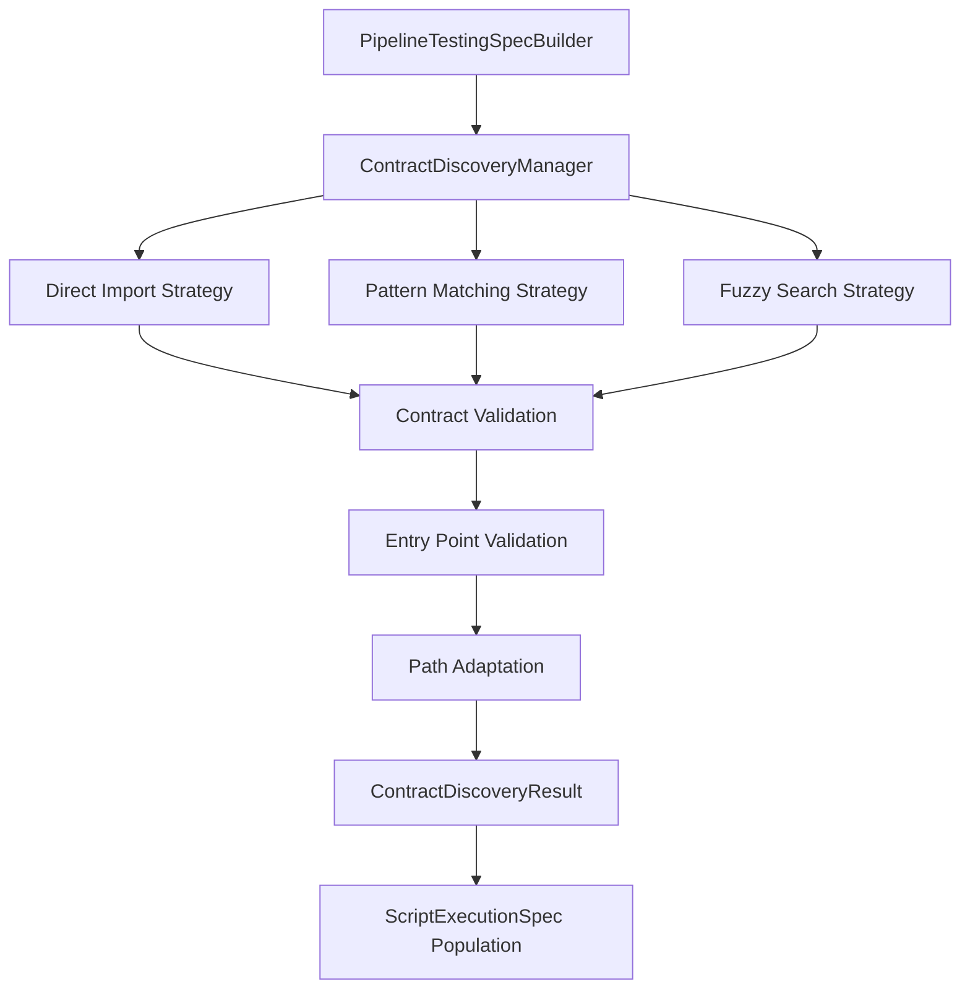
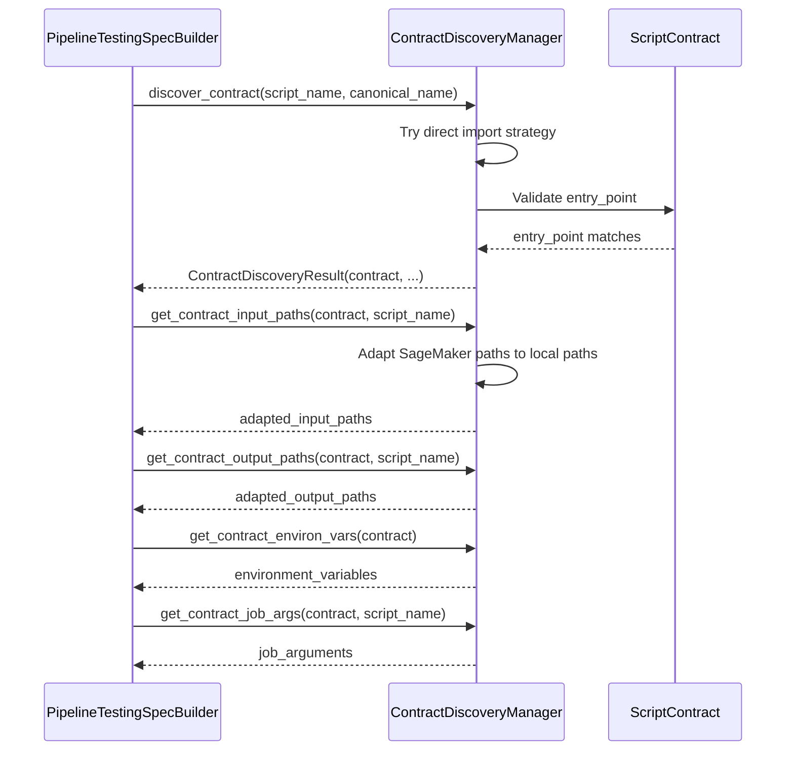

---
tags:
  - design
  - implementation
  - contract_discovery
  - runtime_testing
  - script_contracts
  - validation
keywords:
  - contract discovery
  - script contract mapping
  - entry point validation
  - path adaptation
  - runtime testing
  - standardization compliance
  - pydantic models
topics:
  - contract discovery system
  - script-contract mapping
  - local path adaptation
  - validation strategies
  - runtime testing enhancement
language: python
date of note: 2025-09-09
related_docs:
  - script_contract.md
  - pipeline_testing_spec_builder_design.md
  - standardization_rules.md
  - runtime_tester_design.md
  - pipeline_runtime_testing_simplified_design.md
---

# Contract Discovery Manager Design

## Purpose

The ContractDiscoveryManager provides intelligent discovery and loading of script contracts for runtime testing, bridging the gap between declarative pipeline specifications and imperative script implementations. It enables the PipelineTestingSpecBuilder to use real contract data instead of generic defaults, ensuring accurate and reliable runtime testing.

## Core Design Principles

1. **Standardization Compliance** - Follows established naming conventions and design patterns
2. **Entry Point Validation** - Uses contract `entry_point` field for reliable script-contract matching
3. **Multi-Strategy Discovery** - Employs multiple discovery methods with intelligent fallback
4. **Path Adaptation** - Converts SageMaker container paths to local testing paths
5. **Caching and Performance** - Avoids repeated discovery operations through intelligent caching
6. **Graceful Degradation** - Provides fallback mechanisms when contracts are unavailable

## Architecture Overview



## Core Components

### 1. ContractDiscoveryResult (Pydantic v2 Model)

```python
class ContractDiscoveryResult(BaseModel):
    """Result of contract discovery operation"""
    contract: Optional[ScriptContract] = Field(None, description="Discovered contract object")
    contract_name: str = Field(..., description="Name of the contract")
    discovery_method: str = Field(..., description="Method used to discover the contract")
    error_message: Optional[str] = Field(None, description="Error message if discovery failed")
    
    class Config:
        arbitrary_types_allowed = True  # Allow ScriptContract objects
```

**Design Rationale**: Uses Pydantic v2 for better type validation, serialization, and consistency with the rest of the codebase. The `arbitrary_types_allowed` configuration allows embedding ScriptContract objects while maintaining type safety.

### 2. ContractDiscoveryManager

The main orchestrator that manages contract discovery through multiple strategies:

```python
class ContractDiscoveryManager:
    """
    Manager for discovering and loading script contracts.
    
    Handles the mapping between script names and contract objects,
    with intelligent fallback strategies and error recovery.
    """
```

**Key Features**:
- Multi-strategy discovery with intelligent fallback
- Comprehensive caching to avoid repeated operations
- Path adaptation for local testing environments
- Standardization-compliant contract resolution

## Discovery Strategies

### 1. Direct Import Strategy

**Purpose**: Primary discovery method using standardization rules

**Process**:
1. Generate contract names based on standardization patterns:
   - `{SCRIPT_NAME}_CONTRACT` (primary pattern)
   - `{CANONICAL_NAME}_CONTRACT` (canonical form)
2. Import contract module: `{script_name}_contract.py`
3. Validate contract object using entry_point field
4. Return validated contract or continue to next strategy

**Example**:
```python
# For script "tabular_preprocessing"
contract_module = "cursus.steps.contracts.tabular_preprocessing_contract"
contract_name = "TABULAR_PREPROCESSING_CONTRACT"
expected_entry_point = "tabular_preprocessing.py"
```

### 2. Pattern Matching Strategy

**Purpose**: Fallback discovery when direct import fails

**Process**:
1. Import contract packages from search paths
2. Iterate through all contract objects in packages
3. Use entry_point validation for matching
4. Return first valid match or continue to next strategy

**Search Paths**:
- `cursus.steps.contracts`
- `src.cursus.steps.contracts`
- `steps.contracts`
- `contracts`

### 3. Fuzzy Search Strategy

**Purpose**: Future enhancement for sophisticated matching

**Current Status**: Placeholder implementation for future development using string similarity algorithms

## Entry Point Validation

The most critical component ensuring reliable contract-script matching:

```python
def _is_contract_match(self, contract_obj: ScriptContract, script_name: str, canonical_name: Optional[str] = None) -> bool:
    """
    Check if a contract matches the given script using entry_point field.
    
    This is the most reliable way to validate contract-script matching
    as specified in the design documents.
    """
    # Primary validation: check entry_point field
    if hasattr(contract_obj, 'entry_point') and contract_obj.entry_point:
        expected_entry_point = f"{script_name}.py"
        if contract_obj.entry_point == expected_entry_point:
            return True
        else:
            return False
    
    # Fallback: name-based matching when entry_point unavailable
    return self._fallback_name_matching(contract_obj.__class__.__name__, script_name, canonical_name)
```

**Validation Logic**:
1. **Primary**: Compare `contract.entry_point` with `{script_name}.py`
2. **Fallback**: Use name-based matching when entry_point is unavailable
3. **Logging**: Provide detailed feedback on validation results

## Path Adaptation System

Converts SageMaker container paths to local testing paths for development and testing environments:

### SageMaker Path Patterns

```python
sagemaker_patterns = {
    '/opt/ml/input/data': base_data_dir / 'input',
    '/opt/ml/output': base_data_dir / 'output',
    '/opt/ml/model': base_data_dir / 'model',
    '/opt/ml/processing/input': base_data_dir / 'input',
    '/opt/ml/processing/output': base_data_dir / 'output',
}
```

### Adaptation Examples

| Original SageMaker Path | Adapted Local Path |
|------------------------|-------------------|
| `/opt/ml/processing/input/data` | `test/integration/runtime/data/script_name/input/data` |
| `/opt/ml/processing/output/processed` | `test/integration/runtime/data/script_name/output/processed` |
| `/opt/ml/model` | `test/integration/runtime/data/script_name/model` |

### Path Adaptation Algorithm

1. **Pattern Matching**: Try to match SageMaker path prefixes
2. **Prefix Replacement**: Replace SageMaker prefix with local base path
3. **Relative Path Preservation**: Maintain relative path structure
4. **Fallback Creation**: Create reasonable local paths for unmatched patterns

## Contract Data Extraction

### Input Paths Extraction

```python
def get_contract_input_paths(self, contract: ScriptContract, script_name: str) -> Dict[str, str]:
    """Extract and adapt input paths from contract for local testing."""
    if not hasattr(contract, 'expected_input_paths') or not contract.expected_input_paths:
        return {}
    
    adapted_paths = {}
    base_data_dir = self.test_data_dir / 'data' / script_name
    
    for logical_name, original_path in contract.expected_input_paths.items():
        local_path = self._adapt_path_for_local_testing(original_path, base_data_dir, 'input')
        adapted_paths[logical_name] = str(local_path)
    
    return adapted_paths
```

### Output Paths Extraction

Similar to input paths but adapted for output directories:

```python
def get_contract_output_paths(self, contract: ScriptContract, script_name: str) -> Dict[str, str]:
    """Extract and adapt output paths from contract for local testing."""
    # Similar implementation with 'output' path type
```

### Environment Variables Extraction

```python
def get_contract_environ_vars(self, contract: ScriptContract) -> Dict[str, str]:
    """Extract environment variables from contract."""
    environ_vars = {}
    
    # Add required environment variables
    if hasattr(contract, 'required_env_vars') and contract.required_env_vars:
        for env_var in contract.required_env_vars:
            if isinstance(env_var, str):
                environ_vars[env_var] = f"test_value_for_{env_var.lower()}"
    
    # Add optional environment variables with defaults
    if hasattr(contract, 'optional_env_vars') and contract.optional_env_vars:
        for env_var in contract.optional_env_vars:
            if isinstance(env_var, str):
                environ_vars[env_var] = f"default_value_for_{env_var.lower()}"
    
    # Add standard testing environment variables
    environ_vars.update({
        "PYTHONPATH": str(Path("src").resolve()),
        "CURSUS_ENV": "testing"
    })
    
    return environ_vars
```

### Job Arguments Extraction

```python
def get_contract_job_args(self, contract: ScriptContract, script_name: str) -> Dict[str, Any]:
    """Extract job arguments from contract."""
    job_args = {
        "script_name": script_name,
        "execution_mode": "testing",
        "log_level": "INFO"
    }
    
    # Extract contract-specific job arguments
    if hasattr(contract, 'job_args') and contract.job_args:
        job_args.update(contract.job_args)
    
    return job_args
```

## Caching Strategy

### Cache Key Generation

```python
cache_key = f"{script_name}:{canonical_name or 'None'}"
```

### Cache Benefits

1. **Performance**: Avoids repeated import and validation operations
2. **Consistency**: Ensures same contract is used across multiple calls
3. **Error Reduction**: Prevents repeated error logging for failed discoveries

### Cache Management

- **Storage**: In-memory dictionary with string keys
- **Invalidation**: Manual cache clearing (future enhancement: TTL-based invalidation)
- **Scope**: Per ContractDiscoveryManager instance

## Integration with PipelineTestingSpecBuilder

### Contract-Aware Methods

The ContractDiscoveryManager integrates with PipelineTestingSpecBuilder through four contract-aware methods:

1. **`_get_contract_aware_input_paths()`**
   - Discovers contract for script
   - Extracts and adapts input paths
   - Falls back to generic defaults if contract unavailable

2. **`_get_contract_aware_output_paths()`**
   - Discovers contract for script
   - Extracts and adapts output paths
   - Falls back to generic defaults if contract unavailable

3. **`_get_contract_aware_environ_vars()`**
   - Discovers contract for script
   - Extracts required and optional environment variables
   - Provides test values for environment variables
   - Falls back to generic defaults if contract unavailable

4. **`_get_contract_aware_job_args()`**
   - Discovers contract for script
   - Extracts contract-specific job arguments
   - Falls back to generic defaults if contract unavailable

### Integration Flow



## Error Handling and Logging

### Error Categories

1. **Import Errors**: Contract module not found
2. **Validation Errors**: Entry point mismatch
3. **Attribute Errors**: Missing contract attributes
4. **Path Adaptation Errors**: Invalid path patterns

### Logging Strategy

```python
# Successful discovery
print(f"Found valid contract: {contract_name} with matching entry_point: {expected_entry_point}")

# Entry point mismatch
print(f"Contract {contract_name} entry_point mismatch: expected {expected_entry_point}, got {contract_obj.entry_point}")

# Import failure
print(f"Failed to import contract module {full_module_path}: {e}")

# Fallback usage
print(f"Contract has no entry_point field, falling back to name-based matching")
```

### Error Recovery

1. **Strategy Fallback**: If direct import fails, try pattern matching
2. **Graceful Degradation**: Return "not_found" result instead of raising exceptions
3. **Detailed Error Messages**: Provide actionable error information
4. **Fallback to Defaults**: PipelineTestingSpecBuilder falls back to generic defaults

## Standardization Compliance

### Naming Conventions

Following [standardization_rules.md](standardization_rules.md):

1. **Contract Files**: `{script_name}_contract.py`
2. **Contract Objects**: `{SCRIPT_NAME}_CONTRACT`
3. **Entry Points**: `{script_name}.py`

### PascalCase to CONSTANT_CASE Conversion

```python
def _to_constant_case(self, pascal_case: str) -> str:
    """Convert PascalCase to CONSTANT_CASE"""
    # Handle special cases first
    special_cases = {
        'XGBoost': 'XGBOOST',
        'PyTorch': 'PYTORCH',
        'MLFlow': 'MLFLOW',
        'TensorFlow': 'TENSORFLOW',
        'SageMaker': 'SAGEMAKER',
        'AutoML': 'AUTOML'
    }
    
    processed = pascal_case
    for original, replacement in special_cases.items():
        processed = processed.replace(original, replacement)
    
    # Convert to constant case
    result = re.sub(r'([A-Z]+)([A-Z][a-z])', r'\1_\2', processed)
    result = re.sub(r'([a-z\d])([A-Z])', r'\1_\2', result)
    
    return result.upper()
```

## Performance Considerations

### Optimization Strategies

1. **Caching**: Avoid repeated contract discovery operations
2. **Lazy Loading**: Import contracts only when needed
3. **Early Termination**: Stop searching once valid contract is found
4. **Efficient Path Matching**: Use string prefix matching for path adaptation

### Performance Metrics

- **Cache Hit Rate**: Percentage of requests served from cache
- **Discovery Time**: Time taken to discover and validate contracts
- **Memory Usage**: Memory footprint of cached contracts

## Testing Strategy

### Unit Tests

1. **Contract Discovery Tests**
   - Test direct import strategy with valid contracts
   - Test pattern matching strategy fallback
   - Test entry_point validation logic
   - Test caching behavior

2. **Path Adaptation Tests**
   - Test SageMaker path pattern matching
   - Test local path generation
   - Test edge cases and invalid paths

3. **Data Extraction Tests**
   - Test input/output path extraction
   - Test environment variable extraction
   - Test job arguments extraction

### Integration Tests

1. **PipelineTestingSpecBuilder Integration**
   - Test contract-aware spec creation
   - Test fallback to generic defaults
   - Test end-to-end contract discovery flow

2. **Real Contract Tests**
   - Test with actual contract files
   - Test with various script naming patterns
   - Test with different contract structures

### Error Handling Tests

1. **Missing Contract Tests**
   - Test behavior when contracts are not found
   - Test graceful degradation
   - Test error message quality

2. **Invalid Contract Tests**
   - Test with malformed contracts
   - Test with missing entry_point fields
   - Test with incorrect entry_point values

## Future Enhancements

### 1. Advanced Fuzzy Matching

Implement sophisticated string similarity algorithms for better contract discovery:

```python
from difflib import SequenceMatcher
from fuzzywuzzy import fuzz

def _discover_by_fuzzy_search(self, script_name: str, canonical_name: Optional[str] = None) -> ContractDiscoveryResult:
    """Advanced fuzzy matching using multiple similarity algorithms"""
    # Implementation using Levenshtein distance, Jaro-Winkler, etc.
```

### 2. Contract Validation Framework

Extend validation beyond entry_point matching:

```python
def validate_contract_completeness(self, contract: ScriptContract) -> ValidationResult:
    """Validate contract has all required fields and proper structure"""
    # Check for required fields
    # Validate path patterns
    # Verify environment variable formats
```

### 3. Performance Monitoring

Add metrics collection for contract discovery performance:

```python
class ContractDiscoveryMetrics:
    """Collect and report contract discovery performance metrics"""
    def __init__(self):
        self.discovery_times = []
        self.cache_hits = 0
        self.cache_misses = 0
```

### 4. Configuration-Driven Discovery

Allow customization of discovery strategies and search paths:

```python
class ContractDiscoveryConfig(BaseModel):
    """Configuration for contract discovery behavior"""
    search_paths: List[str] = Field(default_factory=lambda: ["cursus.steps.contracts"])
    strategies: List[str] = Field(default=["direct_import", "pattern_matching"])
    cache_ttl: Optional[int] = Field(default=None)
```

## Related Components

### Script Contracts ([script_contract.md](script_contract.md))

The ContractDiscoveryManager is designed to work with the Script Contract system:

- **Contract Structure**: Understands ScriptContract base class and its fields
- **Entry Point Validation**: Uses the `entry_point` field as defined in script contracts
- **Path Extraction**: Extracts `expected_input_paths` and `expected_output_paths`
- **Environment Variables**: Processes `required_env_vars` and `optional_env_vars`

### Pipeline Testing Spec Builder ([pipeline_testing_spec_builder_design.md](pipeline_testing_spec_builder_design.md))

Primary integration point for contract-aware runtime testing:

- **Spec Population**: Provides real contract data for ScriptExecutionSpec creation
- **Fallback Integration**: Seamlessly falls back to generic defaults when contracts unavailable
- **Path Adaptation**: Converts container paths to local testing paths
- **Caching Benefits**: Improves spec builder performance through contract caching

### Standardization Rules ([standardization_rules.md](standardization_rules.md))

Ensures compliance with established naming and structural conventions:

- **Naming Patterns**: Follows contract file and object naming standards
- **PascalCase Conversion**: Implements standardized case conversion rules
- **Validation Standards**: Adheres to contract validation requirements

### Runtime Testing System ([runtime_tester_design.md](runtime_tester_design.md))

Enhances the overall runtime testing framework:

- **Accurate Testing**: Provides real contract data instead of generic placeholders
- **Local Development**: Enables effective local testing with adapted paths
- **Error Prevention**: Catches contract mismatches early in development cycle

## Implementation Status

### Completed Features ✅

- [x] Pydantic v2 data models
- [x] Multi-strategy contract discovery
- [x] Entry point validation
- [x] Path adaptation system
- [x] Contract data extraction
- [x] Caching mechanism
- [x] Integration with PipelineTestingSpecBuilder
- [x] Standardization compliance
- [x] Error handling and logging

### Future Enhancements 🔄

- [ ] Advanced fuzzy matching algorithms
- [ ] Contract validation framework
- [ ] Performance monitoring and metrics
- [ ] Configuration-driven discovery
- [ ] TTL-based cache invalidation
- [ ] Contract dependency resolution

## Benefits and Impact

### Development Experience

1. **Reduced Manual Configuration**: Automatically populates spec fields from contracts
2. **Better Error Detection**: Catches contract mismatches early in development
3. **Consistent Testing**: Uses same contract data across different testing scenarios
4. **Local Development**: Enables effective local testing with adapted paths

### System Reliability

1. **Accurate Testing**: Uses real contract specifications instead of generic placeholders
2. **Validation Assurance**: Entry point validation ensures correct contract-script matching
3. **Graceful Degradation**: Provides fallback mechanisms when contracts are unavailable
4. **Performance Optimization**: Caching reduces repeated discovery operations

### Maintainability

1. **Single Source of Truth**: Contract data serves as definitive specification
2. **Standardization Compliance**: Follows established naming and structural conventions
3. **Extensible Architecture**: Multi-strategy design allows for future enhancements
4. **Clear Separation of Concerns**: Dedicated component for contract discovery logic

## Conclusion

The ContractDiscoveryManager represents a significant enhancement to the runtime testing system, providing intelligent contract discovery and reliable script-contract matching. By leveraging the `entry_point` field for validation and implementing comprehensive path adaptation, it bridges the gap between declarative pipeline specifications and imperative script implementations.

The design emphasizes standardization compliance, performance optimization, and graceful error handling, making it a robust foundation for contract-aware runtime testing. Future enhancements will further improve discovery accuracy and system performance.

## See Also

- [Script Contract Design](script_contract.md) - Core contract system design
- [Pipeline Testing Spec Builder Design](pipeline_testing_spec_builder_design.md) - Primary integration point
- [Standardization Rules](standardization_rules.md) - Naming and structural conventions
- [Runtime Tester Design](runtime_tester_design.md) - Overall runtime testing framework
- [Pipeline Runtime Testing Simplified Design](pipeline_runtime_testing_simplified_design.md) - Simplified testing approach
