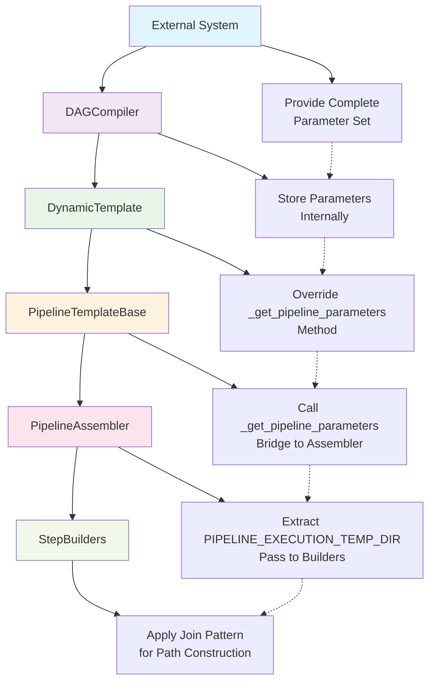

---
tags:
  - design
  - pipeline_api
  - cursus
  - architecture
  - output_management
keywords:
  - output paths
  - pipeline destinations
  - S3 locations
  - artifact management
  - destination handling
  - runtime configuration
  - dynamic paths
  - parameter substitution
  - Join operations
  - portability
topics:
  - pipeline artifact management
  - output standardization
  - path resolution strategies
  - configuration patterns
language: python
date of note: 2025-09-17
---

# Cursus Framework Output Management Architecture

## Overview

This design document outlines the architecture and strategies for managing output destinations within the Cursus framework. It provides context for how artifacts, models, and intermediate data are stored throughout pipeline execution.

## Background

The Cursus framework needs to manage various output destinations for different pipeline steps:

1. **Processing outputs** from data preparation steps
2. **Model artifacts** from training steps
3. **Evaluation results** from model assessment steps
4. **Packaging outputs** for deployment preparations

Each of these outputs must be stored in well-defined locations to ensure:
- Consistent organization
- Reliable step dependency resolution
- Proper cleanup of temporary files
- Compatibility with SageMaker Pipeline execution

### The Portability Challenge

The current system faces a critical portability issue when configurations are saved and used by external systems:

1. **Configuration Serialization**: When users call `merge_and_save_configs()` from `cursus/steps/configs/utils.py`, all computed values including `pipeline_s3_loc` are serialized into the JSON configuration file.

2. **Hard-coded S3 Paths**: The `pipeline_s3_loc` property in `BasePipelineConfig` generates paths like:
   ```
   s3://user-bucket/MODS/author-service-xgboost-NA_1.0/
   ```
   These paths are specific to the user's AWS account and configuration.

3. **External System Limitations**: When external systems load these saved configurations to trigger the pipeline DAG compiler, they cannot modify the pre-computed S3 paths without editing the configuration file.

4. **Static Path Construction**: Step builders use string interpolation with these hard-coded paths:
   ```python
   destination = f"{self.config.pipeline_s3_loc}/packaging/{logical_name}"
   ```
   This approach cannot adapt to runtime parameters.

### Current System Architecture

The pipeline generation flow currently follows this pattern:

```
BasePipelineConfig.pipeline_s3_loc → merge_and_save_configs() → JSON Config → 
External System → PipelineDAGCompiler → DynamicPipelineTemplate → 
PipelineAssembler → StepBuilders → Hard-coded output paths
```

This architecture creates a dependency on the original user's AWS environment and prevents true portability across different execution contexts.

### Required Parameter Flow Architecture

To achieve true portability, the system must support a comprehensive parameter flow from external systems through all layers:



#### Complete Parameter Set

External systems must be able to provide the full set of pipeline parameters:

```python
# Complete parameter set from mods_workflow_core.utils.constants
PIPELINE_EXECUTION_TEMP_DIR           # Primary: output destinations
KMS_ENCRYPTION_KEY_PARAM             # Security: encryption
PROCESSING_JOB_SHARED_NETWORK_CONFIG # Network: shared config object
SECURITY_GROUP_ID                    # Network: security groups
VPC_SUBNET                           # Network: VPC configuration
```

#### Key Architecture Components

**1. DAGCompiler Parameter Storage**
- Accept complete parameter set from external systems
- Store parameters internally for template creation
- Pass parameters to template during instantiation

**2. PipelineTemplateBase Parameter Management**
- Add internal parameter storage attribute
- Provide setter method for parameter injection
- Override `_get_pipeline_parameters()` to return stored parameters
- Bridge parameters to PipelineAssembler via existing connection

**3. DynamicPipelineTemplate Parameter Integration**
- Inherit parameter storage from PipelineTemplateBase
- No longer generate parameters internally
- Use parent's parameter management system
- Maintain backward compatibility

**4. PipelineAssembler Parameter Distribution**
- Extract PIPELINE_EXECUTION_TEMP_DIR for step builders
- Use other parameters for network and security configuration
- Pass execution prefix to builders during initialization

**5. StepBuilder Parameter Application**
- Use `_get_base_output_path()` for intelligent path resolution
- Apply `Join()` pattern for all path construction
- Ensure proper parameter substitution at runtime

## Current Architecture

### Output Path Resolution Strategy

Currently, the Cursus framework relies on a configuration-based approach where each step builder determines output destinations using:

1. `pipeline_s3_loc` from step configuration
2. Step type from step specification
3. Logical output name from step specification

This results in paths following the pattern:
```
{pipeline_s3_loc}/{step_type}/{logical_output_name}
```

### Implementation in Step Builders

The output destination generation is primarily implemented in the following locations:

1. `PipelineAssembler._generate_outputs()` - Default implementation for all steps
2. Individual step builders' `_get_outputs()` methods - Customized implementations for specific step types

Both implementations currently rely solely on `pipeline_s3_loc` from configuration files, which limits runtime flexibility.

## Limitations of Current Approach

1. **Static Configuration**: Output destinations are fixed at configuration time
2. **Limited Runtime Control**: Cannot easily change destinations without modifying configuration files
3. **Reduced Portability**: Pipeline execution in different environments requires configuration changes
4. **Inconsistent Implementation**: The `regional_xgboost.py` uses a different approach based on pipeline parameters

## Related Enhancement Proposals

1. **PIPELINE_EXECUTION_TEMP_DIR Integration** - A proposal to allow runtime configuration of the base output directory using the `EXECUTION_S3_PREFIX` parameter
2. **Standardized Output Path Construction** - Consistent path generation across all step builders
3. **Enhanced Property Reference Handling** - Better support for dynamic paths in property references

## Implementation Differences

The current implementation in `regional_xgboost.py` uses the `sagemaker.workflow.functions.Join` utility:

```python
ARTIFACT_LOCATION = Join(on="/", values=[PIPELINE_EXECUTION_TEMP_DIR, "Artifacts"])
```

This approach explicitly creates a Join operation that SageMaker will resolve at runtime. 

In contrast, the proposed solution for the Cursus framework should use the Join function for consistency:

```python
from sagemaker.workflow.functions import Join

outputs[logical_name] = Join(on="/", values=[base_s3_loc, step_type, logical_name])
```

This ensures proper parameter substitution at runtime, consistent with how it's used in `regional_xgboost.py` and the utility functions in `mods_workflow_core.utils.constants`. While SageMaker's Python SDK can sometimes handle string interpolation with ParameterString objects, using Join explicitly is the more reliable approach, especially when working with parameters.

## References

- The standard `StepBuilderBase` class in `cursus/core/base/builder_base.py`
- `pipeline_assembler.py` implementation of `_generate_outputs()`
- `regional_xgboost.py` implementation using `Join(on="/", values=[PIPELINE_EXECUTION_TEMP_DIR, "subdir"])`
- `PIPELINE_EXECUTION_TEMP_DIR` is defined in `mods_workflow_core.utils.constants`:

  ```python
  # Predefined Pipeline Parameters
  PIPELINE_EXECUTION_TEMP_DIR = ParameterString(name="EXECUTION_S3_PREFIX")
  KMS_ENCRYPTION_KEY_PARAM = ParameterString(name="KMS_ENCRYPTION_KEY_PARAM")
  VPC_SUBNET = ParameterString(name="VPC_SUBNET")
  SECURITY_GROUP_ID = ParameterString(name="SECURITY_GROUP_ID")
  ```

- `mods_workflow_core.utils.constants` also provides a utility function for common input config patterns:

  ```python
  # Predefined Pipeline input location for all input config
  def get_input_config_processing_input_for_pipeline_execution(step_name):
      return ProcessingInput(
          source=Join(on="/", values=[PIPELINE_EXECUTION_TEMP_DIR, step_name, "input", "config"]),
          destination="/opt/ml/processing/config/",
          input_name="config",
      )
  ```

- `pipeline_s3_loc` is constructed as `s3://{bucket}/MODS/{pipeline_name}_{pipeline_version}`

## Related Documents

- [Integration of PIPELINE_EXECUTION_TEMP_DIR in Cursus Framework](./pipeline_execution_temp_dir_integration.md) - Detailed proposal for integrating runtime parameters for output destinations
- [Regional XGBoost Implementation](../active_queueing_atoz/regional_xgboost.py) - Reference implementation using Join with PIPELINE_EXECUTION_TEMP_DIR
- [Documentation YAML Frontmatter Standard](./documentation_yaml_frontmatter_standard.md) - Standard for documentation metadata and organization
