---
tags:
  - design
  - architecture
  - config_generation
  - dag_based
  - early_validation
  - auto_configuration
keywords:
  - DAGConfigFactory
  - dynamic_config
  - pipeline_dag
  - config_automation
  - interactive_config
  - base_config_inheritance
  - early_validation
  - tier_based_config
topics:
  - DAG-based configuration generation
  - interactive pipeline configuration
  - step-by-step config creation
  - base config inheritance
  - early validation with from_base_config
  - auto-configuration for tier 2+ fields
language: python
date of note: 2025-10-15
---

# DAGConfigFactory Design Document

## Executive Summary

The DAGConfigFactory provides an interactive, step-by-step configuration system that transforms the complex manual configuration process in `demo_config.ipynb` into a guided, user-friendly workflow with **early validation** and **intelligent auto-configuration**. The system leverages proper `from_base_config` patterns, provides immediate feedback on configuration errors, and automatically handles steps with only optional (tier 2+) fields.

## Problem Analysis

### Current State Pain Points

**Manual Configuration Overhead:**
- Current `demo_config.ipynb` contains 500+ lines of hardcoded step configurations
- Users must understand all configuration classes and their relationships
- No guidance on which fields are essential vs optional
- High cognitive load and error-prone manual process
- **Delayed validation**: Errors discovered only at the end during config generation

**Static Configuration Approach:**
```python
# Current approach - ALL steps must be configured manually
xgboost_training_config = XGBoostTrainingConfig(
    region="NA",
    author="data-scientist", 
    service_name="AtoZ",
    # ... 50+ more fields to configure manually
)
processing_step_config = ProcessingStepConfig(
    region="NA",  # Repeated from above
    author="data-scientist",  # Repeated from above
    # ... more repeated and step-specific fields
)
# ... 20+ more configurations with repeated base fields

# Validation happens only at the end
configs = [xgboost_training_config, processing_step_config, ...]  # May fail here!
```

### Enhanced Solution Vision

**Interactive Step-by-Step Configuration with Early Validation:**
```python
# Enhanced approach - Interactive guided configuration with immediate feedback
dag = create_xgboost_complete_e2e_dag()
factory = DAGConfigFactory(dag)

# Step 1: Get config class mapping from DAG
config_map = factory.get_config_class_map()
# Returns: {"data_loading": CradleDataLoadConfig, "training": XGBoostTrainingConfig, ...}

# Step 2: Configure base configurations first
base_inputs = factory.get_base_config_requirements()
factory.set_base_config(region="NA", author="data-scientist", ...)
factory.set_base_processing_config(max_records=1000000, ...)

# Step 3: Configure each step with IMMEDIATE validation
for step_name in factory.get_pending_steps():
    required_inputs = factory.get_step_requirements(step_name)
    # User provides only step-specific inputs - validated immediately!
    config_instance = factory.set_step_config(step_name, num_round=300)  # Returns validated instance

# Step 4: Auto-configure steps with only tier 2+ fields
# Package, Registration steps auto-configured if they only have optional fields

# Step 5: Generate final configurations (always succeeds with pre-validated instances)
configs = factory.generate_all_configs()  # Uses pre-validated instances
```

## Architecture Overview

### Enhanced System Flow Architecture

```mermaid
graph TB
    subgraph "User Interaction Layer"
        DAG[PipelineDAG Input]
        UI[Interactive Configuration UI]
        REQ[Requirements Display]
        VAL[Early Validation Feedback]
    end
    
    subgraph "DAGConfigFactory Core - Enhanced"
        DCF[DAGConfigFactory]
        CM[Config Class Mapping]
        BC[Base Config Management]
        SC[Step Config Management]
        EV[Early Validation Engine]
        AC[Auto-Configuration Engine]
        CG[Config Generation]
    end
    
    subgraph "Configuration State Management - Enhanced"
        BCR[Base Config Registry]
        SCR[Step Config Registry]
        SCI[Step Config Instances]
        PR[Pending Requirements]
        CS[Configuration State]
        AC_STATE[Auto-Config State]
    end
    
    subgraph "Validation & Inheritance System"
        FBC[from_base_config Methods]
        IV[Inheritance Validation]
        TV[Tier-based Validation]
        PV[Prerequisite Validation]
    end
    
    subgraph "Existing Cursus Infrastructure"
        REG[Registry System]
        SCRA[StepConfigResolverAdapter]
        BCCF[build_complete_config_classes]
        STEP_CAT[Step Catalog Discovery]
    end
    
    subgraph "Configuration Classes"
        BPC[BasePipelineConfig]
        BPSC[ProcessingStepConfigBase]
        SC_CLASSES[Specific Config Classes]
    end
    
    %% Enhanced user flow with early validation
    DAG --> DCF
    DCF --> CM
    CM --> UI
    UI --> REQ
    REQ --> BC
    BC --> SC
    SC --> EV
    EV --> VAL
    EV --> SCI
    AC --> AC_STATE
    SC --> AC
    CG --> SCI
    
    %% Enhanced state management
    DCF --> BCR
    DCF --> SCR
    DCF --> SCI
    DCF --> PR
    DCF --> CS
    DCF --> AC_STATE
    
    %% Validation and inheritance
    EV --> FBC
    EV --> IV
    EV --> TV
    EV --> PV
    
    %% Infrastructure integration
    CM --> REG
    CM --> SCRA
    CM --> STEP_CAT
    CG --> BCCF
    EV --> FBC
    
    %% Config generation
    CG --> BPC
    CG --> BPSC
    CG --> SC_CLASSES
    
    classDef userLayer fill:#e1f5fe
    classDef coreLayer fill:#e8f5e8
    classDef stateLayer fill:#fff3e0
    classDef validationLayer fill:#f8bbd9
    classDef infraLayer fill:#f3e5f5
    classDef configLayer fill:#fce4ec
    
    class DAG,UI,REQ,VAL userLayer
    class DCF,CM,BC,SC,EV,AC,CG coreLayer
    class BCR,SCR,SCI,PR,CS,AC_STATE stateLayer
    class FBC,IV,TV,PV validationLayer
    class REG,SCRA,BCCF,STEP_CAT infraLayer
    class BPC,BPSC,SC_CLASSES configLayer
```



### Core Components - Enhanced Implementation

#### **1. DAGConfigFactory (Main Orchestrator) - Enhanced**
**Purpose**: Interactive configuration management with **early validation** and **auto-configuration**
**Responsibility**: Coordinate DAG analysis, base config setup, step-by-step configuration with immediate feedback

```python
class DAGConfigFactory:
    """
    Interactive factory for step-by-step pipeline configuration generation.
    
    Enhanced Features:
    - Early validation with immediate feedback using from_base_config pattern
    - Auto-configuration for steps with only tier 2+ (optional) fields
    - Dual storage: raw inputs + validated instances
    - Prerequisite validation before step configuration
    
    Workflow:
    1. Analyze DAG to get config class mapping
    2. Collect base configurations first
    3. Guide user through step-specific configurations with immediate validation
    4. Auto-configure eligible steps (tier 2+ only fields)
    5. Generate final config instances (uses pre-validated instances)
    """
    
    def __init__(self, dag: PipelineDAG):
        """Initialize factory with DAG analysis and dual storage system."""
        self.dag = dag
        self.config_mapper = ConfigClassMapper()
        self.config_generator = None
        
        # Enhanced state management with dual storage
        self._config_class_map = self.config_mapper.map_dag_to_config_classes(dag)
        self.base_config = None  # BasePipelineConfig instance
        self.base_processing_config = None  # ProcessingStepConfigBase instance
        self.step_configs: Dict[str, Dict[str, Any]] = {}  # Raw inputs for serialization
        self.step_config_instances: Dict[str, BaseModel] = {}  # Validated instances
        
    # Enhanced methods with early validation
    def set_step_config(self, step_name: str, **kwargs) -> BaseModel:
        """
        Set configuration with IMMEDIATE validation using from_base_config pattern.
        
        Returns:
            The created and validated config instance (immediate feedback)
            
        Raises:
            ValueError: If configuration is invalid or prerequisites not met
        """
        
    def auto_configure_step_if_possible(self, step_name: str) -> Optional[BaseModel]:
        """
        Auto-configure step if it only has tier 2+ (optional) fields.
        
        Returns:
            The created config instance if auto-configuration succeeded, None otherwise
        """
        
    def can_auto_configure_step(self, step_name: str) -> bool:
        """Check if step can be auto-configured (only has tier 2+ fields)."""
        
    def get_pending_steps(self) -> List[str]:
        """
        Get steps needing configuration (excludes auto-configurable steps).
        
        Enhanced logic: Steps with only tier 2+ fields are not considered pending.
        """
        
    def generate_all_configs(self) -> List[BaseModel]:
        """
        Generate final configs with auto-configuration and pre-validated instances.
        
        Enhanced workflow:
        1. Auto-configure eligible steps (tier 2+ only)
        2. Validate all essential steps are configured
        3. Return pre-validated instances (always succeeds)
        """
```

#### **2. Early Validation Engine**
**Purpose**: Provide immediate validation feedback using proper inheritance patterns
**Responsibility**: Validate configurations immediately when users provide input

```python
class EarlyValidationEngine:
    """
    Provides immediate validation feedback using from_base_config pattern.
    
    Key Features:
    - Uses proper from_base_config methods when available
    - Falls back to manual inheritance gracefully
    - Provides detailed error context for debugging
    - Validates prerequisites before attempting configuration
    """
    
    def _validate_prerequisites_for_step(self, step_name: str, config_class: Type[BaseModel]) -> None:
        """Validate required base configs are set before step configuration."""
        if self._inherits_from_processing_config(config_class):
            if not self.base_config:
                raise ValueError(f"Step '{step_name}' requires base config to be set first")
            if not self.base_processing_config:
                raise ValueError(f"Step '{step_name}' requires base processing config to be set first")
    
    def _create_config_instance_with_inheritance(self, 
                                               config_class: Type[BaseModel], 
                                               step_inputs: Dict[str, Any]) -> BaseModel:
        """Create config instance using proper from_base_config pattern."""
        
        if self._inherits_from_processing_config(config_class):
            return self._create_with_processing_inheritance(config_class, step_inputs)
        elif self._inherits_from_base_config(config_class):
            return self._create_with_base_inheritance(config_class, step_inputs)
        else:
            return config_class(**step_inputs)  # Standalone config
    
    def _create_with_processing_inheritance(self, config_class, step_inputs):
        """Create config using ProcessingStepConfigBase inheritance."""
        # Try from_base_config first (preferred method)
        if hasattr(config_class, 'from_base_config'):
            try:
                return config_class.from_base_config(
                    self.base_processing_config, 
                    **step_inputs
                )
            except Exception as e:
                logger.warning(f"from_base_config failed: {e}")
                # Fall through to manual combination
        
        # Fallback: combine inputs manually
        combined_inputs = {}
        combined_inputs.update(base_config_values)
        combined_inputs.update(processing_config_values)
        combined_inputs.update(step_inputs)
        return config_class(**combined_inputs)
```

#### **3. Auto-Configuration Engine**
**Purpose**: Automatically configure steps that only have tier 2+ (optional) fields
**Responsibility**: Identify and configure steps that don't require user input

```python
class AutoConfigurationEngine:
    """
    Automatically configures steps with only tier 2+ (optional) fields.
    
    Key Features:
    - Identifies steps that can work with just inherited base config values
    - Distinguishes between tier 1 (essential) and tier 2+ (optional) fields
    - Integrates seamlessly with pending steps logic
    - Provides transparent auto-configuration during generate_all_configs
    """
    
    def can_auto_configure_step(self, step_name: str) -> bool:
        """Check if step can be auto-configured."""
        # Get step-specific requirements (excluding inherited fields)
        step_requirements = self.get_step_requirements(step_name)
        essential_step_fields = [req['name'] for req in step_requirements if req['required']]
        
        # If no essential step-specific fields, it can be auto-configured
        return len(essential_step_fields) == 0
    
    def auto_configure_step_if_possible(self, step_name: str) -> Optional[BaseModel]:
        """Auto-configure step with empty inputs (only inherited fields)."""
        if not self.can_auto_configure_step(step_name):
            return None
        
        try:
            config_instance = self._create_config_instance_with_inheritance(
                config_class, {}  # Empty step inputs - only use inherited fields
            )
            
            # Store the auto-configured instance
            self.step_configs[step_name] = {}
            self.step_config_instances[step_name] = config_instance
            
            logger.info(f"✅ {step_name} auto-configured successfully (only tier 2+ fields)")
            return config_instance
        except Exception as e:
            logger.debug(f"Auto-configuration failed for {step_name}: {e}")
            return None
    
    def _auto_configure_eligible_steps(self) -> int:
        """Auto-configure all eligible steps and return count."""
        auto_configured_count = 0
        
        for step_name in self._config_class_map.keys():
            if step_name in self.step_configs:
                continue  # Already configured
            
            if self.auto_configure_step_if_possible(step_name):
                auto_configured_count += 1
        
        return auto_configured_count
```

#### **4. Enhanced Configuration Generator**
**Purpose**: Generate final config instances with pre-validated instance support
**Responsibility**: Handle both pre-validated instances and traditional generation

```python
class ConfigurationGenerator:
    """
    Enhanced configuration generator supporting pre-validated instances.
    
    Features:
    - Prioritizes pre-validated instances from early validation
    - Falls back to traditional generation for backward compatibility
    - Uses proper from_base_config methods with graceful fallback
    - Provides detailed inheritance reporting
    """
    
    def generate_all_configs(self) -> List[BaseModel]:
        """Generate configs using pre-validated instances when available."""
        
        # Auto-configure eligible steps first
        auto_configured_count = self._auto_configure_eligible_steps()
        if auto_configured_count > 0:
            logger.info(f"✅ Auto-configured {auto_configured_count} steps with only tier 2+ fields")
        
        # Check all steps are configured (after auto-configuration)
        missing_steps = self.get_pending_steps()
        if missing_steps:
            raise ValueError(f"Missing configuration for steps: {missing_steps}")
        
        # If we have pre-validated instances for all steps, return them
        if len(self.step_config_instances) == len(self._config_class_map):
            configs = list(self.step_config_instances.values())
            logger.info(f"✅ Returning {len(configs)} pre-validated configuration instances")
            return configs
        
        # Fallback to traditional generation for backward compatibility
        return self._traditional_generation()
```

## Detailed Design - Enhanced Implementation

### Enhanced Data Models

The enhanced design maintains the simple dictionary-based field requirements while adding support for early validation and auto-configuration:

**Field Requirement Dictionary Structure (Enhanced):**
```python
{
    'name': str,           # Field name
    'type': str,           # Field type as string
    'description': str,    # Field description from Pydantic Field()
    'required': bool,      # True for Tier 1 (essential), False for Tier 2+ (optional)
    'default': Any,        # Default value (only for Tier 2+ fields)
    'tier': int           # Field tier (1=essential, 2+=optional) - NEW
}
```

**Enhanced Configuration State Models:**
```python
class ConfigurationStatus(str, Enum):
    """Enhanced status including auto-configuration."""
    PENDING = "pending"
    AUTO_CONFIGURABLE = "auto_configurable"  # NEW
    PARTIAL = "partial"
    COMPLETE = "complete"
    AUTO_CONFIGURED = "auto_configured"  # NEW

class StepConfigurationState(BaseModel):
    """Enhanced step state with auto-configuration info."""
    step_name: str
    config_class_name: str
    status: ConfigurationStatus
    provided_fields: List[str]
    missing_fields: List[str]
    inherited_fields: List[str]
    auto_configurable: bool = Field(default=False)  # NEW
    validation_errors: List[str] = Field(default_factory=list)  # NEW

class EarlyValidationResult(BaseModel):
    """Result of early validation attempt."""
    success: bool
    config_instance: Optional[BaseModel] = None
    error_message: Optional[str] = None
    error_context: Dict[str, Any] = Field(default_factory=dict)
    used_from_base_config: bool = Field(default=False)
```

### Core Implementation - Enhanced

#### **1. Enhanced DAGConfigFactory Main Class**

```python
# src/cursus/api/factory/dag_config_factory.py
import logging
from typing import Dict, List, Any, Type, Optional
from datetime import datetime
from pydantic import BaseModel

logger = logging.getLogger(__name__)

class DAGConfigFactory:
    """
    Enhanced interactive factory with early validation and auto-configuration.
    
    Key Enhancements:
    - Early validation with immediate feedback
    - Auto-configuration for tier 2+ only steps
    - Dual storage system (raw inputs + validated instances)
    - Proper from_base_config pattern usage
    - Enhanced error context and debugging
    """
    
    def __init__(self, dag):
        """Initialize factory with enhanced dual storage system."""
        self.dag = dag
        self.config_mapper = ConfigClassMapper()
        self.config_generator = None
        
        # Enhanced state management
        self._config_class_map = self.config_mapper.map_dag_to_config_classes(dag)
        self.base_config = None  # BasePipelineConfig instance
        self.base_processing_config = None  # ProcessingStepConfigBase instance
        self.step_configs: Dict[str, Dict[str, Any]] = {}  # Raw inputs for serialization
        self.step_config_instances: Dict[str, BaseModel] = {}  # Validated instances
        
        logger.info(f"Initialized DAGConfigFactory for DAG with {len(self._config_class_map)} steps")
    
    def set_step_config(self, step_name: str, **kwargs) -> BaseModel:
        """
        Set configuration with IMMEDIATE validation using from_base_config pattern.
        
        Enhanced Features:
        - Validates prerequisites before attempting configuration
        - Uses proper from_base_config methods when available
        - Provides detailed error context for debugging
        - Returns validated config instance immediately
        - Stores both raw inputs and validated instance
        
        Args:
            step_name: Name of the step to configure
            **kwargs: Step-specific configuration field values
            
        Returns:
            The created and validated config instance
            
        Raises:
            ValueError: If configuration is invalid or prerequisites not met
        """
        if step_name not in self._config_class_map:
            raise ValueError(f"Step '{step_name}' not found in DAG")
        
        config_class = self._config_class_map[step_name]
        
        # Enhanced prerequisite validation
        self._validate_prerequisites_for_step(step_name, config_class)
        
        try:
            # Create instance immediately with validation using proper inheritance
            config_instance = self._create_config_instance_with_inheritance(
                config_class, kwargs
            )
            
            # Store both raw inputs (for serialization) and validated instance
            self.step_configs[step_name] = kwargs
            self.step_config_instances[step_name] = config_instance
            
            logger.info(f"✅ {step_name} configured successfully using {config_class.__name__}")
            return config_instance
            
        except Exception as e:
            # Enhanced error message with context for better debugging
            error_context = self._build_error_context(step_name, config_class, kwargs, e)
            logger.error(f"❌ Configuration failed for {step_name}: {error_context}")
            raise ValueError(f"Configuration validation failed for {step_name}: {error_context}")
    
    def auto_configure_step_if_possible(self, step_name: str) -> Optional[BaseModel]:
        """
        Auto-configure step if it only has tier 2+ (optional) fields.
        
        This method checks if a step can be configured with just inherited base config
        fields, without requiring any tier 1 (essential) step-specific fields.
        
        Args:
            step_name: Name of the step to auto-configure
            
        Returns:
            The created config instance if auto-configuration succeeded, None otherwise
        """
        if step_name not in self._config_class_map:
            return None
        
        config_class = self._config_class_map[step_name]
        
        # Check if prerequisites are met
        try:
            self._validate_prerequisites_for_step(step_name, config_class)
        except ValueError:
            return None  # Prerequisites not met, can't auto-configure
        
        # Get step-specific requirements (excluding inherited fields)
        step_requirements = self.get_step_requirements(step_name)
        essential_step_fields = [req['name'] for req in step_requirements if req['required']]
        
        # If there are essential step-specific fields, we can't auto-configure
        if essential_step_fields:
            return None
        
        # Try to auto-configure with empty step inputs (only inherited fields)
        try:
            config_instance = self._create_config_instance_with_inheritance(
                config_class, {}  # Empty step inputs - only use inherited fields
            )
            
            # Store the auto-configured instance
            self.step_configs[step_name] = {}
            self.step_config_instances[step_name] = config_instance
            
            logger.info(f"✅ {step_name} auto-configured successfully (only tier 2+ fields)")
            return config_instance
            
        except Exception as e:
            logger.debug(f"Auto-configuration failed for {step_name}: {e}")
            return None
    
    def can_auto_configure_step(self, step_name: str) -> bool:
        """
        Check if step can be auto-configured (only has tier 2+ fields).
        
        Args:
            step_name: Name of the step to check
            
        Returns:
            True if step can be auto-configured, False if it requires user input
        """
        if step_name not in self._config_class_map:
            return False
        
        config_class = self._config_class_map[step_name]
        
        # Check if prerequisites are met
        try:
            self._validate_prerequisites_for_step(step_name, config_class)
        except ValueError:
            return False  # Prerequisites not met, can't auto-configure
        
        # Get step-specific requirements (excluding inherited fields)
        step_requirements = self.get_step_requirements(step_name)
        essential_step_fields = [req['name'] for req in step_requirements if req['required']]
        
        # If there are no essential step-specific fields, it can be auto-configured
        return len(essential_step_fields) == 0
    
    def get_pending_steps(self) -> List[str]:
        """
        Get steps needing configuration (enhanced with auto-configuration logic).
        
        Steps with only tier 2+ (optional) fields are considered auto-configurable
        and not pending.
        
        Returns:
            List of step names that haven't been configured yet and require user input
        """
        pending_steps = []
        
        for step_name in self._config_class_map.keys():
            if step_name in self.step_configs:
                continue  # Already configured
            
            # Check if step can be auto-configured (only has tier 2+ fields)
            if self.can_auto_configure_step(step_name):
                continue  # Can be auto-configured, not pending
            
            pending_steps.append(step_name)
        
        return pending_steps
    
    def generate_all_configs(self) -> List[BaseModel]:
        """
        Generate final configs with enhanced auto-configuration and pre-validated instances.
        
        Enhanced workflow:
        1. Auto-configure steps that only have tier 2+ fields
        2. Validate that all essential steps are configured
        3. Return pre-validated instances (always succeeds since instances are pre-validated)
        
        Returns:
            List of configured instances ready for pipeline execution
        """
        # Auto-configure steps that only have tier 2+ fields
        auto_configured_count = self._auto_configure_eligible_steps()
        if auto_configured_count > 0:
            logger.info(f"✅ Auto-configured {auto_configured_count} steps with only tier 2+ fields")
        
        # Check that all steps are configured (after auto-configuration)
        missing_steps = self.get_pending_steps()
        if missing_steps:
            raise ValueError(f"Missing configuration for steps: {missing_steps}")
        
        # If we have pre-validated instances for all steps, return them
        if len(self.step_config_instances) == len(self._config_class_map):
            configs = list(self.step_config_instances.values())
            logger.info(f"✅ Returning {len(configs)} pre-validated configuration instances")
            return configs
        
        # Fallback: generate instances using traditional approach for backward compatibility
        logger.warning("Some configs not pre-validated, falling back to traditional generation")
        return self._traditional_generation()
    
    def _auto_configure_eligible_steps(self) -> int:
        """Auto-configure all eligible steps and return count."""
        auto_configured_count = 0
        
        for step_name in self._config_class_map.keys():
            if step_name in self.step_configs:
                continue  # Already configured
            
            # Try to auto-configure this step
            if self.auto_configure_step_if_possible(step_name):
                auto_configured_count += 1
        
        return auto_configured_count
    
    def _validate_prerequisites_for_step(self, step_name: str, config_class: Type[BaseModel]) -> None:
        """
        Validate that required base configs are set before step configuration.
        
        Args:
            step_name: Name of the step being configured
            config_class: Configuration class for the step
            
        Raises:
            ValueError: If required base configurations are missing
        """
        if self._inherits_from_processing_config(config_class):
            if not self.base_config:
                raise ValueError(f"Step '{step_name}' requires base config to be set first")
            if not self.base_processing_config:
                raise ValueError(f"Step '{step_name}' requires base processing config to be set first")
        
        elif self._inherits_from_base_config(config_class):
            if not self.base_config:
                raise ValueError(f"Step '{step_name}' requires base config to be set first")
    
    def _create_config_instance_with_inheritance(self, 
                                               config_class: Type[BaseModel], 
                                               step_inputs: Dict[str, Any]) -> BaseModel:
        """
        Create config instance using proper from_base_config pattern with inheritance.
        
        Args:
            config_class: Configuration class to instantiate
            step_inputs: Step-specific input values
            
        Returns:
            Configuration instance with proper inheritance applied
        """
        # Ensure config generator is available
        if not self.config_generator:
            self.config_generator = ConfigurationGenerator(
                base_config=self.base_config,
                base_processing_config=self.base_processing_config
            )
        
        # Determine inheritance strategy and create instance
        if self._inherits_from_processing_config(config_class):
            return self._create_with_processing_inheritance(config_class, step_inputs)
        elif self._inherits_from_base_config(config_class):
            return self._create_with_base_inheritance(config_class, step_inputs)
        else:
            # Standalone configuration class
            return config_class(**step_inputs)
    
    def _create_with_processing_inheritance(self, 
                                          config_class: Type[BaseModel], 
                                          step_inputs: Dict[str, Any]) -> BaseModel:
        """
        Create config instance with processing config inheritance using from_base_config.
        
        Args:
            config_class: Configuration class that inherits from ProcessingStepConfigBase
            step_inputs: Step-specific input values
            
        Returns:
            Configuration instance with processing inheritance applied
        """
        # Try from_base_config first (preferred method)
        if hasattr(config_class, 'from_base_config'):
            try:
                return config_class.from_base_config(
                    self.base_processing_config, 
                    **step_inputs
                )
            except Exception as e:
                logger.warning(f"from_base_config failed for {config_class.__name__}: {e}")
                # Fall through to manual combination
        
        # Fallback: combine all inputs manually
        combined_inputs = {}
        if self.base_config:
            combined_inputs.update(self.config_generator._extract_config_values(self.base_config))
        if self.base_processing_config:
            combined_inputs.update(self.config_generator._extract_config_values(self.base_processing_config))
        combined_inputs.update(step_inputs)
        
        return config_class(**combined_inputs)
    
    def _create_with_base_inheritance(self, 
                                    config_class: Type[BaseModel], 
                                    step_inputs: Dict[str, Any]) -> BaseModel:
        """
        Create config instance with base config inheritance using from_base_config.
        
        Args:
            config_class: Configuration class that inherits from BasePipelineConfig
            step_inputs: Step-specific input values
            
        Returns:
            Configuration instance with base inheritance applied
        """
        # Try from_base_config first (preferred method)
        if hasattr(config_class, 'from_base_config'):
            try:
                return config_class.from_base_config(
                    self.base_config, 
                    **step_inputs
                )
            except Exception as e:
                logger.warning(f"from_base_config failed for {config_class.__name__}: {e}")
                # Fall through to manual combination
        
        # Fallback: combine inputs manually
        combined_inputs = {}
        if self.base_config:
            combined_inputs.update(self.config_generator._extract_config_values(self.base_config))
        combined_inputs.update(step_inputs)
        
        return config_class(**combined_inputs)
```

## User Experience Flow - Enhanced

### Enhanced Interactive Configuration Workflow

The enhanced DAGConfigFactory provides a streamlined, intelligent configuration experience:

#### **Phase 1: DAG Analysis and Setup**
```python
# 1. Create DAG and initialize factory
dag = create_xgboost_complete_e2e_dag()
factory = DAGConfigFactory(dag)

# 2. Analyze configuration requirements
config_map = factory.get_config_class_map()
print(f"Pipeline has {len(config_map)} steps to configure")

# 3. Get base configuration requirements
base_requirements = factory.get_base_config_requirements()
processing_requirements = factory.get_base_processing_config_requirements()
```

#### **Phase 2: Base Configuration with Validation**
```python
# 4. Configure base pipeline settings (validated immediately)
factory.set_base_config(
    region="NA",
    author="data-scientist",
    service_name="AtoZ",
    bucket="my-ml-bucket",
    role="arn:aws:iam::123456789012:role/SageMakerRole",
    pipeline_version="1.0.0",
    project_root_folder="/opt/ml/code"
)

# 5. Configure base processing settings if needed (validated immediately)
if processing_requirements:
    factory.set_base_processing_config(
        processing_instance_type_large="ml.m5.12xlarge",
        processing_instance_type_small="ml.m5.4xlarge",
        max_records=1000000
    )
```

#### **Phase 3: Step-by-Step Configuration with Early Validation**
```python
# 6. Configure only steps that need user input (with immediate validation)
pending_steps = factory.get_pending_steps()
print(f"Steps requiring configuration: {pending_steps}")

for step_name in pending_steps:
    # Get step-specific requirements
    requirements = factory.get_step_requirements(step_name)
    essential_fields = [req['name'] for req in requirements if req['required']]
    
    print(f"\nConfiguring {step_name}:")
    print(f"Essential fields: {essential_fields}")
    
    # Configure step with immediate validation
    if step_name == "XGBoostTraining":
        config_instance = factory.set_step_config(
            step_name,
            training_entry_point="xgboost_training.py",
            num_round=300,
            training_instance_type="ml.m5.4xlarge"
        )
        print(f"✅ {step_name} configured successfully!")
        print(f"   Entry point: {config_instance.training_entry_point}")
        print(f"   Bucket (inherited): {config_instance.bucket}")
```

#### **Phase 4: Auto-Configuration and Final Generation**
```python
# 7. Generate final configurations (auto-configures eligible steps)
configs = factory.generate_all_configs()
print(f"\n✅ Generated {len(configs)} total configurations!")

# 8. Show configuration summary
all_instances = factory.get_all_config_instances()
for step_name, config in all_instances.items():
    step_inputs = factory.step_configs.get(step_name, {})
    if not step_inputs:  # Empty inputs means auto-configured
        print(f"  ✅ {step_name} was auto-configured (only tier 2+ fields)")
    else:
        print(f"  📝 {step_name} was manually configured")
    print(f"     Config type: {type(config).__name__}")
    print(f"     Bucket (inherited): {config.bucket}")
```

### Enhanced Error Handling and User Feedback

#### **Early Validation Error Example:**
```python
# User tries to configure step without base config
try:
    factory.set_step_config("XGBoostTraining", training_entry_point="train.py")
except ValueError as e:
    print(f"❌ Configuration failed: {e}")
    # Output: "Step 'XGBoostTraining' requires base config to be set first"

# User tries to configure with missing essential field
try:
    factory.set_base_config(bucket="test-bucket", ...)
    factory.set_step_config("XGBoostTraining", training_instance_type="ml.m5.4xlarge")
except ValueError as e:
    print(f"❌ Configuration failed: {e}")
    # Output: "Configuration validation failed for XGBoostTraining: ... training_entry_point Field required"
```

#### **Auto-Configuration Feedback:**
```python
# System provides clear feedback on auto-configuration
configs = factory.generate_all_configs()
# Output: 
# INFO: ✅ Package auto-configured successfully (only tier 2+ fields)
# INFO: ✅ Auto-configured 1 steps with only tier 2+ fields
# INFO: ✅ Returning 3 pre-validated configuration instances
```

## Implementation Benefits - Enhanced

### **1. Immediate Validation Feedback**
- **Before**: Users discover validation errors only at the end during `generate_all_configs()`
- **After**: Users get immediate feedback when calling `set_step_config()`, preventing wasted time

### **2. Intelligent Auto-Configuration**
- **Before**: Users must manually configure ALL steps, even those with only optional fields
- **After**: Steps with only tier 2+ fields are automatically configured using inherited values

### **3. Proper Inheritance Patterns**
- **Before**: Manual field combination with potential inconsistencies
- **After**: Uses proper `from_base_config()` methods with graceful fallback

### **4. Enhanced User Experience**
- **Before**: High cognitive load, error-prone manual process
- **After**: Guided workflow with clear requirements and immediate feedback

### **5. Reduced Configuration Overhead**
- **Before**: 500+ lines of hardcoded configurations in `demo_config.ipynb`
- **After**: ~50 lines of guided configuration with auto-configuration for eligible steps

## Technical Implementation Details

### **Enhanced State Management**
The factory maintains dual storage for optimal performance and flexibility:

```python
class DAGConfigFactory:
    def __init__(self, dag):
        # Dual storage system
        self.step_configs: Dict[str, Dict[str, Any]] = {}  # Raw inputs for serialization
        self.step_config_instances: Dict[str, BaseModel] = {}  # Validated instances
        
        # Enhanced state tracking
        self.base_config = None  # BasePipelineConfig instance
        self.base_processing_config = None  # ProcessingStepConfigBase instance
```

### **Enhanced Inheritance Detection**
Robust inheritance detection with fallback mechanisms:

```python
def _inherits_from_processing_config(self, config_class: Type[BaseModel]) -> bool:
    """Check if config class inherits from ProcessingStepConfigBase."""
    try:
        from ...steps.configs.config_processing_step_base import ProcessingStepConfigBase
        return issubclass(config_class, ProcessingStepConfigBase)
    except (ImportError, TypeError):
        # Fallback to string matching if import fails
        try:
            mro = getattr(config_class, '__mro__', [])
            for base_class in mro:
                if hasattr(base_class, '__name__') and 'ProcessingStepConfigBase' in base_class.__name__:
                    return True
            return False
        except Exception:
            return False
```

### **Enhanced Error Context**
Detailed error context for better debugging:

```python
def _build_error_context(self, step_name: str, config_class: Type[BaseModel], 
                       step_inputs: Dict[str, Any], error: Exception) -> str:
    """Build detailed error context for better debugging."""
    context_parts = [
        f"Step: {step_name}",
        f"Config Class: {config_class.__name__}",
        f"Has from_base_config: {hasattr(config_class, 'from_base_config')}",
        f"Inherits from processing: {self._inherits_from_processing_config(config_class)}",
        f"Inherits from base: {self._inherits_from_base_config(config_class)}",
        f"Step inputs: {list(step_inputs.keys())}",
        f"Error: {str(error)}"
    ]
    
    return " | ".join(context_parts)
```

## Integration with Existing Cursus Infrastructure

### **Seamless Integration Points**
The enhanced DAGConfigFactory integrates seamlessly with existing cursus infrastructure:

1. **Registry System**: Uses existing step catalog and config discovery
2. **Configuration Classes**: Works with all existing config classes and their `from_base_config` methods
3. **DAG System**: Leverages existing PipelineDAG structure
4. **Validation Framework**: Builds on existing Pydantic validation

### **Backward Compatibility**
The enhanced system maintains full backward compatibility:

```python
# Traditional approach still works
factory = DAGConfigFactory(dag)
factory.set_base_config(...)
factory.set_step_config("step1", ...)
factory.set_step_config("step2", ...)
configs = factory.generate_all_configs()

# Enhanced approach with auto-configuration
factory = DAGConfigFactory(dag)
factory.set_base_config(...)
factory.set_base_processing_config(...)
# Only configure steps with essential fields
factory.set_step_config("step1", essential_field="value")
# step2 auto-configured if it only has tier 2+ fields
configs = factory.generate_all_configs()  # Uses pre-validated instances
```

## Future Enhancements

### **Potential Extensions**
1. **Interactive UI Integration**: Web-based configuration interface
2. **Configuration Templates**: Pre-built templates for common pipeline patterns
3. **Validation Rules Engine**: Custom validation rules beyond Pydantic
4. **Configuration Versioning**: Track and manage configuration versions
5. **Smart Defaults**: ML-based suggestions for configuration values

### **Performance Optimizations**
1. **Lazy Loading**: Load config classes only when needed
2. **Caching**: Cache field requirements and inheritance information
3. **Parallel Validation**: Validate multiple steps concurrently
4. **Incremental Updates**: Update only changed configurations

## Conclusion

The enhanced DAGConfigFactory transforms the cursus configuration experience from a manual, error-prone process into an intelligent, guided workflow. With **early validation** providing immediate feedback and **auto-configuration** handling steps with only optional fields, users can focus on providing only the essential configuration values while the system handles the complexity of inheritance, validation, and instance creation.

The implementation maintains full backward compatibility while providing significant improvements in user experience, error prevention, and development efficiency. The dual storage system ensures optimal performance, while the proper use of `from_base_config` patterns ensures consistency with the existing cursus architecture.

This design represents a significant step forward in making machine learning pipeline configuration accessible, reliable, and efficient for data scientists and ML engineers.
