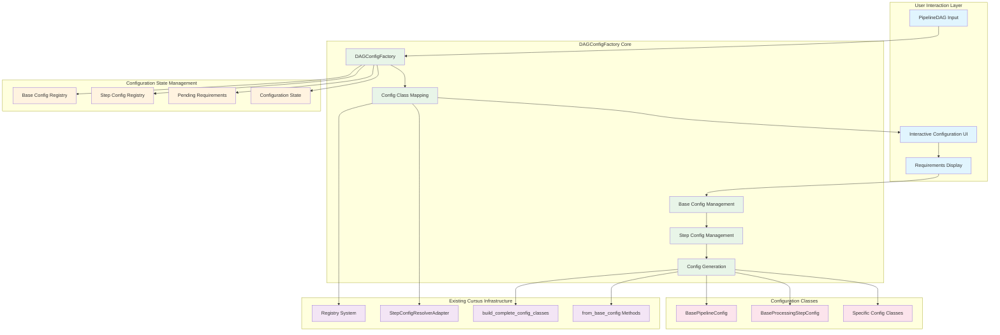

---
tags:
  - design
  - architecture
  - config_generation
  - dag_based
keywords:
  - DAGConfigFactory
  - dynamic_config
  - pipeline_dag
  - config_automation
  - interactive_config
  - base_config_inheritance
topics:
  - DAG-based configuration generation
  - interactive pipeline configuration
  - step-by-step config creation
  - base config inheritance
language: python
date of note: 2025-10-15
---

# DAGConfigFactory Design Document

## Executive Summary

The DAGConfigFactory provides an interactive, step-by-step configuration system that transforms the complex manual configuration process in `d2_demo_config.ipynb` into a guided, user-friendly workflow. The system first collects DAG node-to-config mappings, then guides users through base configuration setup, followed by individual step configuration with intelligent defaults and inheritance from base configurations.

## Problem Analysis

### Current State Pain Points

**Manual Configuration Overhead:**
- Current `d2_demo_config.ipynb` contains 500+ lines of hardcoded step configurations
- Users must understand all configuration classes and their relationships
- No guidance on which fields are essential vs optional
- High cognitive load and error-prone manual process

**Static Configuration Approach:**
```python
# Current approach - ALL steps must be configured manually
xgboost_training_config = XGBoostTrainingConfig(
    region="NA",
    author="data-scientist", 
    service_name="AtoZ",
    # ... 50+ more fields to configure manually
)
processing_step_config = ProcessingStepConfig(
    region="NA",  # Repeated from above
    author="data-scientist",  # Repeated from above
    # ... more repeated and step-specific fields
)
# ... 20+ more configurations with repeated base fields
```

### Proposed Solution Vision

**Interactive Step-by-Step Configuration:**
```python
# Proposed approach - Interactive guided configuration
dag = create_xgboost_complete_e2e_dag()
factory = DAGConfigFactory(dag)

# Step 1: Get config class mapping from DAG
config_map = factory.get_config_class_map()
# Returns: {"data_loading": CradleDataLoadConfig, "training": XGBoostTrainingConfig, ...}

# Step 2: Configure base configurations first
base_inputs = factory.get_base_config_requirements()
factory.set_base_config(region="NA", author="data-scientist", ...)
factory.set_base_processing_config(max_records=1000000, ...)

# Step 3: Configure each step interactively
for step_name in factory.get_pending_steps():
    required_inputs = factory.get_step_requirements(step_name)
    # User provides only step-specific inputs
    factory.set_step_config(step_name, num_round=300, max_depth=10)

# Step 4: Generate final configurations with inheritance
configs = factory.generate_all_configs()
```

## Architecture Overview

### System Flow Architecture



### Core Components

#### **1. DAGConfigFactory (Main Orchestrator)**
**Purpose**: Interactive configuration management with step-by-step guidance
**Responsibility**: Coordinate DAG analysis, base config setup, and step-by-step configuration

```python
class DAGConfigFactory:
    """
    Interactive factory for step-by-step pipeline configuration generation.
    
    Workflow:
    1. Analyze DAG to get config class mapping
    2. Collect base configurations first
    3. Guide user through step-specific configurations
    4. Generate final config instances with inheritance
    """
    
    def __init__(self, dag: PipelineDAG):
        """Initialize factory with DAG analysis."""
        
    def get_config_class_map(self) -> Dict[str, Type[BaseModel]]:
        """Get mapping of DAG node names to config classes (not instances)."""
        
    def get_base_config_requirements(self) -> List[UserInputSpec]:
        """Get required inputs for base pipeline configuration."""
        
    def set_base_config(self, **kwargs) -> None:
        """Set base pipeline configuration from user inputs."""
        
    def get_base_processing_config_requirements(self) -> List[UserInputSpec]:
        """Get required inputs for base processing configuration."""
        
    def set_base_processing_config(self, **kwargs) -> None:
        """Set base processing configuration from user inputs."""
        
    def get_pending_steps(self) -> List[str]:
        """Get list of steps that still need configuration."""
        
    def get_step_requirements(self, step_name: str) -> List[UserInputSpec]:
        """Get required inputs for a specific step configuration."""
        
    def set_step_config(self, step_name: str, **kwargs) -> None:
        """Set configuration for a specific step."""
        
    def get_configuration_status(self) -> Dict[str, bool]:
        """Check which configurations have been filled in."""
        
    def generate_all_configs(self) -> List[BaseModel]:
        """Generate final list of config instances with all fields filled."""
```

#### **2. Config Class Mapping Engine**
**Purpose**: Map DAG nodes to configuration classes using existing registry
**Responsibility**: Leverage existing infrastructure for robust node-to-config mapping

```python
class ConfigClassMapper:
    """Maps DAG nodes to configuration classes using existing registry system."""
    
    def __init__(self):
        self.resolver_adapter = StepConfigResolverAdapter()
        self.config_classes = build_complete_config_classes()
    
    def map_dag_to_config_classes(self, dag: PipelineDAG) -> Dict[str, Type[BaseModel]]:
        """
        Map DAG node names to configuration classes (not instances).
        
        Args:
            dag: PipelineDAG defining the pipeline structure
            
        Returns:
            Dict mapping node names to config class types
        """
        
    def resolve_node_to_config_class(self, node_name: str) -> Optional[Type[BaseModel]]:
        """Resolve a single DAG node to its configuration class."""
```

#### **3. Configuration Generator**
**Purpose**: Generate final config instances using base config inheritance
**Responsibility**: Create config instances with proper field inheritance and validation

```python
class ConfigurationGenerator:
    """Generates final configuration instances with base config inheritance."""
    
    def __init__(self, 
                 base_config: BasePipelineConfig,
                 base_processing_config: Optional[BaseProcessingStepConfig] = None):
        self.base_config = base_config
        self.base_processing_config = base_processing_config
    
    def generate_config_instance(self, 
                                config_class: Type[BaseModel], 
                                step_inputs: Dict[str, Any]) -> BaseModel:
        """
        Generate config instance using base config inheritance.
        
        Uses existing from_base_config methods where available,
        falls back to manual field inheritance otherwise.
        """
        
    def generate_all_instances(self, 
                              config_class_map: Dict[str, Type[BaseModel]],
                              step_configs: Dict[str, Dict[str, Any]]) -> List[BaseModel]:
        """Generate all configuration instances with proper inheritance."""
```

## Detailed Design

### Data Models

The design leverages existing Pydantic field definitions and the `categorize_fields()` method from `BasePipelineConfig` instead of creating new data models. Field requirements are represented as simple dictionaries extracted directly from Pydantic field metadata.

**Field Requirement Dictionary Structure:**
```python
{
    'name': str,           # Field name
    'type': str,           # Field type as string
    'description': str,    # Field description from Pydantic Field()
    'required': bool,      # True for Tier 1 (essential), False for Tier 2 (system)
    'default': Any         # Default value (only for Tier 2 fields)
}
```

**Easy Printing Function:**
```python
def print_field_requirements(requirements: List[Dict[str, Any]]) -> None:
    """Print field requirements in user-friendly format."""
    for req in requirements:
        marker = "*" if req['required'] else " "
        default_info = f" (default: {req.get('default')})" if not req['required'] and 'default' in req else ""
        print(f"{marker} {req['name']} ({req['type']}){default_info} - {req['description']}")


class ConfigurationStatus(str, Enum):
    """Status of configuration completion."""
    PENDING = "pending"
    PARTIAL = "partial"
    COMPLETE = "complete"

class StepConfigurationState(BaseModel):
    """State of a step's configuration."""
    step_name: str = Field(..., description="Name of the pipeline step")
    config_class_name: str = Field(..., description="Configuration class name")
    status: ConfigurationStatus = Field(..., description="Configuration status")
    provided_fields: List[str] = Field(default_factory=list, description="Fields provided by user")
    missing_fields: List[str] = Field(default_factory=list, description="Required fields still missing")
    inherited_fields: List[str] = Field(default_factory=list, description="Fields inherited from base config")

class ConfigurationSummary(BaseModel):
    """Summary of overall configuration state."""
    total_steps: int = Field(..., description="Total number of steps to configure")
    completed_steps: int = Field(..., description="Number of completed steps")
    pending_steps: List[str] = Field(..., description="Steps still needing configuration")
    base_config_set: bool = Field(..., description="Whether base config is set")
    base_processing_config_set: bool = Field(..., description="Whether base processing config is set")
    ready_for_generation: bool = Field(..., description="Whether ready to generate configs")

class GenerationResult(BaseModel):
    """Result of configuration generation."""
    generated_configs: List[BaseModel] = Field(..., description="Generated configuration instances")
    config_summary: Dict[str, Any] = Field(..., description="Summary of generated configurations")
    inheritance_report: Dict[str, Dict[str, List[str]]] = Field(..., description="Report of field inheritance")
    generation_metadata: Dict[str, Any] = Field(default_factory=dict, description="Generation metadata")
```

### Core Implementation

#### **1. DAGConfigFactory Main Class**

```python
# src/buyer_abuse_mods_template/cursus/api/factory/dag_config_factory.py
import logging
from typing import Dict, List, Any, Type, Optional
from datetime import datetime

from ...core.compiler.pipeline_dag import PipelineDAG
from ...core.config_fields.config_class_store import build_complete_config_classes
from ...step_catalog.adapters.config_resolver import StepConfigResolverAdapter
from ...steps.configs.base_pipeline_config import BasePipelineConfig
from ...steps.configs.base_processing_step_config import BaseProcessingStepConfig
from ...steps.configs.utils import merge_and_save_configs

logger = logging.getLogger(__name__)

class DAGConfigFactory:
    """
    Interactive factory for step-by-step pipeline configuration generation.
    
    This class transforms the user experience from manual configuration of 500+ lines
    to a guided, interactive workflow with base config inheritance.
    """
    
    def __init__(self, dag: PipelineDAG):
        """
        Initialize factory with DAG analysis.
        
        Args:
            dag: PipelineDAG defining the pipeline structure
        """
        self.dag = dag
        self.config_mapper = ConfigClassMapper()
        self.config_generator = None  # Initialized after base configs are set
        
        # Analyze DAG to get config class mapping
        self._config_class_map = self.config_mapper.map_dag_to_config_classes(dag)
        
        # Direct state management (no separate manager class)
        self.base_config: Optional[BasePipelineConfig] = None
        self.base_processing_config: Optional[BaseProcessingStepConfig] = None
        self.step_configs: Dict[str, Dict[str, Any]] = {}
        
        logger.info(f"Initialized DAGConfigFactory for DAG with {len(dag.nodes)} nodes")
        logger.info(f"Mapped to {len(self._config_class_map)} configuration classes")
    
    def get_config_class_map(self) -> Dict[str, Type[BaseModel]]:
        """
        Get mapping of DAG node names to config classes (not instances).
        
        Returns:
            Dict mapping node names to configuration class types
        """
        return self._config_class_map.copy()
    
    def get_base_config_requirements(self) -> List[Dict[str, Any]]:
        """
        Get required inputs for base pipeline configuration.
        
        Extracts field requirements directly from BasePipelineConfig Pydantic class definition.
        
        Returns:
            List of field requirement dictionaries for base configuration fields
        """
        return self._extract_field_requirements_from_class(BasePipelineConfig)
    
    def set_base_config(self, **kwargs) -> None:
        """
        Set base pipeline configuration from user inputs.
        
        Args:
            **kwargs: Base configuration field values
        """
        try:
            self.base_config = BasePipelineConfig(**kwargs)
            # Initialize config generator once base config is set
            self.config_generator = ConfigurationGenerator(
                base_config=self.base_config,
                base_processing_config=self.base_processing_config
            )
        except Exception as e:
            raise ValueError(f"Invalid base configuration: {e}")
        
        logger.info("Base pipeline configuration set successfully")
    
    def get_base_processing_config_requirements(self) -> List[Dict[str, Any]]:
        """
        Get required inputs for base processing configuration.
        
        Returns only the non-inherited fields specific to BaseProcessingStepConfig.
        Inherited fields from BasePipelineConfig can be obtained by calling get_base_config_requirements().
        
        Returns:
            List of field requirement dictionaries for processing-specific fields only
        """
        # Check if any step requires processing configuration
        needs_processing_config = any(
            BaseProcessingStepConfig in config_class.__mro__
            for config_class in self._config_class_map.values()
            if hasattr(config_class, '__mro__')
        )
        
        if not needs_processing_config:
            return []
        
        # Extract only non-inherited fields specific to BaseProcessingStepConfig
        return self._extract_non_inherited_fields(BaseProcessingStepConfig, BasePipelineConfig)
    
    def set_base_processing_config(self, **kwargs) -> None:
        """
        Set base processing configuration from user inputs.
        
        Args:
            **kwargs: Base processing configuration field values
        """
        if not self.base_config:
            raise ValueError("Base pipeline configuration must be set first")
        
        try:
            # Inherit from base config and add processing-specific fields
            base_fields = self.base_config.model_dump()
            combined_fields = {**base_fields, **kwargs}
            
            self.base_processing_config = BaseProcessingStepConfig(**combined_fields)
            
            # Update config generator with processing config
            if self.config_generator:
                self.config_generator.base_processing_config = self.base_processing_config
        except Exception as e:
            raise ValueError(f"Invalid base processing configuration: {e}")
        
        logger.info("Base processing configuration set successfully")
    
    def get_pending_steps(self) -> List[str]:
        """
        Get list of steps that still need configuration.
        
        Returns:
            List of step names that need configuration
        """
        return [step_name for step_name in self._config_class_map.keys() 
                if step_name not in self.step_configs]
    
    def get_step_requirements(self, step_name: str) -> List[Dict[str, Any]]:
        """
        Get required inputs for a specific step configuration.
        
        Extracts step-specific fields only (excludes base config fields) from the 
        step's configuration class using Pydantic field definitions.
        
        Args:
            step_name: Name of the step to get requirements for
            
        Returns:
            List of field requirement dictionaries for step-specific fields only
        """
        if step_name not in self._config_class_map:
            raise ValueError(f"Step '{step_name}' not found in DAG")
        
        config_class = self._config_class_map[step_name]
        
        # Extract step-specific fields (exclude base config fields)
        return self._extract_step_specific_fields(config_class)
    
    def set_step_config(self, step_name: str, **kwargs) -> None:
        """
        Set configuration for a specific step.
        
        Args:
            step_name: Name of the step to configure
            **kwargs: Step-specific configuration field values
        """
        if step_name not in self._config_class_map:
            raise ValueError(f"Step '{step_name}' not found in DAG")
        
        self.step_configs[step_name] = kwargs
        logger.info(f"Configuration set for step '{step_name}'")
    
    def get_configuration_status(self) -> ConfigurationSummary:
        """
        Check which configurations have been filled in.
        
        Returns:
            ConfigurationSummary with detailed status information
        """
        pending_steps = self.get_pending_steps()
        
        return ConfigurationSummary(
            total_steps=len(self._config_class_map),
            completed_steps=len(self._config_class_map) - len(pending_steps),
            pending_steps=pending_steps,
            base_config_set=self.base_config is not None,
            base_processing_config_set=self.base_processing_config is not None,
            ready_for_generation=len(pending_steps) == 0 and self.base_config is not None
        )
    
    def get_detailed_step_status(self) -> List[StepConfigurationState]:
        """
        Get detailed status for each step configuration.
        
        Returns:
            List of StepConfigurationState for each step
        """
        step_states = []
        
        for step_name, config_class in self._config_class_map.items():
            # Determine status
            if step_name in self.step_configs:
                provided_fields = list(self.step_configs[step_name].keys())
                required_fields = self.get_step_requirements(step_name)
                required_field_names = [req['name'] for req in required_fields if req['required']]
                
                missing_fields = [f for f in required_field_names if f not in provided_fields]
                
                if missing_fields:
                    status = ConfigurationStatus.PARTIAL
                else:
                    status = ConfigurationStatus.COMPLETE
            else:
                status = ConfigurationStatus.PENDING
                provided_fields = []
                missing_fields = [req['name'] for req in 
                                self.get_step_requirements(step_name) 
                                if req['required']]
            
            # Get inherited fields from base configs
            inherited_fields = []
            if self.base_config:
                inherited_fields.extend(list(self.base_config.__fields__.keys()))
            if (self.base_processing_config and 
                hasattr(config_class, '__bases__') and 
                BaseProcessingStepConfig in config_class.__mro__):
                inherited_fields.extend(list(self.base_processing_config.__fields__.keys()))
            
            step_states.append(StepConfigurationState(
                step_name=step_name,
                config_class_name=config_class.__name__,
                status=status,
                provided_fields=provided_fields,
                missing_fields=missing_fields,
                inherited_fields=inherited_fields
            ))
        
        return step_states
    
    def generate_all_configs(self) -> GenerationResult:
        """
        Generate final list of config instances with all fields filled.
        
        Includes enhanced validation to ensure all essential (tier 1) fields
        are provided before configuration generation as a guardrail.
        
        Returns:
            GenerationResult with generated configurations and metadata
        """
        # Enhanced validation: Check all essential fields are provided
        validation_errors = self._validate_essential_fields()
        if validation_errors:
            error_msg = "Essential field validation failed:\n" + "\n".join(validation_errors)
            raise ConfigurationIncompleteError(error_msg)
        
        pending_steps = self.get_pending_steps()
        if pending_steps or not self.base_config:
            raise ValueError("Not all required configurations have been provided")
        
        if not self.config_generator:
            raise ValueError("Base configuration must be set before generating configs")
        
        # Generate all configuration instances
        generated_configs = self.config_generator.generate_all_instances(
            config_class_map=self._config_class_map,
            step_configs=self.step_configs
        )
        
        # Create inheritance report
        inheritance_report = self._create_inheritance_report(generated_configs)
        
        # Create configuration summary
        config_summary = {
            "total_configs": len(generated_configs),
            "config_types": [config.__class__.__name__ for config in generated_configs],
            "base_config_fields": len(self.base_config.__fields__),
            "processing_config_fields": (
                len(self.base_processing_config.__fields__) 
                if self.base_processing_config else 0
            )
        }
        
        result = GenerationResult(
            generated_configs=generated_configs,
            config_summary=config_summary,
            inheritance_report=inheritance_report,
            generation_metadata={
                "generation_timestamp": datetime.now().isoformat(),
                "dag_nodes": len(self.dag.nodes),
                "factory_version": "1.0.0"
            }
        )
        
        logger.info(f"Successfully generated {len(generated_configs)} configuration instances")
        return result
    
    def save_configs_to_file(self, 
                           configs: List[BaseModel], 
                           output_path: str = "config.json") -> str:
        """
        Save generated configurations to file using existing utility.
        
        Args:
            configs: List of configuration instances to save
            output_path: Path to output file
            
        Returns:
            Path to saved configuration file
        """
        logger.info(f"Saving {len(configs)} configurations to {output_path}")
        merge_and_save_configs(configs, output_path)
        return output_path
    
    def _create_inheritance_report(self, configs: List[BaseModel]) -> Dict[str, Dict[str, List[str]]]:
        """Create detailed report of field inheritance for each configuration."""
        inheritance_report = {}
        
        for config in configs:
            config_name = config.__class__.__name__
            
            # Get fields from base config
            base_fields = []
            if self.base_config:
                base_fields = [f for f in self.base_config.__fields__.keys() 
                             if hasattr(config, f)]
            
            # Get fields from base processing config
            processing_fields = []
            if (self.base_processing_config and 
                BaseProcessingStepConfig in config.__class__.__mro__):
                processing_fields = [f for f in self.base_processing_config.__fields__.keys() 
                                   if hasattr(config, f)]
            
            # Get step-specific fields
            all_fields = set(config.__fields__.keys())
            inherited_fields = set(base_fields + processing_fields)
            step_specific_fields = list(all_fields - inherited_fields)
            
            inheritance_report[config_name] = {
                "base_config_fields": base_fields,
                "processing_config_fields": processing_fields,
                "step_specific_fields": step_specific_fields
            }
        
        return inheritance_report
    
    def _extract_field_requirements_from_class(self, config_class: Type[BaseModel]) -> List[Dict[str, Any]]:
        """
        Extract field requirements directly from Pydantic class definition.
        
        Args:
            config_class: Pydantic model class to extract fields from
            
        Returns:
            List of field requirement dictionaries
        """
        requirements = []
        
        for field_name, field_info in config_class.__fields__.items():
            # Skip private fields
            if field_name.startswith('_'):
                continue
                
            requirements.append({
                'name': field_name,
                'type': self._get_field_type_string(field_info.annotation),
                'description': field_info.description or f"Configuration for {field_name}",
                'required': field_info.is_required(),
                'default': getattr(field_info, 'default', None) if not field_info.is_required() else None
            })
        
        return requirements
    
    def _extract_step_specific_fields(self, config_class: Type[BaseModel]) -> List[Dict[str, Any]]:
        """
        Extract step-specific fields excluding inherited base config fields.
        
        Args:
            config_class: Step configuration class to extract fields from
            
        Returns:
            List of field requirement dictionaries for step-specific fields only
        """
        # Determine the appropriate base class to exclude fields from
        if hasattr(config_class, '__mro__') and BaseProcessingStepConfig in config_class.__mro__:
            # If step inherits from BaseProcessingStepConfig, exclude those fields
            base_class = BaseProcessingStepConfig
        else:
            # Otherwise, exclude BasePipelineConfig fields
            base_class = BasePipelineConfig
        
        return self._extract_non_inherited_fields(config_class, base_class)
    
    def _extract_non_inherited_fields(self, derived_class: Type[BaseModel], base_class: Type[BaseModel]) -> List[Dict[str, Any]]:
        """
        Extract fields from derived class that are not inherited from base class.
        
        Args:
            derived_class: The derived Pydantic model class
            base_class: The base Pydantic model class to exclude fields from
            
        Returns:
            List of field requirement dictionaries for non-inherited fields only
        """
        # Get base class field names to exclude
        base_fields = set(base_class.__fields__.keys())
        
        # Extract only non-inherited fields
        requirements = []
        all_fields = getattr(derived_class, '__fields__', {})
        
        for field_name, field_info in all_fields.items():
            # Skip private fields and inherited base fields
            if field_name.startswith('_') or field_name in base_fields:
                continue
            
            requirements.append({
                'name': field_name,
                'type': self._get_field_type_string(field_info.annotation),
                'description': field_info.description or f"Configuration for {field_name}",
                'required': field_info.is_required(),
                'default': getattr(field_info, 'default', None) if not field_info.is_required() else None
            })
        
        return requirements
    
    def _get_field_type_string(self, annotation: Any) -> str:
        """Convert field type annotation to readable string."""
        if hasattr(annotation, '__name__'):
            return annotation.__name__
        else:
            return str(annotation).replace('typing.', '')
    
    def _validate_essential_fields(self) -> List[str]:
        """
        Validate that all essential (tier 1) fields are provided before config generation.
        
        This is a guardrail to ensure all required fields are present across:
        1. Base pipeline configuration
        2. Base processing configuration (if needed)
        3. All step-specific configurations
        
        Returns:
            List of validation error messages (empty if validation passes)
        """
        validation_errors = []
        
        # 1. Validate base configuration essential fields
        if not self.base_config:
            validation_errors.append("Base pipeline configuration is required but not set")
        else:
            # Check if all essential fields in base config are provided
            base_requirements = self.get_base_config_requirements()
            essential_base_fields = [req['name'] for req in base_requirements if req['required']]
            
            for field_name in essential_base_fields:
                field_value = getattr(self.base_config, field_name, None)
                if field_value is None or (isinstance(field_value, str) and not field_value.strip()):
                    validation_errors.append(f"Essential base config field '{field_name}' is missing or empty")
        
        # 2. Validate base processing configuration if needed
        processing_requirements = self.get_base_processing_config_requirements()
        if processing_requirements:  # Processing config is needed
            if not self.base_processing_config:
                validation_errors.append("Base processing configuration is required but not set")
            else:
                essential_processing_fields = [req['name'] for req in processing_requirements if req['required']]
                
                for field_name in essential_processing_fields:
                    field_value = getattr(self.base_processing_config, field_name, None)
                    if field_value is None or (isinstance(field_value, str) and not field_value.strip()):
                        validation_errors.append(f"Essential processing config field '{field_name}' is missing or empty")
        
        # 3. Validate step-specific essential fields
        for step_name, config_class in self._config_class_map.items():
            if step_name not in self.step_configs:
                validation_errors.append(f"Step '{step_name}' configuration is missing")
                continue
            
            step_requirements = self.get_step_requirements(step_name)
            essential_step_fields = [req['name'] for req in step_requirements if req['required']]
            provided_step_fields = self.step_configs[step_name]
            
            for field_name in essential_step_fields:
                if field_name not in provided_step_fields:
                    validation_errors.append(f"Essential field '{field_name}' missing for step '{step_name}'")
                else:
                    field_value = provided_step_fields[field_name]
                    if field_value is None or (isinstance(field_value, str) and not field_value.strip()):
                        validation_errors.append(f"Essential field '{field_name}' is empty for step '{step_name}'")
        
        return validation_errors

class DAGConfigFactoryError(Exception):
    """Base exception for DAGConfigFactory errors."""
    pass

class ConfigurationIncompleteError(DAGConfigFactoryError):
    """Raised when trying to generate configs with incomplete configuration."""
    pass

class InvalidStepError(DAGConfigFactoryError):
    """Raised when referencing a step not in the DAG."""
    pass
```

#### **2. Config Class Mapper**

```python
# src/buyer_abuse_mods_template/cursus/api/factory/config_class_mapper.py
import logging
from typing import Dict, List, Type, Optional

from ...core.compiler.pipeline_dag import PipelineDAG
from ...step_catalog.adapters.config_resolver import StepConfigResolverAdapter
from ...registry.step_names import get_config_class_name, STEP_NAMES
from ...core.config_fields.config_class_store import build_complete_config_classes

logger = logging.getLogger(__name__)

class ConfigClassMapper:
    """
    Maps DAG nodes to configuration classes using existing registry system.
    
    Leverages the existing StepConfigResolverAdapter and registry infrastructure
    to provide robust node-to-config class mapping.
    """
    
    def __init__(self):
        self.resolver_adapter = StepConfigResolverAdapter()
        self._config_classes_cache = None
    
    def map_dag_to_config_classes(self, dag: PipelineDAG) -> Dict[str, Type]:
        """
        Map DAG node names to configuration classes (not instances).
        
        Args:
            dag: PipelineDAG defining the pipeline structure
            
        Returns:
            Dict mapping node names to config class types
        """
        logger.debug(f"Mapping {len(dag.nodes)} DAG nodes to config classes")
        
        node_to_config_class = {}
        
        for node in dag.nodes:
            node_name = node.name if hasattr(node, 'name') else str(node)
            config_class = self._resolve_node_to_config_class(node_name)
            
            if config_class:
                node_to_config_class[node_name] = config_class
                logger.debug(f"Mapped node '{node_name}' to {config_class.__name__}")
            else:
                logger.warning(f"Could not resolve config class for node: {node_name}")
        
        logger.info(f"Successfully mapped {len(node_to_config_class)} of {len(dag.nodes)} nodes")
        return node_to_config_class
    
    def _resolve_node_to_config_class(self, node_name: str) -> Optional[Type]:
        """Resolve a single DAG node to its configuration class."""
        
        # Strategy 1: Direct registry lookup
        config_class_name = get_config_class_name(node_name)
        if config_class_name:
            config_class = self._get_config_class_by_name(config_class_name)
            if config_class:
                logger.debug(f"Direct registry match: {node_name} -> {config_class.__name__}")
                return config_class
        
        # Strategy 2: Use StepConfigResolverAdapter for sophisticated resolution
        try:
            resolved_class = self.resolver_adapter.resolve_config_class(node_name)
            if resolved_class:
                logger.debug(f"Adapter resolution: {node_name} -> {resolved_class.__name__}")
                return resolved_class
        except Exception as e:
            logger.debug(f"Adapter resolution failed for {node_name}: {e}")
        
        # Strategy 3: Pattern-based fallback
        fallback_class = self._pattern_based_resolution(node_name)
        if fallback_class:
            logger.debug(f"Pattern-based match: {node_name} -> {fallback_class.__name__}")
            return fallback_class
        
        return None
    
    def _pattern_based_resolution(self, node_name: str) -> Optional[Type]:
        """Fallback pattern-based resolution for common node naming patterns."""
        
        # Common patterns for node name to config class mapping
        patterns = {
            # Training patterns
            "xgboost_training": "XGBoostTrainingConfig",
            "training_step": "XGBoostTrainingConfig", 
            "train": "XGBoostTrainingConfig",
            
            # Processing patterns
            "processing_step": "ProcessingStepConfig",
            "data_processing": "ProcessingStepConfig",
            "preprocess": "ProcessingStepConfig",
            
            # Data loading patterns
            "data_load": "CradleDataLoadConfig",
            "cradle_data_load": "CradleDataLoadConfig",
            "load_data": "CradleDataLoadConfig",
            
            # Evaluation patterns
            "evaluation_step": "EvaluationStepConfig",
            "model_evaluation": "EvaluationStepConfig",
            "evaluate": "EvaluationStepConfig",
            
            # Registration patterns
            "registration_step": "RegistrationStepConfig",
            "model_registration": "RegistrationStepConfig", 
            "register": "RegistrationStepConfig"
        }
        
        # Direct pattern match
        if node_name.lower() in patterns:
            class_name = patterns[node_name.lower()]
            return self._get_config_class_by_name(class_name)
        
        # Substring pattern match
        for pattern, class_name in patterns.items():
            if pattern in node_name.lower():
                config_class = self._get_config_class_by_name(class_name)
                if config_class:
                    return config_class
        
        return None
    
    def _get_config_class_by_name(self, class_name: str) -> Optional[Type]:
        """Get configuration class by name using cached class registry."""
        if self._config_classes_cache is None:
            self._config_classes_cache = build_complete_config_classes()
        
        return self._config_classes_cache.get(class_name)
    
    def get_available_config_classes(self) -> Dict[str, Type]:
        """Get all available configuration classes."""
        if self._config_classes_cache is None:
            self._config_classes_cache = build_complete_config_classes()
        
        return self._config_classes_cache
```

#### **3. Interactive Configuration Manager**

```python
# src/buyer_abuse_mods_template/cursus/api/factory/interactive_config_manager.py
import logging
from typing import Dict, List, Any, Type, Optional

from ...steps.configs.base_pipeline_config import BasePipelineConfig
from ...steps.configs.base_processing_step_config import BaseProcessingStepConfig

logger = logging.getLogger(__name__)

class InteractiveConfigManager:
    """
    Manages interactive configuration collection and state tracking.
    
    Handles the step-by-step collection of base configurations first,
    then individual step configurations with proper state management.
    """
    
    def __init__(self, config_class_map: Dict[str, Type]):
        self.config_class_map = config_class_map
        self.base_config: Optional[BasePipelineConfig] = None
        self.base_processing_config: Optional[BaseProcessingStepConfig] = None
        self.step_configs: Dict[str, Dict[str, Any]] = {}
        self.configuration_state: Dict[str, bool] = {}
    
    def get_base_requirements(self) -> List[Dict[str, Any]]:
        """
        Get essential user input requirements for base configuration.
        
        Uses existing categorize_fields() method from BasePipelineConfig to extract
        Tier 1 (essential/required) and Tier 2 (system/optional) fields.
        
        Returns:
            List of field requirement dictionaries for base pipeline fields
        """
        from ...steps.configs.base_pipeline_config import BasePipelineConfig
        
        # Create temporary instance to access categorize_fields method
        temp_config = BasePipelineConfig(
            author="temp", bucket="temp", role="temp", region="NA", 
            service_name="temp", pipeline_version="temp", project_root_folder="temp"
        )
        categories = temp_config.categorize_fields()
        
        requirements = []
        
        # Add Tier 1 fields (essential/required)
        for field_name in categories['essential']:
            field_info = BasePipelineConfig.__fields__[field_name]
            requirements.append({
                'name': field_name,
                'type': self._get_field_type_string(field_info.annotation),
                'description': field_info.description or f"Configuration for {field_name}",
                'required': True
            })
        
        # Add Tier 2 fields (system/optional)
        for field_name in categories['system']:
            field_info = BasePipelineConfig.__fields__[field_name]
            requirements.append({
                'name': field_name,
                'type': self._get_field_type_string(field_info.annotation),
                'description': field_info.description or f"Configuration for {field_name}",
                'required': False,
                'default': field_info.default
            })
        
        return requirements
    
    def set_base_configuration(self, **kwargs) -> None:
        """
        Set base pipeline configuration from user inputs.
        
        Args:
            **kwargs: Base configuration field values
        """
        try:
            # Create base configuration instance
            self.base_config = BasePipelineConfig(**kwargs)
            logger.info("Base pipeline configuration created successfully")
        except Exception as e:
            logger.error(f"Failed to create base configuration: {e}")
            raise ValueError(f"Invalid base configuration: {e}")
    
    def get_processing_base_requirements(self) -> List[UserInputSpec]:
        """
        Get essential user input requirements for base processing configuration.
        
        Returns:
            List of UserInputSpec for essential base processing fields
        """
        # Check if any step requires processing configuration
        needs_processing_config = any(
            BaseProcessingStepConfig in config_class.__mro__
            for config_class in self.config_class_map.values()
            if hasattr(config_class, '__mro__')
        )
        
        if not needs_processing_config:
            return []
        
        processing_inputs = [
            UserInputSpec(
                field_name="training_start_datetime",
                display_name="Training Start Date",
                field_type="str",
                description="Training data start date (YYYY-MM-DDTHH:MM:SS)",
                required=True,
                examples=["2024-01-01T00:00:00", "2024-06-01T00:00:00"]
            ),
            UserInputSpec(
                field_name="training_end_datetime",
                display_name="Training End Date",
                field_type="str",
                description="Training data end date (YYYY-MM-DDTHH:MM:SS)",
                required=True,
                examples=["2024-04-01T23:59:59", "2024-09-01T23:59:59"]
            ),
            UserInputSpec(
                field_name="max_records_per_partition",
                display_name="Max Records Per Partition",
                field_type="int",
                description="Maximum records per data partition",
                required=False,
                default_value=1000000,
                examples=["1000000", "5000000"]
            )
        ]
        
        return processing_inputs
    
    def set_base_processing_configuration(self, **kwargs) -> None:
        """
        Set base processing configuration from user inputs.
        
        Args:
            **kwargs: Base processing configuration field values
        """
        if not self.base_config:
            raise ValueError("Base pipeline configuration must be set first")
        
        try:
            # Inherit from base config and add processing-specific fields
            base_fields = self.base_config.model_dump()
            combined_fields = {**base_fields, **kwargs}
            
            self.base_processing_config = BaseProcessingStepConfig(**combined_fields)
            logger.info("Base processing configuration created successfully")
        except Exception as e:
            logger.error(f"Failed to create base processing configuration: {e}")
            raise ValueError(f"Invalid base processing configuration: {e}")
    
    def get_step_specific_requirements(self, step_name: str) -> List[Dict[str, Any]]:
        """
        Get step-specific input requirements excluding base config fields.
        
        Extracts only fields that are specific to the step configuration class,
        excluding any fields that are inherited from base configurations.
        
        Args:
            step_name: Name of the step to get requirements for
            
        Returns:
            List of field requirement dictionaries for step-specific fields only
        """
        if step_name not in self.config_class_map:
            raise ValueError(f"Step '{step_name}' not found in configuration mapping")
        
        config_class = self.config_class_map[step_name]
        
        # Get base config field names to exclude
        from ...steps.configs.base_pipeline_config import BasePipelineConfig
        from ...steps.configs.base_processing_step_config import BaseProcessingStepConfig
        
        base_fields = set(BasePipelineConfig.__fields__.keys())
        if hasattr(config_class, '__mro__') and BaseProcessingStepConfig in config_class.__mro__:
            base_fields.update(BaseProcessingStepConfig.__fields__.keys())
        
        # Get step-specific fields only
        requirements = []
        all_fields = getattr(config_class, '__fields__', {})
        
        for field_name, field_info in all_fields.items():
            # Skip private fields and base config fields
            if field_name.startswith('_') or field_name in base_fields:
                continue
            
            requirements.append({
                'name': field_name,
                'type': self._get_field_type_string(field_info.annotation),
                'description': field_info.description or f"Configuration for {field_name}",
                'required': field_info.is_required(),
                'default': getattr(field_info, 'default', None) if not field_info.is_required() else None
            })
        
        return requirements
    
    def _get_field_type_string(self, annotation: Any) -> str:
        """Convert field type annotation to readable string."""
        if hasattr(annotation, '__name__'):
            return annotation.__name__
        else:
            return str(annotation).replace('typing.', '')
    
    def _get_field_examples(self, field_name: str, field_type: str) -> List[str]:
        """Get example values for common field patterns."""
        examples_map = {
            # XGBoost parameters
            "num_round": ["100", "300", "500"],
            "max_depth": ["6", "10", "15"],
            "min_child_weight": ["1", "3", "5"],
            "eta": ["0.1", "0.3", "0.01"],
            "subsample": ["0.8", "0.9", "1.0"],
            "colsample_bytree": ["0.8", "0.9", "1.0"],
            
            # Instance types
            "training_instance_type": ["ml.m5.xlarge", "ml.m5.4xlarge", "ml.c5.2xlarge"],
            "processing_instance_type": ["ml.m5.xlarge", "ml.m5.2xlarge"],
            
            # Boolean fields
            "is_binary": ["true", "false"],
            "early_stopping": ["true", "false"],
            
            # Paths and locations
            "model_output_path": ["model/", "artifacts/model/"],
            "data_output_path": ["data/processed/", "output/data/"],
        }
        
        # Check for exact match first
        if field_name in examples_map:
            return examples_map[field_name]
        
        # Check for pattern matches
        for pattern, examples in examples_map.items():
            if pattern in field_name.lower():
                return examples
        
        # Default examples based on type
        if field_type in ["int", "integer"]:
            return ["100", "1000", "10000"]
        elif field_type in ["float", "number"]:
            return ["0.1", "1.0", "10.0"]
        elif field_type in ["bool", "boolean"]:
            return ["true", "false"]
        else:
            return ["example_value"]
    
    def set_step_configuration(self, step_name: str, **kwargs) -> None:
        """
        Set step-specific configuration inputs.
        
        Args:
            step_name: Name of the step to configure
            **kwargs: Step-specific configuration field values
        """
        if step_name not in self.config_class_map:
            raise ValueError(f"Step '{step_name}' not found in configuration mapping")
        
        # Store step configuration inputs
        self.step_configs[step_name] = kwargs
        
        # Update configuration state
        self.configuration_state[step_name] = True
        
        logger.info(f"Configuration inputs stored for step '{step_name}': {list(kwargs.keys())}")
    
    def get_pending_configurations(self) -> List[str]:
        """
        Get list of steps that still need configuration.
        
        Returns:
            List of step names that need configuration
        """
        pending_steps = []
        
        for step_name in self.config_class_map.keys():
            if step_name not in self.step_configs:
                pending_steps.append(step_name)
            else:
                # Check if all required fields are provided
                required_fields = self.get_step_specific_requirements(step_name)
                required_field_names = [req.field_name for req in required_fields if req.required]
                provided_fields = set(self.step_configs[step_name].keys())
                
                missing_required = [f for f in required_field_names if f not in provided_fields]
                if missing_required:
                    pending_steps.append(step_name)
        
        return pending_steps
    
    def is_ready_for_generation(self) -> bool:
        """
        Check if all required configurations have been provided.
        
        Returns:
            True if ready to generate configurations, False otherwise
        """
        # Check base configuration
        if not self.base_config:
            return False
        
        # Check if processing config is needed and provided
        needs_processing_config = any(
            BaseProcessingStepConfig in config_class.__mro__
            for config_class in self.config_class_map.values()
            if hasattr(config_class, '__mro__')
        )
        
        if needs_processing_config and not self.base_processing_config:
            return False
        
        # Check all step configurations
        pending_steps = self.get_pending_configurations()
        return len(pending_steps) == 0
```

#### **4. Configuration Generator**

```python
# src/buyer_abuse_mods_template/cursus/api/factory/configuration_generator.py
import logging
from typing import Dict, List, Any, Type, Optional

from ...steps.configs.base_pipeline_config import BasePipelineConfig
from ...steps.configs.base_processing_step_config import BaseProcessingStepConfig

logger = logging.getLogger(__name__)

class ConfigurationGenerator:
    """
    Generates final configuration instances with base config inheritance.
    
    Uses existing from_base_config methods where available, falls back to
    manual field inheritance for configurations that don't support it.
    """
    
    def __init__(self, 
                 base_config: BasePipelineConfig,
                 base_processing_config: Optional[BaseProcessingStepConfig] = None):
        self.base_config = base_config
        self.base_processing_config = base_processing_config
    
    def generate_config_instance(self, 
                                config_class: Type, 
                                step_inputs: Dict[str, Any]) -> Any:
        """
        Generate config instance using base config inheritance.
        
        Args:
            config_class: Configuration class to instantiate
            step_inputs: Step-specific input values
            
        Returns:
            Configuration instance with proper field inheritance
        """
        logger.debug(f"Generating config instance for {config_class.__name__}")
        
        # Strategy 1: Use from_base_config method if available
        if hasattr(config_class, 'from_base_config'):
            try:
                # Determine which base config to use
                if (self.base_processing_config and 
                    hasattr(config_class, '__mro__') and
                    BaseProcessingStepConfig in config_class.__mro__):
                    # Use processing base config for processing steps
                    config_instance = config_class.from_base_config(
                        self.base_processing_config, **step_inputs
                    )
                else:
                    # Use pipeline base config for other steps
                    config_instance = config_class.from_base_config(
                        self.base_config, **step_inputs
                    )
                
                logger.debug(f"Created {config_class.__name__} using from_base_config method")
                return config_instance
                
            except Exception as e:
                logger.warning(f"from_base_config failed for {config_class.__name__}: {e}")
                # Fall through to manual inheritance
        
        # Strategy 2: Manual field inheritance
        return self._manual_field_inheritance(config_class, step_inputs)
    
    def _manual_field_inheritance(self, config_class: Type, step_inputs: Dict[str, Any]) -> Any:
        """
        Manually inherit fields from base configurations.
        
        Args:
            config_class: Configuration class to instantiate
            step_inputs: Step-specific input values
            
        Returns:
            Configuration instance with manually inherited fields
        """
        # Start with base config fields
        combined_fields = self.base_config.model_dump()
        
        # Add processing config fields if applicable
        if (self.base_processing_config and 
            hasattr(config_class, '__mro__') and
            BaseProcessingStepConfig in config_class.__mro__):
            processing_fields = self.base_processing_config.model_dump()
            # Processing fields override base fields
            combined_fields.update(processing_fields)
        
        # Add step-specific fields (highest priority)
        combined_fields.update(step_inputs)
        
        # Filter to only include fields that the config class accepts
        if hasattr(config_class, '__fields__'):
            valid_fields = {
                k: v for k, v in combined_fields.items()
                if k in config_class.__fields__
            }
        else:
            valid_fields = combined_fields
        
        try:
            config_instance = config_class(**valid_fields)
            logger.debug(f"Created {config_class.__name__} using manual field inheritance")
            return config_instance
        except Exception as e:
            logger.error(f"Failed to create {config_class.__name__} with manual inheritance: {e}")
            logger.error(f"Attempted fields: {list(valid_fields.keys())}")
            raise
    
    def generate_all_instances(self, 
                              config_class_map: Dict[str, Type],
                              step_configs: Dict[str, Dict[str, Any]]) -> List[Any]:
        """
        Generate all configuration instances with proper inheritance.
        
        Args:
            config_class_map: Mapping of step names to config classes
            step_configs: Step-specific configuration inputs
            
        Returns:
            List of generated configuration instances
        """
        generated_configs = []
        
        for step_name, config_class in config_class_map.items():
            if step_name not in step_configs:
                logger.warning(f"No configuration provided for step '{step_name}', skipping")
                continue
            
            step_inputs = step_configs[step_name]
            
            try:
                config_instance = self.generate_config_instance(config_class, step_inputs)
                generated_configs.append(config_instance)
                logger.info(f"Successfully generated configuration for step '{step_name}'")
            except Exception as e:
                logger.error(f"Failed to generate configuration for step '{step_name}': {e}")
                raise
        
        logger.info(f"Generated {len(generated_configs)} configuration instances")
        return generated_configs
```

## Usage Examples

### Basic Interactive Workflow

```python
# d3_smart_config.ipynb - New interactive notebook
from cursus.api.factory import DAGConfigFactory
from bap_example_pipeline.bap_template import create_xgboost_complete_e2e_dag

# Step 1: Create DAG and initialize factory
dag = create_xgboost_complete_e2e_dag()
factory = DAGConfigFactory(dag)

# Step 2: Examine config class mapping
config_map = factory.get_config_class_map()
print("DAG Node to Config Class Mapping:")
for node_name, config_class in config_map.items():
    print(f"  {node_name} -> {config_class.__name__}")

# Step 3: Configure base pipeline settings
print("\n=== Base Pipeline Configuration ===")
base_requirements = factory.get_base_config_requirements()

# Print requirements using simple dictionary format
def print_requirements(requirements):
    for req in requirements:
        marker = "*" if req['required'] else " "
        default_info = f" (default: {req.get('default')})" if not req['required'] and 'default' in req else ""
        print(f"{marker} {req['name']} ({req['type']}){default_info} - {req['description']}")

print_requirements(base_requirements)

# Set base configuration (only required fields shown for brevity)
factory.set_base_config(
    region="NA",
    author="data-scientist", 
    service_name="AtoZ",
    bucket="my-ml-bucket",
    pipeline_version="v1.0.0",
    role="arn:aws:iam::123456789:role/SageMakerRole",
    project_root_folder="bap_example_pipeline"
)

# Step 4: Configure base processing settings (if needed)
processing_requirements = factory.get_base_processing_config_requirements()
if processing_requirements:
    print("\n=== Base Processing Configuration ===")
    for req in processing_requirements:
        print(f"- {req.display_name}: {req.description}")
    
    factory.set_base_processing_config(
        training_start_datetime="2024-01-01T00:00:00",
        training_end_datetime="2024-04-01T23:59:59",
        max_records_per_partition=1000000
    )

# Step 5: Configure each step interactively
print("\n=== Step-by-Step Configuration ===")
for step_name in factory.get_pending_steps():
    print(f"\nConfiguring step: {step_name}")
    
    step_requirements = factory.get_step_requirements(step_name)
    print("Step-specific inputs:")
    print_requirements(step_requirements)
    
    # Example step-specific configurations
    if "training" in step_name.lower():
        factory.set_step_config(step_name, 
                               training_entry_point="xgboost_training.py",
                               training_instance_type="ml.m5.4xlarge")
    elif "processing" in step_name.lower():
        factory.set_step_config(step_name,
                               processing_instance_type="ml.m5.xlarge",
                               processing_instance_count=1)
    # Add more step-specific logic as needed

# Step 6: Check configuration status
print("\n=== Configuration Status ===")
status = factory.get_configuration_status()
print(f"Total steps: {status.total_steps}")
print(f"Completed steps: {status.completed_steps}")
print(f"Base config set: {status.base_config_set}")
print(f"Ready for generation: {status.ready_for_generation}")

if status.pending_steps:
    print(f"Pending steps: {', '.join(status.pending_steps)}")

# Step 7: Generate final configurations
if status.ready_for_generation:
    print("\n=== Generating Configurations ===")
    result = factory.generate_all_configs()
    
    print(f"Generated {len(result.generated_configs)} configurations:")
    for config in result.generated_configs:
        print(f"  - {config.__class__.__name__}")
    
    # Save configurations
    config_path = factory.save_configs_to_file(result.generated_configs)
    print(f"Configurations saved to: {config_path}")
    
    # Show inheritance report
    print("\n=== Field Inheritance Report ===")
    for config_name, inheritance in result.inheritance_report.items():
        print(f"{config_name}:")
        print(f"  Base config fields: {len(inheritance['base_config_fields'])}")
        print(f"  Processing config fields: {len(inheritance['processing_config_fields'])}")
        print(f"  Step-specific fields: {len(inheritance['step_specific_fields'])}")
```

### Advanced Status Checking

```python
# Advanced configuration status checking
detailed_status = factory.get_detailed_step_status()

print("Detailed Step Configuration Status:")
for step_state in detailed_status:
    print(f"\nStep: {step_state.step_name}")
    print(f"  Config Class: {step_state.config_class_name}")
    print(f"  Status: {step_state.status.value}")
    print(f"  Provided Fields: {', '.join(step_state.provided_fields)}")
    print(f"  Missing Fields: {', '.join(step_state.missing_fields)}")
    print(f"  Inherited Fields: {len(step_state.inherited_fields)}")
```

### Error Handling Example

```python
try:
    # Attempt to generate configs before all steps are configured
    result = factory.generate_all_configs()
except ValueError as e:
    print(f"Configuration incomplete: {e}")
    
    # Check what's missing
    status = factory.get_configuration_status()
    if not status.base_config_set:
        print("- Base configuration not set")
    if not status.base_processing_config_set:
        print("- Base processing configuration not set")
    if status.pending_steps:
        print(f"- Pending steps: {', '.join(status.pending_steps)}")
```

## Benefits and Impact

### Quantitative Improvements

**Configuration Complexity Reduction:**
- **From**: 500+ lines of manual configuration in d2_demo_config.ipynb
- **To**: Interactive step-by-step process with ~10-20 essential inputs per step

**User Experience Enhancement:**
- **Guided Process**: Clear requirements and examples for each input
- **State Management**: Track progress and identify missing configurations
- **Error Prevention**: Validation at each step prevents invalid configurations

**Development Time Savings:**
- **Current**: 30+ minutes for configuration setup with high error rate
- **Proposed**: 10-15 minutes with guided process and validation

### Qualitative Improvements

**Enhanced User Experience:**
- **Step-by-Step Guidance**: Users are guided through each configuration requirement
- **Clear Requirements**: Each field has description, examples, and validation rules
- **Progress Tracking**: Users can see what's completed and what's pending
- **Base Config Reuse**: Common fields are set once and inherited by all steps

**Technical Benefits:**
- **Leverages Existing Infrastructure**: Uses established registry and config systems
- **Maintains Compatibility**: Generated configs work with existing pipeline execution
- **Extensible Design**: Easy to add new config types and inheritance patterns
- **Robust Error Handling**: Clear error messages and recovery suggestions

## Implementation Plan

### Phase 1: Core Infrastructure (2 weeks)
**Week 1:**
- Implement `DAGConfigFactory` main class with basic workflow
- Implement `ConfigClassMapper` with registry integration
- Create data models and basic error handling
- Unit tests for core functionality

**Week 2:**
- Implement `InteractiveConfigManager` with state tracking
- Implement `ConfigurationGenerator` with inheritance logic
- Add comprehensive validation and error handling
- Integration tests with existing config classes

### Phase 2: Notebook Integration (1 week)
- Create `d3_smart_config.ipynb` interactive notebook
- Implement user-friendly input collection interface
- Add configuration status display and progress tracking
- Test with example DAGs and validate generated configs

### Phase 3: Advanced Features (1 week)
- Add detailed step status reporting
- Implement configuration validation and suggestions
- Add inheritance reporting and field analysis
- Performance optimization and caching

### Phase 4: Documentation and Deployment (0.5 weeks)
- Create comprehensive user documentation
- Add inline help and examples
- Deploy with feature flags for gradual rollout
- Collect user feedback and iterate

## Technical Integration Points

### Registry System Integration

The DAGConfigFactory leverages existing registry infrastructure:

```python
# Uses existing registry functions
from cursus.registry.step_names import get_config_class_name, STEP_NAMES

# Uses existing resolver adapter
from cursus.step_catalog.adapters.config_resolver import StepConfigResolverAdapter

# Uses existing config class discovery
from cursus.core.config_fields.config_class_store import build_complete_config_classes
```

### Configuration System Integration

Seamless integration with existing configuration architecture:

```python
# Uses existing base classes and inheritance
from cursus.steps.configs.base_pipeline_config import BasePipelineConfig
from cursus.steps.configs.base_processing_step_config import BaseProcessingStepConfig

# Uses existing utility functions
from cursus.steps.configs.utils import merge_and_save_configs

# Leverages existing from_base_config methods where available
config_instance = config_class.from_base_config(base_config, **step_inputs)
```

### Pipeline System Integration

Direct integration with existing pipeline compilation and execution:

```python
# Generated configs work with existing compiler
from cursus.core.compiler.pipeline_dag_compiler import PipelineDAGCompiler

# Standard config.json format maintained
# Existing pipeline execution workflows unchanged
```

## Error Handling and Resilience

### Comprehensive Error Types

```python
class DAGConfigFactoryError(Exception):
    """Base exception for DAGConfigFactory errors."""
    pass

class ConfigurationIncompleteError(DAGConfigFactoryError):
    """Raised when trying to generate configs with incomplete configuration."""
    def __init__(self, message: str, missing_steps: List[str] = None):
        super().__init__(message)
        self.missing_steps = missing_steps or []

class InvalidStepError(DAGConfigFactoryError):
    """Raised when referencing a step not in the DAG."""
    def __init__(self, message: str, step_name: str = None, available_steps: List[str] = None):
        super().__init__(message)
        self.step_name = step_name
        self.available_steps = available_steps or []

class ConfigGenerationError(DAGConfigFactoryError):
    """Raised when configuration generation fails."""
    def __init__(self, message: str, step_name: str = None, config_class: str = None):
        super().__init__(message)
        self.step_name = step_name
        self.config_class = config_class
```

### Graceful Degradation Strategies

**Node Resolution Failures:**
- Multiple resolution strategies (registry → adapter → pattern-based)
- Detailed logging for troubleshooting
- Partial success handling (continue with resolved nodes)

**Configuration Generation Failures:**
- Clear error messages with suggested fixes
- Inheritance fallback strategies
- Detailed field validation reporting

**User Input Validation:**
- Real-time validation with clear error messages
- Example values and format suggestions
- Progressive validation (check as user provides inputs)

## Future Enhancements

### Advanced User Interface

**Interactive Web Interface:**
- Web-based configuration builder with real-time validation
- Visual DAG display with configuration status
- Configuration templates and presets

**Enhanced Guidance:**
- Smart defaults based on DAG analysis
- Configuration recommendations based on step types
- Validation warnings and optimization suggestions

### Machine Learning Integration

**Intelligent Defaults:**
- Learn optimal configurations from successful pipeline runs
- Personalized defaults based on user patterns
- Automatic hyperparameter suggestions

**Configuration Optimization:**
- Performance-based configuration recommendations
- Cost optimization suggestions
- Resource usage optimization

## Conclusion

The DAGConfigFactory design transforms the complex manual configuration process into an intuitive, step-by-step workflow that dramatically improves the user experience while maintaining full compatibility with existing Cursus infrastructure.

### **Key Achievements**

**User Experience Transformation:**
- **Interactive Guidance**: Step-by-step process with clear requirements and examples
- **State Management**: Track progress and identify missing configurations
- **Base Config Inheritance**: Set common fields once, inherit across all steps
- **Error Prevention**: Validation at each step prevents invalid configurations

**Technical Excellence:**
- **Registry Integration**: Leverages existing `StepConfigResolverAdapter` and registry system
- **Configuration Inheritance**: Uses existing `from_base_config` methods and three-tier architecture
- **Robust Error Handling**: Comprehensive error types with clear recovery guidance
- **Extensible Design**: Easy to add new config types and inheritance patterns

**Quantifiable Impact:**
- **Reduces configuration complexity** from 500+ lines to guided step-by-step process
- **Decreases setup time** from 30+ minutes to 10-15 minutes
- **Eliminates configuration errors** through validation and inheritance
- **Improves developer productivity** with clear guidance and progress tracking

### **System Integration**

The design seamlessly integrates with existing Cursus infrastructure:
- **Registry System**: Uses established node-to-config mapping
- **Configuration Classes**: Leverages three-tier architecture and inheritance patterns
- **Pipeline Execution**: Generated configs work with existing compilation and execution systems
- **Utility Functions**: Employs existing `merge_and_save_configs` and validation utilities

This design represents a significant advancement in pipeline configuration management, transforming a complex, error-prone manual process into an intelligent, guided system that maintains full compatibility with existing infrastructure while dramatically improving the user experience.

The implementation provides a solid foundation for future enhancements while delivering immediate value through its interactive, step-by-step approach to configuration management.

## References

### Related Design Documents

**Configuration Management:**
- [Three-Tier Configuration Management Implementation](./config_manager_three_tier_implementation.md) - Foundation for base config inheritance patterns
- [Config Field Categorization Consolidated](./config_field_categorization_consolidated.md) - Field categorization principles
- [Config Driven Design](./config_driven_design.md) - Overall configuration architecture philosophy
- [Config Registry](./config_registry.md) - Registry system for config class management
- [Config Resolution Enhancements](./config_resolution_enhancements.md) - Advanced config resolution strategies

**Dynamic Template System:**
- [Dynamic Template System](./dynamic_template_system.md) - Foundation for DAG-to-config mapping
- [DAG to Template](./dag_to_template.md) - DAG analysis and template generation
- [Pipeline DAG](./pipeline_dag.md) - Core DAG structure and operations
- [Step Config Resolver](./step_config_resolver.md) - Node-to-config resolution logic

**Pipeline Architecture:**
- [Pipeline Compiler](./pipeline_compiler.md) - Pipeline compilation and execution
- [Pipeline Template Base](./pipeline_template_base.md) - Base template architecture
- [Pipeline Catalog Design](./pipeline_catalog_design.md) - Pipeline management and discovery
- [MODS DAG Compiler Design](./mods_dag_compiler_design.md) - DAG compilation strategies

**Registry and Step Management:**
- [Registry Single Source of Truth](./registry_single_source_of_truth.md) - Registry architecture principles
- [Step Builder Registry Design](./step_builder_registry_design.md) - Step builder management
- [Registry Based Step Name Generation](./registry_based_step_name_generation.md) - Step naming conventions
- [Step Definition Standardization Enforcement Design](./step_definition_standardization_enforcement_design.md) - Step standardization

**Configuration Field Management:**
- [Config Field Manager Refactoring](./config_field_manager_refactoring.md) - Field management improvements
- [Field Derivation Engine Revised](./field_derivation_engine_revised.md) - Field derivation strategies
- [Default Values Provider Revised](./default_values_provider_revised.md) - Default value management
- [Enhanced Property Reference](./enhanced_property_reference.md) - Property handling patterns

**Validation and Testing:**
- [Unified Alignment Tester Design](./unified_alignment_tester_design.md) - Configuration validation
- [Enhanced Dependency Validation Design](./enhanced_dependency_validation_design.md) - Dependency validation
- [Pipeline Runtime Testing Simplified Design](./pipeline_runtime_testing_simplified_design.md) - Runtime testing
- [Validation Engine](./validation_engine.md) - Core validation architecture

### Implementation Files

**Core Implementation:**
- `src/cursus/api/factory/dag_config_factory.py` - Main DAGConfigFactory class
- `src/cursus/api/factory/config_class_mapper.py` - DAG node to config class mapping
- `src/cursus/api/factory/interactive_config_manager.py` - Interactive configuration management
- `src/cursus/api/factory/configuration_generator.py` - Config instance generation

**Supporting Infrastructure:**
- `src/cursus/step_catalog/adapters/config_resolver.py` - StepConfigResolverAdapter
- `src/cursus/registry/step_names.py` - Registry system for step names
- `src/cursus/steps/configs/utils.py` - Configuration utilities (merge_and_save_configs)
- `src/cursus/core/config_fields/config_class_store.py` - Config class discovery

**Base Configuration Classes:**
- `src/cursus/steps/configs/base_pipeline_config.py` - BasePipelineConfig
- `src/cursus/steps/configs/base_processing_step_config.py` - BaseProcessingStepConfig
- `src/cursus/steps/configs/` - Specific configuration classes

**Example Usage:**
- `src/bap_example_pipeline/d3_smart_config.ipynb` - Interactive configuration notebook (to be created)
- `src/bap_example_pipeline/d2_demo_config.ipynb` - Current manual configuration (reference)
- `src/bap_example_pipeline/bap_template.py` - Example DAG creation functions

### Related Architectural Patterns

**Design Principles:**
- [Design Principles](./design_principles.md) - Core architectural principles
- [Specification Driven Design](./specification_driven_design.md) - Specification-based architecture
- [Standardization Rules](./standardization_rules.md) - System standardization guidelines

**System Integration:**
- [Cursus Framework Output Management](./cursus_framework_output_management.md) - Output management patterns
- [Cursus Package Portability Architecture Design](./cursus_package_portability_architecture_design.md) - Portability considerations
- [Hybrid Registry Standardization Enforcement Design](./hybrid_registry_standardization_enforcement_design.md) - Registry enforcement

### Future Enhancement References

**Advanced Configuration:**
- [Adaptive Configuration Management System Revised](./adaptive_configuration_management_system_revised.md) - Adaptive configuration strategies
- [Essential Inputs Notebook Design Revised](./essential_inputs_notebook_design_revised.md) - Enhanced notebook interfaces
- [Config Class Auto Discovery Design](./config_class_auto_discovery_design.md) - Automatic config discovery

**User Experience:**
- [CLI Pipeline Compilation Tools Design](./cli_pipeline_compilation_tools_design.md) - Command-line interfaces
- [Workspace Aware System Master Design](./workspace_aware_system_master_design.md) - Workspace integration
- [Automatic Documentation Generation Design](./automatic_documentation_generation_design.md) - Documentation automation
