---
tags:
  - design
  - implementation
  - feature-selection
  - statistical-methods
  - machine-learning
  - script-testability
keywords:
  - feature selection
  - statistical methods
  - machine learning
  - univariate selection
  - recursive feature elimination
  - feature importance
  - correlation analysis
  - variance threshold
  - mutual information
  - LASSO regularization
topics:
  - feature selection
  - statistical analysis
  - machine learning preprocessing
  - dimensionality reduction
  - model performance optimization
language: python
date of note: 2025-10-25
---

# Feature Selection Script Design

## Overview

This design document outlines a comprehensive feature selection script that implements multiple statistical and machine learning-based feature selection methods. The script follows the cursus framework's testability patterns and provides a self-contained solution without requiring new hyperparameter classes or processing modules.

## Related Documents
- **[Script Testability Refactoring Design](./script_testability_refactoring.md)** - Testability implementation patterns
- **[Script Testability Implementation Guide](../0_developer_guide/script_testability_implementation.md)** - Implementation guidelines

## Problem Statement

Feature selection is a critical preprocessing step in machine learning pipelines that:

1. **Reduces dimensionality** by selecting the most relevant features
2. **Improves model performance** by removing noisy or irrelevant features
3. **Reduces overfitting** by eliminating redundant information
4. **Decreases computational cost** by working with fewer features
5. **Enhances interpretability** by focusing on important variables

Current challenges include:
- Lack of a standardized feature selection pipeline in the cursus framework
- Need for multiple selection methods to capture different types of feature relevance
- Requirement for ensemble approaches that combine multiple selection techniques
- Integration with existing cursus script patterns and testability requirements

## Solution Design

### Core Design Principles

#### Self-Contained Implementation
- **Single Script Architecture**: All feature selection logic contained within one script
- **No New Dependencies**: Use only existing framework patterns and standard libraries
- **Environment Variable Configuration**: Follow `tabular_preprocessing.py` pattern for configuration
- **Standard Container Paths**: Compatible with SageMaker processing jobs

#### Comprehensive Method Coverage
- **Statistical Methods**: Univariate tests, correlation analysis, variance filtering
- **ML-Based Methods**: Recursive feature elimination, feature importance, regularization
- **Ensemble Selection**: Combine multiple methods for robust feature selection
- **Configurable Pipeline**: Enable/disable methods based on requirements

#### Production Readiness
- **Testable Architecture**: Follow script testability refactoring patterns
- **Robust Error Handling**: Comprehensive error handling and logging
- **Performance Optimization**: Efficient algorithms and memory management
- **Quality Assurance**: Validation of selected features and selection stability

## Architecture Overview

```mermaid
flowchart TD
    subgraph "📊 Input Data Layer"
        InputData["Input Dataset<br/>• Training data<br/>• Feature matrix<br/>• Target variable<br/>• Optional signature"]
        EnvConfig["Environment Configuration<br/>• Selection methods<br/>• Target variable name<br/>• Selection parameters<br/>• Output preferences"]
    end
    
    subgraph "🔍 Feature Selection Methods"
        StatMethods["Statistical Methods<br/>• Variance threshold<br/>• Correlation analysis<br/>• Chi-square test<br/>• ANOVA F-test<br/>• Mutual information"]
        
        MLMethods["ML-Based Methods<br/>• Recursive Feature Elimination<br/>• Feature importance (RF/XGB)<br/>• LASSO regularization<br/>• Permutation importance<br/>• Sequential selection"]
    end
    
    subgraph "🎯 Selection Pipeline"
        MethodExecution["Method Execution<br/>• Parallel processing<br/>• Individual scoring<br/>• Method validation<br/>• Result collection"]
        
        EnsembleSelection["Ensemble Selection<br/>• Score aggregation<br/>• Voting mechanisms<br/>• Stability analysis<br/>• Final ranking"]
    end
    
    subgraph "📈 Output Layer"
        SelectedFeatures["Selected Features<br/>• Feature names list<br/>• Selection scores<br/>• Method contributions<br/>• Ranking information"]
        
        SelectionReport["Selection Report<br/>• Method performance<br/>• Feature statistics<br/>• Selection stability<br/>• Quality metrics"]
        
        Visualizations["Visualizations<br/>• Feature importance plots<br/>• Correlation heatmaps<br/>• Selection comparison<br/>• Score distributions"]
    end
    
    InputData --> StatMethods
    EnvConfig --> StatMethods
    InputData --> MLMethods
    EnvConfig --> MLMethods
    
    StatMethods --> MethodExecution
    MLMethods --> MethodExecution
    
    MethodExecution --> EnsembleSelection
    
    EnsembleSelection --> SelectedFeatures
    EnsembleSelection --> SelectionReport
    EnsembleSelection --> Visualizations
```



## Pipeline Integration and Data Flow

### Input/Output Alignment

The feature selection script is designed to fit seamlessly between tabular preprocessing and XGBoost training:


### Input Requirements (from Tabular Preprocessing)

**Tabular Preprocessing Output (Producer):**
- **Output Channel**: `output_paths["processed_data"]` = `"/opt/ml/processing/output"`
- **Output Structure**:
```
/opt/ml/processing/output/
├── train/
│   └── train_processed_data.csv
├── val/
│   └── val_processed_data.csv
└── test/
    └── test_processed_data.csv
```

**Feature Selection Input (Consumer):**
- **Input Channel**: `input_paths["input_data"]` = `"/opt/ml/processing/input"`
- **Expected Input Structure**:
```
/opt/ml/processing/input/
├── train/
│   └── train_processed_data.csv
├── val/
│   └── val_processed_data.csv
└── test/
    └── test_processed_data.csv
```

**Data Format Alignment:**
- CSV files with headers
- All features already preprocessed (cleaned, encoded, split)
- Target variable present and properly encoded (from LABEL_FIELD)
- No missing values in critical columns

### Output Requirements (for XGBoost Training)

**Feature Selection Output (Producer):**
- **Output Channel**: `output_paths["processed_data"]` = `"/opt/ml/processing/output"`
- **Output Structure**:
```
/opt/ml/processing/output/
├── train/
│   └── train_processed_data.csv  # Only selected features + target
├── val/
│   └── val_processed_data.csv    # Only selected features + target
├── test/
│   └── test_processed_data.csv   # Only selected features + target
├── selected_features.json        # Feature selection metadata
└── feature_selection_report.json # Selection performance report
```

**XGBoost Training Input (Consumer):**
- **Input Channel**: `input_paths["input_path"]` = `"/opt/ml/input/data"`
- **Expected Input Structure**:
```
/opt/ml/input/data/
├── train/
│   └── [first CSV/Parquet file found]
├── val/
│   └── [first CSV/Parquet file found]
└── test/
    └── [first CSV/Parquet file found]
```

**✅ LOGICAL NAME AND DATA FORMAT ALIGNMENT:**
- **Logical Names**: Both scripts use consistent logical names for input/output channels
- **Data Format**: CSV files with identical structure and naming conventions
- **Pipeline Orchestration**: SageMaker handles physical data transfer between containers

**Critical Alignment Requirements:**
- **Data Format Consistency**: Same CSV structure with headers
- **File Naming Convention**: `{split}_processed_data.csv` format maintained
- **Target Variable**: Same name preserved from LABEL_FIELD
- **Feature Names**: Exact feature names preserved for XGBoost compatibility
- **Split Structure**: train/val/test directory structure maintained

### Logical Name Alignment Verification

**Tabular Preprocessing → Feature Selection:**
```python
# Tabular Preprocessing Output
output_paths = {"processed_data": "/opt/ml/processing/output"}

# Feature Selection Input  
input_paths = {"input_data": "/opt/ml/processing/input"}  # Maps to processed_data via pipeline
```

**Feature Selection → XGBoost Training:**
```python
# Feature Selection Output
output_paths = {"processed_data": "/opt/ml/processing/output"}

# XGBoost Training Input
input_paths = {"input_path": "/opt/ml/input/data"}  # Maps to processed_data via pipeline
```

**Pipeline Integration (SageMaker handles data transfer):**
```python
# Pipeline orchestration example
feature_selection_step = ProcessingStep(
    name="feature-selection",
    outputs=[ProcessingOutput(output_name="processed_data", source="/opt/ml/processing/output")]
)

xgboost_training_step = TrainingStep(
    name="xgboost-training",
    inputs={"training": TrainingInput(s3_data=feature_selection_step.properties.ProcessingOutputConfig.Outputs["processed_data"].S3Output.S3Uri)}
)
```

## Core Implementation

### Main Function Signature

Following the script testability refactoring pattern:

```python
def main(
    input_paths: Dict[str, str],
    output_paths: Dict[str, str], 
    environ_vars: Dict[str, str],
    job_args: argparse.Namespace
) -> None:
    """
    Main function for feature selection processing.
    
    Args:
        input_paths: Dictionary of input paths with logical names
            - "input_data": Directory containing train/val/test splits from tabular preprocessing
        output_paths: Dictionary of output paths with logical names
            - "processed_data": Directory for feature-selected train/val/test splits (XGBoost input format)
        environ_vars: Dictionary of environment variables
            - "FEATURE_SELECTION_METHODS": Comma-separated list of methods
            - "TARGET_VARIABLE": Target column name (from LABEL_FIELD in preprocessing)
            - "N_FEATURES_TO_SELECT": Number/percentage of features to select
            - "CORRELATION_THRESHOLD": Threshold for correlation filtering
            - "VARIANCE_THRESHOLD": Threshold for variance filtering
            - "RANDOM_STATE": Random seed for reproducibility
            - "COMBINATION_STRATEGY": Method combination strategy
        job_args: Command line arguments
            - job_type: Must be "training" to process all splits
    """
```

### Feature Selection Methods

#### Statistical Methods Implementation

```python
def variance_threshold_selection(X: pd.DataFrame, threshold: float = 0.01) -> Dict[str, Any]:
    """
    Remove features with low variance.
    
    Args:
        X: Feature matrix
        threshold: Variance threshold
        
    Returns:
        Dictionary with selected features and scores
    """
    variances = X.var()
    selected_features = variances[variances > threshold].index.tolist()
    
    return {
        "method": "variance_threshold",
        "selected_features": selected_features,
        "scores": variances.to_dict(),
        "threshold": threshold,
        "n_selected": len(selected_features)
    }

def correlation_based_selection(X: pd.DataFrame, y: pd.Series, threshold: float = 0.95) -> Dict[str, Any]:
    """
    Remove highly correlated features, keeping those with higher target correlation.
    
    Args:
        X: Feature matrix
        y: Target variable
        threshold: Correlation threshold
        
    Returns:
        Dictionary with selected features and scores
    """
    # Compute feature correlations
    corr_matrix = X.corr().abs()
    
    # Compute target correlations
    target_corr = X.corrwith(y).abs()
    
    # Find highly correlated pairs
    upper_tri = corr_matrix.where(np.triu(np.ones(corr_matrix.shape), k=1).astype(bool))
    high_corr_pairs = [(col, row) for col in upper_tri.columns for row in upper_tri.index 
                       if upper_tri.loc[row, col] > threshold]
    
    # Remove features with lower target correlation from each pair
    features_to_remove = set()
    for feat1, feat2 in high_corr_pairs:
        if target_corr[feat1] > target_corr[feat2]:
            features_to_remove.add(feat2)
        else:
            features_to_remove.add(feat1)
    
    selected_features = [f for f in X.columns if f not in features_to_remove]
    
    return {
        "method": "correlation_based",
        "selected_features": selected_features,
        "scores": target_corr.to_dict(),
        "removed_features": list(features_to_remove),
        "high_corr_pairs": high_corr_pairs,
        "threshold": threshold,
        "n_selected": len(selected_features)
    }

def mutual_info_selection(X: pd.DataFrame, y: pd.Series, k: int = 10, random_state: int = 42) -> Dict[str, Any]:
    """
    Select features based on mutual information with target.
    
    Args:
        X: Feature matrix
        y: Target variable
        k: Number of features to select
        random_state: Random seed
        
    Returns:
        Dictionary with selected features and scores
    """
    from sklearn.feature_selection import mutual_info_classif, mutual_info_regression
    from sklearn.feature_selection import SelectKBest
    
    # Determine if classification or regression
    is_classification = len(y.unique()) < 20 and y.dtype in ['object', 'category', 'int64']
    
    if is_classification:
        mi_scores = mutual_info_classif(X, y, random_state=random_state)
    else:
        mi_scores = mutual_info_regression(X, y, random_state=random_state)
    
    # Select top k features
    selector = SelectKBest(score_func=lambda X, y: mi_scores, k=min(k, len(X.columns)))
    selector.fit(X, y)
    
    selected_features = X.columns[selector.get_support()].tolist()
    scores = dict(zip(X.columns, mi_scores))
    
    return {
        "method": "mutual_information",
        "selected_features": selected_features,
        "scores": scores,
        "k": k,
        "n_selected": len(selected_features),
        "is_classification": is_classification
    }

def chi2_selection(X: pd.DataFrame, y: pd.Series, k: int = 10) -> Dict[str, Any]:
    """
    Select features using chi-square test (for non-negative features).
    
    Args:
        X: Feature matrix (non-negative values)
        y: Target variable
        k: Number of features to select
        
    Returns:
        Dictionary with selected features and scores
    """
    from sklearn.feature_selection import chi2, SelectKBest
    
    # Ensure non-negative values
    X_nonneg = X.copy()
    X_nonneg[X_nonneg < 0] = 0
    
    # Apply chi-square test
    selector = SelectKBest(score_func=chi2, k=min(k, len(X.columns)))
    selector.fit(X_nonneg, y)
    
    selected_features = X.columns[selector.get_support()].tolist()
    scores = dict(zip(X.columns, selector.scores_))
    
    return {
        "method": "chi2",
        "selected_features": selected_features,
        "scores": scores,
        "k": k,
        "n_selected": len(selected_features)
    }

def f_classif_selection(X: pd.DataFrame, y: pd.Series, k: int = 10) -> Dict[str, Any]:
    """
    Select features using ANOVA F-test.
    
    Args:
        X: Feature matrix
        y: Target variable
        k: Number of features to select
        
    Returns:
        Dictionary with selected features and scores
    """
    from sklearn.feature_selection import f_classif, f_regression, SelectKBest
    
    # Determine if classification or regression
    is_classification = len(y.unique()) < 20 and y.dtype in ['object', 'category', 'int64']
    
    score_func = f_classif if is_classification else f_regression
    selector = SelectKBest(score_func=score_func, k=min(k, len(X.columns)))
    selector.fit(X, y)
    
    selected_features = X.columns[selector.get_support()].tolist()
    scores = dict(zip(X.columns, selector.scores_))
    
    return {
        "method": "f_test",
        "selected_features": selected_features,
        "scores": scores,
        "k": k,
        "n_selected": len(selected_features),
        "is_classification": is_classification
    }
```

#### ML-Based Methods Implementation

```python
def rfe_selection(X: pd.DataFrame, y: pd.Series, estimator_type: str = 'rf', 
                 n_features: int = 10, random_state: int = 42) -> Dict[str, Any]:
    """
    Recursive Feature Elimination with various estimators.
    
    Args:
        X: Feature matrix
        y: Target variable
        estimator_type: Type of estimator ('rf', 'svm', 'linear')
        n_features: Number of features to select
        random_state: Random seed
        
    Returns:
        Dictionary with selected features and scores
    """
    from sklearn.feature_selection import RFE
    from sklearn.ensemble import RandomForestClassifier, RandomForestRegressor
    from sklearn.svm import SVC, SVR
    from sklearn.linear_model import LogisticRegression, LinearRegression
    
    # Determine if classification or regression
    is_classification = len(y.unique()) < 20 and y.dtype in ['object', 'category', 'int64']
    
    # Select estimator
    if estimator_type == 'rf':
        estimator = RandomForestClassifier(n_estimators=50, random_state=random_state) if is_classification else RandomForestRegressor(n_estimators=50, random_state=random_state)
    elif estimator_type == 'svm':
        estimator = SVC(kernel='linear', random_state=random_state) if is_classification else SVR(kernel='linear')
    elif estimator_type == 'linear':
        estimator = LogisticRegression(random_state=random_state) if is_classification else LinearRegression()
    else:
        raise ValueError(f"Unknown estimator type: {estimator_type}")
    
    # Apply RFE
    selector = RFE(estimator=estimator, n_features_to_select=min(n_features, len(X.columns)))
    selector.fit(X, y)
    
    selected_features = X.columns[selector.get_support()].tolist()
    rankings = dict(zip(X.columns, selector.ranking_))
    
    return {
        "method": f"rfe_{estimator_type}",
        "selected_features": selected_features,
        "scores": {f: 1.0/rank for f, rank in rankings.items()},  # Convert ranking to score
        "rankings": rankings,
        "estimator_type": estimator_type,
        "n_features": n_features,
        "n_selected": len(selected_features),
        "is_classification": is_classification
    }

def feature_importance_selection(X: pd.DataFrame, y: pd.Series, method: str = 'random_forest',
                               n_features: int = 10, random_state: int = 42) -> Dict[str, Any]:
    """
    Select features based on model feature importance.
    
    Args:
        X: Feature matrix
        y: Target variable
        method: Method for importance ('random_forest', 'xgboost', 'extra_trees')
        n_features: Number of features to select
        random_state: Random seed
        
    Returns:
        Dictionary with selected features and scores
    """
    from sklearn.ensemble import RandomForestClassifier, RandomForestRegressor, ExtraTreesClassifier, ExtraTreesRegressor
    
    # Determine if classification or regression
    is_classification = len(y.unique()) < 20 and y.dtype in ['object', 'category', 'int64']
    
    # Select model
    if method == 'random_forest':
        model = RandomForestClassifier(n_estimators=100, random_state=random_state) if is_classification else RandomForestRegressor(n_estimators=100, random_state=random_state)
    elif method == 'extra_trees':
        model = ExtraTreesClassifier(n_estimators=100, random_state=random_state) if is_classification else ExtraTreesRegressor(n_estimators=100, random_state=random_state)
    elif method == 'xgboost':
        try:
            import xgboost as xgb
            model = xgb.XGBClassifier(n_estimators=100, random_state=random_state) if is_classification else xgb.XGBRegressor(n_estimators=100, random_state=random_state)
        except ImportError:
            # Fallback to random forest if XGBoost not available
            model = RandomForestClassifier(n_estimators=100, random_state=random_state) if is_classification else RandomForestRegressor(n_estimators=100, random_state=random_state)
            method = 'random_forest'
    else:
        raise ValueError(f"Unknown method: {method}")
    
    # Fit model and get importance
    model.fit(X, y)
    importances = model.feature_importances_
    
    # Select top features
    feature_importance_pairs = list(zip(X.columns, importances))
    feature_importance_pairs.sort(key=lambda x: x[1], reverse=True)
    
    selected_features = [pair[0] for pair in feature_importance_pairs[:min(n_features, len(X.columns))]]
    scores = dict(feature_importance_pairs)
    
    return {
        "method": f"importance_{method}",
        "selected_features": selected_features,
        "scores": scores,
        "method_used": method,
        "n_features": n_features,
        "n_selected": len(selected_features),
        "is_classification": is_classification
    }

def lasso_selection(X: pd.DataFrame, y: pd.Series, alpha: float = 0.01, random_state: int = 42) -> Dict[str, Any]:
    """
    Select features using LASSO regularization.
    
    Args:
        X: Feature matrix
        y: Target variable
        alpha: Regularization strength
        random_state: Random seed
        
    Returns:
        Dictionary with selected features and scores
    """
    from sklearn.linear_model import Lasso, LassoCV, LogisticRegression
    from sklearn.preprocessing import StandardScaler
    
    # Determine if classification or regression
    is_classification = len(y.unique()) < 20 and y.dtype in ['object', 'category', 'int64']
    
    # Standardize features
    scaler = StandardScaler()
    X_scaled = pd.DataFrame(scaler.fit_transform(X), columns=X.columns, index=X.index)
    
    if is_classification:
        # Use Logistic Regression with L1 penalty
        model = LogisticRegression(penalty='l1', C=1/alpha, solver='liblinear', random_state=random_state)
        model.fit(X_scaled, y)
        coefficients = model.coef_[0] if len(model.coef_.shape) > 1 else model.coef_
    else:
        # Use LASSO regression
        if alpha == 'auto':
            model = LassoCV(cv=5, random_state=random_state)
        else:
            model = Lasso(alpha=alpha, random_state=random_state)
        model.fit(X_scaled, y)
        coefficients = model.coef_
    
    # Select features with non-zero coefficients
    selected_features = [X.columns[i] for i, coef in enumerate(coefficients) if abs(coef) > 1e-6]
    scores = dict(zip(X.columns, np.abs(coefficients)))
    
    return {
        "method": "lasso",
        "selected_features": selected_features,
        "scores": scores,
        "alpha": alpha if alpha != 'auto' else getattr(model, 'alpha_', alpha),
        "n_selected": len(selected_features),
        "is_classification": is_classification
    }

def permutation_importance_selection(X: pd.DataFrame, y: pd.Series, estimator_type: str = 'rf',
                                   n_features: int = 10, random_state: int = 42) -> Dict[str, Any]:
    """
    Select features using permutation importance.
    
    Args:
        X: Feature matrix
        y: Target variable
        estimator_type: Type of estimator
        n_features: Number of features to select
        random_state: Random seed
        
    Returns:
        Dictionary with selected features and scores
    """
    from sklearn.inspection import permutation_importance
    from sklearn.ensemble import RandomForestClassifier, RandomForestRegressor
    from sklearn.model_selection import cross_val_score
    
    # Determine if classification or regression
    is_classification = len(y.unique()) < 20 and y.dtype in ['object', 'category', 'int64']
    
    # Select estimator
    if estimator_type == 'rf':
        estimator = RandomForestClassifier(n_estimators=50, random_state=random_state) if is_classification else RandomForestRegressor(n_estimators=50, random_state=random_state)
    else:
        # Default to random forest
        estimator = RandomForestClassifier(n_estimators=50, random_state=random_state) if is_classification else RandomForestRegressor(n_estimators=50, random_state=random_state)
    
    # Fit estimator
    estimator.fit(X, y)
    
    # Compute permutation importance
    perm_importance = permutation_importance(estimator, X, y, n_repeats=5, random_state=random_state)
    
    # Select top features
    feature_importance_pairs = list(zip(X.columns, perm_importance.importances_mean))
    feature_importance_pairs.sort(key=lambda x: x[1], reverse=True)
    
    selected_features = [pair[0] for pair in feature_importance_pairs[:min(n_features, len(X.columns))]]
    scores = dict(feature_importance_pairs)
    
    return {
        "method": f"permutation_{estimator_type}",
        "selected_features": selected_features,
        "scores": scores,
        "estimator_type": estimator_type,
        "n_features": n_features,
        "n_selected": len(selected_features),
        "is_classification": is_classification
    }
```

### Ensemble Selection Logic

```python
def combine_selection_results(method_results: List[Dict[str, Any]], 
                            combination_strategy: str = 'voting',
                            final_k: int = 10) -> Dict[str, Any]:
    """
    Combine results from multiple feature selection methods.
    
    Args:
        method_results: List of results from different methods
        combination_strategy: Strategy for combination ('voting', 'ranking', 'scoring')
        final_k: Final number of features to select
        
    Returns:
        Combined selection results
    """
    if not method_results:
        return {"selected_features": [], "scores": {}, "method_contributions": {}}
    
    # Collect all features and their scores from all methods
    all_features = set()
    method_scores = {}
    method_selections = {}
    
    for result in method_results:
        method_name = result["method"]
        selected_features = result["selected_features"]
        scores = result["scores"]
        
        all_features.update(selected_features)
        method_scores[method_name] = scores
        method_selections[method_name] = set(selected_features)
    
    all_features = list(all_features)
    
    if combination_strategy == 'voting':
        # Count how many methods selected each feature
        feature_votes = {}
        for feature in all_features:
            votes = sum(1 for selections in method_selections.values() if feature in selections)
            feature_votes[feature] = votes
        
        # Sort by votes and select top k
        sorted_features = sorted(feature_votes.items(), key=lambda x: x[1], reverse=True)
        selected_features = [f for f, _ in sorted_features[:final_k]]
        combined_scores = feature_votes
        
    elif combination_strategy == 'ranking':
        # Combine rankings from all methods
        feature_ranks = {f: [] for f in all_features}
        
        for method_name, scores in method_scores.items():
            # Convert scores to rankings
            sorted_scores = sorted(scores.items(), key=lambda x: x[1], reverse=True)
            for rank, (feature, score) in enumerate(sorted_scores):
                if feature in all_features:
                    feature_ranks[feature].append(rank + 1)
        
        # Average rankings (lower is better)
        avg_ranks = {}
        for feature, ranks in feature_ranks.items():
            if ranks:
                avg_ranks[feature] = np.mean(ranks)
            else:
                avg_ranks[feature] = len(all_features)  # Worst possible rank
        
        # Sort by average rank and select top k
        sorted_features = sorted(avg_ranks.items(), key=lambda x: x[1])
        selected_features = [f for f, _ in sorted_features[:final_k]]
        combined_scores = {f: 1.0/rank for f, rank in avg_ranks.items()}  # Convert to scores
        
    elif combination_strategy == 'scoring':
        # Normalize and combine scores from all methods
        normalized_scores = {}
        
        for method_name, scores in method_scores.items():
            # Normalize scores to 0-1 range
            score_values = list(scores.values())
            if score_values:
                min_score = min(score_values)
                max_score = max(score_values)
                score_range = max_score - min_score
                
                if score_range > 0:
                    normalized_scores[method_name] = {
                        f: (s - min_score) / score_range for f, s in scores.items()
                    }
                else:
                    normalized_scores[method_name] = {f: 1.0 for f in scores.keys()}
        
        # Average normalized scores
        combined_scores = {}
        for feature in all_features:
            scores_for_feature = []
            for method_scores in normalized_scores.values():
                if feature in method_scores:
                    scores_for_feature.append(method_scores[feature])
            
            if scores_for_feature:
                combined_scores[feature] = np.mean(scores_for_feature)
            else:
                combined_scores[feature] = 0.0
        
        # Sort by combined score and select top k
        sorted_features = sorted(combined_scores.items(), key=lambda x: x[1], reverse=True)
        selected_features = [f for f, _ in sorted_features[:final_k]]
    
    else:
        raise ValueError(f"Unknown combination strategy: {combination_strategy}")
    
    # Calculate method contributions
    method_contributions = {}
    for method_name, selections in method_selections.items():
        contribution = len(set(selected_features) & selections) / len(selected_features) if selected_features else 0
        method_contributions[method_name] = contribution
    
    return {
        "selected_features": selected_features,
        "scores": combined_scores,
        "method_contributions": method_contributions,
        "combination_strategy": combination_strategy,
        "n_methods": len(method_results),
        "n_selected": len(selected_features)
    }
```

## Configuration and Environment Variables

### Environment Variable Configuration

Following the pattern from `tabular_preprocessing.py`:

```python
# Environment variables for configuration
FEATURE_SELECTION_METHODS = os.environ.get("FEATURE_SELECTION_METHODS", "variance,correlation,mutual_info,rfe")
TARGET_VARIABLE = os.environ.get("TARGET_VARIABLE")  # Required
N_FEATURES_TO_SELECT = int(os.environ.get("N_FEATURES_TO_SELECT", 10))
CORRELATION_THRESHOLD = float(os.environ.get("CORRELATION_THRESHOLD", 0.95))
VARIANCE_THRESHOLD = float(os.environ.get("VARIANCE_THRESHOLD", 0.01))
RANDOM_STATE = int(os.environ.get("RANDOM_STATE", 42))
COMBINATION_STRATEGY = os.environ.get("COMBINATION_STRATEGY", "voting")
```

### Method Configuration

```python
METHOD_CONFIGS = {
    "variance": {"threshold": VARIANCE_THRESHOLD},
    "correlation": {"threshold": CORRELATION_THRESHOLD},
    "mutual_info": {"k": N_FEATURES_TO_SELECT, "random_state": RANDOM_STATE},
    "chi2": {"k": N_FEATURES_TO_SELECT},
    "f_test": {"k": N_FEATURES_TO_SELECT},
    "rfe": {"estimator_type": "rf", "n_features": N_FEATURES_TO_SELECT, "random_state": RANDOM_STATE},
    "importance": {"method": "random_forest", "n_features": N_FEATURES_TO_SELECT, "random_state": RANDOM_STATE},
    "lasso": {"alpha": 0.01, "random_state": RANDOM_STATE},
    "permutation": {"estimator_type": "rf", "n_features": N_FEATURES_TO_SELECT, "random_state": RANDOM_STATE}
}
```

## Output Artifacts

### Selected Features Output

```json
{
    "selected_features": ["feature1", "feature2", "feature3"],
    "selection_metadata": {
        "n_original_features": 100,
        "n_selected_features": 10,
        "selection_ratio": 0.1,
        "methods_used": ["variance", "correlation", "mutual_info", "rfe"],
        "combination_strategy": "voting",
        "target_variable": "target"
    },
    "method_contributions": {
        "variance": 0.3,
        "correlation": 0.4,
        "mutual_info": 0.6,
        "rfe": 0.5
    }
}
```

### Feature Scores Output

```csv
feature_name,combined_score,variance_score,correlation_score,mutual_info_score,rfe_score,selected
feature1,0.85,0.8,0.9,0.8,0.9,true
feature2,0.75,0.7,0.8,0.7,0.8,true
feature3,0.65,0.6,0.7,0.6,0.7,true
...
```

### Selection Summary Report

```json
{
    "selection_summary": {
        "total_features": 100,
        "selected_features": 10,
        "selection_methods": ["variance", "correlation", "mutual_info", "rfe"],
        "combination_strategy": "voting",
        "processing_time": 45.2,
        "target_variable": "target"
    },
    "method_performance": {
        "variance": {"n_selected": 85, "processing_time": 0.5},
        "correlation": {"n_selected": 75, "processing_time": 2.1},
        "mutual_info": {"n_selected": 10, "processing_time": 15.3},
        "rfe": {"n_selected": 10, "processing_time": 27.3}
    },
    "feature_statistics": {
        "avg_score": 0.65,
        "score_std": 0.15,
        "min_score": 0.45,
        "max_score": 0.95
    },
    "quality_metrics": {
        "selection_stability": 0.85,
        "method_agreement": 0
