---
tags:
  - design
  - implementation
  - lightgbm
  - model_training
  - xgboost_migration
keywords:
  - lightgbm training
  - model training
  - preprocessing
  - risk table mapping
  - feature selection
  - modular architecture
topics:
  - model training
  - script modularity
  - data preprocessing
  - xgboost to lightgbm migration
language: python
date of note: 2025-11-14
---

# LightGBM Model Training Script Design

## What is the Purpose of LightGBM Model Training Script?

The LightGBM Model Training Script serves as a **complete training pipeline** that implements gradient boosting machine learning using the LightGBM framework. It is designed as a **drop-in replacement** for the XGBoost training script while maintaining **identical input/output contracts**, enabling seamless migration from XGBoost to LightGBM without disrupting pipeline architecture or downstream steps.

The core purpose is to:
1. **Train LightGBM models** with flexible hyperparameter configuration
2. **Apply preprocessing** (risk table mapping, numerical imputation) consistently
3. **Support feature selection** from upstream preprocessing steps
4. **Generate model artifacts** compatible with inference and evaluation pipelines
5. **Evaluate model performance** on validation and test sets
6. **Maintain contract compatibility** ensuring zero-impact migration from XGBoost

## Migration Strategy: XGBoost to LightGBM

### Why Migrate from XGBoost to LightGBM?

**Performance Advantages:**
- **Faster training speed** - LightGBM uses histogram-based algorithms
- **Lower memory consumption** - More efficient data structures
- **Better handling of categorical features** - Native categorical feature support
- **Improved handling of large datasets** - Optimized for big data scenarios

**API Advantages:**
- **More Pythonic API** - Cleaner, more intuitive interface
- **Better integration** - Enhanced compatibility with scikit-learn ecosystem
- **Richer feature set** - Additional features like dart boosting, goss sampling

**Business Advantages:**
- **Active development** - Strong community and Microsoft backing
- **Industry adoption** - Widely used in production environments
- **Better documentation** - Comprehensive guides and examples

### Migration Principles

**Zero-Impact Migration:**
1. **Identical Contracts** - All input/output paths and environment variables remain unchanged
2. **Same Artifacts** - Model artifacts follow the same structure and naming
3. **Compatible Outputs** - Evaluation outputs maintain the same format
4. **Backward Compatible** - Existing pipelines work without modification

**Incremental Migration:**
1. Scripts can coexist - Both XGBoost and LightGBM scripts available
2. Side-by-side comparison - Easy A/B testing of both frameworks
3. Gradual rollout - Migrate pipelines incrementally
4. Rollback capability - Can revert to XGBoost if needed

## Core Design Principles

The LightGBM Model Training Script is built on several key design principles:

1. **Contract Preservation** - Maintain exact same input/output contracts as XGBoost
2. **API Compatibility** - Map XGBoost parameters to LightGBM equivalents
3. **Preprocessing Consistency** - Apply identical preprocessing as XGBoost version
4. **Artifact Compatibility** - Generate artifacts in the same format and structure
5. **Feature Parity** - Support all features of the original XGBoost script
6. **Format Flexibility** - Support multiple data formats (CSV/TSV/Parquet)
7. **Modular Architecture** - Enable integration with upstream feature selection

## Architecture Overview

The LightGBM training script architecture consists of six main components:

```mermaid
graph TD
    subgraph "📦 Package Installation Component"
        PackageInstaller["Package Installer<br/>• Public/Secure PyPI support<br/>• LightGBM installation<br/>• Dependency management<br/>• Version control"]
    end
    
    subgraph "🔧 Configuration Loading Component"
        ConfigLoader["Configuration Loader<br/>• Hyperparameter loading<br/>• Pydantic validation<br/>• Binary/multiclass detection<br/>• Class weights handling"]
    end
    
    subgraph "🔄 Data Preprocessing Component"
        DataPreprocessor["Data Preprocessor<br/>• Numerical imputation<br/>• Risk table mapping<br/>• Feature selection integration<br/>• Format preservation"]
    end
    
    subgraph "🎯 Model Training Component"
        ModelTrainer["Model Training Component<br/>• LightGBM Dataset creation<br/>• Parameter mapping (XGBoost→LightGBM)<br/>• Binary/multiclass training<br/>• Early stopping<br/>• Class weight handling"]
    end
    
    subgraph "💾 Artifact Management Component"
        ArtifactManager["Artifact Management<br/>• Model serialization (.txt)<br/>• Preprocessing artifacts (.pkl)<br/>• Feature importance (.json)<br/>• Hyperparameters (.json)"]
    end
    
    subgraph "📊 Evaluation Component"
        Evaluator["Evaluation Component<br/>• Val/test inference<br/>• Metrics computation<br/>• ROC/PR curves<br/>• Format preservation"]
    end
    
    PackageInstaller --> ConfigLoader
    ConfigLoader --> DataPreprocessor
    DataPreprocessor --> ModelTrainer
    ModelTrainer --> ArtifactManager
    ModelTrainer --> Evaluator
    ArtifactManager --> Evaluator
    
    subgraph "📂 Inputs"
        Inputs["Input Data & Config<br/>• Train/val/test data (CSV/TSV/Parquet)<br/>• Hyperparameters JSON<br/>• Optional: Pre-computed artifacts<br/>• Optional: Feature selection"]
    end
    
    subgraph "📈 Outputs"
        Outputs["Model Artifacts & Evaluation<br/>• LightGBM model (.txt)<br/>• Preprocessing artifacts<br/>• Evaluation metrics<br/>• Predictions & plots"]
    end
    
    Inputs --> ConfigLoader
    Inputs --> DataPreprocessor
    Evaluator --> Outputs
```



## Detailed Task Analysis: Existing XGBoost Training Script

### Task 1: Package Installation
**Current XGBoost Implementation:**
```python
# XGBoost is assumed to be pre-installed in container
required_packages = [
    "scikit-learn>=0.23.2,<1.0.0",
    "pandas>=1.2.0,<2.0.0",
    "beautifulsoup4>=4.9.3",
    "pyarrow>=4.0.0,<6.0.0",
    "pydantic>=2.0.0,<3.0.0",
    "typing-extensions>=4.2.0",
]
install_packages(required_packages)
import xgboost as xgb
```

**Task Responsibilities:**
- Install required Python packages at runtime
- Support both public PyPI and secure CodeArtifact PyPI
- Handle AWS authentication for secure PyPI access
- Provide configurable installation via environment variable
- Log installation progress and status

### Task 2: Configuration Loading
**Current XGBoost Implementation:**
```python
def load_and_validate_config(hparam_path: str) -> dict:
    """Loads and validates the hyperparameters JSON file."""
    config = json.load(f)
    required_keys = ["tab_field_list", "cat_field_list", "label_name", "multiclass_categories"]
    # Validates all required keys
    # Computes num_classes and is_binary
    # Validates class_weights if present
    return config
```

**Task Responsibilities:**
- Load hyperparameters from JSON file
- Validate required configuration keys
- Compute derived values (num_classes, is_binary)
- Validate class weights match number of classes
- Support priority-based path resolution (code dir → input paths)

### Task 3: Data Loading with Format Detection
**Current XGBoost Implementation:**
```python
def load_datasets(input_path: str) -> Tuple[pd.DataFrame, pd.DataFrame, pd.DataFrame, str]:
    """Loads train/val/test datasets with format detection."""
    train_df, train_format = load_dataframe_with_format(train_file)
    val_df, val_format = load_dataframe_with_format(val_file)
    test_df, test_format = load_dataframe_with_format(test_file)
    return train_df, val_df, test_df, detected_format
```

**Task Responsibilities:**
- Load data from train/val/test subdirectories
- Support multiple formats (CSV, TSV, Parquet)
- Detect input format automatically
- Preserve format information for output generation
- Log data shapes and format details

### Task 4: Numerical Imputation
**Current XGBoost Implementation:**
```python
def apply_numerical_imputation(config, train_df, val_df, test_df) -> tuple:
    """Applies numerical imputation using single-column architecture."""
    imputation_processors = {}
    for var in config["tab_field_list"]:
        proc = NumericalVariableImputationProcessor(column_name=var, strategy="mean")
        proc.fit(train_df[var])
        imputation_processors[var] = proc
        # Transform train/val/test
    return train_df_imputed, val_df_imputed, test_df_imputed, impute_dict
```

**Task Responsibilities:**
- Create one processor per numerical column
- Fit imputation strategy on training data
- Apply imputation to train/val/test splits
- Generate imputation dictionary for model artifacts
- Support pre-computed imputation artifacts (optional)

### Task 5: Risk Table Mapping
**Current XGBoost Implementation:**
```python
def fit_and_apply_risk_tables(config, train_df, val_df, test_df) -> tuple:
    """Fits risk tables on training data and applies to all splits."""
    risk_processors = {}
    for var in config["cat_field_list"]:
        proc = RiskTableMappingProcessor(
            column_name=var, label_name=config["label_name"],
            smooth_factor=config.get("smooth_factor", 0.0),
            count_threshold=config.get("count_threshold", 0)
        )
        proc.fit(train_df)
        risk_processors[var] = proc
        # Transform train/val/test
    return train_df_transformed, val_df_transformed, test_df_transformed, risk_tables
```

**Task Responsibilities:**
- Create risk table mapping processor per categorical variable
- Fit risk tables using training data labels
- Apply smooth factor and count threshold
- Transform all data splits with fitted processors
- Generate consolidated risk table dictionary
- Support pre-computed risk table artifacts (optional)

### Task 6: Feature Selection Integration
**Current XGBoost Implementation:**
```python
def get_effective_feature_columns(config, input_paths, train_df) -> Tuple[List[str], bool]:
    """Get feature columns with fallback-first approach."""
    # STEP 1: Start with original features from config
    original_features = config["tab_field_list"] + config["cat_field_list"]
    
    # STEP 2: Check if feature selection artifacts exist
    fs_artifacts_path = detect_feature_selection_artifacts(input_paths)
    if fs_artifacts_path is None:
        return original_features, False
    
    # STEP 3-6: Load, validate, and apply selected features
    selected_features = load_selected_features(fs_artifacts_path)
    return selected_features, True
```

**Task Responsibilities:**
- Detect feature selection artifacts in model_artifacts_input
- Load selected_features.json if present
- Validate selected features exist in data
- Filter dataframes to selected features
- Fallback to original features if artifacts missing/invalid
- Support USE_PRECOMPUTED_FEATURES environment variable

### Task 7: XGBoost DMatrix Preparation
**Current XGBoost Implementation:**
```python
def prepare_dmatrices(config, train_df, val_df) -> Tuple[xgb.DMatrix, xgb.DMatrix, List[str]]:
    """Prepares XGBoost DMatrix objects from dataframes."""
    feature_columns = config["tab_field_list"] + config["cat_field_list"]
    
    X_train = train_df[feature_columns].astype(float)
    X_val = val_df[feature_columns].astype(float)
    
    dtrain = xgb.DMatrix(X_train.values, label=train_df[config["label_name"]].astype(int).values)
    dval = xgb.DMatrix(X_val.values, label=val_df[config["label_name"]].astype(int).values)
    
    dtrain.feature_names = feature_columns
    dval.feature_names = feature_columns
    
    return dtrain, dval, feature_columns
```

**Task Responsibilities:**
- Extract feature columns in exact order
- Convert features to float dtype
- Validate no NaN or infinite values
- Create XGBoost DMatrix objects with labels
- Set feature names in DMatrix
- Return feature columns list for artifact saving

### Task 8: XGBoost Model Training
**Current XGBoost Implementation:**
```python
def train_model(config, dtrain, dval) -> xgb.Booster:
    """Trains the XGBoost model."""
    xgb_params = {
        "eta": config.get("eta", 0.1),
        "gamma": config.get("gamma", 0),
        "max_depth": config.get("max_depth", 6),
        "subsample": config.get("subsample", 1),
        "colsample_bytree": config.get("colsample_bytree", 1),
        "lambda": config.get("lambda_xgb", 1),
        "alpha": config.get("alpha_xgb", 0),
    }
    
    # Set objective and handle class weights
    if config.get("is_binary", True):
        xgb_params["objective"] = "binary:logistic"
        if "class_weights" in config:
            xgb_params["scale_pos_weight"] = config["class_weights"][1] / config["class_weights"][0]
    else:
        xgb_params["objective"] = "multi:softprob"
        xgb_params["num_class"] = config["num_classes"]
        # Apply sample weights for multiclass
    
    return xgb.train(params=xgb_params, dtrain=dtrain, num_boost_round=config.get("num_round", 100),
                     evals=[(dtrain, "train"), (dval, "val")],
                     early_stopping_rounds=config.get("early_stopping_rounds", 10))
```

**Task Responsibilities:**
- Map hyperparameters to XGBoost parameter format
- Configure binary vs multiclass objective
- Handle class weights (scale_pos_weight for binary, sample weights for multiclass)
- Set up evaluation sets for training monitoring
- Apply early stopping based on validation performance
- Log training progress and label distributions

### Task 9: Model Artifact Saving
**Current XGBoost Implementation:**
```python
def save_artifacts(model, risk_tables, impute_dict, model_path, feature_columns, config):
    """Saves the trained model and preprocessing artifacts."""
    # Save XGBoost model (.bst)
    model.save_model(os.path.join(model_path, "xgboost_model.bst"))
    
    # Save risk tables (.pkl)
    with open(os.path.join(model_path, "risk_table_map.pkl"), "wb") as f:
        pkl.dump(risk_tables, f)
    
    # Save imputation dictionary (.pkl)
    with open(os.path.join(model_path, "impute_dict.pkl"), "wb") as f:
        pkl.dump(impute_dict, f)
    
    # Save feature importance (.json)
    with open(os.path.join(model_path, "feature_importance.json"), "w") as f:
        json.dump(model.get_fscore(), f, indent=2)
    
    # Save ordered feature columns (.txt)
    # Save hyperparameters (.json)
```

**Task Responsibilities:**
- Save trained model in framework-specific format
- Save risk table mappings as pickle
- Save imputation dictionary as pickle
- Save feature importance scores as JSON
- Save ordered feature columns with indexing
- Save complete hyperparameters configuration
- Create model directory if not exists

### Task 10: Model Evaluation
**Current XGBoost Implementation:**
```python
def evaluate_split(name, df, feats, model, cfg, output_format, prefix):
    """Evaluate a data split and save results with format preservation."""
    # Build DMatrix with feature names
    X = df[feats]
    dmat = xgb.DMatrix(data=X, feature_names=feats)
    
    # Generate predictions
    y_prob = model.predict(dmat)
    if y_prob.ndim == 1:
        y_prob = np.vstack([1 - y_prob, y_prob]).T
    
    # Save predictions and metrics
    save_preds_and_metrics(ids, y_true, y_prob, id_col, label_col, out_base, is_bin, output_format)
    
    # Plot ROC and PR curves
    plot_curves(y_true, y_prob, out_metrics, f"{name}_", is_bin)
    
    # Create tar.gz archive
```

**Task Responsibilities:**
- Generate predictions on validation and test sets
- Compute evaluation metrics (AUC-ROC, Average Precision, F1-Score)
- Handle binary and multiclass scenarios
- Plot ROC and Precision-Recall curves
- Save predictions preserving input format
- Package outputs into tar.gz archives
- Support custom output format via config

## LightGBM Migration Changes

### Change 1: Package Installation Update

**XGBoost Version (BEFORE):**
```python
# XGBoost assumed pre-installed
required_packages = [
    "scikit-learn>=0.23.2,<1.0.0",
    "pandas>=1.2.0,<2.0.0",
    # ... other packages
]
install_packages(required_packages)
import xgboost as xgb  # Assumed available
```

**LightGBM Version (AFTER):**
```python
# Explicitly install LightGBM
required_packages = [
    "lightgbm>=3.3.0,<4.0.0",  # ✅ ADD: LightGBM package
    "scikit-learn>=0.23.2,<1.0.0",
    "pandas>=1.2.0,<2.0.0",
    # ... other packages unchanged
]
install_packages(required_packages)
import lightgbm as lgb  # ✅ CHANGE: Import LightGBM instead
```

**Rationale:**
- XGBoost is NOT pre-installed in SageMaker SKLearn containers
- LightGBM is also NOT pre-installed
- Both must be explicitly added to required_packages
- LightGBM has stable API from version 3.3.0+

**Contract Impact:** ✅ None - Same installation mechanism, different package

---

### Change 2: Hyperparameter Configuration Class

**XGBoost Version (BEFORE):**
```python
from hyperparams.hyperparameters_xgboost import XGBoostModelHyperparameters

class XGBoostConfig(XGBoostModelHyperparameters):
    """Load everything from XGBoostModelHyperparameters"""
    smooth_factor: float = Field(default=0.0)
    count_threshold: int = Field(default=0)
```

**LightGBM Version (AFTER):**
```python
# ✅ CHANGE: Import from cursus.steps.hyperparams (existing implementation)
from cursus.steps.hyperparams.hyperparameters_lightgbm import LightGBMModelHyperparameters

class LightGBMConfig(LightGBMModelHyperparameters):  # ✅ CHANGE: Use existing class
    """Load everything from LightGBMModelHyperparameters (cursus implementation)"""
    smooth_factor: float = Field(default=0.0)  # ✅ SAME: Keep risk table params
    count_threshold: int = Field(default=0)    # ✅ SAME: Keep risk table params
```

**Actual LightGBMModelHyperparameters Implementation:**
The existing `LightGBMModelHyperparameters` class in `cursus.steps.hyperparams.hyperparameters_lightgbm`:
- **Uses native LightGBM parameter names** (learning_rate, num_leaves, lambda_l1, etc.)
- **Extends ModelHyperparameters base class** (inherits tab_field_list, cat_field_list, etc.)
- **Has three-tier structure**: Essential User Inputs, System Inputs with Defaults, Derived Fields
- **Auto-derives objective and metric** from is_binary flag
- **Includes proper validation** via Pydantic model_validator

**Key Fields Available:**
```python
# Essential User Inputs (Tier 1)
num_leaves: int                    # Maximum number of leaves
learning_rate: float               # Learning rate for boosting

# System Inputs with Defaults (Tier 2)
model_class: str = "lightgbm"
boosting_type: str = "gbdt"
num_iterations: int = 100
max_depth: int = -1
min_data_in_leaf: int = 20
feature_fraction: float = 1.0
bagging_fraction: float = 1.0
bagging_freq: int = 0
lambda_l1: float = 0.0             # L1 regularization
lambda_l2: float = 0.0             # L2 regularization
min_gain_to_split: float = 0.0
early_stopping_rounds: Optional[int] = None
seed: Optional[int] = None

# Inherited from ModelHyperparameters
tab_field_list: List[str]          # Numerical features
cat_field_list: List[str]          # Categorical features
label_name: str
id_name: str
multiclass_categories: List[str]
class_weights: Optional[List[float]]

# Derived Fields (Tier 3) - Auto-computed
objective: str                      # "binary" or "multiclass"
metric: List[str]                   # Auto-derived from is_binary
```

**Rationale:**
- **Reuse existing implementation** - No need to create new hyperparameters class
- **Native LightGBM names** - Uses standard LightGBM parameter names
- **Proper validation** - Built-in Pydantic validation and constraints
- **Three-tier design** - Clear separation of user inputs, defaults, and derived fields
- **Risk table parameters** - Added to training script config class, not hyperparameters

**Contract Impact:** ✅ None - Hyperparameters loaded from same JSON file, parameter mapping happens in training script

---

### Change 3: Dataset Preparation (DMatrix → Dataset)

**XGBoost Version (BEFORE):**
```python
def prepare_dmatrices(config, train_df, val_df) -> Tuple[xgb.DMatrix, xgb.DMatrix, List[str]]:
    """Prepares XGBoost DMatrix objects from dataframes."""
    feature_columns = config["tab_field_list"] + config["cat_field_list"]
    
    X_train = train_df[feature_columns].astype(float)
    X_val = val_df[feature_columns].astype(float)
    
    dtrain = xgb.DMatrix(X_train.values, label=train_df[config["label_name"]].astype(int).values)
    dval = xgb.DMatrix(X_val.values, label=val_df[config["label_name"]].astype(int).values)
    
    dtrain.feature_names = feature_columns
    dval.feature_names = feature_columns
    
    return dtrain, dval, feature_columns
```

**LightGBM Version (AFTER):**
```python
def prepare_datasets(config, train_df, val_df) -> Tuple[lgb.Dataset, lgb.Dataset, List[str]]:  # ✅ CHANGE: Function name and return type
    """Prepares LightGBM Dataset objects from dataframes."""
    feature_columns = config["tab_field_list"] + config["cat_field_list"]  # ✅ SAME: Feature extraction
    
    X_train = train_df[feature_columns].astype(float)  # ✅ SAME: Type conversion
    X_val = val_df[feature_columns].astype(float)      # ✅ SAME: Type conversion
    
    # ✅ CHANGE: Use lgb.Dataset instead of xgb.DMatrix
    train_set = lgb.Dataset(
        X_train.values,
        label=train_df[config["label_name"]].astype(int).values,
        feature_name=feature_columns,  # ✅ CHANGE: Different parameter name
        free_raw_data=False  # ✅ ADD: Keep data for reference
    )
    
    val_set = lgb.Dataset(
        X_val.values,
        label=val_df[config["label_name"]].astype(int).values,
        feature_name=feature_columns,  # ✅ CHANGE: Different parameter name
        reference=train_set,  # ✅ ADD: Reference to training set for consistency
        free_raw_data=False
    )
    
    return train_set, val_set, feature_columns
```

**Key Differences:**
- **API Change**: `xgb.DMatrix` → `lgb.Dataset`
- **Parameter Name**: `feature_names` → `feature_name` (singular in LightGBM)
- **Reference Dataset**: LightGBM validation set references training set
- **Memory Management**: `free_raw_data=False` keeps data accessible

**Contract Impact:** ✅ None - Internal implementation detail

---

### Change 4: Parameter Mapping (XGBoost → LightGBM)

**XGBoost Version (BEFORE):**
```python
xgb_params = {
    "eta": config.get("eta", 0.1),
    "gamma": config.get("gamma", 0),
    "max_depth": config.get("max_depth", 6),
    "subsample": config.get("subsample", 1),
    "colsample_bytree": config.get("colsample_bytree", 1),
    "lambda": config.get("lambda_xgb", 1),
    "alpha": config.get("alpha_xgb", 0),
}
```

**LightGBM Version (AFTER):**
```python
lgb_params = {
    # ✅ CHANGE: XGBoost parameter → LightGBM equivalent
    "learning_rate": config.get("eta", 0.1),           # eta → learning_rate
    "min_split_gain": config.get("gamma", 0),          # gamma → min_split_gain
    "max_depth": config.get("max_depth", 6),           # max_depth (same name)
    "bagging_fraction": config.get("subsample", 1),    # subsample → bagging_fraction
    "feature_fraction": config.get("colsample_bytree", 1),  # colsample_bytree → feature_fraction
    "lambda_l2": config.get("lambda_xgb", 1),          # lambda → lambda_l2
    "lambda_l1": config.get("alpha_xgb", 0),           # alpha → lambda_l1
    
    # ✅ ADD: LightGBM-specific parameters for optimal performance
    "bagging_freq": 1 if config.get("subsample", 1) < 1 else 0,  # Enable bagging if subsample < 1
    "verbose": -1,  # Suppress warnings
}
```

**Complete Parameter Mapping Table:**

| XGBoost Parameter | LightGBM Equivalent | Notes |
|-------------------|---------------------|-------|
| `eta` | `learning_rate` | Learning rate for boosting |
| `gamma` | `min_split_gain` | Minimum loss reduction for split |
| `max_depth` | `max_depth` | Same name, same meaning |
| `subsample` | `bagging_fraction` | Row sampling ratio |
| `colsample_bytree` | `feature_fraction` | Column sampling ratio |
| `lambda` | `lambda_l2` | L2 regularization |
| `alpha` | `lambda_l1` | L1 regularization |
| `objective` | `objective` | Same name, different values |
| `num_class` | `num_class` | Same for multiclass |
| `scale_pos_weight` | `scale_pos_weight` | Same for binary class imbalance |

**Contract Impact:** ✅ None - Parameters loaded from same JSON, mapped internally

---

### Change 5: Objective Function Configuration

**XGBoost Version (BEFORE):**
```python
if config.get("is_binary", True):
    xgb_params["objective"] = "binary:logistic"
    if "class_weights" in config and len(config["class_weights"]) == 2:
        xgb_params["scale_pos_weight"] = config["class_weights"][1] / config["class_weights"][0]
else:
    xgb_params["objective"] = "multi:softprob"
    xgb_params["num_class"] = config["num_classes"]
```

**LightGBM Version (AFTER):**
```python
if config.get("is_binary", True):
    # ✅ CHANGE: Different objective name
    lgb_params["objective"] = "binary"  # XGBoost: "binary:logistic" → LightGBM: "binary"
    
    # ✅ SAME: Class weight handling identical
    if "class_weights" in config and len(config["class_weights"]) == 2:
        lgb_params["scale_pos_weight"] = config["class_weights"][1] / config["class_weights"][0]
else:
    # ✅ CHANGE: Different objective name
    lgb_params["objective"] = "multiclass"  # XGBoost: "multi:softprob" → LightGBM: "multiclass"
    lgb_params["num_class"] = config["num_classes"]  # ✅ SAME: Same parameter name
```

**Objective Mapping:**
- Binary: `binary:logistic` → `binary`
- Multiclass: `multi:softprob` → `multiclass`
- Both frameworks use `num_class` for multiclass
- Both frameworks use `scale_pos_weight` for binary class imbalance

**Contract Impact:** ✅ None - Configuration logic unchanged

---

### Change 6: Model Training API

**XGBoost Version (BEFORE):**
```python
def train_model(config, dtrain, dval) -> xgb.Booster:
    """Trains the XGBoost model."""
    # ... parameter setup ...
    
    return xgb.train(
        params=xgb_params,
        dtrain=dtrain,
        num_boost_round=config.get("num_round", 100),
        evals=[(dtrain, "train"), (dval, "val")],
        early_stopping_rounds=config.get("early_stopping_rounds", 10),
        verbose_eval=True
    )
```

**LightGBM Version (AFTER):**
```python
def train_model(config, train_set, val_set) -> lgb.Booster:  # ✅ CHANGE: Return type
    """Trains the LightGBM model."""
    # ... parameter setup ...
    
    # ✅ CHANGE: Different API but same functionality
    return lgb.train(
        params=lgb_params,
        train_set=train_set,  # ✅ CHANGE: Parameter name (dtrain → train_set)
        num_boost_round=config.get("num_round", 100),  # ✅ SAME: Same parameter
        valid_sets=[train_set, val_set],  # ✅ CHANGE: Different parameter name and format
        valid_names=["train", "val"],  # ✅ ADD: Explicit names for validation sets
        callbacks=[
            lgb.early_stopping(stopping_rounds=config.get("early_stopping_rounds", 10)),  # ✅ CHANGE: Callback-based early stopping
            lgb.log_evaluation(period=1)  # ✅ ADD: Explicit logging callback
        ]
    )
```

**API Differences:**
- **Training function**: Same name `train()` but different signatures
- **Training data**: `dtrain` → `train_set` (parameter name)
- **Validation sets**: `evals` list → `valid_sets` + `valid_names`
- **Early stopping**: Parameter → Callback function
- **Verbose output**: `verbose_eval` → `log_evaluation` callback

**Contract Impact:** ✅ None - Same training behavior, different API

---

### Change 7: Class Weight Handling for Multiclass

**XGBoost Version (BEFORE):**
```python
# Handle class weights for multiclass
if not config.get("is_binary", True) and "class_weights" in config:
    sample_weights = np.ones(len(y_train))
    for i, weight in enumerate(config["class_weights"]):
        sample_weights[y_train == i] = weight
    dtrain.set_weight(sample_weights)
```

**LightGBM Version (AFTER):**
```python
# Handle class weights for multiclass
if not config.get("is_binary", True) and "class_weights" in config:
    sample_weights = np.ones(len(y_train))
    for i, weight in enumerate(config["class_weights"]):
        sample_weights[y_train == i] = weight
    # ✅ CHANGE: Set weight during Dataset creation, not after
    train_set = lgb.Dataset(
        X_train.values,
        label=train_df[config["label_name"]].astype(int).values,
        weight=sample_weights,  # Weight specified at creation
        feature_name=feature_columns,
        free_raw_data=False
    )
```

**Key Difference:**
- **XGBoost**: Sets weights after DMatrix creation using `set_weight()`
- **LightGBM**: Sets weights during Dataset creation with `weight` parameter

**Contract Impact:** ✅ None - Same class weighting behavior

---

### Change 8: Model Serialization Format

**XGBoost Version (BEFORE):**
```python
def save_artifacts(model, risk_tables, impute_dict, model_path, feature_columns, config):
    """Saves the trained model and preprocessing artifacts."""
    # Save XGBoost model in binary format
    model_file = os.path.join(model_path, "xgboost_model.bst")
    model.save_model(model_file)
    
    # Save feature importance using XGBoost's get_fscore()
    fmap_json = os.path.join(model_path, "feature_importance.json")
    with open(fmap_json, "w") as f:
        json.dump(model.get_fscore(), f, indent=2)
```

**LightGBM Version (AFTER):**
```python
def save_artifacts(model, risk_tables, impute_dict, model_path, feature_columns, config):
    """Saves the trained model and preprocessing artifacts."""
    # ✅ CHANGE: Save LightGBM model in text format
    model_file = os.path.join(model_path, "lightgbm_model.txt")  # .bst → .txt
    model.save_model(model_file)  # ✅ SAME: Method name identical
    
    # ✅ CHANGE: Save feature importance using LightGBM's feature_importance()
    fmap_json = os.path.join(model_path, "feature_importance.json")
    with open(fmap_json, "w") as f:
        # LightGBM returns numpy array, need to map to feature names
        importance_dict = dict(zip(feature_columns, model.feature_importance().tolist()))
        json.dump(importance_dict, f, indent=2)
```

**Key Differences:**
- **File Extension**: `.bst` (binary) → `.txt` (text format)
- **Feature Importance API**: `get_fscore()` → `feature_importance()` (returns array)
- **Importance Format**: Dictionary returned directly → Array needs mapping to feature names

**Contract Impact:** ✅ None - Different file format but same artifact structure

---

### Change 9: Inference/Prediction API

**XGBoost Version (BEFORE):**
```python
def evaluate_split(name, df, feats, model, cfg, output_format, prefix):
    """Evaluate a data split and save results."""
    # Build DMatrix with feature names
    X = df[feats]
    dmat = xgb.DMatrix(data=X, feature_names=feats)
    
    # Generate predictions
    y_prob = model.predict(dmat)
    
    # Handle binary output format (XGBoost returns single column for binary)
    if y_prob.ndim == 1:
        y_prob = np.vstack([1 - y_prob, y_prob]).T
```

**LightGBM Version (AFTER):**
```python
def evaluate_split(name, df, feats, model, cfg, output_format, prefix):
    """Evaluate a data split and save results."""
    # ✅ CHANGE: No need for Dataset object, predict directly from array
    X = df[feats].values
    
    # ✅ CHANGE: Generate predictions directly from numpy array
    y_prob = model.predict(X)
    
    # ✅ SAME: Handle binary output format (LightGBM also returns single column for binary)
    if y_prob.ndim == 1:
        y_prob = np.vstack([1 - y_prob, y_prob]).T
```

**Key Differences:**
- **Input Format**: Requires DMatrix → Accepts numpy array directly
- **Prediction Method**: Same method name but different input requirements
- **Binary Output**: Both frameworks return single column, need same reshaping

**Contract Impact:** ✅ None - Same prediction output format

---

### Change 10: All Other Components

**Components That Remain IDENTICAL:**

1. **Data Loading** (`load_datasets`) - ✅ No changes
2. **Numerical Imputation** (`apply_numerical_imputation`) - ✅ No changes
3. **Risk Table Mapping** (`fit_and_apply_risk_tables`) - ✅ No changes
4. **Feature Selection** (`get_effective_feature_columns`) - ✅ No changes
5. **Metrics Computation** (`save_preds_and_metrics`) - ✅ No changes
6. **Plot Generation** (`plot_curves`) - ✅ No changes
7. **Format Preservation** (CSV/TSV/Parquet handling) - ✅ No changes
8. **Pre-computed Artifacts** (`load_precomputed_artifacts`) - ✅ No changes
9. **Main Orchestration** (`main()` function structure) - ✅ No changes
10. **Container Paths** - ✅ No changes
11. **Environment Variables** - ✅ No changes

**Contract Impact:** ✅ None - All preprocessing, evaluation, and I/O remain identical

## Summary of Changes

### Files to Modify
1. **Training Script**: `xgboost_training.py` → `lightgbm_training.py`
2. **Hyperparameters Class**: `hyperparameters_xgboost.py` → `hyperparameters_lightgbm.py`

### Lines of Code Changed
- **Package Installation**: ~1 line (add lightgbm to required_packages)
- **Import Statement**: ~1 line (import lightgbm as lgb)
- **Dataset Preparation**: ~20 lines (DMatrix → Dataset)
- **Parameter Mapping**: ~15 lines (parameter name changes)
- **Training API**: ~10 lines (callback-based early stopping)
- **Model Saving**: ~5 lines (file extension and feature importance)
- **Prediction API**: ~5 lines (direct array prediction)

**Total**: ~57 lines of code changes out of ~1000+ lines
**Percentage**: ~5% of codebase modified
**Preprocessing**: 0% changed (completely reusable)
**Evaluation**: 0% changed (completely reusable)

## Input/Output Contract Preservation

### Input Contracts (UNCHANGED)
```yaml
Input Paths:
  - /opt/ml/input/data/train/*.{csv,tsv,parquet}
  - /opt/ml/input/data/val/*.{csv,tsv,parquet}
  - /opt/ml/input/data/test/*.{csv,tsv,parquet}
  - /opt/ml/code/hyperparams/hyperparameters.json
  - /opt/ml/input/data/model_artifacts_input/* (optional)

Environment Variables:
  - USE_PRECOMPUTED_IMPUTATION: true/false
  - USE_PRECOMPUTED_RISK_TABLES: true/false
  - USE_PRECOMPUTED_FEATURES: true/false
  - USE_SECURE_PYPI: true/false
```

### Output Contracts (UNCHANGED)
```yaml
Model Artifacts (/opt/ml/model/):
  - lightgbm_model.txt (changed from xgboost_model.bst)
  - risk_table_map.pkl (same)
  - impute_dict.pkl (same)
  - feature_importance.json (same structure)
  - feature_columns.txt (same)
  - hyperparameters.json (same)

Evaluation Outputs (/opt/ml/output/data/):
  - val/predictions.{csv,tsv,parquet} (same)
  - val/metrics.json (same)
  - val_metrics/*_roc.jpg (same)
  - val_metrics/*_pr.jpg (same)
  - test/ (same structure as val/)
  - val.tar.gz (same)
  - test.tar.gz (same)
```

## Testing Strategy

### Unit Testing
- **Component isolation** - Test each modified component independently
- **Mock frameworks** - Mock LightGBM models for testing
- **Parameter mapping** - Verify all XGBoost parameters map correctly
- **Edge cases** - Test binary/multiclass, with/without class weights

### Integration Testing
- **End-to-end** - Full pipeline from data to model artifacts
- **Format compatibility** - Test CSV, TSV, Parquet formats
- **Preprocessing integration** - Verify all preprocessing steps work
- **Artifact validation** - Ensure artifacts match expected structure

### Comparison Testing
- **XGBoost vs LightGBM** - Side-by-side comparison on same data
- **Prediction consistency** - Compare prediction distributions
- **Performance metrics** - Compare AUC, AP, F1 scores
- **Training time** - Measure and compare training duration

### Contract Validation
- **Input validation** - Verify all input paths and formats work
- **Output validation** - Verify all output artifacts are generated
- **Environment variables** - Test all environment variable combinations
- **Backward compatibility** - Ensure existing pipelines work unchanged

## Migration Guide

### Step 1: Create LightGBM Hyperparameters Class
```python
# projects/atoz_xgboost/docker/hyperparams/hyperparameters_lightgbm.py
from pydantic import BaseModel, Field

class LightGBMModelHyperparameters(BaseModel):
    """LightGBM model hyperparameters with XGBoost parameter names for compatibility."""
    
    # Keep XGBoost parameter names for backward compatibility
    eta: float = Field(default=0.1, description="Learning rate (maps to learning_rate)")
    gamma: float = Field(default=0, description="Min split gain (maps to min_split_gain)")
    max_depth: int = Field(default=6, description="Maximum tree depth")
    subsample: float = Field(default=1.0, description="Row sampling (maps to bagging_fraction)")
    colsample_bytree: float = Field(default=1.0, description="Column sampling (maps to feature_fraction)")
    lambda_xgb: float = Field(default=1.0, description="L2 regularization (maps to lambda_l2)")
    alpha_xgb: float = Field(default=0.0, description="L1 regularization (maps to lambda_l1)")
    
    # Common parameters
    num_round: int = Field(default=100, description="Number of boosting rounds")
    early_stopping_rounds: int = Field(default=10, description="Early stopping rounds")
    
    # Data configuration
    tab_field_list: list = Field(default_factory=list, description="Numerical feature columns")
    cat_field_list: list = Field(default_factory=list, description="Categorical feature columns")
    label_name: str = Field(default="label", description="Label column name")
    id_name: str = Field(default="id", description="ID column name")
    
    # Multiclass configuration
    multiclass_categories: list = Field(default_factory=list, description="List of class labels")
    class_weights: list = Field(default=None, description="Class weights for imbalanced data")
```

### Step 2: Copy and Modify Training Script
```bash
# Copy XGBoost script as starting point
cp projects/atoz_xgboost/docker/xgboost_training.py \
   projects/atoz_lightgbm/docker/lightgbm_training.py
```

### Step 3: Apply Changes
Follow the 10 changes documented above:
1. Update package installation
2. Import LightGBM
3. Modify dataset preparation
4. Map parameters
5. Update objective configuration
6. Modify training API
7. Update class weight handling
8. Change model serialization
9. Update prediction API
10. Verify all other components unchanged

### Step 4: Test Migration
```bash
# Run unit tests
pytest tests/test_lightgbm_training.py

# Run integration test
python projects/atoz_lightgbm/docker/lightgbm_training.py

# Compare with XGBoost
python tests/compare_xgboost_lightgbm.py
```

### Step 5: Deploy Side-by-Side
- Keep both XGBoost and LightGBM scripts available
- Allow A/B testing and gradual migration
- Monitor performance and accuracy metrics

## Performance Optimization

### LightGBM-Specific Optimizations
```python
# Add these parameters for better performance
lgb_params.update({
    "boosting_type": "gbdt",  # Traditional gradient boosting
    "num_leaves": 2 ** config.get("max_depth", 6),  # Number of leaves
    "min_data_in_leaf": 20,  # Minimum data in leaf
    "max_bin": 255,  # Maximum number of bins for feature bucketing
})
```

### Memory Optimization
```python
# Enable categorical feature handling (if applicable)
if config.get("use_categorical", False):
    lgb_params["categorical_feature"] = "auto"
```

### CPU Optimization
```python
# Use multiple threads
lgb_params["num_threads"] = os.cpu_count()
```

## Future Enhancements

### Near Term
- **GPU support** - Enable GPU acceleration for LightGBM
- **Categorical features** - Use native categorical feature support
- **Advanced boosting** - Experiment with GOSS, DART boosting

### Medium Term
- **Hyperparameter tuning** - Automated hyperparameter optimization
- **Model ensembling** - Combine XGBoost and LightGBM models
- **Feature engineering** - LightGBM-specific feature engineering

### Long Term
- **Custom objectives** - Implement custom objective functions
- **Multi-task learning** - Train multiple tasks simultaneously
- **Online learning** - Incremental model updates

## References

- [XGBoost Documentation](https://xgboost.readthedocs.io/)
- [LightGBM Documentation](https://lightgbm.readthedocs.io/)
- [LightGBM Parameter Tuning Guide](https://lightgbm.readthedocs.io/en/latest/Parameters-Tuning.html)
- [XGBoost vs LightGBM Comparison](https://neptune.ai/blog/xgboost-vs-lightgbm)
- [SageMaker SKLearn Container Documentation](https://docs.aws.amazon.com/sagemaker/latest/dg/sklearn.html)
- [Script Contract Design](script_contract.md)
- [XGBoost Model Inference Design](xgboost_model_inference_design.md)
