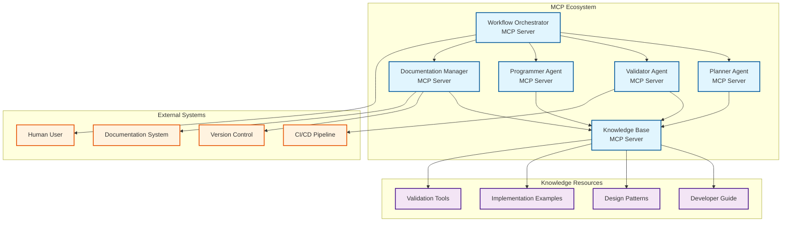

---
tags:
  - design
  - agentic_workflow
  - mcp
  - master_design
  - architecture_overview
keywords:
  - Model Context Protocol
  - MCP servers
  - agentic workflow
  - multi-agent system
  - pipeline development
  - workflow orchestration
  - distributed architecture
topics:
  - MCP implementation architecture
  - agentic workflow automation
  - multi-agent system design
  - workflow orchestration
language: python
date of note: 2025-08-09
---

# MCP Agentic Workflow Master Design

## Overview

This master design document provides a comprehensive overview of the MCP (Model Context Protocol) based agentic workflow implementation. The design transforms the existing multi-agent pipeline step development workflow into a distributed, scalable MCP-based architecture while preserving all validation capabilities and human-in-the-loop integration.

## Architecture Components

The MCP agentic workflow system consists of six specialized design areas, each documented in detail:

### 1. [MCP Server Architecture Design](mcp_agentic_workflow_server_architecture.md)
**Focus**: Individual MCP server specifications and configurations
- Workflow Orchestrator MCP Server
- Planner Agent MCP Server  
- Validator Agent MCP Server
- Programmer Agent MCP Server
- Documentation Manager MCP Server
- Knowledge Base MCP Server

### 2. [MCP Workflow Implementation Design](mcp_agentic_workflow_implementation.md)
**Focus**: Workflow phases and sequence diagrams
- Phase 1: Plan Development and Validation
- Phase 2: Code Implementation and Validation
- Human-in-the-loop integration patterns
- Convergence criteria and state transitions

### 3. [MCP Agent Integration Design](mcp_agentic_workflow_agent_integration.md)
**Focus**: Agent coordination and communication patterns
- Inter-agent communication protocols
- Resource sharing mechanisms
- Agent failure handling and recovery
- Load balancing and scaling strategies

### 4. [MCP Validation Framework Design](mcp_agentic_workflow_validation_framework.md)
**Focus**: Two-level validation system implementation
- Level 1: LLM-based validation
- Level 2: Deterministic tool validation
- Validation orchestration and reporting
- Quality assurance metrics

### 5. [MCP Performance and Scalability Design](mcp_agentic_workflow_performance.md)
**Focus**: Performance optimization and scalability
- Parallel processing strategies
- Caching and resource optimization
- Performance monitoring and metrics
- Scalability patterns and deployment

### 6. [MCP Security and Operations Design](mcp_agentic_workflow_security_operations.md)
**Focus**: Security, monitoring, and operational concerns
- Authentication and authorization
- Security best practices
- Monitoring and observability
- Deployment and maintenance

## Related Documents

### Source Design Documents
- [Agentic Workflow Design](agentic_workflow_design.md) - Original workflow design and architecture
- [Two-Level Alignment Validation System Design](two_level_alignment_validation_system_design.md) - Validation framework
- [Documentation YAML Frontmatter Standard](documentation_yaml_frontmatter_standard.md) - Documentation standards

### Implementation References
- [Developer Prompt Templates](../3_llm_developer/developer_prompt_templates/) - Current prompt template implementations
- [Validation Framework](../1_design/unified_alignment_tester_design.md) - Validation system design

### Knowledge Transfer
- [MCP Knowledge Transfer Design](mcp_knowledge_transfer_design.md) - Knowledge base integration
- [MCP Knowledge Transfer Implementation Plan](../2_project_planning/2025-08-09_mcp_knowledge_transfer_implementation_plan.md) - Implementation planning

## System Architecture Overview

## Core Design Principles

### 1. Agent Separation
Each agent role runs as an independent MCP server, enabling:
- Independent scaling based on demand
- Fault isolation and recovery
- Technology stack flexibility per agent
- Clear separation of concerns

### 2. Tool Standardization
Consistent tool interfaces across all agents provide:
- Predictable interaction patterns
- Easy integration and testing
- Simplified orchestration logic
- Clear API contracts

### 3. Resource Centralization
Shared access to knowledge base and examples ensures:
- Consistent knowledge across agents
- Efficient resource utilization
- Centralized knowledge management
- Version control for knowledge assets

### 4. Workflow Orchestration
Centralized workflow state management enables:
- Reliable workflow execution
- Recovery from failures
- Progress tracking and monitoring
- Human intervention coordination

### 5. Human Integration
Standardized human-in-the-loop interfaces support:
- Consistent user experience
- Flexible approval workflows
- Timeout and escalation handling
- Context-aware interactions

## Workflow Phases Overview

### Phase 1: Plan Development and Validation
1. **Initial Planning**: Requirements analysis and plan generation
2. **Plan Validation**: LLM-based validation of implementation plan
3. **Plan Revision**: Iterative refinement based on validation feedback
4. **Human Review**: Human approval of validated plan
5. **Phase Transition**: Move to implementation phase

### Phase 2: Code Implementation and Validation
6. **Code Implementation**: Generate all step components from validated plan
7. **Code Validation**: Two-level validation with deterministic tools
8. **Code Refinement**: Fix issues identified by validation
9. **Final Review**: Human approval of validated implementation
10. **Workflow Completion**: Finalize and document completed workflow

## Key Benefits

### Scalability and Modularity
- **Independent Scaling**: Each agent can be scaled based on demand
- **Modular Architecture**: Easy to update, replace, or extend individual agents
- **Resource Efficiency**: Optimal resource allocation per agent type
- **Technology Flexibility**: Different agents can use different technologies

### Reliability and Robustness
- **Fault Isolation**: Agent failures don't cascade to other agents
- **Recovery Mechanisms**: Automatic retry and fallback strategies
- **State Persistence**: Workflow state survives system restarts
- **Human Escalation**: Graceful degradation to human intervention

### Quality Assurance
- **Two-Level Validation**: Combines LLM analysis with deterministic tools
- **Comprehensive Coverage**: Validates all aspects of implementation
- **Iterative Refinement**: Continuous improvement through feedback loops
- **Human Oversight**: Critical decision points require human approval

### Developer Experience
- **Consistent Interfaces**: Standardized tool and resource APIs
- **Rich Documentation**: Comprehensive documentation and examples
- **Debugging Support**: Detailed logging and monitoring capabilities
- **Flexible Configuration**: Customizable workflows and validation criteria

## Implementation Strategy

### Phase 1: Foundation (Weeks 1-4)
- Set up basic MCP server infrastructure
- Implement core workflow orchestration
- Create basic agent implementations
- Establish knowledge base integration

### Phase 2: Core Functionality (Weeks 5-8)
- Implement complete agent tool sets
- Add two-level validation system
- Create human-in-the-loop interfaces
- Add error handling and recovery

### Phase 3: Advanced Features (Weeks 9-12)
- Performance optimization and caching
- Advanced monitoring and analytics
- Security hardening
- Production deployment preparation

### Phase 4: Production Readiness (Weeks 13-16)
- Comprehensive testing and validation
- Documentation and training materials
- Production deployment and monitoring
- Post-deployment optimization

## Success Metrics

### Technical Metrics
- **Workflow Success Rate**: > 95% of workflows complete successfully
- **Agent Availability**: > 99.9% uptime for all MCP servers
- **Response Time**: < 30 seconds for 95% of agent operations
- **Validation Accuracy**: > 98% accuracy for validation tools

### Quality Metrics
- **Plan Quality**: > 90% of plans pass validation on first attempt
- **Code Quality**: > 95% of generated code passes all validations
- **Human Satisfaction**: > 4.5/5 satisfaction score from users
- **Defect Rate**: < 1% defect rate in production implementations

### Performance Metrics
- **Throughput**: Support for 10+ concurrent workflows
- **Resource Utilization**: < 80% average resource utilization
- **Cache Hit Rate**: > 85% cache hit rate for knowledge resources
- **Scalability**: Linear scaling with additional agent instances

## Next Steps

1. **Review Individual Design Documents**: Study each specialized design document for detailed implementation guidance
2. **Set Up Development Environment**: Prepare MCP server development infrastructure
3. **Implement Core Components**: Start with workflow orchestrator and basic agents
4. **Integrate Knowledge Base**: Connect to existing slipbox knowledge resources
5. **Add Validation Framework**: Implement two-level validation system
6. **Test and Iterate**: Continuous testing and refinement of the system

## Conclusion

The MCP agentic workflow system provides a robust, scalable, and maintainable architecture for automating pipeline step development. By distributing functionality across specialized MCP servers while maintaining centralized orchestration, the system achieves the optimal balance of modularity, reliability, and performance.

The comprehensive design addresses all aspects of the workflow from initial planning through final validation, while preserving the sophisticated validation capabilities and human oversight that ensure high-quality outcomes. The modular architecture enables incremental implementation and continuous improvement, making it suitable for both immediate deployment and long-term evolution.
