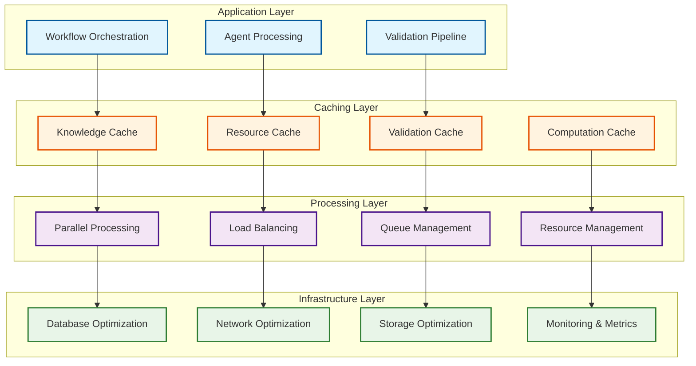

---
tags:
  - design
  - mcp
  - performance
  - scalability
  - optimization
keywords:
  - parallel processing
  - caching strategies
  - performance monitoring
  - scalability patterns
  - resource optimization
topics:
  - performance optimization
  - scalability design
  - monitoring metrics
  - deployment patterns
language: python
date of note: 2025-08-09
---

# MCP Performance and Scalability Design

## Overview

This document defines the performance optimization strategies and scalability patterns for the MCP-based agentic workflow system. It covers parallel processing, caching mechanisms, performance monitoring, and deployment patterns for high-throughput operation.

## Related Documents

### Master Design
- [MCP Agentic Workflow Master Design](mcp_agentic_workflow_master_design.md) - Complete system overview

### Related Components
- [MCP Server Architecture Design](mcp_agentic_workflow_server_architecture.md) - Server specifications and deployment
- [MCP Agent Integration Design](mcp_agentic_workflow_agent_integration.md) - Agent coordination and load balancing
- [MCP Workflow Implementation Design](mcp_agentic_workflow_implementation.md) - Workflow execution patterns

## Performance Architecture Overview

### Performance Optimization Layers



## Parallel Processing Strategies

### 1. Workflow-Level Parallelization

#### Concurrent Workflow Execution
```python
class ConcurrentWorkflowManager:
    """Manage multiple workflows executing in parallel"""
    
    def __init__(self, max_concurrent_workflows: int = 10):
        self.max_concurrent_workflows = max_concurrent_workflows
        self.active_workflows = {}
        self.workflow_semaphore = asyncio.Semaphore(max_concurrent_workflows)
        self.resource_pool = ResourcePool()
    
    async def execute_workflow_concurrent(self, workflow_id: str, 
                                        workflow_config: dict) -> dict:
        """Execute workflow with concurrency control"""
        
        async with self.workflow_semaphore:
            try:
                # Allocate resources for workflow
                resources = await self.resource_pool.allocate_workflow_resources(
                    workflow_id, workflow_config
                )
                
                # Track active workflow
                self.active_workflows[workflow_id] = {
                    "start_time": datetime.utcnow(),
                    "config": workflow_config,
                    "resources": resources,
                    "status": "running"
                }
                
                # Execute workflow phases in parallel where possible
                result = await self._execute_workflow_phases_parallel(
                    workflow_id, workflow_config, resources
                )
                
                return result
                
            finally:
                # Clean up resources
                if workflow_id in self.active_workflows:
                    resources = self.active_workflows[workflow_id]["resources"]
                    await self.resource_pool.release_workflow_resources(
                        workflow_id, resources
                    )
                    del self.active_workflows[workflow_id]
    
    async def _execute_workflow_phases_parallel(self, workflow_id: str, 
                                              config: dict, resources: dict) -> dict:
        """Execute workflow phases with maximum parallelization"""
        
        # Phase 1: Plan Development (sequential within phase, parallel validation)
        plan_result = await self._execute_plan_phase_parallel(
            workflow_id, config, resources
        )
        
        if plan_result["status"] != "success":
            return plan_result
        
        # Phase 2: Code Implementation (parallel component generation)
        code_result = await self._execute_code_phase_parallel(
            workflow_id, plan_result["plan"], resources
        )
        
        return code_result
    
    async def _execute_plan_phase_parallel(self, workflow_id: str, 
                                         config: dict, resources: dict) -> dict:
        """Execute plan phase with parallel validation"""
        
        # Generate initial plan
        plan = await self._generate_plan(workflow_id, config, resources)
        
        # Parallel validation and revision loop
        max_iterations = 5
        for iteration in range(max_iterations):
            # Run multiple validation aspects in parallel
            validation_tasks = [
                self._validate_plan_structure(plan),
                self._validate_plan_architecture(plan, config),
                self._validate_plan_feasibility(plan),
                self._validate_plan_patterns(plan, config)
            ]
            
            validation_results = await asyncio.gather(*validation_tasks)
            
            # Combine validation results
            combined_validation = self._combine_validation_results(validation_results)
            
            if combined_validation["converged"]:
                return {"status": "success", "plan": plan, "validation": combined_validation}
            
            # Revise plan based on parallel feedback
            plan = await self._revise_plan_parallel(plan, combined_validation)
        
        return {"status": "failed", "reason": "max_iterations_exceeded"}
    
    async def _execute_code_phase_parallel(self, workflow_id: str, 
                                         plan: dict, resources: dict) -> dict:
        """Execute code phase with parallel component generation"""
        
        # Identify component dependencies
        component_dependencies = self._analyze_component_dependencies(plan)
        
        # Create dependency-aware execution plan
        execution_plan = self._create_parallel_execution_plan(component_dependencies)
        
        generated_components = {}
        
        # Execute components in dependency order with maximum parallelism
        for execution_level in execution_plan:
            # Generate components at current level in parallel
            generation_tasks = []
            for component_name in execution_level:
                task = self._generate_component_async(
                    component_name, plan, generated_components, resources
                )
                generation_tasks.append(task)
            
            # Wait for all components at this level to complete
            level_results = await asyncio.gather(*generation_tasks, return_exceptions=True)
            
            # Process results and handle errors
            for i, result in enumerate(level_results):
                component_name = execution_level[i]
                if isinstance(result, Exception):
                    return {
                        "status": "failed", 
                        "reason": f"Component generation failed: {component_name}",
                        "error": str(result)
                    }
                generated_components[component_name] = result
        
        # Parallel validation of all components
        validation_result = await self._validate_components_parallel(
            generated_components, plan, resources
        )
        
        return {
            "status": "success",
            "components": generated_components,
            "validation": validation_result
        }
```

### 2. Agent-Level Parallelization

#### Parallel Agent Operations
```python
class ParallelAgentProcessor:
    """Process agent operations in parallel"""
    
    def __init__(self):
        self.agent_pools = {}
        self.operation_queues = {}
        self.result_aggregator = ResultAggregator()
    
    async def process_operations_parallel(self, operations: list, 
                                        agent_type: str) -> dict:
        """Process multiple operations in parallel across agent instances"""
        
        # Get available agent instances
        available_agents = await self._get_available_agents(agent_type)
        
        if not available_agents:
            raise Exception(f"No available agents for type: {agent_type}")
        
        # Distribute operations across agents
        operation_distribution = self._distribute_operations(
            operations, available_agents
        )
        
        # Execute operations in parallel
        execution_tasks = []
        for agent_id, agent_operations in operation_distribution.items():
            task = self._execute_agent_operations(agent_id, agent_operations)
            execution_tasks.append(task)
        
        # Gather results
        results = await asyncio.gather(*execution_tasks, return_exceptions=True)
        
        # Aggregate and process results
        aggregated_result = await self.result_aggregator.aggregate_results(
            results, operations
        )
        
        return aggregated_result
    
    def _distribute_operations(self, operations: list, 
                             available_agents: list) -> dict:
        """Distribute operations across available agents"""
        
        distribution = {agent["id"]: [] for agent in available_agents}
        
        # Simple round-robin distribution (can be enhanced with load-aware distribution)
        for i, operation in enumerate(operations):
            agent_index = i % len(available_agents)
            agent_id = available_agents[agent_index]["id"]
            distribution[agent_id].append(operation)
        
        return distribution
    
    async def _execute_agent_operations(self, agent_id: str, 
                                      operations: list) -> dict:
        """Execute operations on specific agent"""
        
        agent_results = []
        
        for operation in operations:
            try:
                result = await self._execute_single_operation(agent_id, operation)
                agent_results.append({
                    "operation_id": operation["id"],
                    "status": "success",
                    "result": result
                })
            except Exception as e:
                agent_results.append({
                    "operation_id": operation["id"],
                    "status": "error",
                    "error": str(e)
                })
        
        return {
            "agent_id": agent_id,
            "results": agent_results
        }
```

## Caching Strategies

### 1. Multi-Level Caching System

#### Hierarchical Cache Manager
```python
class HierarchicalCacheManager:
    """Multi-level caching system for MCP agents"""
    
    def __init__(self):
        self.l1_cache = MemoryCache(max_size=1000, ttl=300)  # 5 minutes
        self.l2_cache = RedisCache(ttl=3600)  # 1 hour
        self.l3_cache = DatabaseCache(ttl=86400)  # 24 hours
        self.cache_stats = CacheStatistics()
    
    async def get(self, key: str, cache_type: str = "auto") -> any:
        """Get value from hierarchical cache"""
        
        cache_key = self._generate_cache_key(key, cache_type)
        
        # Try L1 cache (memory)
        value = await self.l1_cache.get(cache_key)
        if value is not None:
            await self.cache_stats.record_hit("l1", cache_type)
            return value
        
        # Try L2 cache (Redis)
        value = await self.l2_cache.get(cache_key)
        if value is not None:
            # Promote to L1 cache
            await self.l1_cache.set(cache_key, value)
            await self.cache_stats.record_hit("l2", cache_type)
            return value
        
        # Try L3 cache (Database)
        value = await self.l3_cache.get(cache_key)
        if value is not None:
            # Promote to L2 and L1 caches
            await self.l2_cache.set(cache_key, value)
            await self.l1_cache.set(cache_key, value)
            await self.cache_stats.record_hit("l3", cache_type)
            return value
        
        # Cache miss
        await self.cache_stats.record_miss(cache_type)
        return None
    
    async def set(self, key: str, value: any, cache_type: str = "auto", 
                 ttl: int = None) -> bool:
        """Set value in hierarchical cache"""
        
        cache_key = self._generate_cache_key(key, cache_type)
        
        # Set in all cache levels
        tasks = [
            self.l1_cache.set(cache_key, value, ttl or 300),
            self.l2_cache.set(cache_key, value, ttl or 3600),
            self.l3_cache.set(cache_key, value, ttl or 86400)
        ]
        
        results = await asyncio.gather(*tasks, return_exceptions=True)
        
        # Return True if at least one cache level succeeded
        return any(result is True for result in results if not isinstance(result, Exception))
    
    async def invalidate(self, pattern: str) -> dict:
        """Invalidate cache entries matching pattern"""
        
        invalidation_tasks = [
            self.l1_cache.invalidate(pattern),
            self.l2_cache.invalidate(pattern),
            self.l3_cache.invalidate(pattern)
        ]
        
        results = await asyncio.gather(*invalidation_tasks, return_exceptions=True)
        
        return {
            "l1_invalidated": results[0] if not isinstance(results[0], Exception) else 0,
            "l2_invalidated": results[1] if not isinstance(results[1], Exception) else 0,
            "l3_invalidated": results[2] if not isinstance(results[2], Exception) else 0
        }
```

### 2. Intelligent Cache Warming

#### Predictive Cache Warmer
```python
class PredictiveCacheWarmer:
    """Intelligently warm caches based on usage patterns"""
    
    def __init__(self, cache_manager: HierarchicalCacheManager):
        self.cache_manager = cache_manager
        self.usage_analyzer = UsagePatternAnalyzer()
        self.warming_scheduler = CacheWarmingScheduler()
    
    async def analyze_and_warm_caches(self) -> dict:
        """Analyze usage patterns and warm caches predictively"""
        
        # Analyze recent usage patterns
        usage_patterns = await self.usage_analyzer.analyze_recent_patterns()
        
        # Predict likely cache misses
        predicted_requests = await self._predict_upcoming_requests(usage_patterns)
        
        # Warm caches for predicted requests
        warming_results = await self._warm_caches_for_predictions(predicted_requests)
        
        return {
            "patterns_analyzed": len(usage_patterns),
            "predictions_made": len(predicted_requests),
            "caches_warmed": warming_results["warmed_count"],
            "warming_success_rate": warming_results["success_rate"]
        }
    
    async def _predict_upcoming_requests(self, usage_patterns: list) -> list:
        """Predict upcoming cache requests based on patterns"""
        
        predictions = []
        
        for pattern in usage_patterns:
            # Time-based predictions
            if pattern["type"] == "temporal":
                time_predictions = self._predict_temporal_requests(pattern)
                predictions.extend(time_predictions)
            
            # Workflow-based predictions
            elif pattern["type"] == "workflow":
                workflow_predictions = self._predict_workflow_requests(pattern)
                predictions.extend(workflow_predictions)
            
            # Dependency-based predictions
            elif pattern["type"] == "dependency":
                dependency_predictions = self._predict_dependency_requests(pattern)
                predictions.extend(dependency_predictions)
        
        # Remove duplicates and sort by prediction confidence
        unique_predictions = self._deduplicate_predictions(predictions)
        sorted_predictions = sorted(unique_predictions, 
                                  key=lambda x: x["confidence"], reverse=True)
        
        return sorted_predictions[:100]  # Limit to top 100 predictions
    
    async def _warm_caches_for_predictions(self, predictions: list) -> dict:
        """Warm caches for predicted requests"""
        
        warming_tasks = []
        
        for prediction in predictions:
            if prediction["confidence"] > 0.7:  # Only warm high-confidence predictions
                task = self._warm_single_cache_entry(prediction)
                warming_tasks.append(task)
        
        results = await asyncio.gather(*warming_tasks, return_exceptions=True)
        
        successful_warmings = sum(1 for result in results 
                                if result is True and not isinstance(result, Exception))
        
        return {
            "warmed_count": successful_warmings,
            "total_attempts": len(warming_tasks),
            "success_rate": successful_warmings / len(warming_tasks) if warming_tasks else 0
        }
```

## Performance Monitoring and Metrics

### 1. Comprehensive Metrics Collection

#### Performance Metrics Collector
```python
class PerformanceMetricsCollector:
    """Collect comprehensive performance metrics"""
    
    def __init__(self):
        self.metrics_storage = MetricsStorage()
        self.metric_definitions = self._define_performance_metrics()
        self.collectors = self._initialize_collectors()
    
    def _define_performance_metrics(self) -> dict:
        """Define all performance metrics to collect"""
        return {
            # Workflow metrics
            "workflow_duration": {
                "type": "histogram",
                "description": "Total workflow execution time",
                "labels": ["workflow_type", "step_type"],
                "buckets": [1, 5, 10, 30, 60, 300, 600, 1800]
            },
            "workflow_throughput": {
                "type": "gauge",
                "description": "Workflows processed per minute",
                "labels": ["workflow_type"]
            },
            "workflow_success_rate": {
                "type": "gauge",
                "description": "Percentage of successful workflows",
                "labels": ["workflow_type", "step_type"]
            },
            
            # Agent metrics
            "agent_response_time": {
                "type": "histogram",
                "description": "Agent response time in seconds",
                "labels": ["agent_type", "operation"],
                "buckets": [0.1, 0.5, 1.0, 2.0, 5.0, 10.0, 30.0]
            },
            "agent_utilization": {
                "type": "gauge",
                "description": "Agent CPU/memory utilization percentage",
                "labels": ["agent_type", "instance_id", "resource_type"]
            },
            "agent_queue_depth": {
                "type": "gauge",
                "description": "Number of queued operations per agent",
                "labels": ["agent_type", "instance_id"]
            },
            
            # Cache metrics
            "cache_hit_rate": {
                "type": "gauge",
                "description": "Cache hit rate percentage",
                "labels": ["cache_level", "cache_type"]
            },
            "cache_response_time": {
                "type": "histogram",
                "description": "Cache response time in milliseconds",
                "labels": ["cache_level", "operation"],
                "buckets": [1, 5, 10, 25, 50, 100, 250, 500]
            },
            
            # Validation metrics
            "validation_duration": {
                "type": "histogram",
                "description": "Validation execution time",
                "labels": ["validation_level", "validation_type"],
                "buckets": [1, 5, 10, 30, 60, 120, 300]
            },
            "validation_accuracy": {
                "type": "gauge",
                "description": "Validation accuracy percentage",
                "labels": ["validation_level", "validation_type"]
            }
        }
    
    async def collect_all_metrics(self) -> dict:
        """Collect all performance metrics"""
        
        collection_tasks = []
        
        for collector_name, collector in self.collectors.items():
            task = collector.collect_metrics()
            collection_tasks.append((collector_name, task))
        
        # Collect metrics in parallel
        results = {}
        for collector_name, task in collection_tasks:
            try:
                metrics = await task
                results[collector_name] = metrics
            except Exception as e:
                results[collector_name] = {"error": str(e)}
        
        # Store metrics
        await self.metrics_storage.store_metrics(results)
        
        return results
    
    async def generate_performance_report(self, time_range: dict) -> dict:
        """Generate comprehensive performance report"""
        
        # Retrieve metrics for time range
        metrics_data = await self.metrics_storage.get_metrics_range(
            time_range["start"], time_range["end"]
        )
        
        # Calculate performance indicators
        performance_indicators = await self._calculate_performance_indicators(metrics_data)
        
        # Identify performance bottlenecks
        bottlenecks = await self._identify_bottlenecks(metrics_data)
        
        # Generate optimization recommendations
        recommendations = await self._generate_optimization_recommendations(
            performance_indicators, bottlenecks
        )
        
        return {
            "time_range": time_range,
            "performance_indicators": performance_indicators,
            "bottlenecks": bottlenecks,
            "recommendations": recommendations,
            "raw_metrics": metrics_data
        }
```

### 2. Real-Time Performance Dashboard

#### Performance Dashboard Manager
```python
class PerformanceDashboardManager:
    """Manage real-time performance dashboard"""
    
    def __init__(self, metrics_collector: PerformanceMetricsCollector):
        self.metrics_collector = metrics_collector
        self.dashboard_config = self._load_dashboard_config()
        self.alert_manager = AlertManager()
    
    async def generate_dashboard_data(self) -> dict:
        """Generate real-time dashboard data"""
        
        current_time = datetime.utcnow()
        
        # Get recent metrics (last 5 minutes)
        recent_metrics = await self.metrics_collector.get_recent_metrics(
            minutes=5
        )
        
        # Calculate key performance indicators
        kpis = await self._calculate_kpis(recent_metrics)
        
        # Generate trend data (last hour)
        trend_data = await self._generate_trend_data(hours=1)
        
        # Check for performance alerts
        alerts = await self.alert_manager.check_performance_alerts(recent_metrics)
        
        # Generate system health status
        health_status = await self._assess_system_health(recent_metrics)
        
        return {
            "timestamp": current_time.isoformat(),
            "kpis": kpis,
            "trends": trend_data,
            "alerts": alerts,
            "health_status": health_status,
            "system_overview": await self._generate_system_overview(recent_metrics)
        }
    
    async def _calculate_kpis(self, metrics: dict) -> dict:
        """Calculate key performance indicators"""
        
        return {
            "workflow_throughput": await self._calculate_workflow_throughput(metrics),
            "average_response_time": await self._calculate_avg_response_time(metrics),
            "system_utilization": await self._calculate_system_utilization(metrics),
            "cache_efficiency": await self._calculate_cache_efficiency(metrics),
            "error_rate": await self._calculate_error_rate(metrics),
            "validation_accuracy": await self._calculate_validation_accuracy(metrics)
        }
    
    async def _generate_trend_data(self, hours: int) -> dict:
        """Generate trend data for specified time period"""
        
        end_time = datetime.utcnow()
        start_time = end_time - timedelta(hours=hours)
        
        # Get historical metrics
        historical_metrics = await self.metrics_collector.get_metrics_range(
            start_time, end_time
        )
        
        # Generate trend lines
        trends = {
            "workflow_throughput": self._generate_trend_line(
                historical_metrics, "workflow_throughput", hours
            ),
            "response_times": self._generate_trend_line(
                historical_metrics, "agent_response_time", hours
            ),
            "resource_utilization": self._generate_trend_line(
                historical_metrics, "agent_utilization", hours
            ),
            "cache_hit_rates": self._generate_trend_line(
                historical_metrics, "cache_hit_rate", hours
            )
        }
        
        return trends
```

## Scalability Patterns

### 1. Horizontal Scaling Architecture

#### Auto-Scaling Manager
```python
class AutoScalingManager:
    """Manage automatic horizontal scaling of MCP agents"""
    
    def __init__(self):
        self.scaling_policies = {}
        self.instance_manager = InstanceManager()
        self.load_predictor = LoadPredictor()
        self.scaling_history = ScalingHistory()
    
    async def configure_auto_scaling(self, agent_type: str, policy: dict):
        """Configure auto-scaling policy for agent type"""
        
        self.scaling_policies[agent_type] = {
            "min_instances": policy.get("min_instances", 1),
            "max_instances": policy.get("max_instances", 20),
            "target_utilization": policy.get("target_utilization", 70),
            "scale_up_threshold": policy.get("scale_up_threshold", 80),
            "scale_down_threshold": policy.get("scale_down_threshold", 30),
            "cooldown_period": policy.get("cooldown_period", 300),  # 5 minutes
            "predictive_scaling": policy.get("predictive_scaling", True),
            "scaling_increment": policy.get("scaling_increment", 1)
        }
    
    async def evaluate_scaling_needs(self) -> dict:
        """Evaluate scaling needs for all agent types"""
        
        scaling_decisions = {}
        
        for agent_type, policy in self.scaling_policies.items():
            # Get current metrics
            current_metrics = await self._get_agent_metrics(agent_type)
            
            # Check cooldown period
            if not await self._is_cooldown_expired(agent_type, policy["cooldown_period"]):
                scaling_decisions[agent_type] = {
                    "action": "none",
                    "reason": "cooldown_period_active"
                }
                continue
            
            # Reactive scaling decision
            reactive_decision = await self._make_reactive_scaling_decision(
                agent_type, current_metrics, policy
            )
            
            # Predictive scaling decision (if enabled)
            predictive_decision = None
            if policy["predictive_scaling"]:
                predictive_decision = await self._make_predictive_scaling_decision(
                    agent_type, current_metrics, policy
                )
            
            # Combine decisions
            final_decision = await self._combine_scaling_decisions(
                reactive_decision, predictive_decision
            )
            
            scaling_decisions[agent_type] = final_decision
        
        return scaling_decisions
    
    async def execute_scaling_decisions(self, scaling_decisions: dict) -> dict:
        """Execute scaling decisions"""
        
        execution_results = {}
        
        for agent_type, decision in scaling_decisions.items():
            if decision["action"] == "none":
                execution_results[agent_type] = decision
                continue
            
            try:
                if decision["action"] == "scale_up":
                    result = await self._scale_up_agent(
                        agent_type, decision["target_instances"]
                    )
                elif decision["action"] == "scale_down":
                    result = await self._scale_down_agent(
                        agent_type, decision["target_instances"]
                    )
                
                # Record scaling action
                await self.scaling_history.record_scaling_action(
                    agent_type, decision, result
                )
                
                execution_results[agent_type] = {
                    "action": decision["action"],
                    "status": "success",
                    "result": result
                }
                
            except Exception as e:
                execution_results[agent_type] = {
                    "action": decision["action"],
                    "status": "error",
                    "error": str(e)
                }
        
        return execution_results
    
    async def _make_predictive_scaling_decision(self, agent_type: str, 
                                              current_metrics: dict, 
                                              policy: dict) -> dict:
        """Make predictive scaling decision based on load forecasting"""
        
        # Get load prediction for next 30 minutes
        load_prediction = await self.load_predictor.predict_load(
            agent_type, prediction_horizon_minutes=30
        )
        
        if not load_prediction:
            return {"action": "none", "reason": "no_prediction_available"}
        
        predicted_peak_load = max(load_prediction["predicted_values"])
        current_capacity = current_metrics["total_capacity"]
        
        # Calculate required capacity for predicted load
        required_capacity = predicted_peak_load / (policy["target_utilization"] / 100)
        
        if required_capacity > current_capacity * 1.2:  # 20% buffer
            # Scale up proactively
            target_instances = math.ceil(
                current_metrics["instance_count"] * (required_capacity / current_capacity)
            )
            target_instances = min(target_instances, policy["max_instances"])
            
            return {
                "action": "scale_up",
                "reason": "predictive_scaling",
                "current_instances": current_metrics["instance_count"],
                "target_instances": target_instances,
                "predicted_load": predicted_peak_load,
                "confidence": load_prediction["confidence"]
            }
        
        return {"action": "none", "reason": "predicted_load_within_capacity"}
```

### 2. Geographic Distribution and Edge Deployment

#### Multi-Region Deployment Manager
```python
class MultiRegionDeploymentManager:
    """Manage deployment across multiple geographic regions"""
    
    def __init__(self):
        self.regions = {}
        self.latency_matrix = {}
        self.deployment_optimizer = DeploymentOptimizer()
        self.traffic_router = TrafficRouter()
    
    async def optimize_global_deployment(self, traffic_patterns: dict) -> dict:
        """Optimize agent deployment across regions based on traffic patterns"""
        
        # Analyze current deployment
        current_deployment = await self._analyze_current_deployment()
        
        # Analyze traffic patterns
        traffic_analysis = await self._analyze_traffic_patterns(traffic_patterns)
        
        # Calculate optimal deployment
        optimal_deployment = await self.deployment_optimizer.calculate_optimal_deployment(
            current_deployment, traffic_analysis, self.regions
        )
        
        # Generate migration plan
        migration_plan = await self._generate_migration_plan(
            current_deployment, optimal_deployment
        )
        
        return {
            "current_deployment": current_deployment,
            "optimal_deployment": optimal_deployment,
            "migration_plan": migration_plan,
            "expected_improvements": await self._calculate_expected_improvements(
                current_deployment, optimal_deployment
