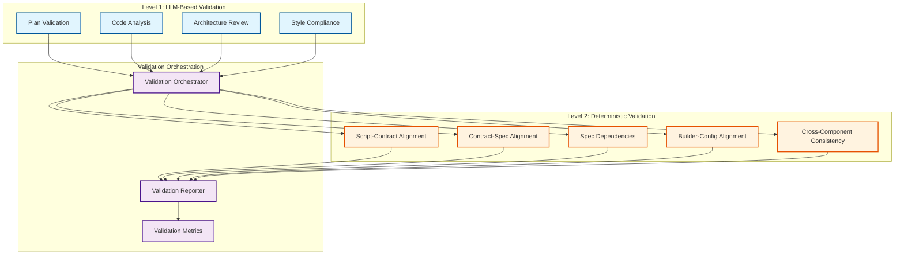

---
tags:
  - design
  - mcp
  - validation_framework
  - two_level_validation
  - quality_assurance
keywords:
  - LLM validation
  - deterministic validation
  - validation orchestration
  - quality metrics
  - validation tools
topics:
  - validation framework
  - quality assurance
  - validation orchestration
  - validation metrics
language: python
date of note: 2025-08-09
---

# MCP Validation Framework Design

## Overview

This document defines the comprehensive two-level validation framework for the MCP-based agentic workflow system. It combines LLM-based analysis with deterministic validation tools to ensure high-quality pipeline step implementations.

## Related Documents

### Master Design
- [MCP Agentic Workflow Master Design](mcp_agentic_workflow_master_design.md) - Complete system overview

### Related Components
- [MCP Server Architecture Design](mcp_agentic_workflow_server_architecture.md) - Validator agent specifications
- [MCP Workflow Implementation Design](mcp_agentic_workflow_implementation.md) - Validation workflow sequences
- [MCP Agent Integration Design](mcp_agentic_workflow_agent_integration.md) - Agent coordination patterns

## Two-Level Validation Architecture

### Validation Hierarchy



## Level 1: LLM-Based Validation

### 1. Plan Validation System

#### Plan Validation Engine
```python
class PlanValidationEngine:
    """LLM-based validation of implementation plans"""
    
    def __init__(self, llm_client, knowledge_base):
        self.llm_client = llm_client
        self.knowledge_base = knowledge_base
        self.validation_prompts = self._load_validation_prompts()
    
    async def validate_implementation_plan(self, plan: dict, 
                                         validation_context: dict) -> dict:
        """Validate implementation plan using LLM analysis"""
        
        validation_results = {
            "overall_score": 0,
            "component_scores": {},
            "issues": {"critical": [], "major": [], "minor": []},
            "recommendations": [],
            "validation_details": {}
        }
        
        # Validate plan structure
        structure_result = await self._validate_plan_structure(plan)
        validation_results["component_scores"]["structure"] = structure_result["score"]
        validation_results["validation_details"]["structure"] = structure_result
        
        # Validate architectural alignment
        architecture_result = await self._validate_architectural_alignment(
            plan, validation_context
        )
        validation_results["component_scores"]["architecture"] = architecture_result["score"]
        validation_results["validation_details"]["architecture"] = architecture_result
        
        # Validate design patterns
        patterns_result = await self._validate_design_patterns(plan)
        validation_results["component_scores"]["patterns"] = patterns_result["score"]
        validation_results["validation_details"]["patterns"] = patterns_result
        
        # Validate implementation feasibility
        feasibility_result = await self._validate_implementation_feasibility(plan)
        validation_results["component_scores"]["feasibility"] = feasibility_result["score"]
        validation_results["validation_details"]["feasibility"] = feasibility_result
        
        # Calculate overall score
        validation_results["overall_score"] = self._calculate_overall_score(
            validation_results["component_scores"]
        )
        
        # Aggregate issues and recommendations
        validation_results["issues"] = self._aggregate_issues(validation_results["validation_details"])
        validation_results["recommendations"] = self._generate_recommendations(validation_results)
        
        return validation_results
    
    async def _validate_plan_structure(self, plan: dict) -> dict:
        """Validate plan structure and completeness"""
        
        prompt = self.validation_prompts["plan_structure"].format(
            plan_content=json.dumps(plan, indent=2)
        )
        
        response = await self.llm_client.generate_response(
            prompt=prompt,
            response_format="structured_validation"
        )
        
        return {
            "score": response.get("score", 0),
            "issues": response.get("issues", []),
            "strengths": response.get("strengths", []),
            "suggestions": response.get("suggestions", [])
        }
    
    async def _validate_architectural_alignment(self, plan: dict, 
                                              context: dict) -> dict:
        """Validate alignment with architectural principles"""
        
        # Get relevant architectural patterns
        patterns = await self.knowledge_base.get_design_patterns(
            context.get("step_type", "")
        )
        
        prompt = self.validation_prompts["architectural_alignment"].format(
            plan_content=json.dumps(plan, indent=2),
            architectural_patterns=json.dumps(patterns, indent=2),
            step_type=context.get("step_type", "unknown")
        )
        
        response = await self.llm_client.generate_response(
            prompt=prompt,
            response_format="architectural_validation"
        )
        
        return {
            "score": response.get("alignment_score", 0),
            "pattern_compliance": response.get("pattern_compliance", {}),
            "architectural_issues": response.get("issues", []),
            "alignment_recommendations": response.get("recommendations", [])
        }
```

#### Plan Validation Prompts
```python
PLAN_VALIDATION_PROMPTS = {
    "plan_structure": """
    Analyze the following implementation plan for structural completeness and clarity:

    Plan Content:
    {plan_content}

    Evaluate the plan based on these criteria:
    1. Completeness: Are all required components defined?
    2. Clarity: Is the plan clear and unambiguous?
    3. Consistency: Are component definitions consistent?
    4. Feasibility: Is the plan technically feasible?

    Provide a structured response with:
    - score: Overall score (0-10)
    - issues: List of structural issues found
    - strengths: List of plan strengths
    - suggestions: List of improvement suggestions
    """,
    
    "architectural_alignment": """
    Evaluate the architectural alignment of this implementation plan:

    Plan Content:
    {plan_content}

    Architectural Patterns:
    {architectural_patterns}

    Step Type: {step_type}

    Assess alignment with:
    1. Design patterns appropriate for {step_type} steps
    2. Architectural principles and best practices
    3. Component interaction patterns
    4. Scalability and maintainability considerations

    Provide:
    - alignment_score: Alignment score (0-10)
    - pattern_compliance: Compliance with each pattern
    - issues: Architectural issues identified
    - recommendations: Alignment improvement recommendations
    """,
    
    "design_patterns": """
    Analyze the design pattern usage in this implementation plan:

    Plan Content:
    {plan_content}

    Evaluate:
    1. Appropriate pattern selection
    2. Correct pattern implementation
    3. Pattern interaction and composition
    4. Adherence to pattern principles

    Provide:
    - score: Pattern usage score (0-10)
    - pattern_analysis: Analysis of each pattern used
    - pattern_issues: Issues with pattern usage
    - pattern_recommendations: Pattern improvement suggestions
    """,
    
    "implementation_feasibility": """
    Assess the implementation feasibility of this plan:

    Plan Content:
    {plan_content}

    Consider:
    1. Technical complexity and dependencies
    2. Resource requirements
    3. Implementation timeline
    4. Risk factors and mitigation strategies

    Provide:
    - score: Feasibility score (0-10)
    - complexity_analysis: Technical complexity assessment
    - risk_factors: Identified risks and challenges
    - mitigation_strategies: Suggested risk mitigation approaches
    """
}
```

### 2. Code Validation System

#### Code Analysis Engine
```python
class CodeAnalysisEngine:
    """LLM-based code quality and architecture analysis"""
    
    def __init__(self, llm_client, knowledge_base):
        self.llm_client = llm_client
        self.knowledge_base = knowledge_base
        self.analysis_prompts = self._load_analysis_prompts()
    
    async def analyze_code_implementation(self, components: dict, 
                                        analysis_context: dict) -> dict:
        """Comprehensive code analysis using LLM"""
        
        analysis_results = {
            "overall_score": 0,
            "component_analyses": {},
            "cross_component_analysis": {},
            "quality_metrics": {},
            "issues": {"critical": [], "major": [], "minor": []},
            "recommendations": []
        }
        
        # Analyze individual components
        for component_name, component_code in components.items():
            component_analysis = await self._analyze_component(
                component_name, component_code, analysis_context
            )
            analysis_results["component_analyses"][component_name] = component_analysis
        
        # Cross-component analysis
        cross_analysis = await self._analyze_component_interactions(
            components, analysis_context
        )
        analysis_results["cross_component_analysis"] = cross_analysis
        
        # Quality metrics calculation
        quality_metrics = await self._calculate_quality_metrics(
            analysis_results["component_analyses"],
            cross_analysis
        )
        analysis_results["quality_metrics"] = quality_metrics
        
        # Overall scoring
        analysis_results["overall_score"] = self._calculate_code_score(
            analysis_results["component_analyses"],
            cross_analysis,
            quality_metrics
        )
        
        # Aggregate issues and recommendations
        analysis_results["issues"] = self._aggregate_code_issues(analysis_results)
        analysis_results["recommendations"] = self._generate_code_recommendations(analysis_results)
        
        return analysis_results
    
    async def _analyze_component(self, component_name: str, 
                               component_code: str, context: dict) -> dict:
        """Analyze individual component code"""
        
        prompt = self.analysis_prompts["component_analysis"].format(
            component_name=component_name,
            component_code=component_code,
            step_type=context.get("step_type", "unknown"),
            architectural_context=json.dumps(context.get("architectural_patterns", {}), indent=2)
        )
        
        response = await self.llm_client.generate_response(
            prompt=prompt,
            response_format="component_analysis"
        )
        
        return {
            "code_quality_score": response.get("code_quality_score", 0),
            "architecture_compliance": response.get("architecture_compliance", 0),
            "maintainability_score": response.get("maintainability_score", 0),
            "issues": response.get("issues", []),
            "strengths": response.get("strengths", []),
            "improvement_suggestions": response.get("improvement_suggestions", [])
        }
    
    async def _analyze_component_interactions(self, components: dict, 
                                            context: dict) -> dict:
        """Analyze interactions between components"""
        
        prompt = self.analysis_prompts["cross_component_analysis"].format(
            components=json.dumps({k: v[:1000] + "..." if len(v) > 1000 else v 
                                 for k, v in components.items()}, indent=2),
            step_type=context.get("step_type", "unknown")
        )
        
        response = await self.llm_client.generate_response(
            prompt=prompt,
            response_format="cross_component_analysis"
        )
        
        return {
            "interaction_score": response.get("interaction_score", 0),
            "coupling_analysis": response.get("coupling_analysis", {}),
            "cohesion_analysis": response.get("cohesion_analysis", {}),
            "interface_consistency": response.get("interface_consistency", 0),
            "interaction_issues": response.get("interaction_issues", []),
            "integration_recommendations": response.get("integration_recommendations", [])
        }
```

## Level 2: Deterministic Validation

### 1. Script-Contract Alignment Validator

#### Strict Alignment Checker
```python
class ScriptContractAlignmentValidator:
    """Deterministic validation of script-contract alignment"""
    
    def __init__(self):
        self.alignment_rules = self._load_alignment_rules()
        self.ast_analyzer = ASTAnalyzer()
    
    async def validate_script_contract_alignment(self, script_path: str, 
                                               contract_path: str, 
                                               context: dict) -> dict:
        """Validate strict alignment between script and contract"""
        
        validation_result = {
            "status": "unknown",
            "alignment_score": 0,
            "validation_details": {},
            "issues": [],
            "recommendations": []
        }
        
        try:
            # Parse script and contract
            script_ast = await self.ast_analyzer.parse_python_file(script_path)
            contract_data = await self._parse_contract_file(contract_path)
            
            # Validate function signatures
            signature_validation = await self._validate_function_signatures(
                script_ast, contract_data
            )
            validation_result["validation_details"]["signatures"] = signature_validation
            
            # Validate input/output specifications
            io_validation = await self._validate_input_output_specs(
                script_ast, contract_data
            )
            validation_result["validation_details"]["input_output"] = io_validation
            
            # Validate error handling
            error_validation = await self._validate_error_handling(
                script_ast, contract_data
            )
            validation_result["validation_details"]["error_handling"] = error_validation
            
            # Validate configuration usage
            config_validation = await self._validate_configuration_usage(
                script_ast, contract_data, context
            )
            validation_result["validation_details"]["configuration"] = config_validation
            
            # Calculate alignment score
            validation_result["alignment_score"] = self._calculate_alignment_score(
                validation_result["validation_details"]
            )
            
            # Determine overall status
            validation_result["status"] = self._determine_validation_status(
                validation_result["alignment_score"],
                validation_result["validation_details"]
            )
            
            # Generate issues and recommendations
            validation_result["issues"] = self._extract_alignment_issues(
                validation_result["validation_details"]
            )
            validation_result["recommendations"] = self._generate_alignment_recommendations(
                validation_result["validation_details"]
            )
            
        except Exception as e:
            validation_result["status"] = "error"
            validation_result["error"] = str(e)
        
        return validation_result
    
    async def _validate_function
