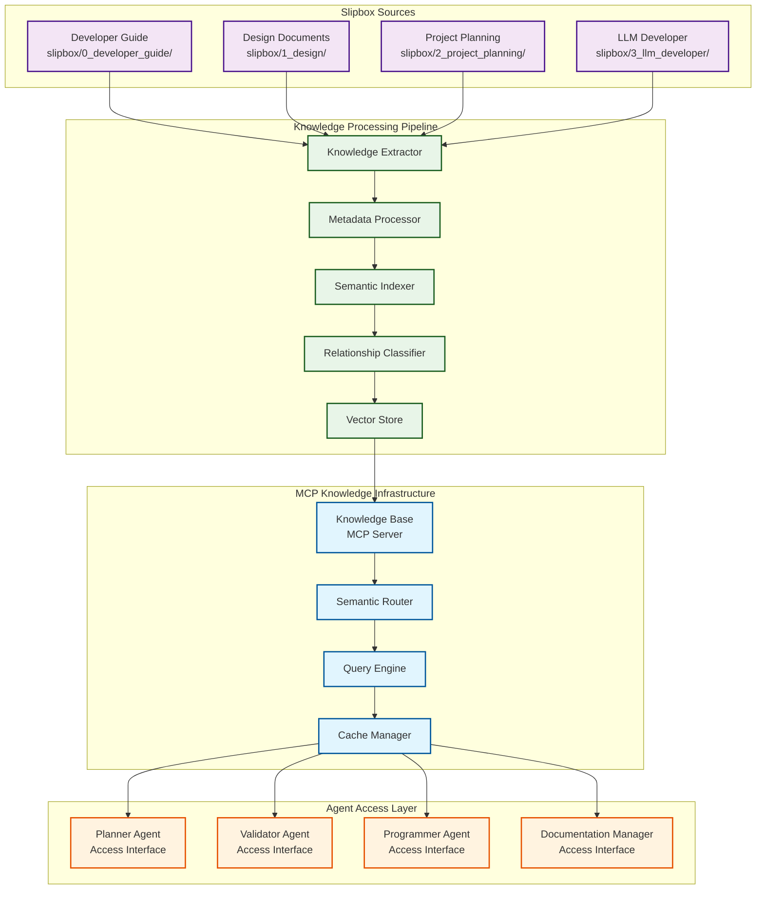

---
tags:
  - design
  - mcp
  - knowledge_transfer
  - implementation
  - automation
keywords:
  - Model Context Protocol
  - knowledge base
  - slipbox integration
  - resource management
  - knowledge extraction
  - content indexing
  - semantic search
topics:
  - MCP knowledge integration
  - slipbox content transfer
  - knowledge base architecture
  - resource management
language: python
date of note: 2025-08-09
---

# MCP Knowledge Transfer Design: Slipbox to MCP Server Integration

## Overview

This document defines the architecture and implementation strategy for transferring knowledge from the existing slipbox folder structure to MCP (Model Context Protocol) servers. The design ensures that all accumulated knowledge, patterns, and documentation are efficiently accessible to the agentic workflow system while maintaining semantic relationships and searchability.

## Related Documents

### Source Documents
- [MCP Agentic Workflow Implementation Design](mcp_agentic_workflow_implementation_design.md) - MCP architecture and server specifications
- [Documentation YAML Frontmatter Standard](documentation_yaml_frontmatter_standard.md) - Documentation metadata standards
- [Agentic Workflow Design](agentic_workflow_design.md) - Original workflow requirements

### Implementation Planning
- [MCP Knowledge Transfer Implementation Plan](../2_project_planning/2025-08-09_mcp_knowledge_transfer_implementation_plan.md) - Detailed implementation roadmap, resource allocation, and project management

### Knowledge Sources
- `slipbox/0_developer_guide/` - Developer guide documentation
- `slipbox/1_design/` - Design documents and architectural patterns
- `slipbox/2_project_planning/` - Project planning and implementation history
- `slipbox/3_llm_developer/` - LLM developer tools and prompt templates

## Knowledge Transfer Architecture

### Core Principles

1. **Semantic Preservation**: Maintain semantic relationships between documents
2. **Metadata Enrichment**: Enhance existing YAML frontmatter with MCP-specific metadata
3. **Hierarchical Organization**: Preserve logical document hierarchies
4. **Search Optimization**: Enable efficient semantic and keyword-based search
5. **Version Control**: Track knowledge evolution and updates
6. **Access Control**: Implement appropriate access patterns for different agent roles

### System Components



## Knowledge Extraction Strategy

### 1. Document Classification and Categorization

#### A. Content Type Classification
```python
class DocumentClassifier:
    """Classify documents based on content and metadata"""
    
    DOCUMENT_TYPES = {
        "developer_guide": {
            "patterns": ["guide", "process", "rules", "standards"],
            "source_paths": ["slipbox/0_developer_guide/"],
            "priority": "high",
            "access_frequency": "frequent"
        },
        "design_document": {
            "patterns": ["design", "architecture", "pattern", "system"],
            "source_paths": ["slipbox/1_design/"],
            "priority": "high",
            "access_frequency": "frequent"
        },
        "project_planning": {
            "patterns": ["planning", "implementation", "status", "summary"],
            "source_paths": ["slipbox/2_project_planning/"],
            "priority": "medium",
            "access_frequency": "moderate"
        },
        "prompt_template": {
            "patterns": ["prompt", "template", "agent"],
            "source_paths": ["slipbox/3_llm_developer/"],
            "priority": "high",
            "access_frequency": "frequent"
        }
    }
    
    def classify_document(self, file_path: str, content: str, metadata: dict) -> dict:
        """Classify document and assign appropriate categories"""
        
    def extract_semantic_keywords(self, content: str) -> list:
        """Extract semantic keywords from document content"""
        
    def identify_relationships(self, doc_metadata: dict, all_docs: list) -> list:
        """Identify relationships with other documents"""
```

#### B. Metadata Enhancement
```python
class MetadataEnhancer:
    """Enhance existing YAML frontmatter with MCP-specific metadata"""
    
    def enhance_frontmatter(self, existing_metadata: dict, content: str, file_path: str) -> dict:
        """Enhance existing YAML frontmatter with MCP-specific fields"""
        enhanced = existing_metadata.copy()
        
        # Add MCP-specific fields
        enhanced.update({
            "mcp_resource_type": self._determine_resource_type(file_path, content),
            "agent_relevance": self._calculate_agent_relevance(content, existing_metadata),
            "semantic_embeddings": self._generate_embeddings(content),
            "relationship_graph": self._build_relationship_graph(file_path, content),
            "access_patterns": self._analyze_access_patterns(existing_metadata),
            "update_frequency": self._estimate_update_frequency(file_path),
            "knowledge_domain": self._classify_knowledge_domain(content, existing_metadata)
        })
        
        return enhanced
    
    def _determine_resource_type(self, file_path: str, content: str) -> str:
        """Determine MCP resource type based on content and location"""
        
    def _calculate_agent_relevance(self, content: str, metadata: dict) -> dict:
        """Calculate relevance scores for different agent types"""
        return {
            "planner_agent": self._score_planner_relevance(content, metadata),
            "validator_agent": self._score_validator_relevance(content, metadata),
            "programmer_agent": self._score_programmer_relevance(content, metadata),
            "documentation_manager": self._score_documentation_relevance(content, metadata)
        }
```

### 2. Semantic Indexing and Embedding

#### A. Content Vectorization
```python
class SemanticIndexer:
    """Create semantic embeddings and indexes for efficient retrieval"""
    
    def __init__(self, embedding_model: str = "text-embedding-ada-002"):
        self.embedding_model = embedding_model
        self.vector_store = None
        
    def create_document_embeddings(self, documents: list) -> dict:
        """Create embeddings for document content and metadata"""
        embeddings = {}
        
        for doc in documents:
            # Create embeddings for different content sections
            embeddings[doc['id']] = {
                "title_embedding": self._embed_text(doc['title']),
                "content_embedding": self._embed_text(doc['content']),
                "metadata_embedding": self._embed_metadata(doc['metadata']),
                "combined_embedding": self._embed_combined(doc)
            }
            
        return embeddings
    
    def build_semantic_index(self, embeddings: dict, metadata: dict) -> dict:
        """Build searchable semantic index"""
        
    def create_relationship_graph(self, documents: list) -> dict:
        """Create graph of document relationships based on semantic similarity"""
```

#### B. Hierarchical Knowledge Organization
```python
class KnowledgeHierarchy:
    """Organize knowledge in hierarchical structure for efficient access"""
    
    HIERARCHY_LEVELS = {
        "domain": {
            "pipeline_development": ["developer_guide", "design_patterns", "implementation"],
            "validation_framework": ["alignment_rules", "validation_tools", "testing"],
            "workflow_automation": ["agentic_workflow", "prompt_templates", "orchestration"]
        },
        "category": {
            "architectural_patterns": ["step_builder_patterns", "configuration_patterns"],
            "implementation_guides": ["creation_process", "best_practices", "common_pitfalls"],
            "validation_rules": ["alignment_rules", "standardization_rules", "validation_checklist"]
        },
        "subcategory": {
            "step_types": ["processing", "training", "transform", "createmodel"],
            "component_types": ["builders", "configs", "specs", "contracts", "scripts"]
        }
    }
    
    def organize_knowledge(self, documents: list) -> dict:
        """Organize documents into hierarchical structure"""
        
    def create_navigation_paths(self, hierarchy: dict) -> dict:
        """Create navigation paths for efficient knowledge traversal"""
```

## MCP Server Knowledge Integration

### 1. Knowledge Base MCP Server Implementation

#### A. Server Configuration
```json
{
  "name": "pipeline-knowledge-base",
  "version": "1.0.0",
  "description": "Centralized knowledge base for pipeline development",
  "capabilities": {
    "semantic_search": true,
    "relationship_traversal": true,
    "content_filtering": true,
    "real_time_updates": true
  },
  "resources": {
    "knowledge_domains": {
      "uri": "knowledge://domains/",
      "description": "Organized knowledge domains and categories"
    },
    "semantic_index": {
      "uri": "search://semantic/",
      "description": "Semantic search index for content discovery"
    },
    "relationship_graph": {
      "uri": "graph://relationships/",
      "description": "Document relationship graph for navigation"
    }
  },
  "tools": {
    "semantic_search": {
      "description": "Search knowledge base using semantic similarity",
      "inputSchema": {
        "type": "object",
        "properties": {
          "query": {"type": "string"},
          "domain_filter": {"type": "array"},
          "agent_context": {"type": "string"},
          "max_results": {"type": "integer", "default": 10}
        }
      }
    },
    "get_related_documents": {
      "description": "Get documents related to a specific document",
      "inputSchema": {
        "type": "object",
        "properties": {
          "document_id": {"type": "string"},
          "relationship_types": {"type": "array"},
          "max_depth": {"type": "integer", "default": 2}
        }
      }
    },
    "filter_by_agent_relevance": {
      "description": "Filter documents by relevance to specific agent",
      "inputSchema": {
        "type": "object",
        "properties": {
          "agent_type": {"type": "string"},
          "relevance_threshold": {"type": "number", "default": 0.7},
          "content_types": {"type": "array"}
        }
      }
    }
  }
}
```

#### B. Resource Access Patterns
```python
class KnowledgeResourceManager:
    """Manage access to knowledge resources for different agents"""
    
    AGENT_ACCESS_PATTERNS = {
        "planner_agent": {
            "high_priority": [
                "developer_guide/creation_process",
                "developer_guide/design_principles", 
                "design_patterns/*_step_builder_patterns",
                "design_patterns/specification_driven_design"
            ],
            "medium_priority": [
                "implementation_examples/builders",
                "implementation_examples/configs",
                "project_planning/implementation_summaries"
            ],
            "access_frequency": "frequent",
            "cache_duration": 3600  # 1 hour
        },
        "validator_agent": {
            "high_priority": [
                "developer_guide/alignment_rules",
                "developer_guide/validation_checklist",
                "design_patterns/validation_framework",
                "design_patterns/two_level_validation"
            ],
            "medium_priority": [
                "implementation_examples/validation_tools",
                "developer_guide/common_pitfalls",
                "design_patterns/enhanced_dependency_validation"
            ],
            "access_frequency": "frequent",
            "cache_duration": 1800  # 30 minutes
        },
        "programmer_agent": {
            "high_priority": [
                "implementation_examples/builders",
                "implementation_examples/configs",
                "implementation_examples/specs",
                "implementation_examples/contracts",
                "developer_guide/step_builder",
                "developer_guide/three_tier_config_design"
            ],
            "medium_priority": [
                "design_patterns/*_step_builder_patterns",
                "developer_guide/standardization_rules",
                "prompt_templates/programmer_prompt_template"
            ],
            "access_frequency": "very_frequent",
            "cache_duration": 7200  # 2 hours
        },
        "documentation_manager": {
            "high_priority": [
                "documentation_yaml_frontmatter_standard",
                "prompt_templates/documentation_templates",
                "project_planning/*"
            ],
            "medium_priority": [
                "developer_guide/best_practices",
                "design_patterns/documentation_patterns"
            ],
            "access_frequency": "moderate",
            "cache_duration": 1800  # 30 minutes
        }
    }
    
    def get_agent_resources(self, agent_type: str, priority_level: str = "all") -> list:
        """Get resources relevant to specific agent type"""
        
    def preload_agent_cache(self, agent_type: str) -> dict:
        """Preload frequently accessed resources for agent"""
        
    def update_access_patterns(self, agent_type: str, accessed_resources: list):
        """Update access patterns based on actual usage"""
```

### 2. Semantic Search and Query Engine

#### A. Query Processing
```python
class SemanticQueryEngine:
    """Process semantic queries and return relevant knowledge"""
    
    def __init__(self, vector_store, relationship_graph, metadata_index):
        self.vector_store = vector_store
        self.relationship_graph = relationship_graph
        self.metadata_index = metadata_index
        
    def process_query(self, query: str, context: dict) -> dict:
        """Process semantic query and return ranked results"""
        
        # Step 1: Generate query embedding
        query_embedding = self._embed_query(query, context)
        
        # Step 2: Semantic similarity search
        semantic_results = self._semantic_search(query_embedding, context)
        
        # Step 3: Keyword-based search
        keyword_results = self._keyword_search(query, context)
        
        # Step 4: Relationship-based expansion
        expanded_results = self._expand_with_relationships(
            semantic_results + keyword_results, context
        )
        
        # Step 5: Agent-specific filtering
        filtered_results = self._filter_by_agent_relevance(
            expanded_results, context.get('agent_type')
        )
        
        # Step 6: Ranking and scoring
        ranked_results = self._rank_results(filtered_results, query, context)
        
        return {
            "results": ranked_results,
            "total_found": len(ranked_results),
            "query_metadata": {
                "semantic_matches": len(semantic_results),
                "keyword_matches": len(keyword_results),
                "relationship_expanded": len(expanded_results) - len(semantic_results + keyword_results)
            }
        }
    
    def _semantic_search(self, query_embedding: list, context: dict) -> list:
        """Perform semantic similarity search"""
        
    def _keyword_search(self, query: str, context: dict) -> list:
        """Perform keyword-based search with metadata filtering"""
        
    def _expand_with_relationships(self, initial_results: list, context: dict) -> list:
        """Expand results using document relationships"""
        
    def _filter_by_agent_relevance(self, results: list, agent_type: str) -> list:
        """Filter results by agent relevance scores"""
        
    def _rank_results(self, results: list, query: str, context: dict) -> list:
        """Rank results by relevance and context"""
```

#### B. Context-Aware Retrieval
```python
class ContextAwareRetrieval:
    """Retrieve knowledge based on workflow context and agent needs"""
    
    def get_contextual_knowledge(self, workflow_phase: str, step_type: str, 
                                agent_type: str) -> dict:
        """Get knowledge relevant to current workflow context"""
        
        context_filters = {
            "workflow_phase": workflow_phase,
            "step_type": step_type,
            "agent_type": agent_type
        }
        
        # Get phase-specific knowledge
        phase_knowledge = self._get_phase_knowledge(workflow_phase)
        
        # Get step-type-specific patterns
        step_patterns = self._get_step_patterns(step_type)
        
        # Get agent-specific resources
        agent_resources = self._get_agent_resources(agent_type)
        
        # Combine and rank by relevance
        combined_knowledge = self._combine_knowledge_sources(
            phase_knowledge, step_patterns, agent_resources, context_filters
        )
        
        return {
            "contextual_knowledge": combined_knowledge,
            "context_metadata": context_filters,
            "knowledge_sources": {
                "phase_specific": len(phase_knowledge),
                "step_patterns": len(step_patterns),
                "agent_resources": len(agent_resources)
            }
        }
    
    def _get_phase_knowledge(self, workflow_phase: str) -> list:
        """Get knowledge specific to workflow phase"""
        phase_mappings = {
            "plan_development": [
                "developer_guide/creation_process",
                "developer_guide/design_principles",
                "design_patterns/specification_driven_design"
            ],
            "plan_validation": [
                "developer_guide/alignment_rules",
                "developer_guide/validation_checklist",
                "design_patterns/validation_framework"
            ],
            "code_implementation": [
                "implementation_examples/*",
                "developer_guide/step_builder",
                "developer_guide/three_tier_config_design"
            ],
            "code_validation": [
                "design_patterns/two_level_validation",
                "design_patterns/enhanced_dependency_validation",
                "validation_tools/*"
            ]
        }
        return phase_mappings.get(workflow_phase, [])
    
    def _get_step_patterns(self, step_type: str) -> list:
        """Get patterns specific to step type"""
        step_mappings = {
            "Processing": [
                "design_patterns/processing_step_builder_patterns",
                "implementation_examples/builders/processing",
                "implementation_examples/configs/processing"
            ],
            "Training": [
                "design_patterns/training_step_builder_patterns",
                "implementation_examples/builders/training",
                "implementation_examples/configs/training"
            ],
            "Transform": [
                "design_patterns/transform_step_builder_patterns",
                "implementation_examples/builders/transform"
            ],
            "CreateModel": [
                "design_patterns/createmodel_step_builder_patterns",
                "implementation_examples/builders/createmodel"
            ]
        }
        return step_mappings.get(step_type, [])
```

## Knowledge Migration Process

### 1. Migration Pipeline Implementation

#### A. Automated Migration Pipeline
```python
class KnowledgeMigrationPipeline:
    """Automated pipeline for migrating slipbox content to MCP servers"""
    
    def __init__(self, source_path: str, target_mcp_server: str):
        self.source_path = source_path
        self.target_server = target_mcp_server
        self.classifier = DocumentClassifier()
        self.enhancer = MetadataEnhancer()
        self.indexer = SemanticIndexer()
        
    def execute_migration(self) -> dict:
        """Execute complete migration pipeline"""
        
        migration_results = {
            "processed_documents": 0,
            "successful_migrations": 0,
            "failed_migrations": 0,
            "enhancement_stats": {},
            "indexing_stats": {},
            "validation_results": {}
        }
        
        # Step 1: Discover and classify documents
        documents = self._discover_documents()
        migration_results["processed_documents"] = len(documents)
        
        # Step 2: Process each document
        for doc in documents:
            try:
                # Classify and enhance metadata
                classification = self.classifier.classify_document(
                    doc['path'], doc['content'], doc['metadata']
                )
                
                enhanced_metadata = self.enhancer.enhance_frontmatter(
                    doc['metadata'], doc['content'], doc['path']
                )
                
                # Create embeddings and index
                embeddings = self.indexer.create_document_embeddings([{
                    'id': doc['id'],
                    'title': doc['title'],
                    'content': doc['content'],
                    'metadata': enhanced_metadata
                }])
                
                # Migrate to MCP server
                migration_success = self._migrate_to_mcp_server(
                    doc, enhanced_metadata, embeddings, classification
                )
                
                if migration_success:
                    migration_results["successful_migrations"] += 1
                else:
                    migration_results["failed_migrations"] += 1
                    
            except Exception as e:
                migration_results["failed_migrations"] += 1
                self._log_migration_error(doc['path'], e)
        
        # Step 3: Build relationships and indexes
        self._build_relationship_graph(migration_results)
        self._create_semantic_indexes(migration_results)
        
        # Step 4: Validate migration
        validation_results = self._validate_migration()
        migration_results["validation_results"] = validation_results
        
        return migration_results
    
    def _discover_documents(self) -> list:
        """Discover all documents in slipbox structure"""
        
    def _migrate_to_mcp_server(self, doc: dict, metadata: dict, 
                              embeddings: dict, classification: dict) -> bool:
        """Migrate single document to MCP server"""
        
    def _build_relationship_graph(self, migration_results: dict):
        """Build document relationship graph"""
        
    def _create_semantic_indexes(self, migration_results: dict):
        """Create semantic search indexes"""
        
    def _validate_migration(self) -> dict:
        """Validate migration completeness and accuracy"""
```

#### B. Incremental Update System
```python
class IncrementalUpdateSystem:
    """System for incremental updates to knowledge base"""
    
    def __init__(self, mcp_server_client):
        self.mcp_client = mcp_server_client
        self.change_detector = FileChangeDetector()
        self.update_processor = UpdateProcessor()
        
    def monitor_changes(self, watch_paths: list):
        """Monitor slipbox for changes and update MCP server"""
        
        for change in self.change_detector.detect_changes(watch_paths):
            if change['type'] == 'modified':
                self._handle_document_update(change)
            elif change['type'] == 'created':
                self._handle_document_creation(change)
            elif change['type'] == 'deleted':
                self._handle_document_deletion(change)
    
    def _handle_document_update(self, change: dict):
        """Handle document modification"""
        
    def _handle_document_creation(self, change: dict):
        """Handle new document creation"""
        
    def _handle_document_deletion(self, change: dict):
        """Handle document deletion"""
```

### 2. Content Transformation and Enhancement

#### A. Content Preprocessing
```python
class ContentPreprocessor:
    """Preprocess content for optimal MCP server integration"""
    
    def preprocess_markdown(self, content: str, metadata: dict) -> dict:
        """Preprocess markdown content for better indexing"""
        
        processed = {
            "sections": self._extract_sections(content),
            "code_blocks": self._extract_code_blocks(content),
            "links": self._extract_links(content),
            "tables": self._extract_tables(content),
            "diagrams": self._extract_diagrams(content),
            "clean_text": self._clean_text_content(content)
        }
        
        return processed
    
    def _extract_sections(self, content: str) -> list:
        """Extract hierarchical sections from markdown"""
        
    def _extract_code_blocks(self, content: str) -> list:
        """Extract and classify code blocks"""
        
    def _extract_links(self, content: str) -> list:
        """Extract internal and external links"""
        
    def _extract_tables(self, content: str) -> list:
        """Extract and structure table data"""
        
    def _extract_diagrams(self, content: str) -> list:
        """Extract mermaid diagrams and other visual content"""
        
    def _clean_text_content(self, content: str) -> str:
        """Clean text content for embedding generation"""
```

#### B. Relationship Detection
```python
class RelationshipDetector:
    """Detect and classify relationships between documents"""
    
    RELATIONSHIP_TYPES = {
        "references": {
            "pattern": r"\[([^\]]+)\]\(([^)]+\.md)\)",
            "weight": 0.8,
            "bidirectional": False
        },
        "implements": {
            "keywords": ["implements", "based on", "follows"],
            "weight": 0.9,
            "bidirectional": False
        },
        "extends": {
            "keywords": ["extends", "builds on", "enhances"],
            "weight": 0.7,
            "bidirectional": False
        },
        "related": {
            "semantic_similarity_threshold": 0.6,
            "weight": 0.5,
            "bidirectional": True
        },
        "supersedes": {
            "keywords": ["replaces", "supersedes", "obsoletes"],
            "weight": 1.0,
            "bidirectional": False
        }
    }
    
    def detect_relationships(self, documents: list) -> dict:
        """Detect relationships between all documents"""
        
        relationships = {}
        
        for doc in documents:
            doc_relationships = []
            
            # Detect explicit references
            references = self._detect_references(doc, documents)
            doc_relationships.extend(references)
            
            # Detect semantic relationships
            semantic_rels = self._detect_semantic_relationships(doc, documents)
            doc_relationships.extend(semantic_rels)
            
            # Detect implementation relationships
            impl_rels = self._detect_implementation_relationships(doc, documents)
            doc_relationships.extend(impl_rels)
            
            relationships[doc['id']] = doc_relationships
            
        return relationships
    
    def _detect_references(self, doc: dict, all_docs: list) -> list:
        """Detect explicit document references"""
        
    def _detect_semantic_relationships(self, doc: dict, all_docs: list) -> list:
        """Detect semantic relationships using embeddings"""
        
    def _detect_implementation_relationships(self, doc: dict, all_docs: list) -> list:
        """Detect implementation and design relationships"""
```

## Agent-Specific Knowledge Access

### 1. Planner Agent Knowledge Interface

#### A. Planning-Specific Resources
```python
class PlannerKnowledgeInterface:
    """Knowledge interface optimized for planner agent needs"""
    
    def get_planning_resources(self, step_type: str, requirements: str) -> dict:
        """Get resources specifically for implementation planning"""
        
        resources = {
            "design_patterns": self._get_step_design_patterns(step_type),
            "implementation_examples": self._get_implementation_examples(step_type),
            "architectural_guidelines": self._get_architectural_guidelines(),
            "best_practices": self._get_best_practices(step_type),
            "common_pitfalls": self._get_common_pitfalls(step_type)
        }
        
        # Filter by relevance to requirements
        filtered_resources = self._filter_by_requirements(resources, requirements)
        
        return filtered_resources
    
    def get_pattern_recommendations(self, step_type: str, complexity: str) -> list:
        """Get pattern recommendations based on step type and complexity"""
        
    def get_dependency_patterns(self, step_type: str) -> dict:
        """Get dependency patterns for specific step types"""
```

#### B. Validation-Specific Resources
```python
class ValidatorKnowledgeInterface:
    """Knowledge interface optimized for validator agent needs"""
    
    def get_validation_resources(self, validation_type: str, component_type: str) -> dict:
        """Get resources for validation operations"""
        
        resources = {
            "validation_rules": self._get_validation_rules(validation_type),
            "alignment_patterns": self._get_alignment_patterns(component_type),
            "validation_tools": self._get_validation_tools(validation_type),
            "error_patterns": self._get_common_error_patterns(component_type),
            "validation_examples": self._get_validation_examples(validation_type)
        }
        
        return resources
    
    def get_validation_criteria(self, phase: str, step_type: str) -> dict:
        """Get validation criteria for specific phase and step type"""
        
    def get_tool_configurations(self, validation_scope: str) -> dict:
        """Get tool configurations for validation scope"""
```

### 2. Programmer Agent Knowledge Interface

#### A. Implementation-Specific Resources
```python
class ProgrammerKnowledgeInterface:
    """Knowledge interface optimized for programmer agent needs"""
    
    def get_implementation_resources(self, component_type: str, step_type: str) -> dict:
        """Get resources for code implementation"""
        
        resources = {
            "code_templates": self._get_code_templates(component_type, step_type),
            "implementation_patterns": self._get_implementation_patterns(component_type),
            "example_implementations": self._get_example_implementations(component_type, step_type),
            "integration_guides": self._get_integration_guides(component_type),
            "testing_patterns": self._get_testing_patterns(component_type)
        }
        
        return resources
    
    def get_code_generation_context(self, plan: dict) -> dict:
        """Get context for code generation from implementation plan"""
        
    def get_refinement_patterns(self, validation_feedback: dict) -> dict:
        """Get patterns for code refinement based on validation feedback"""
```

## Performance Optimization

### 1. Caching Strategy

#### A. Multi-Level Caching
```python
class KnowledgeCacheManager:
    """Multi-level caching for knowledge base access"""
    
    def __init__(self):
        self.l1_cache = {}  # In-memory cache for frequently accessed items
        self.l2_cache = {}  # Disk-based cache for larger items
        self.l3_cache = {}  # Distributed cache for shared access
        
    def get_cached_knowledge(self, cache_key: str, cache_level: int = 1) -> dict:
        """Get knowledge from appropriate cache level"""
        
        if cache_level >= 1 and cache_key in self.l1_cache:
            return self.l1_cache[cache_key]
        elif cache_level >= 2 and cache_key in self.l2_cache:
            return self.l2_cache[cache_key]
        elif cache_level >= 3 and cache_key in self.l3_cache:
            return self.l3_cache[cache_key]
        
        return None
    
    def cache_knowledge(self, cache_key: str, data: dict, 
                       cache_level: int = 1, ttl: int = 3600):
        """Cache knowledge at appropriate level"""
        
    def invalidate_cache(self, pattern: str = None):
        """Invalidate cache entries matching pattern"""
```

#### B. Preloading Strategy
```python
class KnowledgePreloader:
    """Preload frequently accessed knowledge for agents"""
    
    def preload_agent_knowledge(self, agent_type: str) -> dict:
        """Preload knowledge based on agent access patterns"""
        
        access_patterns = self._get_agent_access_patterns(agent_type)
        preloaded_knowledge = {}
        
        for pattern in access_patterns["high_priority"]:
            knowledge = self._load_knowledge_pattern(pattern)
            preloaded_knowledge[pattern] = knowledge
            
        return preloaded_knowledge
    
    def update_preload_patterns(self, agent_type: str, usage_stats: dict):
        """Update preload patterns based on actual usage"""
```

### 2. Query Optimization

#### A. Query Planning
```python
class QueryPlanner:
    """Optimize knowledge queries for performance"""
    
    def plan_query(self, query: str, context: dict) -> dict:
        """Create optimized query execution plan"""
        
        plan = {
            "query_type": self._classify_query_type(query),
            "search_strategy": self._select_search_strategy(query, context),
            "filter_sequence": self._optimize_filter_sequence(context),
            "result_ranking": self._select_ranking_strategy(query, context),
            "cache_strategy": self._determine_cache_strategy(query, context)
        }
        
        return plan
    
    def execute_optimized_query(self, query_plan: dict) -> dict:
        """Execute query using optimized plan"""
```

## Monitoring and Analytics

### 1. Usage Analytics

#### A. Access Pattern Analysis
```python
class KnowledgeAnalytics:
    """Analytics for knowledge base usage and optimization"""
    
    def track_access_patterns(self, agent_type: str, accessed_resources: list,
                             query_context: dict):
        """Track knowledge access patterns for optimization"""
        
    def analyze_query_performance(self, queries: list) -> dict:
        """Analyze query performance and identify optimization opportunities"""
        
    def generate_usage_report(self, time_period: str) -> dict:
        """Generate comprehensive usage analytics report"""
        
        report = {
            "total_queries": self._count_queries(time_period),
            "agent_usage_breakdown": self._analyze_agent_usage(time_period),
            "popular_resources": self._identify_popular_resources(time_period),
            "query_performance": self._analyze_query_performance(time_period),
            "cache_effectiveness": self._analyze_cache_performance(time_period),
            "optimization_recommendations": self._generate_recommendations()
        }
        
        return report
```

#### B. Quality Metrics
```python
class KnowledgeQualityMetrics:
    """Metrics for knowledge base quality and effectiveness"""
    
    def calculate_knowledge_coverage(self, domain: str) -> dict:
        """Calculate knowledge coverage for specific domain"""
        
    def measure_relationship_accuracy(self) -> dict:
        """Measure accuracy of detected document relationships"""
        
    def assess_search_relevance(self, test_queries: list) -> dict:
        """Assess search result relevance using test queries"""
        
    def evaluate_agent_satisfaction(self, feedback_data: list) -> dict:
        """Evaluate agent satisfaction with knowledge retrieval"""
```

## Implementation Planning

For detailed implementation planning, resource allocation, and project management information, see:

**[MCP Knowledge Transfer Implementation Plan](../2_project_planning/2025-08-09_mcp_knowledge_transfer_implementation_plan.md)**

This comprehensive implementation plan includes:
- 8-week phased implementation roadmap
- Resource allocation and team structure
- Risk management and mitigation strategies
- Quality assurance and testing procedures
- Success metrics and monitoring plans
- Budget estimates and infrastructure requirements

### Key Implementation Phases

1. **Phase 1 (Weeks 1-2)**: Foundation - Infrastructure setup and core pipeline development
2. **Phase 2 (Weeks 3-4)**: Core Functionality - Semantic search and agent integration
3. **Phase 3 (Weeks 5-6)**: Advanced Features - Performance optimization and analytics
4. **Phase 4 (Weeks 7-8)**: Production Readiness - Testing, documentation, and deployment

### Success Criteria Summary

- **Migration Completeness**: 100% of documents processed successfully
- **Query Performance**: < 200ms response time for 95% of queries
- **Search Relevance**: > 85% relevance score for top 5 results
- **Agent Satisfaction**: > 4.5/5 satisfaction score from agent feedback
- **System Availability**: > 99.9% uptime

## Conclusion

This knowledge transfer design provides a comprehensive framework for migrating the rich knowledge base from the slipbox folder structure to a sophisticated MCP-based system. The design ensures that all accumulated knowledge, patterns, and relationships are preserved while enabling efficient, context-aware access for the agentic workflow system.

The multi-layered architecture with semantic indexing, relationship detection, and agent-specific optimization ensures that each agent in the workflow can access the most relevant knowledge efficiently. The performance optimization strategies and analytics capabilities provide a foundation for continuous improvement and scaling.

The implementation roadmap provides a clear path from basic migration to a production-ready system that can support the sophisticated requirements of the agentic workflow while maintaining the semantic richness and organizational structure of the original knowledge base.
