---
tags:
  - design
  - implementation
  - missing_value_imputation
  - data_preprocessing
  - simple_imputation
keywords:
  - missing values
  - imputation
  - data preprocessing
  - statistical imputation
  - mean imputation
  - median imputation
  - mode imputation
topics:
  - data preprocessing
  - missing value handling
  - statistical imputation
  - data quality
language: python
date of note: 2025-09-30
---

# Missing Value Imputation Script Design

## What is the Purpose of Missing Value Imputation Script?

The Missing Value Imputation Script serves as a **comprehensive missing value handling engine** that applies simple statistical imputation methods to tabular data. It takes input from the output of the `tabular_preprocessing.py` script and provides a framework for handling missing values using statistical measures (mean, median, mode) and constant value imputation strategies.

The core purpose is to:
1. **Apply simple imputation methods** (mean, median, mode, constant) to handle missing values
2. **Support training/inference modes** - fit imputation parameters on training data, apply to inference data
3. **Handle mixed data types** - appropriate imputation strategies for numerical and categorical features
4. **Preserve data structure** - maintain original data format and column structure
5. **Generate imputation artifacts** - save fitted imputation parameters for inference mode

## Core Design Principles

The Missing Value Imputation Script is built on several key design principles:

1. **Mode-Aware Processing** - Different behavior for training vs. non-training job types
2. **Type-Aware Imputation** - Appropriate imputation strategies based on data types (numerical, text/string, categorical)
3. **Pandas-Safe Values** - Avoid values that pandas interprets as NA/NULL
4. **Artifact Persistence** - Save/load imputation parameters for consistent inference
5. **Configurable Strategies** - Environment variable-driven imputation configuration
6. **Data Integrity** - Preserve original data structure and relationships
7. **Robust Error Handling** - Graceful handling of edge cases and missing data scenarios

## Architecture Overview

The missing value imputation script architecture consists of five main components:

```mermaid
graph TD
    subgraph "📊 Data Loading Component"
        DataLoader["Data Loader<br/>• Load preprocessed data<br/>• Validate data structure<br/>• Detect column types<br/>• Missing value analysis"]
    end
    
    subgraph "🔧 Imputation Strategy Component"
        ImputationStrategy["Imputation Strategy Manager<br/>• Strategy selection by type<br/>• Parameter configuration<br/>• Validation rules<br/>• Custom strategy support"]
    end
    
    subgraph "📈 Imputation Engine Component"
        ImputationEngine["Imputation Engine<br/>• Fit imputation parameters<br/>• Transform data<br/>• Handle edge cases<br/>• Preserve data types"]
    end
    
    subgraph "💾 Artifact Management Component"
        ArtifactManager["Artifact Manager<br/>• Save imputation parameters<br/>• Load trained parameters<br/>• Version management<br/>• Validation checks"]
    end
    
    subgraph "📋 Reporting Component"
        Reporting["Report Generator<br/>• Imputation summary<br/>• Missing value statistics<br/>• Quality metrics<br/>• Transformation logs"]
    end
    
    DataLoader --> ImputationStrategy
    ImputationStrategy --> ImputationEngine
    ImputationEngine --> ArtifactManager
    ImputationEngine --> Reporting
    ArtifactManager --> Reporting
    
    subgraph "📊 Input Data"
        InputData["Preprocessed Data<br/>• Train/test/val splits<br/>• Mixed data types<br/>• Missing value patterns<br/>• Label information"]
    end
    
    subgraph "📈 Output Artifacts"
        OutputArtifacts["Imputed Data & Artifacts<br/>• Imputed datasets<br/>• Imputation parameters<br/>• Summary reports<br/>• Quality metrics"]
    end
    
    InputData --> DataLoader
    Reporting --> OutputArtifacts
```



## Core Components

### 1. Data Loading Component

The data loading component handles input data validation and missing value analysis:

```python
def load_split_data(job_type: str, input_dir: str) -> Dict[str, pd.DataFrame]:
    """
    Load data according to job_type, following risk_table_mapping pattern.
    
    For 'training': Loads data from train, test, and val subdirectories
    For others: Loads single job_type split
    """
    input_path = Path(input_dir)

    if job_type == "training":
        # For training, we expect data in train/test/val subdirectories
        train_df = pd.read_csv(input_path / "train" / "train_processed_data.csv")
        test_df = pd.read_csv(input_path / "test" / "test_processed_data.csv")
        val_df = pd.read_csv(input_path / "val" / "val_processed_data.csv")
        logger.info(
            f"Loaded training data splits: train={train_df.shape}, test={test_df.shape}, val={val_df.shape}"
        )
        return {"train": train_df, "test": test_df, "val": val_df}
    else:
        # For other job types, we expect data in a single directory named after job_type
        df = pd.read_csv(input_path / job_type / f"{job_type}_processed_data.csv")
        logger.info(f"Loaded {job_type} data: {df.shape}")
        return {job_type: df}

def analyze_missing_values(df: pd.DataFrame) -> Dict[str, Any]:
    """
    Comprehensive missing value analysis for imputation planning.
    """
    missing_analysis = {
        "total_records": len(df),
        "columns_with_missing": {},
        "missing_patterns": {},
        "data_types": {},
        "imputation_recommendations": {}
    }
    
    for col in df.columns:
        missing_count = df[col].isnull().sum()
        missing_percentage = (missing_count / len(df)) * 100
        
        if missing_count > 0:
            missing_analysis["columns_with_missing"][col] = {
                "missing_count": int(missing_count),
                "missing_percentage": float(missing_percentage),
                "data_type": str(df[col].dtype),
                "unique_values": int(df[col].nunique()),
                "sample_values": df[col].dropna().head(5).tolist()
            }
            
            # Recommend imputation strategy based on data type and distribution
            if pd.api.types.is_numeric_dtype(df[col]):
                if df[col].skew() > 1:  # Highly skewed
                    missing_analysis["imputation_recommendations"][col] = "median"
                else:
                    missing_analysis["imputation_recommendations"][col] = "mean"
            else:
                missing_analysis["imputation_recommendations"][col] = "mode"
        
        missing_analysis["data_types"][col] = str(df[col].dtype)
    
    # Analyze missing patterns
    missing_pattern = df.isnull().sum(axis=1)
    missing_analysis["missing_patterns"] = {
        "records_with_no_missing": int((missing_pattern == 0).sum()),
        "records_with_missing": int((missing_pattern > 0).sum()),
        "max_missing_per_record": int(missing_pattern.max()),
        "avg_missing_per_record": float(missing_pattern.mean())
    }
    
    return missing_analysis

def validate_imputation_data(
    df: pd.DataFrame, 
    label_field: str,
    exclude_columns: List[str] = None
) -> Dict[str, Any]:
    """
    Validate data for imputation processing.
    """
    exclude_columns = exclude_columns or []
    validation_report = {
        "is_valid": True,
        "errors": [],
        "warnings": [],
        "imputable_columns": [],
        "excluded_columns": exclude_columns.copy()
    }
    
    # Check if label field exists and exclude it from imputation
    if label_field in df.columns:
        validation_report["excluded_columns"].append(label_field)
    else:
        validation_report["warnings"].append(f"Label field '{label_field}' not found in data")
    
    # Identify columns suitable for imputation
    for col in df.columns:
        if col not in validation_report["excluded_columns"]:
            if df[col].isnull().any():
                validation_report["imputable_columns"].append(col)
    
    if not validation_report["imputable_columns"]:
        validation_report["warnings"].append("No columns with missing values found for imputation")
    
    return validation_report
```

Key features:
- **Consistent data loading** - Follows same pattern as risk_table_mapping.py
- **Missing value analysis** - Comprehensive analysis of missing value patterns
- **Type detection** - Automatic detection of numerical vs categorical columns
- **Imputation planning** - Intelligent recommendations for imputation strategies

### 2. Imputation Strategy Component

The imputation strategy component manages different imputation approaches:

```python
class ImputationStrategyManager:
    """
    Manages imputation strategies for different data types and use cases.
    """
    
    def __init__(self, config: Dict[str, Any]):
        self.config = config
        self.strategies = {
            "numerical": {
                "mean": SimpleImputer(strategy="mean"),
                "median": SimpleImputer(strategy="median"),
                "constant": SimpleImputer(strategy="constant", fill_value=0)
            },
            "categorical": {
                "mode": SimpleImputer(strategy="most_frequent"),
                "constant": SimpleImputer(strategy="constant", fill_value="Unknown")
            }
        }
        
    def get_strategy_for_column(self, df: pd.DataFrame, column: str) -> SimpleImputer:
        """
        Select appropriate imputation strategy for a specific column.
        """
        # Check if strategy is explicitly configured
        if column in self.config.get("column_strategies", {}):
            strategy_name = self.config["column_strategies"][column]
            return self._create_strategy_from_name(df, column, strategy_name)
        
        # Auto-select based on data type
        if pd.api.types.is_numeric_dtype(df[column]):
            default_strategy = self.config.get("default_numerical_strategy", "mean")
            return self._create_strategy_from_name(df, column, default_strategy)
        else:
            default_strategy = self.config.get("default_categorical_strategy", "mode")
            return self._create_strategy_from_name(df, column, default_strategy)
    
    def _create_strategy_from_name(self, df: pd.DataFrame, column: str, strategy_name: str) -> SimpleImputer:
        """
        Create imputation strategy from configuration name.
        """
        if pd.api.types.is_numeric_dtype(df[column]):
            if strategy_name == "mean":
                return SimpleImputer(strategy="mean")
            elif strategy_name == "median":
                return SimpleImputer(strategy="median")
            elif strategy_name == "constant":
                fill_value = self.config.get("numerical_constant_value", 0)
                return SimpleImputer(strategy="constant", fill_value=fill_value)
            else:
                logger.warning(f"Unknown numerical strategy '{strategy_name}', using mean")
                return SimpleImputer(strategy="mean")
        else:
            if strategy_name == "mode":
                return SimpleImputer(strategy="most_frequent")
            elif strategy_name == "constant":
                fill_value = self.config.get("categorical_constant_value", "Unknown")
                return SimpleImputer(strategy="constant", fill_value=fill_value)
            else:
                logger.warning(f"Unknown categorical strategy '{strategy_name}', using mode")
                return SimpleImputer(strategy="most_frequent")

def load_imputation_config(environ_vars: Dict[str, str]) -> Dict[str, Any]:
    """
    Load imputation configuration from environment variables.
    """
    config = {
        "default_numerical_strategy": environ_vars.get("DEFAULT_NUMERICAL_STRATEGY", "mean"),
        "default_categorical_strategy": environ_vars.get("DEFAULT_CATEGORICAL_STRATEGY", "mode"),
        "numerical_constant_value": float(environ_vars.get("NUMERICAL_CONSTANT_VALUE", "0")),
        "categorical_constant_value": environ_vars.get("CATEGORICAL_CONSTANT_VALUE", "Unknown"),
        "column_strategies": {},
        "exclude_columns": environ_vars.get("EXCLUDE_COLUMNS", "").split(",") if environ_vars.get("EXCLUDE_COLUMNS") else []
    }
    
    # Parse column-specific strategies from environment variables
    # Format: COLUMN_STRATEGY_<column_name>=<strategy>
    for key, value in environ_vars.items():
        if key.startswith("COLUMN_STRATEGY_"):
            column_name = key.replace("COLUMN_STRATEGY_", "").lower()
            config["column_strategies"][column_name] = value.lower()
    
    return config
```

Key features:
- **Strategy selection** - Automatic and manual strategy selection
- **Type-aware imputation** - Different strategies for numerical vs categorical data
- **Configurable parameters** - Environment variable-driven configuration
- **Custom strategies** - Support for column-specific imputation strategies

### 3. Imputation Engine Component

The imputation engine handles the core imputation logic:

```python
class SimpleImputationEngine:
    """
    Core engine for simple statistical imputation methods.
    """
    
    def __init__(self, strategy_manager: ImputationStrategyManager, label_field: str):
        self.strategy_manager = strategy_manager
        self.label_field = label_field
        self.fitted_imputers = {}
        self.imputation_statistics = {}
    
    def fit(self, df: pd.DataFrame) -> None:
        """
        Fit imputation parameters on training data.
        """
        logger.info("Fitting imputation parameters on training data")
        
        # Get columns to impute (exclude label and other specified columns)
        exclude_cols = [self.label_field] + self.strategy_manager.config.get("exclude_columns", [])
        imputable_columns = [col for col in df.columns 
                           if col not in exclude_cols and df[col].isnull().any()]
        
        logger.info(f"Columns to impute: {imputable_columns}")
        
        for column in imputable_columns:
            # Get appropriate strategy for this column
            imputer = self.strategy_manager.get_strategy_for_column(df, column)
            
            # Fit the imputer on non-null values
            column_data = df[[column]]
            imputer.fit(column_data)
            
            # Store fitted imputer
            self.fitted_imputers[column] = imputer
            
            # Store imputation statistics
            self.imputation_statistics[column] = {
                "strategy": imputer.strategy,
                "fill_value": getattr(imputer, "fill_value", None),
                "statistics": getattr(imputer, "statistics_", None),
                "missing_count_training": df[column].isnull().sum(),
                "missing_percentage_training": (df[column].isnull().sum() / len(df)) * 100,
                "data_type": str(df[column].dtype)
            }
            
            logger.info(f"Fitted imputer for column '{column}': {imputer.strategy}")
    
    def transform(self, df: pd.DataFrame) -> pd.DataFrame:
        """
        Apply fitted imputation to data.
        """
        logger.info("Applying imputation to data")
        df_imputed = df.copy()
        
        transformation_log = {}
        
        for column, imputer in self.fitted_imputers.items():
            if column in df_imputed.columns:
                # Count missing values before imputation
                missing_before = df_imputed[column].isnull().sum()
                
                if missing_before > 0:
                    # Apply imputation
                    column_data = df_imputed[[column]]
                    imputed_data = imputer.transform(column_data)
                    df_imputed[column] = imputed_data[:, 0]
                    
                    # Count missing values after imputation
                    missing_after = df_imputed[column].isnull().sum()
                    
                    transformation_log[column] = {
                        "missing_before": int(missing_before),
                        "missing_after": int(missing_after),
                        "imputed_count": int(missing_before - missing_after),
                        "strategy_used": imputer.strategy
                    }
                    
                    logger.info(f"Imputed {missing_before - missing_after} values in column '{column}'")
                else:
                    transformation_log[column] = {
                        "missing_before": 0,
                        "missing_after": 0,
                        "imputed_count": 0,
                        "strategy_used": imputer.strategy
                    }
        
        self.last_transformation_log = transformation_log
        return df_imputed
    
    def fit_transform(self, df: pd.DataFrame) -> pd.DataFrame:
        """
        Fit imputation parameters and transform data in one step.
        """
        self.fit(df)
        return self.transform(df)
    
    def get_imputation_summary(self) -> Dict[str, Any]:
        """
        Get comprehensive summary of imputation process.
        """
        return {
            "fitted_columns": list(self.fitted_imputers.keys()),
            "imputation_statistics": self.imputation_statistics,
            "last_transformation_log": getattr(self, "last_transformation_log", {}),
            "total_imputers": len(self.fitted_imputers)
        }

def process_data(
    data_dict: Dict[str, pd.DataFrame],
    label_field: str,
    job_type: str,
    imputation_config: Dict[str, Any],
    imputation_parameters: Optional[Dict] = None
) -> Tuple[Dict[str, pd.DataFrame], SimpleImputationEngine]:
    """
    Core data processing logic for missing value imputation.
    
    Args:
        data_dict: Dictionary of dataframes keyed by split name
        label_field: Target column name
        job_type: Type of job (training, validation, testing, calibration)
        imputation_config: Imputation configuration dictionary
        imputation_parameters: Pre-fitted imputation parameters (for non-training jobs)
    
    Returns:
        Tuple containing:
        - Dictionary of imputed dataframes
        - SimpleImputationEngine instance with fitted parameters
    """
    strategy_manager = ImputationStrategyManager(imputation_config)
    imputation_engine = SimpleImputationEngine(strategy_manager, label_field)
    
    if job_type == "training":
        logger.info("Running in 'training' mode: fitting on train data, transforming all splits")
        
        # Fit imputation parameters on training data only
        imputation_engine.fit(data_dict["train"])
        
        # Transform all splits
        transformed_data = {}
        for split_name, df in data_dict.items():
            df_imputed = imputation_engine.transform(df)
            transformed_data[split_name] = df_imputed
            logger.info(f"Imputed {split_name} data, shape: {df_imputed.shape}")
    
    else:
        # Non-training mode: load pre-fitted parameters
        if not imputation_parameters:
            raise ValueError("For non-training job types, imputation_parameters must be provided")
        
        # Load pre-fitted imputation parameters
        imputation_engine.fitted_imputers = imputation_parameters["fitted_imputers"]
        imputation_engine.imputation_statistics = imputation_parameters["imputation_statistics"]
        
        logger.info(f"Using pre-fitted imputation parameters with {len(imputation_engine.fitted_imputers)} imputers")
        
        # Transform the data
        transformed_data = {}
        for split_name, df in data_dict.items():
            df_imputed = imputation_engine.transform(df)
            transformed_data[split_name] = df_imputed
            logger.info(f"Imputed {split_name} data, shape: {df_imputed.shape}")
    
    return transformed_data, imputation_engine
```

Key features:
- **Training/inference modes** - Different behavior for training vs non-training jobs
- **Comprehensive logging** - Detailed tracking of imputation process
- **Statistics preservation** - Maintain imputation statistics for analysis
- **Robust transformation** - Handle edge cases and missing columns gracefully

### 4. Artifact Management Component

The artifact management component handles saving and loading of imputation parameters:

```python
# Constants for file paths to ensure consistency between training and inference
IMPUTATION_PARAMS_FILENAME = "imputation_parameters.pkl"
IMPUTATION_SUMMARY_FILENAME = "imputation_summary.json"

def save_imputation_artifacts(
    imputation_engine: SimpleImputationEngine,
    imputation_config: Dict[str, Any],
    output_path: Path
) -> None:
    """
    Save imputation artifacts to the specified output path.
    
    Args:
        imputation_engine: SimpleImputationEngine instance with fitted parameters
        imputation_config: Imputation configuration dictionary
        output_path: Path to save artifacts to
    """
    # Prepare imputation parameters for serialization
    imputation_parameters = {
        "fitted_imputers": imputation_engine.fitted_imputers,
        "imputation_statistics": imputation_engine.imputation_statistics,
        "config": imputation_config,
        "version": "1.0",
        "timestamp": datetime.utcnow().isoformat()
    }
    
    # Save imputation parameters - using consistent filename
    params_output_path = output_path / IMPUTATION_PARAMS_FILENAME
    with open(params_output_path, "wb") as f:
        pkl.dump(imputation_parameters, f)
    logger.info(f"Saved imputation parameters to {params_output_path}")
    logger.info(f"This file can be used as input for non-training jobs")
    
    # Save human-readable summary
    summary = imputation_engine.get_imputation_summary()
    summary_output_path = output_path / IMPUTATION_SUMMARY_FILENAME
    with open(summary_output_path, "w") as f:
        json.dump(summary, f, indent=2, default=str)
    logger.info(f"Saved imputation summary to {summary_output_path}")

def load_imputation_parameters(imputation_params_path: Path) -> Dict:
    """
    Load imputation parameters from a pickle file.
    
    Args:
        imputation_params_path: Path to the imputation parameters file
    
    Returns:
        Dictionary of imputation parameters
    """
    if not imputation_params_path.exists():
        raise FileNotFoundError(f"Imputation parameters file not found: {imputation_params_path}")
    
    logger.info(f"Loading imputation parameters from {imputation_params_path}")
    with open(imputation_params_path, "rb") as f:
        imputation_parameters = pkl.load(f)
    
    logger.info(f"Successfully loaded imputation parameters with {len(imputation_parameters['fitted_imputers'])} imputers")
    return imputation_parameters
```

Key features:
- **Consistent naming** - Standard filenames for artifact management
- **Version tracking** - Version and timestamp information
- **Serialization safety** - Robust pickle serialization with error handling
- **Human-readable summaries** - JSON summaries for inspection

### 5. Reporting Component

The reporting component generates comprehensive imputation reports:

```python
def generate_imputation_report(
    imputation_engine: SimpleImputationEngine,
    missing_analysis: Dict[str, Any],
    validation_report: Dict[str, Any],
    output_dir: str
) -> Dict[str, str]:
    """
    Generate comprehensive imputation report with statistics and insights.
    """
    # Get imputation summary
    imputation_summary = imputation_engine.get_imputation_summary()
    
    # Generate comprehensive report
    report = {
        "timestamp": datetime.utcnow().isoformat(),
        "missing_value_analysis": missing_analysis,
        "validation_report": validation_report,
        "imputation_summary": imputation_summary,
        "quality_metrics": calculate_imputation_quality_metrics(imputation_summary),
        "recommendations": generate_imputation_recommendations(imputation_summary, missing_analysis)
    }
    
    # Save JSON report
    json_path = os.path.join(output_dir, "imputation_report.json")
    with open(json_path, "w") as f:
        json.dump(report, f, indent=2, default=str)
    
    # Generate text summary
    text_summary = generate_imputation_text_summary(report)
    text_path = os.path.join(output_dir, "imputation_summary.txt")
    with open(text_path, "w") as f:
        f.write(text_summary)
    
    return {
        "json_report": json_path,
        "text_summary": text_path
    }

def calculate_imputation_quality_metrics(imputation_summary: Dict[str, Any]) -> Dict[str, Any]:
    """
    Calculate quality metrics for imputation process.
    """
    quality_metrics = {
        "total_columns_imputed": len(imputation_summary["fitted_columns"]),
        "imputation_coverage": {},
        "strategy_distribution": {},
        "data_type_coverage": {}
    }
    
    # Calculate imputation coverage by column
    for column, stats in imputation_summary["imputation_statistics"].items():
        quality_metrics["imputation_coverage"][column] = {
            "missing_percentage": stats["missing_percentage_training"],
            "strategy_used": stats["strategy"],
            "data_type": stats["data_type"]
        }
    
    # Calculate strategy distribution
    strategies = [stats["strategy"] for stats in imputation_summary["imputation_statistics"].values()]
    strategy_counts = {}
    for strategy in strategies:
        strategy_counts[strategy] = strategy_counts.get(strategy, 0) + 1
    quality_metrics["strategy_distribution"] = strategy_counts
    
    # Calculate data type coverage
    data_types = [stats["data_type"] for stats in imputation_summary["imputation_statistics"].values()]
    type_counts = {}
    for dtype in data_types:
        type_counts[dtype] = type_counts.get(dtype, 0) + 1
    quality_metrics["data_type_coverage"] = type_counts
    
    return quality_metrics

def generate_imputation_recommendations(
    imputation_summary: Dict[str, Any], 
    missing_analysis: Dict[str, Any]
) -> List[str]:
    """
    Generate actionable recommendations based on imputation analysis.
    """
    recommendations = []
    
    # Check for high missing value percentages
    high_missing_columns = []
    for column, stats in imputation_summary["imputation_statistics"].items():
        if stats["missing_percentage_training"] > 50:
            high_missing_columns.append(column)
    
    if high_missing_columns:
        recommendations.append(
            f"Columns with >50% missing values detected: {high_missing_columns}. "
            "Consider investigating data collection issues or using advanced imputation methods."
        )
    
    # Check strategy appropriateness
    numerical_mode_columns = []
    for column, stats in imputation_summary["imputation_statistics"].items():
        if "int" in stats["data_type"] or "float" in stats["data_type"]:
            if stats["strategy"] == "most_frequent":
                numerical_mode_columns.append(column)
    
    if numerical_mode_columns:
        recommendations.append(
            f"Numerical columns using mode imputation: {numerical_mode_columns}. "
            "Consider using mean or median imputation for better statistical properties."
        )
    
    # Check for potential data quality issues
    total_missing_patterns = missing_analysis["missing_patterns"]["records_with_missing"]
    total_records = missing_analysis["total_records"]
    missing_record_percentage = (total_missing_patterns / total_records) * 100
    
    if missing_record_percentage > 30:
        recommendations.append(
            f"{missing_record_percentage:.1f}% of records have missing values. "
            "Consider investigating systematic data collection issues."
        )
    
    # General recommendations
    if len(imputation_summary["fitted_columns"]) > 10:
        recommendations.append(
            "Large number of columns require imputation. Consider feature selection "
            "or advanced imputation methods like MICE for better performance."
        )
    
    return recommendations

def generate_imputation_text_summary(report: Dict[str, Any]) -> str:
    """
    Generate human-readable text summary of imputation process.
    """
    summary_lines = [
        "=" * 60,
        "MISSING VALUE IMPUTATION SUMMARY",
        "=" * 60,
        f"Generated: {report['timestamp']}",
        "",
        "DATA OVERVIEW:",
        f"  Total Records: {report['missing_value_analysis']['total_records']:,}",
        f"  Columns with Missing Values: {len(report['missing_value_analysis']['columns_with_missing'])}",
        f"  Records with Missing Values: {report['missing_value_analysis']['missing_patterns']['records_with_missing']:,}",
        "",
        "IMPUTATION RESULTS:",
        f"  Columns Imputed: {report['quality_metrics']['total_columns_imputed']}",
        f"  Strategy Distribution: {report['quality_metrics']['strategy_distribution']}",
        ""
    ]
    
    # Add column-specific details
    if report['imputation_summary']['imputation_statistics']:
        summary_lines.append("COLUMN DETAILS:")
        for column, stats in report['imputation_summary']['imputation_statistics'].items():
            summary_lines.append(
                f"  {column}: {stats['strategy']} imputation, "
                f"{stats['missing_percentage_training']:.1f}% missing"
            )
        summary_lines.append("")
    
    # Add recommendations
    if report['recommendations']:
        summary_lines.append("RECOMMENDATIONS:")
        for i, rec in enumerate(report['recommendations'], 1):
            summary_lines.append(f"  {i}. {rec}")
        summary_lines.append("")
    
    summary_lines.append("=" * 60)
    
    return "\n".join(summary_lines)
```

Key features:
- **Comprehensive reporting** - JSON and text format outputs
- **Quality metrics** - Statistical analysis of imputation quality
- **Actionable recommendations** - Data-driven suggestions for improvement
- **Human-readable summaries** - Clear text summaries for stakeholders

## Environment Variables and Configuration

The script supports the following environment variables:

### Required Environment Variables
- `LABEL_FIELD` - Column name for target labels (default: "target")

### Optional Environment Variables
- `DEFAULT_NUMERICAL_STRATEGY` - Default strategy for numerical columns: "mean", "median", "constant" (default: "mean")
- `DEFAULT_CATEGORICAL_STRATEGY` - Default strategy for categorical columns: "mode", "constant" (default: "mode")
- `DEFAULT_TEXT_STRATEGY` - Default strategy for text/string columns: "mode", "constant", "empty" (default: "mode")
- `NUMERICAL_CONSTANT_VALUE` - Constant value for numerical imputation (default: 0)
- `CATEGORICAL_CONSTANT_VALUE` - Constant value for categorical imputation (default: "Unknown")
- `TEXT_CONSTANT_VALUE` - Constant value for text imputation (default: "Unknown")
- `EXCLUDE_COLUMNS` - Comma-separated list of columns to exclude from imputation
- `COLUMN_STRATEGY_<column_name>` - Specific strategy for individual columns

## Enhanced Data Type Support

### Text/String Field Imputation

The script provides specialized support for text and string fields with pandas-safe imputation strategies:

#### Available Text Strategies:
1. **Mode Strategy** (`"mode"`): Uses the most frequent non-null string value
2. **Constant Strategy** (`"constant"`): Fills with a configurable constant value
3. **Empty String Strategy** (`"empty"`): Fills with empty string `""`

#### Pandas-Safe Text Values:
The script avoids values that pandas interprets as NA/NULL:
- **Avoided values**: "N/A", "NA", "NULL", "NaN", "nan", "#N/A", "#N/A N/A", "#NA", etc.
- **Safe defaults**: "Unknown", "Missing", "MISSING_VALUE", "__MISSING__", ""
- **Custom validation**: Checks user-provided values against pandas NA list

#### Text Imputation Configuration:
```python
# Environment variables for text imputation
TEXT_SAFE_DEFAULTS = {
    "unknown": "Unknown",
    "missing": "Missing", 
    "placeholder": "MISSING_VALUE",
    "empty": "",
    "custom": None  # User-defined with validation
}

def validate_text_fill_value(value: str) -> bool:
    """
    Validate that a text fill value won't be interpreted as NA by pandas.
    """
    import pandas as pd
    test_series = pd.Series([value, "test"])
    return not test_series.isnull().iloc[0]
```

### Categorical Field Imputation

Enhanced support for categorical data types including pandas categorical dtype:

#### Available Categorical Strategies:
1. **Mode Strategy** (`"mode"`): Most frequent category (respects categorical dtype)
2. **Constant Strategy** (`"constant"`): Adds new category for missing values
3. **New Category Strategy** (`"new_category"`): Explicitly adds "Missing" category

#### Categorical Data Type Handling:
```python
def detect_column_type(df: pd.DataFrame, column: str) -> str:
    """
    Enhanced data type detection for imputation strategy selection.
    """
    if pd.api.types.is_numeric_dtype(df[column]):
        return "numerical"
    elif pd.api.types.is_categorical_dtype(df[column]):
        return "categorical"
    elif df[column].dtype == 'object':
        # Distinguish between text and categorical based on unique values
        unique_ratio = df[column].nunique() / len(df[column].dropna())
        if unique_ratio < 0.1:  # Low unique ratio suggests categorical
            return "categorical"
        else:
            return "text"
    else:
        return "text"  # Default for other types

def handle_categorical_imputation(df: pd.DataFrame, column: str, strategy: str, fill_value: str) -> pd.Series:
    """
    Specialized categorical imputation that preserves categorical dtype.
    """
    if pd.api.types.is_categorical_dtype(df[column]):
        # For pandas categorical, add new category if needed
        if strategy == "constant" and fill_value not in df[column].cat.categories:
            df[column] = df[column].cat.add_categories([fill_value])
        return df[column].fillna(fill_value)
    else:
        # For object dtype, use standard imputation
        return df[column].fillna(fill_value)
```

#### Categorical Configuration:
- `CATEGORICAL_PRESERVE_DTYPE` - Whether to preserve pandas categorical dtype (default: "true")
- `CATEGORICAL_ADD_MISSING_CATEGORY` - Whether to add missing values as new category (default: "true")
- `CATEGORICAL_MISSING_LABEL` - Label for missing category (default: "Missing")

### Enhanced Strategy Manager

The ImputationStrategyManager is enhanced to handle the three data types:

```python
class EnhancedImputationStrategyManager:
    """
    Enhanced strategy manager supporting numerical, text, and categorical data types.
    """
    
    def __init__(self, config: Dict[str, Any]):
        self.config = config
        self.pandas_na_values = self._get_pandas_na_values()
    
    def _get_pandas_na_values(self) -> Set[str]:
        """Get set of values that pandas interprets as NA."""
        import pandas as pd
        return set(pd._libs.parsers.STR_NA_VALUES)
    
    def get_strategy_for_column(self, df: pd.DataFrame, column: str) -> Dict[str, Any]:
        """
        Enhanced strategy selection supporting text and categorical types.
        """
        column_type = self.detect_column_type(df, column)
        
        # Check for explicit column configuration
        if column in self.config.get("column_strategies", {}):
            strategy_name = self.config["column_strategies"][column]
            return self._create_strategy_from_name(df, column, column_type, strategy_name)
        
        # Auto-select based on detected type
        if column_type == "numerical":
            default_strategy = self.config.get("default_numerical_strategy", "mean")
        elif column_type == "categorical":
            default_strategy = self.config.get("default_categorical_strategy", "mode")
        else:  # text
            default_strategy = self.config.get("default_text_strategy", "mode")
        
        return self._create_strategy_from_name(df, column, column_type, default_strategy)
    
    def _create_strategy_from_name(self, df: pd.DataFrame, column: str, column_type: str, strategy_name: str) -> Dict[str, Any]:
        """
        Create appropriate imputation strategy based on column type and strategy name.
        """
        if column_type == "numerical":
            return self._create_numerical_strategy(strategy_name)
        elif column_type == "categorical":
            return self._create_categorical_strategy(df, column, strategy_name)
        else:  # text
            return self._create_text_strategy(strategy_name)
    
    def _create_text_strategy(self, strategy_name: str) -> Dict[str, Any]:
        """
        Create text-specific imputation strategy with pandas-safe values.
        """
        if strategy_name == "mode":
            return {"type": "text", "strategy": "most_frequent"}
        elif strategy_name == "constant":
            fill_value = self.config.get("text_constant_value", "Unknown")
            if fill_value in self.pandas_na_values:
                logger.warning(f"Text fill value '{fill_value}' may be interpreted as NA by pandas. Using 'Unknown' instead.")
                fill_value = "Unknown"
            return {"type": "text", "strategy": "constant", "fill_value": fill_value}
        elif strategy_name == "empty":
            return {"type": "text", "strategy": "constant", "fill_value": ""}
        else:
            logger.warning(f"Unknown text strategy '{strategy_name}', using mode")
            return {"type": "text", "strategy": "most_frequent"}
```

### Enhanced Environment Variables

Additional environment variables for enhanced functionality:

#### Text/String Configuration:
- `DEFAULT_TEXT_STRATEGY` - Default strategy for text columns: "mode", "constant", "empty"
- `TEXT_CONSTANT_VALUE` - Safe constant value for text imputation
- `TEXT_PREPROCESSING` - Enable text preprocessing: "true"/"false"
- `TEXT_STRIP_WHITESPACE` - Strip whitespace from text: "true"/"false"
- `TEXT_CASE_NORMALIZE` - Normalize case: "none"/"lower"/"upper"

#### Categorical Configuration:
- `CATEGORICAL_PRESERVE_DTYPE` - Preserve pandas categorical dtype: "true"/"false"
- `CATEGORICAL_ADD_MISSING_CATEGORY` - Add missing as new category: "true"/"false"
- `CATEGORICAL_MISSING_LABEL` - Label for missing category
- `CATEGORICAL_FREQUENCY_THRESHOLD` - Minimum frequency for category inclusion

#### Advanced Configuration:
- `AUTO_DETECT_CATEGORICAL` - Auto-detect categorical from object dtype: "true"/"false"
- `CATEGORICAL_UNIQUE_RATIO_THRESHOLD` - Threshold for categorical detection (default: 0.1)
- `VALIDATE_FILL_VALUES` - Validate fill values against pandas NA list: "true"/"false"

### Input/Output Paths
Following SageMaker container conventions (aligned with tabular_preprocessing and risk_table_mapping patterns):
- **Data Input**: `/opt/ml/processing/input/data/` (receives output from tabular_preprocessing)
- **Imputation Parameters Input**: `/opt/ml/processing/input/imputation_params/` (for non-training jobs - receives output from missing value imputation training)
- **Data Output**: `/opt/ml/processing/output/` (processed data with imputed values)
- **Artifacts Output**: `/opt/ml/processing/output/` (imputation parameters and reports)

## Integration with Pipeline Architecture

### Dual Input Pattern for Non-Training Jobs
Following the risk_table_mapping pattern, non-training jobs (validation, testing, calibration) require **two input sources**:

1. **Data Input** - Fresh data from tabular_preprocessing that needs imputation
2. **Imputation Parameters Input** - Pre-fitted imputation parameters from training job

```mermaid
graph LR
    subgraph "🏗️ Training Mode"
        TabularPrep1["Tabular Preprocessing<br/>Training Data"]
        ImputationTrain["Missing Value Imputation<br/>Training Mode<br/>• Fit imputation parameters<br/>• Transform all splits<br/>• Save parameters"]
    end
    
    subgraph "🔄 Non-Training Mode"
        TabularPrep2["Tabular Preprocessing<br/>Inference Data"]
        ImputationInfer["Missing Value Imputation<br/>Inference Mode<br/>• Load parameters<br/>• Transform data<br/>• Apply same strategies"]
    end
    
    TabularPrep1 --> ImputationTrain
    TabularPrep2 --> ImputationInfer
    ImputationTrain -.->|"Imputation Parameters"| ImputationInfer
    
    subgraph "📋 Downstream Steps"
        RiskMapping["Risk Table Mapping"]
        ModelTraining["Model Training/Inference"]
    end
    
    ImputationTrain --> RiskMapping
    ImputationInfer --> RiskMapping
```



### Pipeline Flow Integration
The missing value imputation script integrates seamlessly with the existing pipeline:

#### Training Pipeline
```
Tabular Preprocessing (training) 
    ↓ (train/test/val splits)
Missing Value Imputation (training)
    ↓ (imputed data + parameters)
Risk Table Mapping (training)
    ↓
Model Training
```

#### Inference Pipeline  
```
Tabular Preprocessing (validation/testing/calibration)
    ↓ (single split data)
Missing Value Imputation (validation/testing/calibration) ← (imputation parameters from training)
    ↓ (imputed data)
Risk Table Mapping (validation/testing/calibration) ← (risk tables from training)
    ↓
Model Inference/Evaluation
```

### Upstream Integration
The missing value imputation script receives input from:
1. **Tabular Preprocessing** - Provides cleaned and split data with potential missing values
2. **Previous Imputation Training** - Provides fitted imputation parameters for inference jobs

### Downstream Integration
The missing value imputation script outputs to:
1. **Risk Table Mapping** - Provides imputed data for categorical encoding
2. **Feature Engineering** - Supplies clean data for advanced feature creation
3. **Model Training/Inference** - Delivers complete datasets for ML algorithms

## Main Function Signature

The script follows the same signature pattern as risk_table_mapping.py for consistency:

```python
def main(
    input_paths: Dict[str, str],
    output_paths: Dict[str, str],
    environ_vars: Dict[str, str],
    job_args: Optional[argparse.Namespace] = None,
) -> Tuple[Dict[str, pd.DataFrame], SimpleImputationEngine]:
    """
    Standardized main entry point for missing value imputation script.

    Args:
        input_paths: Dictionary of input paths with logical names
            - "data_input": Input data directory (from tabular_preprocessing)
            - "imputation_params_input": Imputation parameters directory (for non-training jobs)
        output_paths: Dictionary of output paths with logical names
            - "data_output": Output directory for imputed data
        environ_vars: Dictionary of environment variables
        job_args: Command line arguments containing job_type

    Returns:
        Tuple containing:
        - Dictionary of imputed dataframes
        - SimpleImputationEngine instance with fitted parameters
    """
    try:
        # Extract paths from input parameters - required keys must be present
        if "data_input" not in input_paths:
            raise ValueError("Missing required input path: data_input")
        if "data_output" not in output_paths:
            raise ValueError("Missing required output path: data_output")

        # Extract job_type from args
        if job_args is None or not hasattr(job_args, "job_type"):
            raise ValueError("job_args must contain job_type parameter")

        job_type = job_args.job_type
        input_dir = input_paths["data_input"]
        output_dir = output_paths["data_output"]

        # For non-training jobs, check if imputation parameters input path is provided
        imputation_params_input_dir = None
        if job_type != "training":
            imputation_params_input_dir = input_paths.get("imputation_params_input")
            if not imputation_params_input_dir:
                logger.warning(
                    f"No imputation_params_input path provided for non-training job {job_type}. "
                    + "Imputation may fail."
                )

        # Log input/output paths for clarity
        logger.info(f"Input data directory: {input_dir}")
        logger.info(f"Output directory: {output_dir}")
        if imputation_params_input_dir:
            logger.info(f"Imputation parameters input directory: {imputation_params_input_dir}")
            logger.info(
                f"Expected imputation parameters path: {Path(imputation_params_input_dir) / IMPUTATION_PARAMS_FILENAME}"
            )

        # Load imputation configuration from environment variables
        imputation_config = load_imputation_config(environ_vars)
        label_field = environ_vars.get("LABEL_FIELD", "target")

        # Execute the internal main logic
        return internal_main(
            job_type=job_type,
            input_dir=input_dir,
            output_dir=output_dir,
            imputation_config=imputation_config,
            label_field=label_field,
            imputation_params_input_dir=imputation_params_input_dir,
        )

    except Exception as e:
        logger.error(f"Error in missing value imputation: {str(e)}")
        logger.error(traceback.format_exc())
        raise

def internal_main(
    job_type: str,
    input_dir: str,
    output_dir: str,
    imputation_config: Dict[str, Any],
    label_field: str,
    imputation_params_input_dir: Optional[str] = None,
    load_data_func: Callable = load_split_data,
    save_data_func: Callable = save_output_data,
) -> Tuple[Dict[str, pd.DataFrame], SimpleImputationEngine]:
    """
    Main logic for missing value imputation, handling both training and inference modes.

    Args:
        job_type: Type of job (training, validation, testing, calibration)
        input_dir: Input directory for data
        output_dir: Output directory for processed data
        imputation_config: Imputation configuration dictionary
        label_field: Target column name
        imputation_params_input_dir: Directory containing pre-trained imputation parameters (for non-training jobs)
        load_data_func: Function to load data (for dependency injection in tests)
        save_data_func: Function to save data (for dependency injection in tests)

    Returns:
        Tuple containing:
        - Dictionary of imputed dataframes
        - SimpleImputationEngine instance with fitted parameters
    """
    output_path = Path(output_dir)
    output_path.mkdir(parents=True, exist_ok=True)

    logger.info(f"Using imputation configuration: {imputation_config}")
    logger.info(f"Label field: {label_field}")

    # Load data according to job type
    data_dict = load_data_func(job_type, input_dir)

    # Load imputation parameters if needed (non-training modes)
    imputation_parameters = None
    if job_type != "training" and imputation_params_input_dir:
        # Use the consistent filename for loading imputation parameters
        imputation_params_path = Path(imputation_params_input_dir) / IMPUTATION_PARAMS_FILENAME
        imputation_parameters = load_imputation_parameters(imputation_params_path)
        logger.info(f"Loaded pre-trained imputation parameters from {imputation_params_path}")

    # Process the data
    transformed_data, imputation_engine = process_data(
        data_dict=data_dict,
        label_field=label_field,
        job_type=job_type,
        imputation_config=imputation_config,
        imputation_parameters=imputation_parameters,
    )

    # Save processed data
    save_data_func(job_type, output_dir, transformed_data)

    # Save fitted artifacts (only for training jobs)
    if job_type == "training":
        save_imputation_artifacts(imputation_engine, imputation_config, output_path)

    # Generate comprehensive report
    if transformed_data:
        sample_df = next(iter(transformed_data.values()))
        missing_analysis = analyze_missing_values(sample_df)
        validation_report = validate_imputation_data(sample_df, label_field)
        generate_imputation_report(imputation_engine, missing_analysis, validation_report, output_dir)

    logger.info("Missing value imputation complete.")
    return transformed_data, imputation_engine

def save_output_data(
    job_type: str, output_dir: str, data_dict: Dict[str, pd.DataFrame]
) -> None:
    """
    Save processed data according to job_type, following risk_table_mapping pattern.

    For 'training': Saves data to train, test, and val subdirectories
    For others: Saves to single job_type directory
    """
    output_path = Path(output_dir)

    for split_name, df in data_dict.items():
        split_output_dir = output_path / split_name
        split_output_dir.mkdir(exist_ok=True, parents=True)

        output_file = split_output_dir / f"{split_name}_processed_data.csv"
        df.to_csv(output_file, index=False)
        logger.info(f"Saved {split_name} data to {output_file}, shape: {df.shape}")
```
