---
tags:
  - design
  - implementation
  - metrics_computation
  - model_evaluation
  - script_separation
keywords:
  - model metrics
  - evaluation metrics
  - dollar recall
  - count recall
  - performance analysis
  - visualization
topics:
  - model evaluation
  - metrics computation
  - performance visualization
  - domain-specific metrics
language: python
date of note: 2025-09-30
---

# Model Metrics Computation Script Design

## What is the Purpose of Model Metrics Computation Script?

The Model Metrics Computation Script serves as a **comprehensive evaluation engine** that extracts the metrics computation and visualization functionality from the existing `xgboost_model_eval.py` script while adding domain-specific metrics from `evaluation.py`. It provides a framework-agnostic approach to computing standard ML metrics alongside business-specific metrics like dollar recall and count recall, enabling thorough model performance analysis across multiple dimensions.

The core purpose is to:
1. **Compute standard ML metrics** (AUC, precision, recall, F1) for any prediction data
2. **Calculate domain-specific metrics** (dollar recall, count recall) when amount data is available
3. **Generate comprehensive visualizations** (ROC curves, PR curves, calibration plots)
4. **Support multiple data formats** (CSV/Parquet) for flexible input/output
5. **Provide detailed reporting** with actionable insights and recommendations

## Core Design Principles

The Model Metrics Computation Script is built on several key design principles:

1. **Framework Agnostic** - Works with predictions from any ML framework, not just XGBoost
2. **Comprehensive Coverage** - Standard ML metrics plus domain-specific business metrics
3. **Format Flexibility** - Support multiple input/output formats for different use cases
4. **Visualization Rich** - Generate publication-quality plots and charts
5. **Configurable Analysis** - Enable/disable specific metrics based on data availability
6. **Actionable Insights** - Provide clear recommendations based on metric results

## Architecture Overview

The metrics computation script architecture consists of five main components:

```mermaid
graph TD
    subgraph "📊 Data Loading Component"
        DataLoader["Data Loader<br/>• Auto-format detection<br/>• CSV/Parquet support<br/>• Schema validation<br/>• Column mapping"]
    end
    
    subgraph "📈 Standard Metrics Component"
        StandardMetrics["Standard ML Metrics<br/>• AUC-ROC computation<br/>• Precision/Recall curves<br/>• F1 scores at thresholds<br/>• Binary/multiclass support"]
    end
    
    subgraph "💰 Domain Metrics Component"
        DomainMetrics["Domain-Specific Metrics<br/>• Dollar recall calculation<br/>• Count recall calculation<br/>• Amount-based analysis<br/>• Business impact metrics"]
    end
    
    subgraph "📊 Visualization Component"
        Visualization["Visualization Engine<br/>• ROC/PR curve plots<br/>• Calibration diagrams<br/>• Threshold analysis<br/>• Distribution plots"]
    end
    
    subgraph "📋 Reporting Component"
        Reporting["Report Generator<br/>• Metrics summary<br/>• JSON/text output<br/>• Performance insights<br/>• Recommendations"]
    end
    
    DataLoader --> StandardMetrics
    DataLoader --> DomainMetrics
    StandardMetrics --> Visualization
    DomainMetrics --> Visualization
    StandardMetrics --> Reporting
    DomainMetrics --> Reporting
    Visualization --> Reporting
    
    subgraph "📊 Input Data"
        InputData["Prediction Data<br/>• ID and label columns<br/>• Prediction probabilities<br/>• Optional amount column<br/>• Metadata columns"]
    end
    
    subgraph "📈 Output Artifacts"
        OutputArtifacts["Analysis Artifacts<br/>• Metrics JSON<br/>• Summary reports<br/>• Visualization plots<br/>• Performance insights"]
    end
    
    InputData --> DataLoader
    Reporting --> OutputArtifacts
```



## Core Components

### 1. Data Loading Component

The data loading component handles flexible input format detection and validation:

```python
def detect_and_load_predictions(
    input_dir: str, 
    preferred_format: str = None
) -> pd.DataFrame:
    """
    Auto-detect and load predictions file in CSV or Parquet format.
    Supports intelligent format detection and graceful fallback.
    """
    formats_to_try = []
    if preferred_format:
        formats_to_try.append(preferred_format)
    
    # Add other formats as fallback
    for fmt in ["parquet", "csv"]:
        if fmt not in formats_to_try:
            formats_to_try.append(fmt)
    
    for fmt in formats_to_try:
        file_path = os.path.join(input_dir, f"predictions.{fmt}")
        if os.path.exists(file_path):
            logger.info(f"Loading predictions from {file_path}")
            if fmt == "parquet":
                return pd.read_parquet(file_path)
            else:
                return pd.read_csv(file_path)
    
    raise FileNotFoundError("No predictions file found in supported formats")

def validate_prediction_data(
    df: pd.DataFrame,
    id_field: str,
    label_field: str,
    amount_field: str = None
) -> Dict[str, Any]:
    """
    Validate prediction data schema and return validation report.
    """
    validation_report = {
        "is_valid": True,
        "errors": [],
        "warnings": [],
        "data_summary": {}
    }
    
    # Check required columns
    required_cols = [id_field, label_field]
    missing_cols = [col for col in required_cols if col not in df.columns]
    if missing_cols:
        validation_report["errors"].append(f"Missing required columns: {missing_cols}")
        validation_report["is_valid"] = False
    
    # Check prediction probability columns
    prob_cols = [col for col in df.columns if col.startswith("prob_class_")]
    if not prob_cols:
        validation_report["errors"].append("No prediction probability columns found")
        validation_report["is_valid"] = False
    
    # Check amount column if specified
    if amount_field and amount_field not in df.columns:
        validation_report["warnings"].append(f"Amount field '{amount_field}' not found - dollar recall will be skipped")
    
    # Generate data summary
    validation_report["data_summary"] = {
        "total_records": len(df),
        "prediction_columns": prob_cols,
        "has_amount_data": amount_field in df.columns if amount_field else False,
        "label_distribution": df[label_field].value_counts().to_dict() if label_field in df.columns else {}
    }
    
    return validation_report
```

Key features:
- **Auto-format detection** - Intelligent detection of CSV/Parquet files
- **Schema validation** - Comprehensive validation of required columns
- **Graceful fallback** - Multiple format attempts with clear error messages
- **Data profiling** - Automatic generation of data summary statistics

### 2. Standard ML Metrics Component

The standard metrics component computes framework-agnostic ML performance metrics:

```python
def compute_standard_metrics(
    y_true: np.ndarray, 
    y_prob: np.ndarray,
    is_binary: bool = True
) -> Dict[str, float]:
    """
    Compute comprehensive standard ML metrics matching xgboost_model_eval.py.
    Supports both binary and multiclass classification with full metric coverage.
    """
    metrics = {}
    
    if is_binary:
        # Binary classification metrics - matching compute_metrics_binary()
        y_score = y_prob[:, 1] if y_prob.shape[1] > 1 else y_prob
        
        # Core metrics (exact match with original)
        metrics["auc_roc"] = roc_auc_score(y_true, y_score)
        metrics["average_precision"] = average_precision_score(y_true, y_score)
        metrics["f1_score"] = f1_score(y_true, y_score > 0.5)
        
        # Precision-Recall curve analysis
        precision, recall, thresholds = precision_recall_curve(y_true, y_score)
        metrics["precision_at_threshold_0.5"] = precision[0]
        metrics["recall_at_threshold_0.5"] = recall[0]
        
        # Threshold-based metrics (matching original)
        for threshold in [0.3, 0.5, 0.7]:
            y_pred = (y_score >= threshold).astype(int)
            metrics[f"f1_score_at_{threshold}"] = f1_score(y_true, y_pred)
            metrics[f"precision_at_{threshold}"] = precision_score(y_true, y_pred)
            metrics[f"recall_at_{threshold}"] = recall_score(y_true, y_pred)
        
        # Additional analysis metrics
        metrics["max_f1_score"] = np.max(2 * precision * recall / (precision + recall + 1e-8))
        
        # ROC curve analysis
        fpr, tpr, roc_thresholds = roc_curve(y_true, y_score)
        metrics["optimal_threshold"] = roc_thresholds[np.argmax(tpr - fpr)]
        
    else:
        # Multiclass classification metrics - matching compute_metrics_multiclass()
        n_classes = y_prob.shape[1]
        
        # Per-class metrics (exact match with original)
        for i in range(n_classes):
            y_true_bin = (y_true == i).astype(int)
            y_score = y_prob[:, i]
            metrics[f"auc_roc_class_{i}"] = roc_auc_score(y_true_bin, y_score)
            metrics[f"average_precision_class_{i}"] = average_precision_score(y_true_bin, y_score)
            metrics[f"f1_score_class_{i}"] = f1_score(y_true_bin, y_score > 0.5)
        
        # Micro and macro averages (exact match with original)
        metrics["auc_roc_micro"] = roc_auc_score(y_true, y_prob, multi_class="ovr", average="micro")
        metrics["auc_roc_macro"] = roc_auc_score(y_true, y_prob, multi_class="ovr", average="macro")
        metrics["average_precision_micro"] = average_precision_score(y_true, y_prob, average="micro")
        metrics["average_precision_macro"] = average_precision_score(y_true, y_prob, average="macro")
        
        y_pred = np.argmax(y_prob, axis=1)
        metrics["f1_score_micro"] = f1_score(y_true, y_pred, average="micro")
        metrics["f1_score_macro"] = f1_score(y_true, y_pred, average="macro")
        
        # Class distribution metrics (matching original)
        unique, counts = np.unique(y_true, return_counts=True)
        for cls, count in zip(unique, counts):
            metrics[f"class_{cls}_count"] = int(count)
            metrics[f"class_{cls}_ratio"] = float(count) / len(y_true)
    
    return metrics
```

Key features:
- **Binary/multiclass support** - Handles both classification types
- **Threshold analysis** - Multiple threshold evaluations
- **Curve analysis** - ROC and PR curve insights
- **Optimal threshold detection** - Data-driven threshold selection

### 3. Domain-Specific Metrics Component

The domain metrics component integrates business-specific metrics from `evaluation.py`:

```python
def compute_domain_metrics(
    scores: np.ndarray,
    labels: np.ndarray,
    amounts: np.ndarray = None,
    compute_dollar_recall: bool = True,
    compute_count_recall: bool = True,
    dollar_recall_fpr: float = 0.1,
    count_recall_cutoff: float = 0.1
) -> Dict[str, float]:
    """
    Compute domain-specific metrics including dollar and count recall.
    Integrates functions from evaluation.py for business impact analysis.
    """
    domain_metrics = {}
    
    if compute_count_recall:
        # Count recall - percentage of abuse orders caught
        count_recall = calculate_count_recall(
            scores=scores,
            labels=labels,
            amounts=amounts,  # Not used but required by function signature
            cutoff=count_recall_cutoff
        )
        domain_metrics["count_recall"] = count_recall
        domain_metrics["count_recall_cutoff"] = count_recall_cutoff
    
    if compute_dollar_recall and amounts is not None:
        # Dollar recall - percentage of abuse dollar amount caught
        dollar_recall = calculate_dollar_recall(
            scores=scores,
            labels=labels,
            amounts=amounts,
            fpr=dollar_recall_fpr
        )
        domain_metrics["dollar_recall"] = dollar_recall
        domain_metrics["dollar_recall_fpr"] = dollar_recall_fpr
        
        # Additional amount-based analysis
        domain_metrics["total_abuse_amount"] = amounts[labels == 1].sum()
        domain_metrics["average_abuse_amount"] = amounts[labels == 1].mean()
        domain_metrics["total_legitimate_amount"] = amounts[labels == 0].sum()
        domain_metrics["amount_ratio_abuse_to_total"] = (
            amounts[labels == 1].sum() / amounts.sum()
        )
    
    return domain_metrics

# Import and integrate functions from evaluation.py
def calculate_count_recall(scores, labels, amounts, cutoff=0.1):
    """
    Calculate count recall - imported from evaluation.py
    """
    assert len(scores) == len(labels), "Input lengths don't match!"

    threshold = np.quantile(scores, 1 - cutoff)
    abuse_order_total = len(labels[labels == 1])
    abuse_order_above_threshold = len(labels[(labels == 1) & (scores >= threshold)])

    order_count_recall = abuse_order_above_threshold / abuse_order_total
    return order_count_recall

def calculate_dollar_recall(scores, labels, amounts, fpr=0.1):
    """
    Calculate dollar recall - imported from evaluation.py
    """
    assert len(scores) == len(labels) == len(amounts), "Input lengths don't match!"

    threshold = np.quantile(scores[labels == 0], 1 - fpr)
    abuse_amount_total = amounts[labels == 1].sum()
    abuse_amount_above_threshold = amounts[(labels == 1) & (scores > threshold)].sum()

    dollar_recall = abuse_amount_above_threshold / abuse_amount_total
    return dollar_recall
```

Key features:
- **Business impact metrics** - Dollar and count recall for financial impact
- **Configurable parameters** - Adjustable FPR and cutoff thresholds
- **Amount-based analysis** - Comprehensive financial impact analysis
- **Integration with evaluation.py** - Reuses existing domain logic

### 4. Visualization Component

The visualization component generates comprehensive performance plots:

```python
def generate_performance_visualizations(
    y_true: np.ndarray,
    y_prob: np.ndarray,
    metrics: Dict[str, float],
    output_dir: str,
    is_binary: bool = True
) -> Dict[str, str]:
    """
    Generate comprehensive performance visualizations matching xgboost_model_eval.py.
    Returns dictionary of plot file paths.
    """
    plot_paths = {}
    
    if is_binary:
        y_score = y_prob[:, 1] if y_prob.shape[1] > 1 else y_prob
        
        # ROC Curve (matching plot_and_save_roc_curve)
        plot_paths["roc_curve"] = plot_and_save_roc_curve(y_true, y_score, output_dir)
        
        # Precision-Recall Curve (matching plot_and_save_pr_curve)
        plot_paths["precision_recall_curve"] = plot_and_save_pr_curve(y_true, y_score, output_dir)
        
        # Score Distribution (enhanced version)
        plt.figure(figsize=(10, 6))
        plt.hist(y_score[y_true == 0], bins=50, alpha=0.7, label='Legitimate', density=True)
        plt.hist(y_score[y_true == 1], bins=50, alpha=0.7, label='Abuse', density=True)
        plt.xlabel('Prediction Score')
        plt.ylabel('Density')
        plt.title('Score Distribution by Class')
        plt.legend()
        plt.grid(True, alpha=0.3)
        dist_path = os.path.join(output_dir, "score_distribution.jpg")
        plt.savefig(dist_path, format="jpg", dpi=300, bbox_inches='tight')
        plt.close()
        plot_paths["score_distribution"] = dist_path
        
        # Threshold Analysis (enhanced version)
        thresholds = np.linspace(0, 1, 101)
        f1_scores = []
        precisions = []
        recalls = []
        
        for threshold in thresholds:
            y_pred = (y_score >= threshold).astype(int)
            if len(np.unique(y_pred)) > 1:  # Avoid division by zero
                f1_scores.append(f1_score(y_true, y_pred))
                precisions.append(precision_score(y_true, y_pred))
                recalls.append(recall_score(y_true, y_pred))
            else:
                f1_scores.append(0)
                precisions.append(0)
                recalls.append(0)
        
        plt.figure(figsize=(10, 6))
        plt.plot(thresholds, f1_scores, label='F1 Score')
        plt.plot(thresholds, precisions, label='Precision')
        plt.plot(thresholds, recalls, label='Recall')
        plt.axvline(x=metrics.get("optimal_threshold", 0.5), color='red', linestyle='--', label='Optimal Threshold')
        plt.xlabel('Threshold')
        plt.ylabel('Score')
        plt.title('Threshold Analysis')
        plt.legend()
        plt.grid(True, alpha=0.3)
        threshold_path = os.path.join(output_dir, "threshold_analysis.jpg")
        plt.savefig(threshold_path, format="jpg", dpi=300, bbox_inches='tight')
        plt.close()
        plot_paths["threshold_analysis"] = threshold_path
    
    else:
        # Multiclass visualizations (matching original per-class approach)
        n_classes = y_prob.shape[1]
        
        # Per-class ROC curves (matching original with prefix)
        for i in range(n_classes):
            y_true_bin = (y_true == i).astype(int)
            if len(np.unique(y_true_bin)) > 1:  # Only plot if class exists
                plot_paths[f"roc_curve_class_{i}"] = plot_and_save_roc_curve(
                    y_true_bin, y_prob[:, i], output_dir, prefix=f"class_{i}_"
                )
                plot_paths[f"pr_curve_class_{i}"] = plot_and_save_pr_curve(
                    y_true_bin, y_prob[:, i], output_dir, prefix=f"class_{i}_"
                )
        
        # Combined multiclass ROC curves
        plt.figure(figsize=(10, 8))
        for i in range(n_classes):
            y_true_bin = (y_true == i).astype(int)
            if len(np.unique(y_true_bin)) > 1:
                fpr, tpr, _ = roc_curve(y_true_bin, y_prob[:, i])
                auc = metrics.get(f"auc_roc_class_{i}", 0)
                plt.plot(fpr, tpr, label=f'Class {i} (AUC = {auc:.3f})')
        
        plt.plot([0, 1], [0, 1], 'k--', label='Random')
        plt.xlabel('False Positive Rate')
        plt.ylabel('True Positive Rate')
        plt.title('Multi-class ROC Curves')
        plt.legend()
        plt.grid(True, alpha=0.3)
        multiclass_roc_path = os.path.join(output_dir, "multiclass_roc_curves.jpg")
        plt.savefig(multiclass_roc_path, format="jpg", dpi=300, bbox_inches='tight')
        plt.close()
        plot_paths["multiclass_roc_curves"] = multiclass_roc_path
    
    return plot_paths

def plot_and_save_roc_curve(
    y_true: np.ndarray, y_score: np.ndarray, output_dir: str, prefix: str = ""
) -> str:
    """
    Plot ROC curve and save as JPG (exact match with xgboost_model_eval.py).
    """
    fpr, tpr, _ = roc_curve(y_true, y_score)
    auc = roc_auc_score(y_true, y_score)
    plt.figure()
    plt.plot(fpr, tpr, label=f"ROC curve (AUC = {auc:.2f})")
    plt.plot([0, 1], [0, 1], "k--", label="Random")
    plt.xlabel("False Positive Rate")
    plt.ylabel("True Positive Rate")
    plt.title("ROC Curve")
    plt.legend(loc="lower right")
    out_path = os.path.join(output_dir, f"{prefix}roc_curve.jpg")
    plt.savefig(out_path, format="jpg")
    plt.close()
    logger.info(f"Saved ROC curve to {out_path}")
    return out_path

def plot_and_save_pr_curve(
    y_true: np.ndarray, y_score: np.ndarray, output_dir: str, prefix: str = ""
) -> str:
    """
    Plot Precision-Recall curve and save as JPG (exact match with xgboost_model_eval.py).
    """
    precision, recall, _ = precision_recall_curve(y_true, y_score)
    ap = average_precision_score(y_true, y_score)
    plt.figure()
    plt.plot(recall, precision, label=f"PR curve (AP = {ap:.2f})")
    plt.xlabel("Recall")
    plt.ylabel("Precision")
    plt.title("Precision-Recall Curve")
    plt.legend(loc="lower left")
    out_path = os.path.join(output_dir, f"{prefix}pr_curve.jpg")
    plt.savefig(out_path, format="jpg")
    plt.close()
    logger.info(f"Saved PR curve to {out_path}")
    return out_path
```

Key features:
- **Publication quality** - High-resolution plots with proper formatting
- **Comprehensive coverage** - ROC, PR, distribution, and threshold analysis
- **Binary/multiclass support** - Appropriate visualizations for each case
- **Interactive insights** - Threshold analysis for optimal operating points

### 5. Reporting Component

The reporting component generates comprehensive analysis reports:

```python
def generate_comprehensive_report(
    standard_metrics: Dict[str, float],
    domain_metrics: Dict[str, float],
    plot_paths: Dict[str, str],
    validation_report: Dict[str, Any],
    output_dir: str
) -> Dict[str, str]:
    """
    Generate comprehensive metrics report with insights and recommendations.
    """
    # Combine all metrics
    all_metrics = {**standard_metrics, **domain_metrics}
    
    # Generate JSON report
    json_report = {
        "timestamp": datetime.utcnow().isoformat(),
        "data_summary": validation_report["data_summary"],
        "standard_metrics": standard_metrics,
        "domain_metrics": domain_metrics,
        "visualizations": plot_paths,
        "performance_insights": generate_performance_insights(all_metrics),
        "recommendations": generate_recommendations(all_metrics)
    }
    
    json_path = os.path.join(output_dir, "metrics_report.json")
    with open(json_path, "w") as f:
        json.dump(json_report, f, indent=2)
    
    # Generate text summary
    text_summary = generate_text_summary(json_report)
    text_path = os.path.join(output_dir, "metrics_summary.txt")
    with open(text_path, "w") as f:
        f.write(text_summary)
    
    return {
        "json_report": json_path,
        "text_summary": text_path
    }

def generate_performance_insights(metrics: Dict[str, float]) -> List[str]:
    """
    Generate actionable performance insights based on metrics.
    """
    insights = []
    
    # AUC analysis
    auc = metrics.get("auc_roc", 0)
    if auc >= 0.9:
        insights.append("Excellent discrimination capability (AUC ≥ 0.9)")
    elif auc >= 0.8:
        insights.append("Good discrimination capability (AUC ≥ 0.8)")
    elif auc >= 0.7:
        insights.append("Fair discrimination capability (AUC ≥ 0.7)")
    else:
        insights.append("Poor discrimination capability (AUC < 0.7) - model may need improvement")
    
    # Dollar vs Count recall comparison
    dollar_recall = metrics.get("dollar_recall")
    count_recall = metrics.get("count_recall")
    if dollar_recall and count_recall:
        if dollar_recall > count_recall * 1.2:
            insights.append("Model is particularly effective at catching high-value abuse cases")
        elif count_recall > dollar_recall * 1.2:
            insights.append("Model catches many abuse cases but may miss high-value ones")
        else:
            insights.append("Balanced performance across abuse case values")
    
    # Threshold analysis
    optimal_threshold = metrics.get("optimal_threshold")
    if optimal_threshold:
        if optimal_threshold < 0.3:
            insights.append("Optimal threshold is low - consider if this aligns with business tolerance")
        elif optimal_threshold > 0.7:
            insights.append("Optimal threshold is high - model is conservative")
    
    return insights

def generate_recommendations(metrics: Dict[str, float]) -> List[str]:
    """
    Generate actionable recommendations based on performance analysis.
    """
    recommendations = []
    
    auc = metrics.get("auc_roc", 0)
    if auc < 0.75:
        recommendations.append("Consider feature engineering or model architecture improvements")
        recommendations.append("Investigate data quality and label accuracy")
    
    dollar_recall = metrics.get("dollar_recall")
    count_recall = metrics.get("count_recall")
    if dollar_recall and count_recall and dollar_recall < 0.6:
        recommendations.append("Focus on improving detection of high-value abuse cases")
        recommendations.append("Consider amount-weighted loss functions during training")
    
    if count_recall and count_recall < 0.7:
        recommendations.append("Consider lowering decision threshold to catch more abuse cases")
        recommendations.append("Evaluate if additional features could improve recall")
    
    # F1 score analysis
    max_f1 = metrics.get("max_f1_score", 0)
    if max_f1 < 0.6:
        recommendations.append("Model shows poor precision-recall balance - consider class balancing techniques")
    
    return recommendations
```

Key features:
- **Comprehensive reporting** - JSON and text format outputs
- **Actionable insights** - Data-driven performance analysis
- **Business recommendations** - Practical suggestions for improvement
- **Automated analysis** - Intelligent interpretation of metric results

## Environment Variables and Configuration

The script supports the following environment variables:

### Required Environment Variables
- `ID_FIELD` - Column name for record identifiers (default: "id")
- `LABEL_FIELD` - Column name for true labels (default: "label")

### Optional Environment Variables
- `AMOUNT_FIELD` - Column name for monetary amounts (enables dollar recall)
- `INPUT_FORMAT` - Input format preference: "csv", "parquet", or "auto" (default: "auto")
- `OUTPUT_FORMAT` - Output format: "csv" or "parquet" (default: "csv")
- `COMPUTE_DOLLAR_RECALL` - Enable dollar recall computation: "true" or "false" (default: "true" if amount field exists)
- `COMPUTE_COUNT_RECALL` - Enable count recall computation: "true" or "false" (default: "true")
- `DOLLAR_RECALL_FPR` - False positive rate for dollar recall (default: 0.1)
- `COUNT_RECALL_CUTOFF` - Cutoff percentile for count recall (default: 0.1)
- `GENERATE_PLOTS` - Enable plot generation: "true" or "false" (default: "true")
- `PLOT_DPI` - Plot resolution (default: 300)

### Input/Output Paths
Following SageMaker container conventions (aligned with XGBoost inference output):
- **Prediction Input**: `/opt/ml/processing/input/eval_data/` (receives output from XGBoost inference)
- **Metrics Output**: `/opt/ml/processing/output/metrics/`
- **Plots Output**: `/opt/ml/processing/output/plots/`

## Integration with Pipeline Architecture

### Upstream Integration
The metrics computation script integrates with:
1. **XGBoost Model Inference** - Consumes prediction data from inference script
2. **Model Calibration** - Can process calibrated prediction scores
3. **Data Preparation** - Uses original data with predictions attached

### Downstream Integration
The metrics computation script outputs to:
1. **Model Wiki Generator** - Provides metrics for documentation
2. **Model Deployment** - Supplies performance analysis for deployment decisions
3. **Model Monitoring** - Generates baseline metrics for monitoring systems

### Pipeline Flow

```mermaid
graph LR
    subgraph "🏗️ Upstream Steps"
        Inference["Model Inference<br/>Predictions"]
        Calibration["Model Calibration<br/>Calibrated Scores"]
    end
    
    subgraph "📊 Metrics Step"
        Metrics["Model Metrics Computation<br/>• Load prediction data<br/>• Compute standard metrics<br/>• Calculate domain metrics<br/>• Generate visualizations<br/>• Create reports"]
    end
    
    subgraph "📋 Downstream Steps"
        Wiki["Model Wiki Generator<br/>Documentation"]
        Deployment["Model Deployment<br/>Performance Validation"]
        Monitoring["Model Monitoring<br/>Baseline Metrics"]
    end
    
    Inference --> Metrics
    Calibration --> Metrics
    Metrics --> Wiki
    Metrics --> Deployment
    Metrics --> Monitoring
```


## Performance Considerations

### Memory Management
- **Streaming computation** - Process large datasets without loading entirely into memory
- **Efficient data structures** - Use appropriate data types for memory optimization
- **Garbage collection** - Explicit cleanup of large visualization objects

### Computational Efficiency
- **Vectorized operations** - Leverage numpy/pandas vectorization for metric computation
- **Parallel processing** - Multi-core support for independent metric calculations
- **Caching** - Cache expensive computations like curve calculations

### I/O Optimization
- **Format selection** - Automatic format selection based on data size
- **Compression** - Efficient compression for output files
- **Batch processing** - Process data in optimal batch sizes

## Error Handling and Validation

### Input Validation
- **Schema validation** - Comprehensive validation of prediction data structure
- **Data quality checks** - Detection of missing values, infinite values, data type issues
- **Column mapping** - Flexible column name mapping and validation

### Runtime Error Handling
- **Graceful degradation** - Skip unavailable metrics rather than failing completely
- **Memory constraints** - Automatic adjustment for memory-limited environments
- **Visualization errors** - Robust error handling for plot generation failures

### Output Validation
- **Metric validation** - Verify metric values are within expected ranges
- **File validation** - Ensure all output files are properly generated
- **Report validation** - Validate JSON structure and content completeness

## Testing Strategy

### Unit Testing
- **Metric accuracy** - Validate metric calculations against known results
- **Edge case handling** - Test with edge cases like single-class data, perfect predictions
- **Format compatibility** - Test with different input/output formats

### Integration Testing
- **End-to-end testing** - Full pipeline from predictions to reports
- **Cross-format testing** - Validate consistency across CSV/Parquet formats
- **Performance testing** - Validate performance with large datasets

### Validation Testing
- **Metric consistency** - Compare with original `xgboost_model_eval.py` metrics
- **Domain metric accuracy** - Validate dollar/count recall against `evaluation.py`
- **Visualization quality** - Validate plot generation and quality

## Migration from Existing Implementation

### Extraction Strategy
The metrics computation script extracts the following functions from `xgboost_model_eval.py`:
- `compute_metrics_binary()` - Binary classification metrics
- `compute_metrics_multiclass()` - Multiclass classification metrics
- `plot_and_save_roc_curve()` - ROC curve visualization
- `plot_and_save_pr_curve()` - PR curve visualization
- `save_metrics()` - Metrics output functionality

### Integration Strategy
The script integrates the following functions from `evaluation.py`:
- `calculate_dollar_recall()` - Dollar-based recall computation
- `calculate_count_recall()` - Count-based recall computation
- Domain-specific metric logic and business rules

### Enhancement Strategy
The script enhances existing functionality with:
- **Format flexibility** - Multiple input/output format support
- **Comprehensive reporting** - Detailed insights and recommendations
- **Advanced visualizations** - Enhanced plot generation with more analysis
- **Configurable analysis** - Environment variable-driven configuration

## Future Enhancements

### Near Term (Next 3 months)
- **Interactive dashboards** - Web-based interactive metric exploration
- **Automated insights** - ML-powered performance analysis and recommendations
- **Custom metric plugins** - Framework for adding domain-specific metrics
- **Real-time monitoring** - Integration with monitoring systems

### Medium Term (3-6 months)
- **Comparative analysis** - Multi-model performance comparison
- **Temporal analysis** - Performance tracking over time
- **Segment analysis** - Performance analysis by data segments
- **Automated reporting** - Scheduled report generation and distribution

### Long Term (6+ months)
- **Predictive insights** - Predict model performance degradation
- **Automated optimization** - Suggest model improvements based on metrics
- **Business impact modeling** - Advanced business impact analysis
- **Regulatory compliance** - Automated compliance reporting

## References

- [XGBoost Model Inference Design](xgboost_model_inference_design.md) - Upstream inference processing
- [Model Wiki Generator Design](model_wiki_generator_design.md) - Downstream documentation generation
- [Script Contract](script_contract.md) - Script execution contracts
- [Evaluation Functions](../../mfn_bad_return/scripts/evaluation.py) - Domain-specific metrics implementation
- [Percentile Score Mapping](../../mfn_bad_return/scripts/percentile_score_mapping.py) - Score calibration utilities
- [Original XGBoost Evaluation](../../cursus/steps/scripts/xgboost_model_eval.py) - Current implementation reference

## Implementation Notes

### Code Organization
```
model_metrics_computation.py
├── DataLoader class
│   ├── detect_and_load_predictions()
│   ├── validate_prediction_data()
│   └── load_configuration()
├── StandardMetricsComputer class
│   ├── compute_standard_metrics()
│   ├── compute_binary_metrics()
│   └── compute_multiclass_metrics()
├── DomainMetricsComputer class
│   ├── compute_domain_metrics()
│   ├── calculate_dollar_recall()
│   └── calculate_count_recall()
├── VisualizationEngine class
│   ├── generate_performance_visualizations()
│   ├── plot_roc_curves()
│   ├── plot_pr_curves()
│   ├── plot_score_distributions()
│   └── plot_threshold_analysis()
├── ReportGenerator class
│   ├── generate_comprehensive_report()
│   ├── generate_performance_insights()
│   ├── generate_recommendations()
│   └── save_reports()
└── main() function
    ├── Parse environment variables
    ├── Load and validate data
    ├── Compute all metrics
    ├── Generate visualizations
    └── Create reports
```

### Key Dependencies
- **pandas** - Data manipulation and analysis
- **numpy** - Numerical computations
- **scikit-learn** - ML metrics and utilities
- **matplotlib** - Visualization generation
- **seaborn** - Enhanced statistical visualizations
- **json** - Report serialization
- **os** - File system operations
- **logging** - Comprehensive logging

### Configuration Management
The script uses a hierarchical configuration approach:
1. **Environment variables** - Runtime configuration
2. **Default values** - Sensible defaults for all parameters
3. **Auto-detection** - Intelligent detection of data characteristics
4. **Validation** - Comprehensive validation of all configuration

### Error Recovery
The script implements comprehensive error recovery:
- **Graceful degradation** - Skip unavailable metrics rather than failing
- **Alternative formats** - Fallback to different input/output formats
- **Memory management** - Automatic adjustment for memory constraints
- **Partial results** - Generate partial reports when some components fail

This design ensures the Model Metrics Computation Script provides comprehensive, reliable, and actionable model performance analysis while maintaining flexibility and robustness in diverse deployment environments.
