---
tags:
  - design
  - implementation
  - documentation
  - wiki_generation
  - model_reporting
keywords:
  - model documentation
  - wiki generation
  - automated reporting
  - performance documentation
  - model registry
topics:
  - automated documentation
  - model reporting
  - wiki generation
  - performance analysis
language: python
date of note: 2025-09-30
---

# Model Wiki Generator Script Design

## What is the Purpose of Model Wiki Generator Script?

The Model Wiki Generator Script serves as an **automated documentation engine** that transforms the output from model metrics computation into comprehensive, human-readable wiki documentation. It generalizes and enhances the existing `mfn_wiki_page.py` script to work with any model type and use case, creating standardized model documentation that includes performance analysis, business impact assessment, and operational guidance.

The core purpose is to:
1. **Generate comprehensive model documentation** from metrics computation output
2. **Create standardized wiki pages** following consistent documentation templates
3. **Include performance analysis** with visualizations and insights
4. **Provide business impact assessment** including dollar/count recall when available
5. **Enable model registry integration** with searchable, structured documentation

## Core Design Principles

The Model Wiki Generator Script is built on several key design principles:

1. **Template-Driven** - Use configurable templates for consistent documentation structure
2. **Data-Driven** - Generate content automatically from metrics and configuration data
3. **Framework Agnostic** - Work with any model type, not just MFN-specific models
4. **Visualization Integration** - Embed performance plots and charts seamlessly
5. **Business Context** - Include business impact and operational recommendations
6. **Extensible Architecture** - Easy to add new sections and customize for different use cases

## Architecture Overview

The wiki generator script architecture consists of six main components:

```mermaid
graph TD
    subgraph "📊 Data Ingestion Component"
        DataIngestion["Data Ingestion<br/>• Metrics JSON loading<br/>• Configuration parsing<br/>• Visualization discovery<br/>• Metadata extraction"]
    end
    
    subgraph "📝 Template Engine Component"
        TemplateEngine["Template Engine<br/>• Wiki template loading<br/>• Section generation<br/>• Content interpolation<br/>• Format rendering"]
    end
    
    subgraph "📈 Content Generation Component"
        ContentGeneration["Content Generator<br/>• Performance summaries<br/>• Business impact analysis<br/>• Recommendation generation<br/>• Technical details"]
    end
    
    subgraph "🖼️ Visualization Integration Component"
        VisualizationIntegration["Visualization Integration<br/>• Plot embedding<br/>• Chart descriptions<br/>• Image optimization<br/>• Caption generation"]
    end
    
    subgraph "📋 Report Assembly Component"
        ReportAssembly["Report Assembly<br/>• Section coordination<br/>• Content validation<br/>• Cross-reference resolution<br/>• Final formatting"]
    end
    
    subgraph "💾 Output Management Component"
        OutputManagement["Output Management<br/>• Wiki format export<br/>• HTML generation<br/>• Markdown output<br/>• Asset management"]
    end
    
    DataIngestion --> TemplateEngine
    DataIngestion --> ContentGeneration
    ContentGeneration --> VisualizationIntegration
    TemplateEngine --> ReportAssembly
    VisualizationIntegration --> ReportAssembly
    ReportAssembly --> OutputManagement
    
    subgraph "📊 Input Sources"
        InputSources["Input Sources<br/>• Metrics JSON<br/>• Configuration files<br/>• Visualization plots<br/>• Model metadata"]
    end
    
    subgraph "📖 Output Documentation"
        OutputDocumentation["Documentation Output<br/>• Wiki pages<br/>• HTML reports<br/>• Markdown files<br/>• Asset bundles"]
    end
    
    InputSources --> DataIngestion
    OutputManagement --> OutputDocumentation
```



## Core Components

### 1. Data Ingestion Component

The data ingestion component handles loading and parsing all input sources:

```python
def load_metrics_data(metrics_dir: str) -> Dict[str, Any]:
    """
    Load comprehensive metrics data from metrics computation output.
    """
    metrics_data = {}
    
    # Load main metrics report
    metrics_report_path = os.path.join(metrics_dir, "metrics_report.json")
    if os.path.exists(metrics_report_path):
        with open(metrics_report_path, "r") as f:
            metrics_data["metrics_report"] = json.load(f)
    
    # Load text summary
    summary_path = os.path.join(metrics_dir, "metrics_summary.txt")
    if os.path.exists(summary_path):
        with open(summary_path, "r") as f:
            metrics_data["text_summary"] = f.read()
    
    # Discover visualization files
    plots_dir = os.path.join(metrics_dir, "plots")
    if os.path.exists(plots_dir):
        metrics_data["visualizations"] = discover_visualization_files(plots_dir)
    
    return metrics_data

def load_model_configuration(config_dir: str) -> Dict[str, Any]:
    """
    Load model configuration and metadata for documentation.
    """
    config_data = {}
    
    # Load main configuration
    config_files = ["config.json", "model_config.json", "pipeline_config.json"]
    for config_file in config_files:
        config_path = os.path.join(config_dir, config_file)
        if os.path.exists(config_path):
            with open(config_path, "r") as f:
                config_data[config_file.replace(".json", "")] = json.load(f)
            break
    
    # Load feature importance if available
    feature_importance_path = os.path.join(config_dir, "feature_importance.csv")
    if os.path.exists(feature_importance_path):
        config_data["feature_importance"] = pd.read_csv(feature_importance_path)
    
    # Load data information
    data_info_path = os.path.join(config_dir, "data_information.json")
    if os.path.exists(data_info_path):
        with open(data_info_path, "r") as f:
            config_data["data_information"] = json.load(f)
    
    return config_data

def discover_visualization_files(plots_dir: str) -> Dict[str, str]:
    """
    Discover and catalog visualization files for embedding.
    """
    visualizations = {}
    
    # Standard plot types to look for
    plot_types = {
        "roc_curve": "ROC Curve Analysis",
        "precision_recall_curve": "Precision-Recall Analysis", 
        "score_distribution": "Score Distribution Analysis",
        "threshold_analysis": "Threshold Analysis",
        "multiclass_roc_curves": "Multi-class ROC Analysis"
    }
    
    for plot_type, description in plot_types.items():
        for ext in [".png", ".jpg", ".jpeg", ".svg"]:
            plot_path = os.path.join(plots_dir, f"{plot_type}{ext}")
            if os.path.exists(plot_path):
                visualizations[plot_type] = {
                    "path": plot_path,
                    "description": description,
                    "filename": f"{plot_type}{ext}"
                }
                break
    
    return visualizations
```

Key features:
- **Comprehensive data loading** - Metrics, configuration, and visualization discovery
- **Flexible file discovery** - Handles various naming conventions and formats
- **Metadata extraction** - Extracts relevant metadata for documentation
- **Error resilience** - Graceful handling of missing files

### 2. Template Engine Component

The template engine provides flexible, configurable documentation templates:

```python
class WikiTemplateEngine:
    """
    Template engine for generating wiki documentation from model data.
    """
    
    def __init__(self, template_config: Dict[str, Any]):
        self.template_config = template_config
        self.sections = self._load_section_templates()
    
    def _load_section_templates(self) -> Dict[str, str]:
        """Load section templates from configuration."""
        return {
            "header": self._get_header_template(),
            "summary": self._get_summary_template(),
            "data_section": self._get_data_section_template(),
            "model_section": self._get_model_section_template(),
            "performance_section": self._get_performance_section_template(),
            "business_impact_section": self._get_business_impact_section_template(),
            "recommendations_section": self._get_recommendations_section_template(),
            "technical_details_section": self._get_technical_details_section_template()
        }
    
    def _get_header_template(self) -> str:
        """Generate header section template."""
        return """= {model_name} =

|Pipeline name|{pipeline_name}
|Model Name|{model_display_name}
|Region|{region}
|Author|{author}
|Team Alias|{team_alias}
|Point of Contact|{contact_email}
|CTI|{cti_classification}
|Last Updated|{last_updated}
|Model Version|{model_version}
"""

    def _get_summary_template(self) -> str:
        """Generate summary section template."""
        return """
== Summary ==

{model_description}

This model is designed to {model_purpose}. The model achieves an AUC of {auc_score:.3f} and demonstrates {performance_assessment} performance across key metrics.

=== Key Performance Metrics ===

* **AUC-ROC**: {auc_score:.3f} - {auc_interpretation}
* **Average Precision**: {average_precision:.3f} - {ap_interpretation}
{dollar_recall_section}
{count_recall_section}

=== Business Impact ===

{business_impact_summary}
"""

    def _get_performance_section_template(self) -> str:
        """Generate performance analysis section template."""
        return """
== Model Performance Analysis ==

=== Overall Performance ===

{performance_overview}

=== ROC Analysis ===

{roc_analysis_description}

[[Image:{roc_curve_image}|thumb|ROC Curve showing model discrimination capability]]

=== Precision-Recall Analysis ===

{precision_recall_analysis}

[[Image:{precision_recall_image}|thumb|Precision-Recall curve showing model performance trade-offs]]

=== Score Distribution ===

{score_distribution_analysis}

[[Image:{score_distribution_image}|thumb|Distribution of prediction scores by class]]

{threshold_analysis_section}
"""

    def generate_wiki_content(
        self, 
        metrics_data: Dict[str, Any], 
        config_data: Dict[str, Any]
    ) -> str:
        """
        Generate complete wiki content from metrics and configuration data.
        """
        # Extract key information
        context = self._build_template_context(metrics_data, config_data)
        
        # Generate each section
        wiki_sections = []
        for section_name, template in self.sections.items():
            try:
                section_content = template.format(**context)
                wiki_sections.append(section_content)
            except KeyError as e:
                logger.warning(f"Missing template variable for {section_name}: {e}")
                # Use fallback content or skip section
                continue
        
        return "\n".join(wiki_sections)
    
    def _build_template_context(
        self, 
        metrics_data: Dict[str, Any], 
        config_data: Dict[str, Any]
    ) -> Dict[str, Any]:
        """
        Build comprehensive context dictionary for template rendering.
        """
        context = {}
        
        # Extract metrics information
        if "metrics_report" in metrics_data:
            report = metrics_data["metrics_report"]
            context.update({
                "auc_score": report.get("standard_metrics", {}).get("auc_roc", 0),
                "average_precision": report.get("standard_metrics", {}).get("average_precision", 0),
                "dollar_recall": report.get("domain_metrics", {}).get("dollar_recall"),
                "count_recall": report.get("domain_metrics", {}).get("count_recall"),
                "performance_insights": report.get("performance_insights", []),
                "recommendations": report.get("recommendations", [])
            })
        
        # Extract configuration information
        if "config" in config_data:
            config = config_data["config"]
            context.update({
                "pipeline_name": config.get("pipeline_name", "Unknown Pipeline"),
                "model_name": config.get("model_name", "ML Model"),
                "region": config.get("region", "Global"),
                "author": config.get("author", "ML Team"),
                "team_alias": config.get("team_alias", "ml-team@"),
                "contact_email": config.get("contact_email", "ml-team@company.com")
            })
        
        # Add environment-based overrides
        context.update({
            "model_display_name": os.environ.get("MODEL_NAME", context.get("model_name", "ML Model")),
            "model_use_case": os.environ.get("MODEL_USE_CASE", "Machine Learning Model"),
            "last_updated": datetime.utcnow().strftime("%Y-%m-%d"),
            "model_version": os.environ.get("MODEL_VERSION", "1.0")
        })
        
        # Generate derived content
        context.update(self._generate_derived_content(context))
        
        return context
```

Key features:
- **Flexible templating** - Configurable section templates
- **Context building** - Comprehensive data extraction and transformation
- **Environment integration** - Support for environment variable overrides
- **Error handling** - Graceful handling of missing template variables

### 3. Content Generation Component

The content generation component creates intelligent, data-driven content:

```python
class ContentGenerator:
    """
    Generates intelligent content based on model performance data.
    """
    
    def generate_performance_assessment(self, auc_score: float) -> str:
        """Generate performance assessment based on AUC score."""
        if auc_score >= 0.9:
            return "excellent"
        elif auc_score >= 0.8:
            return "good"
        elif auc_score >= 0.7:
            return "fair"
        else:
            return "poor"
    
    def generate_auc_interpretation(self, auc_score: float) -> str:
        """Generate AUC interpretation text."""
        if auc_score >= 0.9:
            return "Excellent discrimination capability, model can reliably distinguish between classes"
        elif auc_score >= 0.8:
            return "Good discrimination capability, model performs well in most scenarios"
        elif auc_score >= 0.7:
            return "Fair discrimination capability, model shows reasonable performance"
        else:
            return "Poor discrimination capability, model may need significant improvement"
    
    def generate_business_impact_summary(
        self, 
        dollar_recall: float = None, 
        count_recall: float = None,
        total_abuse_amount: float = None
    ) -> str:
        """Generate business impact summary based on available metrics."""
        impact_statements = []
        
        if dollar_recall is not None:
            if dollar_recall >= 0.8:
                impact_statements.append(f"High dollar recall ({dollar_recall:.1%}) indicates strong financial impact protection")
            elif dollar_recall >= 0.6:
                impact_statements.append(f"Moderate dollar recall ({dollar_recall:.1%}) provides reasonable financial protection")
            else:
                impact_statements.append(f"Low dollar recall ({dollar_recall:.1%}) suggests opportunity for improvement in high-value case detection")
        
        if count_recall is not None:
            if count_recall >= 0.8:
                impact_statements.append(f"High count recall ({count_recall:.1%}) demonstrates effective case detection")
            elif count_recall >= 0.6:
                impact_statements.append(f"Moderate count recall ({count_recall:.1%}) shows reasonable case coverage")
            else:
                impact_statements.append(f"Low count recall ({count_recall:.1%}) indicates potential for improved case detection")
        
        if total_abuse_amount is not None:
            impact_statements.append(f"Model protects against ${total_abuse_amount:,.2f} in potential abuse")
        
        return ". ".join(impact_statements) + "." if impact_statements else "Business impact analysis not available."
    
    def generate_recommendations_section(self, recommendations: List[str]) -> str:
        """Generate formatted recommendations section."""
        if not recommendations:
            return "No specific recommendations available at this time."
        
        formatted_recommendations = []
        for i, rec in enumerate(recommendations, 1):
            formatted_recommendations.append(f"{i}. {rec}")
        
        return "\n".join(formatted_recommendations)
    
    def generate_technical_details(
        self, 
        feature_importance: pd.DataFrame = None,
        hyperparameters: Dict[str, Any] = None,
        data_info: Dict[str, Any] = None
    ) -> str:
        """Generate technical details section."""
        details = []
        
        if feature_importance is not None and not feature_importance.empty:
            details.append("=== Feature Importance ===")
            details.append("Top 10 most important features:")
            top_features = feature_importance.head(10)
            for _, row in top_features.iterrows():
                details.append(f"* {row['feature']}: {row['importance']:.4f}")
        
        if hyperparameters:
            details.append("\n=== Model Hyperparameters ===")
            for param, value in hyperparameters.items():
                details.append(f"* {param}: {value}")
        
        if data_info:
            details.append("\n=== Training Data Information ===")
            if "total_samples" in data_info:
                details.append(f"* Total samples: {data_info['total_samples']:,}")
            if "positive_samples" in data_info:
                details.append(f"* Positive samples: {data_info['positive_samples']:,}")
            if "feature_count" in data_info:
                details.append(f"* Feature count: {data_info['feature_count']}")
        
        return "\n".join(details) if details else "Technical details not available."
```

Key features:
- **Intelligent content generation** - Data-driven content creation
- **Performance interpretation** - Automated performance assessment
- **Business impact analysis** - Financial and operational impact evaluation
- **Technical documentation** - Comprehensive technical details

### 4. Visualization Integration Component

The visualization integration component handles embedding and describing plots:

```python
class VisualizationIntegrator:
    """
    Handles integration of visualizations into wiki documentation.
    """
    
    def __init__(self, output_dir: str):
        self.output_dir = output_dir
        self.image_dir = os.path.join(output_dir, "images")
        os.makedirs(self.image_dir, exist_ok=True)
    
    def process_visualizations(
        self, 
        visualizations: Dict[str, Dict[str, str]]
    ) -> Dict[str, str]:
        """
        Process and prepare visualizations for wiki embedding.
        Returns mapping of plot types to wiki image references.
        """
        processed_images = {}
        
        for plot_type, plot_info in visualizations.items():
            try:
                # Copy image to output directory
                source_path = plot_info["path"]
                dest_filename = f"{plot_type}_{datetime.now().strftime('%Y%m%d')}.png"
                dest_path = os.path.join(self.image_dir, dest_filename)
                
                # Copy and potentially optimize image
                self._copy_and_optimize_image(source_path, dest_path)
                
                # Generate wiki image reference
                processed_images[f"{plot_type}_image"] = dest_filename
                
                # Generate description
                processed_images[f"{plot_type}_description"] = self._generate_plot_description(
                    plot_type, plot_info
                )
                
            except Exception as e:
                logger.warning(f"Failed to process visualization {plot_type}: {e}")
                continue
        
        return processed_images
    
    def _copy_and_optimize_image(self, source_path: str, dest_path: str):
        """Copy and optimize image for wiki display."""
        try:
            from PIL import Image
            
            # Open and potentially resize image
            with Image.open(source_path) as img:
                # Optimize for web display
                if img.width > 800:
                    ratio = 800 / img.width
                    new_height = int(img.height * ratio)
                    img = img.resize((800, new_height), Image.Resampling.LANCZOS)
                
                # Save optimized image
                img.save(dest_path, "PNG", optimize=True)
                
        except ImportError:
            # Fallback to simple copy if PIL not available
            import shutil
            shutil.copy2(source_path, dest_path)
    
    def _generate_plot_description(
        self, 
        plot_type: str, 
        plot_info: Dict[str, str]
    ) -> str:
        """Generate descriptive text for plots."""
        descriptions = {
            "roc_curve": "ROC curve analysis showing the trade-off between true positive rate and false positive rate across different thresholds. Higher AUC values indicate better model discrimination capability.",
            
            "precision_recall_curve": "Precision-Recall curve showing the relationship between precision and recall across different thresholds. This is particularly useful for imbalanced datasets.",
            
            "score_distribution": "Distribution of prediction scores by class, showing how well the model separates positive and negative cases. Good separation indicates effective discrimination.",
            
            "threshold_analysis": "Analysis of model performance metrics across different decision thresholds, helping identify optimal operating points for different business requirements.",
            
            "multiclass_roc_curves": "ROC curves for each class in multi-class classification, showing per-class discrimination capability and overall model performance."
        }
        
        return descriptions.get(plot_type, plot_info.get("description", "Model performance visualization"))
```

Key features:
- **Image optimization** - Automatic image resizing and optimization for web display
- **Intelligent descriptions** - Context-aware plot descriptions
- **Asset management** - Organized image asset handling
- **Error resilience** - Graceful handling of image processing failures

### 5. Report Assembly Component

The report assembly component coordinates all sections into a cohesive document:

```python
class WikiReportAssembler:
    """
    Assembles complete wiki reports from generated content and templates.
    """
    
    def __init__(self, template_engine: WikiTemplateEngine, content_generator: ContentGenerator):
        self.template_engine = template_engine
        self.content_generator = content_generator
    
    def assemble_complete_report(
        self,
        metrics_data: Dict[str, Any],
        config_data: Dict[str, Any],
        processed_images: Dict[str, str]
    ) -> str:
        """
        Assemble complete wiki report from all components.
        """
        # Build comprehensive context
        context = self._build_comprehensive_context(
            metrics_data, config_data, processed_images
        )
        
        # Generate content sections
        sections = self._generate_all_sections(context)
        
        # Validate and clean content
        validated_sections = self._validate_sections(sections)
        
        # Assemble final report
        final_report = self._assemble_final_report(validated_sections)
        
        return final_report
    
    def _build_comprehensive_context(
        self,
        metrics_data: Dict[str, Any],
        config_data: Dict[str, Any], 
        processed_images: Dict[str, str]
    ) -> Dict[str, Any]:
        """Build comprehensive context for report generation."""
        
        # Start with template engine context
        context = self.template_engine._build_template_context(metrics_data, config_data)
        
        # Add processed images
        context.update(processed_images)
        
        # Add generated content
        if "metrics_report" in metrics_data:
            report = metrics_data["metrics_report"]
            
            # Performance assessments
            auc_score = report.get("standard_metrics", {}).get("auc_roc", 0)
            context["performance_assessment"] = self.content_generator.generate_performance_assessment(auc_score)
            context["auc_interpretation"] = self.content_generator.generate_auc_interpretation(auc_score)
            
            # Business impact
            domain_metrics = report.get("domain_metrics", {})
            context["business_impact_summary"] = self.content_generator.generate_business_impact_summary(
                dollar_recall=domain_metrics.get("dollar_recall"),
                count_recall=domain_metrics.get("count_recall"),
                total_abuse_amount=domain_metrics.get("total_abuse_amount")
            )
            
            # Recommendations
            recommendations = report.get("recommendations", [])
            context["recommendations_formatted"] = self.content_generator.generate_recommendations_section(recommendations)
        
        # Technical details
        context["technical_details"] = self.content_generator.generate_technical_details(
            feature_importance=config_data.get("feature_importance"),
            hyperparameters=config_data.get("hyperparameters"),
            data_info=config_data.get("data_information")
        )
        
        return context
    
    def _generate_all_sections(self, context: Dict[str, Any]) -> Dict[str, str]:
        """Generate all wiki sections."""
        sections = {}
        
        for section_name, template in self.template_engine.sections.items():
            try:
                sections[section_name] = template.format(**context)
            except KeyError as e:
                logger.warning(f"Missing context for section {section_name}: {e}")
                sections[section_name] = f"<!-- Section {section_name} could not be generated: missing {e} -->"
        
        return sections
    
    def _validate_sections(self, sections: Dict[str, str]) -> Dict[str, str]:
        """Validate and clean generated sections."""
        validated = {}
        
        for section_name, content in sections.items():
            # Remove empty sections
            if content.strip() and not content.startswith("<!--"):
                # Clean up formatting
                cleaned_content = self._clean_section_content(content)
                validated[section_name] = cleaned_content
            else:
                logger.info(f"Skipping empty or invalid section: {section_name}")
        
        return validated
    
    def _clean_section_content(self, content: str) -> str:
        """Clean and format section content."""
        # Remove excessive whitespace
        lines = [line.rstrip() for line in content.split('\n')]
        
        # Remove empty lines at start and end
        while lines and not lines[0].strip():
            lines.pop(0)
        while lines and not lines[-1].strip():
            lines.pop()
        
        return '\n'.join(lines)
    
    def _assemble_final_report(self, sections: Dict[str, str]) -> str:
        """Assemble final report from validated sections."""
        # Define section order
        section_order = [
            "header",
            "summary", 
            "data_section",
            "model_section",
            "performance_section",
            "business_impact_section",
            "recommendations_section",
            "technical_details_section"
        ]
        
        # Assemble in order
        final_sections = []
        for section_name in section_order:
            if section_name in sections:
                final_sections.append(sections[section_name])
        
        return "\n\n".join(final_sections)
```

Key features:
- **Comprehensive assembly** - Coordinates all components into cohesive documentation
- **Content validation** - Validates and cleans generated content
- **Section ordering** - Maintains consistent documentation structure
- **Error handling** - Graceful handling of missing or invalid sections

### 6. Output Management Component

The output management component handles multiple output formats:

```python
class WikiOutputManager:
    """
    Manages output generation in multiple formats.
    """
    
    def __init__(self, output_dir: str):
        self.output_dir = output_dir
        os.makedirs(output_dir, exist_ok=True)
    
    def save_wiki_documentation(
        self, 
        wiki_content: str, 
        model_name: str,
        formats: List[str] = ["wiki", "html", "markdown"]
    ) -> Dict[str, str]:
        """
        Save wiki documentation in multiple formats.
        Returns dictionary of format -> file path mappings.
        """
        output_files = {}
        
        # Generate base filename
        safe_model_name = self._sanitize_filename(model_name)
        timestamp = datetime.now().strftime("%Y%m%d_%H%M%S")
        base_filename = f"{safe_model_name}_documentation_{timestamp}"
        
        # Save in requested formats
        for format_type in formats:
            try:
                if format_type == "wiki":
                    file_path = self._save_wiki_format(wiki_content, base_filename)
                elif format_type == "html":
                    file_path = self._save_html_format(wiki_content, base_filename)
                elif format_type == "markdown":
                    file_path = self._save_markdown_format(wiki_content, base_filename)
                else:
                    logger.warning(f"Unknown output format: {format_type}")
                    continue
                
                output_files[format_type] = file_path
                logger.info(f"Saved {format_type} documentation to {file_path}")
                
            except Exception as e:
                logger.error(f"Failed to save {format_type} format: {e}")
                continue
        
        return output_files
    
    def _save_wiki_format(self, content: str, base_filename: str) -> str:
        """Save in wiki format."""
        file_path = os.path.join(self.output_dir, f"{base_filename}.wiki")
        with open(file_path, "w", encoding="utf-8") as f:
            f.write(content)
        return file_path
    
    def _save_html_format(self, content: str, base_filename: str) -> str:
        """Save in HTML format."""
        # Convert wiki markup to HTML
        html_content = self._convert_wiki_to_html(content)
        
        file_path = os.path.join(self.output_dir, f"{base_filename}.html")
        with open(file_path, "w", encoding="utf-8") as f:
            f.write(html_content)
        return file_path
    
    def _save_markdown_format(self, content: str, base_filename: str) -> str:
        """Save in Markdown format."""
        # Convert wiki markup to Markdown
        markdown_content = self._convert_wiki_to_markdown(content)
        
        file_path = os.path.join(self.output_dir, f"{base_filename}.md")
        with open(file_path, "w", encoding="utf-8") as f:
            f.write(markdown_content)
        return file_path
    
    def _convert_wiki_to_html(self, wiki_content: str) -> str:
        """Convert wiki markup to HTML."""
        html_template = """<!DOCTYPE html>
<html>
<head>
    <title>Model Documentation</title>
    <style>
        body {{ font-family: Arial, sans-serif; margin: 40px; }}
        h1 {{ color: #333; border-bottom: 2px solid #333; }}
        h2 {{ color: #666; border-bottom: 1px solid #666; }}
        table {{ border-collapse: collapse; width: 100%; margin: 20px 0; }}
        th, td {{ border: 1px solid #ddd; padding: 8px; text-align: left; }}
        th {{ background-color: #f2f2f2; }}
        img {{ max-width: 100%; height: auto; margin: 10px 0; }}
        .metric {{ font-weight: bold; color: #2c5aa0; }}
    </style>
</head>
<body>
{content}
</body>
</html>"""
        
        # Convert wiki markup to HTML
        html_content = wiki_content
        
        # Convert headers
        html_content = re.sub(r'^= (.*?) =$', r'<h1>\1</h1>', html_content, flags=re.MULTILINE)
        html_content = re.sub(r'^== (.*?) ==$', r'<h2>\1</h2>', html_content, flags=re.MULTILINE)
        html_content = re.sub(r'^=== (.*?) ===$', r'<h3>\1</h3>', html_content, flags=re.MULTILINE)
        
        # Convert tables
        html_content = self._convert_wiki_tables_to_html(html_content)
        
        # Convert images
        html_content = re.sub(
            r'\[\[Image:(.*?)\|thumb\|(.*?)\]\]',
            r'<div class="image-container"><p class="caption">\2</p></div>',
            html_content
        )
        
        # Convert lists
        html_content = re.sub(r'^\* (.*?)$', r'<li>\1</li>', html_content, flags=re.MULTILINE)
        html_content = re.sub(r'(<li>.*?</li>)', r'<ul>\1</ul>', html_content, flags=re.DOTALL)
        
        # Convert bold text
        html_content = re.sub(r'\*\*(.*?)\*\*', r'<strong>\1</strong>', html_content)
        
        return html_template.format(content=html_content)
    
    def _convert_wiki_to_markdown(self, wiki_content: str) -> str:
        """Convert wiki markup to Markdown."""
        markdown_content = wiki_content
        
        # Convert headers
        markdown_content = re.sub(r'^= (.*?) =$', r'# \1', markdown_content, flags=re.MULTILINE)
        markdown_content = re.sub(r'^== (.*?) ==$', r'## \1', markdown_content, flags=re.MULTILINE)
        markdown_content = re.sub(r'^=== (.*?) ===$', r'### \1', markdown_content, flags=re.MULTILINE)
        
        # Convert images
        markdown_content = re.sub(
            r'\[\[Image:(.*?)\|thumb\|(.*?)\]\]',
            r'',
            markdown_content
        )
        
        # Convert tables (basic conversion)
        markdown_content = self._convert_wiki_tables_to_markdown(markdown_content)
        
        return markdown_content
    
    def _convert_wiki_tables_to_html(self, content: str) -> str:
        """Convert wiki table format to HTML tables."""
        lines = content.split('\n')
        html_lines = []
        in_table = False
        
        for line in lines:
            if line.startswith('|') and '|' in line[1:]:
                if not in_table:
                    html_lines.append('<table>')
                    in_table = True
                
                # Parse table row
                cells = [cell.strip() for cell in line.split('|')[1:-1]]
                row_html = '<tr>' + ''.join(f'<td>{cell}</td>' for cell in cells) + '</tr>'
                html_lines.append(row_html)
            else:
                if in_table:
                    html_lines.append('</table>')
                    in_table = False
                html_lines.append(line)
        
        if in_table:
            html_lines.append('</table>')
        
        return '\n'.join(html_lines)
    
    def _convert_wiki_tables_to_markdown(self, content: str) -> str:
        """Convert wiki table format to Markdown tables."""
        lines = content.split('\n')
        markdown_lines = []
        table_rows = []
        in_table = False
        
        for line in lines:
            if line.startswith('|') and '|' in line[1:]:
                if not in_table:
                    in_table = True
                    table_rows = []
                
                # Parse table row
                cells = [cell.strip() for cell in line.split('|')[1:-1]]
                table_rows.append(cells)
            else:
                if in_table:
                    # Convert accumulated table rows to markdown
                    if table_rows:
                        # Header row
                        markdown_lines.append('| ' + ' | '.join(table_rows[0]) + ' |')
                        markdown_lines.append('| ' + ' | '.join(['---'] * len(table_rows[0])) + ' |')
                        
                        # Data rows
                        for row in table_rows[1:]:
                            markdown_lines.append('| ' + ' | '.join(row) + ' |')
                    
                    in_table = False
                    table_rows = []
                
                markdown_lines.append(line)
        
        return '\n'.join(markdown_lines)
    
    def _sanitize_filename(self, filename: str) -> str:
        """Sanitize filename for safe file system usage."""
        # Remove or replace invalid characters
        sanitized = re.sub(r'[<>:"/\\|?*]', '_', filename)
        sanitized = re.sub(r'\s+', '_', sanitized)
        return sanitized.lower()
```

Key features:
- **Multi-format output** - Wiki, HTML, and Markdown format support
- **Format conversion** - Intelligent conversion between markup formats
- **Asset management** - Proper handling of images and other assets
- **File naming** - Safe filename generation with timestamps

## Environment Variables and Configuration

The script supports the following environment variables:

### Required Environment Variables
- `MODEL_NAME` - Name of the model for documentation (default: "ML Model")
- `MODEL_USE_CASE` - Description of model use case (default: "Machine Learning Model")

### Optional Environment Variables
- `MODEL_VERSION` - Model version identifier (default: "1.0")
- `PIPELINE_NAME` - Name of the ML pipeline (default: "ML Pipeline")
- `AUTHOR` - Model author/creator (default: "ML Team")
- `TEAM_ALIAS` - Team email alias (default: "ml-team@")
- `CONTACT_EMAIL` - Point of contact email (default: "ml-team@company.com")
- `CTI_CLASSIFICATION` - CTI classification for the model
- `OUTPUT_FORMATS` - Comma-separated list of output formats: "wiki,html,markdown" (default: "wiki,html")
- `TEMPLATE_CONFIG_PATH` - Path to custom template configuration file
- `INCLUDE_TECHNICAL_DETAILS` - Include technical details section: "true" or "false" (default: "true")
- `OPTIMIZE_IMAGES` - Optimize images for web display: "true" or "false" (default: "true")

### Input/Output Paths
Following SageMaker container conventions (aligned with metrics computation and xgboost_model_eval output):
- **Metrics Input**: `/opt/ml/processing/input/metrics/` (receives output from Model Metrics Computation)
- **Plots Input**: `/opt/ml/processing/input/plots/` (receives plots from Model Metrics Computation)
- **Wiki Output**: `/opt/ml/processing/output/wiki/`

**Note**: The metrics input path receives the output from both:
- Model Metrics Computation script: `/opt/ml/processing/output/metrics/` → `/opt/ml/processing/input/metrics/`
- Original xgboost_model_eval script: `/opt/ml/processing/output/metrics/` → `/opt/ml/processing/input/metrics/`

## Integration with Pipeline Architecture

### Upstream Integration
The wiki generator script integrates with:
1. **Model Metrics Computation** - Consumes metrics reports and visualizations
2. **Model Training** - Uses model configuration and metadata
3. **Data Preparation** - Incorporates data information and statistics

### Downstream Integration
The wiki generator script outputs to:
1. **Model Registry** - Provides documentation for model catalog
2. **Knowledge Base** - Contributes to organizational knowledge management
3. **Compliance Systems** - Supplies documentation for regulatory requirements

### Pipeline Flow

```mermaid
graph LR
    subgraph "🏗️ Upstream Steps"
        Training["Model Training<br/>Configuration & Metadata"]
        Metrics["Model Metrics<br/>Performance Analysis"]
        Plots["Visualization<br/>Performance Plots"]
    end
    
    subgraph "📖 Wiki Generation Step"
        Wiki["Model Wiki Generator<br/>• Load metrics & config<br/>• Generate content<br/>• Process visualizations<br/>• Assemble documentation<br/>• Export multiple formats"]
    end
    
    subgraph "📋 Downstream Systems"
        Registry["Model Registry<br/>Documentation Catalog"]
        Knowledge["Knowledge Base<br/>Searchable Documentation"]
        Compliance["Compliance<br/>Regulatory Documentation"]
    end
    
    Training --> Wiki
    Metrics --> Wiki
    Plots --> Wiki
    Wiki --> Registry
    Wiki --> Knowledge
    Wiki --> Compliance
```


## Performance Considerations

### Memory Management
- **Streaming processing** - Process large datasets without loading entirely into memory
- **Image optimization** - Efficient image processing and optimization
- **Template caching** - Cache compiled templates for reuse

### Processing Efficiency
- **Lazy loading** - Load data only when needed
- **Parallel processing** - Process multiple sections concurrently
- **Content caching** - Cache generated content for reuse

### Output Optimization
- **Format-specific optimization** - Optimize output for each target format
- **Asset bundling** - Efficient packaging of documentation assets
- **Compression** - Compress output files when appropriate

## Error Handling and Validation

### Input Validation
- **Data validation** - Comprehensive validation of metrics and configuration data
- **Template validation** - Validate template syntax and completeness
- **Asset validation** - Verify availability and accessibility of visualization assets

### Runtime Error Handling
- **Graceful degradation** - Generate partial documentation when some components fail
- **Format fallback** - Fallback to alternative output formats if primary format fails
- **Content validation** - Validate generated content before output

### Output Validation
- **Format validation** - Ensure output conforms to target format specifications
- **Link validation** - Verify internal and external links in documentation
- **Asset validation** - Ensure all referenced assets are properly included

## Testing Strategy

### Unit Testing
- **Content generation** - Test individual content generation functions
- **Template rendering** - Validate template rendering with various inputs
- **Format conversion** - Test conversion between different markup formats

### Integration Testing
- **End-to-end testing** - Full pipeline from metrics to documentation
- **Multi-format testing** - Validate consistency across output formats
- **Asset integration** - Test proper integration of visualizations and assets

### Validation Testing
- **Documentation quality** - Validate generated documentation quality and completeness
- **Format compliance** - Ensure output conforms to format specifications
- **Content accuracy** - Verify accuracy of generated content against source data

## Migration from Existing Implementation

### Extraction Strategy
The wiki generator script extracts and generalizes functionality from `mfn_wiki_page.py`:
- `ReportGeneratorTxt` base class structure
- Template-driven content generation approach
- Wiki markup generation and formatting
- Performance metrics integration

### Enhancement Strategy
The script enhances existing functionality with:
- **Framework agnostic** - Works with any model type, not just MFN
- **Multi-format output** - Support for wiki, HTML, and Markdown formats
- **Advanced templating** - More flexible and configurable template system
- **Comprehensive content** - Richer content generation with business insights

### Integration Strategy
The script integrates with the broader pipeline architecture:
- **Standardized inputs** - Uses standard metrics computation output format
- **Configurable templates** - Supports customization for different use cases
- **Multiple outputs** - Generates documentation in multiple formats for different consumers

## Future Enhancements

### Near Term (Next 3 months)
- **Interactive documentation** - Web-based interactive documentation with drill-down capabilities
- **Custom templates** - User-defined template system for organization-specific documentation
- **Automated publishing** - Direct integration with wiki systems and documentation platforms
- **Version tracking** - Documentation versioning and change tracking

### Medium Term (3-6 months)
- **Multi-language support** - Documentation generation in multiple languages
- **Advanced visualizations** - Interactive charts and advanced visualization embedding
- **Collaborative features** - Support for collaborative editing and review workflows
- **Integration APIs** - APIs for integration with external documentation systems

### Long Term (6+ months)
- **AI-powered insights** - AI-generated insights and recommendations in documentation
- **Automated maintenance** - Automatic documentation updates based on model changes
- **Compliance automation** - Automated compliance documentation generation
- **Knowledge graph integration** - Integration with organizational knowledge graphs

## References

- [XGBoost Model Inference Design](xgboost_model_inference_design.md) - Model inference processing
- [Model Metrics Computation Design](model_metrics_computation_design.md) - Upstream metrics computation
- [Script Contract](script_contract.md) - Script execution contracts
- [MFN Wiki Page](../../mfn_bad_return/scripts/mfn_wiki_page.py) - Original MFN-specific implementation
- [Original XGBoost Evaluation](../../cursus/steps/scripts/xgboost_model_eval.py) - Current implementation reference

## Implementation Notes

### Code Organization
```
model_wiki_generator.py
├── DataIngestionManager class
│   ├── load_metrics_data()
│   ├── load_model_configuration()
│   └── discover_visualization_files()
├── WikiTemplateEngine class
│   ├── _load_section_templates()
│   ├── generate_wiki_content()
│   └── _build_template_context()
├── ContentGenerator class
│   ├── generate_performance_assessment()
│   ├── generate_business_impact_summary()
│   ├── generate_recommendations_section()
│   └── generate_technical_details()
├── VisualizationIntegrator class
│   ├── process_visualizations()
│   ├── _copy_and_optimize_image()
│   └── _generate_plot_description()
├── WikiReportAssembler class
│   ├── assemble_complete_report()
│   ├── _build_comprehensive_context()
│   ├── _generate_all_sections()
│   └── _validate_sections()
├── WikiOutputManager class
│   ├── save_wiki_documentation()
│   ├── _save_wiki_format()
│   ├── _save_html_format()
│   ├── _save_markdown_format()
│   └── _convert_wiki_to_html()
└── main() function
    ├── Parse environment variables
    ├── Load input data
    ├── Generate documentation
    └── Save output files
```

### Key Dependencies
- **json** - Configuration and metrics data parsing
- **pandas** - Data manipulation for feature importance and statistics
- **PIL/Pillow** - Image processing and optimization (optional)
- **re** - Regular expressions for markup conversion
- **os** - File system operations
- **datetime** - Timestamp generation
- **logging** - Comprehensive logging

### Template System
The template system uses Python string formatting with comprehensive context variables:
- **Model metadata** - Name, version, author, contact information
- **Performance metrics** - AUC, precision, recall, domain-specific metrics
- **Business impact** - Financial impact, operational recommendations
- **Technical details** - Feature importance, hyperparameters, data information
- **Visualizations** - Plot references and descriptions

### Error Recovery
The script implements comprehensive error recovery:
- **Partial generation** - Generate documentation even with missing components
- **Format fallback** - Fallback to alternative output formats
- **Content validation** - Validate and clean generated content
- **Asset handling** - Graceful handling of missing or corrupted assets

This design ensures the Model Wiki Generator Script provides comprehensive, professional, and maintainable model documentation while supporting diverse use cases and deployment environments.
