---
tags:
  - design
  - implementation
  - model-calibration
  - percentile-mapping
  - multi-task-learning
  - script-testability
keywords:
  - model calibration
  - percentile scoring
  - multi-task learning
  - ROC curve
  - score mapping
  - calibration dictionary
topics:
  - model calibration
  - multi-task learning
  - score transformation
  - model evaluation
  - fraud detection
language: python
date of note: 2025-11-25
---

# Multi-Task Percentile Model Calibration Design

## Overview

This design document outlines the extension of the percentile model calibration script to support multi-label/multi-task scenarios. The enhanced script applies the same calibration dictionary to multiple task-specific score fields, generating independent percentile mappings for each task while maintaining backward compatibility with single-task workflows.

## Related Documents
- **[Script Testability Refactoring Design](./script_testability_refactoring.md)** - Testability implementation patterns
- **[LightGBM Multi-Task Training Step Design](./lightgbm_multi_task_training_step_design.md)** - Multi-task training patterns
- **[Multi-Task Gradient Boosting Design](./mtgbm_multi_task_learning_design.md)** - Multi-task learning architecture

## Problem Statement

The current percentile model calibration script (`percentile_model_calibration.py`) only supports single-task calibration:

1. **Single Score Field**: Uses one `SCORE_FIELD` environment variable (default: "prob_class_1")
2. **Single Calibration Output**: Generates one percentile mapping per run
3. **Single Calibrated Column**: Outputs one `{score_field}_percentile` column
4. **No Multi-Task Support**: Cannot handle multiple task predictions from multi-task models

### Multi-Task Requirements

For multi-task learning scenarios (e.g., fraud detection with multiple fraud types):
- **Multiple Score Fields**: Each task has its own probability score (e.g., `task_0_prob`, `task_1_prob`, `task_2_prob`)
- **Shared Calibration Dictionary**: Apply the same calibration dictionary to all tasks for consistency
- **Independent Mappings**: Generate separate percentile mappings for each task
- **Batch Processing**: Calibrate all tasks in a single processing job
- **Backward Compatibility**: Maintain support for single-task workflows

## Solution Design

### Core Design Principles

#### 1. Backward Compatibility First
- **Dual Configuration Support**: Accept both `SCORE_FIELD` (single) and `SCORE_FIELDS` (multiple)
- **Automatic Fallback**: If `SCORE_FIELDS` not set, use `SCORE_FIELD` for single-task mode
- **Identical Single-Task Behavior**: Single-task execution produces same results as before
- **No Breaking Changes**: Existing pipelines continue to work without modification

#### 2. Shared Calibration Logic
- **Single Calibration Dictionary**: Load once and reuse for all tasks
- **Consistent Methodology**: Same ROC curve-based percentile mapping for all tasks
- **Independent Execution**: Each task calibration is independent and isolated
- **Parallel-Ready**: Task calibrations can be parallelized if needed

#### 3. Comprehensive Output
- **Per-Task Artifacts**: Individual percentile mappings for each task
- **Combined Artifacts**: Optional consolidated mapping for convenience
- **Per-Task Metrics**: Individual calibration metrics for each task
- **Aggregate Metrics**: Summary statistics across all tasks
- **Per-Task Columns**: Each task gets its own `{task_name}_percentile` column

#### 4. Robust Error Handling
- **Graceful Degradation**: If one task fails, continue with others
- **Detailed Logging**: Track success/failure for each task
- **Validation Checks**: Verify data quality per task (NaN, range, diversity)
- **Status Reporting**: Include success/failure status in metrics

## Architecture Overview

```mermaid
flowchart TD
    subgraph "📊 Input Data Layer"
        InputData["Multi-Task Predictions<br/>• task_0_prob<br/>• task_1_prob<br/>• task_2_prob<br/>• ..."]
        EnvConfig["Environment Configuration<br/>• SCORE_FIELDS (comma-separated)<br/>• SCORE_FIELD (fallback)<br/>• Calibration parameters"]
        CalibDict["Calibration Dictionary<br/>• Shared across all tasks<br/>• Standard percentile mapping<br/>• Loaded once"]
    end
    
    subgraph "🔄 Multi-Task Calibration Pipeline"
        ParseFields["Parse Score Fields<br/>• Split SCORE_FIELDS by comma<br/>• Fallback to SCORE_FIELD<br/>• Validate field existence"]
        
        TaskLoop["For Each Task Score Field<br/>• Extract task scores<br/>• Validate data quality<br/>• Check for NaN/inf<br/>• Verify score diversity"]
        
        CalibrationPerTask["Apply Calibration (Per Task)<br/>• Use shared calibration dict<br/>• Call get_calibrated_score_map()<br/>• Generate percentile mapping<br/>• Handle errors gracefully"]
        
        ApplyMapping["Apply Mapping (Per Task)<br/>• Interpolate score to percentile<br/>• Create {task}_percentile column<br/>• Preserve original scores"]
    end
    
    subgraph "📈 Output Layer"
        PerTaskArtifacts["Per-Task Artifacts<br/>• percentile_score_task_0.pkl<br/>• percentile_score_task_1.pkl<br/>• percentile_score_task_2.pkl"]
        
        CombinedArtifacts["Combined Artifacts<br/>• percentile_score_all.pkl<br/>• All task mappings in one dict"]
        
        PerTaskMetrics["Per-Task Metrics<br/>• Calibration statistics<br/>• Score quality metrics<br/>• Success/failure status"]
        
        AggregateMetrics["Aggregate Metrics<br/>• Total tasks processed<br/>• Success rate<br/>• Processing time<br/>• Summary statistics"]
        
        CalibratedData["Calibrated Dataset<br/>• Original: task_0_prob, task_1_prob, ...<br/>• Added: task_0_prob_percentile, task_1_prob_percentile, ..."]
    end
    
    InputData --> ParseFields
    EnvConfig --> ParseFields
    CalibDict --> CalibrationPerTask
    
    ParseFields --> TaskLoop
    TaskLoop --> CalibrationPerTask
    CalibrationPerTask --> ApplyMapping
    
    ApplyMapping --> PerTaskArtifacts
    ApplyMapping --> CombinedArtifacts
    ApplyMapping --> PerTaskMetrics
    
    PerTaskMetrics --> AggregateMetrics
    ApplyMapping --> CalibratedData
```



## Naming Convention Analysis

From `lightgbmmt_training.py`, the multi-task prediction output format is:

```python
# Prediction DataFrame structure
for i, task_col in enumerate(task_columns):
    pred_df[f"{task_col}_true"] = y_true_tasks[i]
    pred_df[f"{task_col}_prob"] = y_pred_tasks[:, i]
```

**Naming Pattern**: `{task_name}_prob`

Examples:
- **Indexed tasks**: `task_0_prob`, `task_1_prob`, `task_2_prob`
- **Named tasks**: `isFraud_prob`, `isCCfrd_prob`, `isDDfrd_prob`, `isGCfrd_prob`

**After Calibration**: `{task_name}_prob_percentile`

Examples:
- `task_0_prob_percentile`, `task_1_prob_percentile`
- `isFraud_prob_percentile`, `isCCfrd_prob_percentile`

## Core Implementation

### Enhanced Main Function Signature

```python
def main(
    input_paths: Dict[str, str],
    output_paths: Dict[str, str],
    environ_vars: Dict[str, str],
    job_args: argparse.Namespace = None,
) -> dict:
    """
    Main entry point for multi-task percentile model calibration.

    Args:
        input_paths: Dictionary of input paths with logical names
            - "evaluation_data": Directory containing model predictions
            - "calibration_config": (Optional) Directory with calibration dictionary
        output_paths: Dictionary of output paths with logical names
            - "calibration_output": Directory to save percentile mappings
            - "metrics_output": Directory to save calibration metrics
            - "calibrated_data": Directory to save calibrated dataset
        environ_vars: Dictionary of environment variables
            - "SCORE_FIELDS": Comma-separated list of score fields (multi-task)
                             Example: "task_0_prob,task_1_prob,task_2_prob"
            - "SCORE_FIELD": Single score field (single-task fallback)
                            Example: "prob_class_1"
            - "N_BINS": Number of bins for calibration (default: 1000)
            - "ACCURACY": Numerical accuracy for calibration (default: 1e-5)
        job_args: Command line arguments (optional)

    Returns:
        Dictionary with calibration results and status
    """
```

### Score Field Parsing Logic

```python
def parse_score_fields(environ_vars: Dict[str, str]) -> List[str]:
    """
    Parse score fields from environment variables with backward compatibility.
    
    Priority:
    1. SCORE_FIELDS (multi-task) - comma-separated list
    2. SCORE_FIELD (single-task) - single field fallback
    
    Args:
        environ_vars: Dictionary of environment variables
        
    Returns:
        List of score field names to calibrate
        
    Examples:
        >>> parse_score_fields({"SCORE_FIELDS": "task_0_prob,task_1_prob"})
        ["task_0_prob", "task_1_prob"]
        
        >>> parse_score_fields({"SCORE_FIELD": "prob_class_1"})
        ["prob_class_1"]
    """
    # Priority 1: Check for multi-task SCORE_FIELDS
    score_fields = environ_vars.get("SCORE_FIELDS", "").strip()
    
    if score_fields:
        # Parse comma-separated list
        field_list = [f.strip() for f in score_fields.split(",") if f.strip()]
        if field_list:
            logger.info(f"Multi-task mode: Parsed {len(field_list)} score fields from SCORE_FIELDS")
            logger.info(f"Score fields: {field_list}")
            return field_list
    
    # Priority 2: Fallback to single-task SCORE_FIELD
    single_field = environ_vars.get("SCORE_FIELD", "prob_class_1")
    logger.info(f"Single-task mode: Using SCORE_FIELD={single_field}")
    return [single_field]


def validate_score_fields(
    df: pd.DataFrame, 
    score_fields: List[str]
) -> Tuple[List[str], List[str]]:
    """
    Validate that score fields exist in dataframe.
    
    Args:
        df: Input dataframe
        score_fields: List of score field names to validate
        
    Returns:
        Tuple of (valid_fields, missing_fields)
    """
    available_columns = set(df.columns)
    valid_fields = []
    missing_fields = []
    
    for field in score_fields:
        if field in available_columns:
            valid_fields.append(field)
        else:
            missing_fields.append(field)
    
    if missing_fields:
        logger.warning(f"Score fields not found in data: {missing_fields}")
        logger.warning(f"Available columns: {list(df.columns)}")
    
    if valid_fields:
        logger.info(f"Valid score fields: {valid_fields}")
    
    return valid_fields, missing_fields
```

### Multi-Task Calibration Loop

```python
def calibrate_multiple_tasks(
    df: pd.DataFrame,
    score_fields: List[str],
    calibration_dictionary: Dict[float, float],
    weight_field: Optional[str] = None,
) -> Dict[str, Any]:
    """
    Calibrate multiple task score fields using shared calibration dictionary.
    
    Args:
        df: DataFrame containing task scores
        score_fields: List of score field names to calibrate
        calibration_dictionary: Shared calibration dictionary for all tasks
        weight_field: Optional weight field for weighted calibration
        
    Returns:
        Dictionary containing:
        - per_task_mappings: Dict[task_name, List[Tuple[float, float]]]
        - per_task_metrics: Dict[task_name, dict]
        - per_task_status: Dict[task_name, str]  # "success" or "error"
        - aggregate_metrics: dict
    """
    results = {
        "per_task_mappings": {},
        "per_task_metrics": {},
        "per_task_status": {},
        "aggregate_metrics": {}
    }
    
    successful_tasks = 0
    failed_tasks = 0
    
    for score_field in score_fields:
        logger.info(f"=" * 70)
        logger.info(f"Calibrating task: {score_field}")
        logger.info(f"=" * 70)
        
        try:
            # Extract and validate scores for this task
            scores = df[score_field].values
            
            # Data quality checks
            missing_count = pd.isna(scores).sum()
            if missing_count > 0:
                logger.warning(f"Task {score_field}: Found {missing_count} missing values, removing them")
                valid_mask = ~pd.isna(scores)
                scores = scores[valid_mask]
            
            # Validate score range
            min_score = np.min(scores)
            max_score = np.max(scores)
            mean_score = np.mean(scores)
            std_score = np.std(scores)
            unique_scores = len(np.unique(scores))
            
            logger.info(f"Task {score_field} statistics:")
            logger.info(f"  min={min_score:.6f}, max={max_score:.6f}")
            logger.info(f"  mean={mean_score:.6f}, std={std_score:.6f}")
            logger.info(f"  unique_values={unique_scores}")
            
            # Validate score range (should be probabilities)
            if min_score < 0 or max_score > 1:
                logger.warning(f"Task {score_field}: Scores outside [0,1] range")
                if min_score < -0.1 or max_score > 1.1:
                    raise ValueError(
                        f"Scores significantly outside probability range [0,1]: "
                        f"min={min_score:.6f}, max={max_score:.6f}"
                    )
                scores = np.clip(scores, 0.0, 1.0)
                logger.info(f"Task {score_field}: Clipped scores to [0,1] range")
            
            # Check for constant scores
            if std_score < 1e-10:
                raise ValueError(
                    f"Task {score_field}: All scores are essentially constant "
                    f"(std={std_score:.2e}), cannot perform calibration"
                )
            
            # Warn about low diversity
            if unique_scores < 10:
                logger.warning(
                    f"Task {score_field}: Only {unique_scores} unique score values, "
                    "calibration may be less effective"
                )
            
            # Perform calibration
            task_df = pd.DataFrame({"raw_scores": scores})
            calibrated_score_map = get_calibrated_score_map(
                df=task_df,
                score_field="raw_scores",
                calibration_dictionary=calibration_dictionary,
                weight_field=None,  # Could extend to support per-task weights
            )
            
            # Store results
            results["per_task_mappings"][score_field] = calibrated_score_map
            results["per_task_status"][score_field] = "success"
            
            # Store metrics
            results["per_task_metrics"][score_field] = {
                "num_calibration_points": len(calibrated_score_map),
                "num_input_scores": len(scores),
                "score_statistics": {
                    "min_score": float(min_score),
                    "max_score": float(max_score),
                    "mean_score": float(mean_score),
                    "std_score": float(std_score),
                    "unique_scores": int(unique_scores),
                },
                "calibration_range": {
                    "min_percentile": min(calibrated_score_map, key=lambda x: x[1])[1],
                    "max_percentile": max(calibrated_score_map, key=lambda x: x[1])[1],
                    "min_score_threshold": min(calibrated_score_map, key=lambda x: x[0])[0],
                    "max_score_threshold": max(calibrated_score_map, key=lambda x: x[0])[0],
                },
            }
            
            successful_tasks += 1
            logger.info(f"✓ Task {score_field}: Calibration successful")
            
        except Exception as e:
            logger.error(f"✗ Task {score_field}: Calibration failed with error: {str(e)}")
            logger.error(traceback.format_exc())
            results["per_task_status"][score_field] = f"error: {str(e)}"
            failed_tasks += 1
    
    # Aggregate metrics
    results["aggregate_metrics"] = {
        "total_tasks": len(score_fields),
        "successful_tasks": successful_tasks,
        "failed_tasks": failed_tasks,
        "success_rate": successful_tasks / len(score_fields) if score_fields else 0.0,
    }
    
    logger.info(f"=" * 70)
    logger.info(f"Multi-Task Calibration Summary:")
    logger.info(f"  Total tasks: {len(score_fields)}")
    logger.info(f"  Successful: {successful_tasks}")
    logger.info(f"  Failed: {failed_tasks}")
    logger.info(f"  Success rate: {results['aggregate_metrics']['success_rate']:.1%}")
    logger.info(f"=" * 70)
    
    return results
```

### Apply Percentile Mappings

```python
def apply_percentile_mapping(score: float, score_map: List[Tuple[float, float]]) -> float:
    """
    Apply percentile mapping to a single score using linear interpolation.
    
    Args:
        score: Raw score to map
        score_map: List of (raw_score, percentile) tuples
        
    Returns:
        Mapped percentile score
    """
    if score <= score_map[0][0]:
        return score_map[0][1]
    if score >= score_map[-1][0]:
        return score_map[-1][1]

    # Find appropriate range and interpolate
    for i in range(len(score_map) - 1):
        if score_map[i][0] <= score <= score_map[i + 1][0]:
            x1, y1 = score_map[i]
            x2, y2 = score_map[i + 1]
            if x2 == x1:
                return y1
            return y1 + (y2 - y1) * (score - x1) / (x2 - x1)

    return score_map[-1][1]  # fallback


def apply_multitask_calibration(
    df: pd.DataFrame,
    score_fields: List[str],
    per_task_mappings: Dict[str, List[Tuple[float, float]]],
) -> pd.DataFrame:
    """
    Apply calibration mappings to create percentile columns for all tasks.
    
    Args:
        df: DataFrame containing raw scores
        score_fields: List of score field names
        per_task_mappings: Dict mapping task names to calibration mappings
        
    Returns:
        DataFrame with added percentile columns
    """
    df_calibrated = df.copy()
    
    for score_field in score_fields:
        if score_field not in per_task_mappings:
            logger.warning(f"No calibration mapping found for {score_field}, skipping")
            continue
        
        score_map = per_task_mappings[score_field]
        percentile_col = f"{score_field}_percentile"
        
        logger.info(f"Applying calibration to {score_field} -> {percentile_col}")
        
        # Apply mapping to all rows
        df_calibrated[percentile_col] = df_calibrated[score_field].apply(
            lambda x: apply_percentile_mapping(x, score_map) if pd.notna(x) else np.nan
        )
        
        logger.info(f"  Created column: {percentile_col}")
        logger.info(f"  Range: [{df_calibrated[percentile_col].min():.6f}, "
                   f"{df_calibrated[percentile_col].max():.6f}]")
    
    return df_calibrated
```

### Save Multi-Task Artifacts

```python
def save_multitask_artifacts(
    per_task_mappings: Dict[str, List[Tuple[float, float]]],
    per_task_metrics: Dict[str, dict],
    per_task_status: Dict[str, str],
    aggregate_metrics: dict,
    calibration_output_dir: str,
    metrics_output_dir: str,
    config: dict,
) -> None:
    """
    Save calibration artifacts for multi-task scenario.
    
    Args:
        per_task_mappings: Calibration mappings per task
        per_task_metrics: Metrics per task
        per_task_status: Success/error status per task
        aggregate_metrics: Aggregate statistics
        calibration_output_dir: Output directory for calibration files
        metrics_output_dir: Output directory for metrics
        config: Configuration dictionary
    """
    os.makedirs(calibration_output_dir, exist_ok=True)
    os.makedirs(metrics_output_dir, exist_ok=True)
    
    # 1. Save individual percentile score mappings per task
    for task_name, score_map in per_task_mappings.items():
        task_file = os.path.join(calibration_output_dir, f"percentile_score_{task_name}.pkl")
        with open(task_file, "wb") as f:
            pkl.dump(score_map, f)
        logger.info(f"Saved task mapping: {task_file}")
    
    # 2. Save combined percentile score mapping (all tasks in one dict)
    combined_file = os.path.join(calibration_output_dir, "percentile_score_all.pkl")
    with open(combined_file, "wb") as f:
        pkl.dump(per_task_mappings, f)
    logger.info(f"Saved combined mapping: {combined_file}")
    
    # 3. Save comprehensive metrics
    metrics = {
        "calibration_method": "percentile_score_mapping_multitask",
        "num_tasks": len(per_task_mappings),
        "aggregate_metrics": aggregate_metrics,
        "per_task_metrics": per_task_metrics,
        "per_task_status": per_task_status,
        "config": config,
    }
    
    metrics_path = os.path.join(metrics_output_dir, "calibration_metrics.json")
    with open(metrics_path, "w") as f:
        json.dump(metrics, f, indent=2)
    logger.info(f"Saved metrics: {metrics_path}")
```

## Configuration and Environment Variables

### Environment Variable Configuration

```python
# Multi-task score fields (comma-separated)
SCORE_FIELDS = os.environ.get("SCORE_FIELDS", "")
# Example: "task_0_prob,task_1_prob,task_2_prob"

# Single-task fallback
SCORE_FIELD = os.environ.get("SCORE_FIELD", "prob_class_1")

# Calibration parameters (shared across all tasks)
N_BINS = int(os.environ.get("N_BINS", "1000"))
ACCURACY = float(os.environ.get("ACCURACY", "1e-5"))
```

### Configuration Parsing

```python
def parse_configuration(environ_vars: Dict[str, str]) -> dict:
    """Parse and validate configuration from environment variables."""
    config = {
        "score_fields": parse_score_fields(environ_vars),
        "n_bins": int(environ_vars.get("N_BINS", "1000")),
        "accuracy": float(environ_vars.get("ACCURACY", "1e-5")),
    }
    
    # Validate configuration
    if not config["score_fields"]:
        raise ValueError("No score fields configured (SCORE_FIELDS or SCORE_FIELD required)")
    
    if config["n_bins"] < 10 or config["n_bins"] > 10000:
        logger.warning(f"N_BINS={config['n_bins']} is unusual, consider 100-1000 range")
    
    if config["accuracy"] < 1e-10 or config["accuracy"] > 0.01:
        logger.warning(f"ACCURACY={config['accuracy']} is unusual, consider 1e-7 to 1e-5 range")
    
    return config
```

## Output Artifacts

### Per-Task Calibration Files

```
calibration_output/
├── percentile_score_task_0_prob.pkl     # Individual task mapping
├── percentile_score_task_1_prob.pkl     # Individual task mapping
├── percentile_score_task_2_prob.pkl     # Individual task mapping
└── percentile_score_all.pkl             # Combined dict for all tasks
```

### Metrics Output

```json
{
  "calibration_method": "percentile_score_mapping_multitask",
  "num_tasks": 3,
  "aggregate_metrics": {
    "total_tasks": 3,
    "successful_tasks": 3,
    "failed_tasks": 0,
    "success_rate": 1.0
  },
  "per_task_metrics": {
    "task_0_prob": {
      "num_calibration_points": 1002,
      "num_input_scores": 100000,
      "score_statistics": {
        "min_score": 0.001234,
        "max_score": 0.998765,
        "mean_score": 0.123456,
        "std_score": 0.234567,
        "unique_scores": 85432
      },
      "calibration_range": {
        "min_percentile": 0.0,
        "max_percentile": 1.0,
        "min_score_threshold": 0.0,
        "max_score_threshold": 1.0
      }
    },
    "task_1_prob": {...},
    "task_2_prob": {...}
  },
  "per_task_status": {
    "task_0_prob": "success",
    "task_1_prob": "success",
    "task_2_prob": "success"
  },
  "config": {
    "score_fields": ["task_0_prob", "task_1_prob", "task_2_prob"],
    "n_bins": 1000,
    "accuracy": 1e-5
  }
}
```

### Calibrated Data Output

```csv
id,task_0_prob,task_0_prob_percentile,task_1_prob,task_1_prob_percentile,task_2_prob,task_2_prob_percentile
1,0.123,0.856,0.234,0.923,0.345,0.967
2,0.456,0.978,0.567,0.989,0.678,0.995
3,0.789,0.993,0.890,0.998,0.901,0.999
...
```

## Pipeline Integration

### Input/Output Alignment


### Input Requirements

**Multi-Task Training/Evaluation Output (Producer):**
```
/opt/ml/processing/output/
├── val/
│   └── predictions.csv  # Contains: id, task_0_prob, task_1_prob, task_2_prob
└── test/
    └── predictions.csv
```

**Calibration Input (Consumer):**
```python
input_paths = {
    "evaluation_data": "/opt/ml/processing/input/eval_data",
    "calibration_config": "/opt/ml/code/calibration"  # Optional
}
```

### Output Requirements

**Calibration Output (Producer):**
```
/opt/ml/processing/output/
├── calibration/
│   ├── percentile_score_task_0_prob.pkl
│   ├── percentile_score_task_1_prob.pkl
│   ├── percentile_score_task_2_prob.pkl
│   └── percentile_score_all.pkl
├── metrics/
│   └── calibration_metrics.json
└── calibrated_data/
    └── calibrated_data.csv  # With percentile columns
```

## Testing Strategy

### Unit Tests

```python
def test_parse_score_fields_multitask():
    """Test parsing multiple score fields."""
    environ_vars = {"SCORE_FIELDS": "task_0_prob,task_1_prob,task_2_prob"}
    fields = parse_score_fields(environ_vars)
    assert fields == ["task_0_prob", "task_1_prob", "task_2_prob"]

def test_parse_score_fields_single_task_fallback():
    """Test fallback to single score field."""
    environ_vars = {"SCORE_FIELD": "prob_class_1"}
    fields = parse_score_fields(environ_vars)
    assert fields == ["prob_class_1"]

def test_validate_score_fields():
    """Test score field validation."""
    df = pd.DataFrame({
        "id": [1, 2, 3],
        "task_0_prob": [0.1, 0.2, 0.3],
        "task_1_prob": [0.4, 0.5, 0.6]
    })
    
    valid, missing = validate_score_fields(df
