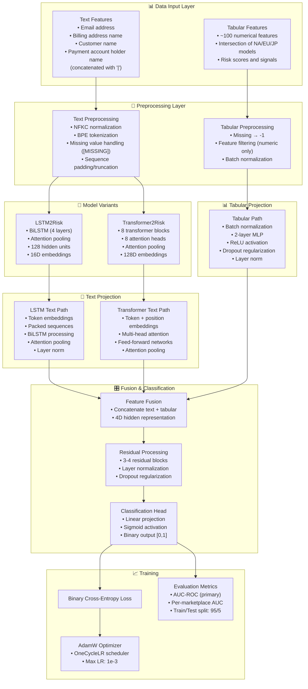

---
tags:
  - design
  - implementation
  - deep-learning
  - fraud-detection
  - multi-modal
  - attention-mechanism
keywords:
  - names3risk
  - fraud detection
  - lstm
  - transformer
  - multi-modal learning
  - text classification
  - binary classification
  - bpe tokenization
  - attention pooling
topics:
  - machine learning architecture
  - fraud detection systems
  - multi-modal neural networks
  - text and tabular fusion
  - first-time buyer risk assessment
language: python
date of note: 2025-12-31
---

# Names3Risk Model Design

## Overview

Names3Risk is a specialized multi-modal deep learning system designed for fraud detection in first-time buyer transactions. The model combines textual information from customer names, addresses, and payment details with numerical risk indicators to predict fraud probability. It addresses the critical challenge of assessing risk for customers with no historical transaction data, where traditional behavior-based fraud detection models cannot be applied.

## Related Documents
- **[Data Collection Script](../../projects/names3risk_legacy/fetch_data.py)** - MDS/Andes data fetching via Secure AI Sandbox
- **[Training Framework](../../projects/names3risk_legacy/train.py)** - Main training loop with metrics tracking
- **[LSTM Model](../../projects/names3risk_legacy/lstm2risk.py)** - LSTM-based architecture implementation
- **[Transformer Model](../../projects/names3risk_legacy/transformer2risk.py)** - Transformer-based architecture implementation
- **[Tokenizer](../../projects/names3risk_legacy/tokenizer.py)** - Custom BPE tokenizer with compression tuning
- **[Dataset](../../projects/names3risk_legacy/dataset.py)** - PyTorch dataset implementations

## Core Principles

### Multi-Modal Learning
- **Text Processing**: Learns semantic patterns from concatenated name/address strings
- **Tabular Integration**: Incorporates engineered numerical features from fraud detection systems
- **Late Fusion**: Combines text and tabular representations at the decision layer

### Attention-Based Representations
- **Sequence Modeling**: Captures character-level and subword patterns in names
- **Attention Pooling**: Learns which parts of text are most relevant for fraud detection
- **Contextual Understanding**: Models relationships between different name components

### Fraud-Specific Design
- **First-Time Buyer Focus**: Specialized for transactions with no historical data
- **Name Pattern Recognition**: Detects suspicious naming patterns (fake names, test patterns, etc.)
- **Multi-Region Support**: Trained across NA, EU, and FE marketplaces

## Architecture Overview



## Model Variants

### LSTM2Risk (Default Architecture)

The LSTM2Risk model uses bidirectional LSTM layers with attention pooling for text processing.

#### Architecture Details

**Text Projection:**
```python
class TextProjection:
    - Token embedding: vocab_size → 16D
    - BiLSTM: 16D → 128D (4 layers, bidirectional)
    - Attention pooling: 256D (bidirectional) → weighted average
    - Layer normalization: 256D → 256D
    - Output: 256D representation
```

**Tabular Projection:**
```python
class TabularProjection:
    - Batch normalization: n_features
    - Linear: n_features → 256D
    - ReLU + Dropout(0.2)
    - Linear: 256D → 256D
    - Layer normalization + ReLU + Dropout(0.2)
    - Output: 256D representation
```

**Fusion Network:**
```python
class FusionNetwork:
    - Concatenate: [text(256D), tabular(256D)] → 512D
    - ResidualBlock1: 512D → 512D
    - ReLU + Dropout(0.2)
    - ResidualBlock2: 512D → 512D
    - ReLU + Dropout(0.2)
    - ResidualBlock3: 512D → 512D
    - ReLU + Dropout(0.2)
    - Linear: 512D → 128D
    - ReLU + Dropout(0.2)
    - Linear: 128D → 1
    - Sigmoid → [0,1]
```

#### Key Features
- **Packed Sequences**: Efficient handling of variable-length inputs
- **Attention Pooling**: Learns importance weights for different parts of text
- **Residual Connections**: Improves gradient flow and training stability
- **Compact Embeddings**: 16D embeddings reduce overfitting on limited data

#### Advantages
- Lower memory footprint compared to Transformer
- Efficient for shorter sequences
- Better suited for character-level patterns
- Faster training convergence

### Transformer2Risk (Alternative Architecture)

The Transformer2Risk model uses multi-head self-attention for text processing.

#### Architecture Details

**Text Projection:**
```python
class TextProjection:
    - Token embedding: vocab_size → 128D
    - Position embedding: 100 positions → 128D
    - 8 Transformer blocks:
        * Multi-head attention (8 heads, 16D each)
        * Feed-forward network (128D → 512D → 128D)
        * Layer normalization (pre-norm)
        * Dropout(0.2)
    - Attention pooling: 128D → weighted average
    - Linear projection: 128D → 256D
    - Output: 256D representation
```

**Tabular Projection:**
```python
class TabularProjection:
    - Batch normalization: n_features
    - Linear: n_features → 256D
    - ReLU + Dropout(0.2)
    - Linear: 256D → 256D
    - Layer normalization + ReLU + Dropout(0.2)
    - Output: 256D representation
```

**Fusion Network:**
```python
class FusionNetwork:
    - Concatenate: [text(256D), tabular(256D)] → 512D
    - ResidualBlock1: 512D → 512D
    - ReLU + Dropout(0.2)
    - ResidualBlock2: 512D → 512D
    - ReLU + Dropout(0.2)
    - ResidualBlock3: 512D → 512D
    - ReLU + Dropout(0.2)
    - ResidualBlock4: 512D → 512D
    - ReLU + Dropout(0.2)
    - Linear: 512D → 1
    - Sigmoid → [0,1]
```

#### Key Features
- **Self-Attention**: Captures long-range dependencies in text
- **Positional Encoding**: Preserves sequence order information
- **Multi-Head Attention**: Learns multiple representation subspaces
- **Larger Capacity**: More parameters for complex pattern learning

#### Advantages
- Better parallelization during training
- Captures global context more effectively
- Attention weights provide interpretability
- Scalable to longer sequences

## Data Collection Pipeline

### Data Sources

**MDS (Multi-Domain Security)**
- Fortress fraud detection service
- Provides real-time risk signals and historical patterns
- Covers NA (org_id=1), EU (org_id=2), FE (org_id=9) regions

**Andes (Customer Data Warehouse)**
- D_CUSTOMERS table via Booker provider
- Customer status information (N=Normal, F=Fraud, I=Investigation)
- Historical transaction metadata

### Data Fetching Process

**Secure AI Sandbox Integration:**
```python
class SAISEDXLoadJob:
    - Region-specific queries (NA, EU, FE)
    - Date range filtering
    - SQL-based feature extraction
    - Parquet output format
    - S3-based storage
```

**SQL Query Logic:**
```sql
WITH features AS (
    SELECT
        RAW_MDS.*,
        D_CUSTOMERS.status AS status,
        ROW_NUMBER() OVER (PARTITION BY RAW_MDS.objectId 
                          ORDER BY RAW_MDS.transactionDate) AS dedup
    FROM RAW_MDS
    INNER JOIN D_CUSTOMERS ON RAW_MDS.customerId = D_CUSTOMERS.customer_id
    WHERE ABS(daysSinceFirstCompletedOrder) < 1e-12  -- First-time buyers only
)
SELECT * FROM features
WHERE dedup = 1  -- Keep only first transaction per customer
    AND ((status = 'N' AND RAND() < 0.5) OR status IN ('F', 'I'))  -- 50% negative downsampling
```

### Feature Engineering

**Required Features:**
- `objectId`: Transaction identifier
- `customerId`: Customer identifier
- `transactionDate`: Transaction timestamp
- `orderDate`: Order placement timestamp
- `marketplaceCountryCode`: Geographic region
- `daysSinceFirstCompletedOrder`: Must be 0 (first-time buyers)
- `status`: Label (N/F/I)

**Text Features (concatenated with "|"):**
- `emailAddress`: Customer email
- `billingAddressName`: Billing name
- `customerName`: Account name
- `paymentAccountHolderName`: Payment method name

**Tabular Features (~100 features):**
- Intersection of DigitalModelNA.txt, DigitalModelEU.txt, DigitalModelJP.txt
- Numerical features only (filtered during training)
- Examples: `orderTotalAmountUSD`, `creditCardNegtableHit`, `ipAddressNegtableHit`

### Data Preprocessing

**Text Preprocessing:**
1. **Missing Value Handling**: Replace null → "[MISSING]"
2. **Concatenation**: Join with "|" separator
3. **Normalization**: NFKC Unicode normalization
4. **Filtering**: Remove Amazon employee emails (contains "amazon.")

**Label Processing:**
```python
label = pl.when(pl.col("status").is_in(["F", "I"])).then(1)  # Fraud/Investigation
       .when(pl.col("status") == "N").then(0)                # Normal
       .otherwise(-1)                                        # Invalid (filtered)
```

**Deduplication:**
- Sort by `orderDate`
- Keep first order per `customerId` globally
- Ensures no customer appears multiple times

**Train/Test Split:**
- Temporal split: Sort by `transactionDate`
- 95% train, 5% test
- No shuffling (maintains temporal order)

## Tokenization System

### BPE Tokenizer with Compression Tuning

**OrderTextTokenizer Features:**
- Byte Pair Encoding (BPE) algorithm
- Automatic vocabulary size tuning
- Target compression ratio: 2.5x (characters to tokens)
- Binary search optimization for vocab size

**Special Tokens:**
```python
special_tokens = [
    "[CLS]",      # Classification token
    "[PAD]",      # Padding token
    "[UNK]",      # Unknown token
    "[BOS]",      # Begin of sequence
    "[EOS]",      # End of sequence
    "[MISSING]",  # Missing value indicator
    "|"           # Field separator
]
```

**Training Process:**
```python
def train(texts, target_compression=2.5, max_vocab_size=50000):
    # Split data: 80% training, 20% validation
    # Binary search on vocab_size (1000 to 50000)
    # Optimize for compression ratio ≈ target_compression
    # Stop when within 0.5% of target
    # Min frequency threshold: 25 occurrences
```

**Compression Calculation:**
```python
compression_rate = total_characters / total_tokens
# Target: 2.5 (each token represents ~2.5 characters on average)
```

### Tokenization Pipeline

**Encoding Process:**
1. NFKC normalization (canonical decomposition)
2. Whitespace pre-tokenization
3. BPE subword segmentation
4. Add [CLS] token (via TextProjection)
5. Pad to fixed length (LSTM) or block_size (Transformer)

**Vocabulary Management:**
- Typical vocab size: ~4000 tokens (tuned automatically)
- Minimum frequency: 25 occurrences
- Coverage: Optimized for name patterns across regions

## Training Framework

### Training Configuration

**Hyperparameters:**
```python
BATCH_SIZE = 512
EPOCHS = 10
DEVICE = "cuda" if available else "cpu"

# Model Configuration (LSTM2Risk)
config = LSTMConfig(
    embedding_size=16,
    dropout_rate=0.2,
    hidden_size=128,
    n_tab_features=100,  # Dynamic based on data
    n_embed=4000,        # From tokenizer
    n_lstm_layers=4
)

# Optimizer
optimizer = AdamW(model.parameters())
scheduler = OneCycleLR(
    optimizer,
    max_lr=1e-3,
    total_steps=EPOCHS * len(training_dataloader),
    pct_start=0.1  # 10% warmup
)
```

### Training Loop

**Forward Pass:**
```python
def train_loop(model, dataloader, loss_fn, optimizer, scheduler):
    model.train()
    for batch in dataloader:
        # Move to device
        batch = {k: v.to(DEVICE) for k, v in batch.items()}
        
        # Forward pass
        pred = model(batch)  # Returns [batch_size, 1]
        
        # Compute loss
        loss = loss_fn(pred, batch["label"])
        
        # Backward pass
        loss.backward()
        optimizer.step()
        optimizer.zero_grad()
        scheduler.step()
        
        # Track metrics
        auc.update(pred.view(-1), batch["label"].view(-1))
```

**Loss Function:**
- Binary Cross-Entropy Loss (BCELoss)
- Applied to sigmoid output [0,1]
- No class weights (handled by 50% downsampling)

### Evaluation Metrics

**Primary Metric: AUC-ROC**
```python
from torcheval.metrics import BinaryAUROC

auc = BinaryAUROC()
auc.update(predictions, labels)
score = auc.compute()
```

**Tracked Metrics:**
- Training AUC: Overall model performance
- Test AUC: Generalization capability
- Per-Marketplace AUC: Regional performance
  - Computed separately for each `marketplaceCountryCode`
  - Helps identify region-specific issues

**Checkpoint Management:**
```python
torch.save(model.state_dict(), f"models/model_{epoch}.pt")
```

### Collate Functions

**LSTM Collate Function:**
```python
def collate_fn(batch):
    # Sort by length (descending) for packed sequences
    lengths = [len(item["text"]) for item in batch]
    sorted_indices = sorted(range(len(lengths)), 
                           key=lambda i: lengths[i], 
                           reverse=True)
    
    # Pad sequences
    texts_padded = pad_sequence(texts, padding_value=pad_token)
    
    return {
        "text": texts_padded,
        "text_length": sorted_lengths,
        "tabular": tabs_stacked,
        "label": labels_stacked
    }
```

**Transformer Collate Function:**
```python
def collate_fn(batch):
    # Truncate to block_size (100 tokens)
    texts = [item["text"][:block_size] for item in batch]
    
    # Pad sequences
    texts_padded = pad_sequence(texts, padding_value=pad_token)
    
    # Create attention mask
    attn_mask = texts_padded != pad_token
    
    return {
        "text": texts_padded,
        "tabular": tabs_stacked,
        "label": labels_stacked,
        "attn_mask": attn_mask
    }
```

## Input/Output Schema

### Input Schema

**Text Input:**
```python
# Format: "email|billing_name|customer_name|payment_holder_name"
text_example = "john.doe@example.com|John Doe|John A. Doe|John Doe"

# Tokenized format
tokens = tokenizer.encode(text_example)  # List[int]
# Shape: [seq_len] variable length

# Batched format
text_batch = torch.tensor([...])  # Shape: [batch_size, max_seq_len]
```

**Tabular Input:**
```python
# Numeric features only
tabular_example = np.array([
    0.5,    # Feature 1 (normalized)
    -1.0,   # Feature 2 (missing value)
    0.02,   # Feature 3
    # ... ~100 features total
])

# Batched format
tabular_batch = torch.tensor([...])  # Shape: [batch_size, n_features]
```

**Full Batch Schema:**
```python
batch = {
    "text": torch.tensor,        # [batch_size, seq_len], dtype=long
    "tabular": torch.tensor,     # [batch_size, n_features], dtype=float32
    "label": torch.tensor,       # [batch_size, 1], dtype=float32
    
    # LSTM-specific
    "text_length": torch.tensor, # [batch_size], dtype=long
    
    # Transformer-specific
    "attn_mask": torch.tensor,   # [batch_size, seq_len], dtype=bool
}
```

### Output Schema

**Model Output:**
```python
# Raw prediction
pred = model(batch)  # Shape: [batch_size, 1]
# Values: [0.0, 1.0] (sigmoid activated)

# Interpretation
risk_score = pred.item()
if risk_score > 0.5:
    decision = "High Risk (Flag for Review)"
else:
    decision = "Low Risk (Approve)"
```

**Ensemble Output (Training):**
```python
scores, ensemble = model(batch)

# scores: [batch_size, 1] - risk predictions
# ensemble: [batch_size, embedding_dim] - intermediate representations
#   - Can be used for similarity search
#   - Enables interpretability analysis
```

## Implementation Details

### Code Organization

```
projects/names3risk_legacy/
├── fetch_data.py           # Data collection via SAIS
├── train.py                # Main training script
├── tokenizer.py            # BPE tokenizer implementation
├── lstm2risk.py            # LSTM model architecture
├── transformer2risk.py     # Transformer model architecture
├── dataset.py              # PyTorch dataset classes
├── logger.py               # JSON metrics logging
├── digital_polars_utils.py # Data utilities
├── requirements.txt        # Python dependencies
└── features/               # Feature lists by region
    ├── DigitalModelNA.txt
    ├── DigitalModelEU.txt
    └── DigitalModelJP.txt
```

### Dependencies

**Core Libraries:**
```txt
polars>=0.20.0          # High-performance dataframes
torch>=2.0.0            # Deep learning framework
torcheval               # Evaluation metrics
tokenizers              # HuggingFace tokenizers
scikit-learn            # Train/test split
tqdm                    # Progress bars
```

**Amazon Internal:**
```txt
secure_ai_sandbox_python_lib  # SAIS integration
```

### Model Selection

**In train.py:**
```python
# Choose model architecture
config = lstm2risk.LSTMConfig(n_tab_features=len(tabular_features))
model = lstm2risk.LSTM2Risk(config).to(DEVICE)

# Alternative:
# config = transformer2risk.TransformerConfig(n_tab_features=len(tabular_features))
# model = transformer2risk.Transformer2Risk(config).to(DEVICE)
```

### Configuration Management

**Dynamic Configuration:**
- Vocab size: Auto-tuned by tokenizer
- Number of tabular features: Computed from feature intersection
- Sequence length: Adaptive based on data
- Batch size: Fixed at 512 for stability

**Regional Feature Sets:**
- Features loaded from text files
- Intersection ensures global compatibility
- Numeric features filtered at runtime

## Use Cases and Applications

### Primary Use Case: First-Time Buyer Fraud Detection

**Problem Statement:**
Traditional fraud detection models rely on transaction history and behavioral patterns. For first-time buyers, these signals don't exist, creating a vulnerability that fraudsters exploit.

**Names3Risk Solution:**
- Analyzes naming patterns across multiple fields
- Detects inconsistencies (e.g., mismatched names)
- Identifies synthetic/fake name patterns
- Leverages engineered risk features from MDS

**Example Scenarios:**

1. **Suspicious Name Patterns:**
   ```
   Email: test123@test.com
   Customer: Test User
   Billing: Testing Account
   → High risk score (likely test/fraud account)
   ```

2. **Name Mismatches:**
   ```
   Email: john.smith@gmail.com
   Customer: Mary Johnson
   Billing: Robert Williams
   Payment: David Brown
   → High risk score (inconsistent identities)
   ```

3. **Legitimate Customer:**
   ```
   Email: john.doe@company.com
   Customer: John Doe
   Billing: John M. Doe
   Payment: John Doe
   → Low risk score (consistent naming)
   ```

### Multi-Region Deployment

**Regional Coverage:**
- **North America (NA)**: org_id=1
- **Europe (EU)**: org_id=2
- **Far East (FE)**: org_id=9

**Regional Considerations:**
- Character sets: ASCII (NA), Latin extended (EU), Unicode (FE)
- Naming conventions: Western vs. Eastern name order
- Language patterns: English, German, French, Japanese, Chinese
- Tokenizer handles all via NFKC normalization

### Real-Time Scoring

**Inference Pipeline:**
1. Extract text and tabular features from transaction
2. Tokenize text with pre-trained tokenizer
3. Load model checkpoint
4. Compute risk score
5. Apply decision threshold (typically 0.5)
6. Return risk level and explanation

**Latency Requirements:**
- Target: <100ms per prediction
- Batch inference supported for efficiency
- GPU acceleration available

## Advantages

### Technical Advantages

**Multi-Modal Architecture:**
- Combines strengths of text and tabular models
- Text captures semantic patterns in names
- Tabular features provide engineered signals
- Late fusion allows flexible feature engineering

**Attention Mechanisms:**
- Learns which name components are most indicative
- Provides interpretability through attention weights
- Handles variable-length inputs naturally

**Robust Tokenization:**
- BPE handles rare names and typos
- Auto-tuning optimizes vocab size
- Compression target prevents over-segmentation
- Special tokens handle missing values

**Two Model Choices:**
- LSTM: Efficient for production, lower memory
- Transformer: Higher capacity, better for complex patterns
- Both achieve competitive performance

### Operational Advantages

**Data Efficiency:**
- Requires only first-time buyer data
- 50% negative downsampling reduces class imbalance
- No need for historical transaction sequences

**Regional Flexibility:**
- Single model serves multiple regions
- Feature intersection ensures compatibility
- Per-region evaluation identifies issues

**Production Ready:**
- PyTorch implementation for deployment
- Checkpoint management for model versioning
- Metrics logging for monitoring

## Limitations and Considerations

### Data Constraints

**First-Time Buyer Limitation:**
- Only applicable to customers with no order history
- Cannot leverage behavioral patterns
- Dependent on quality of name data

**Feature Coverage:**
- Requires ~100 numerical features from MDS
- Feature intersection may exclude region-specific signals
- Missing features handled as -1 (imputation)

**Label Quality:**
- Depends on Fortress fraud detection accuracy
- Investigation cases ('I') treated as fraud
- Potential false positives in training data

### Model Complexity

**Text Processing:**
- Tokenizer requires retraining for distribution shifts
- Sequence length limits (100 tokens for Transformer)
- Performance sensitive to text quality

**Tabular Features:**
- Black-box engineered features from MDS
- No visibility into feature computation
- Risk of concept drift in upstream models

**Training Requirements:**
- GPU recommended for reasonable training time
- ~10 epochs typical for convergence
- Requires substantial memory for batch size 512

### Interpretability Challenges

**Multi-Modal Fusion:**
- Difficult to attribute decisions to text vs. tabular
- Attention weights only explain text component
- Residual blocks reduce interpretability

**Name Pattern Complexity:**
- Model may learn spurious correlations
- Difficult to explain to non-technical stakeholders
- Need additional validation on edge cases

## Future Enhancements

### Model Architecture

**Advanced Architectures:**
- Pre-trained language models (BERT, RoBERTa)
- Cross-attention between text and tabular modalities
- Multi-task learning (fraud + investigation + normal)
- Ensemble methods combining LSTM and Transformer

**Feature Engineering:**
- Character-level features (special characters, numbers)
- Name similarity metrics between fields
- Domain-specific features (email domain reputation)
- Entity matching scores

### Training Improvements

**Data Augmentation:**
- Synthetic name generation for rare patterns
- Text perturbations (typos, abbreviations)
- Adversarial examples for robustness

**Advanced Techniques:**
- Focal loss for hard examples
- Contrastive learning for representation quality
- Meta-learning for fast adaptation to new regions
- Active learning for label efficiency

### Deployment Enhancements

**Inference Optimization:**
- Model quantization for faster inference
- ONNX export for platform independence
- TensorRT optimization for GPU
- Batch inference for throughput

**Monitoring and Maintenance:**
- Drift detection for tokenizer and features
- A/B testing framework for model updates
- Feedback loop from fraud investigation outcomes
- Automated retraining pipelines

### Explainability

**Interpretability Tools:**
- SHAP values for feature importance
- Attention visualization for text
- Example-based explanations (similar fraud cases)
- Counterfactual analysis (what-if scenarios)

## Performance Benchmarks

### Expected Performance

**AUC-ROC Targets:**
- Overall AUC: >0.75 (good discrimination)
- Per-marketplace AUC: >0.70 (regional consistency)
- Training AUC vs. Test AUC: <0.05 gap (low overfitting)

**Convergence:**
- Typical convergence: 5-10 epochs
- LSTM converges faster than Transformer
- Learning rate schedule critical for stability

### Model Comparison

| Metric | LSTM2Risk | Transformer2Risk |
|--------|-----------|------------------|
| Parameters | ~500K | ~1.5M |
| Training Time/Epoch | 5-10 min | 15-20 min |
| Memory (GPU) | 2-4 GB | 6-8 GB |
| Inference Latency | ~10ms | ~15ms |
| Expected AUC | 0.75-0.80 | 0.76-0.82 |

**Recommendation:**
- Start with LSTM2Risk for baseline
- Try Transformer2Risk if capacity is needed
- Ensemble both for production deployment

## References and Related Work

### Academic References
- **BPE Tokenization**: "Neural Machine Translation of Rare Words with Subword Units" (Sennrich et al., 2016)
- **Attention Mechanisms**: "Attention Is All You Need" (Vaswani et al., 2017)
- **LSTM**: "Long Short-Term Memory" (Hochreiter & Schmidhuber, 1997)
- **Multi-Modal Learning**: "Multimodal Machine Learning: A Survey and Taxonomy" (Baltrušaitis et al., 2019)

### Amazon Internal
- **MDS/Fortress**: Internal fraud detection platform
- **SAIS**: Secure AI Sandbox for data access
- **Digital Models**: Legacy fraud models for feature engineering

### Related Models
- **Temporal Self-Attention**: For sequence-based fraud detection
- **BERT for Fraud**: Pre-trained language models for text fraud detection
- **TabNet**: Attention-based tabular learning

## See Also

### Related Design Documents
- **[Temporal Self-Attention Model](./temporal_self_attention_model_design.md)** - Sequence-based fraud detection architecture
- **[Config-Driven Design](./config_driven_design.md)** - Configuration management patterns

### Implementation Files
- **[Fetch Data Script](../../projects/names3risk_legacy/fetch_data.py)** - Data collection implementation
- **[Training Script](../../projects/names3risk_legacy/train.py)** - Training loop and metrics
- **[LSTM Model](../../projects/names3risk_legacy/lstm2risk.py)** - BiLSTM with attention pooling architecture
- **[Transformer Model](../../projects/names3risk_legacy/transformer2risk.py)** - Multi-head self-attention architecture
- **[Tokenizer](../../projects/names3risk_legacy/tokenizer.py)** - Custom BPE tokenizer with compression tuning
- **[Dataset Classes](../../projects/names3risk_legacy/dataset.py)** - PyTorch dataset implementations
