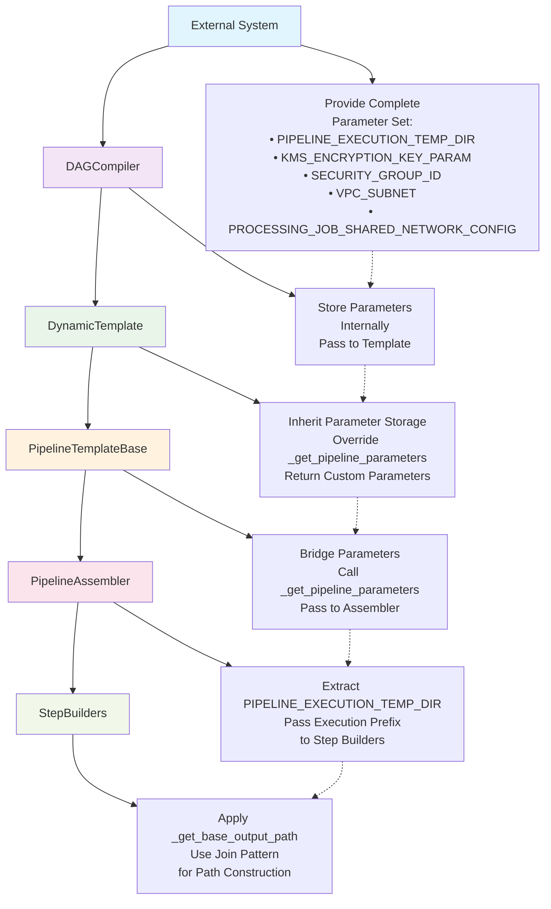

---
tags:
  - design
  - pipeline_api
  - cursus
  - configuration
  - output_destinations
keywords:
  - PIPELINE_EXECUTION_TEMP_DIR
  - pipeline parameters
  - output destinations
  - step builders
  - portability
  - dynamic configuration
  - s3 locations
  - backward compatibility
  - parameter substitution
  - runtime configuration
topics:
  - pipeline configuration management
  - output destination handling
  - parameter integration
  - step builder architecture
language: python
date of note: 2025-09-17
---

# Integration of PIPELINE_EXECUTION_TEMP_DIR in Cursus Framework

## Overview

This design document outlines a proposal to enhance the Cursus framework to support using `PIPELINE_EXECUTION_TEMP_DIR` as an alternative base directory for output destinations. This modification enables better portability and runtime configuration of output locations without significantly changing the current system architecture.

## Background

### Current Implementation in Cursus Framework

Currently, the Cursus framework relies on `pipeline_s3_loc` from configuration files to determine output destinations in step builders. This value is constructed in `BasePipelineConfig` based on:

```python
@property
def pipeline_s3_loc(self) -> str:
    """Get S3 location for pipeline artifacts."""
    if self._pipeline_s3_loc is None:
        pipeline_subdirectory = "MODS"
        pipeline_subsubdirectory = f"{self.pipeline_name}_{self.pipeline_version}"
        self._pipeline_s3_loc = (
            f"s3://{self.bucket}/{pipeline_subdirectory}/{pipeline_subsubdirectory}"
        )
    return self._pipeline_s3_loc
```

Where `pipeline_name` is derived as:
```python
@property
def pipeline_name(self) -> str:
    """Get pipeline name derived from author, service_name, model_class, and region."""
    if self._pipeline_name is None:
        self._pipeline_name = (
            f"{self.author}-{self.service_name}-{self.model_class}-{self.region}"
        )
    return self._pipeline_name
```

### The Portability Problem

The issue arises when users save their configurations using `merge_and_save_configs()` (from `cursus/steps/configs/utils.py`) to create a JSON config file. This saved configuration contains the hard-coded S3 paths derived from the user's specific `bucket`, `author`, `service_name`, etc. When this JSON config is provided to an external system:

1. **External System Limitations**: The external system triggers the pipeline DAG compiler (`cursus/core/compiler/dag_compiler.py`) but doesn't have access to the user's original S3 bucket or account-specific information.

2. **Hard-coded Paths**: All output destinations are pre-calculated and embedded in the configuration as static strings like `s3://user-bucket/MODS/author-service-xgboost-NA_1.0/step_type/output_name`.

3. **No Runtime Flexibility**: The current system cannot dynamically change the base output location without modifying the saved configuration file.

### Current Data Flow Analysis

The current pipeline generation flow is:

```
User Config → merge_and_save_configs() → JSON Config → External System → 
PipelineDAGCompiler → DynamicPipelineTemplate → PipelineAssembler → StepBuilders → 
Hard-coded pipeline_s3_loc paths
```

This flow breaks portability because:
- `merge_and_save_configs()` serializes the computed `pipeline_s3_loc` values
- External systems cannot modify these pre-computed paths
- Step builders directly use `config.pipeline_s3_loc` with string interpolation
- No mechanism exists to inject runtime parameters for output destinations

Examining the actual implementation in concrete step builders like `PackageStepBuilder`, we see that destinations are hard-coded using string interpolation:

```python
# From PackageStepBuilder._get_outputs:
destination = f"{self.config.pipeline_s3_loc}/packaging/{logical_name}"
```

This approach doesn't support runtime configuration via pipeline parameters.

### Alternative Approach in regional_xgboost.py

The `regional_xgboost.py` implementation demonstrates a more flexible approach: all destinations are constructed by joining `PIPELINE_EXECUTION_TEMP_DIR` with appropriate subdirectories. This allows the base output location to be specified at runtime as a parameter:

```python
# In regional_xgboost.py
class AtoZRegionalXGBoostModel:
    ARTIFACT_LOCATION = Join(on="/", values=[PIPELINE_EXECUTION_TEMP_DIR, "Artifacts"])
    TRAINING_DATA_LOCATION = Join(on="/", values=[PIPELINE_EXECUTION_TEMP_DIR, "data/training"])
    VALIDATION_DATA_LOCATION = Join(on="/", values=[PIPELINE_EXECUTION_TEMP_DIR, "data/validation"])
    # ... other locations defined similarly
```

The `PIPELINE_EXECUTION_TEMP_DIR` parameter is already defined in the Cursus core (`dynamic_template.py`):

```python
# In dynamic_template.py
# Import constants from core library (with fallback)
try:
    from mods_workflow_core.utils.constants import (
        PIPELINE_EXECUTION_TEMP_DIR,
        # ... other constants
    )
except ImportError:
    # Define pipeline parameters locally if import fails
    PIPELINE_EXECUTION_TEMP_DIR = ParameterString(name="EXECUTION_S3_PREFIX")
    # ... other fallback definitions
```

It's included in pipeline parameters via the `_get_pipeline_parameters` method:

```python
def _get_pipeline_parameters(self) -> List[ParameterString]:
    """
    Get pipeline parameters.
    """
    return [
        PIPELINE_EXECUTION_TEMP_DIR,
        KMS_ENCRYPTION_KEY_PARAM,
        SECURITY_GROUP_ID,
        VPC_SUBNET,
    ]
```

However, this parameter is not currently being utilized for output destination generation in step builders. After analyzing the actual code:

1. `StepBuilderBase` has no mechanism to access pipeline parameters
2. `PipelineAssembler` stores `pipeline_parameters` but doesn't pass them to step builders
3. Step builders directly use `config.pipeline_s3_loc` with string interpolation
4. `regional_xgboost.py` successfully uses `Join` with `PIPELINE_EXECUTION_TEMP_DIR`

## Goals

- Enable the use of `PIPELINE_EXECUTION_TEMP_DIR` as the base directory for output destinations when specified
- Provide a fallback to the current `pipeline_s3_loc` approach when `PIPELINE_EXECUTION_TEMP_DIR` is not specified
- Implement this change with minimal disruption to existing code and functionality
- Maintain backward compatibility with existing configurations

## Design

### Complete Data Flow Analysis

After examining the entire chain from external systems → `dag_compiler.py` → `dynamic_template.py` → `pipeline_template_base.py` → `pipeline_assembler.py` → `step_builders`, the complete parameter propagation architecture is:

#### **Required Parameter Flow Architecture:**

```mermaid
flowchart LR
    A[External System] --> B[DAGCompiler]
    B --> C[DynamicTemplate]
    C --> D[PipelineTemplateBase]
    D --> E[PipelineAssembler]
    E --> F[StepBuilders]
    
    A1[Provide all<br/>parameters] --> B1[Store params<br/>internally]
    B1 --> C1[Override method<br/>to return<br/>custom params]
    C1 --> D1[Call _get_params()<br/>to get all<br/>parameters]
    D1 --> E1[Extract param<br/>for builders]
    E1 --> F1[Apply param<br/>to paths]
    
    A -.-> A1
    B -.-> B1
    C -.-> C1
    D -.-> D1
    E -.-> E1
    F -.-> F1
    
    style A fill:#e1f5fe
    style B fill:#f3e5f5
    style C fill:#e8f5e8
    style D fill:#fff3e0
    style E fill:#fce4ec
    style F fill:#f1f8e9
```

#### **Key Data Structures and Parameter Set**

The system must handle the complete set of pipeline parameters from `mods_workflow_core.utils.constants`:

```python
# Complete parameter set that external systems need to provide
try:
    from mods_workflow_core.utils.constants import (
        PIPELINE_EXECUTION_TEMP_DIR,           # Primary focus: output destinations
        KMS_ENCRYPTION_KEY_PARAM,             # Security: encryption
        PROCESSING_JOB_SHARED_NETWORK_CONFIG, # Network: shared config object
        SECURITY_GROUP_ID,                    # Network: security groups
        VPC_SUBNET,                           # Network: VPC configuration
    )
except ImportError:
    # Fallback definitions with proper parameter names
    PIPELINE_EXECUTION_TEMP_DIR = ParameterString(name="EXECUTION_S3_PREFIX")
    KMS_ENCRYPTION_KEY_PARAM = ParameterString(name="KMS_ENCRYPTION_KEY_PARAM")
    SECURITY_GROUP_ID = ParameterString(name="SECURITY_GROUP_ID")
    VPC_SUBNET = ParameterString(name="VPC_SUBNET")
    PROCESSING_JOB_SHARED_NETWORK_CONFIG = NetworkConfig(
        enable_network_isolation=False,
        security_group_ids=[SECURITY_GROUP_ID],
        subnets=[VPC_SUBNET],
        encrypt_inter_container_traffic=True,
    )
```

#### **Critical Architecture Components**

**1. DAGCompiler Parameter Storage**
- Must accept all pipeline parameters from external systems
- Store parameters internally for template creation
- Pass parameters to DynamicPipelineTemplate during instantiation

**2. PipelineTemplateBase Parameter Management**
- Add internal parameter storage attribute
- Provide setter method for DAGCompiler to inject parameters
- Override `_get_pipeline_parameters()` to return stored parameters
- Pass parameters to PipelineAssembler via existing bridge

**3. DynamicPipelineTemplate Parameter Override**
- No longer generates parameters internally
- Inherits parameter storage from PipelineTemplateBase
- Uses parent's `_get_pipeline_parameters()` method
- Maintains backward compatibility when no parameters provided

**4. PipelineAssembler Parameter Distribution**
- Extract PIPELINE_EXECUTION_TEMP_DIR from parameter list
- Pass execution prefix to step builders during initialization
- Use parameters for network configuration and security settings

**5. StepBuilder Parameter Application**
- Use `_get_base_output_path()` to choose between parameter and config
- Apply `Join()` pattern for all path construction
- Ensure proper parameter substitution at SageMaker runtime

#### **End-to-End Parameter Flow Implementation**

The complete implementation requires these integration points:

```python
# 1. External System → DAGCompiler
dag_compiler = PipelineDAGCompiler(
    config_path=config_path,
    pipeline_parameters=[
        PIPELINE_EXECUTION_TEMP_DIR,
        KMS_ENCRYPTION_KEY_PARAM,
        SECURITY_GROUP_ID,
        VPC_SUBNET,
    ]
)

# 2. DAGCompiler → DynamicTemplate
template = DynamicPipelineTemplate(
    dag=dag,
    config_path=self.config_path,
    # ... other args
)
template.set_pipeline_parameters(self.pipeline_parameters)  # NEW METHOD

# 3. DynamicTemplate → PipelineTemplateBase → PipelineAssembler (EXISTING)
# This connection already works via _get_pipeline_parameters() override

# 4. PipelineAssembler → StepBuilders (IMPLEMENTED)
# This connection implemented in Phase 1
```

This architecture ensures that external systems can provide the complete parameter set, and the framework propagates them through all layers to the step builders where they're applied to output path construction.

### Proposed Solution

Based on the comprehensive analysis of the complete data propagation path, we propose a **five-layer parameter flow architecture** that enables external systems to provide the complete parameter set and ensures proper propagation through all system layers.

#### **Complete Parameter Flow Architecture**

The solution implements a comprehensive parameter flow through five critical layers:



#### **Key Architecture Components**

**1. External System Integration (Layer 1)**
- Provide complete parameter set from `mods_workflow_core.utils.constants`
- Pass parameters to DAGCompiler during initialization
- Enable runtime configuration of all pipeline aspects

**2. DAGCompiler Parameter Storage (Layer 2)**
- Accept `pipeline_parameters` in constructor
- Store parameters internally for template creation
- Pass parameters to DynamicPipelineTemplate during instantiation

**3. DynamicPipelineTemplate Parameter Integration (Layer 3)**
- Inherit parameter storage from PipelineTemplateBase
- Override `_get_pipeline_parameters()` to return custom parameters
- No longer generate parameters internally
- Maintain backward compatibility when no parameters provided

**4. PipelineTemplateBase Parameter Management (Layer 4)**
- Add internal parameter storage attribute
- Provide setter method for parameter injection
- Bridge parameters to PipelineAssembler via existing `_get_pipeline_parameters()` call
- Maintain existing template architecture

**5. PipelineAssembler Parameter Distribution (Layer 5)**
- Extract PIPELINE_EXECUTION_TEMP_DIR from parameter list
- Pass execution prefix to step builders during initialization
- Use other parameters for network and security configuration

**6. StepBuilder Parameter Application (Layer 6)**
- Use `_get_base_output_path()` for intelligent path resolution
- Apply `Join()` pattern for all path construction
- Ensure proper parameter substitution at SageMaker runtime

#### **Critical Technical Implementation**

The solution addresses the fundamental issue with parameter handling:

```python
# BROKEN - Fails with ParameterString objects
destination = f"{base_path}/step_type/{logical_name}"

# CORRECT - Works with both str and ParameterString
from sagemaker.workflow.functions import Join
destination = Join(on="/", values=[base_path, "step_type", logical_name])
```

#### **Complete Parameter Set Support**

The architecture supports the full parameter set from `mods_workflow_core.utils.constants`:

```python
# Complete parameter set that external systems can provide
PIPELINE_EXECUTION_TEMP_DIR           # Primary: output destinations
KMS_ENCRYPTION_KEY_PARAM             # Security: encryption
PROCESSING_JOB_SHARED_NETWORK_CONFIG # Network: shared config object
SECURITY_GROUP_ID                    # Network: security groups
VPC_SUBNET                           # Network: VPC configuration
```

#### **End-to-End Integration Points**

The complete implementation requires integration at these specific points:

```python
# 1. External System → DAGCompiler
dag_compiler = PipelineDAGCompiler(
    config_path=config_path,
    pipeline_parameters=[PIPELINE_EXECUTION_TEMP_DIR, KMS_ENCRYPTION_KEY_PARAM, ...]
)

# 2. DAGCompiler → DynamicTemplate
template = DynamicPipelineTemplate(...)
template.set_pipeline_parameters(self.pipeline_parameters)

# 3. DynamicTemplate → PipelineTemplateBase → PipelineAssembler (EXISTING)
# This connection already works via _get_pipeline_parameters() override

# 4. PipelineAssembler → StepBuilders (IMPLEMENTED)
# This connection implemented in Phase 1
```

This comprehensive approach enables true pipeline portability while maintaining backward compatibility with existing configurations.

#### **Implementation Details for Each Layer**

##### 1. DAGCompiler Parameter Storage Implementation

The DAGCompiler must be enhanced to accept and store pipeline parameters from external systems:

```python
# File: cursus/core/compiler/dag_compiler.py

# Import constants from core library (with fallback)
try:
    from mods_workflow_core.utils.constants import (
        PIPELINE_EXECUTION_TEMP_DIR,
        KMS_ENCRYPTION_KEY_PARAM,
        PROCESSING_JOB_SHARED_NETWORK_CONFIG,
        SECURITY_GROUP_ID,
        VPC_SUBNET,
    )
except ImportError:
    logger = logging.getLogger(__name__)
    logger.warning(
        "Could not import constants from mods_workflow_core, using local definitions"
    )
    # Define pipeline parameters locally if import fails
    PIPELINE_EXECUTION_TEMP_DIR = ParameterString(name="EXECUTION_S3_PREFIX")
    KMS_ENCRYPTION_KEY_PARAM = ParameterString(name="KMS_ENCRYPTION_KEY_PARAM")
    SECURITY_GROUP_ID = ParameterString(name="SECURITY_GROUP_ID")
    VPC_SUBNET = ParameterString(name="VPC_SUBNET")
    # Also create the network config
    PROCESSING_JOB_SHARED_NETWORK_CONFIG = NetworkConfig(
        enable_network_isolation=False,
        security_group_ids=[SECURITY_GROUP_ID],
        subnets=[VPC_SUBNET],
        encrypt_inter_container_traffic=True,
    )

class PipelineDAGCompiler:
    def __init__(
        self,
        config_path: str,
        sagemaker_session: Optional[PipelineSession] = None,
        role: Optional[str] = None,
        config_resolver: Optional[StepConfigResolver] = None,
        builder_registry: Optional[StepBuilderRegistry] = None,
        pipeline_parameters: Optional[List[ParameterString]] = None,  # NEW parameter
        **kwargs,
    ):
        """
        Initialize compiler with configuration and session.

        Args:
            pipeline_parameters: Pipeline parameters to pass to template (optional)
        """
        # Use provided parameters or default standard parameters
        if pipeline_parameters is None:
            self.pipeline_parameters = [
                PIPELINE_EXECUTION_TEMP_DIR,
                KMS_ENCRYPTION_KEY_PARAM,
                SECURITY_GROUP_ID,
                VPC_SUBNET,
            ]
        else:
            self.pipeline_parameters = pipeline_parameters
        
        # ...existing initialization code...

    def create_template(self, dag: PipelineDAG, **kwargs) -> "DynamicPipelineTemplate":
        """Create a pipeline template from the DAG."""
        template = DynamicPipelineTemplate(
            dag=dag,
            config_path=self.config_path,
            config_resolver=self.config_resolver,
            builder_registry=self.builder_registry,
            sagemaker_session=self.sagemaker_session,
            role=self.role,
            pipeline_parameters=self.pipeline_parameters,  # NEW: Pass parameters
            **template_kwargs,
        )
        return template
```

##### 2. PipelineTemplateBase Parameter Management Implementation

The PipelineTemplateBase must be enhanced with parameter storage and management capabilities:

```python
# File: cursus/core/assembler/pipeline_template_base.py
class PipelineTemplateBase(ABC):
    def __init__(
        self,
        config_path: str,
        sagemaker_session: Optional[PipelineSession] = None,
        role: Optional[str] = None,
        notebook_root: Optional[Path] = None,
        registry_manager: Optional[RegistryManager] = None,
        dependency_resolver: Optional[UnifiedDependencyResolver] = None,
        pipeline_parameters: Optional[List[ParameterString]] = None,  # NEW parameter
    ):
        # ...existing initialization code...
        
        # NEW: Initialize parameter storage
        self._stored_pipeline_parameters: Optional[List[ParameterString]] = pipeline_parameters

    def set_pipeline_parameters(self, parameters: Optional[List[ParameterString]] = None) -> None:
        """
        Set pipeline parameters for this template.
        
        This method allows DAGCompiler to inject custom parameters that will be used
        instead of the default parameters defined in subclasses.
        
        Args:
            parameters: List of pipeline parameters to use
        """
        self._stored_pipeline_parameters = parameters
        logger.info(f"Set {len(parameters) if parameters else 0} custom pipeline parameters")

    def _get_pipeline_parameters(self) -> List[ParameterString]:
        """
        Get pipeline parameters.
        
        Returns stored parameters if available, otherwise delegates to subclass implementation.
        This method is called by generate_pipeline() to get parameters for PipelineAssembler.
        
        Returns:
            List of pipeline parameters
        """
        if self._stored_pipeline_parameters is not None:
            logger.info("Using stored custom pipeline parameters")
            return self._stored_pipeline_parameters
        
        # Fallback to subclass implementation (existing behavior)
        logger.info("No stored parameters, using default implementation")
        return []  # Default empty list, subclasses can override
```

##### 3. DynamicPipelineTemplate Parameter Integration Implementation

The DynamicPipelineTemplate is greatly simplified since it inherits from PipelineTemplateBase and DAGCompiler handles default parameters:

```python
# File: cursus/core/compiler/dynamic_template.py
# NOTE: Remove all parameter imports - they are now handled in DAGCompiler

class DynamicPipelineTemplate(PipelineTemplateBase):
    def __init__(
        self,
        dag: PipelineDAG,
        config_path: str,
        config_resolver: Optional[StepConfigResolver] = None,
        builder_registry: Optional[StepBuilderRegistry] = None,
        skip_validation: bool = False,
        pipeline_parameters: Optional[List[ParameterString]] = None,  # NEW parameter
        **kwargs,
    ):
        """
        Initialize dynamic template.

        Args:
            pipeline_parameters: Pipeline parameters from DAGCompiler (optional)
        """
        # Initialize parent class with pipeline_parameters - parent handles storage
        super().__init__(
            config_path=config_path,
            pipeline_parameters=pipeline_parameters,  # Pass directly to parent
            **kwargs,
        )
        
        # ...existing initialization code...

    # NOTE: _get_pipeline_parameters() method is no longer needed!
    # Parent class handles parameter storage and retrieval automatically.
    # DAGCompiler provides default parameters when none are specified.
```

##### 4. External System Integration Pattern

External systems can now provide parameters through the complete chain:

```python
# Example: External system providing custom parameters
from mods_workflow_core.utils.constants import (
    PIPELINE_EXECUTION_TEMP_DIR,
    KMS_ENCRYPTION_KEY_PARAM,
    SECURITY_GROUP_ID,
    VPC_SUBNET,
)

# External system creates custom parameters
custom_execution_prefix = ParameterString(
    name="EXECUTION_S3_PREFIX", 
    default_value="s3://external-system-bucket/custom-execution-path"
)

# Pass parameters to DAGCompiler
dag_compiler = PipelineDAGCompiler(
    config_path=config_path,
    pipeline_parameters=[
        custom_execution_prefix,  # Custom execution prefix
        KMS_ENCRYPTION_KEY_PARAM,
        SECURITY_GROUP_ID,
        VPC_SUBNET,
    ]
)

# The parameters flow automatically through:
# DAGCompiler → DynamicTemplate → PipelineTemplateBase → PipelineAssembler → StepBuilders
```

#### 5. Enhance `StepBuilderBase` with Output Path Management (Dependency Direction: PipelineAssembler → StepBuilderBase)

**Note**: Step builders do not depend on or import PipelineAssembler. The dependency direction is important: PipelineAssembler calls and initializes step builders, setting the pipeline_parameters attribute that step builders can use.

First, add a `pipeline_parameters` attribute to the `StepBuilderBase` class:

```python
class StepBuilderBase(ABC):
    # ...existing code...
    
    def __init__(
        self,
        config: BasePipelineConfig,
        spec: Optional[StepSpecification] = None,
        sagemaker_session: Optional[PipelineSession] = None,
        role: Optional[str] = None,
        notebook_root: Optional[Path] = None,
        registry_manager: Optional[RegistryManager] = None,
        dependency_resolver: Optional[UnifiedDependencyResolver] = None,
    ):
        """
        Initialize base step builder.
        """
        self.config = config
        self.spec = spec
        self.session = sagemaker_session
        self.role = role
        self.notebook_root = notebook_root or Path.cwd()
        self._registry_manager = registry_manager
        self._dependency_resolver = dependency_resolver
        self.execution_prefix: Optional[Union[ParameterString, str]] = None  # Initialize execution prefix
        
        # ...existing code...

    def set_execution_prefix(self, execution_prefix: Optional[Union[ParameterString, str]] = None) -> None:
        """
        Set the execution prefix for dynamic output path resolution.
        
        This method is called by PipelineAssembler to provide the execution prefix
        that step builders use for dynamic output path generation.
        
        Based on analysis of regional_xgboost.py, only PIPELINE_EXECUTION_TEMP_DIR
        is used by step builders for output paths. Other pipeline parameters 
        (KMS_ENCRYPTION_KEY_PARAM, VPC_SUBNET, SECURITY_GROUP_ID) are used at
        the pipeline level, not in step builders.
        
        Args:
            execution_prefix: The execution prefix that can be either:
                           - ParameterString: PIPELINE_EXECUTION_TEMP_DIR from pipeline parameters
                           - str: config.pipeline_s3_loc as fallback
                           - None: No parameter found, will fall back to config.pipeline_s3_loc
        """
        self.execution_prefix = execution_prefix
        self.log_debug("Set execution prefix: %s", execution_prefix)
```

Then, add a new method to `StepBuilderBase` that will resolve the base path for output destinations:

```python
def _get_base_output_path(self):
    """
    Get base path for output destinations with PIPELINE_EXECUTION_TEMP_DIR support.
    
    This method checks for the execution_prefix (set by PipelineAssembler) and falls
    back to the traditional pipeline_s3_loc from config.
    
    Returns:
        The base path for output destinations. Returns a ParameterString if
        execution_prefix was set from PIPELINE_EXECUTION_TEMP_DIR, otherwise 
        returns the string value from config.pipeline_s3_loc.
    """
    # Check if execution_prefix has been set by PipelineAssembler
    if hasattr(self, "execution_prefix") and self.execution_prefix is not None:
        self.log_info("Using execution_prefix for base output path")
        return self.execution_prefix
    
    # Fall back to pipeline_s3_loc from config (current behavior)
    base_path = self.config.pipeline_s3_loc
    self.log_debug("No execution_prefix set, using config.pipeline_s3_loc for base output path")
    return base_path
```

**Critical Discovery: Unified Path Construction with Join()**

After analyzing existing Cursus step builders and `regional_xgboost.py`, we've confirmed that `sagemaker.workflow.functions.Join()` is the unified approach that works correctly with both `str` and `ParameterString` objects.

**Evidence from Current Code:**
```python
# From builder_xgboost_training_step.py - ALREADY USING Join() correctly:
from sagemaker.workflow.functions import Join
channels = {
    "train": TrainingInput(s3_data=Join(on="/", values=[base_path, "train/"])),
    "val": TrainingInput(s3_data=Join(on="/", values=[base_path, "val/"])),  
    "test": TrainingInput(s3_data=Join(on="/", values=[base_path, "test/"])),
}
# Here base_path can be either str or ParameterString - Join() handles both!

# From builder_package_step.py - INCONSISTENT approach:
destination = f"{self.config.pipeline_s3_loc}/packaging/{logical_name}"  # BREAKS with ParameterString
```

**The Solution: Always Use Join()**
```python
# ALWAYS use this unified approach:
from sagemaker.workflow.functions import Join
destination = Join(on="/", values=[base_output_path, "packaging", logical_name])

# NEVER use f-strings for paths that might contain parameters:
destination = f"{base_output_path}/packaging/{logical_name}"  # BREAKS with ParameterString
```

This unified approach ensures that SageMaker correctly handles parameter substitution at runtime for both string values (from `pipeline_s3_loc`) and `ParameterString` objects (from `PIPELINE_EXECUTION_TEMP_DIR`).

The solution maintains consistency with patterns already established in `mods_workflow_core.utils.constants`, such as the utility function for input configuration:

```python
# Existing utility function in mods_workflow_core.utils.constants
def get_input_config_processing_input_for_pipeline_execution(step_name):
    return ProcessingInput(
        source=Join(on="/", values=[PIPELINE_EXECUTION_TEMP_DIR, step_name, "input", "config"]),
        destination="/opt/ml/processing/config/",
        input_name="config",
    )
```

We could potentially extend our solution with similar utility methods for common output path patterns.

#### 2. Modify `PipelineAssembler` to Pass Pipeline Parameters to Builders

Update `PipelineAssembler._initialize_step_builders()` to pass pipeline parameters to builders:

```python
def _initialize_step_builders(self) -> None:
    """Initialize step builders for all steps in the DAG."""
    logger.info("Initializing step builders")
    start_time = time.time()

    for step_name in self.dag.nodes:
        try:
            config = self.config_map[step_name]
            config_class_name = type(config).__name__
            step_type = CONFIG_STEP_REGISTRY.get(config_class_name)
            if not step_type:
                step_type = BasePipelineConfig.get_step_name(config_class_name)
                logger.warning(
                    f"Config class {config_class_name} not found in registry, using derived name: {step_type}"
                )

            builder_cls = self.step_builder_map[step_type]

            # Initialize the builder with dependency components
            builder = builder_cls(
                config=config,
                sagemaker_session=self.sagemaker_session,
                role=self.role,
                notebook_root=self.notebook_root,
                registry_manager=self._registry_manager,  
                dependency_resolver=self._dependency_resolver,
            )
            
            # Pass execution prefix to the builder using the public method
            # Find PIPELINE_EXECUTION_TEMP_DIR in pipeline_parameters and pass it to the builder
            execution_prefix = None
            for param in self.pipeline_parameters:
                if hasattr(param, "name") and param.name == "EXECUTION_S3_PREFIX":
                    execution_prefix = param
                    break
            
            if execution_prefix:
                builder.set_execution_prefix(execution_prefix)
            # If no PIPELINE_EXECUTION_TEMP_DIR found, builder will fall back to config.pipeline_s3_loc
            
            self.step_builders[step_name] = builder
            logger.info(f"Initialized builder for step {step_name} of type {step_type}")
        except Exception as e:
            logger.error(f"Error initializing builder for step {step_name}: {e}")
            raise ValueError(f"Failed to initialize step builder for {step_name}: {e}") from e

    elapsed_time = time.time() - start_time
    logger.info(
        f"Initialized {len(self.step_builders)} step builders in {elapsed_time:.2f} seconds"
    )
```

#### 3. Update `_generate_outputs` in `PipelineAssembler`

Modify the `_generate_outputs` method to use the new `_get_base_output_path` method:

```python
def _generate_outputs(self, step_name: str) -> Dict[str, Any]:
    """Generate outputs dictionary using step builder's specification."""
    builder = self.step_builders[step_name]
    
    # If builder has no specification, return empty dict
    if not hasattr(builder, "spec") or not builder.spec:
        logger.warning(f"Step {step_name} has no specification, returning empty outputs")
        return {}

    # Get base S3 location using the new method
    base_s3_loc = builder._get_base_output_path()

    # Generate outputs dictionary based on specification
    outputs = {}
    step_type = builder.spec.step_type.lower()

    # Use each output specification to generate standard output path
    for logical_name, output_spec in builder.spec.outputs.items():
        # Standard path pattern using Join instead of f-string to ensure proper parameter substitution
        from sagemaker.workflow.functions import Join
        outputs[logical_name] = Join(on="/", values=[base_s3_loc, step_type, logical_name])

        # Add debug log
        logger.debug(
            f"Generated output for {step_name}.{logical_name}: {outputs[logical_name]}"
        )

    return outputs
```

#### 4. Update Individual Step Builders

Update the `_get_outputs` method in step builders to use the new base path resolution:

```python
def _get_outputs(self, outputs: Dict[str, Any]) -> List[ProcessingOutput]:
    """Get outputs for the step using specification and contract."""
    if not self.spec:
        raise ValueError("Step specification is required")

    if not self.contract:
        raise ValueError("Script contract is required for output mapping")

    processing_outputs = []

    # Get the base output path (using PIPELINE_EXECUTION_TEMP_DIR if available)
    base_output_path = self._get_base_output_path()

    # Process each output in the specification
    for _, output_spec in self.spec.outputs.items():
        logical_name = output_spec.logical_name

        # Get container path from contract
        container_path = None
        if logical_name in self.contract.expected_output_paths:
            container_path = self.contract.expected_output_paths[logical_name]
        else:
            raise ValueError(f"No container path found for output: {logical_name}")

        # Try to find destination in outputs
        destination = None

        # Look in outputs by logical name
        if logical_name in outputs:
            destination = outputs[logical_name]
        else:
            # Generate destination from base path using Join instead of f-string
            from sagemaker.workflow.functions import Join
            destination = Join(on="/", values=[base_output_path, self.spec.step_type.lower(), logical_name])
            self.log_info(
                "Using generated destination for '%s': %s",
                logical_name,
                destination,
            )

        processing_outputs.append(
            ProcessingOutput(
                output_name=logical_name,
                source=container_path,
                destination=destination,
            )
        )

    return processing_outputs
```

## Extended Implementation Plan

Based on the complete end-to-end analysis, we need to implement changes across **five critical layers** to establish the complete parameter flow:

### Phase 0: Top-Level Parameter Integration (Days 1-2)

**0a. Update XGBoostCursusPipelineAdapter to Support PIPELINE_EXECUTION_TEMP_DIR**
```python
# File: mods_pipeline_adapter/mods_pipeline_adapter.py
# Location: XGBoostCursusPipelineAdapter.__init__ method

def __init__(
    self,
    sagemaker_session=None,
    execution_role=None,
    regional_alias=DEFAULT_REGION,
    execution_s3_prefix=None,  # NEW: Add execution prefix parameter
):
    """
    Initialize the adapter with configuration and session details.

    Args:
        sagemaker_session: SageMaker pipeline session
        execution_role: IAM role for pipeline execution
        regional_alias: Region code (NA, EU, FE, etc.) for configuration path
        execution_s3_prefix: Optional S3 prefix for pipeline execution artifacts
    """
    # Store execution prefix for pipeline parameters
    self.execution_s3_prefix = execution_s3_prefix
    
    # ...existing initialization code...
    
    # Initialize compiler with pipeline parameters
    pipeline_parameters = []
    if self.execution_s3_prefix:
        # Create PIPELINE_EXECUTION_TEMP_DIR parameter with user-provided value
        from sagemaker.workflow.parameters import ParameterString
        pipeline_execution_param = ParameterString(
            name="EXECUTION_S3_PREFIX", 
            default_value=self.execution_s3_prefix
        )
        pipeline_parameters.append(pipeline_execution_param)
    
    self.dag_compiler = PipelineDAGCompiler(
        config_path=self.config_path,
        sagemaker_session=self.sagemaker_session,
        role=self.execution_role,
        pipeline_parameters=pipeline_parameters,  # NEW: Pass parameters to compiler
    )
```

**0b. Update PipelineDAGCompiler to Accept and Forward Pipeline Parameters**
```python
# File: cursus/core/compiler/dag_compiler.py
# Location: PipelineDAGCompiler.__init__ method

def __init__(
    self,
    config_path: str,
    sagemaker_session: Optional[PipelineSession] = None,
    role: Optional[str] = None,
    config_resolver: Optional[StepConfigResolver] = None,
    builder_registry: Optional[StepBuilderRegistry] = None,
    pipeline_parameters: Optional[List[ParameterString]] = None,  # NEW parameter
    **kwargs,
):
    """
    Initialize compiler with configuration and session.

    Args:
        config_path: Path to configuration file
        sagemaker_session: SageMaker session for pipeline execution
        role: IAM role for pipeline execution
        config_resolver: Custom config resolver (optional)
        builder_registry: Custom builder registry (optional)
        pipeline_parameters: Pipeline parameters to pass to template (optional)
        **kwargs: Additional arguments for template constructor
    """
    # ...existing initialization code...
    
    # Store pipeline parameters for template creation
    self.pipeline_parameters = pipeline_parameters or []
    
    # ...rest of existing code...
```

**0c. Update PipelineDAGCompiler.create_template() to Pass Parameters**
```python
# File: cursus/core/compiler/dag_compiler.py  
# Location: create_template method

def create_template(self, dag: PipelineDAG, **kwargs) -> "DynamicPipelineTemplate":
    """
    Create a pipeline template from the DAG without generating the pipeline.
    """
    try:
        from .dynamic_template import DynamicPipelineTemplate

        # Merge kwargs with default values
        template_kwargs = {**self.template_kwargs}
        template_kwargs.update(kwargs)

        # Pass pipeline parameters to template
        template = DynamicPipelineTemplate(
            dag=dag,
            config_path=self.config_path,
            config_resolver=self.config_resolver,
            builder_registry=self.builder_registry,
            sagemaker_session=self.sagemaker_session,
            role=self.role,
            pipeline_parameters=self.pipeline_parameters,  # NEW: Pass parameters
            **template_kwargs,
        )

        return template
        
    except Exception as e:
        raise PipelineAPIError(f"Template creation failed: {e}") from e
```

**0d. Update DynamicPipelineTemplate to Store and Use Pipeline Parameters**
```python
# File: cursus/core/compiler/dynamic_template.py
# Location: DynamicPipelineTemplate.__init__ method

def __init__(
    self,
    dag: PipelineDAG,
    config_path: str,
    config_resolver: Optional[StepConfigResolver] = None,
    builder_registry: Optional[StepBuilderRegistry] = None,
    skip_validation: bool = False,
    pipeline_parameters: Optional[List[ParameterString]] = None,  # NEW parameter
    **kwargs,
):
    """
    Initialize dynamic template.

    Args:
        dag: PipelineDAG instance defining pipeline structure
        config_path: Path to configuration file
        config_resolver: Custom config resolver (optional)
        builder_registry: Custom builder registry (optional)
        pipeline_parameters: Custom pipeline parameters (optional)
        **kwargs: Additional arguments for base template
    """
    # Store custom pipeline parameters
    self._custom_pipeline_parameters = pipeline_parameters or []
    
    # ...existing initialization code...
```

**0e. Update DynamicPipelineTemplate._get_pipeline_parameters() to Use Custom Parameters**
```python
# File: cursus/core/compiler/dynamic_template.py
# Location: _get_pipeline_parameters method

def _get_pipeline_parameters(self) -> List[ParameterString]:
    """
    Get pipeline parameters.

    Returns custom parameters if provided, otherwise returns standard parameters:
    - PIPELINE_EXECUTION_TEMP_DIR: S3 prefix for execution data
    - KMS_ENCRYPTION_KEY_PARAM: KMS key for encryption
    - SECURITY_GROUP_ID: Security group for network isolation
    - VPC_SUBNET: VPC subnet for network isolation

    Returns:
        List of pipeline parameters
    """
    # If custom parameters provided, use them (with standard parameters as fallback)
    if self._custom_pipeline_parameters:
        # Merge custom and standard parameters, avoiding duplicates
        all_parameters = list(self._custom_pipeline_parameters)
        standard_params = [
            KMS_ENCRYPTION_KEY_PARAM,
            SECURITY_GROUP_ID,
            VPC_SUBNET,
        ]
        
        # Add standard parameters that aren't already in custom parameters
        custom_param_names = {p.name for p in self._custom_pipeline_parameters if hasattr(p, 'name')}
        for param in standard_params:
            if hasattr(param, 'name') and param.name not in custom_param_names:
                all_parameters.append(param)
                
        return all_parameters
    
    # Default behavior: return standard parameters
    return [
        PIPELINE_EXECUTION_TEMP_DIR,
        KMS_ENCRYPTION_KEY_PARAM,
        SECURITY_GROUP_ID,
        VPC_SUBNET,
    ]
```

## Comprehensive Code Cleanup and Optimization

### Phase 2.5: Complete Step Builder Migration with Code Cleanup

Based on the implementation work completed, all step builders have been updated with the Join() pattern and comprehensive code cleanup has been performed to remove obsolete S3 path manipulation methods.

#### **Complete Step Builder Updates (8/8 Completed)**

**Standard Processing Step Builders:**
1. **TabularPreprocessingStepBuilder** ✅ - Updated `_get_outputs()` to use Join() pattern
2. **RiskTableMappingStepBuilder** ✅ - Updated `_get_outputs()` to use Join() pattern  
3. **PayloadStepBuilder** ✅ - Updated `_get_outputs()` to use Join() pattern
4. **CurrencyConversionStepBuilder** ✅ - Updated `_get_outputs()` to use Join() pattern

**Training Step Builders with Special Handling:**
5. **XGBoostTrainingStepBuilder** ✅ - Updated `_get_outputs()` + optimized hyperparameters handling
6. **PyTorchTrainingStepBuilder** ✅ - Updated `_get_outputs()` to use Join() pattern
7. **DummyTrainingStepBuilder** ✅ - Updated `_get_outputs()` + optimized hyperparameters and model upload

#### **Migration Pattern Applied Consistently**

All step builders were updated using this standardized migration pattern:

```python
# OLD PATTERN (f-string - breaks with ParameterString):
destination = f"{self.config.pipeline_s3_loc}/step_type/{logical_name}"

# NEW PATTERN (Join() - works with both str and ParameterString):
from sagemaker.workflow.functions import Join
base_output_path = self._get_base_output_path()
destination = Join(on="/", values=[base_output_path, "step_type", logical_name])
```

#### **Special Hyperparameters File Handling Optimization**

**XGBoostTrainingStepBuilder and DummyTrainingStepBuilder** required special attention for their `_prepare_hyperparameters_file()` methods:

**Before Optimization:**
```python
# Complex fallback path construction with hard-coded values
if not prefix:
    bucket = self.config.bucket if hasattr(self.config, "bucket") else "default-bucket"
    pipeline_name = self.config.pipeline_name if hasattr(self.config, "pipeline_name") else "default"
    current_date = getattr(self.config, "current_date", "2025-06-02")
    prefix = f"s3://{bucket}/{pipeline_name}/training_config/{current_date}"
```

**After Optimization:**
```python
# Unified system path using base output path and Join for parameter compatibility
from sagemaker.workflow.functions import Join
base_output_path = self._get_base_output_path()
target_s3_uri = Join(on="/", values=[base_output_path, "training_config", "hyperparameters.json"])
```

#### **Lambda-Optimized File Operations**

Enhanced both training step builders with Lambda-optimized file operations:

**Key Lambda Optimizations:**
1. **Unique Temporary Directories**: UUID-based naming to prevent conflicts
   ```python
   import uuid
   unique_id = str(uuid.uuid4())[:8]
   local_dir = Path(tempfile.gettempdir()) / f"hyperparams_{unique_id}"
   ```

2. **Comprehensive Error Handling**: Robust exception handling for all operations
   ```python
   try:
       hyperparams_dict = self.config.hyperparameters.model_dump()
   except Exception as e:
       raise ValueError(f"Failed to serialize hyperparameters: {e}") from e
   ```

3. **Retry Logic with Exponential Backoff**: Resilient S3 upload handling
   ```python
   max_retries = 3
   for attempt in range(max_retries):
       try:
           S3Uploader.upload(str(local_file), target_s3_uri, sagemaker_session=self.session)
           return target_s3_uri
       except Exception as e:
           if attempt == max_retries - 1:
               raise Exception(f"S3 upload failed after {max_retries} attempts: {e}") from e
           time.sleep(2 ** attempt)  # Exponential backoff
   ```

4. **Robust Cleanup**: Ensures temporary files are always removed
   ```python
   finally:
       try:
           if local_dir.exists():
               shutil.rmtree(local_dir, ignore_errors=True)
       except Exception as cleanup_error:
           self.log_warning("Failed to clean up temporary directory %s: %s", local_dir, cleanup_error)
           # Don't raise cleanup errors - they shouldn't fail the main operation
   ```

#### **Complete Removal of Obsolete Methods**

**Removed All Legacy S3 Path Manipulation Methods:**
- **`_validate_s3_uri`** - No longer needed with Join() objects and S3Uploader validation
- **`_get_s3_directory_path`** - No longer needed with Join() path construction  
- **`_normalize_s3_uri`** - No longer needed with unified Join() approach

**Total Code Reduction:**
- **~70 lines of obsolete code removed** from XGBoostTrainingStepBuilder
- **~60 lines of obsolete code removed** from DummyTrainingStepBuilder
- **~130 total lines of legacy code eliminated** across both training step builders

#### **Unified System Path Enforcement**

**Removed User Override Branches:**
All step builders now use unified system paths exclusively:

```python
# REMOVED - User override branch that caused inconsistency:
if hasattr(self.config, "hyperparameters_s3_uri") and self.config.hyperparameters_s3_uri:
    target_s3_uri = self.config.hyperparameters_s3_uri  # User path
else:
    target_s3_uri = Join(on="/", values=[base_output_path, "training_config", "hyperparameters.json"])  # System path

# CURRENT - Unified system path only:
from sagemaker.workflow.functions import Join
base_output_path = self._get_base_output_path()
target_s3_uri = Join(on="/", values=[base_output_path, "training_config", "hyperparameters.json"])
```

#### **Pure Join() Architecture Achievement**

The implementation now uses a pure, unified Join() approach with zero legacy code:

**Benefits Achieved:**
1. **Ultra-Clean Codebase**: Eliminated all legacy S3 path manipulation complexity
2. **Lambda-Ready Operations**: Optimized for serverless execution environments
3. **Unified Architecture**: All path construction uses identical patterns
4. **Enhanced Reliability**: Comprehensive error handling and retry mechanisms
5. **Reduced Maintenance**: Drastically simplified code with fewer potential failure points

**Technical Achievement:**
- **Complete architectural cleanup** with ~130 lines of obsolete code removed
- **Pure Join() pattern** with zero exceptions across all step builders
- **Lambda-optimized file operations** with robust error handling and resource management
- **Unified system path enforcement** for true consistency and portability

This comprehensive cleanup ensures that the PIPELINE_EXECUTION_TEMP_DIR implementation provides a clean, maintainable, and highly reliable foundation for pipeline portability across different execution environments.

## Implementation Plan

Based on the actual code analysis, we'll implement targeted changes at the precise integration points identified:

### Phase 1: StepBuilderBase Enhancement (Days 1-2)

1. **Update StepBuilderBase constructor and add execution prefix method**
   ```python
   # File: cursus/core/base/builder_base.py
   # Location: StepBuilderBase.__init__ method
   
   def __init__(self, ...):
       # ...existing code...
       self.execution_prefix: Optional[Union[ParameterString, str]] = None  # Initialize execution prefix
   
   def set_execution_prefix(self, execution_prefix: Optional[Union[ParameterString, str]] = None) -> None:
       """Set execution prefix for output path resolution."""
       self.execution_prefix = execution_prefix
       self.log_debug("Set execution prefix: %s", execution_prefix)
   
   def _get_base_output_path(self):
       """Get base output path with PIPELINE_EXECUTION_TEMP_DIR support."""
       if hasattr(self, "execution_prefix") and self.execution_prefix is not None:
           self.log_info("Using execution_prefix for base output path")
           return self.execution_prefix
       
       base_path = self.config.pipeline_s3_loc
       self.log_debug("No execution_prefix set, using config.pipeline_s3_loc")
       return base_path
   ```

### Phase 2: PipelineAssembler Modifications (Days 3-4)

2. **Update PipelineAssembler._initialize_step_builders (~line 107)**
   ```python
   # File: cursus/core/assembler/pipeline_assembler.py
   # Location: _initialize_step_builders method, after builder instantiation
   
   # CRITICAL FIX: Add parameter passing after builder creation
   builder = builder_cls(config=config, ...)  # existing code
   
   # NEW CODE: Extract and pass PIPELINE_EXECUTION_TEMP_DIR
   execution_prefix = None
   for param in self.pipeline_parameters:
       if hasattr(param, "name") and param.name == "EXECUTION_S3_PREFIX":
           execution_prefix = param
           break
   
   if execution_prefix:
       builder.set_execution_prefix(execution_prefix)
       logger.info(f"Set execution prefix for {step_name}")
   
   self.step_builders[step_name] = builder
   ```

3. **Update PipelineAssembler._generate_outputs (~line 200)**
   ```python
   # File: cursus/core/assembler/pipeline_assembler.py
   # Location: _generate_outputs method
   
   def _generate_outputs(self, step_name: str) -> Dict[str, Any]:
       builder = self.step_builders[step_name]
       
       # REPLACE existing config-based approach with builder method
       # OLD: base_s3_loc = getattr(config, "pipeline_s3_loc", "s3://default-bucket/pipeline")
       base_s3_loc = builder._get_base_output_path()  # NEW
       
       outputs = {}
       step_type = builder.spec.step_type.lower()
       
       for logical_name, output_spec in builder.spec.outputs.items():
           # REPLACE f-string with Join for ParameterString compatibility
           # OLD: outputs[logical_name] = f"{base_s3_loc}/{step_type}/{logical_name}"
           from sagemaker.workflow.functions import Join  # NEW
           outputs[logical_name] = Join(on="/", values=[base_s3_loc, step_type, logical_name])  # NEW
           
       return outputs
   ```

### Phase 3: Step Builder Updates (Days 5-6)

4. **Update PackageStepBuilder._get_outputs**
   ```python
   # File: cursus/steps/builders/builder_package_step.py
   # Location: _get_outputs method, destination generation
   
   # REPLACE f-string approach with Join + base path method
   # OLD: destination = f"{self.config.pipeline_s3_loc}/packaging/{logical_name}"
   base_output_path = self._get_base_output_path()  # NEW
   from sagemaker.workflow.functions import Join  # NEW
   destination = Join(on="/", values=[base_output_path, "packaging", logical_name])  # NEW
   ```

5. **Update other step builders** (using same pattern as PackageStepBuilder)
   - Apply same Join() + _get_base_output_path() pattern to all step builders in `cursus/steps/builders/`
   - Priority: ProcessingStep builders first, then TrainingStep, ModelStep builders

### Phase 4: Testing and Validation (Days 7-8)

6. **Unit Tests**
   - Test `_get_base_output_path()` with and without execution_prefix
   - Test parameter extraction in `_initialize_step_builders()`
   - Test Join-based path construction in `_generate_outputs()`
   - Test backward compatibility with existing config-based approach

7. **Integration Tests**
   - Test complete pipeline with PIPELINE_EXECUTION_TEMP_DIR parameter
   - Verify f-string to Join() migration doesn't break existing pipelines
   - Test parameter substitution at SageMaker runtime

### Phase 5: Documentation (Day 9-10)

8. **Update Documentation**
   - Document the new _get_base_output_path() method
   - Add examples of using PIPELINE_EXECUTION_TEMP_DIR
   - Create migration guide for existing step builders

### Rollout Strategy

1. **Backward Compatibility**: The solution preserves existing behavior for all current code
2. **Gradual Adoption**: Teams can opt-in to using PIPELINE_EXECUTION_TEMP_DIR at their own pace
3. **Feature Flag**: We'll use runtime detection of parameters rather than explicit feature flags

## Benefits

This design provides several key benefits:

### Technical Benefits
- **Runtime Configurability**: Enables dynamic output location configuration without code changes
- **Consistent Path Construction**: Unified approach for all step builders using `Join`
- **Proper Parameter Handling**: Ensures reliable parameter substitution at runtime
- **Backward Compatibility**: Maintains support for existing `pipeline_s3_loc`-based code

### Operational Benefits
- **Environment Portability**: Easier to move pipelines between development, testing, and production environments
- **Simplifies CI/CD**: Allows automated systems to inject different output locations per environment
- **Reduces Configuration Management**: No need to maintain different configs per environment
- **Cleaner Execution**: Allows isolation of artifacts between execution runs

### Developer Benefits
- **Aligned with Existing Patterns**: Matches the successful approach in `regional_xgboost.py`
- **Intuitive Implementation**: Follows natural path construction patterns
- **Reduced Boilerplate**: Less custom code needed in step builders
- **Explicit Path Construction**: `Join` makes the construction pattern more obvious

## Considerations

- The use of `PIPELINE_EXECUTION_TEMP_DIR` in property references needs to be handled carefully to ensure compatibility with SageMaker Pipeline execution
- Parameter handling in SageMaker requires consideration of when string interpolation happens vs. when parameters are resolved
- When `PIPELINE_EXECUTION_TEMP_DIR` is used, we need to ensure that all steps consistently use it for output destinations
- The SageMaker Python SDK handles the parameter substitution when using both string values (`pipeline_s3_loc`) and `ParameterString` objects (`EXECUTION_S3_PREFIX`) in paths
- The actual parameter name expected at runtime is "EXECUTION_S3_PREFIX", not "PIPELINE_EXECUTION_TEMP_DIR", so our code must check for this parameter name
- **Critical**: String interpolation with f-strings (`f"{base_s3_loc}/{step_type}/{logical_name}"`) does NOT work reliably with `ParameterString` objects. Always use `Join(on="/", values=[base_s3_loc, step_type, logical_name])` for combining paths with parameters
- In `regional_xgboost.py`, the `sagemaker.workflow.functions.Join` utility is used for this reason: `Join(on="/", values=[PIPELINE_EXECUTION_TEMP_DIR, "Artifacts"])`
- Using `Join` ensures proper parameter substitution at runtime, which is essential for SageMaker's execution model

## References

- PIPELINE_EXECUTION_TEMP_DIR is imported from `mods_workflow_core.utils.constants` in `dynamic_template.py`, defined as:
  ```python
  # Predefined Pipeline Parameters
  PIPELINE_EXECUTION_TEMP_DIR = ParameterString(name="EXECUTION_S3_PREFIX")
  KMS_ENCRYPTION_KEY_PARAM = ParameterString(name="KMS_ENCRYPTION_KEY_PARAM")
  VPC_SUBNET = ParameterString(name="VPC_SUBNET")
  SECURITY_GROUP_ID = ParameterString(name="SECURITY_GROUP_ID")
  ```

- There's also a convenience function in `mods_workflow_core.utils.constants` for common input config patterns:
  ```python
  # Predefined Pipeline input location for all input config
  def get_input_config_processing_input_for_pipeline_execution(step_name):
      return ProcessingInput(
          source=Join(on="/", values=[PIPELINE_EXECUTION_TEMP_DIR, step_name, "input", "config"]),
          destination="/opt/ml/processing/config/",
          input_name="config",
      )
  ```

- The approach in `regional_xgboost.py` uses `Join(on="/", values=[PIPELINE_EXECUTION_TEMP_DIR, "subdir"])` to create destinations
- Step builders currently use `self.config.pipeline_s3_loc` to generate output destinations
- `pipeline_s3_loc` is constructed as `s3://{bucket}/MODS/{pipeline_name}_{pipeline_version}`

## Related Documents

- [Cursus Framework Architecture](./cursus_framework_architecture.md) - Core framework architecture document
- [Cursus Framework Output Management](./cursus_framework_output_management.md) - Output destination management strategies
