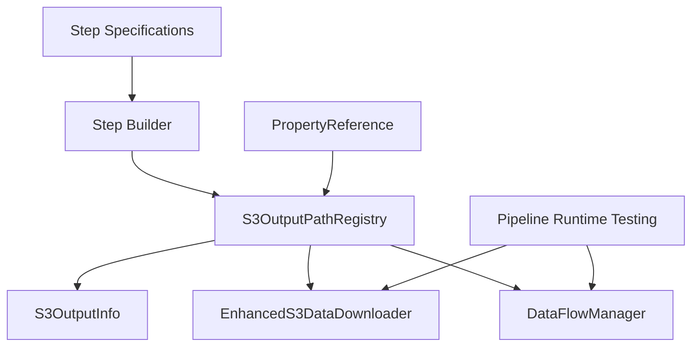

---
tags:
  - design
  - runtime
  - s3_management
  - output_tracking
  - pipeline_execution
keywords:
  - S3 output path registry
  - systematic path tracking
  - runtime output management
  - pipeline output discovery
  - S3 path resolution
topics:
  - runtime system
  - S3 path management
  - output tracking
  - pipeline introspection
language: python
date of note: 2025-08-22
---

# Pipeline Runtime S3 Output Path Management Design

**Date**: August 22, 2025  
**Status**: Design Phase  
**Priority**: High  
**Scope**: Systematic S3 output path tracking and management for pipeline runtime testing

## 🎯 Overview

This document details the design of a **Systematic S3 Output Path Management System** for the Pipeline Runtime Testing framework. The system provides centralized tracking, storage, and retrieval of S3 output paths generated during pipeline execution, enabling comprehensive data flow testing and pipeline introspection.

## 🔍 Problem Statement

### Current Challenges

1. **Scattered S3 Path Information**: Output paths are distributed across step builders without centralized tracking
2. **Manual Path Resolution**: Requires manual navigation through PropertyReference objects to find actual S3 URIs
3. **Limited Pipeline Introspection**: Difficult to discover all outputs generated by a pipeline execution
4. **Testing Data Access**: Runtime testing needs systematic access to step outputs for validation
5. **Data Flow Tracking**: Complex to trace data lineage through S3 paths across pipeline steps

### Requirements

- **Centralized Registry**: Single source of truth for all S3 output paths
- **Logical Name Resolution**: Easy retrieval using step names and logical output names
- **Property Path Integration**: Seamless integration with existing PropertyReference system
- **Runtime Discovery**: Ability to discover all outputs across a pipeline execution
- **Metadata Preservation**: Capture additional context (timestamps, job types, etc.)
- **Testing Integration**: Support for pipeline runtime testing scenarios

## 🏗️ Architecture Overview

### Core Components



### Component Relationships

1. **Step Builders** register S3 output paths during step creation
2. **S3OutputPathRegistry** serves as the centralized tracking system
3. **S3OutputInfo** captures comprehensive output metadata
4. **Enhanced components** leverage the registry for systematic operations
5. **Pipeline Runtime Testing** uses the system for data flow validation

## 📦 Core Data Structures

### 1. S3OutputInfo

**Purpose**: Comprehensive data structure for S3 output information

```python
from pydantic import BaseModel, Field
from datetime import datetime
from typing import Dict, Any, Optional

class S3OutputInfo(BaseModel):
    """Comprehensive S3 output information with metadata"""
    
    logical_name: str = Field(
        ...,
        description="Logical name of the output as defined in step specification"
    )
    s3_uri: str = Field(
        ...,
        description="Complete S3 URI where the output is stored"
    )
    property_path: str = Field(
        ...,
        description="SageMaker property path for runtime resolution"
    )
    data_type: str = Field(
        ...,
        description="Data type of the output (e.g., 'S3Uri', 'ModelArtifacts')"
    )
    step_name: str = Field(
        ...,
        description="Name of the step that produced this output"
    )
    job_type: Optional[str] = Field(
        None,
        description="Job type context (training, validation, testing, calibration)"
    )
    timestamp: datetime = Field(
        default_factory=datetime.now,
        description="When this output was registered"
    )
    metadata: Dict[str, Any] = Field(
        default_factory=dict,
        description="Additional metadata (container paths, output types, etc.)"
    )
    
    model_config = ConfigDict(
        json_encoders={
            datetime: lambda v: v.isoformat()
        }
    )
```

### 2. ExecutionMetadata

**Purpose**: Track pipeline execution context

```python
class ExecutionMetadata(BaseModel):
    """Metadata about pipeline execution context"""
    
    pipeline_name: Optional[str] = None
    execution_id: Optional[str] = None
    start_time: datetime = Field(default_factory=datetime.now)
    end_time: Optional[datetime] = None
    total_steps: int = 0
    completed_steps: int = 0
    
    def mark_step_completed(self) -> None:
        """Mark a step as completed"""
        self.completed_steps += 1
    
    def is_complete(self) -> bool:
        """Check if pipeline execution is complete"""
        return self.completed_steps >= self.total_steps
```

### 3. S3OutputPathRegistry

**Purpose**: Centralized registry for systematic S3 output path tracking

```python
class S3OutputPathRegistry(BaseModel):
    """Centralized registry for tracking S3 output paths across pipeline execution"""
    
    step_outputs: Dict[str, Dict[str, S3OutputInfo]] = Field(
        default_factory=dict,
        description="Nested dict: step_name -> logical_name -> S3OutputInfo"
    )
    execution_metadata: ExecutionMetadata = Field(
        default_factory=ExecutionMetadata,
        description="Metadata about the pipeline execution"
    )
    
    def register_step_output(self, step_name: str, logical_name: str, output_info: S3OutputInfo) -> None:
        """Register an S3 output for a specific step"""
        if step_name not in self.step_outputs:
            self.step_outputs[step_name] = {}
        
        self.step_outputs[step_name][logical_name] = output_info
        self.execution_metadata.mark_step_completed()
    
    def get_step_output_info(self, step_name: str, logical_name: str) -> Optional[S3OutputInfo]:
        """Get S3 output information for a specific step and logical name"""
        return self.step_outputs.get(step_name, {}).get(logical_name)
    
    def get_step_output_path(self, step_name: str, logical_name: str) -> Optional[str]:
        """Get S3 URI for a specific step output"""
        output_info = self.get_step_output_info(step_name, logical_name)
        return output_info.s3_uri if output_info else None
    
    def get_all_step_outputs(self, step_name: str) -> Dict[str, S3OutputInfo]:
        """Get all outputs for a specific step"""
        return self.step_outputs.get(step_name, {})
    
    def list_all_steps(self) -> List[str]:
        """List all steps that have registered outputs"""
        return list(self.step_outputs.keys())
    
    def export_to_manifest(self) -> Dict[str, Any]:
        """Export registry to a manifest format for persistence"""
        return {
            "execution_metadata": self.execution_metadata.model_dump(),
            "step_outputs": {
                step_name: {
                    logical_name: output_info.model_dump()
                    for logical_name, output_info in outputs.items()
                }
                for step_name, outputs in self.step_outputs.items()
            }
        }
    
    def import_from_manifest(self, manifest: Dict[str, Any]) -> None:
        """Import registry from a manifest format"""
        if "execution_metadata" in manifest:
            self.execution_metadata = ExecutionMetadata(**manifest["execution_metadata"])
        
        if "step_outputs" in manifest:
            for step_name, outputs in manifest["step_outputs"].items():
                self.step_outputs[step_name] = {
                    logical_name: S3OutputInfo(**output_data)
                    for logical_name, output_data in outputs.items()
                }
```

## 🔧 Enhanced Step Builder Integration

### Modified _get_outputs Method

**Purpose**: Systematic capture and registration of S3 output paths during step creation

```python
def _get_outputs(self, outputs: Dict[str, Any]) -> List[ProcessingOutput]:
    """
    Enhanced version that systematically captures and stores S3 paths.
    
    This method extends the existing _get_outputs functionality to register
    all S3 output paths in the centralized registry for systematic tracking.
    """
    if not self.spec:
        raise ValueError("Step specification is required")
        
    if not self.contract:
        raise ValueError("Script contract is required for output mapping")
        
    processing_outputs = []
    s3_output_registry = self._get_or_create_s3_registry()
    step_name = self._get_step_name()
    
    # Process each output in the specification
    for _, output_spec in self.spec.outputs.items():
        logical_name = output_spec.logical_name
        
        # Get container path from contract
        container_path = None
        if logical_name in self.contract.expected_output_paths:
            container_path = self.contract.expected_output_paths[logical_name]
        else:
            raise ValueError(f"No container path found for output: {logical_name}")
            
        # Determine destination S3 path
        destination = None
        if logical_name in outputs:
            destination = outputs[logical_name]
        else:
            # Generate destination from config
            destination = f"{self.config.pipeline_s3_loc}/{self._get_step_type_name()}/{self.config.job_type}/{logical_name}"
            self.log_info("Using generated destination for '%s': %s", logical_name, destination)
        
        # Create comprehensive S3OutputInfo for systematic tracking
        s3_output_info = S3OutputInfo(
            logical_name=logical_name,
            s3_uri=destination,
            property_path=output_spec.property_path,
            data_type=output_spec.data_type,
            step_name=step_name,
            job_type=getattr(self.config, 'job_type', None),
            metadata={
                'container_path': container_path,
                'output_type': output_spec.output_type.value,
                'step_type': self._get_step_type_name(),
                'aliases': getattr(output_spec, 'aliases', [])
            }
        )
        
        # Register in the S3 output registry
        s3_output_registry.register_step_output(step_name, logical_name, s3_output_info)
        
        # Create ProcessingOutput as before
        processing_outputs.append(
            ProcessingOutput(
                output_name=logical_name,
                source=container_path,
                destination=destination
            )
        )
        
    return processing_outputs

def _get_or_create_s3_registry(self) -> S3OutputPathRegistry:
    """Get or create the S3 output path registry"""
    if not hasattr(self, '_s3_registry'):
        # Try to get from registry manager if available
        if self.registry_manager and hasattr(self.registry_manager, 's3_output_registry'):
            self._s3_registry = self.registry_manager.s3_output_registry
        else:
            # Create new registry
            self._s3_registry = S3OutputPathRegistry()
    
    return self._s3_registry
```

## 🔄 Enhanced S3 Data Management

### 1. EnhancedS3DataDownloader

**Purpose**: Systematic S3 data downloading using the output path registry

```python
import boto3
from botocore.exceptions import ClientError, NoCredentialsError
from typing import List, Optional, Dict

class EnhancedS3DataDownloader:
    """Enhanced S3 downloader with systematic path retrieval capabilities"""
    
    def __init__(self, output_registry: S3OutputPathRegistry, aws_profile: str = None):
        # Initialize boto3 clients
        session = boto3.Session(profile_name=aws_profile) if aws_profile else boto3.Session()
        self.s3_client = session.client('s3')
        self.s3_resource = session.resource('s3')
        
        # Store registry reference
        self.output_registry = output_registry
    
    def download_step_output_by_logical_name(self, step_name: str, logical_name: str, local_path: str) -> str:
        """
        Download step output using logical names from registry.
        
        Args:
            step_name: Name of the step that produced the output
            logical_name: Logical name of the output
            local_path: Local path to download to
            
        Returns:
            Local path where file was downloaded
            
        Raises:
            ValueError: If no S3 path found for the specified step and logical name
        """
        output_info = self.output_registry.get_step_output_info(step_name, logical_name)
        if not output_info:
            available_outputs = self.output_registry.get_all_step_outputs(step_name)
            available_names = list(available_outputs.keys()) if available_outputs else []
            raise ValueError(
                f"No S3 path found for {step_name}.{logical_name}. "
                f"Available outputs: {available_names}"
            )
        
        return self.download_step_output(output_info.s3_uri, local_path)
    
    def download_step_output(self, s3_uri: str, local_path: str) -> str:
        """Download from S3 URI using boto3"""
        try:
            # Parse S3 URI
            if not s3_uri.startswith('s3://'):
                raise ValueError(f"Invalid S3 URI: {s3_uri}")
            
            s3_path = s3_uri[5:]  # Remove 's3://'
            bucket, key = s3_path.split('/', 1)
            
            # Download using boto3
            self.s3_client.download_file(bucket, key, local_path)
            return local_path
            
        except ClientError as e:
            error_code = e.response['Error']['Code']
            if error_code == 'NoSuchKey':
                raise ValueError(f"S3 object not found: {s3_uri}")
            elif error_code == 'AccessDenied':
                raise ValueError(f"Access denied to S3 object: {s3_uri}")
            else:
                raise ValueError(f"S3 download failed: {e}")
    
    def discover_pipeline_outputs(self, pipeline_dag: Dict = None) -> Dict[str, List[S3OutputInfo]]:
        """
        Systematically discover all outputs across the pipeline.
        
        Args:
            pipeline_dag: Optional pipeline DAG to filter steps
            
        Returns:
            Dictionary mapping step names to their output information
        """
        pipeline_outputs = {}
        
        # Get steps from DAG or registry
        if pipeline_dag:
            step_names = list(pipeline_dag.keys())
        else:
            step_names = self.output_registry.list_all_steps()
        
        # Collect outputs for each step
        for step_name in step_names:
            step_outputs = self.output_registry.get_all_step_outputs(step_name)
            if step_outputs:
                pipeline_outputs[step_name] = list(step_outputs.values())
        
        return pipeline_outputs
    
    def get_step_output_metadata(self, step_name: str, logical_name: str) -> Optional[Dict[str, Any]]:
        """Get comprehensive metadata for a step output"""
        output_info = self.output_registry.get_step_output_info(step_name, logical_name)
        return output_info.metadata if output_info else None
```

### 2. Enhanced DataFlowManager Integration

**Purpose**: Leverage systematic S3 path information for data flow management

```python
class EnhancedDataFlowManager:
    """Enhanced data flow manager with systematic S3 path resolution"""
    
    def __init__(self, workspace_dir: str, s3_output_registry: S3OutputPathRegistry):
        self.workspace_dir = Path(workspace_dir)
        self.s3_output_registry = s3_output_registry
        self.data_lineage = []
    
    def setup_step_inputs(self, step_name: str, upstream_outputs: Dict, 
                         step_contract: ScriptContract) -> Dict[str, str]:
        """
        Enhanced input setup with systematic S3 path resolution.
        
        Args:
            step_name: Name of the current step
            upstream_outputs: Dictionary of upstream outputs (may contain PropertyReference objects)
            step_contract: Contract defining expected inputs
            
        Returns:
            Dictionary mapping logical input names to resolved S3 URIs
        """
        resolved_inputs = {}
        
        for logical_name, upstream_ref in upstream_outputs.items():
            if isinstance(upstream_ref, PropertyReference):
                # Use S3OutputPathRegistry to resolve upstream outputs
                output_info = self.s3_output_registry.get_step_output_info(
                    upstream_ref.step_name, 
                    upstream_ref.output_spec.logical_name
                )
                
                if output_info:
                    resolved_inputs[logical_name] = output_info.s3_uri
                    
                    # Track data lineage
                    self.data_lineage.append({
                        'from_step': upstream_ref.step_name,
                        'from_output': upstream_ref.output_spec.logical_name,
                        'to_step': step_name,
                        'to_input': logical_name,
                        's3_uri': output_info.s3_uri,
                        'timestamp': datetime.now()
                    })
                else:
                    raise ValueError(
                        f"No S3 path found for upstream output: "
                        f"{upstream_ref.step_name}.{upstream_ref.output_spec.logical_name}"
                    )
            else:
                # Direct S3 URI provided
                resolved_inputs[logical_name] = str(upstream_ref)
        
        return resolved_inputs
    
    def validate_data_availability(self, step_name: str, required_inputs: List[str]) -> Dict[str, bool]:
        """
        Validate that all required inputs are available in S3.
        
        Args:
            step_name: Name of the step requiring inputs
            required_inputs: List of required input logical names
            
        Returns:
            Dictionary mapping input names to availability status
        """
        availability = {}
        
        for input_name in required_inputs:
            # This would need to be enhanced to check actual S3 availability
            # For now, check if we have the path registered
            # In practice, this could use boto3 to check S3 object existence
            availability[input_name] = False  # Placeholder
        
        return availability
    
    def create_data_lineage_report(self) -> Dict[str, Any]:
        """Create a comprehensive data lineage report"""
        return {
            'lineage_entries': self.data_lineage,
            'total_transfers': len(self.data_lineage),
            'unique_steps': len(set(entry['from_step'] for entry in self.data_lineage) | 
                              set(entry['to_step'] for entry in self.data_lineage)),
            'generated_at': datetime.now().isoformat()
        }
```

## 🧪 Pipeline Runtime Testing Integration

### 1. Systematic Output Discovery

**Purpose**: Enable comprehensive testing by discovering all pipeline outputs

```python
class PipelineOutputDiscovery:
    """Systematic discovery of pipeline outputs for testing"""
    
    def __init__(self, s3_registry: S3OutputPathRegistry, s3_downloader: EnhancedS3DataDownloader):
        self.s3_registry = s3_registry
        self.s3_downloader = s3_downloader
    
    def discover_all_outputs(self) -> Dict[str, Dict[str, S3OutputInfo]]:
        """Discover all outputs across the entire pipeline"""
        return self.s3_registry.step_outputs
    
    def discover_outputs_by_job_type(self, job_type: str) -> Dict[str, Dict[str, S3OutputInfo]]:
        """Discover outputs filtered by job type"""
        filtered_outputs = {}
        
        for step_name, outputs in self.s3_registry.step_outputs.items():
            step_filtered = {
                logical_name: output_info
                for logical_name, output_info in outputs.items()
                if output_info.job_type == job_type
            }
            if step_filtered:
                filtered_outputs[step_name] = step_filtered
        
        return filtered_outputs
    
    def discover_outputs_by_data_type(self, data_type: str) -> Dict[str, Dict[str, S3OutputInfo]]:
        """Discover outputs filtered by data type"""
        filtered_outputs = {}
        
        for step_name, outputs in self.s3_registry.step_outputs.items():
            step_filtered = {
                logical_name: output_info
                for logical_name, output_info in outputs.items()
                if output_info.data_type == data_type
            }
            if step_filtered:
                filtered_outputs[step_name] = step_filtered
        
        return filtered_outputs
    
    def create_output_manifest(self) -> Dict[str, Any]:
        """Create a comprehensive manifest of all pipeline outputs"""
        return {
            'pipeline_metadata': self.s3_registry.execution_metadata.model_dump(),
            'outputs_by_step': {
                step_name: {
                    logical_name: {
                        's3_uri': output_info.s3_uri,
                        'data_type': output_info.data_type,
                        'job_type': output_info.job_type,
                        'timestamp': output_info.timestamp.isoformat(),
                        'property_path': output_info.property_path
                    }
                    for logical_name, output_info in outputs.items()
                }
                for step_name, outputs in self.s3_registry.step_outputs.items()
            },
            'summary': {
                'total_steps': len(self.s3_registry.step_outputs),
                'total_outputs': sum(len(outputs) for outputs in self.s3_registry.step_outputs.values()),
                'job_types': list(set(
                    output_info.job_type
                    for outputs in self.s3_registry.step_outputs.values()
                    for output_info in outputs.values()
                    if output_info.job_type
                )),
                'data_types': list(set(
                    output_info.data_type
                    for outputs in self.s3_registry.step_outputs.values()
                    for output_info in outputs.values()
                ))
            }
        }
```

### 2. Testing Data Preparation

**Purpose**: Systematic preparation of test data from pipeline outputs

```python
class TestDataPreparation:
    """Prepare test data systematically from pipeline outputs"""
    
    def __init__(self, s3_registry: S3OutputPathRegistry, s3_downloader: EnhancedS3DataDownloader):
        self.s3_registry = s3_registry
        self.s3_downloader = s3_downloader
    
    def prepare_step_test_data(self, step_name: str, local_workspace: str) -> Dict[str, str]:
        """
        Prepare all outputs from a specific step for testing.
        
        Args:
            step_name: Name of the step to prepare data for
            local_workspace: Local directory to download data to
            
        Returns:
            Dictionary mapping logical names to local file paths
        """
        step_outputs = self.s3_registry.get_all_step_outputs(step_name)
        local_paths = {}
        
        for logical_name, output_info in step_outputs.items():
            local_path = Path(local_workspace) / step_name / logical_name
            local_path.parent.mkdir(parents=True, exist_ok=True)
            
            try:
                downloaded_path = self.s3_downloader.download_step_output(
                    output_info.s3_uri, 
                    str(local_path)
                )
                local_paths[logical_name] = downloaded_path
            except Exception as e:
                logger.warning(f"Failed to download {step_name}.{logical_name}: {e}")
        
        return local_paths
    
    def prepare_pipeline_test_data(self, local_workspace: str, 
                                  job_type_filter: Optional[str] = None) -> Dict[str, Dict[str, str]]:
        """
        Prepare test data for the entire pipeline.
        
        Args:
            local_workspace: Local directory to download data to
            job_type_filter: Optional filter by job type
            
        Returns:
            Nested dictionary: step_name -> logical_name -> local_path
        """
        pipeline_data = {}
        
        for step_name in self.s3_registry.list_all_steps():
            step_outputs = self.s3_registry.get_all_step_outputs(step_name)
            
            # Apply job type filter if specified
            if job_type_filter:
                step_outputs = {
                    logical_name: output_info
                    for logical_name, output_info in step_outputs.items()
                    if output_info.job_type == job_type_filter
                }
            
            if step_outputs:
                step_data = self.prepare_step_test_data(step_name, local_workspace)
                if step_data:
                    pipeline_data[step_name] = step_data
        
        return pipeline_data
```

## 📊 Benefits and Advantages

### 1. Systematic Tracking
- **Centralized Registry**: Single source of truth for all S3 output paths
- **Comprehensive Metadata**: Rich information about each output including timestamps, job types, and property paths
- **Automatic Registration**: Seamless integration with existing step builders

### 2. Enhanced Testing Capabilities
- **Logical Name Resolution**: Easy access to outputs using step names and logical names
- **Pipeline Introspection**: Discover all outputs across pipeline execution
- **Data Flow Validation**: Systematic validation of data flow between steps

### 3. Improved Maintainability
- **Property Path Integration**: Leverages existing PropertyReference system
- **Pydantic v2 Models**: Type-safe data structures with validation
- **Boto3 Integration**: Consistent use of AWS Python SDK for S3 operations

### 4. Runtime Testing Support
- **Systematic Data Preparation**: Automated download and preparation of test data
- **Output Discovery**: Comprehensive discovery of pipeline outputs for testing
- **Data Lineage Tracking**: Complete tracking of data flow through the pipeline

## 🔧 Implementation Strategy

### Phase 1: Core Data Structures
1. Implement `S3OutputInfo` and `ExecutionMetadata` using Pydantic v2
2. Create `S3OutputPathRegistry` with comprehensive tracking capabilities
3. Add serialization/deserialization support for persistence

### Phase 2: Step Builder Integration
1. Enhance `_get_outputs` method in base step builder class
2. Add registry creation and management methods
3. Update existing step builders to use the enhanced system

### Phase 3: Enhanced S3 Management
1. Implement `EnhancedS3DataDownloader` with systematic path resolution
2. Update `DataFlowManager` to leverage the registry
3. Add comprehensive error handling and retry mechanisms

### Phase 4: Testing Integration
1. Create `PipelineOutputDiscovery` for systematic output discovery
2. Implement `TestDataPreparation` for automated test data setup
3. Integrate with existing pipeline runtime testing framework

### Phase 5: Validation and Optimization
1. Add comprehensive unit tests for all components
2. Performance optimization for large pipelines
3. Documentation and usage examples

## 🔗 Integration Points

### With Existing Systems
- **PropertyReference System**: Seamless integration for property path resolution
- **Step Specifications**: Leverages existing output specifications
- **Step Builders**: Extends existing `_get_outputs` functionality
- **Pipeline Runtime Testing**: Provides systematic data access for testing

### With AWS Services
- **S3 Operations**: All S3 operations use boto3 for consistency
- **IAM Integration**: Supports AWS credential management through boto3
- **Error Handling**: Comprehensive handling of AWS service errors

## 📚 Cross-References

### **Parent Documents**
- **[Pipeline Runtime Data Management Design](pipeline_runtime_data_management_design.md)**: Core data management layer
- **[Pipeline Runtime Core Engine Design](pipeline_runtime_core_engine_design.md)**: Core execution engine

### **Related Documents**
- **[Enhanced Property Reference](enhanced_property_reference.md)**: Property path handling system
- **[Step Specification](step_specification.md)**: Step specification system
- **[Step Builder](step_builder.md)**: Step builder architecture

### **Implementation References**
- **PropertyReference**: `src/cursus/core/deps/property_reference.py`
- **Step Specifications**: `src/cursus/steps/specs/`
- **Step Builders**: `src/cursus/steps/builders/`

### **Analysis Documents**
- **[Pipeline Runtime Testing Timing and Data Flow Analysis](../4_analysis/pipeline_runtime_testing_timing_and_data_flow_analysis.md)**: Comprehensive analysis of testing timing (pre-execution vs post-execution) and data flow requirements

---

**Document Status**: Complete  
**Next Steps**: Begin implementation with Phase 1 core data structures  
**Part of**: Pipeline Runtime Testing System Design
