---
tags:
  - design
  - pipeline_runtime_testing
  - interactive_factory
  - dag_guided_testing
  - user_experience
  - automation_enhancement
keywords:
  - interactive runtime testing
  - dag guided testing
  - script testing factory
  - user input collection
  - testing requirements extraction
  - step-by-step configuration
topics:
  - interactive pipeline testing
  - runtime testing factory
  - dag guided automation
  - user experience design
  - testing workflow orchestration
language: python
date of note: 2025-10-16
---

# Pipeline Runtime Testing Interactive Factory Design

## Overview

This document outlines the design for an Interactive Pipeline Runtime Testing Factory that transforms the current manual script testing configuration process into a guided, step-by-step workflow similar to the DAGConfigFactory pattern. The system addresses US3: DAG-Guided End-to-End Testing by providing intelligent script discovery, interactive user input collection, and automated testing orchestration.

## Background and Motivation

### Current Runtime Testing Limitations

The existing runtime testing system requires extensive manual configuration and lacks interactive guidance:

**Current Manual Process**:
- Users must manually create `ScriptExecutionSpec` objects for each script
- No guidance on what inputs/outputs are required for each script
- Static configuration with predefined paths and parameters
- Limited automation in script discovery and requirement detection
- No step-by-step workflow for complex pipeline testing

**Current Static Approach**:
```python
# Current approach - ALL scripts must be configured manually
spec_a = ScriptExecutionSpec(
    script_name="xgboost_training",
    step_name="XGBoostTraining_training",
    script_path="scripts/xgboost_training.py",
    input_paths={"data_input": "/manual/path/to/input"},  # Manual configuration
    output_paths={"data_output": "/manual/path/to/output"},  # Manual configuration
    environ_vars={"LABEL_FIELD": "label"},  # Manual configuration
    job_args={"job_type": "training"}  # Manual configuration
)

# No guidance on what parameters are actually needed
# No validation until runtime
# No automation for script discovery
```

### Enhanced Solution Vision

**Interactive Step-by-Step Testing Configuration**:
```python
# Enhanced approach - Interactive guided testing configuration
dag = create_xgboost_complete_e2e_dag()
testing_factory = InteractiveRuntimeTestingFactory(dag)

# Step 1: Analyze DAG and discover scripts requiring testing
scripts_to_test = testing_factory.get_scripts_requiring_testing()
# Returns: ["xgboost_training", "model_evaluation", "data_preprocessing"]

# Step 2: Interactive configuration for each script
for script_name in testing_factory.get_pending_script_configurations():
    requirements = testing_factory.get_script_testing_requirements(script_name)
    # User provides only essential inputs - validated immediately!
    testing_spec = testing_factory.configure_script_testing(
        script_name,
        expected_inputs=user_provided_inputs,
        expected_outputs=user_provided_outputs,
        environment_variables=user_provided_env_vars
    )

# Step 3: Auto-configure scripts with only optional parameters
# Package, Registration steps auto-configured if they only need inherited settings

# Step 4: Execute comprehensive DAG-guided testing (always succeeds with pre-validated specs)
results = testing_factory.execute_dag_guided_testing()
```

## Architecture Overview

### Interactive Testing System Flow Architecture

```mermaid
graph TB
    subgraph "User Interaction Layer"
        DAG[PipelineDAG Input]
        UI[Interactive Testing UI]
        REQ[Requirements Display]
        VAL[Early Validation Feedback]
    end
    
    subgraph "InteractiveRuntimeTestingFactory Core"
        IRTF[InteractiveRuntimeTestingFactory]
        SD[Script Discovery Engine]
        RE[Requirements Extractor]
        SC[Script Configuration Manager]
        EV[Early Validation Engine]
        AC[Auto-Configuration Engine]
        TO[Testing Orchestrator]
    end
    
    subgraph "Testing State Management"
        TSR[Testing Specs Registry]
        RR[Requirements Registry]
        CS[Configuration State]
        TR[Testing Results]
        AC_STATE[Auto-Config State]
    end
    
    subgraph "Script Analysis & Discovery"
        SA[Script Analyzer]
        CR[Contract Reader]
        PR[Parameter Detector]
        IO[Input/Output Analyzer]
    end
    
    subgraph "Existing Runtime Testing Infrastructure"
        RT[RuntimeTester]
        PSB[PipelineTestingSpecBuilder]
        SES[ScriptExecutionSpec]
        PTS[PipelineTestingSpec]
    end
    
    subgraph "Step Catalog Integration"
        SC_INT[Step Catalog]
        FD[Framework Detection]
        CD[Contract Discovery]
        WD[Workspace Discovery]
    end
    
    %% Interactive user flow
    DAG --> IRTF
    IRTF --> SD
    SD --> UI
    UI --> REQ
    REQ --> SC
    SC --> EV
    EV --> VAL
    EV --> TSR
    AC --> AC_STATE
    SC --> AC
    TO --> TR
    
    %% State management
    IRTF --> TSR
    IRTF --> RR
    IRTF --> CS
    IRTF --> TR
    IRTF --> AC_STATE
    
    %% Script analysis
    SD --> SA
    RE --> CR
    RE --> PR
    RE --> IO
    
    %% Infrastructure integration
    TO --> RT
    TO --> PSB
    SC --> SES
    TO --> PTS
    
    %% Step catalog integration
    SD --> SC_INT
    RE --> FD
    RE --> CD
    RE --> WD
    
    classDef userLayer fill:#e1f5fe
    classDef coreLayer fill:#e8f5e8
    classDef stateLayer fill:#fff3e0
    classDef analysisLayer fill:#f8bbd9
    classDef infraLayer fill:#f3e5f5
    classDef catalogLayer fill:#fce4ec
    
    class DAG,UI,REQ,VAL userLayer
    class IRTF,SD,RE,SC,EV,AC,TO coreLayer
    class TSR,RR,CS,TR,AC_STATE stateLayer
    class SA,CR,PR,IO analysisLayer
    class RT,PSB,SES,PTS infraLayer
    class SC_INT,FD,CD,WD catalogLayer
```



### Core Components

#### **1. InteractiveRuntimeTestingFactory (Main Orchestrator)**
**Purpose**: Interactive testing configuration management with step-by-step guidance
**Responsibility**: Coordinate DAG analysis, script discovery, user input collection, and testing execution

```python
class InteractiveRuntimeTestingFactory:
    """
    Interactive factory for DAG-guided script runtime testing.
    
    Enhanced Features:
    - Intelligent script discovery from DAG analysis
    - Step-by-step user input collection with immediate validation
    - Auto-configuration for scripts with only optional parameters
    - Contract-aware requirements extraction using step catalog
    - Comprehensive testing orchestration with early feedback
    
    Workflow:
    1. Analyze DAG to discover scripts requiring testing
    2. Extract testing requirements for each script
    3. Guide user through interactive configuration
    4. Auto-configure eligible scripts (optional parameters only)
    5. Execute comprehensive DAG-guided testing
    """
    
    def __init__(self, dag: PipelineDAG, workspace_dir: str = "test/integration/runtime"):
        """Initialize factory with DAG analysis and interactive state management."""
        self.dag = dag
        self.workspace_dir = Path(workspace_dir)
        
        # Interactive state management
        self.script_testing_specs: Dict[str, ScriptExecutionSpec] = {}
        self.testing_requirements: Dict[str, Dict[str, Any]] = {}
        self.configuration_state: Dict[str, str] = {}  # pending, configured, auto-configured
        
        # Core engines
        self.script_discovery = ScriptDiscoveryEngine(dag, workspace_dir)
        self.requirements_extractor = TestingRequirementsExtractor()
        self.testing_orchestrator = TestingOrchestrator()
        
        # Step catalog integration
        self.step_catalog = self._initialize_step_catalog()
    
    # Interactive workflow methods
    def get_scripts_requiring_testing(self) -> List[str]:
        """Discover scripts in DAG that need testing configuration."""
        
    def get_script_testing_requirements(self, script_name: str) -> Dict[str, Any]:
        """Get interactive requirements for testing a specific script."""
        
    def configure_script_testing(self, script_name: str, **kwargs) -> ScriptExecutionSpec:
        """Configure testing for a script with immediate validation."""
        
    def get_pending_script_configurations(self) -> List[str]:
        """Get scripts that still need testing configuration."""
        
    def can_auto_configure_script(self, script_name: str) -> bool:
        """Check if script can be auto-configured (only optional parameters)."""
        
    def execute_dag_guided_testing(self) -> Dict[str, Any]:
        """Execute comprehensive DAG-guided end-to-end testing."""
```

#### **2. Script Discovery Engine**
**Purpose**: Intelligent script discovery and analysis from DAG structure
**Responsibility**: Map DAG nodes to actual script files and analyze testing requirements

```python
class ScriptDiscoveryEngine:
    """
    Discovers and analyzes scripts from DAG structure.
    
    Key Features:
    - Maps DAG nodes to actual script files using step catalog
    - Analyzes script dependencies and execution order
    - Identifies scripts requiring user configuration vs auto-configurable
    - Provides script metadata for requirements extraction
    """
    
    def discover_scripts_from_dag(self, dag: PipelineDAG) -> Dict[str, ScriptInfo]:
        """Discover all scripts referenced in DAG with metadata."""
        
    def analyze_script_dependencies(self, dag: PipelineDAG) -> Dict[str, List[str]]:
        """Analyze script dependencies for testing order."""
        
    def classify_scripts_by_configuration_needs(self, scripts: Dict[str, ScriptInfo]) -> Dict[str, List[str]]:
        """Classify scripts into manual-config vs auto-configurable categories."""
```

#### **3. Testing Requirements Extractor**
**Purpose**: Extract and analyze testing requirements for each script
**Responsibility**: Determine what inputs, outputs, and parameters each script needs for testing

```python
class TestingRequirementsExtractor:
    """
    Extracts testing requirements from scripts and contracts.
    
    Key Features:
    - Analyzes script files to detect required parameters
    - Uses step catalog contracts for intelligent requirements
    - Detects input/output patterns and data dependencies
    - Provides user-friendly requirement descriptions
    """
    
    def extract_script_requirements(self, script_name: str, script_info: ScriptInfo) -> Dict[str, Any]:
        """
        Extract comprehensive testing requirements for a script.
        
        Returns:
        {
            'expected_inputs': List[InputRequirement] - Required input specifications
            'expected_outputs': List[OutputRequirement] - Expected output specifications  
            'environment_variables': Dict[str, EnvVarRequirement] - Required environment variables
            'job_arguments': Dict[str, JobArgRequirement] - Required job arguments
            'auto_configurable': bool - Can be auto-configured with defaults
            'dependencies': List[str] - Scripts this depends on
        }
        """
        
    def analyze_script_contracts(self, script_name: str) -> Optional[ContractInfo]:
        """Analyze step catalog contracts for enhanced requirements."""
        
    def detect_input_output_patterns(self, script_path: Path) -> Dict[str, Any]:
        """Detect common input/output patterns from script analysis."""
```

#### **4. Interactive Configuration Manager**
**Purpose**: Manage step-by-step user configuration with validation
**Responsibility**: Collect user inputs, validate immediately, and maintain configuration state

```python
class InteractiveConfigurationManager:
    """
    Manages interactive script testing configuration.
    
    Key Features:
    - Step-by-step user input collection
    - Immediate validation with detailed feedback
    - Configuration state management and persistence
    - Auto-configuration for eligible scripts
    """
    
    def configure_script_interactively(self, script_name: str, requirements: Dict[str, Any]) -> ScriptExecutionSpec:
        """Guide user through interactive script configuration."""
        
    def validate_configuration_immediately(self, script_name: str, config_inputs: Dict[str, Any]) -> ValidationResult:
        """Validate configuration inputs immediately with detailed feedback."""
        
    def auto_configure_if_possible(self, script_name: str, requirements: Dict[str, Any]) -> Optional[ScriptExecutionSpec]:
        """Auto-configure script if it only has optional parameters."""
```

## Detailed Design

### Enhanced Data Models

#### **Script Testing Requirement Models**
```python
class InputRequirement(BaseModel):
    """Specification for required script input."""
    name: str = Field(..., description="Logical name of input")
    description: str = Field(..., description="Human-readable description")
    data_type: str = Field(..., description="Expected data type (CSV, JSON, Parquet, etc.)")
    required: bool = Field(default=True, description="Whether input is required")
    example_path: Optional[str] = Field(default=None, description="Example file path")
    validation_rules: List[str] = Field(default_factory=list, description="Validation rules")

class OutputRequirement(BaseModel):
    """Specification for expected script output."""
    name: str = Field(..., description="Logical name of output")
    description: str = Field(..., description="Human-readable description")
    data_type: str = Field(..., description="Expected output type")
    required: bool = Field(default=True, description="Whether output is required")
    example_path: Optional[str] = Field(default=None, description="Example output path")

class EnvVarRequirement(BaseModel):
    """Specification for environment variable."""
    name: str = Field(..., description="Environment variable name")
    description: str = Field(..., description="Purpose and usage")
    required: bool = Field(default=True, description="Whether variable is required")
    default_value: Optional[str] = Field(default=None, description="Default value if optional")
    validation_pattern: Optional[str] = Field(default=None, description="Regex validation pattern")

class JobArgRequirement(BaseModel):
    """Specification for job argument."""
    name: str = Field(..., description="Job argument name")
    description: str = Field(..., description="Purpose and usage")
    arg_type: str = Field(..., description="Argument type (str, int, bool, etc.)")
    required: bool = Field(default=True, description="Whether argument is required")
    default_value: Optional[Any] = Field(default=None, description="Default value if optional")

class ScriptTestingRequirements(BaseModel):
    """Complete testing requirements for a script."""
    script_name: str = Field(..., description="Name of the script")
    step_name: str = Field(..., description="DAG step name")
    expected_inputs: List[InputRequirement] = Field(default_factory=list)
    expected_outputs: List[OutputRequirement] = Field(default_factory=list)
    environment_variables: List[EnvVarRequirement] = Field(default_factory=list)
    job_arguments: List[JobArgRequirement] = Field(default_factory=list)
    auto_configurable: bool = Field(default=False, description="Can be auto-configured")
    dependencies: List[str] = Field(default_factory=list, description="Dependent scripts")
    framework: Optional[str] = Field(default=None, description="Detected framework")
```

#### **Configuration State Models**
```python
class ConfigurationStatus(str, Enum):
    """Status of script testing configuration."""
    PENDING = "pending"
    AUTO_CONFIGURABLE = "auto_configurable"
    PARTIAL = "partial"
    COMPLETE = "complete"
    AUTO_CONFIGURED = "auto_configured"
    VALIDATED = "validated"

class ScriptConfigurationState(BaseModel):
    """State of script testing configuration."""
    script_name: str
    status: ConfigurationStatus
    requirements: Optional[ScriptTestingRequirements] = None
    provided_inputs: Dict[str, Any] = Field(default_factory=dict)
    missing_requirements: List[str] = Field(default_factory=list)
    validation_errors: List[str] = Field(default_factory=list)
    auto_configured_fields: List[str] = Field(default_factory=list)
    last_updated: Optional[datetime] = None

class InteractiveTestingState(BaseModel):
    """Overall state of interactive testing configuration."""
    dag_name: str
    total_scripts: int
    configured_scripts: int
    auto_configured_scripts: int
    pending_scripts: List[str]
    script_states: Dict[str, ScriptConfigurationState]
    ready_for_testing: bool = Field(default=False)
```

### Core Implementation

#### **1. InteractiveRuntimeTestingFactory Main Class**

```python
# src/cursus/validation/runtime/interactive_factory.py
import logging
from typing import Dict, List, Any, Optional
from datetime import datetime
from pathlib import Path
from pydantic import BaseModel

from ...api.dag.base_dag import PipelineDAG
from .runtime_models import ScriptExecutionSpec, PipelineTestingSpec
from .runtime_testing import RuntimeTester
from .runtime_spec_builder import PipelineTestingSpecBuilder

logger = logging.getLogger(__name__)

class InteractiveRuntimeTestingFactory:
    """
    Interactive factory for DAG-guided script runtime testing.
    
    Provides step-by-step workflow for comprehensive pipeline testing with
    intelligent script discovery, user input collection, and automated orchestration.
    """
    
    def __init__(self, dag: PipelineDAG, workspace_dir: str = "test/integration/runtime"):
        """Initialize factory with DAG analysis and interactive state management."""
        self.dag = dag
        self.workspace_dir = Path(workspace_dir)
        
        # Interactive state management
        self.script_testing_specs: Dict[str, ScriptExecutionSpec] = {}
        self.testing_requirements: Dict[str, ScriptTestingRequirements] = {}
        self.configuration_states: Dict[str, ScriptConfigurationState] = {}
        
        # Core engines
        self.script_discovery = ScriptDiscoveryEngine(dag, workspace_dir)
        self.requirements_extractor = TestingRequirementsExtractor()
        self.config_manager = InteractiveConfigurationManager()
        self.testing_orchestrator = TestingOrchestrator()
        
        # Step catalog integration
        self.step_catalog = self._initialize_step_catalog()
        
        # Initialize by discovering scripts
        self._discover_and_analyze_scripts()
        
        logger.info(f"Initialized InteractiveRuntimeTestingFactory for DAG with {len(self.configuration_states)} scripts")
    
    def get_scripts_requiring_testing(self) -> List[str]:
        """
        Discover scripts in DAG that need testing configuration.
        
        Returns:
            List of script names that require testing setup
        """
        return list(self.configuration_states.keys())
    
    def get_script_testing_requirements(self, script_name: str) -> Dict[str, Any]:
        """
        Get interactive requirements for testing a specific script.
        
        Args:
            script_name: Name of the script to get requirements for
            
        Returns:
            Dictionary with user-friendly requirements information
        """
        if script_name not in self.testing_requirements:
            raise ValueError(f"Script '{script_name}' not found in discovered scripts")
        
        requirements = self.testing_requirements[script_name]
        
        return {
            'script_name': requirements.script_name,
            'step_name': requirements.step_name,
            'framework': requirements.framework,
            'auto_configurable': requirements.auto_configurable,
            'expected_inputs': [
                {
                    'name': inp.name,
                    'description': inp.description,
                    'data_type': inp.data_type,
                    'required': inp.required,
                    'example_path': inp.example_path
                }
                for inp in requirements.expected_inputs
            ],
            'expected_outputs': [
                {
                    'name': out.name,
                    'description': out.description,
                    'data_type': out.data_type,
                    'required': out.required,
                    'example_path': out.example_path
                }
                for out in requirements.expected_outputs
            ],
            'environment_variables': [
                {
                    'name': env.name,
                    'description': env.description,
                    'required': env.required,
                    'default_value': env.default_value
                }
                for env in requirements.environment_variables
            ],
            'job_arguments': [
                {
                    'name': arg.name,
                    'description': arg.description,
                    'arg_type': arg.arg_type,
                    'required': arg.required,
                    'default_value': arg.default_value
                }
                for arg in requirements.job_arguments
            ],
            'dependencies': requirements.dependencies
        }
    
    def configure_script_testing(self, script_name: str, **kwargs) -> ScriptExecutionSpec:
        """
        Configure testing for a script with immediate validation.
        
        Args:
            script_name: Name of the script to configure
            **kwargs: Testing configuration parameters
                - expected_inputs: Dict[str, str] - Input name to path mapping
                - expected_outputs: Dict[str, str] - Output name to path mapping
                - environment_variables: Dict[str, str] - Environment variable mapping
                - job_arguments: Dict[str, Any] - Job argument mapping
                
        Returns:
            The created and validated ScriptExecutionSpec
            
        Raises:
            ValueError: If configuration is invalid or requirements not met
        """
        if script_name not in self.testing_requirements:
            raise ValueError(f"Script '{script_name}' not found in discovered scripts")
        
        requirements = self.testing_requirements[script_name]
        
        try:
            # Validate configuration immediately
            validation_result = self.config_manager.validate_configuration_immediately(
                script_name, requirements, kwargs
            )
            
            if not validation_result.success:
                raise ValueError(f"Configuration validation failed: {validation_result.error_message}")
            
            # Create ScriptExecutionSpec with validated inputs
            script_spec = self._create_script_execution_spec(script_name, requirements, kwargs)
            
            # Store configuration and update state
            self.script_testing_specs[script_name] = script_spec
            self.configuration_states[script_name].status = ConfigurationStatus.COMPLETE
            self.configuration_states[script_name].provided_inputs = kwargs
            self.configuration_states[script_name].last_updated = datetime.now()
            
            logger.info(f"✅ {script_name} configured successfully for testing")
            return script_spec
            
        except Exception as e:
            # Update state with error information
            self.configuration_states[script_name].status = ConfigurationStatus.PARTIAL
            self.configuration_states[script_name].validation_errors = [str(e)]
            
            logger.error(f"❌ Configuration failed for {script_name}: {e}")
            raise ValueError(f"Configuration validation failed for {script_name}: {e}")
    
    def get_pending_script_configurations(self) -> List[str]:
        """
        Get scripts that still need testing configuration.
        
        Scripts that can be auto-configured are not considered pending.
        
        Returns:
            List of script names that need manual configuration
        """
        pending_scripts = []
        
        for script_name, state in self.configuration_states.items():
            if state.status in [ConfigurationStatus.PENDING, ConfigurationStatus.PARTIAL]:
                # Check if script can be auto-configured
                if not self.can_auto_configure_script(script_name):
                    pending_scripts.append(script_name)
        
        return pending_scripts
    
    def can_auto_configure_script(self, script_name: str) -> bool:
        """
        Check if script can be auto-configured (only optional parameters).
        
        Args:
            script_name: Name of the script to check
            
        Returns:
            True if script can be auto-configured, False if it requires user input
        """
        if script_name not in self.testing_requirements:
            return False
        
        requirements = self.testing_requirements[script_name]
        
        # Check if script is marked as auto-configurable
        if not requirements.auto_configurable:
            return False
        
        # Check if all required inputs/outputs/parameters have defaults or can be inferred
        required_inputs = [inp for inp in requirements.expected_inputs if inp.required]
        required_outputs = [out for out in requirements.expected_outputs if out.required]
        required_env_vars = [env for env in requirements.environment_variables if env.required and env.default_value is None]
        required_job_args = [arg for arg in requirements.job_arguments if arg.required and arg.default_value is None]
        
        # If there are required parameters without defaults, can't auto-configure
        return len(required_inputs) == 0 and len(required_outputs) == 0 and len(required_env_vars) == 0 and len(required_job_args) == 0
    
    def auto_configure_script_if_possible(self, script_name: str) -> Optional[ScriptExecutionSpec]:
        """
        Auto-configure a script if it only has optional parameters.
        
        Args:
            script_name: Name of the script to auto-configure
            
        Returns:
            The created ScriptExecutionSpec if auto-configuration succeeded, None otherwise
        """
        if not self.can_auto_configure_script(script_name):
            return None
        
        requirements = self.testing_requirements[script_name]
        
        try:
            # Create auto-configuration inputs using defaults and intelligent inference
            auto_config_inputs = self._generate_auto_configuration_inputs(script_name, requirements)
            
            # Create ScriptExecutionSpec with auto-configured inputs
            script_spec = self._create_script_execution_spec(script_name, requirements, auto_config_inputs)
            
            # Store configuration and update state
            self.script_testing_specs[script_name] = script_spec
            self.configuration_states[script_name].status = ConfigurationStatus.AUTO_CONFIGURED
            self.configuration_states[script_name].provided_inputs = auto_config_inputs
            self.configuration_states[script_name].auto_configured_fields = list(auto_config_inputs.keys())
            self.configuration_states[script_name].last_updated = datetime.now()
            
            logger.info(f"✅ {script_name} auto-configured successfully (only optional parameters)")
            return script_spec
            
        except Exception as e:
            logger.debug(f"Auto-configuration failed for {script_name}: {e}")
            return None
    
    def execute_dag_guided_testing(self) -> Dict[str, Any]:
        """
        Execute comprehensive DAG-guided end-to-end testing.
        
        Returns:
            Dictionary with comprehensive testing results
        """
        # Auto-configure eligible scripts first
        auto_configured_count = self._auto_configure_eligible_scripts()
        if auto_configured_count > 0:
            logger.info(f"✅ Auto-configured {auto_configured_count} scripts with only optional parameters")
        
        # Check that all scripts are configured
        pending_scripts = self.get_pending_script_configurations()
        if pending_scripts:
            raise ValueError(f"Cannot execute testing - missing configuration for scripts: {pending_scripts}")
        
        # Create PipelineTestingSpec from configured scripts
        pipeline_spec = self._create_pipeline_testing_spec()
        
        # Execute comprehensive testing using existing RuntimeTester
        tester = RuntimeTester(
            config_or_workspace_dir=str(self.workspace_dir),
            step_catalog=self.step_catalog
        )
        
        # Execute enhanced testing with step catalog integration
        results = tester.test_pipeline_flow_with_step_catalog_enhancements(pipeline_spec)
        
        # Enhance results with interactive factory information
        results["interactive_factory_info"] = {
            "total_scripts": len(self.configuration_states),
            "manually_configured": len([s for s in self.configuration_states.values() if s.status == ConfigurationStatus.COMPLETE]),
            "auto_configured": len([s for s in self.configuration_states.values() if s.status == ConfigurationStatus.AUTO_CONFIGURED]),
            "script_configurations": {
                name: {
                    "status": state.status.value,
                    "auto_configured_fields": state.auto_configured_fields,
                    "framework": self.testing_requirements[name].framework
                }
                for name, state in self.configuration_states.items()
            }
        }
        
        logger.info(f"✅ DAG-guided testing completed for {len(self.script_testing_specs)} scripts")
        return results
    
    def get_testing_factory_summary(self) -> Dict[str, Any]:
        """
        Get summary information about the interactive testing factory state.
        
        Returns:
            Dictionary with factory state summary
        """
        total_scripts = len(self.configuration_states)
        configured_scripts = len([s for s in self.configuration_states.values() if s.status in [ConfigurationStatus.COMPLETE, ConfigurationStatus.AUTO_CONFIGURED]])
        auto_configured_scripts = len([s for s in self.configuration_states.values() if s.status == ConfigurationStatus.AUTO_CONFIGURED])
        pending_scripts = self.get_pending_script_configurations()
        
        return {
            'dag_name': getattr(self.dag, 'name', 'unnamed'),
            'total_scripts': total_scripts,
            'configured_scripts': configured_scripts,
            'auto_configured_scripts': auto_configured_scripts,
            'manually_configured_scripts': configured_scripts - auto_configured_scripts,
            'pending_scripts': pending_scripts,
            'ready_for_testing': len(pending_scripts) == 0,
            'script_details': {
                name: {
                    'status': state.status.value,
                    'framework': self.testing_requirements[name].framework,
                    'auto_configurable': self.testing_requirements[name].auto_configurable,
                    'dependencies': self.testing_requirements[name].dependencies
                }
                for name, state in self.configuration_states.items()
            }
        }
    
    def _discover_and_analyze_scripts(self) -> None:
        """Discover scripts from DAG and analyze their testing requirements."""
        # Discover scripts using script discovery engine
        discovered_scripts = self.script_discovery.discover_scripts_from_dag(self.dag)
        
        # Extract requirements for each discovered script
        for script_name, script_info in discovered_scripts.items():
            requirements = self.requirements_extractor.extract_script_requirements(script_name, script_info)
            self.testing_requirements[script_name] = requirements
            
            # Initialize configuration state
            self.configuration_states[script_name] = ScriptConfigurationState(
                script_name=script_name,
                status=ConfigurationStatus.AUTO_CONFIGURABLE if requirements.auto_configurable else ConfigurationStatus.PENDING,
                requirements=requirements
            )
        
        logger.info(f"Discovered {len(discovered_scripts)} scripts for testing")
    
    def _auto_configure_eligible_scripts(self) -> int:
        """Auto-configure all scripts that are eligible."""
        auto_configured_count = 0
        
        for script_name in self.configuration_states.keys():
            if self.configuration_states[script_name].status in [ConfigurationStatus.COMPLETE, ConfigurationStatus.AUTO_CONFIGURED]:
                continue  # Already configured
            
            if self.auto_configure_script_if_possible(script_name):
                auto_configured_count += 1
        
        return auto_configured_count
    
    def _create_script_execution_spec(self, script_name: str, requirements: ScriptTestingRequirements, config_inputs: Dict[str, Any]) -> ScriptExecutionSpec:
        """Create ScriptExecutionSpec from requirements and user inputs."""
        # Implementation details for creating spec from requirements and inputs
        pass
    
    def _generate_auto_configuration_inputs(self, script_name: str, requirements: ScriptTestingRequirements) -> Dict[str, Any]:
        """Generate auto-configuration inputs using defaults and intelligent inference."""
        # Implementation details for auto-configuration
        pass
    
    def _create_pipeline_testing_spec(self) -> PipelineTestingSpec:
        """Create PipelineTestingSpec from all configured script specs."""
        # Implementation details for creating pipeline spec
        pass
    
    def _initialize_step_catalog(self):
        """Initialize step catalog with unified workspace resolution."""
        # Implementation details for step catalog initialization
        pass
```

## User Experience Flow

### Enhanced Interactive Testing Workflow

The InteractiveRuntimeTestingFactory provides a streamlined, intelligent testing configuration experience:

#### **Phase 1: DAG Analysis and Script Discovery**
```python
# 1. Create DAG and initialize interactive testing factory
dag = create_xgboost_complete_e2e_dag()
testing_factory = InteractiveRuntimeTestingFactory(dag)

# 2. Analyze discovered scripts
scripts_to_test = testing_factory.get_scripts_requiring_testing()
print(f"Discovered {len(scripts_to_test)} scripts requiring testing configuration")

# 3. Get factory summary
summary = testing_factory.get_testing_factory_summary()
print(f"Auto-configurable scripts: {summary['auto_configured_scripts']}")
print(f"Scripts needing manual config: {len(summary['pending_scripts'])}")
```

#### **Phase 2: Interactive Script Configuration**
```python
# 4. Configure scripts that need user input
pending_scripts = testing_factory.get_pending_script_configurations()

for script_name in pending_scripts:
    # Get detailed requirements for this script
    requirements = testing_factory.get_script_testing_requirements(script_name)
    
    print(f"\nConfiguring testing for: {script_name}")
    print(f"Framework: {requirements['framework']}")
    print(f"Required inputs: {[inp['name'] for inp in requirements['expected_inputs'] if inp['required']]}")
    print(f"Required outputs: {[out['name'] for out in requirements['expected_outputs'] if out['required']]}")
    
    # User provides configuration with immediate validation
    if script_name == "xgboost_training":
        testing_spec = testing_factory.configure_script_testing(
            script_name,
            expected_inputs={
                "training_data": "/path/to/train.csv",
                "model_config": "/path/to/config.json"
            },
            expected_outputs={
                "trained_model": "/path/to/model_output",
                "training_metrics": "/path/to/metrics.json"
            },
            environment_variables={
                "LABEL_FIELD": "target",
                "MAX_DEPTH": "6"
            },
            job_arguments={
                "num_round": 300,
                "learning_rate": 0.1
            }
        )
        print(f"✅ {script_name} configured successfully!")
```

#### **Phase 3: Auto-Configuration and Testing Execution**
```python
# 5. Execute comprehensive DAG-guided testing (auto-configures eligible scripts)
results = testing_factory.execute_dag_guided_testing()

print(f"\n✅ DAG-guided testing completed!")
print(f"Pipeline success: {results['pipeline_success']}")

# 6. Show detailed results
factory_info = results["interactive_factory_info"]
print(f"Total scripts tested: {factory_info['total_scripts']}")
print(f"Manually configured: {factory_info['manually_configured']}")
print(f"Auto-configured: {factory_info['auto_configured']}")

for script_name, config_info in factory_info["script_configurations"].items():
    status_icon = "🤖" if config_info["status"] == "auto_configured" else "📝"
    print(f"  {status_icon} {script_name} ({config_info['framework']}) - {config_info['status']}")
```

### Enhanced Error Handling and User Feedback

#### **Early Validation Error Example:**
```python
# User tries to configure script with missing required inputs
try:
    testing_factory.configure_script_testing(
        "xgboost_training",
        expected_inputs={"training_data": "/path/to/train.csv"},  # Missing model_config
        expected_outputs={"trained_model": "/path/to/model_output"}
    )
except ValueError as e:
    print(f"❌ Configuration failed: {e}")
    # Output: "Configuration validation failed for xgboost_training: Missing required input 'model_config'"

# User provides invalid file path
try:
    testing_factory.configure_script_testing(
        "xgboost_training",
        expected_inputs={
            "training_data": "/nonexistent/path/train.csv",
            "model_config": "/path/to/config.json"
        }
    )
except ValueError as e:
    print(f"❌ Configuration failed: {e}")
    # Output: "Configuration validation failed: Input file '/nonexistent/path/train.csv' does not exist"
```

#### **Auto-Configuration Feedback:**
```python
# System provides clear feedback on auto-configuration
results = testing_factory.execute_dag_guided_testing()
# Output: 
# INFO: ✅ package_step auto-configured successfully (only optional parameters)
# INFO: ✅ registration_step auto-configured successfully (only optional parameters)
# INFO: ✅ Auto-configured 2 scripts with only optional parameters
# INFO: ✅ DAG-guided testing completed for 4 scripts
```

## Implementation Benefits

### **1. Intelligent Script Discovery**
- **Before**: Manual identification of scripts requiring testing
- **After**: Automatic DAG analysis with intelligent script discovery and classification

### **2. Interactive Requirements Collection**
- **Before**: Users must guess what inputs/outputs each script needs
- **After**: System analyzes scripts and provides clear, structured requirements

### **3. Immediate Validation Feedback**
- **Before**: Configuration errors discovered only during test execution
- **After**: Immediate validation with detailed error messages and guidance

### **4. Intelligent Auto-Configuration**
- **Before**: All scripts require manual configuration
- **After**: Scripts with only optional parameters are automatically configured

### **5. Enhanced User Experience**
- **Before**: Complex manual process with high cognitive load
- **After**: Guided step-by-step workflow with clear feedback and automation

### **6. Comprehensive Testing Orchestration**
- **Before**: Manual coordination of script testing and data flow validation
- **After**: Automated DAG-guided end-to-end testing with comprehensive results

## Technical Implementation Details

### **Enhanced Script Analysis**
The system uses multiple analysis techniques to extract testing requirements:

```python
class TestingRequirementsExtractor:
    """
    Multi-layered requirements extraction using:
    1. Static script analysis (AST parsing)
    2. Step catalog contract integration
    3. Framework-specific pattern detection
    4. Intelligent default inference
    """
    
    def extract_script_requirements(self, script_name: str, script_info: ScriptInfo) -> ScriptTestingRequirements:
        """Extract comprehensive requirements using layered analysis."""
        
        # Layer 1: Static script analysis
        static_requirements = self._analyze_script_statically(script_info.script_path)
        
        # Layer 2: Step catalog contract integration
        contract_requirements = self._extract_from_contracts(script_name)
        
        # Layer 3: Framework-specific analysis
        framework_requirements = self._analyze_framework_patterns(script_info.framework)
        
        # Layer 4: Intelligent merging and default inference
        merged_requirements = self._merge_and_infer_requirements(
            static_requirements, contract_requirements, framework_requirements
        )
        
        return merged_requirements
```

### **Enhanced State Management**
The factory maintains comprehensive state for optimal user experience:

```python
class InteractiveRuntimeTestingFactory:
    def __init__(self, dag: PipelineDAG, workspace_dir: str):
        # Multi-layered state management
        self.script_testing_specs: Dict[str, ScriptExecutionSpec] = {}  # Final validated specs
        self.testing_requirements: Dict[str, ScriptTestingRequirements] = {}  # Extracted requirements
        self.configuration_states: Dict[str, ScriptConfigurationState] = {}  # Configuration progress
        
        # Persistent state for complex workflows
        self.state_file = Path(workspace_dir) / ".interactive_testing_state.json"
        self._load_persistent_state_if_exists()
```

### **Enhanced Integration with Existing Infrastructure**
The interactive factory seamlessly integrates with existing cursus infrastructure:

```python
def execute_dag_guided_testing(self) -> Dict[str, Any]:
    """Execute testing using existing RuntimeTester with enhancements."""
    
    # Create PipelineTestingSpec from interactive configuration
    pipeline_spec = PipelineTestingSpec(
        dag=self.dag,
        script_specs=self.script_testing_specs,
        test_workspace_root=str(self.workspace_dir)
    )
    
    # Use existing RuntimeTester with step catalog enhancements
    tester = RuntimeTester(
        config_or_workspace_dir=str(self.workspace_dir),
        step_catalog=self.step_catalog
    )
    
    # Execute with enhanced testing methods
    results = tester.test_pipeline_flow_with_step_catalog_enhancements(pipeline_spec)
    
    # Enhance results with interactive factory context
    results["interactive_factory_info"] = self._generate_factory_context()
    
    return results
```

## Integration with Existing Cursus Infrastructure

### **Seamless Integration Points**
The InteractiveRuntimeTestingFactory integrates seamlessly with existing cursus infrastructure:

1. **Runtime Testing System**: Uses existing `RuntimeTester` and `PipelineTestingSpecBuilder`
2. **Step Catalog System**: Leverages step catalog for intelligent requirements extraction
3. **DAG System**: Works with existing `PipelineDAG` structure and analysis
4. **Configuration System**: Compatible with existing configuration patterns

### **Backward Compatibility**
The interactive system maintains full backward compatibility:

```python
# Traditional approach still works
builder = PipelineTestingSpecBuilder("test/integration/runtime")
spec = builder.resolve_script_execution_spec_from_node("XGBoostTraining_training")
tester = RuntimeTester("test/integration/runtime")
result = tester.test_script_with_spec(spec, main_params)

# Enhanced interactive approach
testing_factory = InteractiveRuntimeTestingFactory(dag)
testing_factory.configure_script_testing("xgboost_training", **config_params)
results = testing_factory.execute_dag_guided_testing()
```

## Future Enhancements

### **Potential Extensions**
1. **Web-Based Interactive UI**: Browser-based configuration interface with real-time validation
2. **Machine Learning Requirements Prediction**: ML-based prediction of testing requirements
3. **Template-Based Configuration**: Pre-built templates for common testing patterns
4. **Advanced Dependency Analysis**: Sophisticated dependency detection and ordering
5. **Performance Optimization**: Parallel testing execution and intelligent caching

### **Integration Opportunities**
1. **CI/CD Pipeline Integration**: Automated testing in continuous integration workflows
2. **Jupyter Notebook Integration**: Interactive widgets for notebook-based configuration
3. **IDE Extensions**: VS Code extensions for in-editor testing configuration
4. **Cloud Platform Integration**: Integration with cloud ML platforms for remote testing

## Performance Characteristics

### **Expected Performance Metrics**
- **Script Discovery**: 100ms-500ms (depends on DAG complexity)
- **Requirements Extraction**: 50ms-200ms per script (cached after first analysis)
- **Configuration Validation**: 10ms-50ms per validation (immediate feedback)
- **Auto-Configuration**: 20ms-100ms per script (depends on complexity)
- **Testing Execution**: Same as existing RuntimeTester (no performance impact)

### **Memory Usage Projections**
- **Requirements Cache**: 5MB-50MB (depends on script complexity and count)
- **Configuration State**: 1MB-10MB (configuration and validation state)
- **Script Analysis Cache**: 2MB-20MB (cached analysis results)

### **Optimization Targets**
- **Lazy Analysis**: Requirements extracted only when needed
- **Intelligent Caching**: Analysis results cached for reuse
- **Incremental Updates**: Only re-analyze changed scripts
- **Parallel Processing**: Concurrent requirements extraction for multiple scripts

## Risk Assessment and Mitigation

### **Technical Risks**

**Script Analysis Complexity**
- *Risk*: Complex scripts may be difficult to analyze automatically
- *Mitigation*: Layered analysis approach with fallback to manual configuration
- *Fallback*: Manual configuration always available for complex cases

**Requirements Extraction Accuracy**
- *Risk*: Automated requirements extraction may miss edge cases
- *Mitigation*: Multiple analysis layers with user validation and override capabilities
- *Fallback*: Users can always provide manual requirements

**Performance Impact**
- *Risk*: Script analysis may slow down testing workflow
- *Mitigation*: Lazy loading, caching, and parallel processing
- *Fallback*: Analysis can be disabled for performance-critical scenarios

### **User Experience Risks**

**Configuration Complexity**
- *Risk*: Interactive workflow may be overwhelming for simple cases
- *Mitigation*: Auto-configuration for simple scripts, progressive disclosure of complexity
- *Fallback*: Traditional manual configuration still available

**Learning Curve**
- *Risk*: Users may need time to adapt to interactive workflow
- *Mitigation*: Clear documentation, examples, and gradual migration path
- *Fallback*: Backward compatibility ensures existing workflows continue to work

## Success Metrics

### **Implementation Success Criteria**
- **Functionality**: 100% of planned user stories implemented with interactive workflow
- **Integration**: Seamless integration with existing runtime testing framework
- **Performance**: <10% overhead for script analysis, significant UX improvement
- **Reliability**: >95% accuracy in requirements extraction and auto-configuration
- **Usability**: >80% reduction in manual configuration effort for typical pipelines

### **Quality Metrics**
- **Test Coverage**: >95% code coverage for all interactive factory functionality
- **Error Handling**: 100% graceful handling of analysis failures with fallback options
- **Documentation**: Complete usage examples and integration guides
- **Performance**: Benchmark results within expected performance characteristics

### **User Adoption Metrics**
- **Migration**: Zero-breaking-change migration path for existing users
- **Enhancement**: Interactive features provide clear value for complex pipeline testing
- **Effectiveness**: >90% reduction in configuration errors and testing setup time
- **Integration**: Works with existing development workflows without modification

## References

### Foundation Documents
- **[Pipeline Runtime Testing Simplified Design](pipeline_runtime_testing_simplified_design.md)** - Core runtime testing architecture and node-to-script resolution
- **[Pipeline Runtime Testing Step Catalog Integration Design](pipeline_runtime_testing_step_catalog_integration_design.md)** - Step catalog integration patterns and enhanced automation
- **[DAG Config Factory Design](dag_config_factory_design.md)** - Interactive factory pattern and step-by-step configuration workflow

### Implementation Planning
- **[2025-09-30 Pipeline Runtime Testing Step Catalog Integration Implementation Plan](../2_project_planning/2025-09-30_pipeline_runtime_testing_step_catalog_integration_implementation_plan.md)** - Step catalog integration implementation roadmap
- **[2025-09-14 Pipeline Runtime Testing Inference Implementation Plan](../2_project_planning/2025-09-14_pipeline_runtime_testing_inference_implementation_plan.md)** - Reference implementation patterns and methodology

### Core Infrastructure
- **[Runtime Tester Design](runtime_tester_design.md)** - Core testing engine and validation framework
- **[Script Execution Spec Design](script_execution_spec_design.md)** - Script execution configuration and dual identity management
- **[Pipeline Testing Spec Design](pipeline_testing_spec_design.md)** - Pipeline-level configuration and orchestration

### Step Catalog System
- **[Step Catalog Design](../step_catalog/step_catalog_design.md)** - Core step catalog architecture and component discovery
- **[Step Catalog Integration Guide](../0_developer_guide/step_catalog_integration_guide.md)** - Integration patterns and best practices
- **[Contract Discovery Design](../step_catalog/contract_discovery_design.md)** - Contract discovery and validation patterns

### Configuration System
- **[Config Driven Design](config_driven_design.md)** - Core principles for specification-driven system architecture
- **[Configuration Generator Design](../api/factory/configuration_generator_design.md)** - Configuration generation patterns and inheritance
- **[Field Extractor Design](../api/factory/field_extractor_design.md)** - Field requirement extraction and analysis

### Developer Guides
- **[Script Development Guide](../0_developer_guide/script_development_guide.md)** - Script development patterns and contracts
- **[Validation Framework Guide](../0_developer_guide/validation_framework_guide.md)** - Validation patterns and testing strategies
- **[Pipeline Catalog Integration Guide](../0_developer_guide/pipeline_catalog_integration_guide.md)** - Pipeline integration patterns

## Conclusion

The Interactive Pipeline Runtime Testing Factory design transforms the cursus runtime testing experience from a manual, error-prone process into an intelligent, guided workflow that significantly reduces user effort while improving testing reliability and coverage.

### Key Achievements

1. **Intelligent Script Discovery**: Automated DAG analysis with intelligent script classification and requirements extraction
2. **Interactive User Experience**: Step-by-step guided workflow with immediate validation and clear feedback
3. **Smart Auto-Configuration**: Automatic configuration for scripts with only optional parameters
4. **Comprehensive Integration**: Seamless integration with existing runtime testing and step catalog infrastructure
5. **Enhanced Testing Orchestration**: DAG-guided end-to-end testing with comprehensive result reporting
6. **Backward Compatibility**: Full compatibility with existing workflows while providing powerful new capabilities

### Impact on Development Workflow

**Before**: Manual script testing configuration with extensive setup overhead and error-prone processes
**After**: Intelligent, guided testing workflow with automated discovery, interactive configuration, and comprehensive validation

This enhancement represents a fundamental shift from manual, assumption-heavy testing setup to intelligent, automated configuration that adapts to the actual scripts and requirements in the pipeline, significantly improving the reliability and efficiency of pipeline development and validation processes.

The design maintains full backward compatibility while providing powerful new capabilities that scale from simple script testing to complex multi-script pipeline validation, making it an essential tool for robust pipeline development and deployment in the cursus ecosystem.
