---
tags:
  - design
  - pipeline_runtime_testing
  - interactive_factory
  - dag_guided_testing
  - user_experience
  - config_driven_validation
keywords:
  - interactive runtime testing
  - dag guided testing
  - config-based script validation
  - user input collection
  - testing requirements extraction
  - step-by-step configuration
topics:
  - interactive pipeline testing
  - runtime testing factory
  - dag guided automation
  - config-driven validation
  - testing workflow orchestration
language: python
date of note: 2025-10-16
---

# Pipeline Runtime Testing Interactive Factory Design

## Overview

This document outlines the enhanced design for an Interactive Pipeline Runtime Testing Factory that transforms the current manual script testing configuration process into a guided, step-by-step workflow following the PipelineDAGCompiler pattern. The system addresses US3: DAG-Guided End-to-End Testing by providing **config-based script validation**, intelligent script discovery, interactive user input collection, and automated testing orchestration.

## Background and Motivation

### Current Runtime Testing Limitations

The existing runtime testing system has critical issues with phantom script discovery and lacks config-based validation:

**Current Problematic Process**:
```python
# Current approach - leads to phantom script discovery
dag = create_xgboost_complete_e2e_dag()
factory = InteractiveRuntimeTestingFactory(dag)  # Only DAG input

# ❌ PROBLEM: Discovers 8 phantom scripts including non-existent ones
scripts_to_test = factory.get_scripts_requiring_testing()
# Returns: ["cradle_data_loading", "tabular_preprocessing", "xgboost_training", ...]
# But "cradle_data_loading" has NO SCRIPT - it's only data transformation!
```

**Root Cause Analysis**:
- **False Positive Discovery**: Factory blindly assumes all DAG nodes have scripts
- **No Config Validation**: Doesn't check if nodes actually have script entry points
- **Phantom Scripts**: Creates testing specs for non-existent scripts
- **Manual Guesswork**: Users must guess what inputs/outputs each script needs

### Enhanced Solution Vision

**Config-Based Script Validation Following PipelineDAGCompiler Pattern**:
```python
# Enhanced approach - User provides DAG + config path (like PipelineDAGCompiler)
dag = create_xgboost_complete_e2e_dag()
config_path = "pipeline_config/config_NA_xgboost_AtoZ_v2/config_NA_xgboost_AtoZ.json"

factory = InteractiveRuntimeTestingFactory(dag, config_path)  # DAG + config

# ✅ SOLUTION: Only discovers actual scripts defined in config
scripts_to_test = factory.get_scripts_requiring_testing()
# Returns: ["tabular_preprocessing", "xgboost_training", "xgboost_model_evaluation", 
#           "model_calibration", "package", "payload"]
# NO phantom scripts - only nodes with actual script entry points!

# Step-by-step interactive configuration with config-populated defaults
for script_name in factory.get_pending_script_configurations():
    requirements = factory.get_script_testing_requirements(script_name)
    
    # User only provides expected_inputs and expected_outputs
    # Environment variables and job arguments pre-populated from config!
    factory.configure_script_testing(
        script_name,
        expected_inputs=user_provided_inputs,    # Still interactive
        expected_outputs=user_provided_outputs,  # Still interactive
        # environment_variables=auto_from_config,  # From config!
        # job_arguments=auto_from_config           # From config!
    )

# Execute comprehensive testing with validated scripts only
results = factory.execute_dag_guided_testing()
```

## Architecture Overview

### Config-Driven Interactive Testing System Architecture

```mermaid
graph TB
    subgraph "Enhanced User Input Layer"
        DAG[PipelineDAG Input]
        CONFIG[Config Path Input]
        UI[Interactive Testing UI]
        REQ[Requirements Display]
        VAL[Early Validation Feedback]
    end
    
    subgraph "InteractiveRuntimeTestingFactory Core"
        IRTF[InteractiveRuntimeTestingFactory]
        CL[Config Loader]
        CSV[Config Script Validator]
        SD[Script Discovery Engine]
        RE[Requirements Extractor]
        SC[Script Configuration Manager]
        EV[Early Validation Engine]
        AC[Auto-Configuration Engine]
        TO[Testing Orchestrator]
    end
    
    subgraph "Config-Based Validation"
        CV[Config Validator]
        SEP[Script Entry Point Detector]
        SIE[Script Info Extractor]
        EVE[Environment Variable Extractor]
        JAE[Job Arguments Extractor]
    end
    
    subgraph "Testing State Management"
        TSR[Testing Specs Registry]
        RR[Requirements Registry]
        CS[Configuration State]
        TR[Testing Results]
        AC_STATE[Auto-Config State]
    end
    
    subgraph "Existing Runtime Testing Infrastructure"
        RT[RuntimeTester]
        PSB[PipelineTestingSpecBuilder]
        SES[ScriptExecutionSpec]
        PTS[PipelineTestingSpec]
    end
    
    subgraph "Config Loading Infrastructure"
        LOAD_CONFIGS[load_configs utility]
        CONFIG_CLASSES[Config Classes]
        CONFIG_RESOLVER[Config Resolver]
    end
    
    %% Enhanced user flow with config input
    DAG --> IRTF
    CONFIG --> IRTF
    IRTF --> CL
    CL --> CSV
    CSV --> SD
    SD --> UI
    UI --> REQ
    REQ --> SC
    SC --> EV
    EV --> VAL
    EV --> TSR
    AC --> AC_STATE
    SC --> AC
    TO --> TR
    
    %% Config-based validation flow
    CL --> CV
    CSV --> SEP
    CSV --> SIE
    CSV --> EVE
    CSV --> JAE
    
    %% State management
    IRTF --> TSR
    IRTF --> RR
    IRTF --> CS
    IRTF --> TR
    IRTF --> AC_STATE
    
    %% Infrastructure integration
    TO --> RT
    TO --> PSB
    SC --> SES
    TO --> PTS
    
    %% Config loading integration
    CL --> LOAD_CONFIGS
    CL --> CONFIG_CLASSES
    CL --> CONFIG_RESOLVER
    
    classDef userLayer fill:#e1f5fe
    classDef coreLayer fill:#e8f5e8
    classDef validationLayer fill:#fff8e1
    classDef stateLayer fill:#fff3e0
    classDef infraLayer fill:#f3e5f5
    classDef configLayer fill:#fce4ec
    
    class DAG,CONFIG,UI,REQ,VAL userLayer
    class IRTF,CL,CSV,SD,RE,SC,EV,AC,TO coreLayer
    class CV,SEP,SIE,EVE,JAE validationLayer
    class TSR,RR,CS,TR,AC_STATE stateLayer
    class RT,PSB,SES,PTS infraLayer
    class LOAD_CONFIGS,CONFIG_CLASSES,CONFIG_RESOLVER configLayer
```



### Core Components

#### **1. Enhanced InteractiveRuntimeTestingFactory (Main Orchestrator)**
**Purpose**: Config-driven interactive testing configuration following PipelineDAGCompiler pattern
**Responsibility**: Load config, validate script existence, coordinate user input collection, and testing execution

```python
class InteractiveRuntimeTestingFactory:
    """
    Enhanced interactive factory for DAG-guided script runtime testing.
    
    NEW FEATURES:
    - Config-based script validation (no more phantom scripts!)
    - DAG + config path input (following PipelineDAGCompiler pattern)
    - Pre-populated environment variables and job arguments from config
    - Definitive script discovery using config entry points
    - Enhanced user experience with reduced manual configuration
    
    Workflow:
    1. Load pipeline config using existing load_configs utility
    2. Validate which DAG nodes actually have scripts (config-based validation)
    3. Extract script metadata from config (paths, env vars, job args)
    4. Guide user through interactive configuration (inputs/outputs only)
    5. Execute comprehensive DAG-guided testing with validated scripts
    """
    
    def __init__(self, dag: PipelineDAG, config_path: str, workspace_dir: str = "test/integration/runtime"):
        """
        Initialize factory with DAG and config path (like PipelineDAGCompiler).
        
        Args:
            dag: Pipeline DAG to analyze and test
            config_path: Path to pipeline configuration JSON file
            workspace_dir: Workspace directory for testing files
        """
        self.dag = dag
        self.config_path = config_path
        self.workspace_dir = Path(workspace_dir)
        
        # Load configs using existing utilities (following DynamicTemplate + DAGConfigFactory pattern)
        from ...steps.configs.utils import load_configs, build_complete_config_classes
        from ...step_catalog.adapters.config_resolver import StepConfigResolverAdapter
        
        # Step 1: Load ALL configs from file (like PipelineTemplateBase does)
        config_classes = build_complete_config_classes()
        all_configs = load_configs(config_path, config_classes)
        
        # Step 2: Filter to only DAG-related configs (like DynamicTemplate does)
        config_resolver = StepConfigResolverAdapter()
        dag_nodes = list(dag.nodes)
        self.loaded_configs = config_resolver.resolve_config_map(
            dag_nodes=dag_nodes,
            available_configs=all_configs
        )
        
        # Enhanced state management with config integration
        self.script_testing_specs: Dict[str, ScriptExecutionSpec] = {}
        self.script_info_cache: Dict[str, Dict[str, Any]] = {}
        self.pending_scripts: List[str] = []
        self.auto_configured_scripts: List[str] = []
        
        # Core engines with config integration
        self.config_validator = ConfigScriptValidator(self.loaded_configs)
        self.script_discovery = ConfigBasedScriptDiscovery(dag, self.loaded_configs)
        self.requirements_extractor = ConfigAwareRequirementsExtractor(self.loaded_configs)
        
        # Initialize logger
        self.logger = logging.getLogger(__name__)
        
        # Discover and analyze scripts using config validation
        self._discover_and_analyze_scripts_from_config()
        
        self.logger.info(f"✅ Initialized InteractiveRuntimeTestingFactory with {len(self.script_info_cache)} validated scripts")
    
    def get_scripts_requiring_testing(self) -> List[str]:
        """
        Get scripts discovered from config that actually have script entry points.
        
        Returns:
            List of script names that were validated to have actual scripts
        """
        return list(self.script_info_cache.keys())
    
    def get_script_testing_requirements(self, script_name: str) -> Dict[str, Any]:
        """
        Get interactive requirements for testing a specific script.
        
        Enhanced with config-populated defaults for environment variables and job arguments.
        
        Args:
            script_name: Name of the script to get requirements for
            
        Returns:
            Dictionary containing detailed requirements with config-populated defaults
        """
        if script_name not in self.script_info_cache:
            raise ValueError(f"Script '{script_name}' not found in validated scripts")
        
        info = self.script_info_cache[script_name]
        
        return {
            'script_name': info['script_name'],
            'step_name': info['step_name'],
            'script_path': info['script_path'],
            'source_dir': info['source_dir'],
            'expected_inputs': [
                {
                    'name': name,
                    'description': f"Input data for {name}",
                    'required': True,
                    'example_path': f"test/data/{script_name}/input/{name}",
                    'current_path': info['default_input_paths'].get(name, '')
                }
                for name in info['expected_inputs']
            ],
            'expected_outputs': [
                {
                    'name': name,
                    'description': f"Output data for {name}",
                    'required': True,
                    'example_path': f"test/data/{script_name}/output/{name}",
                    'current_path': info['default_output_paths'].get(name, '')
                }
                for name in info['expected_outputs']
            ],
            'environment_variables': [
                {
                    'name': name,
                    'description': f"Environment variable: {name}",
                    'required': False,
                    'default_value': value,
                    'source': 'config'  # NEW: Indicates value comes from config
                }
                for name, value in info['config_environ_vars'].items()
            ],
            'job_arguments': [
                {
                    'name': name,
                    'description': f"Job argument: {name}",
                    'required': False,
                    'default_value': value,
                    'source': 'config'  # NEW: Indicates value comes from config
                }
                for name, value in info['config_job_args'].items()
            ],
            'auto_configurable': info.get('auto_configurable', False)
        }
    
    def configure_script_testing(self, script_name: str, **kwargs) -> ScriptExecutionSpec:
        """
        Configure testing for a script with config-populated defaults.
        
        Enhanced: Environment variables and job arguments are pre-populated from config.
        User only needs to provide expected_inputs and expected_outputs.
        
        Args:
            script_name: Name of the script to configure
            **kwargs: Configuration parameters including:
                - expected_inputs or input_paths: Dict mapping input names to file paths
                - expected_outputs or output_paths: Dict mapping output names to file paths
                - environment_variables or environ_vars: Dict of environment variables (optional - uses config defaults)
                - job_arguments or job_args: Dict of job arguments (optional - uses config defaults)
                
        Returns:
            Configured ScriptExecutionSpec object
        """
        if script_name not in self.script_info_cache:
            raise ValueError(f"Script '{script_name}' not found in validated scripts")
        
        info = self.script_info_cache[script_name]
        
        # Extract configuration inputs with flexible parameter names
        input_paths = kwargs.get('expected_inputs', kwargs.get('input_paths', {}))
        output_paths = kwargs.get('expected_outputs', kwargs.get('output_paths', {}))
        
        # Use config defaults for environment variables and job arguments (user can override)
        environ_vars = kwargs.get('environment_variables', kwargs.get('environ_vars', info['config_environ_vars']))
        job_args = kwargs.get('job_arguments', kwargs.get('job_args', info['config_job_args']))
        
        # Immediate validation with detailed feedback
        validation_errors = self._validate_script_configuration(info, input_paths, output_paths)
        
        if validation_errors:
            raise ValueError(f"Configuration validation failed for {script_name}:\n" + 
                           "\n".join(f"  - {error}" for error in validation_errors))
        
        # Create ScriptExecutionSpec with config-enhanced data
        script_spec = ScriptExecutionSpec(
            script_name=script_name,
            step_name=info['step_name'],
            script_path=info['script_path'],
            input_paths=input_paths,
            output_paths=output_paths,
            environ_vars=environ_vars,  # From config with user overrides
            job_args=job_args,  # From config with user overrides
            last_updated=datetime.now().isoformat(),
            user_notes=f"Configured with config-populated defaults from {self.config_path}"
        )
        
        # Store configuration and update state
        self.script_testing_specs[script_name] = script_spec
        if script_name in self.pending_scripts:
            self.pending_scripts.remove(script_name)
        
        self.logger.info(f"✅ {script_name} configured successfully with config defaults")
        return script_spec
    
    def _discover_and_analyze_scripts_from_config(self) -> None:
        """
        Enhanced script discovery using config validation - no more phantom scripts!
        
        Only discovers scripts that are actually defined in the pipeline configuration.
        """
        for node_name in self.dag.nodes:
            if node_name not in self.loaded_configs:
                self.logger.debug(f"Skipping {node_name} - no config found")
                continue
                
            config = self.loaded_configs[node_name]
            
            # Extract script information from config (definitive source)
            script_info = self._extract_script_info_from_config(config, node_name)
            
            if not script_info['has_script']:
                self.logger.debug(f"Skipping {node_name} - no script entry point in config")
                continue
                
            # Cache script information for interactive workflow
            self.script_info_cache[script_info['script_name']] = {
                'script_name': script_info['script_name'],
                'step_name': script_info['step_name'],
                'script_path': script_info['script_path'],
                'source_dir': script_info['source_dir'],
                'expected_inputs': ['data_input'],  # Still need user input
                'expected_outputs': ['data_output'],  # Still need user input
                'default_input_paths': {'data_input': f"test/data/{script_info['script_name']}/input"},
                'default_output_paths': {'data_output': f"test/data/{script_info['script_name']}/output"},
                'config_environ_vars': script_info['environ_vars'],  # From config!
                'config_job_args': script_info['job_args'],  # From config!
                'auto_configurable': script_info.get('auto_configurable', False)
            }
            
            # Check if script can be auto-configured
            if self._can_auto_configure_from_config(script_info):
                self.auto_configured_scripts.append(script_info['script_name'])
            else:
                # Needs user configuration
                self.pending_scripts.append(script_info['script_name'])
        
        self.logger.info(f"📊 Config-based Script Discovery Summary:")
        self.logger.info(f"   - Validated scripts: {len(self.script_info_cache)} (no phantom scripts)")
        self.logger.info(f"   - Auto-configurable: {len(self.auto_configured_scripts)} scripts")
        self.logger.info(f"   - Pending configuration: {len(self.pending_scripts)} scripts")
    
    def _extract_script_info_from_config(self, config, node_name: str) -> Dict[str, Any]:
        """
        Extract script information from loaded config (definitive validation).
        
        Args:
            config: Loaded configuration object for the node
            node_name: Name of the DAG node
            
        Returns:
            Dictionary with script information extracted from config
        """
        script_info = {
            'node_name': node_name,
            'step_name': node_name,
            'has_script': False,
            'script_name': None,
            'script_path': None,
            'source_dir': None,
            'environ_vars': {},
            'job_args': {},
            'auto_configurable': False
        }
        
        # Check for script entry points (definitive validation)
        if hasattr(config, 'processing_entry_point') and config.processing_entry_point:
            script_info['has_script'] = True
            script_info['script_name'] = config.processing_entry_point.replace('.py', '')
            script_info['script_path'] = config.processing_entry_point
        elif hasattr(config, 'training_entry_point') and config.training_entry_point:
            script_info['has_script'] = True
            script_info['script_name'] = config.training_entry_point.replace('.py', '')
            script_info['script_path'] = config.training_entry_point
        elif hasattr(config, 'script_path') and config.script_path:
            script_info['has_script'] = True
            script_info['script_path'] = config.script_path
            script_info['script_name'] = Path(config.script_path).stem
        elif hasattr(config, 'inference_entry_point') and config.inference_entry_point:
            script_info['has_script'] = True
            script_info['script_name'] = config.inference_entry_point.replace('.py', '')
            script_info['script_path'] = config.inference_entry_point
        
        if not script_info['has_script']:
            return script_info
        
        # Extract source directory from config
        if hasattr(config, 'portable_processing_source_dir'):
            script_info['source_dir'] = config.portable_processing_source_dir
        elif hasattr(config, 'processing_source_dir'):
            script_info['source_dir'] = config.processing_source_dir
        elif hasattr(config, 'source_dir'):
            script_info['source_dir'] = config.source_dir
        elif hasattr(config, 'portable_source_dir'):
            script_info['source_dir'] = config.portable_source_dir
        
        # Extract environment variables from config (based on actual script patterns)
        script_info['environ_vars'] = {
            'PYTHONPATH': '/opt/ml/code',
            'CURSUS_ENV': 'testing'
        }
        
        # Map config fields to environment variables based on script usage patterns
        if hasattr(config, 'label_name'):
            script_info['environ_vars']['LABEL_FIELD'] = config.label_name
        if hasattr(config, 'train_ratio'):
            script_info['environ_vars']['TRAIN_RATIO'] = str(config.train_ratio)
        if hasattr(config, 'test_val_ratio'):
            script_info['environ_vars']['TEST_VAL_RATIO'] = str(config.test_val_ratio)
        if hasattr(config, 'framework_version'):
            script_info['environ_vars']['FRAMEWORK_VERSION'] = config.framework_version
        if hasattr(config, 'py_version'):
            script_info['environ_vars']['PYTHON_VERSION'] = config.py_version
        
        # Extract job arguments from config (based on actual script patterns)
        script_info['job_args'] = {}
        
        # Map config fields to job arguments
        if hasattr(config, 'job_type'):
            script_info['job_args']['job_type'] = config.job_type
        if hasattr(config, 'training_instance_type'):
            script_info['job_args']['instance_type'] = config.training_instance_type
        elif hasattr(config, 'processing_instance_type'):
            script_info['job_args']['instance_type'] = config.processing_instance_type
        
        # Determine if auto-configurable (scripts with only metadata, no data processing)
        auto_configurable_types = ['Package', 'Registration', 'Payload']
        config_type = config.__class__.__name__
        script_info['auto_configurable'] = config_type in auto_configurable_types
        
        return script_info
```

#### **2. Config-Based Script Validator**
**Purpose**: Validate which DAG nodes actually have scripts using config entry points
**Responsibility**: Eliminate phantom script discovery by checking config for actual script definitions

```python
class ConfigScriptValidator:
    """
    Validates script existence using pipeline configuration.
    
    Key Features:
    - Definitive script validation using config entry points
    - Eliminates phantom script discovery
    - Extracts script metadata from authoritative config source
    """
    
    def __init__(self, loaded_configs: Dict[str, Any]):
        """Initialize with loaded pipeline configurations."""
        self.loaded_configs = loaded_configs
        self.logger = logging.getLogger(__name__)
    
    def validate_node_has_script(self, node_name: str) -> bool:
        """
        Check if DAG node has an actual script defined in config.
        
        Args:
            node_name: Name of the DAG node to check
            
        Returns:
            True if node has a script entry point in config, False otherwise
        """
        if node_name not in self.loaded_configs:
            return False
        
        config = self.loaded_configs[node_name]
        
        # Check for any script entry point fields
        script_fields = [
            'processing_entry_point',
            'training_entry_point', 
            'script_path',
            'inference_entry_point'
        ]
        
        return any(hasattr(config, field) and getattr(config, field) for field in script_fields)
    
    def get_script_entry_point(self, node_name: str) -> Optional[str]:
        """
        Get the script entry point for a node from config.
        
        Args:
            node_name: Name of the DAG node
            
        Returns:
            Script entry point if found, None otherwise
        """
        if not self.validate_node_has_script(node_name):
            return None
        
        config = self.loaded_configs[node_name]
        
        # Priority order for script entry points
        if hasattr(config, 'processing_entry_point') and config.processing_entry_point:
            return config.processing_entry_point
        elif hasattr(config, 'training_entry_point') and config.training_entry_point:
            return config.training_entry_point
        elif hasattr(config, 'script_path') and config.script_path:
            return config.script_path
        elif hasattr(config, 'inference_entry_point') and config.inference_entry_point:
            return config.inference_entry_point
        
        return None
    
    def get_validated_scripts_from_dag(self, dag: PipelineDAG) -> List[str]:
        """
        Get list of DAG nodes that have validated scripts in config.
        
        Args:
            dag: Pipeline DAG to analyze
            
        Returns:
            List of node names that have actual scripts
        """
        validated_scripts = []
        
        for node_name in dag.nodes:
            if self.validate_node_has_script(node_name):
                validated_scripts.append(node_name)
            else:
                self.logger.debug(f"Node {node_name} has no script entry point - skipping")
        
        return validated_scripts
```

#### **3. Config-Aware Requirements Extractor**
**Purpose**: Extract testing requirements with config-populated defaults
**Responsibility**: Provide environment variables and job arguments from config, reducing user input burden

```python
class ConfigAwareRequirementsExtractor:
    """
    Extracts testing requirements with config-populated defaults.
    
    Key Features:
    - Pre-populates environment variables from config
    - Pre-populates job arguments from config
    - Reduces user input to essential inputs/outputs only
    - Provides intelligent defaults based on config metadata
    """
    
    def __init__(self, loaded_configs: Dict[str, Any]):
        """Initialize with loaded pipeline configurations."""
        self.loaded_configs = loaded_configs
        self.logger = logging.getLogger(__name__)
    
    def extract_config_environment_variables(self, node_name: str) -> Dict[str, str]:
        """
        Extract environment variables from config for a node.
        
        Args:
            node_name: Name of the DAG node
            
        Returns:
            Dictionary of environment variables from config
        """
        if node_name not in self.loaded_configs:
            return {}
        
        config = self.loaded_configs[node_name]
        environ_vars = {
            'PYTHONPATH': '/opt/ml/code',
            'CURSUS_ENV': 'testing'
        }
        
        # Extract framework-specific environment variables
        if hasattr(config, 'framework_version'):
            environ_vars['FRAMEWORK_VERSION'] = config.framework_version
        
        if hasattr(config, 'py_version'):
            environ_vars['PYTHON_VERSION'] = config.py_version
        
        # Extract processing-specific environment variables
        if hasattr(config, 'processing_framework_version'):
            environ_vars['PROCESSING_FRAMEWORK_VERSION'] = config.processing_framework_version
        
        return environ_vars
    
    def extract_config_job_arguments(self, node_name: str) -> Dict[str, Any]:
        """
        Extract job arguments from config for a node.
        
        Args:
            node_name: Name of the DAG node
            
        Returns:
            Dictionary of job arguments from config
        """
        if node_name not in self.loaded_configs:
            return {}
        
        config = self.loaded_configs[node_name]
        job_args = {
            'execution_mode': 'testing'
        }
        
        # Extract job type from config
        if hasattr(config, 'job_type'):
            job_args['job_type'] = config.job_type
        
        # Extract instance type information
        if hasattr(config, 'processing_instance_type_small'):
            job_args['instance_type'] = config.processing_instance_type_small
        
        if hasattr(config, 'training_instance_type'):
            job_args['instance_type'] = config.training_instance_type
        
        # Extract hyperparameters if available
        if hasattr(config, 'hyperparameters') and config.hyperparameters:
            job_args['hyperparameters'] = config.hyperparameters
        
        return job_args
    
    def extract_source_directory(self, node_name: str) -> Optional[str]:
        """
        Extract source directory from config for a node.
        
        Args:
            node_name: Name of the DAG node
            
        Returns:
            Source directory path if found, None otherwise
        """
        if node_name not in self.loaded_configs:
            return None
        
        config = self.loaded_configs[node_name]
        
        # Priority order for source directory
        if hasattr(config, 'portable_processing_source_dir'):
            return config.portable_processing_source_dir
        elif hasattr(config, 'processing_source_dir'):
            return config.processing_source_dir
        elif hasattr(config, 'source_dir'):
            return config.source_dir
        elif hasattr(config, 'portable_source_dir'):
            return config.portable_source_dir
        
        return None
```

## Enhanced Data Models

### **Config-Enhanced Script Information Models**
```python
class ConfigScriptInfo(BaseModel):
    """Enhanced script information with config-populated data."""
    script_name: str = Field(..., description="Name of the script")
    step_name: str = Field(..., description="DAG step name")
    script_path: str = Field(..., description="Path to script file")
    source_dir: Optional[str] = Field(default=None, description="Source directory from config")
    has_script: bool = Field(..., description="Whether node actually has a script")
    config_environ_vars: Dict[str, str] = Field(default_factory=dict, description="Environment variables from config")
    config_job_args: Dict[str, Any] = Field(default_factory=dict, description="Job arguments from config")
    auto_configurable: bool = Field(default=False, description="Can be auto-configured from config")
    config_source: str = Field(..., description="Source config file path")

class ConfigValidationResult(BaseModel):
    """Result of config-based script validation."""
    node_name: str = Field(..., description="DAG node name")
    has_script: bool = Field(..., description="Whether node has script in config")
    script_entry_point: Optional[str] = Field(default=None, description="Script entry point from config")
    validation_method: str = Field(..., description="Method used for validation")
    config_type: str = Field(..., description="Type of configuration")
    
class EnhancedScriptTestingRequirements(BaseModel):
    """Enhanced testing requirements with config integration."""
    script_name: str = Field(..., description="Name of the script")
    step_name: str = Field(..., description="DAG step name")
    expected_inputs: List[str] = Field(default_factory=list, description="Required inputs (user provides)")
    expected_outputs: List[str] = Field(default_factory=list, description="Required outputs (user provides)")
    config_environ_vars: Dict[str, str] = Field(default_factory=dict, description="Environment variables from config")
    config_job_args: Dict[str, Any] = Field(default_factory=dict, description="Job arguments from config")
    source_dir: Optional[str] = Field(default=None, description="Source directory from config")
    auto_configurable: bool = Field(default=False, description="Can be auto-configured")
    config_populated_fields: List[str] = Field(default_factory=list, description="Fields populated from config")
```

## Detailed Implementation

### **Enhanced InteractiveRuntimeTestingFactory Implementation**

```python
# src/cursus/validation/runtime/interactive_factory.py
"""
Enhanced Interactive Runtime Testing Factory with Config-Based Validation

This module provides the InteractiveRuntimeTestingFactory class, which transforms
the manual script testing configuration process into a guided, step-by-step workflow
with config-based script validation following the PipelineDAGCompiler pattern.

Key Enhancements:
- Config-based script validation (eliminates phantom scripts)
- DAG + config path input (following PipelineDAGCompiler pattern)
- Pre-populated environment variables and job arguments from config
- Reduced user input burden (only inputs/outputs required)
"""

import logging
from datetime import datetime
from pathlib import Path
from typing import Dict, List, Any, Optional

from ...api.dag.base_dag import PipelineDAG
from ...steps.configs.utils import load_configs
from .runtime_models import ScriptExecutionSpec, PipelineTestingSpec
from .runtime_spec_builder import PipelineTestingSpecBuilder
from .runtime_testing import RuntimeTester


class InteractiveRuntimeTestingFactory:
    """
    Enhanced interactive factory for DAG-guided script runtime testing.
    
    NEW FEATURES:
    - Config-based script validation (no more phantom scripts!)
    - DAG + config path input (following PipelineDAGCompiler pattern)
    - Pre-populated environment variables and job arguments from config
    - Definitive script discovery using config entry points
    - Enhanced user experience with reduced manual configuration
    """
    
    def __init__(self, dag: PipelineDAG, config_path: str, workspace_dir: str = "test/integration/runtime"):
        """
        Initialize factory with DAG and config path (like PipelineDAGCompiler).
        
        Args:
            dag: Pipeline DAG to analyze and test
            config_path: Path to pipeline configuration JSON file
            workspace_dir: Workspace directory for testing files
        """
        self.dag = dag
        self.config_path = config_path
        self.workspace_dir = Path(workspace_dir)
        
        # Load configs using existing utilities (like PipelineDAGCompiler)
        self.loaded_configs = load_configs(config_path)
        
        # Enhanced state management with config integration
        self.script_testing_specs: Dict[str, ScriptExecutionSpec] = {}
        self.script_info_cache: Dict[str, Dict[str, Any]] = {}
        self.pending_scripts: List[str] = []
        self.auto_configured_scripts: List[str] = []
        
        # Initialize logger
        self.logger = logging.getLogger(__name__)
        
        # Discover and analyze scripts using config validation
        self._discover_and_analyze_scripts_from_config()
        
        self.logger.info(f"✅ Initialized InteractiveRuntimeTestingFactory with {len(self.script_info_cache)} validated scripts")
```

## User Experience Flow

### Enhanced Interactive Testing Workflow

The enhanced InteractiveRuntimeTestingFactory provides a streamlined, config-driven testing configuration experience:

#### **Phase 1: DAG + Config Analysis and Script Discovery**
```python
# 1. Create DAG and initialize interactive testing factory with config
dag = create_xgboost_complete_e2e_dag()
config_path = "pipeline_config/config_NA_xgboost_AtoZ_v2/config_NA_xgboost_AtoZ.json"
testing_factory = InteractiveRuntimeTestingFactory(dag, config_path)

# 2. Analyze discovered scripts (only validated scripts with actual entry points)
scripts_to_test = testing_factory.get_scripts_requiring_testing()
print(f"📊 Discovered {len(scripts_to_test)} validated scripts from config")
# Output: "📊 Discovered 6 validated scripts from config"
# NO phantom scripts like "cradle_data_loading"!

# 3. Get factory summary with config-populated defaults
summary = testing_factory.get_testing_factory_summary()
print(f"Auto-configurable scripts: {summary['auto_configured_scripts']}")
print(f"Scripts needing manual config: {len(summary['pending_scripts'])}")
```

#### **Phase 2: Enhanced Interactive Script Configuration**
```python
# 4. Configure scripts with config-populated defaults
pending_scripts = testing_factory.get_pending_script_configurations()

for script_name in pending_scripts:
    # Get detailed requirements with config-populated defaults
    requirements = testing_factory.get_script_testing_requirements(script_name)
    
    print(f"\nConfiguring testing for: {script_name}")
    print(f"Script path: {requirements['script_path']}")
    print(f"Source directory: {requirements['source_dir']}")
    
    # Environment variables and job arguments pre-populated from config!
    print("Environment variables (from config):")
    for env_var in requirements['environment_variables']:
        print(f"  - {env_var['name']}: {env_var['default_value']} (source: {env_var['source']})")
    
    print("Job arguments (from config):")
    for job_arg in requirements['job_arguments']:
        print(f"  - {job_arg['name']}: {job_arg['default_value']} (source: {job_arg['source']})")
    
    # User only provides inputs and outputs - everything else from config!
    if script_name == "tabular_preprocessing":
        testing_spec = testing_factory.configure_script_testing(
            script_name,
            expected_inputs={
                "raw_data": "test/data/tabular_preprocessing/input/raw_data.csv"
            },
            expected_outputs={
                "processed_data": "test/data/tabular_preprocessing/output/processed_data.csv",
                "preprocessing_metrics": "test/data/tabular_preprocessing/output/metrics.json"
            }
            # environment_variables and job_arguments automatically populated from config!
        )
        print(f"✅ {script_name} configured with config defaults!")
```

#### **Phase 3: Auto-Configuration and Testing Execution**
```python
# 5. Execute comprehensive DAG-guided testing (auto-configures eligible scripts)
results = testing_factory.execute_dag_guided_testing()

print(f"\n✅ Config-driven DAG-guided testing completed!")
print(f"Pipeline success: {results['pipeline_success']}")

# 6. Show detailed results with config integration info
factory_info = results["interactive_factory_info"]
print(f"Total validated scripts tested: {factory_info['total_scripts']}")
print(f"Manually configured: {factory_info['manually_configured']}")
print(f"Auto-configured: {factory_info['auto_configured']}")

for script_name, config_info in factory_info["script_configurations"].items():
    status_icon = "🤖" if config_info["status"] == "auto_configured" else "📝"
    config_icon = "⚙️"  # Indicates config-populated defaults
    print(f"  {status_icon}{config_icon} {script_name} - {config_info['status']} (config-enhanced)")
```

### Enhanced Error Handling and User Feedback

#### **Config Validation Error Example:**
```python
# User tries to initialize with invalid config path
try:
    testing_factory = InteractiveRuntimeTestingFactory(dag, "/nonexistent/config.json")
except FileNotFoundError as e:
    print(f"❌ Config loading failed: {e}")
    # Output: "❌ Config loading failed: Configuration file not found: /nonexistent/config.json"

# User tries to configure non-existent script
try:
    testing_factory.configure_script_testing("phantom_script", expected_inputs={})
except ValueError as e:
    print(f"❌ Configuration failed: {e}")
    # Output: "❌ Configuration failed: Script 'phantom_script' not found in validated scripts"
```

#### **Config-Enhanced Feedback:**
```python
# System provides clear feedback on config-populated defaults
requirements = testing_factory.get_script_testing_requirements("xgboost_training")
print("Config-populated defaults:")
for env_var in requirements['environment_variables']:
    if env_var['source'] == 'config':
        print(f"  ⚙️ {env_var['name']}: {env_var['default_value']} (from config)")

# Output:
# Config-populated defaults:
#   ⚙️ PYTHONPATH: /opt/ml/code (from config)
#   ⚙️ CURSUS_ENV: testing (from config)
#   ⚙️ FRAMEWORK_VERSION: 1.7-1 (from config)
```

## Implementation Benefits

### **1. Eliminates Phantom Script Discovery**
- **Before**: Discovers 8 scripts including non-existent "cradle_data_loading"
- **After**: Only discovers 5-6 actual scripts with validated entry points in config

### **2. Config-Driven Validation**
- **Before**: Blind assumption that all DAG nodes have scripts
- **After**: Definitive validation using config entry points (processing_entry_point, training_entry_point, etc.)

### **3. Reduced User Input Burden**
- **Before**: Users must manually provide all environment variables and job arguments
- **After**: Environment variables and job arguments pre-populated from config, users only provide inputs/outputs

### **4. Enhanced User Experience Following PipelineDAGCompiler Pattern**
- **Before**: Only DAG input, leading to guesswork and errors
- **After**: DAG + config path input (consistent with PipelineDAGCompiler), providing authoritative configuration source

### **5. Intelligent Auto-Configuration**
- **Before**: All scripts require manual configuration
- **After**: Scripts like Package, Registration, Payload auto-configured using config metadata

### **6. Comprehensive Config Integration**
- **Before**: No integration with existing config infrastructure
- **After**: Full integration with load_configs utility and existing config classes

## Technical Implementation Details

### **Config-Based Script Discovery Algorithm**
```python
def _discover_and_analyze_scripts_from_config(self) -> None:
    """
    Enhanced algorithm for config-based script discovery.
    
    Algorithm:
    1. Iterate through DAG nodes
    2. Check if node has corresponding config
    3. Validate config has script entry point
    4. Extract script metadata from config
    5. Cache for interactive workflow
    """
    for node_name in self.dag.nodes:
        # Step 1: Check config existence
        if node_name not in self.loaded_configs:
            continue
            
        config = self.loaded_configs[node_name]
        
        # Step 2: Validate script entry point
        script_info = self._extract_script_info_from_config(config, node_name)
        if not script_info['has_script']:
            continue
            
        # Step 3: Cache validated script info
        self.script_info_cache[script_info['script_name']] = {
            'script_name': script_info['script_name'],
            'step_name': script_info['step_name'],
            'script_path': script_info['script_path'],
            'source_dir': script_info['source_dir'],
            'config_environ_vars': script_info['environ_vars'],  # From config!
            'config_job_args': script_info['job_args'],  # From config!
            # ... other fields
        }
```

### **Config Entry Point Validation**
```python
def _extract_script_info_from_config(self, config, node_name: str) -> Dict[str, Any]:
    """
    Definitive script validation using config entry points.
    
    Validation Priority:
    1. processing_entry_point (most common)
    2. training_entry_point (for training steps)
    3. script_path (legacy support)
    4. inference_entry_point (for inference steps)
    """
    script_info = {'has_script': False, ...}
    
    # Definitive validation - only nodes with actual entry points
    if hasattr(config, 'processing_entry_point') and config.processing_entry_point:
        script_info['has_script'] = True
        script_info['script_name'] = config.processing_entry_point.replace('.py', '')
        script_info['script_path'] = config.processing_entry_point
    elif hasattr(config, 'training_entry_point') and config.training_entry_point:
        script_info['has_script'] = True
        script_info['script_name'] = config.training_entry_point.replace('.py', '')
        script_info['script_path'] = config.training_entry_point
    # ... other entry point checks
    
    return script_info
```

### **Config-Populated Defaults Extraction**
```python
def _extract_config_defaults(self, config, script_name: str) -> Dict[str, Any]:
    """
    Extract environment variables and job arguments from config.
    
    Config Fields Extracted:
    - framework_version -> FRAMEWORK_VERSION env var
    - processing_framework_version -> PROCESSING_FRAMEWORK_VERSION env var
    - job_type -> job_type job arg
    - hyperparameters -> hyperparameters job arg
    - instance types -> instance_type job arg
    """
    environ_vars = {
        'PYTHONPATH': '/opt/ml/code',
        'CURSUS_ENV': 'testing'
    }
    
    job_args = {
        'script_name': script_name,
        'execution_mode': 'testing'
    }
    
    # Extract from config attributes
    if hasattr(config, 'framework_version'):
        environ_vars['FRAMEWORK_VERSION'] = config.framework_version
    
    if hasattr(config, 'job_type'):
        job_args['job_type'] = config.job_type
    
    if hasattr(config, 'hyperparameters'):
        job_args['hyperparameters'] = config.hyperparameters
    
    return {'environ_vars': environ_vars, 'job_args': job_args}
```

## Integration with Existing Cursus Infrastructure

### **Seamless Integration Points**
The enhanced InteractiveRuntimeTestingFactory integrates seamlessly with existing cursus infrastructure:

1. **Config Loading System**: Uses existing `load_configs` utility from `cursus.steps.configs.utils`
2. **Runtime Testing System**: Uses existing `RuntimeTester` and `PipelineTestingSpecBuilder`
3. **DAG System**: Works with existing `PipelineDAG` structure and analysis
4. **PipelineDAGCompiler Pattern**: Follows same DAG + config path input pattern

### **Enhanced Backward Compatibility**
The config-driven system maintains full backward compatibility while providing powerful new capabilities:

```python
# Traditional approach still works (but with phantom script issues)
builder = PipelineTestingSpecBuilder("test/integration/runtime")
spec = builder.resolve_script_execution_spec_from_node("XGBoostTraining_training")
tester = RuntimeTester("test/integration/runtime")
result = tester.test_script_with_spec(spec, main_params)

# Enhanced config-driven approach (eliminates phantom scripts)
testing_factory = InteractiveRuntimeTestingFactory(dag, config_path)
testing_factory.configure_script_testing("xgboost_training", **config_params)
results = testing_factory.execute_dag_guided_testing()
```

## Expected Results Comparison

### **Script Discovery Results**

**Before Enhancement (Phantom Script Issues)**:
```
📊 Discovered 8 scripts from DAG:
   1. cradle_data_loading          ❌ PHANTOM - no script entry point
   2. tabular_preprocessing        ✅ Valid
   3. xgboost_training            ✅ Valid
   4. model_calibration           ✅ Valid
   5. package                     ✅ Valid
   6. registration                ❌ PHANTOM - no script entry point
   7. payload                     ✅ Valid
   8. xgboost_model_eval          ✅ Valid
```

**After Enhancement (Config-Based Validation)**:
```
📊 Discovered 6 validated scripts from config:
   1. tabular_preprocessing        ✅ Valid (processing_entry_point: tabular_preprocessing.py)
   2. xgboost_training            ✅ Valid (training_entry_point: xgboost_training.py)
   3. model_calibration           ✅ Valid (processing_entry_point: model_calibration.py)
   4. package                     ✅ Valid (processing_entry_point: package.py)
   5. payload                     ✅ Valid (processing_entry_point: payload.py)
   6. xgboost_model_eval          ✅ Valid (processing_entry_point: xgboost_model_evaluation.py)

Skipped nodes (no script entry points):
   - CradleDataLoading_training    ⚠️ Data transformation only
   - CradleDataLoading_calibration ⚠️ Data transformation only
   - Registration                 ⚠️ Metadata registration only
```

### **Configuration Experience**

**Before Enhancement**:
```python
# User must manually provide everything
factory.configure_script_testing(
    "xgboost_training",
    expected_inputs={"training_data": "/path/to/train.csv"},
    expected_outputs={"model": "/path/to/model"},
    environment_variables={  # Manual guesswork
        "PYTHONPATH": "/opt/ml/code",
        "FRAMEWORK_VERSION": "1.7-1",  # How would user know this?
        "CURSUS_ENV": "testing"
    },
    job_arguments={  # Manual guesswork
        "job_type": "training",  # How would user know this?
        "execution_mode": "testing"
    }
)
```

**After Enhancement**:
```python
# User only provides essential inputs/outputs - everything else from config!
factory.configure_script_testing(
    "xgboost_training",
    expected_inputs={"training_data": "/path/to/train.csv"},
    expected_outputs={"model": "/path/to/model"}
    # environment_variables automatically populated from config!
    # job_arguments automatically populated from config!
)
```

## Performance Characteristics

### **Expected Performance Metrics**
- **Config Loading**: 100ms-300ms (depends on config complexity, cached after first load)
- **Script Validation**: 10ms-50ms per node (config-based validation is fast)
- **Requirements Extraction**: 20ms-100ms per script (config-based extraction)
- **Configuration Validation**: 5ms-30ms per validation (immediate feedback)
- **Testing Execution**: Same as existing RuntimeTester (no performance impact)

### **Memory Usage Projections**
- **Config Cache**: 2MB-20MB (loaded configs cached for reuse)
- **Script Info Cache**: 1MB-10MB (validated script information)
- **Configuration State**: 500KB-5MB (configuration and validation state)

### **Optimization Features**
- **Config Caching**: Loaded configs cached to avoid repeated file I/O
- **Lazy Validation**: Script validation only performed when needed
- **Incremental Updates**: Only re-validate changed configurations
- **Efficient Lookups**: Hash-based lookups for script validation

## Risk Assessment and Mitigation

### **Technical Risks**

**Config Loading Failures**
- *Risk*: Config file may be corrupted or inaccessible
- *Mitigation*: Comprehensive error handling with fallback to legacy discovery
- *Fallback*: Traditional script discovery available if config loading fails

**Config Schema Changes**
- *Risk*: Config structure may change, breaking entry point detection
- *Mitigation*: Multiple entry point field checks with priority ordering
- *Fallback*: Graceful degradation to manual configuration

**Performance Impact**
- *Risk*: Config loading may slow down factory initialization
- *Mitigation*: Config caching and lazy loading strategies
- *Fallback*: Config loading can be disabled for performance-critical scenarios

### **User Experience Risks**

**Config Path Requirement**
- *Risk*: Users may not have config files readily available
- *Mitigation*: Clear error messages and guidance on config file location
- *Fallback*: Backward compatibility with DAG-only initialization (with phantom script warnings)

**Config Complexity**
- *Risk*: Complex configs may be difficult to parse or understand
- *Mitigation*: Robust config parsing with detailed error messages
- *Fallback*: Manual configuration always available as override

## Success Metrics

### **Implementation Success Criteria**
- **Phantom Script Elimination**: 100% elimination of phantom script discovery
- **Config Integration**: Seamless integration with existing config loading infrastructure
- **User Experience**: >70% reduction in manual configuration effort
- **Performance**: <20% overhead for config loading and validation
- **Reliability**: >98% accuracy in script validation and config extraction

### **Quality Metrics**
- **Test Coverage**: >95% code coverage for all config-based validation functionality
- **Error Handling**: 100% graceful handling of config loading failures with fallback options
- **Documentation**: Complete usage examples and migration guides
- **Performance**: Benchmark results within expected performance characteristics

### **User Adoption Metrics**
- **Migration**: Zero-breaking-change migration path for existing users
- **Enhancement**: Config-based features provide clear value for pipeline testing
- **Effectiveness**: >95% reduction in phantom script issues and configuration errors
- **Integration**: Works with existing development workflows without modification

## References

### Foundation Documents
- **[Pipeline Runtime Testing Simplified Design](pipeline_runtime_testing_simplified_design.md)** - Core runtime testing architecture and node-to-script resolution
- **[Pipeline Runtime Testing Step Catalog Integration Design](pipeline_runtime_testing_step_catalog_integration_design.md)** - Step catalog integration patterns and enhanced automation
- **[DAG Config Factory Design](dag_config_factory_design.md)** - Interactive factory pattern and step-by-step configuration workflow

### Implementation Planning
- **[2025-10-16 Interactive Runtime Testing Factory Implementation Plan](../2_project_planning/2025-10-16_interactive_runtime_testing_factory_implementation_plan.md)** - Enhanced implementation roadmap with config-based validation
- **[2025-09-30 Pipeline Runtime Testing Step Catalog Integration Implementation Plan](../2_project_planning/2025-09-30_pipeline_runtime_testing_step_catalog_integration_implementation_plan.md)** - Step catalog integration implementation roadmap

### Core Infrastructure
- **[Runtime Tester Design](runtime_tester_design.md)** - Core testing engine and validation framework
- **[Script Execution Spec Design](script_execution_spec_design.md)** - Script execution configuration and dual identity management
- **[Pipeline Testing Spec Design](pipeline_testing_spec_design.md)** - Pipeline-level configuration and orchestration

### Config System Integration
- **[PipelineDAGCompiler Design](../core/compiler/dag_compiler_design.md)** - DAG + config path pattern and config loading utilities
- **[Config Loading Utilities](../steps/configs/utils_design.md)** - load_configs utility and config class management
- **[Config Driven Design](config_driven_design.md)** - Core principles for specification-driven system architecture

### Step Catalog System
- **[Step Catalog Design](../step_catalog/step_catalog_design.md)** - Core step catalog architecture and component discovery
- **[Step Catalog Integration Guide](../0_developer_guide/step_catalog_integration_guide.md)** - Integration patterns and best practices
- **[Contract Discovery Design](../step_catalog/contract_discovery_design.md)** - Contract discovery and validation patterns

### Developer Guides
- **[Script Development Guide](../0_developer_guide/script_development_guide.md)** - Script development patterns and contracts
- **[Validation Framework Guide](../0_developer_guide/validation_framework_guide.md)** - Validation patterns and testing strategies
- **[Pipeline Catalog Integration Guide](../0_developer_guide/pipeline_catalog_integration_guide.md)** - Pipeline integration patterns

## Conclusion

The Enhanced Interactive Pipeline Runtime Testing Factory design represents a fundamental improvement in the cursus runtime testing experience, transforming it from a manual, error-prone process with phantom script issues into an intelligent, config-driven workflow that provides definitive script validation and automated configuration population.

### Key Achievements

1. **Phantom Script Elimination**: Complete elimination of phantom script discovery through config-based validation
2. **Config-Driven Validation**: Definitive script validation using authoritative config entry points
3. **Enhanced User Experience**: DAG + config path input following PipelineDAGCompiler pattern
4. **Reduced Configuration Burden**: Environment variables and job arguments pre-populated from config
5. **Seamless Integration**: Full integration with existing config loading and runtime testing infrastructure
6. **Backward Compatibility**: Zero-breaking-change migration path while providing powerful new capabilities

### Impact on Development Workflow

**Before**: Manual script testing configuration with phantom script discovery, extensive guesswork, and error-prone processes
**After**: Config-driven, validated testing workflow with automated configuration population, definitive script discovery, and comprehensive validation

This enhancement represents a paradigm shift from assumption-based testing setup to authoritative, config-driven validation that eliminates phantom scripts and significantly reduces user configuration burden while maintaining full compatibility with existing cursus infrastructure.

The design provides a robust foundation for reliable pipeline testing that scales from simple script validation to complex multi-script pipeline testing, making it an essential tool for confident pipeline development and deployment in the cursus ecosystem.
