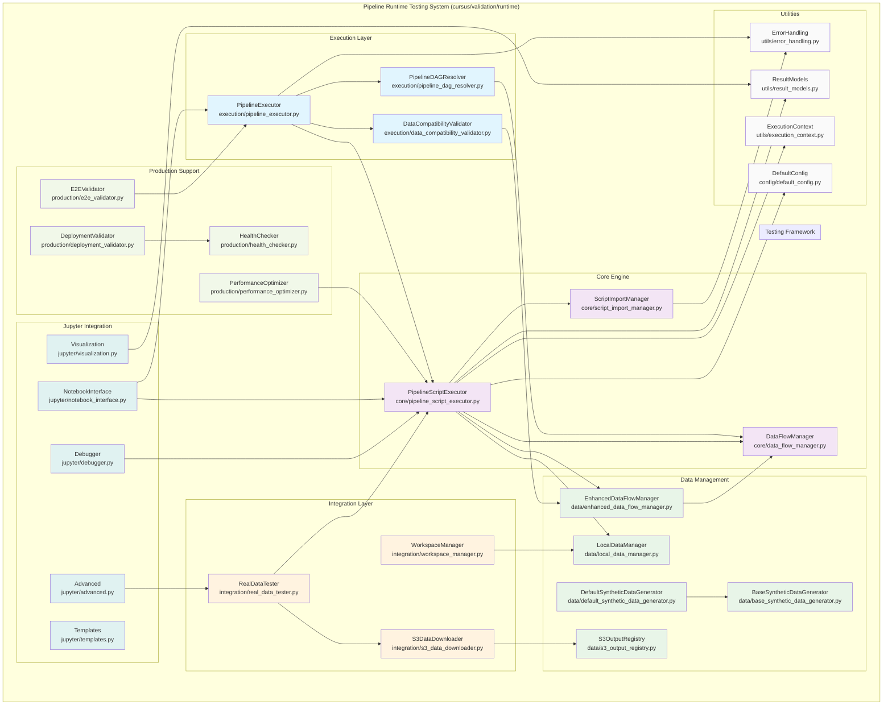

---
tags:
  - design
  - testing
  - runtime
  - pipeline_validation
  - master_document
keywords:
  - pipeline script testing
  - script functionality validation
  - data flow compatibility
  - end-to-end testing
  - master design
topics:
  - testing framework
  - pipeline validation
  - script integration
  - master design
language: python
date of note: 2025-08-21
---

# Pipeline Runtime Testing System - Master Design

**Date**: August 21, 2025  
**Status**: Design Phase  
**Priority**: High  
**Scope**: Master design document for comprehensive pipeline script functionality testing

## 🎯 Executive Summary

This master document presents the comprehensive design for a **Pipeline Runtime Testing System** that addresses the critical gap between DAG compilation and actual script execution validation in the Cursus pipeline system. The system provides multi-mode testing capabilities: **individual script isolation testing**, **end-to-end pipeline testing**, and **deep dive analysis** with both synthetic and real S3 data, all integrated into a Jupyter notebook environment.

## 📋 Problem Statement

### Current State Analysis

The Cursus package currently excels at:
1. **DAG Compilation**: Auto-compilation of DAG to SageMaker Pipeline
2. **Connectivity Validation**: Ensuring proper step connections and dependencies via alignment validation
3. **Builder Validation**: Testing step builder compliance and functionality
4. **Interface Validation**: Validating naming conventions and interfaces

### Critical Gaps Identified

#### 1. **Script Functionality Gap**
- **Issue**: No validation that scripts can actually execute successfully with real data
- **Risk**: Scripts may pass alignment validation but fail during actual execution
- **Impact**: Runtime failures, debugging complexity, production instability

#### 2. **Data Flow Compatibility Gap**
- **Issue**: Script A outputs data, Script B expects different data format/structure
- **Risk**: Data format mismatches cause pipeline failures in production
- **Impact**: Runtime failures, data quality issues, production reliability concerns

#### 3. **End-to-End Execution Gap**
- **Issue**: Individual scripts may work in isolation but fail when chained together
- **Risk**: Pipeline-level failures not caught during development
- **Impact**: Late issue discovery, complex debugging, production rollbacks

## 🏗️ Solution Architecture Overview

### System Architecture

The Pipeline Runtime Testing System implements a **multi-layer testing architecture** that leverages the consistent script interface pattern discovered in the Cursus codebase:



### Architecture Layers

The system is organized into **8 distinct layers** with clear separation of concerns:

#### **1. Execution Layer** (`execution/`)
- **High-level pipeline orchestration and DAG resolution**
- `PipelineExecutor`: End-to-end pipeline execution with data flow validation
- `PipelineDAGResolver`: DAG analysis, topological sorting, and execution planning

#### **2. Core Engine** (`core/`)
- **Individual script execution and management**
- `PipelineScriptExecutor`: Script execution orchestration
- `ScriptImportManager`: Dynamic script imports and execution
- `DataFlowManager`: Basic data flow tracking and management

#### **3. Data Management** (`data/`)
- **Data generation, management, and enhanced flow control**
- `BaseSyntheticDataGenerator` & `DefaultSyntheticDataGenerator`: Synthetic data generation
- `EnhancedDataFlowManager`: Advanced data flow management
- `LocalDataManager`: Local data file management
- `S3OutputRegistry`: S3 output path tracking

#### **4. Integration Layer** (`integration/`)
- **External system integration and workspace management**
- `RealDataTester`: Real data testing capabilities
- `S3DataDownloader`: S3 data retrieval and management
- `WorkspaceManager`: Test workspace organization

#### **5. Testing Framework** (`testing/`)
- **Specialized testing components and validation**
- Note: Core execution components (DataCompatibilityValidator, PipelineDAGResolver, PipelineExecutor) have been consolidated into the Execution Layer to eliminate architectural duplication and maintain proper dependency flow

#### **6. Production Support** (`production/`)
- **Production deployment and monitoring capabilities**
- `DeploymentValidator`: Production deployment validation
- `E2EValidator`: End-to-end production testing
- `HealthChecker`: System health monitoring
- `PerformanceOptimizer`: Performance optimization

#### **7. Jupyter Integration** (`jupyter/`)
- **Notebook interface and interactive capabilities**
- `NotebookInterface`: User-friendly Jupyter API
- `Visualization`: Rich visualization and reporting
- `Debugger`: Interactive debugging capabilities
- `Advanced`: Advanced analysis features
- `Templates`: Notebook templates

#### **8. Utilities** (`utils/` & `config/`)
- **Shared utilities and configuration**
- `ErrorHandling`: Specialized error types and handling
- `ExecutionContext`: Execution context management
- `ResultModels`: Result data models
- `DefaultConfig`: Default configuration settings

### Key Architectural Advantages

#### **1. Direct Function Call Execution**
The system leverages the consistent `main()` function signature found in all Cursus scripts:

```python
def main(
    input_paths: Dict[str, str], 
    output_paths: Dict[str, str], 
    environ_vars: Dict[str, str],
    job_args: argparse.Namespace
) -> Dict[str, Any]:
```

**Benefits**:
- **No subprocess overhead**: Direct Python function calls
- **Better error handling**: Python exceptions propagate naturally
- **Easier debugging**: Full stack traces and debugging capabilities
- **Memory efficiency**: Shared Python process, no container overhead

#### **2. Multi-Mode Testing Architecture**
- **Isolation Mode**: Test individual scripts with synthetic or real data
- **Pipeline Mode**: Test complete pipelines end-to-end
- **Deep Dive Mode**: Detailed analysis with real S3 pipeline outputs

#### **3. Flexible Data Sources**
- **Synthetic Data**: Generated locally for fast iteration
- **Local Real Data**: User-provided datasets stored on local filesystem
- **Real S3 Data**: Downloaded from actual pipeline executions for deep analysis
- **Hybrid Approach**: Combine all three sources for comprehensive testing

#### **4. Modern Data Handling**
- **Pydantic V2 Models**: Type-safe data validation and serialization
- **Runtime Type Checking**: Detect type errors early during testing
- **Self-documenting API**: Clear interface boundaries and validation

## 📦 Detailed Design Documents

This master design is supported by the following focused design documents:

### **System Overview**
- **[Pipeline Runtime Testing System Design](pipeline_runtime_testing_system_design.md)**: Comprehensive system design document with detailed technical specifications

### **Core System Components**
- **[Core Execution Engine Design](pipeline_runtime_core_engine_design.md)**: Detailed design for PipelineScriptExecutor, ScriptImportManager, and DataFlowManager
- **[Execution Layer Design](pipeline_runtime_execution_layer_design.md)**: High-level pipeline orchestration with PipelineExecutor and PipelineDAGResolver for end-to-end execution planning
- **[Data Management Layer Design](pipeline_runtime_data_management_design.md)**: Comprehensive design for synthetic data generation, S3 integration, and data compatibility validation
- **[S3 Output Path Management Design](pipeline_runtime_s3_output_path_management_design.md)**: Systematic S3 output path tracking and management for pipeline runtime testing
- **[Testing Modes Design](pipeline_runtime_testing_modes_design.md)**: Detailed design for isolation testing, pipeline testing, and deep dive analysis modes

### **Integration and User Experience**
- **[Jupyter Integration Design](pipeline_runtime_jupyter_integration_design.md)**: Complete design for notebook interface, visualization, and interactive debugging
- **[System Integration Design](pipeline_runtime_system_integration_design.md)**: Integration with existing Cursus components (configuration, contracts, DAG, validation)

### **Implementation and Operations**
- **[Usage Examples and API Design](pipeline_runtime_usage_examples_design.md)**: Comprehensive usage examples for Jupyter notebooks and CLI
- **[Reporting and Visualization Design](pipeline_runtime_reporting_design.md)**: Test result reporting, HTML generation, and visualization capabilities

### **Usage Examples and Documentation**
- **[Pipeline Runtime API Examples](pipeline_runtime_api_design.md)**: Comprehensive API design patterns and usage examples
- **[Pipeline Runtime Jupyter Examples](pipeline_runtime_jupyter_examples.md)**: Interactive Jupyter notebook examples for pipeline testing
- **[Pipeline Runtime CLI Examples](pipeline_runtime_cli_examples.md)**: Command-line interface usage examples and workflows
- **[Pipeline Runtime Python API Examples](pipeline_runtime_python_api_examples.md)**: Programmatic API usage with synthetic data generation
- **[Pipeline Runtime Configuration Examples](pipeline_runtime_configuration_examples.md)**: YAML configuration examples for different testing scenarios

### **Analysis and Research**
- **[Pipeline Runtime Testing Timing and Data Flow Analysis](../4_analysis/pipeline_runtime_testing_timing_and_data_flow_analysis.md)**: Comprehensive analysis of testing timing (pre-execution vs post-execution) and data flow requirements

## 🚀 Quick Start Examples

### Jupyter Notebook Usage
```python
from cursus.validation.runtime import PipelineTestingNotebook

# Initialize testing environment
tester = PipelineTestingNotebook()

# Test single script
result = tester.quick_test_script("currency_conversion")
result.display_summary()

# Test complete pipeline
pipeline_result = tester.quick_test_pipeline("xgb_training_simple")
pipeline_result.visualize_flow()
```

### CLI Usage
```bash
# Test single script
cursus runtime test-script currency_conversion

# Test pipeline end-to-end
cursus runtime test-pipeline xgb_training_simple

# Deep dive analysis with real S3 data
cursus runtime deep-dive-analysis --pipeline xgb_training_simple --s3-execution-arn arn:aws:sagemaker:...
```

## 📈 Success Metrics

### **Quantitative Success Criteria**
- **95%+ script execution success rate** with synthetic data
- **90%+ data flow compatibility rate** between connected scripts
- **85%+ end-to-end pipeline success rate**
- **< 10 minutes execution time** for full pipeline validation
- **95%+ issue detection rate** before production

### **Qualitative Success Criteria**
- **< 5 lines of code** for basic test scenarios in Jupyter
- **75% reduction in debugging time** for script execution issues
- **100% script coverage** with automated testing
- **Intuitive user experience** for data scientists and ML engineers

## 🔧 Integration with Existing Architecture

The system is designed as an **independent but complementary** addition to the existing Cursus validation ecosystem:

### **Complements Existing Validation**
- **Unified Alignment Tester**: Provides connectivity validation (this system adds functionality validation)
- **Universal Step Builder Test**: Validates builder compliance (this system validates script execution)
- **Interface Validation**: Validates naming conventions (this system validates actual behavior)

### **Leverages Existing Infrastructure**
- **Configuration System**: Uses existing config resolution for script setup
- **Contract System**: Leverages script contracts for input/output validation
- **DAG System**: Uses DAG structure for execution ordering
- **Registry System**: Integrates with step registry for script discovery

## 📚 Cross-References

### **Foundation Documents**
- **[Script Contract](script_contract.md)**: Script contract specifications that define testing interfaces
- **[Step Specification](step_specification.md)**: Step specification system that provides validation context
- **[Pipeline DAG](pipeline_dag.md)**: DAG structure that drives execution ordering

### **Existing Validation Framework Documents**
- **[Unified Alignment Tester Master Design](unified_alignment_tester_master_design.md)**: Existing validation system that complements script functionality testing
- **[Universal Step Builder Test](universal_step_builder_test.md)**: Builder testing framework that provides validation patterns

### **Architecture Integration Documents**
- **[Dependency Resolver](dependency_resolver.md)**: Dependency resolution system for execution planning
- **[Registry Manager](registry_manager.md)**: Component registry management system used for script discovery
- **[Validation Engine](validation_engine.md)**: Core validation framework for integration

### **Implementation Planning**
- **[Pipeline Runtime Testing Implementation Plan](../2_project_planning/2025-08-21_pipeline_runtime_testing_master_implementation_plan.md)**: Master implementation plan with detailed project roadmap

## 🎯 Conclusion

The Pipeline Runtime Testing System addresses the critical gap between DAG compilation/connectivity validation and actual script execution validation in the Cursus pipeline system. By providing comprehensive testing capabilities across multiple modes with both synthetic and real data sources, the system ensures that pipelines work correctly not just in terms of connectivity but also in terms of actual functionality.

### **Key Benefits**
- **Risk Reduction**: Early detection of script execution and data compatibility issues
- **Development Efficiency**: Faster debugging and automated test discovery
- **Production Reliability**: Data quality assurance and performance validation
- **Developer Experience**: Intuitive Jupyter integration and one-liner APIs

### **Strategic Value**
The system provides a foundation for reliable, scalable pipeline development by ensuring that scripts work correctly both individually and as part of the integrated pipeline ecosystem. The modular design allows for incremental adoption and extension, making it suitable for both immediate needs and long-term strategic goals.

---

**Master Design Document Status**: Complete  
**Next Steps**: Review detailed design documents and proceed with implementation planning  
**Related Implementation Plan**: [Pipeline Runtime Testing Master Implementation Plan](../2_project_planning/2025-08-21_pipeline_runtime_testing_master_implementation_plan.md)
