---
tags:
  - design
  - implementation
  - semi_supervised_learning
  - data_merging
  - script_separation
keywords:
  - pseudo label merge
  - data augmentation
  - split handling
  - schema alignment
  - provenance tracking
topics:
  - semi-supervised learning
  - data merging
  - script modularity
language: python
date of note: 2025-11-17
---

# Pseudo Label Merge Script Design

## What is the Purpose of the Pseudo Label Merge Script?

The Pseudo Label Merge Script serves as a **unified data combination engine** that intelligently merges original labeled training data with pseudo-labeled or augmented samples for Semi-Supervised Learning (SSL) and Active Learning workflows.

### Core Purpose

The script addresses a critical challenge in SSL/AL pipelines: **combining datasets with different structures and origins** while maintaining:
- **Split integrity** - Preserve train/test/val boundaries
- **Schema compatibility** - Handle column mismatches gracefully
- **Data provenance** - Track sample origins (original vs pseudo-labeled)
- **Format consistency** - Maintain data formats throughout pipeline

### Two Primary Job Type Variants

#### Variant 1: Training Job (Split-Aware Merge)
**Input Structure**: Base data (original labeled) has train/test/val splits, augmentation data (pseudo-labeled) is a single dataset

**Challenge**: How to distribute augmentation data across splits without causing data leakage?

**Solution**: Proportional split distribution - augmentation data is split using the same ratios as base data, then each split is merged separately.

**Use Case**: Fine-tuning models on combined labeled + pseudo-labeled data

#### Variant 2: Non-Training Jobs (Simple Merge)
**Input Structure**: Both base data and augmentation data are single datasets

**Challenge**: How to combine datasets with potentially different schemas?

**Solution**: Simple concatenation with schema alignment and provenance tracking.

**Use Cases**: Validation, testing, calibration with augmented data

---

**The core purpose is to:**
1. **Detect input structure** - Identify split-aware vs simple merge scenarios
2. **Align schemas** - Handle column differences between base and augmentation data
3. **Distribute augmentation** - Split augmentation data proportionally (training job only)
4. **Merge datasets** - Combine with provenance tracking
5. **Preserve formats** - Maintain CSV/TSV/Parquet formats
6. **Output structured data** - Generate train/test/val subdirectories or single output

**Upstream Data Sources:**

**Base Training Data** (Original labeled data):
- TabularPreprocessing - Most common source with train/test/val splits
- FeatureSelection - After feature selection
- MissingValueImputation - After imputation
- TemporalFeatureEngineering - After temporal features
- CradleDataLoading - Direct data loading

**Augmentation Data** (Pseudo-labeled or high-value samples):
- ActiveSampleSelection - SSL selected high-confidence samples
- XGBoost/LightGBM/PyTorchModelInference - Model predictions
- BedrockBatchProcessing - LLM predictions
- LabelRulesetExecution - Rule-based labels

## Core Design Principles

The Pseudo Label Merge Script is built on several key design principles:

1. **Job Type Awareness** - Automatically detect and handle split-aware vs simple merge scenarios
2. **Input Flexibility** - Accept data from multiple preprocessing and inference sources
3. **Split Integrity** - Maintain train/test/val boundaries to prevent data leakage
4. **Schema Compatibility** - Gracefully handle column differences and type mismatches
5. **Provenance Tracking** - Track data source for each sample (original vs pseudo-labeled)
6. **Format Preservation** - Detect and maintain input data formats (CSV/TSV/Parquet)
7. **Testability** - Clean separation of concerns following testability guidelines
8. **Reproducibility** - Deterministic splits with seed control

## Architecture Overview

The pseudo label merge script architecture consists of six main components:

```mermaid
graph TD
    subgraph "📥 Data Loading Component"
        BaseLoader["Base Data Loader<br/>• Auto-detect splits<br/>• Format detection<br/>• Load train/test/val OR single"]
        AugLoader["Augmentation Data Loader<br/>• Single dataset input<br/>• Format detection<br/>• Schema extraction"]
    end
    
    subgraph "🔍 Split Detection Component"
        SplitDetector["Split Structure Detector<br/>• Job type identification<br/>• Directory structure analysis<br/>• Split ratio extraction"]
    end
    
    subgraph "🔧 Schema Alignment Component"
        SchemaAligner["Schema Aligner<br/>• Column matching<br/>• Label conversion<br/>• Common columns extraction<br/>• Type compatibility"]
    end
    
    subgraph "🎯 Merge Strategy Component"
        StrategyRouter["Merge Strategy Router<br/>• Training: split-aware<br/>• Non-training: simple"]
        SplitMerger["Split-Aware Merger<br/>• Proportional distribution<br/>• Stratified splits<br/>• Per-split merging"]
        SimpleMerger["Simple Merger<br/>• Concatenation<br/>• Provenance addition"]
    end
    
    subgraph "🏷️ Provenance Tracking Component"
        ProvenanceTracker["Provenance Tracker<br/>• data_source column<br/>• Confidence preservation<br/>• Sample ID tracking"]
    end
    
    subgraph "💾 Output Management Component"
        OutputManager["Output Manager<br/>• Split-aware output<br/>• Format preservation<br/>• Metadata generation"]
    end
    
    BaseLoader --> SplitDetector
    AugLoader --> SchemaAligner
    SplitDetector --> StrategyRouter
    SchemaAligner --> StrategyRouter
    
    StrategyRouter --> SplitMerger
    StrategyRouter --> SimpleMerger
    
    SplitMerger --> ProvenanceTracker
    SimpleMerger --> ProvenanceTracker
    
    ProvenanceTracker --> OutputManager
    
    subgraph "📊 Input Channels"
        BaseChannel["Base Training Data<br/>/opt/ml/processing/input/base_training_data<br/>• From: TabularPreprocessing<br/>• From: FeatureSelection<br/>• From: CradleDataLoading<br/>• Structure: train/test/val OR single"]
        AugChannel["Augmentation Data<br/>/opt/ml/processing/input/augmentation_data<br/>• From: ActiveSampleSelection<br/>• From: Model Inference<br/>• From: LLM Inference<br/>• From: Ruleset Execution<br/>• Structure: Single dataset"]
    end
    
    subgraph "📈 Output Channel"
        OutputChannel["Merged Training Data<br/>/opt/ml/processing/output/merged_training_data<br/>• Structure: Mirrors base structure<br/>• Contains: original + pseudo-labeled<br/>• Provenance: tracked per sample"]
    end
    
    BaseChannel --> BaseLoader
    AugChannel --> AugLoader
    OutputManager --> OutputChannel
```



## Core Components

### 1. Data Loading Component

The loading component handles data from multiple sources with varying structures:

```python
def load_base_training_data(
    base_data_dir: str,
    job_type: str,
) -> Dict[str, pd.DataFrame]:
    """
    Load base training data, detecting split structure automatically.
    
    Args:
        base_data_dir: Path to base training data directory
        job_type: Job type (training, validation, testing, calibration)
        
    Returns:
        Dictionary mapping split names to DataFrames
        - Training job: {"train": df, "test": df, "val": df}
        - Other jobs: {job_type: df}
    """
    base_path = Path(base_data_dir)
    
    # Check for split structure (training job)
    if job_type == "training":
        # Look for train/test/val subdirectories
        train_dir = base_path / "train"
        test_dir = base_path / "test"
        val_dir = base_path / "val"
        
        if train_dir.exists() and test_dir.exists() and val_dir.exists():
            logger.info("Detected split structure (train/test/val)")
            return {
                "train": _load_split_data(train_dir, "train"),
                "test": _load_split_data(test_dir, "test"),
                "val": _load_split_data(val_dir, "val"),
            }
        else:
            # Fall back to single dataset
            logger.warning(
                f"Expected train/test/val splits for training job, "
                f"but found single dataset. Using simple merge."
            )
            return {job_type: _load_single_dataset(base_path)}
    else:
        # Non-training jobs: single dataset in job_type subdirectory
        job_dir = base_path / job_type
        if job_dir.exists():
            logger.info(f"Loading single dataset from {job_type} directory")
            return {job_type: _load_split_data(job_dir, job_type)}
        else:
            # Fall back to root directory
            logger.info(f"Loading single dataset from root directory")
            return {job_type: _load_single_dataset(base_path)}


def _load_split_data(
    split_dir: Path,
    split_name: str,
) -> pd.DataFrame:
    """
    Load data from a specific split directory.
    
    Expected file patterns:
    - {split_name}_processed_data.csv
    - {split_name}_processed_data.tsv
    - {split_name}_processed_data.parquet
    - part-*.csv (for sharded data)
    """
    # Try specific file names first
    for ext in [".csv", ".tsv", ".parquet"]:
        file_path = split_dir / f"{split_name}_processed_data{ext}"
        if file_path.exists():
            return _read_file(file_path)
    
    # Fall back to pattern matching
    csv_files = list(split_dir.glob("*.csv"))
    tsv_files = list(split_dir.glob("*.tsv"))
    parquet_files = list(split_dir.glob("*.parquet"))
    
    if parquet_files:
        return _read_file(parquet_files[0])
    elif csv_files:
        return _read_file(csv_files[0])
    elif tsv_files:
        return _read_file(tsv_files[0])
    else:
        raise FileNotFoundError(
            f"No data files found in {split_dir}"
        )


def _load_single_dataset(data_dir: Path) -> pd.DataFrame:
    """Load data from directory (may contain shards)."""
    # Check for sharded data
    csv_shards = list(data_dir.glob("part-*.csv"))
    parquet_shards = list(data_dir.glob("part-*.parquet"))
    
    if csv_shards or parquet_shards:
        # Combine shards
        all_shards = sorted(csv_shards + parquet_shards)
        dfs = [_read_file(shard) for shard in all_shards]
        return pd.concat(dfs, ignore_index=True)
    
    # Single file
    for pattern in ["*.parquet", "*.csv", "*.tsv"]:
        files = list(data_dir.glob(pattern))
        if files:
            return _read_file(files[0])
    
    raise FileNotFoundError(f"No data files found in {data_dir}")


def _detect_file_format(file_path: Path) -> str:
    """
    Detect the format of a data file based on its extension.
    
    Implements the format preservation pattern - see data_format_preservation_patterns.md
    
    Args:
        file_path: Path to the file
        
    Returns:
        Format string: 'csv', 'tsv', or 'parquet'
    """
    suffix = file_path.suffix.lower()
    
    if suffix == ".csv":
        return "csv"
    elif suffix == ".tsv":
        return "tsv"
    elif suffix == ".parquet":
        return "parquet"
    else:
        raise RuntimeError(f"Unsupported file format: {suffix}")


def load_dataframe_with_format(file_path: Path) -> Tuple[pd.DataFrame, str]:
    """
    Load DataFrame and detect its format.
    
    Implements the format preservation pattern - see data_format_preservation_patterns.md
    
    Args:
        file_path: Path to the file
        
    Returns:
        Tuple of (DataFrame, format_string)
    """
    detected_format = _detect_file_format(file_path)
    
    if detected_format == "csv":
        df = pd.read_csv(file_path)
    elif detected_format == "tsv":
        df = pd.read_csv(file_path, sep="\t")
    elif detected_format == "parquet":
        df = pd.read_parquet(file_path)
    else:
        raise RuntimeError(f"Unsupported format: {detected_format}")
    
    logger.info(f"Loaded {len(df)} rows from {file_path} (format: {detected_format})")
    return df, detected_format


def save_dataframe_with_format(
    df: pd.DataFrame, 
    output_path: Path, 
    format_str: str
) -> Path:
    """
    Save DataFrame in specified format.
    
    Implements the format preservation pattern - see data_format_preservation_patterns.md
    
    Args:
        df: DataFrame to save
        output_path: Base output path (without extension)
        format_str: Format to save in ('csv', 'tsv', or 'parquet')
        
    Returns:
        Path to saved file
    """
    if format_str == "csv":
        file_path = output_path.with_suffix(".csv")
        df.to_csv(file_path, index=False)
    elif format_str == "tsv":
        file_path = output_path.with_suffix(".tsv")
        df.to_csv(file_path, sep="\t", index=False)
    elif format_str == "parquet":
        file_path = output_path.with_suffix(".parquet")
        df.to_parquet(file_path, index=False)
    else:
        raise RuntimeError(f"Unsupported output format: {format_str}")
    
    logger.info(f"Saved {len(df)} rows to {file_path} (format: {format_str})")
    return file_path


def _read_file(file_path: Path) -> pd.DataFrame:
    """
    Read file based on extension (backward compatibility wrapper).
    
    Note: Prefer load_dataframe_with_format() for format preservation.
    """
    df, _ = load_dataframe_with_format(file_path)
    return df


def load_augmentation_data(
    aug_data_dir: str,
) -> pd.DataFrame:
    """
    Load augmentation data (always single dataset).
    
    Args:
        aug_data_dir: Path to augmentation data directory
        
    Returns:
        DataFrame with augmentation samples
    """
    aug_path = Path(aug_data_dir)
    
    # Try common file names
    for filename in ["selected_samples", "predictions", "labeled_data"]:
        for ext in [".parquet", ".csv", ".tsv"]:
            file_path = aug_path / f"{filename}{ext}"
            if file_path.exists():
                logger.info(f"Loading augmentation data from {file_path}")
                return _read_file(file_path)
    
    # Fall back to any data file
    return _load_single_dataset(aug_path)
```

### 2. Split Detection Component

The split detector analyzes directory structure and determines merge strategy:

```python
def detect_merge_strategy(
    base_splits: Dict[str, pd.DataFrame],
    job_type: str,
) -> str:
    """
    Determine merge strategy based on input structure.
    
    Args:
        base_splits: Dictionary of base data splits
        job_type: Job type
        
    Returns:
        "split_aware" or "simple"
    """
    # Training job with 3 splits → split-aware merge
    if (
        job_type == "training" 
        and set(base_splits.keys()) == {"train", "test", "val"}
    ):
        logger.info("Using split-aware merge strategy")
        return "split_aware"
    
    # All other cases → simple merge
    logger.info("Using simple merge strategy")
    return "simple"


def extract_split_ratios(
    base_splits: Dict[str, pd.DataFrame],
) -> Dict[str, float]:
    """
    Calculate split proportions from base data.
    
    Args:
        base_splits: Dictionary with train/test/val splits
        
    Returns:
        Dictionary with split proportions summing to 1.0
    """
    total = sum(len(df) for df in base_splits.values())
    
    return {
        name: len(df) / total 
        for name, df in base_splits.items()
    }
```

### 3. Schema Alignment Component

The schema aligner handles column differences between datasets:

```python
def align_schemas(
    base_df: pd.DataFrame,
    aug_df: pd.DataFrame,
    label_field: str,
    pseudo_label_column: str = "pseudo_label",
    id_field: str = "id",
) -> Tuple[pd.DataFrame, pd.DataFrame]:
    """
    Align schemas between base and augmentation data.
    
    Handles:
    - Label column conversion (pseudo_label → label)
    - Common columns extraction
    - Data type compatibility
    
    Args:
        base_df: Base training data
        aug_df: Augmentation data
        label_field: Label column name
        pseudo_label_column: Pseudo-label column name in augmentation
        id_field: ID column name
        
    Returns:
        Tuple of (aligned_base_df, aligned_aug_df)
    """
    # Copy to avoid modifying originals
    base_aligned = base_df.copy()
    aug_aligned = aug_df.copy()
    
    # Handle label column conversion
    if pseudo_label_column in aug_aligned.columns:
        if label_field not in aug_aligned.columns:
            # Convert pseudo_label to label
            aug_aligned[label_field] = aug_aligned[pseudo_label_column]
            logger.info(
                f"Converted '{pseudo_label_column}' to '{label_field}' "
                f"in augmentation data"
            )
        # Drop pseudo_label column to avoid duplication
        aug_aligned = aug_aligned.drop(columns=[pseudo_label_column])
    
    # Ensure label field exists in augmentation data
    if label_field not in aug_aligned.columns:
        raise ValueError(
            f"Label field '{label_field}' not found in augmentation data. "
            f"Available columns: {aug_aligned.columns.tolist()}"
        )
    
    # Find common columns
    common_columns = sorted(
        set(base_aligned.columns) & set(aug_aligned.columns)
    )
    
    # Ensure essential columns are present
    if id_field not in common_columns:
        logger.warning(f"ID field '{id_field}' not in common columns")
    
    if label_field not in common_columns:
        raise ValueError(
            f"Label field '{label_field}' not found in both datasets"
        )
    
    logger.info(
        f"Schema alignment: {len(common_columns)} common columns "
        f"(base: {len(base_aligned.columns)}, aug: {len(aug_aligned.columns)})"
    )
    
    # Select only common columns
    base_aligned = base_aligned[common_columns]
    aug_aligned = aug_aligned[common_columns]
    
    # Align data types
    for col in common_columns:
        if base_aligned[col].dtype != aug_aligned[col].dtype:
            # Try to convert to common type
            try:
                common_type = _infer_common_dtype(
                    base_aligned[col].dtype,
                    aug_aligned[col].dtype
                )
                base_aligned[col] = base_aligned[col].astype(common_type)
                aug_aligned[col] = aug_aligned[col].astype(common_type)
                logger.debug(
                    f"Aligned dtype for column '{col}': {common_type}"
                )
            except Exception as e:
                logger.warning(
                    f"Could not align dtype for column '{col}': {e}"
                )
    
    return base_aligned, aug_aligned


def _infer_common_dtype(dtype1, dtype2):
    """Infer common data type for two columns."""
    # Numeric types
    if pd.api.types.is_numeric_dtype(dtype1) and pd.api.types.is_numeric_dtype(dtype2):
        # Use float if either is float
        if pd.api.types.is_float_dtype(dtype1) or pd.api.types.is_float_dtype(dtype2):
            return "float64"
        else:
            return "int64"
    
    # String types
    if pd.api.types.is_string_dtype(dtype1) or pd.api.types.is_string_dtype(dtype2):
        return "object"
    
    # Default: use first type
    return dtype1
```

### 4. Merge Strategy Component

The merge strategy component implements both split-aware and simple merging:

#### 4.1 Split-Aware Merge (Training Job)

```python
def merge_with_splits(
    base_splits: Dict[str, pd.DataFrame],
    augmentation_df: pd.DataFrame,
    label_field: str,
    train_ratio: Optional[float] = None,
    test_val_ratio: Optional[float] = None,
    stratify: bool = True,
    random_seed: int = 42,
    preserve_confidence: bool = True,
) -> Dict[str, pd.DataFrame]:
    """
    Merge with proportional augmentation distribution across splits.
    
    Strategy:
    1. Auto-infer split ratios from base data (or use manual ratios if provided)
    2. Split augmentation data using calculated proportions
    3. Add provenance to all datasets
    4. Merge corresponding splits
    5. Return merged splits maintaining structure
    
    Args:
        base_splits: Dictionary with train/test/val DataFrames
        augmentation_df: Augmentation data to distribute
        label_field: Label column name for stratification
        train_ratio: Optional proportion for train split (None = auto-infer from base)
        test_val_ratio: Optional test vs val proportion of holdout (None = auto-infer)
        stratify: Use stratified splits if True
        random_seed: Random seed for reproducibility
        preserve_confidence: Keep confidence scores if present
        
    Returns:
        Dictionary with merged train/test/val DataFrames
    """
    logger.info(
        f"Starting split-aware merge: "
        f"base splits={list(base_splits.keys())}, "
        f"augmentation samples={len(augmentation_df)}"
    )
    
    # Determine split strategy: auto-infer or manual
    if train_ratio is None:
        # Auto-infer ratios from base data (RECOMMENDED)
        logger.info("Auto-inferring split ratios from base data")
        ratios = extract_split_ratios(base_splits)
        logger.info(f"Auto-inferred ratios: {ratios}")
        
        # Split augmentation using actual base ratios
        aug_splits = _split_by_ratios(
            augmentation_df,
            ratios=ratios,
            label_field=label_field,
            stratify=stratify,
            random_seed=random_seed,
        )
    else:
        # Use manual ratios (backward compatibility)
        logger.info(f"Using manual ratios: train={train_ratio}, test_val={test_val_ratio}")
        
        # Two-step split: train vs holdout, then test vs val
        if stratify and label_field in augmentation_df.columns:
            aug_train, aug_holdout = train_test_split(
                augmentation_df,
                train_size=train_ratio,
                random_state=random_seed,
                stratify=augmentation_df[label_field]
            )
            
            aug_test, aug_val = train_test_split(
                aug_holdout,
                test_size=test_val_ratio,
                random_state=random_seed,
                stratify=aug_holdout[label_field]
            )
        else:
            aug_train, aug_holdout = train_test_split(
                augmentation_df,
                train_size=train_ratio,
                random_state=random_seed
            )
            
            aug_test, aug_val = train_test_split(
                aug_holdout,
                test_size=test_val_ratio,
                random_state=random_seed
            )
        
        aug_splits = {
            "train": aug_train,
            "test": aug_test,
            "val": aug_val,
        }
    
    logger.info(
        f"Augmentation split sizes: "
        f"train={len(aug_splits['train'])}, "
        f"test={len(aug_splits['test'])}, "
        f"val={len(aug_splits['val'])}"
    )
    
    # Merge each split with provenance
    merged_splits = {}
    for split_name in ["train", "test", "val"]:
        base_df = base_splits[split_name].copy()
        aug_df = aug_splits[split_name].copy()
        
        # Add provenance
        base_df["data_source"] = "original"
        aug_df["data_source"] = "pseudo_labeled"
        
        # Remove confidence columns from base if not preserving
        if not preserve_confidence:
            confidence_cols = [
                col for col in aug_df.columns 
                if "confidence" in col.lower() or "score" in col.lower()
            ]
            if confidence_cols:
                aug_df = aug_df.drop(columns=confidence_cols)
        
        # Combine
        merged_df = pd.concat([base_df, aug_df], ignore_index=True)
        
        logger.info(
            f"Merged {split_name}: "
            f"base={len(base_df)}, aug={len(aug_df)}, "
            f"total={len(merged_df)}"
        )
        
        merged_splits[split_name] = merged_df
    
    return merged_splits


def _split_by_ratios(
    df: pd.DataFrame,
    ratios: Dict[str, float],
    label_field: str,
    stratify: bool = True,
    random_seed: int = 42,
) -> Dict[str, pd.DataFrame]:
    """
    Split DataFrame into three parts using specified ratios.
    
    This is the core function for auto-inferred split distribution.
    
    Args:
        df: DataFrame to split
        ratios: Dictionary with split ratios (e.g., {"train": 0.7, "test": 0.15, "val": 0.15})
        label_field: Label column for stratification
        stratify: Use stratified splits if True
        random_seed: Random seed for reproducibility
        
    Returns:
        Dictionary mapping split names to DataFrames
    """
    # Ensure ratios sum to 1.0
    total_ratio = sum(ratios.values())
    if not abs(total_ratio - 1.0) < 1e-6:
        logger.warning(f"Ratios sum to {total_ratio}, normalizing to 1.0")
        ratios = {k: v / total_ratio for k, v in ratios.items()}
    
    # For three-way split, we need to do two sequential splits
    # First split: train vs (test+val)
    train_ratio = ratios.get("train", 0.7)
    test_ratio = ratios.get("test", 0.15)
    val_ratio = ratios.get("val", 0.15)
    
    if stratify and label_field in df.columns:
        # Stratified three-way split
        train_df, holdout_df = train_test_split(
            df,
            train_size=train_ratio,
            random_state=random_seed,
            stratify=df[label_field]
        )
        
        # Second split: test vs val from holdout
        # Calculate test proportion of holdout
        test_proportion = test_ratio / (test_ratio + val_ratio)
        
        test_df, val_df = train_test_split(
            holdout_df,
            train_size=test_proportion,
            random_state=random_seed,
            stratify=holdout_df[label_field]
        )
    else:
        # Non-stratified three-way split
        train_df, holdout_df = train_test_split(
            df,
            train_size=train_ratio,
            random_state=random_seed
        )
        
        test_proportion = test_ratio / (test_ratio + val_ratio)
        
        test_df, val_df = train_test_split(
            holdout_df,
            train_size=test_proportion,
            random_state=random_seed
        )
    
    logger.info(
        f"Split by ratios: train={len(train_df)} ({train_ratio:.1%}), "
        f"test={len(test_df)} ({test_ratio:.1%}), "
        f"val={len(val_df)} ({val_ratio:.1%})"
    )
    
    return {
        "train": train_df,
        "test": test_df,
        "val": val_df,
    }


def merge_simple(
    base_df: pd.DataFrame,
    augmentation_df: pd.DataFrame,
    preserve_confidence: bool = True,
) -> pd.DataFrame:
    """
    Simple merge for non-training job types.
    
    Args:
        base_df: Base dataset
        augmentation_df: Augmentation dataset
        preserve_confidence: Keep confidence scores if present
        
    Returns:
        Merged DataFrame with provenance
    """
    logger.info(
        f"Starting simple merge: "
        f"base samples={len(base_df)}, "
        f"augmentation samples={len(augmentation_df)}"
    )
    
    base_merged = base_df.copy()
    aug_merged = augmentation_df.copy()
    
    # Add provenance
    base_merged["data_source"] = "original"
    aug_merged["data_source"] = "pseudo_labeled"
    
    # Remove confidence columns from augmentation if not preserving
    if not preserve_confidence:
        confidence_cols = [
            col for col in aug_merged.columns 
            if "confidence" in col.lower() or "score" in col.lower()
        ]
        if confidence_cols:
            aug_merged = aug_merged.drop(columns=confidence_cols)
            logger.info(f"Removed confidence columns: {confidence_cols}")
    
    # Combine
    merged_df = pd.concat([base_merged, aug_merged], ignore_index=True)
    
    logger.info(
        f"Merge complete: total={len(merged_df)} "
        f"(original={len(base_df)}, pseudo={len(augmentation_df)})"
    )
    
    return merged_df
```

### 5. Provenance Tracking Component

Provenance tracking is integrated into merge operations:

```python
def add_provenance_metadata(
    df: pd.DataFrame,
    source: str,
    id_field: str = "id",
) -> pd.DataFrame:
    """
    Add provenance metadata to DataFrame.
    
    Args:
        df: DataFrame to annotate
        source: Data source label ("original" or "pseudo_labeled")
        id_field: ID column name
        
    Returns:
        DataFrame with provenance column
    """
    df_with_provenance = df.copy()
    df_with_provenance["data_source"] = source
    
    # Move data_source to position after ID if ID exists
    if id_field in df_with_provenance.columns:
        cols = df_with_provenance.columns.tolist()
        id_idx = cols.index(id_field)
        cols.remove("data_source")
        cols.insert(id_idx + 1, "data_source")
        df_with_provenance = df_with_provenance[cols]
    
    return df_with_provenance


def validate_provenance(
    merged_df: pd.DataFrame,
    expected_sources: set = {"original", "pseudo_labeled"},
) -> bool:
    """Validate provenance column in merged data."""
    if "data_source" not in merged_df.columns:
        logger.warning("Provenance column 'data_source' not found")
        return False
    
    actual_sources = set(merged_df["data_source"].unique())
    
    if not actual_sources.issubset(expected_sources):
        logger.warning(
            f"Unexpected data sources: {actual_sources - expected_sources}"
        )
        return False
    
    logger.info(f"Provenance validation passed: {actual_sources}")
    return True
```

### 6. Output Management Component

The output component handles split-aware or simple output structure:

```python
def save_merged_data(
    merged_splits: Dict[str, pd.DataFrame],
    output_dir: str,
    output_format: str = "csv",
    job_type: str = "training",
) -> Dict[str, str]:
    """
    Save merged data maintaining input structure.
    
    Args:
        merged_splits: Dictionary of merged DataFrames by split
        output_dir: Output directory path
        output_format: "csv", "tsv", or "parquet"
        job_type: Job type for file naming
        
    Returns:
        Dictionary mapping split names to output file paths
    """
    output_path = Path(output_dir)
    output_path.mkdir(parents=True, exist_ok=True)
    
    output_paths = {}
    
    for split_name, split_df in merged_splits.items():
        # Create split subdirectory
        split_dir = output_path / split_name
        split_dir.mkdir(exist_ok=True)
        
        # Determine file name and extension
        if output_format.lower() == "parquet":
            filename = f"{split_name}_processed_data.parquet"
            file_path = split_dir / filename
            split_df.to_parquet(file_path, index=False)
            
        elif output_format.lower() == "tsv":
            filename = f"{split_name}_processed_data.tsv"
            file_path = split_dir / filename
            split_df.to_csv(file_path, sep="\t", index=False)
            
        else:  # default: csv
            filename = f"{split_name}_processed_data.csv"
            file_path = split_dir / filename
            split_df.to_csv(file_path, index=False)
        
        output_paths[split_name] = str(file_path)
        logger.info(
            f"Saved {split_name} split: {file_path} "
            f"(format={output_format}, shape={split_df.shape})"
        )
    
    return output_paths


def save_merge_metadata(
    output_dir: str,
    metadata: Dict[str, Any],
) -> str:
    """
    Save merge operation metadata.
    
    Args:
        output_dir: Output directory
        metadata: Metadata dictionary
        
    Returns:
        Path to metadata file
    """
    metadata_path = Path(output_dir) / "merge_metadata.json"
    
    with open(metadata_path, "w") as f:
        json.dump(metadata, f, indent=2)
    
    logger.info(f"Saved merge metadata: {metadata_path}")
    return str(metadata_path)
```

## Script Testability Interface

Following the testability guidelines, the script implements a clean main interface:

```python
def main(
    input_paths: Dict[str, str],
    output_paths: Dict[str, str],
    environ_vars: Dict[str, str],
    job_args: argparse.Namespace,
) -> Dict[str, pd.DataFrame]:
    """
    Main function for pseudo label merge.
    
    Args:
        input_paths: Dictionary with keys:
            - base_training_data: Path to base labeled data
            - augmentation_data: Path to augmentation data
        output_paths: Dictionary with keys:
            - merged_training_data: Path for merged output
        environ_vars: Dictionary with environment variables:
            - LABEL_FIELD: Label column name (REQUIRED)
            - ADD_PROVENANCE: Track data source (default: "true")
            - OUTPUT_FORMAT: Output format (default: "csv")
            - TRAIN_RATIO: Train split proportion (default: "0.7")
            - TEST_VAL_RATIO: Test vs val proportion (default: "0.5")
            - PSEUDO_LABEL_COLUMN: Pseudo-label column name (default: "pseudo_label")
            - ID_FIELD: ID column name (default: "id")
            - PRESERVE_CONFIDENCE: Keep confidence scores (default: "true")
            - STRATIFY: Use stratified splits (default: "true")
            - RANDOM_SEED: Random seed (default: "42")
        job_args: Command-line arguments:
            - job_type: Type of merge job (training, validation, testing, calibration)
    
    Returns:
        Dictionary of merged DataFrames by split name
    """
    # Extract configuration
    job_type = job_args.job_type
    label_field = environ_vars.get("LABEL_FIELD")
    if not label_field:
        raise ValueError("LABEL_FIELD environment variable is required")
    
    add_provenance = environ_vars.get("ADD_PROVENANCE", "true").lower() == "true"
    output_format = environ_vars.get("OUTPUT_FORMAT", "csv")
    train_ratio = float(environ_vars.get("TRAIN_RATIO", "0.7"))
    test_val_ratio = float(environ_vars.get("TEST_VAL_RATIO", "0.5"))
    pseudo_label_column = environ_vars.get("PSEUDO_LABEL_COLUMN", "pseudo_label")
    id_field = environ_vars.get("ID_FIELD", "id")
    preserve_confidence = environ_vars.get("PRESERVE_CONFIDENCE", "true").lower() == "true"
    stratify = environ_vars.get("STRATIFY", "true").lower() == "true"
    random_seed = int(environ_vars.get("RANDOM_SEED", "42"))
    
    logger.info(f"Starting pseudo label merge with parameters:")
    logger.info(f"  Job Type: {job_type}")
    logger.info(f"  Label Field: {label_field}")
    logger.info(f"  Train Ratio: {train_ratio}")
    logger.info(f"  Test/Val Ratio: {test_val_ratio}")
    logger.info(f"  Output Format: {output_format}")
    
    # Load base training data
    logger.info(f"Loading base training data from {input_paths['base_training_data']}")
    base_splits = load_base_training_data(
        base_data_dir=input_paths["base_training_data"],
        job_type=job_type,
    )
    logger.info(f"Loaded base data with splits: {list(base_splits.keys())}")
    
    # Load augmentation data
    logger.info(f"Loading augmentation data from {input_paths['augmentation_data']}")
    augmentation_df = load_augmentation_data(
        aug_data_dir=input_paths["augmentation_data"]
    )
    logger.info(f"Loaded {len(augmentation_df)} augmentation samples")
    
    # Detect merge strategy
    merge_strategy = detect_merge_strategy(base_splits, job_type)
    logger.info(f"Selected merge strategy: {merge_strategy}")
    
    # Perform merge based on strategy
    if merge_strategy == "split_aware":
        # Split-aware merge for training job
        logger.info("Performing split-aware merge")
        
        # Align schemas for each split
        merged_splits = {}
        for split_name, base_df in base_splits.items():
            base_aligned, aug_aligned = align_schemas(
                base_df=base_df,
                aug_df=augmentation_df,
                label_field=label_field,
                pseudo_label_column=pseudo_label_column,
                id_field=id_field,
            )
            # Store aligned augmentation for split distribution
            augmentation_df = aug_aligned
            break  # Only need to align once
        
        # Perform split-aware merge
        merged_splits = merge_with_splits(
            base_splits=base_splits,
            augmentation_df=augmentation_df,
            label_field=label_field,
            train_ratio=train_ratio,
            test_val_ratio=test_val_ratio,
            stratify=stratify,
            random_seed=random_seed,
            preserve_confidence=preserve_confidence,
        )
    else:
        # Simple merge for non-training jobs
        logger.info("Performing simple merge")
        
        # Get single split
        split_name = list(base_splits.keys())[0]
        base_df = base_splits[split_name]
        
        # Align schemas
        base_aligned, aug_aligned = align_schemas(
            base_df=base_df,
            aug_df=augmentation_df,
            label_field=label_field,
            pseudo_label_column=pseudo_label_column,
            id_field=id_field,
        )
        
        # Perform simple merge
        merged_df = merge_simple(
            base_df=base_aligned,
            augmentation_df=aug_aligned,
            preserve_confidence=preserve_confidence,
        )
        
        merged_splits = {split_name: merged_df}
    
    # Validate provenance if added
    if add_provenance:
        for split_name, merged_df in merged_splits.items():
            validate_provenance(merged_df)
    
    # Save merged data
    logger.info(f"Saving merged data to {output_paths['merged_training_data']}")
    output_file_paths = save_merged_data(
        merged_splits=merged_splits,
        output_dir=output_paths["merged_training_data"],
        output_format=output_format,
        job_type=job_type,
    )
    
    # Generate and save metadata
    metadata = {
        "job_type": job_type,
        "merge_strategy": merge_strategy,
        "base_splits": {
            name: {"count": len(df), "shape": list(df.shape)}
            for name, df in base_splits.items()
        },
        "augmentation_count": len(augmentation_df),
        "merged_splits": {
            name: {"count": len(df), "shape": list(df.shape)}
            for name, df in merged_splits.items()
        },
        "configuration": {
            "label_field": label_field,
            "train_ratio": train_ratio,
            "test_val_ratio": test_val_ratio,
            "stratify": stratify,
            "preserve_confidence": preserve_confidence,
            "random_seed": random_seed,
        },
        "output_paths": output_file_paths,
        "timestamp": datetime.now().isoformat(),
    }
    
    save_merge_metadata(
        output_dir=output_paths["merged_training_data"],
        metadata=metadata,
    )
    
    logger.info("Pseudo label merge complete")
    return merged_splits


# Container path constants - aligned with script contract
CONTAINER_PATHS = {
    "BASE_TRAINING_DATA_DIR": "/opt/ml/processing/input/base_training_data",
    "AUGMENTATION_DATA_DIR": "/opt/ml/processing/input/augmentation_data",
    "MERGED_TRAINING_DATA_DIR": "/opt/ml/processing/output/merged_training_data",
}


if __name__ == "__main__":
    # Parse command-line arguments
    parser = argparse.ArgumentParser(description="Pseudo label merge")
    parser.add_argument(
        "--job_type",
        type=str,
        required=True,
        choices=["training", "validation", "testing", "calibration"],
        help="Type of merge job"
    )
    args = parser.parse_args()
    
    # Set up paths using contract-defined paths
    input_paths = {
        "base_training_data": CONTAINER_PATHS["BASE_TRAINING_DATA_DIR"],
        "augmentation_data": CONTAINER_PATHS["AUGMENTATION_DATA_DIR"],
    }
    
    output_paths = {
        "merged_training_data": CONTAINER_PATHS["MERGED_TRAINING_DATA_DIR"],
    }
    
    # Collect environment variables
    environ_vars = {
        "LABEL_FIELD": os.environ.get("LABEL_FIELD"),
        "ADD_PROVENANCE": os.environ.get("ADD_PROVENANCE", "true"),
        "OUTPUT_FORMAT": os.environ.get("OUTPUT_FORMAT", "csv"),
        "TRAIN_RATIO": os.environ.get("TRAIN_RATIO", "0.7"),
        "TEST_VAL_RATIO": os.environ.get("TEST_VAL_RATIO", "0.5"),
        "PSEUDO_LABEL_COLUMN": os.environ.get("PSEUDO_LABEL_COLUMN", "pseudo_label"),
        "ID_FIELD": os.environ.get("ID_FIELD", "id"),
        "PRESERVE_CONFIDENCE": os.environ.get("PRESERVE_CONFIDENCE", "true"),
        "STRATIFY": os.environ.get("STRATIFY", "true"),
        "RANDOM_SEED": os.environ.get("RANDOM_SEED", "42"),
    }
    
    # Ensure output directory exists
    os.makedirs(output_paths["merged_training_data"], exist_ok=True)
    
    # Call main function
    result = main(input_paths, output_paths, environ_vars, args)
    
    # Log completion summary
    splits_summary = ", ".join(
        [f"{name}: {df.shape}" for name, df in result.items()]
    )
    logger.info(f"Merge completed successfully. Splits: {splits_summary}")
```

## Environment Variables and Configuration

### Required Environment Variables
- `LABEL_FIELD` - Label column name (REQUIRED for all job types)

### Optional Environment Variables

#### Core Configuration
- `ADD_PROVENANCE` - Add data_source column (default: "true")
- `OUTPUT_FORMAT` - Output format: "csv", "tsv", or "parquet" (default: "csv")
- `ID_FIELD` - ID column name (default: "id")

#### Split Configuration (Training Job Only)
- `USE_AUTO_SPLIT_RATIOS` - Auto-infer split ratios from base data (default: "true", **RECOMMENDED**)
- `TRAIN_RATIO` - Proportion for train split (default: None = auto-infer, range: 0.0-1.0)
  - Only used when USE_AUTO_SPLIT_RATIOS="false"
  - Manual override for specific split distributions
- `TEST_VAL_RATIO` - Test vs val proportion of holdout (default: None = auto-infer, range: 0.0-1.0)
  - Only used when USE_AUTO_SPLIT_RATIOS="false"
  - Determines how to split remaining data after train
- `STRATIFY` - Use stratified splits (default: "true")
- `RANDOM_SEED` - Random seed for reproducibility (default: "42")

**Auto-Inference Behavior (Recommended)**:
When `USE_AUTO_SPLIT_RATIOS="true"` (default), the script automatically calculates split ratios from base data:
```python
# Example: Base has 10K train, 2K test, 2K val
base_ratios = {
    "train": 10000/14000 = 0.714,  # 71.4%
    "test": 2000/14000 = 0.143,    # 14.3%
    "val": 2000/14000 = 0.143,     # 14.3%
}
# Augmentation automatically uses these exact ratios
```

**Benefits of Auto-Inference**:
- ✅ Maintains base data's split proportions
- ✅ Zero configuration needed
- ✅ Adapts to any base split ratio (70/15/15, 80/10/10, 60/20/20, etc.)
- ✅ Preserves dataset characteristics

#### Schema Alignment
- `PSEUDO_LABEL_COLUMN` - Pseudo-label column name in augmentation data (default: "pseudo_label")
- `PRESERVE_CONFIDENCE` - Keep confidence scores from augmentation (default: "true")

### Input/Output Channels

Following SageMaker processing container conventions:

**Input Channels**:
1. `/opt/ml/processing/input/base_training_data/`
   - Training job: Contains train/, test/, val/ subdirectories
   - Non-training: Contains {job_type}/ subdirectory OR root files
   - Files: {split}_processed_data.{csv|tsv|parquet}

2. `/opt/ml/processing/input/augmentation_data/`
   - Always single dataset (no splits)
   - Files: selected_samples.{csv|tsv|parquet} OR predictions.{csv|tsv|parquet}

**Output Channel**: `/opt/ml/processing/output/merged_training_data/`
- Mirrors input structure (train/test/val OR single)
- Files: {split}_processed_data.{csv|tsv|parquet}
- Metadata: merge_metadata.json

## Job Type Handling

### Training Job (Split-Aware)

```
Input:
  base_training_data/
    train/train_processed_data.csv     [1000 samples]
    test/test_processed_data.csv       [200 samples]
    val/val_processed_data.csv         [200 samples]
  augmentation_data/
    selected_samples.csv               [500 samples]

Processing:
  1. Load base splits (train/test/val)
  2. Load augmentation (single dataset)
  3. Align schemas (common columns, label conversion)
  4. Split augmentation: 70% train, 15% test, 15% val
     - aug_train: 350 samples
     - aug_test: 75 samples
     - aug_val: 75 samples
  5. Merge each split with provenance
  6. Save to output with same structure

Output:
  merged_training_data/
    train/train_processed_data.csv     [1350 samples] (1000 + 350)
    test/test_processed_data.csv       [275 samples]  (200 + 75)
    val/val_processed_data.csv         [275 samples]  (200 + 75)
  merge_metadata.json
```

### Non-Training Job (Simple)

```
Input:
  base_training_data/
    validation/validation_processed_data.csv  [500 samples]
  augmentation_data/
    selected_samples.csv                      [100 samples]

Processing:
  1. Load base validation data
  2. Load augmentation data
  3. Align schemas
  4. Simple concatenation with provenance
  5. Save to output

Output:
  merged_training_data/
    validation/validation_processed_data.csv  [600 samples] (500 + 100)
  merge_metadata.json
```

## Integration with SSL Pipeline

### Upstream Dependencies

The pseudo label merge script accepts data from:

**Base Training Data Sources:**
- TabularPreprocessing (most common) - Provides train/test/val splits
- FeatureSelection - After feature selection
- MissingValueImputation - After imputation
- TemporalFeatureEngineering - After temporal features
- CradleDataLoading - Direct data loading

**Augmentation Data Sources:**
- ActiveSampleSelection - SSL selected samples with confidence scores
- XGBoostModelInference - Model predictions with prob_class_* columns
- LightGBMModelInference - Model predictions
- PyTorchModelInference - Model predictions with optional embeddings
- BedrockBatchProcessing - LLM predictions with confidence_score
- LabelRulesetExecution - Rule-based labels with rule_score

### Downstream Integration

The merged output feeds into:
1. **XGBoostTraining** (fine-tune job) - Trains on combined data
2. **LightGBMTraining** (fine-tune job) - Alternative GBDT training
3. **PyTorchTraining** - Deep learning fine-tuning
4. **Model Evaluation** - Assess performance on test split

### Pipeline Flow


## Error Handling and Validation

### Input Validation

```python
def validate_inputs(
    base_splits: Dict[str, pd.DataFrame],
    augmentation_df: pd.DataFrame,
    label_field: str,
) -> None:
    """Validate inputs before merging."""
    # Check base splits not empty
    if not base_splits:
        raise ValueError("Base training data is empty")
    
    for split_name, df in base_splits.items():
        if df.empty:
            raise ValueError(f"Base split '{split_name}' is empty")
        if label_field not in df.columns:
            raise ValueError(
                f"Label field '{label_field}' not found in base split '{split_name}'"
            )
    
    # Check augmentation not empty
    if augmentation_df.empty:
        raise ValueError("Augmentation data is empty")
    
    # Check label field or pseudo_label field exists
    if label_field not in augmentation_df.columns and "pseudo_label" not in augmentation_df.columns:
        raise ValueError(
            f"Neither '{label_field}' nor 'pseudo_label' found in augmentation data"
        )
```

### Runtime Error Handling

```python
def handle_merge_errors():
    """Handle common merge errors gracefully."""
    try:
        merged_splits = merge_with_splits(...)
    except ValueError as e:
        if "Label field" in str(e):
            logger.error(f"Schema mismatch: {e}")
            logger.info("Available columns in base: {base_df.columns.tolist()}")
            logger.info("Available columns in augmentation: {aug_df.columns.tolist()}")
        raise
    except Exception as e:
        logger.error(f"Unexpected error during merge: {e}")
        raise
```

### Output Validation

```python
def validate_outputs(
    merged_splits: Dict[str, pd.DataFrame],
    base_splits: Dict[str, pd.DataFrame],
    augmentation_df: pd.DataFrame,
) -> None:
    """Validate merge outputs."""
    for split_name, merged_df in merged_splits.items():
        # Check not empty
        if merged_df.empty:
            raise ValueError(f"Merged split '{split_name}' is empty")
        
        # Check size increased
        base_size = len(base_splits.get(split_name, pd.DataFrame()))
        if len(merged_df) <= base_size:
            logger.warning(
                f"Merged split '{split_name}' did not increase in size "
                f"(before: {base_size}, after: {len(merged_df)})"
            )
        
        # Check provenance column exists
        if "data_source" in merged_df.columns:
            sources = merged_df["data_source"].value_counts()
            logger.info(f"Split '{split_name}' provenance: {sources.to_dict()}")
```

## Performance Considerations

### Memory Management

- **Lazy loading** - Load splits individually to reduce peak memory
- **Chunked processing** - For very large datasets, process in chunks
- **Format selection** - Use Parquet for large datasets (better compression)
- **Column pruning** - Remove unnecessary columns early

### Computational Efficiency

- **Stratified sampling overhead** - O(n log n) for sorting, negligible for most cases
- **Schema alignment** - O(n * m) where n=rows, m=columns, very fast
- **Concatenation** - O(n) for pandas concat, efficient
- **Format conversion** - Use native format when possible to avoid conversion

### Scalability

**Dataset Size Limits:**
- CSV/TSV: Up to 10M rows (memory permitting)
- Parquet: Up to 100M rows (better memory efficiency)
- For larger datasets: Consider sharding or distributed processing

**Split Distribution:**
- Stratified sampling works well up to 1M samples
- For larger datasets, use non-stratified or chunked stratification

## Testing Strategy

### Unit Testing

```python
def test_split_detection():
    """Test split structure detection."""
    # Training with splits
    base_splits = {"train": pd.DataFrame(), "test": pd.DataFrame(), "val": pd.DataFrame()}
    assert detect_merge_strategy(base_splits, "training") == "split_aware"
    
    # Training without splits
    base_splits = {"training": pd.DataFrame()}
    assert detect_merge_strategy(base_splits, "training") == "simple"
    
    # Non-training
    base_splits = {"validation": pd.DataFrame()}
    assert detect_merge_strategy(base_splits, "validation") == "simple"


def test_schema_alignment():
    """Test schema alignment logic."""
    base_df = pd.DataFrame({
        "id": [1, 2, 3],
        "feature1": [1.0, 2.0, 3.0],
        "label": [0, 1, 0],
    })
    
    aug_df = pd.DataFrame({
        "id": [4, 5],
        "feature1": [4.0, 5.0],
        "pseudo_label": [1, 0],  # Different column name
        "confidence": [0.9, 0.8],
    })
    
    base_aligned, aug_aligned = align_schemas(
        base_df, aug_df, label_field="label", pseudo_label_column="pseudo_label"
    )
    
    # Check label column converted
    assert "label" in aug_aligned.columns
    assert "pseudo_label" not in aug_aligned.columns
    
    # Check common columns only
    assert set(base_aligned.columns) == set(aug_aligned.columns)


def test_split_aware_merge():
    """Test split-aware merge logic."""
    base_splits = {
        "train": pd.DataFrame({"id": [1, 2], "label": [0, 1]}),
        "test": pd.DataFrame({"id": [3], "label": [0]}),
        "val": pd.DataFrame({"id": [4], "label": [1]}),
    }
    
    aug_df = pd.DataFrame({
        "id": [5, 6, 7, 8],
        "label": [0, 1, 0, 1],
    })
    
    merged = merge_with_splits(
        base_splits, aug_df,
        label_field="label",
        train_ratio=0.7,
        test_val_ratio=0.5,
        random_seed=42,
    )
    
    # Check all splits exist
    assert set(merged.keys()) == {"train", "test", "val"}
    
    # Check provenance added
    for split_df in merged.values():
        assert "data_source" in split_df.columns
        assert set(split_df["data_source"].unique()) <= {"original", "pseudo_labeled"}
    
    # Check sizes increased
    assert len(merged["train"]) > len(base_splits["train"])
    assert len(merged["test"]) > len(base_splits["test"])
    assert len(merged["val"]) > len(base_splits["val"])
```

### Integration Testing

```python
def test_end_to_end_training_job():
    """Test complete merge workflow for training job."""
    # Set up test data
    setup_test_data_training()
    
    input_paths = {
        "base_training_data": "test/input/base_training_data",
        "augmentation_data": "test/input/augmentation_data",
    }
    
    output_paths = {
        "merged_training_data": "test/output/merged_training_data",
    }
    
    environ_vars = {
        "LABEL_FIELD": "label",
        "ADD_PROVENANCE": "true",
        "OUTPUT_FORMAT": "csv",
        "TRAIN_RATIO": "0.7",
        "TEST_VAL_RATIO": "0.5",
        "RANDOM_SEED": "42",
    }
    
    args = argparse.Namespace(job_type="training")
    
    # Call main function
    result = main(input_paths, output_paths, environ_vars, args)
    
    # Verify splits
    assert set(result.keys()) == {"train", "test", "val"}
    
    # Verify output files
    for split in ["train", "test", "val"]:
        output_file = Path(output_paths["merged_training_data"]) / split / f"{split}_processed_data.csv"
        assert output_file.exists()
    
    # Verify metadata
    metadata_file = Path(output_paths["merged_training_data"]) / "merge_metadata.json"
    assert metadata_file.exists()


def test_end_to_end_validation_job():
    """Test complete merge workflow for validation job."""
    # Similar to training but simpler structure
    # ...
```

## Migration and Implementation Plan

### Phase 1: Core Implementation (Weeks 1-2)
- [ ] Implement data loading components
- [ ] Implement split detection logic
- [ ] Implement simple merge for non-training jobs
- [ ] Write unit tests for core functions

### Phase 2: Split-Aware Merge (Weeks 3-4)
- [ ] Implement split-aware merge logic
- [ ] Implement stratified sampling
- [ ] Implement proportional distribution
- [ ] Write unit tests for split logic

### Phase 3: Schema Alignment (Weeks 5-6)
- [ ] Implement schema alignment
- [ ] Implement label column conversion
- [ ] Implement data type compatibility
- [ ] Write unit tests for schema logic

### Phase 4: Integration and Testing (Weeks 7-8)
- [ ] Integrate with SSL pipeline
- [ ] Write integration tests
- [ ] Performance optimization
- [ ] Documentation and examples

### Phase 5: Validation and Deployment (Weeks 9-10)
- [ ] Validation on real datasets
- [ ] Comparison with manual merges
- [ ] Production deployment
- [ ] Monitoring and maintenance setup

## Future Enhancements

### Near Term (Next 3 months)
- **Adaptive split ratios** - Auto-detect optimal split ratios from base data
- **Multi-source augmentation** - Merge from multiple augmentation sources
- **Weighted merging** - Apply sample weights based on confidence
- **Deduplication** - Remove duplicate samples across base and augmentation

### Medium Term (3-6 months)
- **Incremental merging** - Append to existing merged data
- **Cross-validation splits** - Support K-fold split structures
- **Advanced provenance** - Track full lineage including inference source
- **Quality filtering** - Filter augmentation samples by quality metrics

### Long Term (6+ months)
- **Distributed merging** - Support for very large datasets
- **Streaming merge** - Online merging for continuous learning
- **Automated testing** - Synthetic data generation for testing
- **Merge optimization** - Learn optimal merge strategies

## References

- [Active Sampling Script Design](active_sampling_script_design.md) - Selection strategies
- [XGBoost Semi-Supervised Learning Pipeline](xgboost_semi_supervised_learning_pipeline_design.md) - SSL pipeline architecture
- [Tabular Preprocessing Script](../../src/cursus/steps/scripts/tabular_preprocessing.py) - Split structure reference
- [Script Testability Implementation](../0_developer_guide/script_testability_implementation.md) - Testability guidelines
- [Script Contract](../0_developer_guide/script_contract.md) - Script execution contracts
