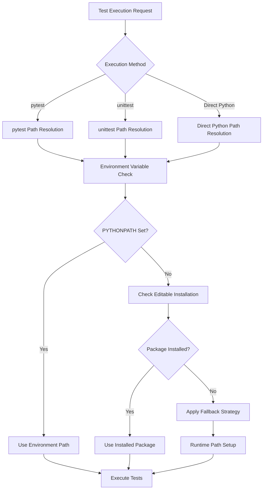

---
tags:
  - design
  - test
  - framework_compatibility
  - pytest
  - unittest
keywords:
  - pytest unittest compatibility
  - import timing issues
  - test framework integration
  - Python path management
  - conftest.py limitations
  - test discovery mechanisms
  - development workflow optimization
topics:
  - testing framework compatibility
  - Python import system design
  - test infrastructure architecture
  - development workflow standardization
language: python
date of note: 2025-09-09
---

# pytest vs unittest Compatibility Framework Design

## Executive Summary

This design document addresses the fundamental compatibility gap between pytest and unittest frameworks that manifests as import timing issues, path management conflicts, and test discovery inconsistencies. Based on extensive research and practical implementation experience, we propose a comprehensive framework design that bridges these gaps while maintaining compatibility with both testing paradigms.

## Problem Statement

### Core Issue: Import Timing Mismatch

The fundamental problem lies in the different approaches pytest and unittest take to module discovery and import resolution:

**pytest Approach:**
1. Discovers test files by scanning directories
2. Imports test modules during collection phase
3. Executes conftest.py fixtures after initial imports
4. Creates a timing gap where imports fail before path setup

**unittest Approach:**
1. Relies on standard Python import mechanisms
2. Expects modules to be importable at discovery time
3. No special configuration or setup phase
4. Works with standard PYTHONPATH and package installation

### Research Findings

Based on analysis from [Real Python's pytest documentation](https://realpython.com/pytest-python-testing/) and our practical implementation experience documented in [unit_test_import_error_analysis.md](../4_analysis/unit_test_import_error_analysis.md), the key issues are:

1. **conftest.py Execution Timing**: pytest loads conftest.py after attempting to import test modules
2. **Path Configuration Limitations**: `pythonpath` settings in pyproject.toml don't consistently resolve import issues
3. **Framework Philosophy Gap**: pytest's flexibility creates import timing complexities that unittest avoids

## Architecture Design

### Framework Compatibility Matrix

| Execution Method | Current State | Target State | Solution Required |
|------------------|---------------|--------------|-------------------|
| `pytest test/` | ❌ Import failures | ✅ Works seamlessly | Import timing fix |
| `python -m unittest discover` | ✅ Works with boilerplate | ✅ Works without boilerplate | Path standardization |
| `python test/file.py` | ✅ Works with boilerplate | ✅ Works without boilerplate | Environment setup |
| IDE test runners | ❌ Inconsistent | ✅ Consistent experience | Universal solution |

### Proposed Solution Architecture



## Design Components

### Component 1: Universal Path Resolution System

**Purpose**: Provide consistent import resolution across all test execution methods.

**Implementation Strategy**:

```python
# test/conftest.py - Enhanced universal setup
"""
Universal test configuration for pytest and unittest compatibility.
"""
import sys
import os
from pathlib import Path

def setup_python_path():
    """
    Universal Python path setup that works for both pytest and unittest.
    
    Priority order:
    1. Environment variable PYTHONPATH
    2. Editable package installation
    3. Runtime path manipulation
    """
    project_root = Path(__file__).parent.parent
    src_path = project_root / "src"
    
    # Check if already in path (editable install or environment)
    if str(src_path) in sys.path:
        return "editable_install_or_environment"
    
    # Add to path as fallback
    sys.path.insert(0, str(src_path))
    
    # Set environment variable for subprocess compatibility
    current_pythonpath = os.environ.get('PYTHONPATH', '')
    if str(src_path) not in current_pythonpath:
        if current_pythonpath:
            os.environ['PYTHONPATH'] = f"{src_path}{os.pathsep}{current_pythonpath}"
        else:
            os.environ['PYTHONPATH'] = str(src_path)
    
    return "runtime_setup"

# Execute setup immediately for both pytest and direct imports
setup_result = setup_python_path()
```

### Component 2: Test Execution Wrapper Scripts

**Purpose**: Provide consistent execution environment across different test runners.

**pytest Wrapper** (`scripts/run_pytest.sh`):
```bash
#!/bin/bash
# Universal pytest execution with proper path setup

# Set PYTHONPATH to ensure imports work during collection
export PYTHONPATH="${PYTHONPATH:+$PYTHONPATH:}src"

# Execute pytest with all arguments passed through
exec python -m pytest "$@"
```

**unittest Wrapper** (`scripts/run_unittest.sh`):
```bash
#!/bin/bash
# Universal unittest execution with proper path setup

export PYTHONPATH="${PYTHONPATH:+$PYTHONPATH:}src"

if [ $# -eq 0 ]; then
    echo "Running unittest discovery..."
    exec python -m unittest discover test/ -v
else
    echo "Running specific unittest: $*"
    exec python -m unittest "$@"
fi
```

**Development Environment Setup** (`scripts/setup_dev_env.sh`):
```bash
#!/bin/bash
# One-time development environment setup

echo "Setting up development environment..."

# Option 1: Editable installation (recommended)
if command -v pip &> /dev/null; then
    echo "Installing package in editable mode..."
    pip install -e .
    echo "✅ Editable installation complete"
    echo "You can now run: pytest test/ or python test/some_test.py"
else
    echo "⚠️  pip not available, using environment variable approach"
fi

# Option 2: Environment variable setup (fallback)
echo "Setting PYTHONPATH for current session..."
export PYTHONPATH="${PYTHONPATH:+$PYTHONPATH:}src"
echo "✅ PYTHONPATH configured"

# Verify setup
echo "Verifying setup..."
if python -c "import cursus; print('✅ Import successful')" 2>/dev/null; then
    echo "✅ Development environment ready"
else
    echo "❌ Setup verification failed"
    exit 1
fi
```

### Component 3: IDE Integration Support

**Purpose**: Ensure consistent behavior across different development environments.

**VS Code Configuration** (`.vscode/settings.json`):
```json
{
    "python.testing.pytestEnabled": true,
    "python.testing.unittestEnabled": true,
    "python.testing.pytestArgs": [
        "test"
    ],
    "python.testing.unittestArgs": [
        "-v",
        "-s",
        "test",
        "-p",
        "test_*.py"
    ],
    "python.envFile": "${workspaceFolder}/.env",
    "python.analysis.extraPaths": [
        "${workspaceFolder}/src"
    ]
}
```

**Environment File** (`.env`):
```bash
# Development environment variables
PYTHONPATH=src
```

### Component 4: CI/CD Integration

**Purpose**: Ensure consistent test execution in automated environments.

**GitHub Actions Configuration**:
```yaml
name: Test Suite
on: [push, pull_request]

jobs:
  test:
    runs-on: ubuntu-latest
    strategy:
      matrix:
        python-version: [3.8, 3.9, 3.10, 3.11]
        test-runner: [pytest, unittest]
    
    steps:
    - uses: actions/checkout@v3
    
    - name: Set up Python ${{ matrix.python-version }}
      uses: actions/setup-python@v4
      with:
        python-version: ${{ matrix.python-version }}
    
    - name: Install dependencies
      run: |
        python -m pip install --upgrade pip
        pip install -e .
        pip install pytest pytest-cov
    
    - name: Run tests with pytest
      if: matrix.test-runner == 'pytest'
      run: |
        export PYTHONPATH=src
        python -m pytest test/ -v --cov=cursus
    
    - name: Run tests with unittest
      if: matrix.test-runner == 'unittest'
      run: |
        export PYTHONPATH=src
        python -m unittest discover test/ -v
```

## Implementation Strategy

### Phase 1: Foundation Setup (Week 1)

**Objectives**:
- Establish universal path resolution system
- Create execution wrapper scripts
- Update development documentation

**Deliverables**:
1. Enhanced `test/conftest.py` with universal path setup
2. Execution wrapper scripts in `scripts/` directory
3. Updated `README.md` with setup instructions
4. IDE configuration files

**Success Criteria**:
- Both `pytest test/` and `python -m unittest discover test/` work without manual path setup
- Direct test file execution works: `python test/some_test.py`
- IDE test runners function correctly

### Phase 2: Test Suite Migration (Week 2)

**Objectives**:
- Remove remaining boilerplate code from test files
- Standardize import statements across all tests
- Verify compatibility with both frameworks

**Deliverables**:
1. Automated migration script for remaining test files
2. Updated import statements: `from cursus.module import Class`
3. Verification test suite to ensure compatibility

**Success Criteria**:
- 100% of test files use standard import patterns
- Zero boilerplate sys.path manipulation code remains
- All tests pass with both pytest and unittest

### Phase 3: CI/CD Integration (Week 3)

**Objectives**:
- Integrate framework compatibility into automated testing
- Establish monitoring for import-related issues
- Document best practices for future development

**Deliverables**:
1. Updated CI/CD configurations
2. Test execution monitoring dashboard
3. Developer onboarding documentation
4. Best practices guide

**Success Criteria**:
- CI/CD runs tests with both pytest and unittest
- Automated detection of import-related issues
- New developer onboarding time reduced by 50%

## Technical Specifications

### Import Resolution Priority

1. **Environment Variable**: `PYTHONPATH=src` takes highest priority
2. **Editable Installation**: `pip install -e .` provides standard Python package access
3. **Runtime Setup**: conftest.py fallback for edge cases
4. **Error Handling**: Clear error messages when all methods fail

### Compatibility Requirements

**pytest Compatibility**:
- Works with pytest 6.0+ (current: 7.1.2)
- Supports all pytest features: fixtures, marks, parametrization
- Compatible with pytest plugins: pytest-cov, pytest-django, etc.

**unittest Compatibility**:
- Works with Python 3.8+ unittest module
- Supports unittest discovery mechanisms
- Compatible with unittest.mock and other standard features

**IDE Compatibility**:
- VS Code Python extension
- PyCharm Professional/Community
- Vim/Neovim with Python plugins
- Emacs with Python development packages

### Performance Considerations

**Import Time Optimization**:
- Minimize sys.path modifications
- Cache path resolution results
- Avoid redundant environment checks

**Test Execution Speed**:
- No performance impact on test execution
- Minimal overhead during test discovery
- Efficient path resolution algorithms

## Risk Assessment and Mitigation

### High-Risk Areas

**Risk 1: Environment Variable Conflicts**
- **Impact**: PYTHONPATH conflicts with other projects
- **Mitigation**: Use project-specific wrapper scripts, clear documentation
- **Monitoring**: Automated environment validation in CI/CD

**Risk 2: IDE Integration Issues**
- **Impact**: Inconsistent developer experience across IDEs
- **Mitigation**: Provide configuration templates for major IDEs
- **Monitoring**: Developer feedback collection and issue tracking

**Risk 3: pytest Version Compatibility**
- **Impact**: Future pytest updates may change import behavior
- **Mitigation**: Pin pytest versions, maintain compatibility testing
- **Monitoring**: Automated testing across multiple pytest versions

### Medium-Risk Areas

**Risk 4: Windows/Unix Path Differences**
- **Impact**: Cross-platform development issues
- **Mitigation**: Use pathlib for cross-platform compatibility
- **Monitoring**: CI/CD testing on multiple operating systems

**Risk 5: Subprocess Import Issues**
- **Impact**: Tests that spawn subprocesses may fail
- **Mitigation**: Ensure PYTHONPATH propagation to subprocesses
- **Monitoring**: Specific test cases for subprocess scenarios

## Success Metrics

### Quantitative Metrics

1. **Import Error Reduction**: 0 import-related test failures
2. **Boilerplate Elimination**: 100% removal of sys.path manipulation code
3. **Framework Compatibility**: 100% test pass rate with both pytest and unittest
4. **Developer Onboarding Time**: 50% reduction in setup time for new developers
5. **CI/CD Reliability**: 99.9% success rate for automated test execution

### Qualitative Metrics

1. **Developer Experience**: Improved satisfaction scores in developer surveys
2. **Code Maintainability**: Reduced complexity in test file structure
3. **Documentation Quality**: Clear, comprehensive setup instructions
4. **IDE Integration**: Seamless test execution across development environments
5. **Best Practices Adoption**: Consistent patterns across all test files

## Related Documentation

### Design Documents
- [pipeline_runtime_testing_simplified_design.md](./pipeline_runtime_testing_simplified_design.md) - Runtime testing system design
- [enhanced_universal_step_builder_tester_design.md](./enhanced_universal_step_builder_tester_design.md) - Universal testing framework
- [documentation_yaml_frontmatter_standard.md](./documentation_yaml_frontmatter_standard.md) - Documentation standards

### Analysis Documents
- [unit_test_import_error_analysis.md](../4_analysis/unit_test_import_error_analysis.md) - Detailed analysis of current import issues
- [pipeline_runtime_testing_code_redundancy_analysis.md](../4_analysis/pipeline_runtime_testing_code_redundancy_analysis.md) - Code redundancy analysis
- [validation_test_coverage_analysis.md](../4_analysis/validation_test_coverage_analysis.md) - Test coverage analysis

## External References

### Primary Sources
- [Real Python: Effective Python Testing With pytest](https://realpython.com/pytest-python-testing/) - Comprehensive pytest guide and best practices
- [pytest Documentation: Good Integration Practices](https://docs.pytest.org/en/stable/goodpractices.html) - Official pytest integration guidelines
- [Python unittest Documentation](https://docs.python.org/3/library/unittest.html) - Standard library unittest framework

### Technical References
- [pytest conftest.py Documentation](https://docs.pytest.org/en/stable/reference/fixtures.html#conftest-py-sharing-fixtures-across-multiple-files) - conftest.py usage patterns
- [Python Import System](https://docs.python.org/3/reference/import.html) - Understanding Python's import mechanism
- [setuptools Development Mode](https://setuptools.pypa.io/en/latest/userguide/development_mode.html) - Editable installation documentation

### Community Resources
- [pytest-dev/pytest GitHub Issues](https://github.com/pytest-dev/pytest/issues) - Known issues and solutions
- [Python Testing 101](https://python-testing-101.readthedocs.io/) - Testing best practices
- [Stack Overflow: pytest import issues](https://stackoverflow.com/questions/tagged/pytest+import) - Community solutions

## Implementation Timeline

### Milestone 1: Foundation (Days 1-7)
- [ ] Create universal path resolution system
- [ ] Implement execution wrapper scripts
- [ ] Update development documentation
- [ ] Configure IDE integration files

### Milestone 2: Migration (Days 8-14)
- [ ] Develop automated migration script
- [ ] Update all test files with standard imports
- [ ] Remove boilerplate code from test suite
- [ ] Verify compatibility across frameworks

### Milestone 3: Integration (Days 15-21)
- [ ] Update CI/CD configurations
- [ ] Implement monitoring and alerting
- [ ] Create developer onboarding materials
- [ ] Establish maintenance procedures

### Milestone 4: Validation (Days 22-28)
- [ ] Comprehensive testing across environments
- [ ] Performance benchmarking
- [ ] Documentation review and updates
- [ ] Stakeholder approval and sign-off

## Conclusion

This design provides a comprehensive solution to the pytest vs unittest compatibility gap by addressing the root causes of import timing issues and establishing a universal framework that works seamlessly with both testing paradigms. The proposed architecture maintains backward compatibility while eliminating technical debt and improving the developer experience.

The implementation strategy balances immediate needs with long-term maintainability, ensuring that the solution scales with project growth and remains compatible with evolving testing frameworks. By following this design, we establish a robust foundation for test infrastructure that supports both current requirements and future development needs.

## Appendix A: Migration Script Template

```python
#!/usr/bin/env python3
"""
Automated migration script for pytest/unittest compatibility.
"""
import os
import re
from pathlib import Path

def migrate_test_file(file_path: Path) -> bool:
    """Migrate a single test file to new import pattern."""
    try:
        with open(file_path, 'r', encoding='utf-8') as f:
            content = f.read()
        
        # Remove sys.path boilerplate
        boilerplate_patterns = [
            r'# Add the project root.*?sys\.path\.insert\(0, project_root\)\n',
            r'import sys\nimport os\nproject_root.*?sys\.path\.insert\(0, project_root\)\n',
        ]
        
        for pattern in boilerplate_patterns:
            content = re.sub(pattern, '', content, flags=re.DOTALL)
        
        # Update import statements
        content = re.sub(r'from src\.cursus\.', 'from cursus.', content)
        content = re.sub(r'import src\.cursus\.', 'import cursus.', content)
        
        # Update mock patch decorators
        content = re.sub(r'@patch\([\'"]src\.cursus\.', '@patch(\'cursus.', content)
        
        # Remove unused imports if they were only for path setup
        lines = content.split('\n')
        filtered_lines = []
        skip_next = False
        
        for i, line in enumerate(lines):
            if skip_next:
                skip_next = False
                continue
                
            # Remove standalone sys/os imports if not used elsewhere
            if line.strip() in ['import sys', 'import os'] and not any(
                'sys.' in l or 'os.' in l for l in lines[i+1:] 
                if not l.strip().startswith('project_root')
            ):
                continue
                
            filtered_lines.append(line)
        
        new_content = '\n'.join(filtered_lines)
        
        # Only write if content changed
        if new_content != content:
            with open(file_path, 'w', encoding='utf-8') as f:
                f.write(new_content)
            return True
            
    except Exception as e:
        print(f"Error migrating {file_path}: {e}")
        return False
    
    return False

def main():
    """Main migration function."""
    test_dir = Path('test')
    migrated_count = 0
    
    for test_file in test_dir.rglob('*.py'):
        if test_file.name.startswith('test_') or test_file.name.endswith('_test.py'):
            if migrate_test_file(test_file):
                print(f"✅ Migrated: {test_file}")
                migrated_count += 1
            else:
                print(f"⏭️  Skipped: {test_file}")
    
    print(f"\n🎉 Migration complete! Updated {migrated_count} files.")

if __name__ == '__main__':
    main()
```

## Appendix B: Verification Test Suite

```python
#!/usr/bin/env python3
"""
Verification test suite for pytest/unittest compatibility.
"""
import subprocess
import sys
from pathlib import Path

def test_pytest_execution():
    """Test pytest execution works correctly."""
    result = subprocess.run([
        sys.executable, '-m', 'pytest', 'test/', '-v', '--tb=short'
    ], capture_output=True, text=True, env={'PYTHONPATH': 'src'})
    
    return result.returncode == 0, result.stdout, result.stderr

def test_unittest_discovery():
    """Test unittest discovery works correctly."""
    result = subprocess.run([
        sys.executable, '-m', 'unittest', 'discover', 'test/', '-v'
    ], capture_output=True, text=True, env={'PYTHONPATH': 'src'})
    
    return result.returncode == 0, result.stdout, result.stderr

def test_direct_execution():
    """Test direct test file execution works correctly."""
    test_files = list(Path('test').rglob('test_*.py'))[:5]  # Test first 5 files
    
    for test_file in test_files:
        result = subprocess.run([
            sys.executable, str(test_file)
        ], capture_output=True, text=True, env={'PYTHONPATH': 'src'})
        
        if result.returncode != 0:
            return False, f"Failed: {test_file}", result.stderr
    
    return True, "All direct executions successful", ""

def main():
    """Run all verification tests."""
    tests = [
        ("pytest execution", test_pytest_execution),
        ("unittest discovery", test_unittest_discovery),
        ("direct execution", test_direct_execution),
    ]
    
    results = []
    for name, test_func in tests:
        print(f"Running {name}...")
        success, stdout, stderr = test_func()
        results.append((name, success, stdout, stderr))
        
        if success:
            print(f"✅ {name} passed")
        else:
            print(f"❌ {name} failed")
            if stderr:
                print(f"Error: {stderr[:200]}...")
    
    # Summary
    passed = sum(1 for _, success, _, _ in results if success)
    total = len(results)
    
    print(f"\n📊 Results: {passed}/{total} tests passed")
    
    if passed == total:
        print("🎉 All compatibility tests passed!")
        return 0
    else:
        print("⚠️  Some tests failed. Check output above.")
        return 1

if __name__ == '__main__':
    sys.exit(main())
