---
tags:
  - design
  - implementation
  - pytorch
  - model_evaluation
  - deep_learning
  - lightning
keywords:
  - pytorch evaluation
  - deep learning inference
  - lightning framework
  - multimodal models
  - gpu acceleration
  - model metrics
topics:
  - model evaluation
  - pytorch inference
  - deep learning
  - performance metrics
language: python
date of note: 2025-11-18
---

# PyTorch Model Evaluation Script Design

## What is the Purpose of PyTorch Model Evaluation Script?

The PyTorch Model Evaluation Script serves as a **comprehensive evaluation engine** for deep learning models trained with PyTorch Lightning. It provides GPU/CPU-accelerated inference and metrics computation for multimodal models (text, tabular, bimodal, trimodal) while maintaining compatibility with the broader pipeline architecture. The script parallels the XGBoost model evaluation functionality but is optimized for PyTorch's deep learning ecosystem.

The core purpose is to:
1. **Load PyTorch models** and preprocessing artifacts efficiently from training outputs
2. **Apply preprocessing pipelines** (text tokenization, categorical encoding, imputation) consistently
3. **Generate predictions** using PyTorch Lightning inference with automatic GPU/CPU support
4. **Compute comprehensive metrics** for binary and multiclass classification tasks
5. **Generate visualizations** (ROC/PR curves) with format preservation (CSV/TSV/Parquet)
6. **Support comparison mode** for evaluating model improvements over baselines

## Core Design Principles

The PyTorch Model Evaluation Script is built on several key design principles:

1. **Framework Optimization** - Leverage PyTorch Lightning's built-in inference capabilities
2. **Device Flexibility** - Automatic GPU/CPU detection with explicit device control
3. **Multi-Modal Support** - Handle text-only, tabular, bimodal, and trimodal architectures
4. **Format Preservation** - Maintain input data format (CSV/TSV/Parquet) in outputs
5. **Reusable Components** - Use same preprocessing from training for consistency
6. **Comparison Ready** - Built-in support for model comparison and statistical tests

## Architecture Overview

The evaluation script architecture consists of six main components:

```mermaid
graph TD
    subgraph "🔧 Model & Artifact Loading"
        ModelLoader["Model Artifact Loader<br/>• PyTorch model (.pth)<br/>• Model artifacts (.pth)<br/>• Config & hyperparameters<br/>• Preprocessing processors<br/>• Tokenizer & embeddings"]
    end
    
    subgraph "🔄 Data Preprocessing"
        DataPreprocessor["Data Preprocessor<br/>• Text preprocessing pipeline<br/>• Dialogue processing<br/>• BERT tokenization<br/>• Categorical encoding<br/>• Numerical imputation<br/>• BSMDataset creation"]
    end
    
    subgraph "🎯 PyTorch Lightning Inference"
        InferenceEngine["Inference Engine<br/>• Device auto-detection (GPU/CPU)<br/>• DataLoader batching<br/>• Lightning model_inference()<br/>• Probability extraction<br/>• Binary/multiclass handling"]
    end
    
    subgraph "📊 Metrics Computation"
        MetricsComputer["Metrics Computer<br/>• Standard ML metrics (AUC, F1)<br/>• Binary classification metrics<br/>• Multiclass metrics (macro/micro)<br/>• Threshold analysis<br/>• Per-class performance"]
    end
    
    subgraph "📈 Visualization Engine"
        Visualization["Visualization Engine<br/>• ROC curve plots<br/>• PR curve plots<br/>• Score distributions<br/>• Multi-class curves<br/>• High-resolution JPG output"]
    end
    
    subgraph "💾 Output Management"
        OutputManager["Output Manager<br/>• Format preservation<br/>• Prediction DataFrames<br/>• Metrics JSON/TXT<br/>• Success markers<br/>• Health checks"]
    end
    
    ModelLoader --> DataPreprocessor
    DataPreprocessor --> InferenceEngine
    InferenceEngine --> MetricsComputer
    MetricsComputer --> Visualization
    MetricsComputer --> OutputManager
    Visualization --> OutputManager
    
    subgraph "📊 Input Data"
        InputData["Evaluation Data<br/>• CSV/TSV/Parquet files<br/>• Text fields<br/>• Tabular features<br/>• ID and label columns"]
    end
    
    subgraph "📈 Output Data"
        OutputData["Evaluation Artifacts<br/>• Predictions with probabilities<br/>• Metrics JSON & summary<br/>• ROC/PR curve plots<br/>• Format-preserved outputs"]
    end
    
    InputData --> DataPreprocessor
    OutputManager --> OutputData
```



## Core Components

### 1. Model & Artifact Loading Component

The model loading component handles PyTorch-specific artifacts from training:

```python
def load_model_artifacts(
    model_dir: str,
) -> Tuple[nn.Module, Dict[str, Any], AutoTokenizer, Dict[str, Any]]:
    """
    Load trained PyTorch model and all preprocessing artifacts.
    
    Returns:
        - PyTorch Lightning model
        - Model configuration dictionary
        - Tokenizer for text processing
        - Preprocessing processors (categorical, imputation)
    """
    # Load hyperparameters
    with open(os.path.join(model_dir, "hyperparameters.json"), "r") as f:
        hyperparams = json.load(f)
    
    # Load model artifacts (config, embeddings, vocab, processors)
    artifact_path = os.path.join(model_dir, "model_artifacts.pth")
    artifacts = load_artifacts(
        artifact_path,
        model_class=hyperparams.get("model_class", "bimodal_bert")
    )
    
    config = artifacts["config"]
    embedding_mat = artifacts.get("embedding_mat")
    vocab = artifacts.get("vocab")
    
    # Reconstruct tokenizer
    tokenizer = AutoTokenizer.from_pretrained(config.get("tokenizer", "bert-base-multilingual-cased"))
    
    # Load trained model
    model_path = os.path.join(model_dir, "model.pth")
    model = load_model(model_path, model_class=config["model_class"], device_l="cpu")
    model.eval()  # Set to evaluation mode
    
    # Extract preprocessing processors
    categorical_processors = config.get("categorical_processor_mappings", {})
    label_mappings = {
        "label_to_id": config.get("label_to_id"),
        "id_to_label": config.get("id_to_label")
    }
    
    return model, config, tokenizer, {
        "categorical_processors": categorical_processors,
        "label_mappings": label_mappings,
        "embedding_mat": embedding_mat,
        "vocab": vocab
    }
```

Key features:
- **Comprehensive artifact loading** - All training artifacts including processors
- **Model architecture support** - BimodalBert, TrimodalBert, TextBert, etc.
- **Tokenizer reconstruction** - Rebuild tokenizer from config
- **Processor extraction** - Categorical and label processors for consistency

### 2. Data Preprocessing Component

The preprocessing component applies the same pipeline used during training:

```python
def preprocess_eval_data(
    df: pd.DataFrame,
    config: Dict[str, Any],
    tokenizer: AutoTokenizer,
    processors: Dict[str, Any],
    file_dir: str,
    filename: str
) -> Tuple[BSMDataset, DataLoader]:
    """
    Apply complete preprocessing pipeline to evaluation data.
    Creates BSMDataset and DataLoader for inference.
    """
    # Create BSMDataset
    bsm_dataset = BSMDataset(
        config=config,
        file_dir=file_dir,
        filename=filename
    )
    
    # Fill missing values
    bsm_dataset.fill_missing_value(
        label_name=config["label_name"],
        column_cat_name=config.get("cat_field_list", [])
    )
    
    # Build text preprocessing pipeline
    text_pipeline = (
        DialogueSplitterProcessor()
        >> HTMLNormalizerProcessor()
        >> EmojiRemoverProcessor()
        >> TextNormalizationProcessor()
        >> DialogueChunkerProcessor(
            tokenizer=tokenizer,
            max_tokens=config["max_sen_len"],
            truncate=config.get("chunk_trancate", False),
            max_total_chunks=config.get("max_total_chunks", 5)
        )
        >> BertTokenizeProcessor(
            tokenizer,
            add_special_tokens=True,
            max_length=config["max_sen_len"],
            input_ids_key=config.get("text_input_ids_key", "input_ids"),
            attention_mask_key=config.get("text_attention_mask_key", "attention_mask")
        )
    )
    
    # Add text pipeline
    bsm_dataset.add_pipeline(config["text_name"], text_pipeline)
    
    # Add categorical processors
    categorical_processors = processors["categorical_processors"]
    for field, mapping in categorical_processors.items():
        processor = CategoricalLabelProcessor(category_to_label=mapping)
        bsm_dataset.add_pipeline(field, processor)
    
    # Add label processor for multiclass
    if not config["is_binary"] and config["num_classes"] > 2:
        label_mappings = processors["label_mappings"]
        if label_mappings["label_to_id"]:
            label_processor = MultiClassLabelProcessor(
                label_to_id=label_mappings["label_to_id"],
                id_to_label=label_mappings["id_to_label"]
            )
            bsm_dataset.add_pipeline(config["label_name"], label_processor)
    
    # Create DataLoader
    bsm_collate_batch = build_collate_batch(
        input_ids_key=config.get("text_input_ids_key", "input_ids"),
        attention_mask_key=config.get("text_attention_mask_key", "attention_mask")
    )
    
    dataloader = DataLoader(
        bsm_dataset,
        collate_fn=bsm_collate_batch,
        batch_size=config.get("batch_size", 32),
        shuffle=False
    )
    
    return bsm_dataset, dataloader
```

Key features:
- **BSMDataset integration** - Use same dataset class as training
- **Pipeline consistency** - Apply exact same preprocessing transformations
- **Text processing** - Complete dialogue processing and tokenization
- **Categorical handling** - Apply saved categorical encoders
- **DataLoader creation** - Efficient batching for inference

### 3. PyTorch Lightning Inference Engine

The inference engine leverages Lightning utilities with device flexibility:

```python
def generate_predictions(
    model: nn.Module,
    dataloader: DataLoader,
    config: Dict[str, Any],
    device: str = "auto",
    accelerator: str = "auto"
) -> Tuple[np.ndarray, np.ndarray]:
    """
    Generate predictions using PyTorch Lightning inference.
    Supports automatic GPU/CPU detection and batch processing.
    """
    # Determine device and accelerator
    if device == "auto":
        device = "cuda" if torch.cuda.is_available() else "cpu"
    
    if accelerator == "auto":
        accelerator = "gpu" if torch.cuda.is_available() else "cpu"
    
    logger.info(f"Running inference on device: {device}, accelerator: {accelerator}")
    
    # Use Lightning's model_inference utility
    y_pred, y_true = model_inference(
        model,
        dataloader,
        accelerator=accelerator,
        device=device,
        model_log_path=None  # No logging during evaluation
    )
    
    # Handle output format
    # y_pred shape: (N, num_classes) for probabilities
    # y_true shape: (N,) for true labels
    
    return y_pred, y_true


def setup_device_environment(config: Dict[str, Any]) -> str:
    """
    Set up device environment based on availability and config.
    Returns the selected device string.
    """
    device = torch.device("cuda" if torch.cuda.is_available() else "cpu")
    logger.info(f"Using device: {device}")
    
    if device.type == "cuda":
        logger.info(f"GPU: {torch.cuda.get_device_name(0)}")
        logger.info(f"GPU Count: {torch.cuda.device_count()}")
        
        # Enable optimizations
        torch.backends.cudnn.benchmark = True
        
        # Log memory info
        logger.info(f"GPU Memory Allocated: {torch.cuda.memory_allocated(0) / 1e9:.2f} GB")
        logger.info(f"GPU Memory Reserved: {torch.cuda.memory_reserved(0) / 1e9:.2f} GB")
    
    return str(device)
```

Key features:
- **Lightning integration** - Use `model_inference()` from training utilities
- **Automatic device detection** - GPU/CPU with explicit control
- **Batch processing** - Efficient DataLoader-based inference
- **Memory optimization** - CUDA optimizations when available
- **Consistent output** - Probabilities for all classes

### 4. Metrics Computation Component

The metrics computation matches XGBoost eval for compatibility:

```python
def compute_evaluation_metrics(
    y_true: np.ndarray,
    y_prob: np.ndarray,
    config: Dict[str, Any]
) -> Dict[str, float]:
    """
    Compute comprehensive evaluation metrics.
    Uses Lightning's compute_metrics utility for consistency.
    """
    task = "binary" if config["is_binary"] else "multiclass"
    num_classes = config["num_classes"]
    
    # Define metrics to compute
    output_metrics = ["auroc", "average_precision", "f1_score"]
    
    # Compute metrics using Lightning utility
    metrics = compute_metrics(
        y_prob,
        y_true,
        output_metrics,
        task=task,
        num_classes=num_classes,
        stage="eval"
    )
    
    # Add threshold-based metrics for binary
    if config["is_binary"]:
        y_score = y_prob[:, 1] if y_prob.shape[1] > 1 else y_prob
        
        for threshold in [0.3, 0.5, 0.7]:
            y_pred = (y_score >= threshold).astype(int)
            metrics[f"f1_score_at_{threshold}"] = f1_score(y_true, y_pred)
            metrics[f"precision_at_{threshold}"] = precision_score(y_true, y_pred)
            metrics[f"recall_at_{threshold}"] = recall_score(y_true, y_pred)
    
    # Add per-class metrics for multiclass
    else:
        for i in range(num_classes):
            y_true_bin = (y_true == i).astype(int)
            y_score = y_prob[:, i]
            metrics[f"auroc_class_{i}"] = roc_auc_score(y_true_bin, y_score)
            metrics[f"f1_score_class_{i}"] = f1_score(y_true_bin, y_score > 0.5)
    
    return metrics
```

Key features:
- **Lightning utilities** - Use `compute_metrics()` from training
- **Binary/multiclass** - Consistent handling of both cases
- **Threshold analysis** - Multiple threshold evaluations
- **Per-class metrics** - Detailed multiclass analysis
- **XGBoost compatibility** - Matching metric names for pipeline integration

### 5. Visualization Component

The visualization component generates plots using Lightning utilities:

```python
def generate_evaluation_plots(
    y_true: np.ndarray,
    y_prob: np.ndarray,
    y_val_true: np.ndarray,
    y_val_prob: np.ndarray,
    config: Dict[str, Any],
    output_dir: str,
    global_step: int = 0
) -> Dict[str, str]:
    """
    Generate ROC and PR curve plots using Lightning utilities.
    Returns dictionary of plot file paths.
    """
    plot_paths = {}
    task = "binary" if config["is_binary"] else "multiclass"
    num_classes = config["num_classes"]
    
    # Create TensorBoard writer for plot generation
    writer = SummaryWriter(log_dir=os.path.join(output_dir, "tensorboard_eval"))
    
    # Generate ROC curves
    roc_metric_plot(
        y_pred=y_prob,
        y_true=y_true,
        y_val_pred=y_val_prob,
        y_val_true=y_val_true,
        path=output_dir,
        task=task,
        num_classes=num_classes,
        writer=writer,
        global_step=global_step
    )
    plot_paths["roc_curve"] = os.path.join(output_dir, "roc_curve.jpg")
    
    # Generate PR curves
    pr_metric_plot(
        y_pred=y_prob,
        y_true=y_true,
        y_val_pred=y_val_prob,
        y_val_true=y_val_true,
        path=output_dir,
        task=task,
        num_classes=num_classes,
        writer=writer,
        global_step=global_step
    )
    plot_paths["pr_curve"] = os.path.join(output_dir, "pr_curve.jpg")
    
    writer.close()
    
    return plot_paths
```

Key features:
- **Lightning plotting** - Reuse `roc_metric_plot()` and `pr_metric_plot()`
- **TensorBoard integration** - Plots saved to TensorBoard and files
- **Binary/multiclass** - Appropriate visualizations for each task
- **High resolution** - Publication-quality JPG outputs
- **Validation comparison** - Include validation set for comparison

### 6. Output Management Component

The output component handles format preservation and structured outputs:

```python
def save_predictions_with_format(
    predictions: np.ndarray,
    true_labels: np.ndarray,
    ids: np.ndarray,
    output_dir: str,
    split_name: str,
    id_col: str,
    label_col: str,
    output_format: str = "csv"
) -> str:
    """
    Save predictions as DataFrame with format preservation.
    Matches XGBoost eval output structure.
    """
    os.makedirs(output_dir, exist_ok=True)
    
    # Create DataFrame with ID and label columns
    df = pd.DataFrame({id_col: ids, label_col: true_labels})
    
    # Add probability columns for each class
    num_classes = predictions.shape[1] if len(predictions.shape) > 1 else 1
    if num_classes == 1:
        df["prob_class_0"] = 1 - predictions.squeeze()
        df["prob_class_1"] = predictions.squeeze()
    else:
        for i in range(num_classes):
            df[f"prob_class_{i}"] = predictions[:, i]
    
    # Save with format preservation
    output_base = os.path.join(output_dir, f"{split_name}_predictions")
    saved_path = save_dataframe_with_format(df, output_base, output_format)
    
    logger.info(f"Saved {split_name} predictions (format={output_format}): {saved_path}")
    return saved_path


def save_metrics_report(
    metrics: Dict[str, float],
    output_dir: str
) -> Tuple[str, str]:
    """
    Save metrics as JSON and text summary.
    Matches XGBoost eval output format.
    """
    # Save JSON
    json_path = os.path.join(output_dir, "metrics.json")
    with open(json_path, "w") as f:
        json.dump(metrics, f, indent=2)
    
    # Save text summary
    summary_path = os.path.join(output_dir, "metrics_summary.txt")
    with open(summary_path, "w") as f:
        f.write("PYTORCH MODEL EVALUATION METRICS\n")
        f.write("=" * 50 + "\n\n")
        
        # Key metrics
        if "eval/auroc" in metrics:
            f.write(f"AUC-ROC:           {metrics['eval/auroc']:.4f}\n")
        if "eval/average_precision" in metrics:
            f.write(f"Average Precision: {metrics['eval/average_precision']:.4f}\n")
        if "eval/f1_score" in metrics:
            f.write(f"F1 Score:          {metrics['eval/f1_score']:.4f}\n")
        
        f.write("\n" + "=" * 50 + "\n\n")
        f.write("ALL METRICS\n")
        f.write("=" * 50 + "\n")
        
        for name, value in sorted(metrics.items()):
            if isinstance(value, (int, float)):
                f.write(f"{name}: {value:.6f}\n")
            else:
                f.write(f"{name}: {value}\n")
    
    return json_path, summary_path
```

Key features:
- **Format preservation** - CSV/TSV/Parquet support
- **XGBoost compatibility** - Same output structure as XGBoost eval
- **Structured predictions** - ID, label, and class probabilities
- **Comprehensive reporting** - JSON and text summaries
- **Success markers** - _SUCCESS and _HEALTH files

## Environment Variables and Configuration

The script supports the following environment variables:

### Required Environment Variables
- `ID_FIELD` - Column name for record identifiers (default: "order_id")
- `LABEL_FIELD` - Column name for true labels (default: "label")
- `TEXT_FIELD` - Column name for text content (default: "text")

### Required Arguments
- `--job_type` - Type of evaluation job (e.g., "evaluation")

### Optional Environment Variables
- `DEVICE` - Device selection: "auto", "cuda", "cpu" (default: "auto")
- `ACCELERATOR` - Accelerator type: "auto", "gpu", "cpu" (default: "auto")
- `BATCH_SIZE` - Batch size for inference (default: 32)
- `NUM_WORKERS` - DataLoader worker processes (default: 0)
- `OUTPUT_FORMAT` - Output format: "csv", "tsv", "parquet" (default: auto-detect from input)

### Comparison Mode Variables
- `COMPARISON_MODE` - Enable model comparison (default: "false")
- `PREVIOUS_SCORE_FIELD` - Column with previous model scores
- `COMPARISON_METRICS` - Metrics to compute: "all", "basic" (default: "all")
- `STATISTICAL_TESTS` - Enable statistical tests (default: "true")
- `COMPARISON_PLOTS` - Generate comparison plots (default: "true")

### Input/Output Paths
Following SageMaker container conventions:
- **Model Input**: `/opt/ml/processing/input/model/`
- **Evaluation Data**: `/opt/ml/processing/input/eval_data/`
- **Evaluation Output**: `/opt/ml/processing/output/eval/`
- **Metrics Output**: `/opt/ml/processing/output/metrics/`

## Integration with Pipeline Architecture

### Upstream Integration
The PyTorch eval script integrates with:
1. **PyTorch Training Step** - Consumes model artifacts from training
2. **Data Preparation Steps** - Processes prepared evaluation datasets
3. **Feature Engineering** - Uses engineered features consistently

### Downstream Integration
The PyTorch eval script outputs to:
1. **Model Metrics Computation** - Provides predictions for detailed analysis
2. **Model Calibration** - Supplies raw scores for calibration
3. **Model Wiki Generator** - Generates metrics for documentation
4. **Model Deployment** - Validates model performance for deployment

### Pipeline Flow

```mermaid
graph LR
    subgraph "🏗️ Upstream Steps"
        Training["PyTorch Training<br/>Model + Artifacts"]
        DataPrep["Data Preparation<br/>Evaluation Data"]
    end
    
    subgraph "🎯 PyTorch Eval Step"
        Eval["PyTorch Model Evaluation<br/>• Load model & artifacts<br/>• Preprocess data<br/>• GPU/CPU inference<br/>• Compute metrics<br/>• Generate plots"]
    end
    
    subgraph "📊 Downstream Steps"
        Metrics["Model Metrics Computation<br/>Domain-specific metrics"]
        Calibration["Model Calibration<br/>Score calibration"]
        Wiki["Model Wiki Generator<br/>Documentation"]
    end
    
    Training --> Eval
    DataPrep --> Eval
    Eval --> Metrics
    Eval --> Calibration
    Eval --> Wiki
```


### Output Compatibility

The PyTorch eval output matches XGBoost eval format for seamless integration:
- **Prediction Format**: ID + Label + prob_class_* columns
- **Metrics Format**: JSON with standard metric names
- **Plot Format**: High-resolution JPG files
- **File Format**: Same CSV/TSV/Parquet preservation

## Optional Comparison Mode

The script supports model comparison similar to XGBoost eval:

### Comparison Metrics
- **Correlation analysis** - Pearson and Spearman correlation
- **Performance deltas** - AUC, AP, F1 differences
- **Score distributions** - Mean, std, quartile analysis
- **Agreement metrics** - Prediction agreement at thresholds

### Statistical Tests
- **Paired t-test** - Score difference significance
- **Wilcoxon test** - Non-parametric alternative
- **McNemar's test** - Prediction disagreement (binary only)

### Comparison Plots
- **Side-by-side ROC/PR curves** - Visual performance comparison
- **Score scatter plots** - Model agreement visualization
- **Score distributions** - Distribution comparison by class
- **Difference analysis** - Score delta distributions

## Performance Considerations

### GPU Optimization
- **Automatic GPU detection** - torch.cuda.is_available()
- **Memory management** - Batch size optimization for GPU memory
- **CUDA optimizations** - cudnn.benchmark for consistent inputs
- **Mixed precision** - FP16 support when configured

### CPU Optimization
- **Parallel processing** - Multiple DataLoader workers
- **Batch optimization** - Optimal batch size for CPU
- **Memory efficiency** - Gradient-free inference with torch.no_grad()

### Memory Management
- **Batch processing** - Process data in configurable batches
- **Garbage collection** - Explicit cleanup of large objects
- **Memory monitoring** - Track GPU/CPU memory usage
- **Streaming support** - Handle datasets larger than memory

## Error Handling and Validation

### Input Validation
- **Model artifact validation** - Verify all required files present
- **Data schema validation** - Check required columns and types
- **Device compatibility** - Validate GPU availability when requested
- **Format detection** - Auto-detect and validate file formats

### Runtime Error Handling
- **Missing feature handling** - Graceful degradation for missing features
- **Device fallback** - Automatic CPU fallback if GPU fails
- **Memory constraints** - Automatic batch size adjustment
- **Data quality issues** - Handle null values, type mismatches

### Output Validation
- **Prediction validation** - Verify shapes and probability ranges
- **Metrics validation** - Ensure metrics within expected ranges
- **File integrity** - Verify all outputs generated successfully

## Testing Strategy

### Unit Testing
- **Component isolation** - Test each component independently
- **Mock dependencies** - Mock PyTorch models and data
- **Device testing** - Test both GPU and CPU paths
- **Format testing** - Test all input/output formats

### Integration Testing
- **End-to-end testing** - Full pipeline from training to evaluation
- **Model architecture testing** - Test all supported model types
- **Performance testing** - Validate with large datasets
- **Format consistency** - Verify output format preservation

### Validation Testing
- **Metric accuracy** - Compare with PyTorch training metrics
- **XGBoost compatibility** - Verify output compatibility
- **Preprocessing consistency** - Match training preprocessing exactly

## Migration from Existing Implementation

### Extraction Strategy
Extract from pytorch_training.py:
- `load_model_artifacts()` - Model and artifact loading
- `data_preprocess_pipeline()` - Text preprocessing
- `load_data_module()` - BSMDataset creation
- `model_inference()` - Lightning inference utility
- `compute_metrics()` - Metrics computation
- `roc_metric_plot()`, `pr_metric_plot()` - Visualization

### Enhancement Strategy
- **Separate eval from training** - Focus on evaluation only
- **Add comparison mode** - Statistical tests and comparison plots
- **Improve logging** - Detailed evaluation logging
- **Format flexibility** - Enhanced format preservation

## Future Enhancements

### Near Term (Next 3 months)
- **ONNX runtime support** - Faster inference with ONNX
- **Distributed inference** - Multi-GPU evaluation
- **Streaming inference** - Handle very large datasets
- **Advanced metrics** - Calibration metrics, fairness metrics

### Medium Term (3-6 months)
- **Model explainability** - SHAP values, attention visualization
- **Ensemble evaluation** - Multi-model evaluation
- **Real-time monitoring** - CloudWatch integration
- **Automated insights** - ML-powered performance analysis

### Long Term (6+ months)
- **Active learning integration** - Uncertainty-based sample selection
- **Model drift detection** - Monitor performance degradation
- **Automated optimization** - Self-tuning hyperparameters
- **Production serving** - Real-time inference API

## References

- [PyTorch Training Script](../../projects/bsm_pytorch/docker/pytorch_training.py) - Training implementation
- [XGBoost Model Eval Design](xgboost_model_eval_design.md) - XGBoost evaluation patterns
- [Model Metrics Computation Design](model_metrics_computation_design.md) - Metrics computation patterns
- [XGBoost Model Inference Design](xgboost_model_inference_design.md) - Inference separation patterns
- [Lightning Model Utilities](../../processing/lightning_models/utils/pl_train.py) - Training utilities
- [Lightning Model Plots](../../processing/lightning_models/utils/pl_model_plots.py) - Plotting utilities
- [BSMDataset](../../processing/datasets/bsm_datasets.py) - Dataset implementation
- [Script Contract](script_contract.md) - Script execution contracts
