---
tags:
  - design
  - refactoring
  - code-organization
  - deep-learning
  - modularity
  - reusability
keywords:
  - pytorch modules
  - zettelkasten principles
  - atomic components
  - code modularization
  - dependency management
  - neural network components
  - knowledge organization
topics:
  - software architecture
  - code organization
  - knowledge management
  - deep learning components
  - modular design
language: python
date of note: 2026-01-01
---

# PyTorch Module Reorganization Design

## Overview

This document outlines the systematic reorganization of PyTorch neural network modules across the Athelas codebase into reusable, atomic components following Zettelkasten knowledge management principles. The reorganization addresses code duplication, improves discoverability, enhances maintainability, and establishes a scalable architecture for off-the-shelf deep learning components.

**Current State:** Neural network modules are scattered across multiple legacy directories (`names3risk_legacy/`, `temporal_self_attention_legacy/scripts/`) with significant duplication and unclear dependencies.

**Target State:** A flat, semantically-organized component library (`src/athelas/models/pytorch/`) where each module represents a single concept, with explicit dependencies and comprehensive documentation.

## Related Documents

### Foundational Principles
- **[Zettelkasten Knowledge Management Principles](../7_resources/zettelkasten_knowledge_management_principles.md)** - Core organizational principles guiding this design
- **[Core Design Principles](../7_resources/core_design_principles.md)** - General design principles for the Athelas codebase

### Related Model Architectures
- **[Temporal Self-Attention Model Design](temporal_self_attention_model_design.md)** - Uses many components targeted for extraction
- **[Names3Risk Model Design](names3risk_model_design.md)** - Legacy models to be refactored
- **[TSA Lightning Refactoring Design](tsa_lightning_refactoring_design.md)** - Modern Lightning-based implementations

### Implementation Analysis
- **[TSA Lightning Line-by-Line Comparison](../3_analysis/2025-12-20_tsa_lightning_refactoring_line_by_line_comparison.md)** - Detailed analysis of model implementations
- **[Names3Risk Cursus Step Equivalency Analysis](../3_analysis/2025-12-31_names3risk_cursus_step_equivalency_analysis.md)** - Understanding legacy model flows

## Core Principles

This reorganization is guided by the **Five Core Zettelkasten Principles** adapted for software architecture:

### 1. Principle of Atomicity

> "Put things that belong together into a single note, give it an ID, but limit its content to that single topic."

**Application to PyTorch Modules:**
- **One Module = One Concept**: Each file contains exactly one conceptual neural network component
- **Single Responsibility**: Modules have a clear, singular purpose (e.g., `attention_pooling.py` contains only attention-based pooling logic)
- **No Junk Drawers**: Prevent files like `basic_blocks.py` (7+ disparate classes) or `utils.py` (everything that doesn't fit elsewhere)

**Benefits:**
- **Reusability**: Atomic modules can be imported and reused in any context without bringing unnecessary dependencies
- **Clarity**: Single-topic focus reduces cognitive load when understanding or modifying code
- **Testability**: Unit tests can target specific concepts without complex setup
- **Composability**: Atomic modules can be combined in unexpected ways to create novel architectures

**Example Transformation:**
```python
# BEFORE: basic_blocks.py (7 classes, 600+ lines)
class TimeEncode(nn.Module): ...
class TimeEncoder(nn.Module): ...
class FeatureAggregation(nn.Module): ...
class AttentionLayer(nn.Module): ...
class AttentionLayerPreNorm(nn.Module): ...
class OrderAttentionLayer(nn.Module): ...
class FeatureAttentionLayer(nn.Module): ...

# AFTER: Atomic organization
# pytorch/embeddings/temporal_encoding.py → TimeEncode, TimeEncoder
# pytorch/pooling/feature_aggregation.py → FeatureAggregation
# pytorch/blocks/attention_layer.py → AttentionLayer, AttentionLayerPreNorm
# pytorch/blocks/order_attention.py → OrderAttentionLayer
# pytorch/blocks/feature_attention.py → FeatureAttentionLayer
```

### 2. Principle of Connectivity

> "Different techniques can implement the same underlying principle: links vs note sequences."

**Application to PyTorch Modules:**
- **Explicit Imports Over Implicit Structure**: Dependencies are declared through imports, not assumed through folder hierarchy
- **Direct Linking**: Modules reference specific dependencies rather than relying on positional relationships
- **Annotated Connections**: Docstrings explain why dependencies exist and how modules relate

**Benefits:**
- **Intentional Relationships**: Import statements document meaningful connections between components
- **Flexible Organization**: Modules can be moved or reorganized without breaking logical relationships
- **Discovery Through Use**: Following imports reveals the conceptual graph of the codebase
- **No Hidden Dependencies**: All relationships are explicit in code

**Example Implementation:**
```python
# pytorch/blocks/transformer_block.py
"""
Transformer block combining attention and feedforward layers.

**Dependencies:**
- athelas.models.pytorch.attention.multihead_attention → Core attention mechanism
- athelas.models.pytorch.feedforward.feedforward → Position-wise FFN
- athelas.models.pytorch.embeddings.positional_encoding → Position information

**Used By:**
- athelas.models.names3risk.transformer2risk → Text encoder
- athelas.models.lightning.text.pl_bert → BERT-like architectures

**Related Concepts:**
- athelas.models.pytorch.blocks.lstm_encoder → Alternative sequence encoder
- athelas.models.pytorch.attention.temporal_attention → Time-aware variant
"""

from athelas.models.pytorch.attention import MultiHeadAttention
from athelas.models.pytorch.feedforward import FeedForward
from athelas.models.pytorch.embeddings import PositionalEncoding
```

### 3. Principle Against Categories

> "Don't use categories" - rigid hierarchical structures inhibit organic knowledge growth.

**Application to PyTorch Modules:**
- **Flat Structure**: Maximum 2-level directory depth (`pytorch/attention/` not `pytorch/layers/attention/mechanisms/`)
- **Descriptive Groupings**: Folders describe function (e.g., `attention/`, `losses/`) not artificial hierarchy
- **Multiple Classifications**: Modules can be conceptually related to multiple categories through imports and tags
- **Emergent Organization**: Structure reflects actual usage patterns, not predetermined taxonomy

**Benefits:**
- **Reduced Cognitive Load**: Developers don't need to remember arbitrary hierarchies
- **Flexible Growth**: New module types can be added without restructuring
- **Natural Clustering**: Related modules group together through shared imports
- **No Single-Parent Constraint**: Modules can serve multiple purposes

**Folder Structure:**
```
pytorch/
├── attention/           # Flat collection of attention mechanisms
│   ├── attention_pooling.py
│   ├── cross_attention.py
│   ├── multihead_attention.py
│   ├── self_attention.py
│   └── temporal_attention.py
├── embeddings/          # Flat collection of embedding types
│   ├── positional_encoding.py
│   ├── temporal_encoding.py
│   ├── token_embedding.py
│   └── feature_embedding.py
└── ...                  # Other flat categories

# NOT: Deep hierarchies
# ❌ pytorch/layers/attention/mechanisms/pooling/attention_pooling.py
# ❌ pytorch/components/neural_network/embeddings/types/temporal/encoding.py
```

### 4. Principle of Manual Linking Over Search

> "Search alone is not enough" - manual connections create more meaningful knowledge networks.

**Application to PyTorch Modules:**
- **Explicit Dependency Documentation**: Every module documents its dependencies and consumers in docstrings
- **Connection Registry**: Maintain `pytorch_components_index.md` mapping concepts to implementations
- **Usage Examples**: Include concrete examples of how modules connect to each other
- **Relationship Types**: Document different connection types (uses, extends, alternative-to, related-to)

**Benefits:**
- **Preserved Context**: Understanding of "why this connection exists" is captured, not just "what connects"
- **Reduced Cognitive Load**: Don't need to search and evaluate many results to find relevant modules
- **Temporal Reliability**: Connections remain valid even as naming conventions evolve
- **Active Engagement**: Creating connections forces deeper understanding of architecture

**Documentation Example:**
```python
# pytorch/fusion/mixture_of_experts.py
"""
Mixture of Experts (MoE) fusion mechanism for combining multiple expert networks.

**Core Concept:**
Sparse expert routing that dynamically selects and combines specialized sub-networks
based on input characteristics. Improves model capacity without proportional 
computational cost increase.

**Dependencies:**
- torch.nn.Module → Base class
- torch.nn.functional.softmax → Gating normalization
- athelas.models.pytorch.routing.top_k_gating → Expert selection mechanism

**Used By:**
- athelas.models.lightning.bimodal.pl_bimodal_moe → Bimodal fusion
- athelas.models.temporal_self_attention_legacy.models → TSA feedforward
- athelas.models.pytorch.blocks.attention_layer → Attention FFN alternative

**Alternative Approaches:**
- athelas.models.pytorch.fusion.gate_fusion → Simpler gating mechanism
- athelas.models.pytorch.fusion.concat_fusion → Direct concatenation
- athelas.models.pytorch.fusion.attention_fusion → Attention-based combination

**Key Papers:**
- "Outrageously Large Neural Networks: The Sparsely-Gated Mixture-of-Experts Layer" (2017)
- "Switch Transformers: Scaling to Trillion Parameter Models" (2021)

**Usage Example:**
```python
from athelas.models.pytorch.fusion import MixtureOfExperts

# Create MoE with 8 experts
moe = MixtureOfExperts(
    input_dim=512,
    num_experts=8,
    expert_hidden_dim=2048,
    top_k=2  # Route to top-2 experts per input
)

# Forward pass
output, aux_loss = moe(input_tensor)  # aux_loss encourages balanced expert usage
```
"""
```

### 5. Principle of Dual-Form Structure

> "Notes have inner and outer forms" - metadata and content serve different purposes.

**Application to PyTorch Modules:**
- **Code as Inner Form**: The actual PyTorch implementation
- **Metadata as Outer Form**: Docstrings, type hints, configuration, and documentation
- **Structured Metadata**: Consistent docstring format across all modules
- **Machine-Readable Organization**: Index files and type stubs enable programmatic analysis

**Benefits:**
- **Human and Machine Readable**: Both developers and tools can understand structure
- **Automated Analysis**: Can generate dependency graphs, API documentation, and test coverage reports
- **Consistent Experience**: Developers know what to expect in any module
- **Discoverability**: Rich metadata enables powerful search and navigation

**Metadata Structure:**
```python
"""
<One-line summary of the module>

**Core Concept:**
<Detailed explanation of what this module does and why it exists>

**Architecture:**
<Brief description of internal structure and key implementation details>

**Parameters:**
- param1 (type): Description
- param2 (type): Description

**Inputs:**
- input1 (shape): Description

**Outputs:**
- output1 (shape): Description

**Dependencies:**
- module1 → What it provides
- module2 → What it provides

**Used By:**
- consumer1 → How it's used
- consumer2 → How it's used

**Alternative Approaches:**
- alternative1 → When to use instead
- alternative2 → When to use instead

**References:**
- [Paper/Blog/Documentation]

**Usage Example:**
```python
# Concrete usage example
```
"""
```

## Architecture Overview

### Current State: Scattered and Duplicated Components

```mermaid
flowchart TD
    subgraph "Legacy Locations (Current)"
        N3R["names3risk_legacy/<br/>lstm2risk.py<br/>transformer2risk.py<br/><br/>• AttentionPooling (dup 1)<br/>• ResidualBlock (dup 1)<br/>• TextProjection<br/>• Head, MultiHeadAttention<br/>• Block, FeedForward"]
        
        TSA["temporal_self_attention_legacy/<br/>scripts/basic_blocks.py<br/>scripts/models.py<br/>scripts/mixture_of_experts.py<br/>scripts/focalloss.py<br/>scripts/asl_focal_loss.py<br/><br/>• TimeEncode, TimeEncoder<br/>• AttentionLayer (dup 2)<br/>• OrderAttentionLayer<br/>• FeatureAttentionLayer<br/>• MoE, Top2Gating<br/>• 10+ loss classes"]
        
        LTN["models/lightning/<br/>bimodal/pl_bimodal_*.py<br/>text/pl_*.py<br/>tabular/pl_*.py<br/><br/>• CrossAttentionFusion<br/>• MixtureOfExperts (dup 3)<br/>• TabAE, TextBertBase<br/>• Various fusion mechanisms"]
    end
    
    subgraph "Issues"
        DUP["❌ Duplication<br/>AttentionPooling: 3x<br/>ResidualBlock: 2x<br/>MoE: 2x"]
        
        DISC["❌ Poor Discoverability<br/>No clear entry point<br/>Legacy naming<br/>Nested structures"]
        
        DEP["❌ Unclear Dependencies<br/>Circular imports<br/>Hidden dependencies<br/>Tight coupling"]
    end
    
    N3R -.-> DUP
    TSA -.-> DUP
    LTN -.-> DUP
    
    N3R -.-> DISC
    TSA -.-> DISC
    
    N3R -.-> DEP
    TSA -.-> DEP
    LTN -.-> DEP
    
    style DUP fill:#ffcccc
    style DISC fill:#ffcccc
    style DEP fill:#ffcccc
```



### Target State: Atomic, Organized Component Library

```mermaid
flowchart TD
    subgraph "📦 Atomic Component Library (pytorch/)"
        direction TB
        
        ATT["attention/<br/>├── attention_pooling.py<br/>├── cross_attention.py<br/>├── multihead_attention.py<br/>├── self_attention.py<br/>└── temporal_attention.py"]
        
        EMB["embeddings/<br/>├── positional_encoding.py<br/>├── temporal_encoding.py<br/>├── token_embedding.py<br/>└── feature_embedding.py"]
        
        FF["feedforward/<br/>├── mlp_block.py<br/>├── residual_block.py<br/>└── gated_feedforward.py"]
        
        FUS["fusion/<br/>├── attention_fusion.py<br/>├── gate_fusion.py<br/>├── concat_fusion.py<br/>└── mixture_of_experts.py"]
        
        LOSS["losses/<br/>├── focal_loss.py<br/>├── asymmetric_loss.py<br/>└── cyclical_loss.py"]
        
        POOL["pooling/<br/>├── attention_pooling.py<br/>├── sequence_pooling.py<br/>└── adaptive_pooling.py"]
        
        ROUTE["routing/<br/>├── top_k_gating.py<br/>└── learned_routing.py"]
        
        BLK["blocks/<br/>├── transformer_block.py<br/>├── lstm_encoder.py<br/>├── attention_layer.py<br/>├── order_attention.py<br/>└── feature_attention.py"]
    end
    
    subgraph "✅ Benefits"
        REUSE["✅ Reusability<br/>Import from anywhere<br/>Single source of truth<br/>Tested components"]
        
        FIND["✅ Discoverability<br/>Semantic naming<br/>Flat structure<br/>Index documentation"]
        
        MAINTAIN["✅ Maintainability<br/>Explicit dependencies<br/>Atomic changes<br/>Clear ownership"]
    end
    
    ATT --> REUSE
    EMB --> REUSE
    FUS --> REUSE
    
    ATT --> FIND
    LOSS --> FIND
    
    FF --> MAINTAIN
    BLK --> MAINTAIN
    
    style REUSE fill:#ccffcc
    style FIND fill:#ccffcc
    style MAINTAIN fill:#ccffcc
```



### Component Dependency Graph

```mermaid
flowchart LR
    subgraph "🔬 Atomic Components"
        direction TB
        
        TE["temporal_encoding<br/>(TimeEncode)"]
        PE["positional_encoding<br/>(PositionalEncoding)"]
        TK["token_embedding<br/>(TokenEmbedding)"]
        
        AP["attention_pooling<br/>(AttentionPooling)"]
        MHA["multihead_attention<br/>(MultiHeadAttention)"]
        CA["cross_attention<br/>(CrossAttention)"]
        
        RB["residual_block<br/>(ResidualBlock)"]
        MLP["mlp_block<br/>(MLPBlock)"]
        
        TKG["top_k_gating<br/>(TopKGating)"]
        
        FL["focal_loss<br/>(FocalLoss)"]
        ASL["asymmetric_loss<br/>(AsymmetricLoss)"]
    end
    
    subgraph "🧩 Composite Blocks"
        direction TB
        
        TB["transformer_block<br/>(TransformerBlock)"]
        LE["lstm_encoder<br/>(LSTMEncoder)"]
        AL["attention_layer<br/>(AttentionLayer)"]
        MOE["mixture_of_experts<br/>(MixtureOfExperts)"]
    end
    
    subgraph "🏗️ Application Models"
        direction TB
        
        L2R["lstm2risk<br/>(LSTM2Risk)"]
        T2R["transformer2risk<br/>(Transformer2Risk)"]
        TSA["tsa_model<br/>(TSAClassifier)"]
    end
    
    %% Atomic → Composite dependencies
    PE --> TB
    MHA --> TB
    MLP --> TB
    
    TE --> AL
    MHA --> AL
    MOE --> AL
    
    TK --> LE
    AP --> LE
    
    TKG --> MOE
    MLP --> MOE
    
    %% Composite → Application dependencies
    TB --> T2R
    LE --> L2R
    AL --> TSA
    MOE --> TSA
    
    %% Loss functions (used by all models)
    FL -.-> L2R
    FL -.-> T2R
    ASL -.-> TSA
    
    style TE fill:#e1f5ff
    style PE fill:#e1f5ff
    style TK fill:#e1f5ff
    style AP fill:#e1f5ff
    style MHA fill:#e1f5ff
    style CA fill:#e1f5ff
    style RB fill:#e1f5ff
    style MLP fill:#e1f5ff
    style TKG fill:#e1f5ff
    style FL fill:#ffe1e1
    style ASL fill:#ffe1e1
    
    style TB fill:#fff4e1
    style LE fill:#fff4e1
    style AL fill:#fff4e1
    style MOE fill:#fff4e1
    
    style L2R fill:#e1ffe1
    style T2R fill:#e1ffe1
    style TSA fill:#e1ffe1
```



## Detailed Component Organization

### Directory Structure

```
src/athelas/models/pytorch/
├── __init__.py                          # Public API exports
├── README.md                            # Overview and quick start
│
├── attention/                           # Attention mechanisms (5 modules)
│   ├── __init__.py
│   ├── attention_pooling.py            # Attention-weighted sequence pooling
│   ├── cross_attention.py              # Cross-modal attention for fusion
│   ├── multihead_attention.py          # Standard multi-head attention
│   ├── self_attention.py               # Self-attention variants
│   └── temporal_attention.py           # Time-aware attention mechanisms
│
├── embeddings/                          # Embedding layers (4 modules)
│   ├── __init__.py
│   ├── positional_encoding.py          # Position embeddings (sinusoidal, learned)
│   ├── temporal_encoding.py            # Time-based encodings (TimeEncode, TimeEncoder)
│   ├── token_embedding.py              # Token/vocabulary embeddings
│   └── feature_embedding.py            # Feature-level embeddings
│
├── feedforward/                         # Feedforward networks (3 modules)
│   ├── __init__.py
│   ├── mlp_block.py                    # Multi-layer perceptron blocks
│   ├── residual_block.py               # Residual connections and skip paths
│   └── gated_feedforward.py            # Gated linear units (GLU, SwiGLU)
│
├── fusion/                              # Multi-modal fusion (4 modules)
│   ├── __init__.py
│   ├── attention_fusion.py             # Cross-attention based fusion
│   ├── gate_fusion.py                  # Learnable gating fusion
│   ├── concat_fusion.py                # Concatenation + projection fusion
│   └── mixture_of_experts.py           # MoE-based fusion with routing
│
├── losses/                              # Loss functions (3 modules)
│   ├── __init__.py
│   ├── focal_loss.py                   # Focal loss (binary, multi-class)
│   ├── asymmetric_loss.py              # ASL for imbalanced classification
│   └── cyclical_loss.py                # Cyclical focal loss variants
│
├── pooling/                             # Pooling operations (3 modules)
│   ├── __init__.py
│   ├── attention_pooling.py            # Attention-weighted pooling
│   ├── sequence_pooling.py             # Max, mean, last-token pooling
│   └── adaptive_pooling.py             # Learnable adaptive pooling
│
├── routing/                             # Expert routing (2 modules)
│   ├── __init__.py
│   ├── top_k_gating.py                 # Top-k expert selection
│   └── learned_routing.py              # Learned routing networks
│
└── blocks/                              # Composite blocks (5 modules)
    ├── __init__.py
    ├── transformer_block.py            # Complete transformer layer
    ├── lstm_encoder.py                 # LSTM-based sequence encoder
    ├── attention_layer.py              # Attention + FFN + normalization
    ├── order_attention.py              # TSA order attention mechanism
    └── feature_attention.py            # TSA feature attention mechanism
```

**Design Rationale:**
- **Flat Organization**: Only 2 levels deep (category/module) for easy navigation
- **Semantic Categories**: Folder names describe function, not origin
- **Atomic Modules**: Each `.py` file contains one conceptual component
- **Composite Blocks**: Complex combinations live in `blocks/` but still as single concepts

### Module Inventory and Migration Map

#### High-Priority: Duplicated Components

| Component | Current Locations | Target Location | Priority |
|-----------|------------------|-----------------|----------|
| **AttentionPooling** | `lstm2risk.py`, `transformer2risk.py`, `basic_blocks.py` (implicit) | `pytorch/pooling/attention_pooling.py` | 🔴 HIGH |
| **ResidualBlock** | `lstm2risk.py`, `transformer2risk.py` | `pytorch/feedforward/residual_block.py` | 🔴 HIGH |
| **MixtureOfExperts** | `mixture_of_experts.py`, `pl_bimodal_moe.py` | `pytorch/fusion/mixture_of_experts.py` | 🔴 HIGH |
| **FeedForward** | `transformer2risk.py`, `basic_blocks.py` (implicit) | `pytorch/feedforward/mlp_block.py` | 🔴 HIGH |

#### Medium-Priority: Frequently Used Components

| Component | Current Location | Target Location | Priority |
|-----------|-----------------|-----------------|----------|
| **TimeEncode** | `basic_blocks.py` | `pytorch/embeddings/temporal_encoding.py` | 🟡 MEDIUM |
| **TimeEncoder** | `basic_blocks.py` | `pytorch/embeddings/temporal_encoding.py` | 🟡 MEDIUM |
| **MultiHeadAttention** | `transformer2risk.py` | `pytorch/attention/multihead_attention.py` | 🟡 MEDIUM |
| **CrossAttentionFusion** | `pl_bimodal_cross_attn.py` | `pytorch/fusion/attention_fusion.py` | 🟡 MEDIUM |
| **AttentionLayer** | `basic_blocks.py` | `pytorch/blocks/attention_layer.py` | 🟡 MEDIUM |

#### Standard Priority: Specialized Components

| Component | Current Location | Target Location | Priority |
|-----------|-----------------|-----------------|----------|
| **OrderAttentionLayer** | `basic_blocks.py` | `pytorch/blocks/order_attention.py` | 🟢 STANDARD |
| **FeatureAttentionLayer** | `basic_blocks.py` | `pytorch/blocks/feature_attention.py` | 🟢 STANDARD |
| **FeatureAggregation** | `basic_blocks.py` | `pytorch/pooling/feature_aggregation.py` | 🟢 STANDARD |
| **Top2Gating** | `mixture_of_experts.py` | `pytorch/routing/top_k_gating.py` | 🟢 STANDARD |
| **Experts** | `mixture_of_experts.py` | `pytorch/fusion/mixture_of_experts.py` | 🟢 STANDARD |

#### Loss Functions

| Component | Current Location | Target Location | Priority |
|-----------|-----------------|-----------------|----------|
| **FocalLoss** | `focalloss.py` | `pytorch/losses/focal_loss.py` | 🟡 MEDIUM |
| **BinaryFocalLossWithLogits** | `focalloss.py` | `pytorch/losses/focal_loss.py` | 🟡 MEDIUM |
| **AsymmetricLoss** | `asl_focal_loss.py` | `pytorch/losses/asymmetric_loss.py` | 🟡 MEDIUM |
| **ASLSingleLabel** | `asl_focal_loss.py` | `pytorch/losses/asymmetric_loss.py` | 🟡 MEDIUM |
| **Cyclical_FocalLoss** | `asl_focal_loss.py` | `pytorch/losses/cyclical_loss.py` | 🟢 STANDARD |

#### Text Processing Components

| Component | Current Location | Target Location | Priority |
|-----------|-----------------|-----------------|----------|
| **TextProjection** (LSTM) | `lstm2risk.py` | `pytorch/blocks/lstm_encoder.py` | 🟢 STANDARD |
| **TextProjection** (Transformer) | `transformer2risk.py` | `pytorch/blocks/transformer_encoder.py` | 🟢 STANDARD |
| **Head** | `transformer2risk.py` | `pytorch/attention/self_attention.py` | 🟢 STANDARD |
| **Block** | `transformer2risk.py` | `pytorch/blocks/transformer_block.py` | 🟢 STANDARD |

### Component Interfaces

#### Standardized Module Interface

All components follow a consistent interface pattern:

```python
"""
<Module Title>

<One-line description>

**Core Concept:**
<What problem does this solve? Why does it exist?>

**Architecture:**
<Brief internal structure description>

**Parameters:**
<List all __init__ parameters with types and descriptions>

**Forward Signature:**
<Input/output shapes and descriptions>

**Dependencies:**
<What this module imports and why>

**Used By:**
<Known consumers of this module>

**Alternative Approaches:**
<Other modules that solve similar problems>

**Usage Example:**
```python
<Concrete usage code>
```

**References:**
<Papers, blogs, documentation>
"""

import torch
import torch.nn as nn
from typing import Optional, Tuple

class ModuleName(nn.Module):
    """Short description for API docs."""
    
    def __init__(
        self,
        param1: int,
        param2: float,
        param3: Optional[str] = None
    ):
        """
        Initialize ModuleName.
        
        Args:
            param1: Description
            param2: Description
            param3: Description
        """
        super().__init__()
        # Implementation
    
    def forward(
        self,
        input_tensor: torch.Tensor,
        mask: Optional[torch.Tensor] = None
    ) -> torch.Tensor:
        """
        Forward pass.
        
        Args:
            input_tensor: Shape (B, L, D) - Description
            mask: Shape (B, L) - Description
            
        Returns:
            output: Shape (B, D) - Description
        """
        # Implementation
```

#### Example: AttentionPooling Module

```python
# pytorch/pooling/attention_pooling.py
"""
Attention-Weighted Sequence Pooling

Pools variable-length sequences into fixed-size representations using learned attention weights.

**Core Concept:**
Instead of using simple max/mean pooling, this module learns to weight each sequence element
based on its relevance to the task. Particularly useful when different parts of a sequence
have varying importance (e.g., key events in a transaction sequence).

**Architecture:**
1. Compute attention scores for each sequence element via linear projection
2. Apply sequence mask to ignore padding tokens
3. Normalize scores with softmax
4. Weighted sum of sequence elements

**Parameters:**
- input_dim (int): Dimension of input sequence elements
- dropout (float): Dropout probability for attention scores (default: 0.0)

**Forward Signature:**
Input:
  - sequence: (B, L, D) - Batch of sequences
  - lengths: (B,) - Actual lengths (before padding), optional
  
Output:
  - pooled: (B, D) - Pooled representations

**Dependencies:**
- torch.nn.Linear → Attention score projection
- torch.nn.functional.softmax → Score normalization

**Used By:**
- athelas.models.pytorch.blocks.lstm_encoder → Sequence summarization
- athelas.models.pytorch.blocks.transformer_encoder → Alternative to [CLS] token
- athelas.models.names3risk.lstm2risk → Final sequence representation

**Alternative Approaches:**
- athelas.models.pytorch.pooling.sequence_pooling → Simpler max/mean/last pooling
- athelas.models.pytorch.pooling.adaptive_pooling → Learnable weighted pooling
- Using [CLS] token (transformers) → Requires special token, less flexible

**Usage Example:**
```python
from athelas.models.pytorch.pooling import AttentionPooling

# Create attention pooling layer
pooling = AttentionPooling(input_dim=256, dropout=0.1)

# Pool variable-length sequences
sequences = torch.randn(32, 50, 256)  # (batch=32, max_len=50, dim=256)
lengths = torch.tensor([30, 45, 20, ...])  # Actual lengths

pooled = pooling(sequences, lengths)  # (32, 256)
```

**References:**
- "Neural Machine Translation by Jointly Learning to Align and Translate" (Bahdanau et al., 2015)
- "Attention Is All You Need" (Vaswani et al., 2017)
"""

import torch
import torch.nn as nn
import torch.nn.functional as F
from typing import Optional


class AttentionPooling(nn.Module):
    """
    Attention-weighted sequence pooling.
    
    Learns to weight sequence elements by importance, then computes weighted sum.
    Handles variable-length sequences via masking.
    """
    
    def __init__(
        self,
        input_dim: int,
        dropout: float = 0.0
    ):
        """
        Initialize AttentionPooling.
        
        Args:
            input_dim: Dimension of input sequence elements
            dropout: Dropout probability for attention scores
        """
        super().__init__()
        self.attention = nn.Linear(input_dim, 1)
        self.dropout = nn.Dropout(dropout) if dropout > 0 else nn.Identity()
    
    def forward(
        self,
        sequence: torch.Tensor,
        lengths: Optional[torch.Tensor] = None
    ) -> torch.Tensor:
        """
        Pool sequence using learned attention weights.
        
        Args:
            sequence: (B, L, D) - Input sequences
            lengths: (B,) - Actual sequence lengths (optional)
            
        Returns:
            pooled: (B, D) - Pooled representations
        """
        # Compute attention scores: (B, L, 1)
        scores = self.attention(sequence)
        
        # Apply mask to ignore padding
        if lengths is not None:
            # Create mask: (B, L)
            mask = torch.arange(sequence.size(1), device=sequence.device).unsqueeze(0) < lengths.unsqueeze(1)
            # Apply mask to scores
            scores = scores.masked_fill(~mask.unsqueeze(-1), float('-inf'))
        
        # Normalize scores: (B, L, 1)
        weights = F.softmax(scores, dim=1)
        weights = self.dropout(weights)
        
        # Weighted sum: (B, D)
        pooled = torch.sum(weights * sequence, dim=1)
        
        return pooled
```

## Implementation Strategy

### Phase 1: Extract High-Priority Duplicates (Week 1-2)

**Goal:** Consolidate the most duplicated components first to establish immediate value.

**Tasks:**
1. **AttentionPooling** → `pytorch/pooling/attention_pooling.py`
   - Analyze all 3 implementations
   - Create unified version with all features
   - Add comprehensive tests
   - Update imports in original locations (with deprecation warnings)

2. **ResidualBlock** → `pytorch/feedforward/residual_block.py`
   - Consolidate 2 implementations
   - Parameterize differences (normalization type, activation)
   - Test backward compatibility
   - Update imports

3. **MixtureOfExperts** → `pytorch/fusion/mixture_of_experts.py`
   - Merge complex `mixture_of_experts.py` with simpler `pl_bimodal_moe.py` version
   - Preserve both simple and hierarchical MoE
   - Add routing visualization utilities
   - Update imports

4. **FeedForward** → `pytorch/feedforward/mlp_block.py`
   - Extract from multiple locations
   - Parameterize activation functions and normalization
   - Add pre-norm and post-norm variants
   - Update imports

**Success Metrics:**
- ✅ All duplicates removed from legacy locations
- ✅ 100% test coverage for extracted components
- ✅ All existing models still pass tests
- ✅ Deprecation warnings in place

### Phase 2: Extract Temporal and Attention Components (Week 3-4)

**Goal:** Create the attention and embedding foundations.

**Tasks:**
1. **Temporal Encodings** → `pytorch/embeddings/temporal_encoding.py`
   - Extract TimeEncode and TimeEncoder
   - Add comprehensive documentation
   - Create visualization utilities
   - Add usage examples

2. **Attention Mechanisms** → `pytorch/attention/`
   - MultiHeadAttention from transformer2risk
   - Self-attention variants
   - Temporal attention mechanisms
   - Cross-attention for fusion

3. **Attention Layers** → `pytorch/blocks/attention_layer.py`
   - Extract AttentionLayer and AttentionLayerPreNorm
   - Document pre-norm vs post-norm differences
   - Add configuration for MoE integration
   - Test with and without temporal encoding

**Success Metrics:**
- ✅ Complete attention/ and embeddings/ directories
- ✅ All components documented with examples
- ✅ Visualization utilities for attention patterns
- ✅ Integration tests with existing models

### Phase 3: Extract Loss Functions and Specialized Components (Week 5-6)

**Goal:** Complete the component library with losses and specialized modules.

**Tasks:**
1. **Loss Functions** → `pytorch/losses/`
   - Consolidate all focal loss variants
   - Extract asymmetric losses
   - Add cyclical loss implementations
   - Create loss utility functions

2. **Specialized Blocks** → `pytorch/blocks/`
   - OrderAttentionLayer for TSA models
   - FeatureAttentionLayer for TSA models
   - LSTM and Transformer encoders
   - Document use cases for each

3. **Routing and Gating** → `pytorch/routing/`
   - Top-k gating mechanisms
   - Learned routing networks
   - Expert capacity management
   - Load balancing utilities

**Success Metrics:**
- ✅ Complete pytorch/ directory structure
- ✅ All 47+ identified components extracted
- ✅ Zero duplication across codebase
- ✅ Comprehensive test suite

### Phase 4: Documentation and Migration (Week 7-8)

**Goal:** Complete documentation and migrate all consumers to new locations.

**Tasks:**
1. **Index Documentation** → `slipbox/models/pytorch_components_index.md`
   - Complete component catalog
   - Usage examples for each category
   - Decision trees for component selection
   - Migration guide for existing code

2. **Update All Imports**
   - Migrate `names3risk_legacy/` models
   - Migrate `temporal_self_attention_legacy/` models
   - Migrate `models/lightning/` models
   - Remove deprecation warnings

3. **Cleanup Legacy Code**
   - Archive legacy implementations
   - Update references in documentation
   - Clean up unused imports
   - Verify no broken dependencies

4. **Testing and Validation**
   - End-to-end model tests
   - Performance benchmarks
   - Memory profiling
   - Documentation review

**Success Metrics:**
- ✅ Complete migration of all consumers
- ✅ Legacy code archived (not deleted)
- ✅ All tests passing
- ✅ Documentation complete

### Backward Compatibility Strategy

To ensure smooth migration, we maintain backward compatibility:

```python
# In legacy locations (e.g., names3risk_legacy/lstm2risk.py)
import warnings
from athelas.models.pytorch.pooling import AttentionPooling as _AttentionPooling

class AttentionPooling(_AttentionPooling):
    """
    Deprecated: Use athelas.models.pytorch.pooling.AttentionPooling instead.
    
    This wrapper is provided for backward compatibility and will be removed in v2.0.
    """
    
    def __init__(self, *args, **kwargs):
        warnings.warn(
            "AttentionPooling from lstm2risk.py is deprecated. "
            "Use 'from athelas.models.pytorch.pooling import AttentionPooling' instead. "
            "This compatibility wrapper will be removed in v2.0.",
            DeprecationWarning,
            stacklevel=2
        )
        super().__init__(*args, **kwargs)
```

### Testing Strategy

**Unit Tests** (per component):
```python
# test/models/pytorch/pooling/test_attention_pooling.py
import torch
import pytest
from athelas.models.pytorch.pooling import AttentionPooling

class TestAttentionPooling:
    def test_forward_with_mask(self):
        """Test attention pooling with variable-length sequences."""
        pooling = AttentionPooling(input_dim=64)
        sequences = torch.randn(4, 10, 64)
        lengths = torch.tensor([5, 8, 3, 10])
        
        output = pooling(sequences, lengths)
        
        assert output.shape == (4, 64)
        assert not torch.isnan(output).any()
    
    def test_forward_without_mask(self):
        """Test attention pooling with fixed-length sequences."""
        pooling = AttentionPooling(input_dim=64)
        sequences = torch.randn(4, 10, 64)
        
        output = pooling(sequences)
        
        assert output.shape == (4, 64)
    
    def test_gradient_flow(self):
        """Test that gradients flow properly."""
        pooling = AttentionPooling(input_dim=64)
        sequences = torch.randn(4, 10, 64, requires_grad=True)
        
        output = pooling(sequences)
        loss = output.sum()
        loss.backward()
        
        assert sequences.grad is not None
        assert not torch.isnan(sequences.grad).any()
```

**Integration Tests** (component combinations):
```python
# test/models/pytorch/integration/test_transformer_block.py
import torch
from athelas.models.pytorch.blocks import TransformerBlock

class TestTransformerBlock:
    def test_transformer_block_integration(self):
        """Test transformer block with all dependencies."""
        block = TransformerBlock(
            d_model=256,
            nhead=8,
            dim_feedforward=1024,
            dropout=0.1
        )
        
        x = torch.randn(4, 20, 256)
        output = block(x)
        
        assert output.shape == x.shape
        assert not torch.isnan(output).any()
```

**End-to-End Tests** (full model flows):
```python
# test/models/integration/test_legacy_compatibility.py
from athelas.models.names3risk import LSTM2Risk

class TestLegacyCompatibility:
    def test_lstm2risk_with_new_components(self):
        """Verify LSTM2Risk still works after refactoring."""
        model = LSTM2Risk(config)
        batch = create_test_batch()
        
        output = model(batch)
        
        assert output.shape == (batch_size, 1)
```

## Entry Point Documentation

Create `slipbox/models/pytorch_components_index.md` as the main entry point:

```markdown
# PyTorch Components Index

This document serves as the entry point for discovering and using atomic PyTorch components in the Athelas library.

## 🎯 Quick Component Selector

**I need to...**
- **Pool a sequence** → [attention/attention_pooling.py](../../src/athelas/models/pytorch/pooling/attention_pooling.py) or [pooling/sequence_pooling.py](...)
- **Fuse multiple modalities** → [fusion/](../../src/athelas/models/pytorch/fusion/) (attention, gate, concat, or MoE)
- **Add temporal information** → [embeddings/temporal_encoding.py](...)
- **Build a transformer** → [blocks/transformer_block.py](...)
- **Handle class imbalance** → [losses/focal_loss.py](...) or [losses/asymmetric_loss.py](...)

## 📚 Component Categories

### Attention Mechanisms
Learn to focus on relevant parts of input data.

| Component | Use Case | Key Feature |
|-----------|----------|-------------|
| [AttentionPooling](../../src/athelas/models/pytorch/pooling/attention_pooling.py) | Sequence → vector | Learned importance weights |
| [CrossAttention](../../src/athelas/models/pytorch/attention/cross_attention.py) | Multi-modal fusion | Attend across modalities |
| [MultiHeadAttention](../../src/athelas/models/pytorch/attention/multihead_attention.py) | General attention | Multiple attention patterns |
| [TemporalAttention](../../src/athelas/models/pytorch/attention/temporal_attention.py) | Time-aware sequences | Incorporates time deltas |

### Embeddings
Convert discrete or continuous inputs to dense vectors.

| Component | Use Case | Key Feature |
|-----------|----------|-------------|
| [TemporalEncoding](../../src/athelas/models/pytorch/embeddings/temporal_encoding.py) | Time-series data | Sinusoidal time encoding |
| [PositionalEncoding](../../src/athelas/models/pytorch/embeddings/positional_encoding.py) | Transformers | Positional information |
| [TokenEmbedding](../../src/athelas/models/pytorch/embeddings/token_embedding.py) | Categorical data | Learned embeddings |

### Fusion Mechanisms
Combine information from multiple sources.

| Component | Use Case | Complexity |
|-----------|----------|------------|
| [ConcatFusion](../../src/athelas/models/pytorch/fusion/concat_fusion.py) | Simple combination | Low |
| [GateFusion](../../src/athelas/models/pytorch/fusion/gate_fusion.py) | Learned weighting | Medium |
| [AttentionFusion](../../src/athelas/models/pytorch/fusion/attention_fusion.py) | Context-aware fusion | Medium |
| [MixtureOfExperts](../../src/athelas/models/pytorch/fusion/mixture_of_experts.py) | Sparse expert routing | High |

### Loss Functions
Train models for specific objectives.

| Component | Use Case | Key Benefit |
|-----------|----------|-------------|
| [FocalLoss](../../src/athelas/models/pytorch/losses/focal_loss.py) | Class imbalance | Focuses on hard examples |
| [AsymmetricLoss](../../src/athelas/models/pytorch/losses/asymmetric_loss.py) | Multi-label tasks | Asymmetric gradient weighting |
| [CyclicalLoss](../../src/athelas/models/pytorch/losses/cyclical_loss.py) | Curriculum learning | Dynamic difficulty |

## 🔗 Common Patterns

### Pattern 1: Sequence Encoding + Pooling
```python
from athelas.models.pytorch.blocks import LSTMEncoder
from athelas.models.pytorch.pooling import AttentionPooling

encoder = LSTMEncoder(input_dim=100, hidden_dim=256, num_layers=2)
pooling = AttentionPooling(input_dim=256)

# Process sequence
sequence = torch.randn(32, 50, 100)  # (batch, length, features)
encoded = encoder(sequence)  # (32, 50, 256)
pooled = pooling(encoded)  # (32, 256)
```

### Pattern 2: Multi-Modal Fusion
```python
from athelas.models.pytorch.fusion import AttentionFusion

fusion = AttentionFusion(text_dim=768, tabular_dim=128, hidden_dim=256)

text_features = bert_model(text_input)  # (32, 768)
tabular_features = tabular_net(tab_input)  # (32, 128)

fused = fusion(text_features, tabular_features)  # (32, 256)
```

### Pattern 3: Temporal Modeling
```python
from athelas.models.pytorch.embeddings import TemporalEncoding
from athelas.models.pytorch.attention import TemporalAttention

time_encoder = TemporalEncoding(time_dim=64)
temporal_attn = TemporalAttention(d_model=256, nhead=8)

# Encode time deltas
time_deltas = torch.tensor([[0.5, 1.2, 2.0, ...]])  # Days since last event
time_encoding = time_encoder(time_deltas)  # (1, seq_len, 64)

# Attend with time awareness
output = temporal_attn(sequence, time_encoding)
```

## 📖 Design Philosophy

This component library follows [Zettelkasten Principles](../../slipbox/7_resources/zettelkasten_knowledge_management_principles.md):

1. **Atomicity**: Each module = one concept
2. **Connectivity**: Explicit dependencies via imports
3. **Anti-Categories**: Flat structure, no deep hierarchies
4. **Manual Linking**: Documented relationships in docstrings
5. **Dual-Form**: Code + rich metadata

See [PyTorch Module Reorganization Design](../../slipbox/1_design/pytorch_module_reorganization_design.md) for full details.
```

## Advantages

### For Developers

**Improved Productivity:**
- **Faster Development**: Reuse tested components instead of reimplementing
- **Clear Documentation**: Every component has examples and usage patterns
- **Easy Discovery**: Semantic naming and flat structure make finding components intuitive
- **Reduced Context Switching**: Atomic modules are easier to understand in isolation

**Better Code Quality:**
- **Single Source of Truth**: No more choosing between duplicate implementations
- **Consistent Interfaces**: All components follow the same patterns
- **Comprehensive Testing**: Each component has dedicated unit tests
- **Type Safety**: Full type hints enable IDE support and static analysis

**Enhanced Collaboration:**
- **Clear Ownership**: Each atomic module can have designated maintainers
- **Easier Code Review**: Small, focused changes rather than monolithic files
- **Knowledge Transfer**: New developers can learn one component at a time
- **Contribution Guidelines**: Clear structure makes contributing easier

### For the Codebase

**Improved Maintainability:**
- **Explicit Dependencies**: Import statements document relationships
- **Reduced Coupling**: Atomic modules have minimal dependencies
- **Easier Refactoring**: Changes to one module don't cascade unpredictably
- **Version Control**: Smaller files produce cleaner git diffs

**Better Scalability:**
- **Organic Growth**: New components fit naturally into existing structure
- **No Structural Debt**: Flat organization doesn't require periodic restructuring
- **Parallel Development**: Multiple developers can work on different modules simultaneously
- **Gradual Migration**: Can adopt new components incrementally

**Enhanced Testing:**
- **Isolated Testing**: Test one concept at a time
- **Better Coverage**: Easier to achieve 100% coverage per module
- **Faster Test Execution**: Can run subset of tests for changed modules
- **Clear Test Organization**: Test structure mirrors source structure

### For Applications

**Increased Reusability:**
- **Mix and Match**: Combine atomic components in novel ways
- **Cross-Project Use**: Import same components across different projects
- **Easier Experimentation**: Swap components to compare approaches
- **Production Ready**: Well-tested components reduce deployment risk

**Better Performance:**
- **Selective Imports**: Only import what you need, reducing memory footprint
- **Optimized Components**: Each module can be individually optimized
- **Profiling**: Easier to identify performance bottlenecks
- **Caching**: Can cache compiled modules independently

## Limitations and Considerations

### Migration Challenges

**Backward Compatibility:**
- **Breaking Changes**: Some APIs may need to change for consistency
- **Deprecation Period**: Must maintain old paths during transition
- **Test Coverage**: Need comprehensive tests to ensure no regressions
- **Documentation Updates**: All references to old locations must be updated

**Code Duplication During Transition:**
- **Temporary Duplication**: Both old and new implementations exist during migration
- **Increased Maintenance**: Need to keep both versions in sync temporarily
- **Testing Overhead**: Must test both old and new code paths
- **Risk of Confusion**: Developers might not know which version to use

### Organizational Overhead

**Documentation Burden:**
- **Initial Cost**: Creating comprehensive documentation for each module is time-consuming
- **Ongoing Maintenance**: Documentation must be kept up-to-date
- **Consistency**: Maintaining consistent documentation style requires discipline
- **Review Process**: Need to review documentation quality, not just code

**Testing Requirements:**
- **Increased Test Count**: Each atomic module needs its own test suite
- **Integration Testing**: Must also test component combinations
- **Test Maintenance**: More tests = more maintenance overhead
- **CI/CD Time**: Comprehensive test suites take longer to run

### Design Trade-offs

**Granularity vs. Convenience:**
- **Too Atomic**: Over-decomposition creates import overhead
- **Too Coarse**: Under-decomposition reduces reusability
- **Balance Required**: Finding the right level of atomicity is subjective
- **Context Dependent**: Optimal granularity varies by component type

**Performance Considerations:**
- **Import Overhead**: More imports = slightly longer startup time
- **Memory Overhead**: Each module has Python object overhead
- **Call Stack Depth**: More abstraction layers = deeper stacks
- **Optimization Challenges**: JIT compilers may struggle with deep call chains

## Future Enhancements

### Tooling and Automation

**Automated Dependency Analysis:**
```python
# Tool to generate dependency graphs
python -m athelas.tools.analyze_deps pytorch/attention/
# Output: dependency graph visualization
```

**Component Generator:**
```python
# Scaffold new components with correct structure
python -m athelas.tools.new_component \
    --category fusion \
    --name weighted_fusion \
    --template basic_fusion
```

**Migration Assistant:**
```python
# Automatically update imports in existing code
python -m athelas.tools.migrate_imports \
    --old "from models.legacy import AttentionPooling" \
    --new "from athelas.models.pytorch.pooling import AttentionPooling" \
    --directory src/
```

### Documentation Enhancements

**Interactive Documentation:**
- Jupyter notebooks demonstrating each component
- Live playground for experimenting with components
- Visual explanations of complex mechanisms
- Performance benchmarks and comparisons

**Component Relationships:**
- Automated generation of dependency graphs
- "Used by" and "uses" relationship tracking
- Similarity analysis (components solving similar problems)
- Evolution history (how components have changed)

### Advanced Features

**Component Composition DSL:**
```python
# High-level API for combining components
from athelas.models.pytorch import ComponentBuilder

model = ComponentBuilder() \
    .add_encoder("lstm", hidden_dim=256) \
    .add_pooling("attention") \
    .add_fusion("moe", num_experts=8) \
    .add_classifier(num_classes=2) \
    .build()
```

**Performance Optimization:**
- Automatic fusion of sequential operations
- Graph-level optimization of component chains
- Quantization-aware component variants
- ONNX export for optimized inference

**Component Versioning:**
- Semantic versioning for components
- Deprecation tracking and migration paths
- A/B testing different component versions
- Backward compatibility guarantees

## Migration Checklist

### Pre-Migration Phase
- [ ] Review and approve this design document
- [ ] Set up new `pytorch/` directory structure
- [ ] Create template files with standardized docstring format
- [ ] Set up test infrastructure for new components
- [ ] Create automated dependency analysis tools

### Phase 1: Extract Duplicates (Week 1-2)
- [ ] Extract AttentionPooling to `pytorch/pooling/attention_pooling.py`
- [ ] Extract ResidualBlock to `pytorch/feedforward/residual_block.py`
- [ ] Extract MixtureOfExperts to `pytorch/fusion/mixture_of_experts.py`
- [ ] Extract FeedForward to `pytorch/feedforward/mlp_block.py`
- [ ] Add deprecation warnings to old locations
- [ ] Update unit tests
- [ ] Verify all models still work

### Phase 2: Attention & Embeddings (Week 3-4)
- [ ] Extract temporal encodings to `pytorch/embeddings/temporal_encoding.py`
- [ ] Extract attention mechanisms to `pytorch/attention/`
- [ ] Extract attention layers to `pytorch/blocks/attention_layer.py`
- [ ] Add visualization utilities for attention patterns
- [ ] Create integration tests
- [ ] Document usage patterns

### Phase 3: Loss Functions & Specialized Components (Week 5-6)
- [ ] Extract loss functions to `pytorch/losses/`
- [ ] Extract OrderAttentionLayer to `pytorch/blocks/order_attention.py`
- [ ] Extract FeatureAttentionLayer to `pytorch/blocks/feature_attention.py`
- [ ] Extract routing mechanisms to `pytorch/routing/`
- [ ] Add comprehensive documentation
- [ ] Create usage examples

### Phase 4: Documentation & Migration (Week 7-8)
- [ ] Create `slipbox/models/pytorch_components_index.md`
- [ ] Update all imports in `names3risk_legacy/`
- [ ] Update all imports in `temporal_self_attention_legacy/`
- [ ] Update all imports in `models/lightning/`
- [ ] Remove deprecation warnings
- [ ] Archive legacy code
- [ ] Run full test suite
- [ ] Performance benchmarks

### Post-Migration Phase
- [ ] Monitor for issues in production
- [ ] Gather developer feedback
- [ ] Identify opportunities for additional components
- [ ] Plan for future enhancements
- [ ] Update onboarding documentation

## Success Criteria

### Quantitative Metrics
- **Zero Code Duplication**: All 47+ identified components have single implementations
- **100% Test Coverage**: Every atomic module has comprehensive unit tests
- **Complete Documentation**: All modules have standardized docstrings with examples
- **Backward Compatible**: All existing models pass tests with deprecation warnings
- **Performance Maintained**: No regression in training/inference speed

### Qualitative Metrics
- **Developer Satisfaction**: Positive feedback from team on ease of use
- **Code Discoverability**: Developers can find components in < 30 seconds
- **Contribution Rate**: Increase in component contributions from team
- **Maintenance Effort**: Reduced time spent on debugging and fixing issues
- **Knowledge Transfer**: New developers can understand components independently

## References and Related Work

### Zettelkasten Methodology
- **[Zettelkasten Knowledge Management Principles](../7_resources/zettelkasten_knowledge_management_principles.md)** - Foundational principles applied in this design
- "How to Take Smart Notes" by Sönke Ahrens - Zettelkasten method in practice
- [Zettelkasten.de](https://zettelkasten.de/) - Comprehensive resource on the method

### Software Architecture Patterns
- **Martin Fowler's Refactoring** - Systematic approaches to code restructuring
- **Clean Architecture** by Robert C. Martin - Principles of modular design
- **Domain-Driven Design** by Eric Evans - Organizing code around concepts
- **The Pragmatic Programmer** - Best practices for maintainable code

### PyTorch Best Practices
- [PyTorch Documentation](https://pytorch.org/docs/stable/index.html) - Official guidelines
- [torchvision models](https://github.com/pytorch/vision/tree/main/torchvision/models) - Example of well-organized components
- [timm library](https://github.com/huggingface/pytorch-image-models) - Modular model components
- [transformers library](https://github.com/huggingface/transformers) - Large-scale component organization

### Academic References
- "Attention Is All You Need" (Vaswani et al., 2017) - Transformer architecture
- "Focal Loss for Dense Object Detection" (Lin et al., 2017) - Focal loss mechanism
- "Outrageously Large Neural Networks" (Shazeer et al., 2017) - Mixture of Experts
- "BERT: Pre-training of Deep Bidirectional Transformers" (Devlin et al., 2019)

## See Also

### Design Documents
- **[Temporal Self-Attention Model Design](temporal_self_attention_model_design.md)** - Models using these components
- **[Names3Risk Model Design](names3risk_model_design.md)** - Legacy models to be refactored
- **[TSA Lightning Refactoring Design](tsa_lightning_refactoring_design.md)** - Modern implementations
- **[Core Design Principles](../7_resources/core_design_principles.md)** - General design guidelines

### Implementation Analysis
- **[TSA Lightning Line-by-Line Comparison](../3_analysis/2025-12-20_tsa_lightning_refactoring_line_by_line_comparison.md)** - Detailed component analysis
- **[Names3Risk Cursus Equivalency Analysis](../3_analysis/2025-12-31_names3risk_cursus_step_equivalency_analysis.md)** - Understanding model flows

### Resources
- **[Algorithm Preserving Refactoring SOP](../7_resources/algorithm_preserving_refactoring_sop.md)** - Safe refactoring procedures
- **[Code Redundancy Evaluation Guide](../7_resources/code_redundancy_evaluation_guide.md)** - Identifying duplicates
- **[Standardization Rules](../7_resources/standardization_rules.md)** - Coding standards

## Appendix A: Complete Component List

### Extracted from `names3risk_legacy/`

**From `lstm2risk.py`:**
- AttentionPooling → `pytorch/pooling/attention_pooling.py`
- ResidualBlock → `pytorch/feedforward/residual_block.py`
- TextProjection → `pytorch/blocks/lstm_encoder.py`
- LSTM2Risk → Stays as application model

**From `transformer2risk.py`:**
- FeedForward → `pytorch/feedforward/mlp_block.py`
- Head → `pytorch/attention/self_attention.py`
- MultiHeadAttention → `pytorch/attention/multihead_attention.py`
- Block → `pytorch/blocks/transformer_block.py`
- AttentionPooling → (duplicate, use unified version)
- ResidualBlock → (duplicate, use unified version)
- TextProjection → `pytorch/blocks/transformer_encoder.py`
- Transformer2Risk → Stays as application model

### Extracted from `temporal_self_attention_legacy/scripts/`

**From `basic_blocks.py`:**
- TimeEncode → `pytorch/embeddings/temporal_encoding.py`
- TimeEncoder → `pytorch/embeddings/temporal_encoding.py`
- FeatureAggregation → `pytorch/pooling/feature_aggregation.py`
- AttentionLayer → `pytorch/blocks/attention_layer.py`
- AttentionLayerPreNorm → `pytorch/blocks/attention_layer.py`
- OrderAttentionLayer → `pytorch/blocks/order_attention.py`
- FeatureAttentionLayer → `pytorch/blocks/feature_attention.py`
- compute_FM_parallel → `pytorch/pooling/feature_aggregation.py` (utility function)

**From `focalloss.py`:**
- focal_loss → `pytorch/losses/focal_loss.py`
- FocalLoss → `pytorch/losses/focal_loss.py`
- binary_focal_loss_with_logits → `pytorch/losses/focal_loss.py`
- BinaryFocalLossWithLogits → `pytorch/losses/focal_loss.py`
- one_hot → `pytorch/losses/focal_loss.py` (utility function)

**From `asl_focal_loss.py`:**
- AsymmetricLoss → `pytorch/losses/asymmetric_loss.py`
- AsymmetricLossOptimized → `pytorch/losses/asymmetric_loss.py`
- ASLSingleLabel → `pytorch/losses/asymmetric_loss.py`
- Cyclical_FocalLoss → `pytorch/losses/cyclical_loss.py`
- ASL_FocalLoss → `pytorch/losses/asymmetric_loss.py`

**From `mixture_of_experts.py`:**
- Experts → `pytorch/fusion/mixture_of_experts.py`
- Top2Gating → `pytorch/routing/top_k_gating.py`
- MoE → `pytorch/fusion/mixture_of_experts.py`
- HeirarchicalMoE → `pytorch/fusion/mixture_of_experts.py`
- Helper functions (top1, cumsum_exclusive, safe_one_hot) → Utility module

**From `models.py`:**
- OrderFeatureAttentionClassifier → Stays as composite model
- TwoSeqMoEOrderFeatureAttentionClassifier → Stays as composite model
- MLPBlock (referenced) → `pytorch/feedforward/mlp_block.py`

### Extracted from `models/lightning/`

**From `pl_bimodal_cross_attn.py`:**
- CrossAttentionFusion → `pytorch/fusion/attention_fusion.py`

**From `pl_bimodal_moe.py`:**
- MixtureOfExperts → (duplicate, consolidate with legacy version)

**From `pl_bimodal_gate_fusion.py`:**
- GateFusion → `pytorch/fusion/gate_fusion.py`

**Note:** Lightning modules (pl_*) remain as application-specific wrappers around atomic components.

## Appendix B: Naming Conventions

### File Naming
- **Format**: `{concept_name}.py` (lowercase, underscores)
- **Examples**: `attention_pooling.py`, `temporal_encoding.py`, `focal_loss.py`
- **Avoid**: `utils.py`, `helpers.py`, `misc.py`, `common.py`

### Class Naming
- **Format**: `{ConceptName}` (PascalCase)
- **Examples**: `AttentionPooling`, `TemporalEncoding`, `FocalLoss`
- **Match file name**: `attention_pooling.py` contains `AttentionPooling` class

### Directory Naming
- **Format**: `{category_name}/` (lowercase, underscores for multi-word)
- **Examples**: `attention/`, `embeddings/`, `feedforward/`
- **Semantic**: Names describe function, not hierarchy

### Import Aliases
- **Avoid renaming on import**: `from pytorch.pooling import AttentionPooling` (not `... as AP`)
- **Exception**: When resolving conflicts: `from legacy import AttentionPooling as LegacyAttentionPooling`

## Appendix C: Documentation Template

```python
"""
{Module Title}

{One-line description of what this module does}

**Core Concept:**
{2-3 paragraphs explaining:
 - What problem this solves
 - Why this approach
 - When to use this}

**Architecture:**
{Brief description of internal structure:
 - Key components
 - How they interact
 - Important design decisions}

**Parameters:**
- param1 (type): Description with default if applicable
- param2 (type): Description with default if applicable

**Forward Signature:**
Input:
  - input_name (shape): Description
  - optional_input (shape): Description, optional

Output:
  - output_name (shape): Description

**Dependencies:**
- module.path → What it provides
- module.path → What it provides

**Used By:**
- consumer.path → How it's used
- consumer.path → How it's used

**Alternative Approaches:**
- alternative.path → When to use instead
- alternative.path → When to use instead

**References:**
- [Paper Title] (Authors, Year) - Brief description
- [Documentation URL] - Brief description

**Usage Example:**
```python
# Concrete, runnable example showing:
# 1. Imports
# 2. Initialization
# 3. Forward pass
# 4. Expected output
```

**Implementation Notes:**
{Any important implementation details:
 - Performance considerations
 - Edge cases
 - Known limitations}
"""

import torch
import torch.nn as nn
from typing import Optional, Tuple, List

class ModuleName(nn.Module):
    """Short one-line description for API docs."""
    
    def __init__(
        self,
        param1: int,
        param2: float = 0.1,
        param3: Optional[str] = None
    ):
        """
        Initialize ModuleName.
        
        Args:
            param1: Description
            param2: Description (default: 0.1)
            param3: Description (default: None)
        """
        super().__init__()
        # Implementation
    
    def forward(
        self,
        input_tensor: torch.Tensor,
        mask: Optional[torch.Tensor] = None
    ) -> torch.Tensor:
        """
        Forward pass description.
        
        Args:
            input_tensor: (B, L, D) - Description
            mask: (B, L) - Description (optional)
            
        Returns:
            output: (B, D) - Description
        """
        # Implementation
        pass
```

---

**Document Status:** ✅ Approved for Implementation  
**Last Updated:** 2026-01-01  
**Next Review:** After Phase 1 completion  
**Maintainer:** Athelas ML Team
