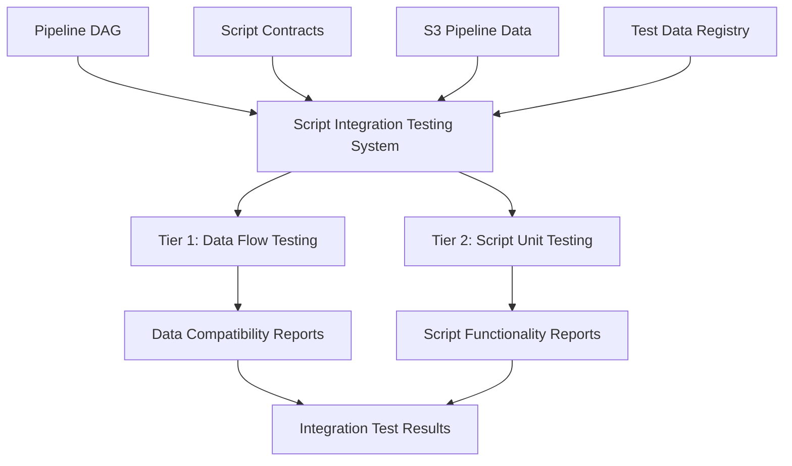
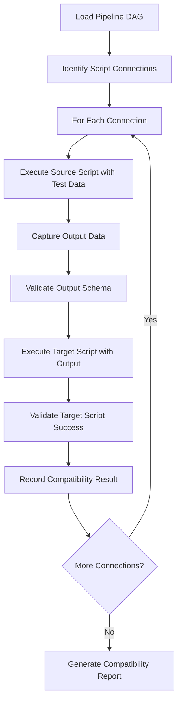
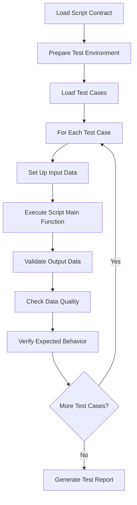
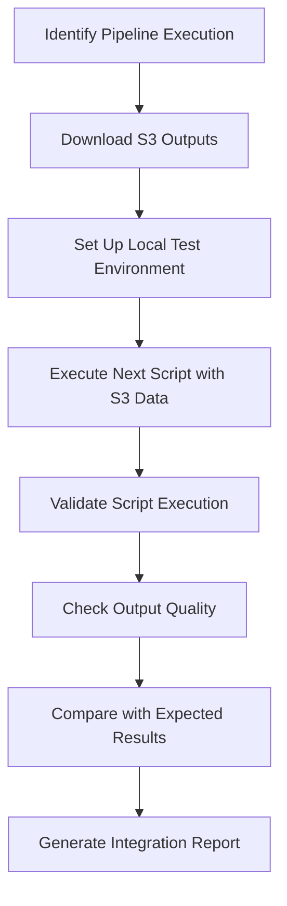

---
tags:
  - design
  - script_integration
  - testing_framework
  - pipeline_validation
  - system_architecture
keywords:
  - script integration testing
  - data flow validation
  - unit testing framework
  - S3 integration
  - pipeline script testing
  - SageMaker pipeline testing
  - script contracts
  - data compatibility
  - test automation
  - quality assurance
topics:
  - script integration testing
  - pipeline validation
  - test automation
  - data flow compatibility
language: python
date of note: 2025-08-13
---

# Script Integration Testing System Design

## Overview

This design document outlines a comprehensive integrated testing system for scripts involved in SageMaker pipelines. The system addresses the critical need for testing both data flow compatibility between connected scripts and individual script functionality in production pipeline environments.

## Problem Statement

Currently, the cursus package focuses on auto-compiling DAGs to SageMaker Pipelines, concerning itself primarily with input/output connections for pipeline assembly. However, for production pipelines, both pipeline structure and script functionality must be validated. This creates two critical testing requirements:

### 1. Data Flow Compatibility Testing (Requirement 3.1)
**Problem**: Data passing between scripts along pipeline paths may fail due to schema mismatches, format incompatibilities, or contract violations. Script 1 may output data in format A, but Script 2 expects data in format B, causing pipeline failures.

**Goal**: Ensure output data from Script 1 can be used directly by Script 2 (as if they were neighboring code blocks in a Jupyter Notebook).

### 2. Script Functionality Testing (Requirement 3.2)
**Problem**: Each script may have expected behavior and output quality requirements that need validation. For SageMaker pipelines, each step's output is stored in known S3 locations, but there's no systematic way to test script functionality using this real data.

**Goal**: Enable unit testing for script functionality and data quality inspection using both synthetic test data and real S3 data from previous pipeline executions.

## Solution Architecture

The solution is a **two-tier integrated testing system** implemented as the `script_integration` module within the cursus package.

### System Architecture Overview



### Module Structure

```
src/cursus/script_integration/
├── __init__.py                          # Main exports and API
├── core/                                # Core testing components
│   ├── __init__.py
│   ├── pipeline_data_flow_tester.py     # Tests data flow between scripts
│   ├── script_unit_tester.py            # Individual script functionality testing
│   ├── test_data_registry.py            # Manages test data across scripts
│   └── s3_integration_manager.py        # S3 data integration for testing
├── data/                                # Data management and validation
│   ├── __init__.py
│   ├── test_data_manager.py             # Test data lifecycle management
│   ├── schema_validator.py              # Data schema validation
│   └── synthetic_data_generator.py      # Generate synthetic test data
├── execution/                           # Script execution engines
│   ├── __init__.py
│   ├── script_execution_engine.py       # Core script execution logic
│   ├── isolated_test_runner.py          # Local isolated testing
│   └── container_test_runner.py         # Container-based testing
├── reporting/                           # Test result reporting
│   ├── __init__.py
│   ├── test_result_reporter.py          # General test result reporting
│   ├── compatibility_reporter.py        # Data flow compatibility reports
│   └── data_quality_reporter.py         # Data quality assessment reports
└── cli/                                 # Command-line interface
    ├── __init__.py
    ├── integration_test_cli.py           # CLI commands for testing
    └── test_config_manager.py            # Test configuration management
```

## Core Components

### 1. Pipeline Data Flow Tester

**Purpose**: Tests data compatibility between connected scripts in a pipeline DAG (addresses Requirement 3.1).

```python
class PipelineDataFlowTester:
    """Tests data compatibility between connected scripts in a pipeline DAG"""
    
    def __init__(self, dag: PipelineDAG, test_data_registry: TestDataRegistry):
        self.dag = dag
        self.test_data_registry = test_data_registry
        self.execution_engine = ScriptExecutionEngine()
    
    def test_pipeline_path(self, path: List[str]) -> DataFlowTestResult:
        """Test data flow along a specific path in the pipeline"""
        
    def test_full_pipeline(self) -> PipelineTestResult:
        """Test all data flows in the entire pipeline"""
        
    def validate_data_contracts(self, source_script: str, target_script: str) -> ContractValidationResult:
        """Validate that output from source script matches input expectations of target script"""
```

**Key Features**:
- Automatic discovery of script connections from DAG structure
- Sequential execution of connected scripts with data flow validation
- Schema compatibility checking between script outputs and inputs
- Contract validation using existing Script Contract framework

### 2. Script Unit Tester

**Purpose**: Individual script functionality and data quality testing (addresses Requirement 3.2).

```python
class ScriptUnitTester:
    """Individual script functionality and data quality testing"""
    
    def __init__(self, script_contract: ScriptContract):
        self.contract = script_contract
        self.test_data_manager = TestDataManager()
        
    def test_script_functionality(self, test_cases: List[TestCase]) -> ScriptTestResult:
        """Run unit tests for script functionality"""
        
    def test_data_quality(self, input_data: Any, expected_output_schema: Schema) -> DataQualityResult:
        """Validate output data quality and schema compliance"""
        
    def test_with_s3_data(self, s3_locations: Dict[str, str]) -> S3TestResult:
        """Test script using actual S3 data from previous pipeline runs"""
```

**Key Features**:
- Leverages existing script testability improvements (parameterized main functions)
- Supports both synthetic test data and real S3 data from pipeline executions
- Data quality validation with configurable quality checks
- Expected behavior validation with customizable assertions

### 3. S3 Integration Manager

**Purpose**: Manages S3 data access for testing with real pipeline outputs.

```python
class S3IntegrationManager:
    """Manages S3 data access for testing with real pipeline outputs"""
    
    def download_pipeline_outputs(self, pipeline_execution_id: str, step_name: str) -> str:
        """Download outputs from a specific pipeline step execution"""
        
    def setup_test_s3_environment(self, test_scenario: str) -> S3TestEnvironment:
        """Set up isolated S3 environment for testing"""
        
    def validate_s3_data_schema(self, s3_path: str, expected_schema: Schema) -> ValidationResult:
        """Validate that S3 data matches expected schema"""
```

**Key Features**:
- Direct integration with SageMaker pipeline S3 outputs
- Isolated test environments to prevent data contamination
- Schema validation for S3 data before testing
- Support for both individual step outputs and full pipeline data

### 4. Test Data Registry

**Purpose**: Manages test data for different scripts and pipeline scenarios.

```python
class TestDataRegistry:
    """Manages test data for different scripts and pipeline scenarios"""
    
    def register_test_data(self, script_name: str, test_case: str, data: TestData):
        """Register test data for a specific script and test case"""
        
    def get_compatible_data(self, source_script: str, target_script: str) -> TestData:
        """Get test data that's compatible between two connected scripts"""
        
    def generate_synthetic_data(self, schema: DataSchema) -> TestData:
        """Generate synthetic test data based on schema requirements"""
```

**Key Features**:
- Centralized test data management across all scripts
- Compatibility mapping between connected scripts
- Synthetic data generation based on script contracts
- Version control for test data evolution

## Testing Workflows

### Workflow 1: Data Flow Compatibility Testing



**Process**:
1. Parse pipeline DAG to identify all script connections
2. For each connection (Script A → Script B):
   - Execute Script A with appropriate test data
   - Capture and validate Script A's output
   - Use Script A's output as input for Script B
   - Execute Script B and validate successful completion
   - Record compatibility results and any issues
3. Generate comprehensive compatibility report

### Workflow 2: Script Unit Testing



**Process**:
1. Load script contract to understand requirements
2. Prepare isolated test environment
3. For each test case:
   - Set up input data (synthetic or real S3 data)
   - Execute script's main function with test parameters
   - Validate output data against expected schema
   - Perform data quality checks
   - Verify expected behavior and metrics
4. Generate detailed test report with pass/fail results

### Workflow 3: S3 Integration Testing



**Process**:
1. Identify specific pipeline execution and step
2. Download actual S3 outputs from the step
3. Set up local test environment with downloaded data
4. Execute the next script in the pipeline using real data
5. Validate successful execution and output quality
6. Compare results with expected outcomes
7. Generate integration test report

## Integration with Existing Architecture

The script integration testing system leverages existing cursus components:

### 1. Script Contracts (`src/cursus/steps/contracts/`)
- **Usage**: Understand script input/output requirements and environment variables
- **Integration**: Validate that test data matches contract specifications
- **Benefit**: Ensures test scenarios align with actual script requirements

### 2. Pipeline DAG (`src/cursus/api/`)
- **Usage**: Identify script connections and test paths automatically
- **Integration**: Parse DAG structure to determine which scripts need compatibility testing
- **Benefit**: Automatic test discovery without manual configuration

### 3. Dependency Resolution (`src/cursus/core/deps/`)
- **Usage**: Understand data dependencies between scripts
- **Integration**: Use dependency information to validate data flow compatibility
- **Benefit**: Leverages existing dependency analysis for test planning

### 4. Step Specifications (`src/cursus/steps/specs/`)
- **Usage**: Validation of script behavior and output specifications
- **Integration**: Use specifications to define expected test outcomes
- **Benefit**: Consistent validation criteria across testing and production

### 5. Existing Test Framework (`test/`)
- **Usage**: Extend existing test infrastructure (602 tests, 85.5% success rate)
- **Integration**: Add script integration tests to existing test suite
- **Benefit**: Unified test reporting and CI/CD integration

### 6. Script Testability Improvements
- **Usage**: Leverage parameterized main functions for isolated testing
- **Integration**: Use existing `main(input_paths, output_paths, environ_vars, job_args)` pattern
- **Benefit**: Scripts already designed for testability

## API Examples

### Example 1: Test Data Flow Between Two Scripts

```python
from cursus.script_integration import PipelineDataFlowTester
from cursus.api import PipelineDAG

# Create DAG
dag = PipelineDAG()
dag.add_node("TabularPreprocessing")
dag.add_node("XGBoostTraining")
dag.add_edge("TabularPreprocessing", "XGBoostTraining")

# Test data flow
tester = PipelineDataFlowTester(dag, test_data_registry)
result = tester.test_pipeline_path(["TabularPreprocessing", "XGBoostTraining"])

print(f"Data flow compatibility: {result.is_compatible}")
print(f"Issues found: {result.issues}")
for issue in result.issues:
    print(f"  - {issue.description} (severity: {issue.severity})")
```

### Example 2: Unit Test Individual Script

```python
from cursus.script_integration import ScriptUnitTester
from cursus.steps.contracts import XGBOOST_EVAL_CONTRACT

# Set up unit tester
tester = ScriptUnitTester(XGBOOST_EVAL_CONTRACT)

# Define test cases
test_cases = [
    TestCase(
        name="binary_classification",
        input_data={
            "model_dir": "test/data/binary_model", 
            "eval_data_dir": "test/data/binary_eval"
        },
        expected_metrics={"auc_roc": 0.85, "f1_score": 0.75},
        expected_outputs=["eval_predictions.csv", "metrics.json"]
    ),
    TestCase(
        name="multiclass_classification",
        input_data={
            "model_dir": "test/data/multiclass_model",
            "eval_data_dir": "test/data/multiclass_eval"
        },
        expected_metrics={"auc_roc_macro": 0.80, "f1_score_macro": 0.70}
    )
]

# Run tests
result = tester.test_script_functionality(test_cases)
print(f"Tests passed: {result.passed}/{result.total}")
for test_result in result.test_results:
    print(f"  {test_result.name}: {'PASS' if test_result.passed else 'FAIL'}")
    if not test_result.passed:
        print(f"    Error: {test_result.error_message}")
```

### Example 3: Test with Real S3 Data

```python
from cursus.script_integration import S3IntegrationManager, ScriptUnitTester

# Set up S3 integration
s3_manager = S3IntegrationManager()
s3_data_path = s3_manager.download_pipeline_outputs(
    pipeline_execution_id="pipeline-exec-123", 
    step_name="TabularPreprocessing"
)

# Test next script with real data
tester = ScriptUnitTester(XGBOOST_TRAINING_CONTRACT)
result = tester.test_with_s3_data({
    "training_data": s3_data_path,
    "validation_data": s3_data_path + "/validation"
})

print(f"S3 integration test: {'PASS' if result.passed else 'FAIL'}")
print(f"Data quality score: {result.data_quality_score}")
print(f"Performance metrics: {result.performance_metrics}")
```

### Example 4: Comprehensive Pipeline Testing

```python
from cursus.script_integration import PipelineDataFlowTester, TestDataRegistry
from cursus.api import PipelineDAG

# Load pipeline DAG
dag = PipelineDAG.from_file("pipelines/fraud_detection.py")

# Set up test data registry
test_registry = TestDataRegistry()
test_registry.load_test_scenarios("test_data/fraud_detection_scenarios.yaml")

# Run comprehensive pipeline test
tester = PipelineDataFlowTester(dag, test_registry)
result = tester.test_full_pipeline()

print(f"Pipeline compatibility: {result.overall_compatibility}")
print(f"Total connections tested: {result.connections_tested}")
print(f"Failed connections: {len(result.failed_connections)}")

# Generate detailed report
report_path = result.generate_report("reports/fraud_detection_compatibility.html")
print(f"Detailed report saved to: {report_path}")
```

## CLI Interface

### Command Structure

```bash
# Test data flow compatibility
cursus script-integration test-flow --dag my_pipeline.py --path "DataLoading,Preprocessing,Training"

# Test individual script functionality
cursus script-integration test-script --script xgboost_model_evaluation --test-cases test_cases.yaml

# Test script with real S3 data
cursus script-integration test-s3 --pipeline-execution pipeline-exec-123 --script XGBoostTraining

# Run comprehensive integration test suite
cursus script-integration test-all --config integration_test_config.yaml

# Generate test data for a specific script
cursus script-integration generate-data --script TabularPreprocessing --schema schema.json

# Validate script contracts
cursus script-integration validate-contracts --dag my_pipeline.py

# Generate test report
cursus script-integration report --test-results results/ --format html --output report.html
```

### CLI Examples

#### Test Data Flow Compatibility
```bash
# Test specific path in pipeline
cursus script-integration test-flow \
  --dag pipelines/fraud_detection.py \
  --path "CradleDataLoading,TabularPreprocessing,XGBoostTraining" \
  --test-data test_data/fraud_detection/ \
  --output-report reports/flow_test.json

# Test all connections in pipeline
cursus script-integration test-flow \
  --dag pipelines/credit_scoring.py \
  --all-paths \
  --parallel \
  --output-report reports/full_flow_test.html
```

#### Test Individual Script
```bash
# Test with predefined test cases
cursus script-integration test-script \
  --script xgboost_model_evaluation \
  --test-cases test_cases/xgboost_eval_cases.yaml \
  --output-dir test_results/

# Test with custom data
cursus script-integration test-script \
  --script tabular_preprocessing \
  --input-data test_data/raw_data.csv \
  --expected-output-schema schemas/processed_data_schema.json \
  --quality-checks all
```

#### S3 Integration Testing
```bash
# Test with specific pipeline execution data
cursus script-integration test-s3 \
  --pipeline-execution arn:aws:sagemaker:us-east-1:123456789012:pipeline/fraud-detection/execution/exec-123 \
  --step TabularPreprocessing \
  --next-script XGBoostTraining \
  --validate-schema

# Test with S3 bucket data
cursus script-integration test-s3 \
  --s3-bucket my-pipeline-outputs \
  --s3-prefix fraud-detection/2025-08-13/ \
  --script XGBoostModelEvaluation \
  --download-timeout 300
```

## Configuration System

### Integration Test Configuration

```yaml
# integration_test_config.yaml
test_scenarios:
  - name: "fraud_detection_pipeline"
    dag_file: "pipelines/fraud_detection.py"
    test_data_path: "test_data/fraud_detection/"
    s3_bucket: "my-pipeline-test-bucket"
    s3_prefix: "fraud-detection-tests/"
    timeout_minutes: 30
    
  - name: "credit_scoring_pipeline"
    dag_file: "pipelines/credit_scoring.py"
    test_data_path: "test_data/credit_scoring/"
    s3_bucket: "my-pipeline-test-bucket"
    s3_prefix: "credit-scoring-tests/"

script_tests:
  xgboost_model_evaluation:
    test_cases:
      - name: "binary_classification"
        input_data:
          model_dir: "test_data/models/binary_xgboost"
          eval_data_dir: "test_data/evaluation/binary_data"
        expected_metrics:
          auc_roc: ">= 0.8"
          f1_score: ">= 0.7"
          average_precision: ">= 0.75"
        expected_outputs:
          - "eval_predictions.csv"
          - "metrics.json"
          - "roc_curve.jpg"
      - name: "multiclass_classification"
        input_data:
          model_dir: "test_data/models/multiclass_xgboost"
          eval_data_dir: "test_data/evaluation/multiclass_data"
        expected_metrics:
          auc_roc_macro: ">= 0.75"
          f1_score_macro: ">= 0.70"

  tabular_preprocessing:
    test_cases:
      - name: "standard_preprocessing"
        input_data:
          raw_data_dir: "test_data/raw/standard_dataset"
        expected_schema: "schemas/processed_data_schema.json"
        data_quality_checks:
          - "no_missing_values"
          - "numeric_ranges"
          - "categorical_consistency"
          - "data_distribution"

data_quality_checks:
  - check_type: "schema_validation"
    enabled: true
    strict_mode: true
  - check_type: "data_drift_detection"
    enabled: true
    threshold: 0.1
  - check_type: "statistical_validation"
    enabled: true
    confidence_level: 0.95
  - check_type: "missing_value_detection"
    enabled: true
    max_missing_ratio: 0.05

s3_integration:
  default_bucket: "my-pipeline-test-bucket"
  download_timeout_seconds: 300
  retry_attempts: 3
  temp_directory: "/tmp/script_integration_tests"
  cleanup_after_test: true

reporting:
  formats: ["html", "json", "junit"]
  include_plots: true
  include_data_samples: true
  max_sample_size: 1000
  output_directory: "test_reports"

execution:
  parallel_execution: true
  max_workers: 4
  timeout_minutes: 60
  isolation_mode: "process"  # or "container"
  container_image: "cursus-test-runner:latest"
```

### Test Case Configuration

```yaml
# test_cases/xgboost_eval_cases.yaml
test_cases:
  - name: "binary_classification_high_performance"
    description: "Test binary classification with high-performance model"
    input_data:
      model_dir: "test_data/models/high_perf_binary"
      eval_data_dir: "test_data/evaluation/binary_high_perf"
    environment_vars:
      ID_FIELD: "customer_id"
      LABEL_FIELD: "is_fraud"
    expected_metrics:
      auc_roc: ">= 0.90"
      f1_score: ">= 0.85"
      average_precision: ">= 0.88"
    expected_outputs:
      - "eval_predictions.csv"
      - "metrics.json"
      - "metrics_summary.txt"
      - "roc_curve.jpg"
      - "pr_curve.jpg"
    data_quality_assertions:
      - "predictions_in_range_0_1"
      - "no_nan_predictions"
      - "consistent_prediction_count"

  - name: "multiclass_classification_standard"
    description: "Test multiclass classification with standard model"
    input_data:
      model_dir: "test_data/models/multiclass_standard"
      eval_data_dir: "test_data/evaluation/multiclass_standard"
    environment_vars:
      ID_FIELD: "transaction_id"
      LABEL_FIELD: "risk_category"
    expected_metrics:
      auc_roc_macro: ">= 0.80"
      auc_roc_micro: ">= 0.82"
      f1_score_macro: ">= 0.75"
      f1_score_micro: ">= 0.78"
    expected_outputs:
      - "eval_predictions.csv"
      - "metrics.json"
      - "class_0_roc_curve.jpg"
      - "class_1_roc_curve.jpg"
      - "class_2_roc_curve.jpg"

  - name: "edge_case_small_dataset"
    description: "Test model evaluation with very small dataset"
    input_data:
      model_dir: "test_data/models/binary_standard"
      eval_data_dir: "test_data/evaluation/small_dataset"
    environment_vars:
      ID_FIELD: "id"
      LABEL_FIELD: "label"
    expected_behavior:
      should_complete: true
      min_predictions: 10
      max_execution_time_seconds: 30
    warnings_expected:
      - "small_dataset_warning"
```

## Implementation Phases

### Phase 1: Core Infrastructure (Weeks 1-2)
**Deliverables**:
- `ScriptExecutionEngine` with support for parameterized script execution
- `IsolatedTestRunner` for local script testing
- `TestDataRegistry` with basic test data management
- Basic CLI structure with core commands

**Key Components**:
```python
# src/cursus/script_integration/execution/script_execution_engine.py
class ScriptExecutionEngine:
    def execute_script(self, script_path: str, input_paths: Dict, output_paths: Dict, 
                      environ_vars: Dict, job_args: argparse.Namespace) -> ExecutionResult
    
# src/cursus/script_integration/execution/isolated_test_runner.py
class IsolatedTestRunner:
    def run_test(self, test_case: TestCase) -> TestResult
    def setup_test_environment(self, test_case: TestCase) -> TestEnvironment
    def cleanup_test_environment(self, test_env: TestEnvironment) -> None
```

### Phase 2: Data Flow Testing (Weeks 3-4)
**Deliverables**:
- `PipelineDataFlowTester` with full DAG analysis
- Data compatibility validation logic
- Pipeline path discovery and execution
- Basic compatibility reporting

**Key Components**:
```python
# src/cursus/script_integration/core/pipeline_data_flow_tester.py
class PipelineDataFlowTester:
    def analyze_dag_connections(self, dag: PipelineDAG) -> List[ScriptConnection]
    def test_script_connection(self, connection: ScriptConnection) -> ConnectionTestResult
    def validate_data_schema_compatibility(self, output_schema: Schema, input_schema: Schema) -> bool
```

### Phase 3: Unit Testing Framework (Weeks 5-6)
**Deliverables**:
- `ScriptUnitTester` with comprehensive test case support
- Schema validation and data quality checks
- Synthetic data generation capabilities
- Detailed test result reporting

**Key Components**:
```python
# src/cursus/script_integration/core/script_unit_tester.py
class ScriptUnitTester:
    def load_test_cases(self, test_cases_file: str) -> List[TestCase]
    def execute_test_case(self, test_case: TestCase) -> TestCaseResult
    def validate_expected_metrics(self, actual_metrics: Dict, expected_metrics: Dict) -> ValidationResult
```

### Phase 4: S3 Integration (Weeks 7-8)
**Deliverables**:
- `S3IntegrationManager` with full SageMaker pipeline integration
- Real pipeline data testing capabilities
- S3 test environment management
- Pipeline execution data discovery

**Key Components**:
```python
# src/cursus/script_integration/core/s3_integration_manager.py
class S3IntegrationManager:
    def discover_pipeline_executions(self, pipeline_name: str) -> List[PipelineExecution]
    def download_step_outputs(self, execution_id: str, step_name: str) -> str
    def setup_isolated_s3_environment(self, test_name: str) -> S3TestEnvironment
```

### Phase 5: Reporting & CLI (Weeks 9-10)
**Deliverables**:
- Comprehensive reporting system with multiple formats
- Complete CLI interface with all commands
- Configuration management system
- Integration with existing cursus CLI

**Key Components**:
```python
# src/cursus/script_integration/reporting/test_result_reporter.py
class TestResultReporter:
    def generate_html_report(self, results: TestResults) -> str
    def generate_json_report(self, results: TestResults) -> str
    def generate_junit_report(self, results: TestResults) -> str
```

### Phase 6: Integration & Documentation (Weeks 11-12)
**Deliverables**:
- Full integration with existing cursus architecture
- Comprehensive documentation and tutorials
- Example test suites for common pipeline patterns
- CI/CD integration guidelines

## Success Metrics

### Technical Metrics
1. **Data Flow Compatibility**: 95%+ compatibility rate between connected scripts
2. **Script Functionality Coverage**: 90%+ test coverage for individual scripts
3. **S3 Integration Success**: 98%+ successful tests with real pipeline data
4. **Performance**: Test execution time < 5 minutes for full pipeline validation
5. **Reliability**: 99%+ test execution success rate

### Quality Metrics
1. **False Positive Rate**: < 2% for compatibility tests
2. **False Negative Rate**: < 1% for functionality tests
3. **Data Quality Detection**: 95%+ accuracy in detecting data quality issues
4. **Schema Validation**: 100% accuracy in schema compatibility detection

### Usability Metrics
1. **CLI Usability**: Intuitive commands with comprehensive help
2. **Configuration Simplicity**: < 10 lines of YAML for basic test scenarios
3. **Report Clarity**: Clear, actionable reports for both technical and business users
4. **Integration Ease**: < 1 hour to integrate with existing pipeline projects

## Benefits and Value Proposition

### 1. Risk Reduction
- **Early Detection**: Catch data compatibility issues before production deployment
- **Quality Assurance**: Validate script functionality with real data
- **Regression Prevention**: Detect when changes break existing functionality

### 2. Development Efficiency
- **Faster Debugging**: Isolate issues to specific script interactions
- **Automated Testing**: Reduce manual testing effort by 80%
- **Continuous Validation**: Integrate with CI/CD for automatic validation

### 3. Production Reliability
- **Data Flow Validation**: Ensure data passes correctly between pipeline steps
- **Quality Monitoring**: Monitor data quality throughout the pipeline
- **Performance Validation**: Validate script performance with real data volumes

### 4. Operational Excellence
- **Comprehensive Reporting**: Detailed reports for troubleshooting and auditing
- **Historical Tracking**: Track test results over time to identify trends
- **Stakeholder Communication**: Clear reports for both technical and business stakeholders

## Integration Points with Existing Cursus Architecture

### 1. Script Contracts Integration
```python
# Leverage existing script contracts for test validation
from cursus.steps.contracts import XGBOOST_EVAL_CONTRACT
from cursus.script_integration import ScriptUnitTester

tester = ScriptUnitTester(XGBOOST_EVAL_CONTRACT)
# Contract automatically provides expected inputs, outputs, and environment variables
```

### 2. Pipeline DAG Integration
```python
# Use existing DAG structure for automatic test discovery
from cursus.api import PipelineDAG
from cursus.script_integration import PipelineDataFlowTester

dag = PipelineDAG.from_file("my_pipeline.py")
tester = PipelineDataFlowTester(dag, test_registry)
# Automatically discovers all script connections for testing
```

### 3. Dependency Resolution Integration
```python
# Leverage existing dependency resolution for test planning
from cursus.core.deps import UnifiedDependencyResolver
from cursus.script_integration.core import TestPlanGenerator

resolver = UnifiedDependencyResolver()
test_planner = TestPlanGenerator(resolver)
# Uses dependency information to optimize test execution order
```

### 4. Existing Test Framework Extension
```python
# Extend existing test infrastructure
from cursus.script_integration import IntegrationTestSuite
import unittest

class PipelineIntegrationTests(unittest.TestCase):
    def setUp(self):
        self.integration_suite = IntegrationTestSuite()
    
    def test_fraud_detection_pipeline(self):
        result = self.integration_suite.test_pipeline("fraud_detection.py")
        self.assertTrue(result.all_tests_passed)
```

## Future Enhancements

### 1. Advanced Analytics
- **Performance Profiling**: Detailed performance analysis of script execution
- **Resource Usage Monitoring**: Track CPU, memory, and I/O usage during tests
- **Bottleneck Identification**: Automatically identify performance bottlenecks

### 2. Machine Learning Integration
- **Predictive Testing**: Use ML to predict which tests are most likely to fail
- **Intelligent Test Selection**: Automatically select relevant tests based on code changes
- **Anomaly Detection**: Detect unusual patterns in test results

### 3. Cloud Integration
- **Multi-Cloud Support**: Support for AWS, Azure, and GCP pipeline testing
- **Distributed Testing**: Run tests across multiple cloud regions
- **Cost Optimization**: Optimize test execution costs through intelligent resource management

### 4. Advanced Reporting
- **Interactive Dashboards**: Web-based dashboards for test result visualization
- **Trend Analysis**: Long-term trend analysis of test results
- **Predictive Insights**: Predict potential issues based on historical data

## Related Design Documents

This design builds upon and integrates with several existing cursus design documents:

### Foundation Documents
- **[Script Contract](script_contract.md)** - Defines contracts between step specifications and script implementations; used by the integration tester to understand script requirements and validate test scenarios
- **[Script Testability Refactoring](script_testability_refactoring.md)** - Provides the testable script architecture pattern that enables the parameterized main functions used by the script integration testing system
- **[Step Specification](step_specification.md)** - Comprehensive step definitions that the integration tester uses to understand expected inputs, outputs, and behavior
- **[Pipeline DAG](pipeline_dag.md)** - Mathematical framework for pipeline topology that enables automatic discovery of script connections for data flow testing

### Testing Framework Documents
- **[Universal Step Builder Test](universal_step_builder_test.md)** - Standardized test suite for step builders; the script integration tester extends this approach to script-level testing
- **[Unified Alignment Tester Architecture](unified_alignment_tester_architecture.md)** - Comprehensive alignment testing framework that provides patterns for multi-level validation used in the integration tester
- **[Enhanced Universal Step Builder Tester Design](enhanced_universal_step_builder_tester_design.md)** - Step type-aware testing architecture that informs the script integration tester's approach to different script types

### Architecture Integration Documents
- **[Dependency Resolver](dependency_resolver.md)** - Intelligent connection engine that the integration tester leverages to understand script dependencies and data flow requirements
- **[Registry Manager](registry_manager.md)** - Multi-registry coordination system that the integration tester uses to discover script specifications and contracts
- **[Specification Registry](specification_registry.md)** - Context-aware specification storage that provides the foundation for script contract lookup in integration testing

### Configuration and Validation Documents
- **[Standardization Rules](standardization_rules.md)** - Quality enforcement patterns that the integration tester follows for consistent validation approaches
- **[Design Principles](design_principles.md)** - Architectural philosophy that guides the integration tester's design decisions and implementation patterns

### Step Builder Pattern Analysis Documents
- **[Processing Step Builder Patterns](processing_step_builder_patterns.md)** - Processing step implementation patterns that inform integration testing strategies for processing scripts
- **[Training Step Builder Patterns](training_step_builder_patterns.md)** - Training step patterns that guide integration testing approaches for training scripts
- **[Step Builder Patterns Summary](step_builder_patterns_summary.md)** - Comprehensive pattern analysis that provides the foundation for script type-specific testing strategies

### Implementation Support Documents
- **[Pipeline Template Builder V2](pipeline_template_builder_v2.md)** - Modern orchestration system that the integration tester can leverage for pipeline assembly during testing
- **[Config Field Categorization](config_field_categorization_consolidated.md)** - Field management architecture that informs the integration tester's configuration validation approaches

## Conclusion

The Script Integration Testing System provides a comprehensive solution for validating both data flow compatibility and script functionality in SageMaker pipelines. By leveraging the existing cursus architecture and extending it with specialized testing capabilities, this system addresses critical gaps in pipeline validation while maintaining consistency with established patterns and practices.

The two-tier approach ensures that both integration-level concerns (data flow between scripts) and unit-level concerns (individual script functionality) are thoroughly addressed, providing confidence in pipeline reliability and reducing the risk of production failures.

The system's design emphasizes:
- **Automation**: Minimal manual configuration required
- **Integration**: Seamless integration with existing cursus components
- **Flexibility**: Support for various testing scenarios and data sources
- **Scalability**: Designed to handle complex, multi-step pipelines
- **Usability**: Clear APIs and CLI interfaces for different user personas

This comprehensive testing framework will significantly improve the reliability and maintainability of SageMaker pipelines built with cursus, while providing the tools necessary for continuous validation and quality assurance in production environments.
