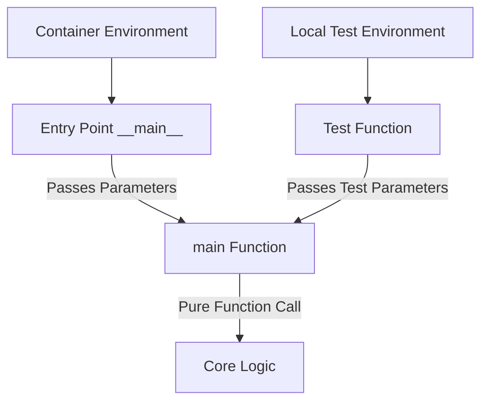
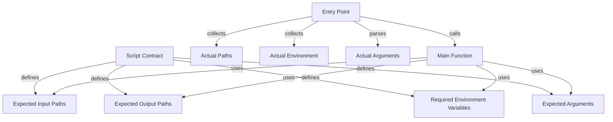

---
tags:
  - design
  - implementation
  - script_contracts
  - testability
  - docker
keywords:
  - script testing
  - testability
  - docker
  - script refactoring
  - main function
  - unit testing
  - function signature
  - input paths
  - output paths
  - environment variables
topics:
  - script testing
  - test automation
  - contract implementation
  - dependency injection
  - parameter passing
language: python
date of note: 2025-08-12
---

# Script Testability Refactoring Design

## Overview

This design document outlines a strategy for improving the testability of scripts in the `cursus/steps/scripts` directory. The primary goal is to ensure that these scripts can be effectively tested both locally and within Docker containers by separating execution environment concerns from core functionality.

## Problem Statement

Currently, scripts in `cursus/steps/scripts` have several testability issues:

1. **Direct environment variable access**: Scripts directly access environment variables within function bodies
2. **Hardcoded container paths**: Input and output paths are often hardcoded to container locations
3. **Argument parsing within main function**: Command-line arguments are parsed inside the main function
4. **Tightly coupled execution logic**: Core functionality is tightly coupled with container-specific setup

These issues make it difficult to test the scripts outside of their intended execution environment (Docker containers), limiting our ability to write comprehensive unit tests and requiring full container deployments for testing.

## Solution Design

The solution involves refactoring each script to follow a consistent pattern that separates container/environment-specific concerns from core functionality:

### 1. Core Design Principle: Parameter Injection

The primary design principle is to use parameter injection instead of direct environment access:



### 2. Main Function Signature

Each script will be refactored to have a consistent main function signature:

```python
def main(
    input_paths: Dict[str, str],  # Dictionary of logical names to physical file paths for inputs
    output_paths: Dict[str, str],  # Dictionary of logical names to physical file paths for outputs
    environ_vars: Dict[str, str],  # Dictionary of environment variables and their values
    job_args: argparse.Namespace   # Parsed command line arguments
) -> None:
    # Core functionality implementation
```

This signature explicitly declares all external dependencies and enables:
1. Direct parameter passing for testing
2. Clear documentation of required inputs/outputs
3. Isolation from the execution environment
4. Alignment with Script Contract concepts

### 3. Entry Point Refactoring Pattern

The entry point will be refactored to:
1. Parse command-line arguments
2. Set up container-specific paths
3. Collect environment variables 
4. Call the main function with the prepared parameters

```python
if __name__ == "__main__":
    # 1. Parse arguments
    parser = argparse.ArgumentParser()
    # Add arguments...
    args = parser.parse_args()
    
    # 2. Define container paths
    input_paths = {
        "model_dir": "/opt/ml/processing/model",
        "eval_data_dir": "/opt/ml/processing/evaluation",
        # ...other input paths
    }
    
    output_paths = {
        "output_eval_dir": "/opt/ml/processing/output/evaluation",
        "output_metrics_dir": "/opt/ml/processing/output/metrics",
        # ...other output paths
    }
    
    # 3. Collect environment variables
    environ_vars = {
        "ID_FIELD": os.environ.get("ID_FIELD", "id"),
        "LABEL_FIELD": os.environ.get("LABEL_FIELD", "label"),
        # ...other environment variables
    }
    
    # 4. Call main function
    main(input_paths, output_paths, environ_vars, args)
```

### 4. Integration with Script Contracts

The refactored script pattern aligns with our existing Script Contract framework:



The refactoring ensures that:
1. Input/output paths in the script match the contract
2. Environment variables in the script match the contract
3. Command-line arguments in the script match the contract

## Implementation Plan

### 1. Refactoring Pattern

For each script in `cursus/steps/scripts`:

1. Identify the script's current input paths, output paths, and environment variables
2. Extract the core functionality into a main function with the new signature
3. Create a new entry point that sets up the environment and calls the main function
4. Update any internal functions to accept parameters rather than accessing environment directly
5. Ensure the refactored script maintains the exact same behavior when run in a container

### 2. Example Transformation: xgboost_model_evaluation.py

From the current structure:

```python
def main():
    parser = argparse.ArgumentParser()
    # parser setup...
    args = parser.parse_args()
    
    # Access environment variables directly
    ID_FIELD = os.environ.get("ID_FIELD", "id")
    # Use command line arguments for paths
    model_dir = args.model_dir
    # ...function body...

if __name__ == "__main__":
    main()
```

To the refactored structure:

```python
def main(input_paths, output_paths, environ_vars, job_args):
    # Use paths from parameters
    model_dir = input_paths["model_dir"]
    eval_data_dir = input_paths["eval_data_dir"]
    output_eval_dir = output_paths["output_eval_dir"]
    output_metrics_dir = output_paths["output_metrics_dir"]
    
    # Use environment variables from parameters
    ID_FIELD = environ_vars.get("ID_FIELD", "id")
    LABEL_FIELD = environ_vars.get("LABEL_FIELD", "label")
    
    # Use job_args directly
    job_type = job_args.job_type
    
    # ...rest of function...

if __name__ == "__main__":
    parser = argparse.ArgumentParser()
    parser.add_argument("--job_type", type=str, required=True)
    parser.add_argument("--model_dir", type=str, required=True, help="Directory containing model artifacts")
    parser.add_argument("--eval_data_dir", type=str, required=True, help="Directory containing evaluation data")
    parser.add_argument("--output_eval_dir", type=str, required=True, help="Directory to save evaluation predictions")
    parser.add_argument("--output_metrics_dir", type=str, required=True, help="Directory to save metrics")
    args = parser.parse_args()
    
    # Define container paths
    input_paths = {
        "model_dir": args.model_dir,
        "eval_data_dir": args.eval_data_dir,
    }
    
    output_paths = {
        "output_eval_dir": args.output_eval_dir,
        "output_metrics_dir": args.output_metrics_dir,
    }
    
    # Collect environment variables
    environ_vars = {
        "ID_FIELD": os.environ.get("ID_FIELD", "id"),
        "LABEL_FIELD": os.environ.get("LABEL_FIELD", "label"),
    }
    
    # Ensure output directories exist
    os.makedirs(output_paths["output_eval_dir"], exist_ok=True)
    os.makedirs(output_paths["output_metrics_dir"], exist_ok=True)
    
    # Call main function
    main(input_paths, output_paths, environ_vars, args)
```

### 3. Testing Approach

With the refactored structure, testing becomes straightforward:

```python
def test_xgboost_model_evaluation():
    # Set up test paths
    input_paths = {
        "model_dir": "test/resources/model",
        "eval_data_dir": "test/resources/eval_data",
    }
    
    output_paths = {
        "output_eval_dir": "test/output/eval",
        "output_metrics_dir": "test/output/metrics",
    }
    
    # Set up test environment variables
    environ_vars = {
        "ID_FIELD": "test_id",
        "LABEL_FIELD": "test_label",
    }
    
    # Create mock arguments
    args = argparse.Namespace()
    args.job_type = "testing"
    
    # Create output directories
    os.makedirs(output_paths["output_eval_dir"], exist_ok=True)
    os.makedirs(output_paths["output_metrics_dir"], exist_ok=True)
    
    # Call the function under test
    from src.cursus.steps.scripts.xgboost_model_evaluation import main
    main(input_paths, output_paths, environ_vars, args)
    
    # Assertions to verify expected outputs
    assert os.path.exists(os.path.join(output_paths["output_eval_dir"], "eval_predictions.csv"))
    assert os.path.exists(os.path.join(output_paths["output_metrics_dir"], "metrics.json"))
    # ... more detailed assertions ...
```

## Container Integration

### Real-World Container Script Integration

When integrating this pattern with real container scripts, there are additional considerations:

1. **Standard SageMaker Container Paths**: Ensure compatibility with standard SageMaker path conventions:

   ```python
   # SageMaker Processing standard paths
   PROCESSING_INPUT_BASE = "/opt/ml/processing/input"
   PROCESSING_OUTPUT_BASE = "/opt/ml/processing/output"
   
   # SageMaker Training standard paths
   TRAINING_INPUT_BASE = "/opt/ml/input/data"
   MODEL_OUTPUT_PATH = "/opt/ml/model"
   ```

2. **Parameterize Container Path Constants**: Define container paths as constants that can be modified in one place:

   ```python
   # At the top of the script
   CONTAINER_PATHS = {
       "PROCESSING_INPUT_BASE": "/opt/ml/processing/input",
       "PROCESSING_OUTPUT_BASE": "/opt/ml/processing/output",
       # ...other container path constants
   }
   
   if __name__ == "__main__":
       # Use these constants when setting up paths
       input_paths = {
           "model_dir": f"{CONTAINER_PATHS['PROCESSING_INPUT_BASE']}/model",
           "eval_data_dir": f"{CONTAINER_PATHS['PROCESSING_INPUT_BASE']}/evaluation"
       }
   ```

3. **Container Environment Variables**: Handle container-specific environment variables:

   ```python
   # Common SageMaker environment variables
   SM_ENVIRONMENT_VARS = [
       "SM_NUM_GPUS", "SM_NUM_CPUS", "SM_HOSTS",
       "SM_CURRENT_HOST", "SM_MODEL_DIR", "SM_CHANNEL_TRAIN"
   ]
   
   if __name__ == "__main__":
       # Collect SageMaker environment variables
       sm_environ = {var: os.environ.get(var) for var in SM_ENVIRONMENT_VARS if var in os.environ}
       environ_vars.update(sm_environ)
   ```

4. **JSON Configuration Loading**: Handle JSON configuration loading in the entry point:

   ```python
   if __name__ == "__main__":
       # Load JSON configs commonly used in container scripts
       hyperparams_path = os.path.join(input_paths["config_dir"], "hyperparameters.json")
       if os.path.exists(hyperparams_path):
           with open(hyperparams_path, "r") as f:
               hyperparams = json.load(f)
           # Pass to main as part of environ_vars or as separate parameter
           environ_vars["hyperparameters"] = hyperparams
   ```

5. **Working with Container Artifacts**: Handle container artifacts consistently:

   ```python
   def main(input_paths, output_paths, environ_vars, job_args):
       # Example: Handle SageMaker artifacts consistently
       model_dir = input_paths["model_dir"]
       model_path = os.path.join(model_dir, "model.tar.gz")
       
       if os.path.exists(model_path):
           # Extract the model
           with tarfile.open(model_path) as tar:
               tar.extractall(path=model_dir)
   ```

6. **Container Logs and Metrics**: Ensure logs and metrics work in both container and local environments:

   ```python
   def main(input_paths, output_paths, environ_vars, job_args):
       # Configure logging to work in both container and local environments
       log_level = environ_vars.get("LOG_LEVEL", "INFO")
       logging.basicConfig(
           level=getattr(logging, log_level),
           format='%(asctime)s - %(name)s - %(levelname)s - %(message)s'
       )
       logger = logging.getLogger(__name__)
       
       # Use CloudWatch compatible logging when in container
       if environ_vars.get("SM_CURRENT_HOST"):
           logger.info(f"Running in SageMaker container on {environ_vars['SM_CURRENT_HOST']}")
   ```

7. **Multi-instance Training Support**: For distributed training scripts, handle multi-instance setup:

   ```python
   def main(input_paths, output_paths, environ_vars, job_args):
       # Handle distributed training setup
       hosts = environ_vars.get("SM_HOSTS", "").split(",") if environ_vars.get("SM_HOSTS") else []
       current_host = environ_vars.get("SM_CURRENT_HOST", "")
       is_master = current_host == hosts[0] if hosts else True
       
       # Use this information in your distributed training logic
       if is_master:
           logger.info("Running as master node")
           # Master node specific operations
   ```

8. **Integration with Container Health Checks**: Support container health checks:

   ```python
   def create_health_check_file(output_paths):
       """Create a health check file to signal container readiness."""
       health_path = os.path.join(output_paths.get("health_dir", "/tmp"), "health_check")
       with open(health_path, "w") as f:
           f.write(f"healthy: {datetime.now().isoformat()}")
       return health_path
   
   if __name__ == "__main__":
       try:
           main(input_paths, output_paths, environ_vars, args)
           health_path = create_health_check_file(output_paths)
           logger.info(f"Created health check file: {health_path}")
       except Exception as e:
           logger.exception(f"Script failed with error: {e}")
           sys.exit(1)
   ```

### Real-World Integration Example

Here's a complete example showing how to refactor an XGBoost model evaluation script that will run in a container:

```python
#!/usr/bin/env python
import os
import json
import argparse
import pandas as pd
import numpy as np
import pickle as pkl
import logging
import sys
from pathlib import Path
from datetime import datetime
from sklearn.metrics import roc_auc_score, average_precision_score
import xgboost as xgb

# Configure logging
logging.basicConfig(level=logging.INFO, format='%(asctime)s - %(levelname)s - %(message)s')
logger = logging.getLogger(__name__)

# Container path constants
CONTAINER_PATHS = {
    "PROCESSING_INPUT_BASE": "/opt/ml/processing/input",
    "PROCESSING_OUTPUT_BASE": "/opt/ml/processing/output",
    "MODEL_DIR": "/opt/ml/processing/input/model",
    "EVAL_DATA_DIR": "/opt/ml/processing/input/data",
    "OUTPUT_EVAL_DIR": "/opt/ml/processing/output/evaluation",
    "OUTPUT_METRICS_DIR": "/opt/ml/processing/output/metrics"
}

def main(input_paths, output_paths, environ_vars, job_args):
    """
    Main function for XGBoost model evaluation.
    
    Args:
        input_paths (dict): Dictionary of input paths
        output_paths (dict): Dictionary of output paths
        environ_vars (dict): Dictionary of environment variables
        job_args (argparse.Namespace): Command line arguments
    """
    # Extract paths from parameters
    model_dir = input_paths["model_dir"]
    eval_data_dir = input_paths["eval_data_dir"]
    output_eval_dir = output_paths["output_eval_dir"]
    output_metrics_dir = output_paths["output_metrics_dir"]
    
    # Extract environment variables
    id_field = environ_vars.get("ID_FIELD", "id")
    label_field = environ_vars.get("LABEL_FIELD", "label")
    
    # Use job_args
    job_type = job_args.job_type
    
    # Ensure output directories exist
    os.makedirs(output_eval_dir, exist_ok=True)
    os.makedirs(output_metrics_dir, exist_ok=True)
    
    logger.info("Starting model evaluation")
    logger.info(f"Job type: {job_type}")
    logger.info(f"Using ID field: {id_field}, label field: {label_field}")
    
    # Load model and evaluation data
    model, risk_tables, impute_dict, feature_columns, hyperparams = load_model_artifacts(model_dir)
    df = load_eval_data(eval_data_dir)
    
    # Preprocess data
    df = preprocess_eval_data(df, feature_columns, risk_tables, impute_dict)
    
    # Get ID and label columns
    id_col, label_col = get_id_label_columns(df, id_field, label_field)
    
    # Evaluate model
    evaluate_model(model, df, feature_columns, id_col, label_col, 
                  hyperparams, output_eval_dir, output_metrics_dir)
    
    logger.info("Model evaluation complete")

def load_model_artifacts(model_dir):
    # Implementation unchanged
    pass

def preprocess_eval_data(df, feature_columns, risk_tables, impute_dict):
    # Implementation unchanged
    pass

# ... Other helper functions ...

if __name__ == "__main__":
    parser = argparse.ArgumentParser()
    parser.add_argument("--job_type", type=str, required=True)
    parser.add_argument("--model_dir", type=str, help="Directory containing model artifacts")
    parser.add_argument("--eval_data_dir", type=str, help="Directory containing evaluation data")
    parser.add_argument("--output_eval_dir", type=str, help="Directory to save evaluation predictions")
    parser.add_argument("--output_metrics_dir", type=str, help="Directory to save metrics")
    args = parser.parse_args()
    
    # Use command line arguments if provided, otherwise use container defaults
    input_paths = {
        "model_dir": args.model_dir if args.model_dir else CONTAINER_PATHS["MODEL_DIR"],
        "eval_data_dir": args.eval_data_dir if args.eval_data_dir else CONTAINER_PATHS["EVAL_DATA_DIR"],
    }
    
    output_paths = {
        "output_eval_dir": args.output_eval_dir if args.output_eval_dir else CONTAINER_PATHS["OUTPUT_EVAL_DIR"],
        "output_metrics_dir": args.output_metrics_dir if args.output_metrics_dir else CONTAINER_PATHS["OUTPUT_METRICS_DIR"],
    }
    
    # Collect environment variables
    environ_vars = {
        "ID_FIELD": os.environ.get("ID_FIELD", "id"),
        "LABEL_FIELD": os.environ.get("LABEL_FIELD", "label"),
        # Add any other environment variables needed
    }
    
    try:
        # Call main function
        main(input_paths, output_paths, environ_vars, args)
        # Write success marker
        success_path = os.path.join(output_paths["output_metrics_dir"], "_SUCCESS")
        Path(success_path).touch()
        logger.info(f"Created success marker: {success_path}")
        sys.exit(0)
    except Exception as e:
        logger.exception(f"Script failed with error: {e}")
        # Write failure marker with error information
        failure_path = os.path.join(output_paths["output_metrics_dir"], "_FAILURE")
        with open(failure_path, "w") as f:
            f.write(f"Error: {str(e)}")
        sys.exit(1)
```

### Handling Special Container Scenarios

1. **Multi-GPU Training**: For scripts that utilize multiple GPUs:

   ```python
   def main(input_paths, output_paths, environ_vars, job_args):
       # Configure GPU usage based on container environment
       num_gpus = int(environ_vars.get("SM_NUM_GPUS", 0))
       if num_gpus > 0:
           # Set up multi-GPU training
           gpus = list(range(num_gpus))
           distributed_params = {
               "gpu_ids": gpus,
               "num_workers": min(num_gpus * 2, 8)  # Adjust workers based on GPU count
           }
       else:
           # CPU fallback
           distributed_params = {"gpu_ids": [], "num_workers": 2}
       
       # Pass to your training function
       train_model(input_paths, output_paths, distributed_params)
   ```

2. **S3 Data Handling**: For scripts that need to interact with S3 directly:

   ```python
   def main(input_paths, output_paths, environ_vars, job_args):
       # Handle S3 URIs in container
       if environ_vars.get("USE_S3_DIRECT", "false").lower() == "true":
           s3_bucket = environ_vars.get("S3_BUCKET")
           s3_prefix = environ_vars.get("S3_PREFIX")
           
           # Import boto3 here to keep it optional for local testing
           import boto3
           s3_client = boto3.client('s3')
           
           # Download data from S3 if needed
           if not os.path.exists(input_paths["data_dir"]):
               s3_client.download_file(
                   s3_bucket, 
                   f"{s3_prefix}/data.csv", 
                   os.path.join(input_paths["data_dir"], "data.csv")
               )
   ```

3. **Hybrid Container/Local Mode**: Support for both container and local execution:

   ```python
   def is_running_in_container():
       """Detect if the script is running inside a container."""
       return os.path.exists("/.dockerenv") or os.environ.get("CONTAINER_MODE") == "true"
   
   if __name__ == "__main__":
       in_container = is_running_in_container()
       
       if in_container:
           # Container mode - use container paths
           input_base = "/opt/ml/processing/input"
           output_base = "/opt/ml/processing/output"
       else:
           # Local mode - use local paths
           input_base = os.environ.get("LOCAL_INPUT_PATH", "./input")
           output_base = os.environ.get("LOCAL_OUTPUT_PATH", "./output")
       
       # Build paths based on execution environment
       input_paths = {
           "model_dir": os.path.join(input_base, "model"),
           "eval_data_dir": os.path.join(input_base, "evaluation")
       }
   ```

## Benefits

This refactoring approach provides several key benefits:

1. **Improved Testability**: Scripts can be tested outside of Docker containers
2. **Clear Separation of Concerns**: Environment setup is separated from core functionality
3. **Consistent Interface**: All scripts follow the same pattern
4. **Explicit Dependencies**: Required inputs, outputs, and environment variables are explicitly declared
5. **Contract Alignment**: Script structure aligns with the Script Contract concept
6. **Parameter Traceability**: All parameters can be traced from entry point to usage
7. **Documentation**: The main function signature serves as documentation of the script's requirements
8. **Reduced Coupling**: Core functionality is decoupled from the execution environment

## Integration with Current Design

This refactoring design builds on our existing Script Contract model:

1. **Script Contracts** define the expected inputs, outputs, and environment variables
2. The **Entry Point** collects actual values for these expected items
3. The **Main Function** receives these values as parameters
4. The core functionality uses these parameters instead of accessing the environment directly

This maintains the contract-based approach while improving testability.

## Implementation Sequence

The implementation will proceed in this order:

1. First, define and document the refactoring pattern (this document)
2. Create a template for the refactored script structure
3. Refactor one script as a proof of concept
4. Review and adjust the pattern if needed
5. Refactor the remaining scripts
6. Add unit tests for each refactored script
7. Update CI/CD pipeline to run these tests
8. Update documentation to reflect the new pattern

## Relationship to Existing Design Documents

This design extends and complements several existing designs:

1. [Script Contract](script_contract.md) - Formalizes the existing contract concept
2. [Level1 Script Contract Alignment](level1_script_contract_alignment_design.md) - Aligns with validation level 1
3. [Step Specification](step_specification.md) - Works with step specifications

## References

- [Script Contract Design](script_contract.md)
- [Script Contract Developer Guide](../0_developer_guide/script_contract.md)
- [Step Builder Design](step_builder.md)
- [Step Specification Design](step_specification.md)
