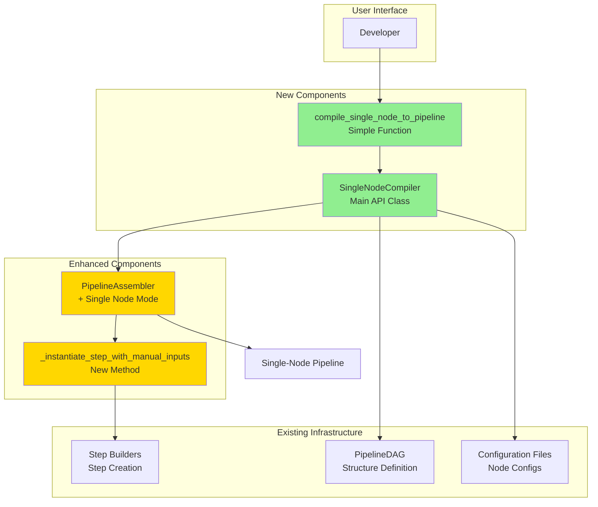

---
tags:
  - design
  - compiler
  - debugging
  - single_node_execution
  - manual_override
keywords:
  - single node execution
  - manual input override
  - debugging API
  - isolated execution
  - pipeline restart
  - partial pipeline
topics:
  - compiler architecture
  - debugging tools
  - developer experience
language: python
date of note: 2026-01-16
---

# Single Node Execution API Design

## Overview

The Single Node Execution API enables developers to execute individual pipeline nodes in isolation by manually providing input paths, bypassing the need to re-execute expensive upstream dependencies. This capability is essential for rapid debugging and iteration when pipeline failures occur late in execution after hours of successful computation.

## Motivation

### Problem Statement

Current pipeline execution has a critical limitation: when a pipeline fails at step N after expensive computation in steps 1 through N-1, developers must re-execute the entire pipeline from the beginning to test fixes. This results in:

1. **Time Waste**: Hours of redundant computation before reaching the problematic node
2. **Cost Inefficiency**: Repeated execution of expensive steps drives up AWS costs
3. **Development Friction**: Slow iteration cycles impede rapid debugging
4. **Resource Consumption**: Unnecessary compute resource utilization

### Example Scenario

```
Pipeline Execution Timeline:
├─ Step 1: Data Loading (30 minutes)      ✓ Success
├─ Step 2: Preprocessing (2 hours)        ✓ Success  
├─ Step 3: Feature Engineering (3 hours)  ✓ Success
└─ Step 4: Model Training (starts)        ✗ FAILURE

Problem: To fix Step 4, must re-run Steps 1-3 (5.5 hours!)
Solution: Run Step 4 alone with manual inputs from previous successful run
```

### Solution Requirements

The single node execution API must:

1. **Accept Manual Inputs**: Allow developers to specify S3 paths directly
2. **Bypass Dependencies**: Execute nodes without upstream steps
3. **Preserve Configuration**: Use same configs as full pipeline for consistency
4. **Validate Safely**: Ensure manual inputs match expected specifications
5. **Maintain Compatibility**: Work with all existing step types without modification

## System Architecture

### Component Overview



### File Structure

```
src/cursus/core/compiler/
├── __init__.py                     # Export new functions
├── dag_compiler.py                 # Existing: Full pipeline compilation
├── single_node_compiler.py         # NEW: Single node execution
├── dynamic_template.py             # Existing: Template generation
└── validation.py                   # Existing: Validation utilities
```

## Part 1: Core API

### 1.1 Main Entry Point Function

```python
def compile_single_node_to_pipeline(
    dag: PipelineDAG,
    config_path: str,
    target_node: str,
    manual_inputs: Dict[str, str],
    sagemaker_session: Optional[PipelineSession] = None,
    role: Optional[str] = None,
    pipeline_name: Optional[str] = None,
    validate_inputs: bool = True,
    **kwargs: Any,
) -> Pipeline:
    """
    Compile a single-node pipeline with manual input overrides.
    
    This function creates a minimal pipeline containing only the specified
    target node, with inputs manually provided as S3 paths instead of 
    connecting to upstream steps. This enables rapid debugging and iteration
    when pipeline failures occur after expensive upstream computation.
    
    Args:
        dag: Original PipelineDAG (used for node lookup and config resolution)
        config_path: Path to configuration file containing node configs
        target_node: Name of the node to execute in isolation
        manual_inputs: Dict mapping logical input names to S3 URIs
            Example: {"input_path": "s3://bucket/run-123/preprocess/data/"}
        sagemaker_session: SageMaker session for pipeline execution
        role: IAM role ARN for pipeline execution
        pipeline_name: Optional pipeline name override (default: "{target_node}-isolated")
        validate_inputs: Whether to validate manual inputs against specification (default: True)
        **kwargs: Additional arguments passed to compiler
    
    Returns:
        Single-node Pipeline ready for execution
        
    Raises:
        ValueError: If target node not found in DAG
        ConfigurationError: If node has no configuration
        ValidationError: If manual inputs don't match specification (when validate_inputs=True)
    
    Example:
        >>> # Original pipeline failed at training after 5 hours of preprocessing
        >>> dag = PipelineDAG()
        >>> dag.add_node("data_load")
        >>> dag.add_node("preprocess")
        >>> dag.add_node("train")
        >>> dag.add_edge("data_load", "preprocess")
        >>> dag.add_edge("preprocess", "train")
        >>>
        >>> # Use outputs from successful previous run
        >>> manual_inputs = {
        ...     "input_path": "s3://my-bucket/run-abc123/preprocess/training/processed_data/",
        ...     "validation_path": "s3://my-bucket/run-abc123/preprocess/validation/processed_data/"
        ... }
        >>>
        >>> # Create single-node pipeline for immediate testing
        >>> pipeline = compile_single_node_to_pipeline(
        ...     dag=dag,
        ...     config_path="configs/pipeline_config.json",
        ...     target_node="train",
        ...     manual_inputs=manual_inputs,
        ...     sagemaker_session=session,
        ...     role=role
        ... )
        >>>
        >>> # Execute immediately - no 5-hour wait!
        >>> execution = pipeline.start()
    """
```

### 1.2 Advanced API Class

```python
class SingleNodeCompiler:
    """
    Specialized compiler for single-node pipeline execution.
    
    This compiler creates isolated pipelines containing just one node,
    with manual input overrides bypassing normal dependency resolution.
    It provides additional control over validation, preview, and debugging.
    
    Attributes:
        config_path: Path to configuration file
        sagemaker_session: SageMaker session
        role: IAM role ARN
        config_resolver: Configuration resolver instance
        step_catalog: Step catalog for builder resolution
    """
    
    def __init__(
        self,
        config_path: str,
        sagemaker_session: Optional[PipelineSession] = None,
        role: Optional[str] = None,
        config_resolver: Optional[StepConfigResolver] = None,
        step_catalog: Optional[StepCatalog] = None,
        **kwargs: Any
    ):
        """
        Initialize single-node compiler.
        
        Args:
            config_path: Path to configuration file
            sagemaker_session: SageMaker session
            role: IAM role ARN
            config_resolver: Optional custom config resolver
            step_catalog: Optional custom step catalog
            **kwargs: Additional arguments for internal components
        """
        pass
    
    def validate_node_and_inputs(
        self,
        dag: PipelineDAG,
        target_node: str,
        manual_inputs: Dict[str, str]
    ) -> ValidationResult:
        """
        Validate target node and manual inputs before execution.
        
        Performs comprehensive validation including:
        - Node exists in DAG
        - Node has corresponding configuration
        - Configuration has corresponding step builder
        - Manual input names match expected logical names
        - S3 URIs are valid format
        - Required inputs are provided
        - Optional inputs warnings
        
        Args:
            dag: PipelineDAG containing the target node
            target_node: Name of node to validate
            manual_inputs: Manual input paths to validate
        
        Returns:
            ValidationResult with detailed validation information
            
        Example:
            >>> compiler = SingleNodeCompiler(config_path="configs/pipeline.json")
            >>> validation = compiler.validate_node_and_inputs(
            ...     dag=dag,
            ...     target_node="train",
            ...     manual_inputs={"input_path": "s3://bucket/data/"}
            ... )
            >>> if not validation.is_valid:
            ...     print(validation.detailed_report())
        """
        pass
    
    def preview_execution(
        self,
        dag: PipelineDAG,
        target_node: str,
        manual_inputs: Dict[str, str]
    ) -> ExecutionPreview:
        """
        Preview what will be executed without creating pipeline.
        
        Provides detailed preview including:
        - Step type and configuration
        - Input mappings (logical name -> S3 path)
        - Output paths that will be generated
        - Estimated execution details
        - Missing or incompatible inputs warnings
        
        Args:
            dag: PipelineDAG containing the target node
            target_node: Name of node to preview
            manual_inputs: Manual input paths
        
        Returns:
            ExecutionPreview with detailed execution information
            
        Example:
            >>> preview = compiler.preview_execution(
            ...     dag=dag,
            ...     target_node="train",
            ...     manual_inputs=manual_inputs
            ... )
            >>> print(preview.display())
            Step: train
            Type: XGBoostTraining
            Inputs:
              input_path: s3://bucket/data/train.csv
              validation_path: s3://bucket/data/val.csv
            Outputs:
              model_output: s3://bucket/models/xgboost/model.tar.gz
        """
        pass
    
    def compile(
        self,
        dag: PipelineDAG,
        target_node: str,
        manual_inputs: Dict[str, str],
        pipeline_name: Optional[str] = None,
        validate_inputs: bool = True
    ) -> Pipeline:
        """
        Compile single-node pipeline with manual inputs.
        
        Creates an isolated pipeline containing only the target node,
        bypassing normal dependency resolution and using manual inputs.
        
        Process:
        1. Validate node exists and has configuration
        2. Extract target node's config from config file
        3. Create minimal single-node DAG
        4. Create specialized assembler in single-node mode
        5. Override input resolution with manual paths
        6. Generate single-step pipeline
        
        Args:
            dag: Original PipelineDAG (for node lookup)
            target_node: Name of node to execute
            manual_inputs: Manual input paths
            pipeline_name: Optional pipeline name
            validate_inputs: Whether to validate inputs
        
        Returns:
            Single-node Pipeline ready for execution
            
        Raises:
            PipelineAPIError: If compilation fails
            ValidationError: If validation fails (when validate_inputs=True)
        """
        pass
    
    def get_node_specification(
        self,
        dag: PipelineDAG,
        target_node: str
    ) -> StepSpecification:
        """
        Get step specification for target node.
        
        Useful for understanding what inputs the node expects
        before providing manual inputs.
        
        Args:
            dag: PipelineDAG containing the target node
            target_node: Name of node
        
        Returns:
            StepSpecification with input/output definitions
            
        Example:
            >>> spec = compiler.get_node_specification(dag, "train")
            >>> print("Required inputs:")
            >>> for name, dep_spec in spec.dependencies.items():
            ...     if dep_spec.required:
            ...         print(f"  {name}: {dep_spec.dependency_type}")
        """
        pass
```

### 1.3 Supporting Data Structures

```python
@dataclass
class ExecutionPreview:
    """Preview of single-node execution."""
    
    target_node: str
    step_type: str
    config_type: str
    
    # Input mappings
    input_mappings: Dict[str, str]  # logical_name -> s3_path
    missing_required_inputs: List[str]
    missing_optional_inputs: List[str]
    
    # Output mappings
    output_paths: Dict[str, str]  # logical_name -> s3_path
    
    # Metadata
    estimated_instance_type: str
    estimated_duration: Optional[str]
    warnings: List[str]
    
    def display(self) -> str:
        """Generate formatted display string."""
        pass


@dataclass
class ValidationResult:
    """Result of node and input validation."""
    
    is_valid: bool
    
    # Node validation
    node_exists: bool
    has_configuration: bool
    has_builder: bool
    
    # Input validation
    valid_input_names: List[str]
    invalid_input_names: List[str]
    missing_required_inputs: List[str]
    invalid_s3_uris: List[str]
    
    # Messages
    errors: List[str]
    warnings: List[str]
    
    def detailed_report(self) -> str:
        """Generate detailed validation report."""
        pass
```

## Part 2: PipelineAssembler Enhancements

### 2.1 Single-Node Pipeline Generation

```python
class PipelineAssembler:
    """Enhanced with single-node execution mode."""
    
    def __init__(self, ...):
        # Existing initialization
        ...
        
        # New: Single-node mode flag
        self._single_node_mode = False
        self._target_node = None
        self._manual_inputs = {}
    
    def generate_single_node_pipeline(
        self,
        target_node: str,
        manual_inputs: Dict[str, str],
        pipeline_name: str
    ) -> Pipeline:
        """
        Generate pipeline with single node and manual inputs.
        
        This method bypasses normal message propagation and dependency
        resolution, directly instantiating the target node with provided
        manual inputs.
        
        Process:
        1. Set single-node mode flag
        2. Skip _propagate_messages() call
        3. Directly instantiate target node with manual inputs
        4. Create minimal pipeline with single step
        
        Args:
            target_node: Name of node to execute
            manual_inputs: Manual input paths (logical_name -> s3_uri)
            pipeline_name: Name for generated pipeline
        
        Returns:
            Single-node Pipeline
            
        Raises:
            ValueError: If target node not in assembler's step builders
        """
        logger.info(f"Generating single-node pipeline for: {target_node}")
        
        # Validate target node exists
        if target_node not in self.step_builders:
            raise ValueError(f"Target node '{target_node}' not found in step builders")
        
        # Set single-node mode
        self._single_node_mode = True
        self._target_node = target_node
        self._manual_inputs = manual_inputs
        
        # Reset step instances
        self.step_instances = {}
        
        try:
            # Instantiate only the target step with manual inputs
            step = self._instantiate_step_with_manual_inputs(
                target_node,
                manual_inputs
            )
            self.step_instances[target_node] = step
            
            # Create minimal pipeline
            pipeline = Pipeline(
                name=pipeline_name,
                parameters=self.pipeline_parameters,
                steps=[step],
                sagemaker_session=self.sagemaker_session,
            )
            
            logger.info(f"Generated single-node pipeline: {pipeline_name}")
            return pipeline
            
        finally:
            # Reset single-node mode
            self._single_node_mode = False
            self._target_node = None
            self._manual_inputs = {}
```

### 2.2 Manual Input Instantiation

```python
def _instantiate_step_with_manual_inputs(
    self,
    step_name: str,
    manual_inputs: Dict[str, str]
) -> Step:
    """
    Instantiate step with manually provided input paths.
    
    This method bypasses the normal message-based input resolution
    and directly uses the provided manual input paths.
    
    Args:
        step_name: Name of step to instantiate
        manual_inputs: Manual input paths (logical_name -> s3_uri)
    
    Returns:
        Instantiated SageMaker Step
        
    Notes:
        - No dependencies are added (isolated execution)
        - Outputs are generated normally using step specification
        - Builder's create_step() receives manual inputs directly
    """
    builder = self.step_builders[step_name]
    
    logger.info(f"Instantiating step '{step_name}' with manual inputs:")
    for input_name, s3_path in manual_inputs.items():
        logger.info(f"  {input_name}: {s3_path}")
    
    # No dependencies for isolated execution
    dependencies = []
    
    # Convert manual S3 paths to proper format
    # Manual inputs are already S3 URIs, no PropertyReference needed
    inputs = dict(manual_inputs)
    
    # Generate outputs using specification (same as normal flow)
    outputs = self._generate_outputs(step_name)
    
    # Create step with manual inputs
    kwargs = {
        "inputs": inputs,
        "outputs": outputs,
        "dependencies": dependencies,
        "enable_caching": builder.config.enable_caching,
    }
    
    try:
        step = builder.create_step(**kwargs)
        logger.info(f"Built isolated step '{step_name}'")
        return step
        
    except Exception as e:
        logger.error(f"Error building isolated step '{step_name}': {e}")
        raise ValueError(f"Failed to build isolated step '{step_name}': {e}") from e
```

## Part 3: Implementation Details

### 3.1 Input Validation

```python
def validate_manual_inputs(
    target_node: str,
    manual_inputs: Dict[str, str],
    step_spec: StepSpecification
) -> ValidationResult:
    """
    Validate manual inputs against step specification.
    
    Validation checks:
    1. All provided input names exist in specification
    2. All required inputs are provided
    3. S3 URIs are properly formatted
    4. Optional inputs warnings
    
    Args:
        target_node: Name of target node
        manual_inputs: Manual input paths
        step_spec: Step specification
    
    Returns:
        ValidationResult with detailed validation information
    """
    errors = []
    warnings = []
    valid_names = []
    invalid_names = []
    missing_required = []
    invalid_uris = []
    
    # Get expected inputs from specification
    expected_inputs = step_spec.dependencies
    
    # Check all provided inputs are valid
    for input_name in manual_inputs.keys():
        if input_name not in expected_inputs:
            invalid_names.append(input_name)
            errors.append(
                f"Input '{input_name}' not found in specification. "
                f"Expected: {list(expected_inputs.keys())}"
            )
        else:
            valid_names.append(input_name)
    
    # Check required inputs are provided
    for input_name, dep_spec in expected_inputs.items():
        if dep_spec.required and input_name not in manual_inputs:
            missing_required.append(input_name)
            errors.append(
                f"Required input '{input_name}' not provided. "
                f"Type: {dep_spec.dependency_type}"
            )
    
    # Check optional inputs not provided
    for input_name, dep_spec in expected_inputs.items():
        if not dep_spec.required and input_name not in manual_inputs:
            warnings.append(
                f"Optional input '{input_name}' not provided. "
                f"Step may use default or skip related processing."
            )
    
    # Validate S3 URI format
    import re
    s3_pattern = re.compile(r'^s3://[a-z0-9][a-z0-9\-\.]{1,61}[a-z0-9]/.+$')
    
    for input_name, s3_uri in manual_inputs.items():
        if not s3_pattern.match(s3_uri):
            invalid_uris.append(input_name)
            errors.append(
                f"Invalid S3 URI for '{input_name}': {s3_uri}. "
                f"Must start with 's3://' and follow S3 naming conventions."
            )
    
    # Determine overall validity
    is_valid = (
        len(errors) == 0 and
        len(invalid_names) == 0 and
        len(missing_required) == 0 and
        len(invalid_uris) == 0
    )
    
    return ValidationResult(
        is_valid=is_valid,
        node_exists=True,  # Checked separately
        has_configuration=True,  # Checked separately
        has_builder=True,  # Checked separately
        valid_input_names=valid_names,
        invalid_input_names=invalid_names,
        missing_required_inputs=missing_required,
        invalid_s3_uris=invalid_uris,
        errors=errors,
        warnings=warnings
    )
```

### 3.2 Isolated DAG Creation

```python
def create_isolated_dag(original_dag: PipelineDAG, target_node: str) -> PipelineDAG:
    """
    Create a minimal DAG containing only the target node.
    
    The isolated DAG has:
    - Single node (the target node)
    - No edges (no dependencies)
    - Minimal metadata
    
    This DAG is used for configuration resolution and step builder
    creation, but not for dependency resolution.
    
    Args:
        original_dag: Original PipelineDAG
        target_node: Name of node to isolate
    
    Returns:
        Minimal PipelineDAG with single node
        
    Raises:
        ValueError: If target node not in original DAG
    """
    if target_node not in original_dag.nodes:
        raise ValueError(
            f"Target node '{target_node}' not found in DAG. "
            f"Available nodes: {original_dag.nodes}"
        )
    
    # Create minimal DAG
    isolated_dag = PipelineDAG()
    isolated_dag.add_node(target_node)
    
    logger.info(f"Created isolated DAG with single node: {target_node}")
    
    return isolated_dag
```

### 3.3 Configuration Extraction

```python
def extract_node_config(
    config_path: str,
    target_node: str,
    config_resolver: StepConfigResolver
) -> BasePipelineConfig:
    """
    Extract configuration for target node from config file.
    
    Uses the existing config resolution system to map the node
    name to its configuration.
    
    Args:
        config_path: Path to configuration file
        target_node: Name of target node
        config_resolver: Configuration resolver
    
    Returns:
        Configuration for target node
        
    Raises:
        ConfigurationError: If node has no configuration
    """
    # Load all configs from file
    from ...step_catalog.adapters.config_loader import load_configs_from_file
    
    all_configs = load_configs_from_file(config_path)
    
    # Resolve target node to config
    config_map = config_resolver.resolve_config_map(
        dag_nodes=[target_node],
        available_configs=all_configs
    )
    
    if target_node not in config_map:
        raise ConfigurationError(
            f"No configuration found for node '{target_node}'. "
            f"Available configs: {list(all_configs.keys())}"
        )
    
    return config_map[target_node]
```

## Part 4: Usage Examples

### 4.1 Simple Usage - Training Step

```python
from cursus.core.compiler.single_node_compiler import compile_single_node_to_pipeline
from cursus.api.dag.base_dag import PipelineDAG

# Original pipeline DAG
dag = PipelineDAG()
dag.add_node("data_load")
dag.add_node("preprocess")
dag.add_node("feature_engineering")
dag.add_node("train")
dag.add_edge("data_load", "preprocess")
dag.add_edge("preprocess", "feature_engineering")
dag.add_edge("feature_engineering", "train")

# Training failed after 5 hours of preprocessing and feature engineering
# We have successful outputs from previous run
manual_inputs = {
    "input_path": "s3://my-bucket/pipeline-run-abc123/feature_engineering/training/processed_features/",
    "validation_path": "s3://my-bucket/pipeline-run-abc123/feature_engineering/validation/processed_features/"
}

# Create single-node pipeline for immediate testing
pipeline = compile_single_node_to_pipeline(
    dag=dag,
    config_path="configs/ml_pipeline.json",
    target_node="train",
    manual_inputs=manual_inputs,
    sagemaker_session=session,
    role=role,
    pipeline_name="train-debug-001"
)

# Execute immediately - no 5-hour wait!
execution = pipeline.start()
print(f"Started execution: {execution.arn}")
```

### 4.2 Advanced Usage - With Validation

```python
from cursus.core.compiler.single_node_compiler import SingleNodeCompiler

# Initialize compiler
compiler = SingleNodeCompiler(
    config_path="configs/ml_pipeline.json",
    sagemaker_session=session,
    role=role
)

# Step 1: Get specification to understand expected inputs
spec = compiler.get_node_specification(dag, "train")
print("Expected inputs for 'train' node:")
for name, dep_spec in spec.dependencies.items():
    required = "REQUIRED" if dep_spec.required else "optional"
    print(f"  - {name}: {dep_spec.dependency_type} ({required})")

# Step 2: Validate inputs before execution
manual_inputs = {
    "input_path": "s3://my-bucket/data/train/",
    "validation_path": "s3://my-bucket/data/val/"
}

validation = compiler.validate_node_and_inputs(
    dag=dag,
    target_node="train",
    manual_inputs=manual_inputs
)

if not validation.is_valid:
    print("Validation failed:")
    print(validation.detailed_report())
    exit(1)

print("Validation warnings:")
for warning in validation.warnings:
    print(f"  - {warning}")

# Step 3: Preview execution
preview = compiler.preview_execution(
    dag=dag,
    target_node="train",
    manual_inputs=manual_inputs
)

print("\nExecution Preview:")
print(preview.display())
print(f"\nEstimated instance: {preview.estimated_instance_type}")

# Step 4: Compile and execute
pipeline = compiler.compile(
    dag=dag,
    target_node="train",
    manual_inputs=manual_inputs,
    pipeline_name="train-debug-validated"
)

execution = pipeline.start()
print(f"Started validated execution: {execution.arn}")
```

### 4.3 Debugging Workflow

```python
# Typical debugging workflow

# 1. Pipeline failed at model evaluation
# Original execution: arn:aws:sagemaker:...:pipeline-execution/abc123

# 2. Identify successful upstream outputs
successful_outputs = {
    "model_path": "s3://bucket/run-abc123/train/model/model.tar.gz",
    "test_data_path": "s3://bucket/run-abc123/preprocess/test/data/"
}

# 3. Fix issue in model evaluation script
# ... edit src/cursus/steps/scripts/model_eval.py ...

# 4. Test fix immediately with single-node execution
debug_pipeline = compile_single_node_to_pipeline(
    dag=dag,
    config_path="configs/pipeline.json",
    target_node="model_eval",
    manual_inputs=successful_outputs,
    sagemaker_session=session,
    role=role,
    pipeline_name="eval-debug-fix-001"
)

# 5. Execute and verify fix
execution = debug_pipeline.start()
execution.wait()

if execution.status == "Succeeded":
    print("Fix verified! Ready to deploy to full pipeline.")
else:
    print("Still failing. Check logs and iterate.")
    # Repeat steps 3-5 until fixed
```

### 4.4 Multiple Node Testing

```python
# Test multiple nodes in sequence for complex debugging

# Test preprocessing alone
preprocess_pipeline = compile_single_node_to_pipeline(
    dag=dag,
    config_path="configs/pipeline.json",
    target_node="preprocess",
    manual_inputs={
        "input_data": "s3://bucket/raw/data.csv"
    },
    pipeline_name="debug-preprocess"
)
preprocess_exec = preprocess_pipeline.start()
preprocess_exec.wait()

# Use preprocessing output to test training
training_pipeline = compile_single_node_to_pipeline(
    dag=dag,
    config_path="configs/pipeline.json",
    target_node="train",
    manual_inputs={
        "input_path": "s3://bucket/debug-preprocess/preprocess/data/"
    },
    pipeline_name="debug-train"
)
training_exec = training_pipeline.start()
training_exec.wait()
```

## Part 5: Integration with Existing System

### 5.1 No Changes Required to Step Builders

The single-node execution API leverages the existing step builder interface without modification:

```python
# Step builders already accept inputs parameter
class XGBoostTrainingStepBuilder(StepBuilderBase):
    def create_step(self, inputs=None, outputs=None, dependencies=None, **kwargs):
        # Existing implementation works unchanged
        # Whether inputs come from dependency resolution or manual override,
        # the builder processes them the same way
        pass
```

This design decision ensures:
- **Zero Breaking Changes**: All existing step builders continue to work
- **Universal Compatibility**: Works with all step types (training, processing, etc.)
- **Maintainability**: No need to update builders when adding new features
- **Testability**: Step builders can be tested with manual inputs

### 5.2 Module Exports

Update `src/cursus/core/compiler/__init__.py`:

```python
"""
Pipeline compiler module.

Provides tools for compiling pipeline DAGs into executable SageMaker pipelines.
"""

from .dag_compiler import (
    compile_dag_to_pipeline,
    PipelineDAGCompiler
)

from .single_node_compiler import (
    compile_single_node_to_pipeline,
    SingleNodeCompiler,
    ValidationResult,
    ExecutionPreview
)

from .validation import (
    ValidationEngine,
    ResolutionPreview,
    ConversionReport
)

__all__ = [
    # Full pipeline compilation
    'compile_dag_to_pipeline',
    'PipelineDAGCompiler',
    
    # Single-node execution
    'compile_single_node_to_pipeline',
    'SingleNodeCompiler',
    'ValidationResult',
    'ExecutionPreview',
    
    # Validation utilities
    'ValidationEngine',
    'ResolutionPreview',
    'ConversionReport',
]
```

## Part 6: Benefits and Impact

### 6.1 Time Savings

**Before Single-Node Execution:**
```
Pipeline Failure Scenario:
├─ Attempt 1: Full run (6 hours) → Fails at step 4
├─ Attempt 2: Full run (6 hours) → Fails at step 4 (different error)
├─ Attempt 3: Full run (6 hours) → Success
└─ Total: 18 hours

Cost: 3 × 6 hours = 18 compute hours
```

**After Single-Node Execution:**
```
Pipeline Failure Scenario:
├─ Attempt 1: Full run (6 hours) → Fails at step 4
├─ Attempt 2: Step 4 only (30 mins) → Fails (different error)
├─ Attempt 3: Step 4 only (30 mins) → Success
├─ Attempt 4: Full run (6 hours) → Success (validation)
└─ Total: 13 hours

Cost: 6 + 0.5 + 0.5 + 6 = 13 compute hours
Time saved: 5 hours (28%)
Cost saved: 5 compute hours (28%)
```

### 6.2 Developer Experience Improvements

1. **Rapid Iteration**: Test fixes in minutes instead of hours
2. **Lower Friction**: No need to wait for expensive upstream steps
3. **Better Focus**: Concentrate on the problematic step in isolation
4. **Reduced Frustration**: Immediate feedback on fixes
5. **Cost Control**: Test changes without full pipeline cost

### 6.3 Use Cases

1. **Debugging Failed Steps**: Test fixes for steps that failed after expensive computation
2. **Script Development**: Develop and test step scripts in isolation
3. **Configuration Tuning**: Test different configurations quickly
4. **Data Exploration**: Explore different input datasets rapidly
5. **Performance Testing**: Test step performance with various instance types
6. **Integration Testing**: Test step integration with external services

## Part 7: Implementation Roadmap

### Phase 1: Core Infrastructure (Week 1-2)

**Priority: High**
- [ ] Create `single_node_compiler.py` file structure
- [ ] Implement `compile_single_node_to_pipeline()` function
- [ ] Implement `SingleNodeCompiler` class skeleton
- [ ] Add `generate_single_node_pipeline()` to PipelineAssembler
- [ ] Add `_instantiate_step_with_manual_inputs()` helper
- [ ] Implement basic validation (node exists, has config)
- [ ] Add module exports to `__init__.py`
- [ ] Create unit tests for core functionality

**Deliverables:**
- Working single-node execution API
- Basic validation
- Unit test coverage > 80%

### Phase 2: Robust Validation (Week 3)

**Priority: High**
- [ ] Implement `validate_manual_inputs()` function
- [ ] Implement `ValidationResult` data structure
- [ ] Add S3 URI format validation
- [ ] Add required/optional input checking
- [ ] Add logical name validation against specification
- [ ] Implement `validate_node_and_inputs()` method
- [ ] Create validation test suite

**Deliverables:**
- Comprehensive input validation
- Clear error messages
- Validation test coverage > 90%

### Phase 3: Enhanced Features (Week 4)

**Priority: Medium**
- [ ] Implement `ExecutionPreview` data structure
- [ ] Implement `preview_execution()` method
- [ ] Implement `get_node_specification()` method
- [ ] Add configuration extraction helpers
- [ ] Add isolated DAG creation
- [ ] Create integration tests

**Deliverables:**
- Preview functionality
- Specification introspection
- Integration test coverage

### Phase 4: Documentation and Examples (Week 5)

**Priority: Medium**
- [ ] Write comprehensive API documentation
- [ ] Create usage examples for common scenarios
- [ ] Write debugging workflow guide
- [ ] Create troubleshooting guide
- [ ] Add docstring examples
- [ ] Create Jupyter notebook tutorial

**Deliverables:**
- Complete API documentation
- Example notebooks
- User guides

### Phase 5: Advanced Features (Future)

**Priority: Low**
- [ ] CLI integration (`cursus run-node --target train --inputs ...`)
- [ ] Utility to extract outputs from previous pipeline execution
- [ ] Support for partial manual overrides (some manual, some from DAG)
- [ ] Batch execution mode (multiple nodes with different inputs)
- [ ] Integration with pipeline testing framework
- [ ] Metrics and monitoring for debug executions

**Deliverables:**
- CLI commands
- Advanced utilities
- Extended functionality

## Part 8: Testing Strategy

### 8.1 Unit Tests

```python
# Test: Basic compilation
def test_compile_single_node_to_pipeline_basic():
    """Test basic single-node compilation."""
    dag = create_test_dag()
    manual_inputs = {"input_path": "s3://bucket/data/"}
    
    pipeline = compile_single_node_to_pipeline(
        dag=dag,
        config_path="test_config.json",
        target_node="train",
        manual_inputs=manual_inputs
    )
    
    assert pipeline is not None
    assert len(pipeline.steps) == 1
    assert pipeline.steps[0].name == "train"

# Test: Input validation
def test_validate_manual_inputs():
    """Test manual input validation."""
    spec = create_test_specification()
    manual_inputs = {
        "input_path": "s3://bucket/data/",
        "invalid_input": "s3://bucket/other/"
    }
    
    result = validate_manual_inputs("train", manual_inputs, spec)
    
    assert not result.is_valid
    assert "invalid_input" in result.invalid_input_names
    assert len(result.errors) > 0

# Test: Missing required inputs
def test_missing_required_inputs():
    """Test detection of missing required inputs."""
    spec = create_test_specification()
    manual_inputs = {}  # No inputs provided
    
    result = validate_manual_inputs("train", manual_inputs, spec)
    
    assert not result.is_valid
    assert len(result.missing_required_inputs) > 0
```

### 8.2 Integration Tests

```python
# Test: End-to-end single-node execution
def test_single_node_execution_e2e():
    """Test complete single-node execution flow."""
    # Setup
    dag, config_path = setup_test_pipeline()
    manual_inputs = create_test_inputs()
    
    # Compile
    pipeline = compile_single_node_to_pipeline(
        dag=dag,
        config_path=config_path,
        target_node="train",
        manual_inputs=manual_inputs,
        sagemaker_session=test_session,
        role=test_role
    )
    
    # Verify structure
    assert len(pipeline.steps) == 1
    step = pipeline.steps[0]
    
    # Verify inputs
    assert step has expected inputs
    
    # Execute (in test mode)
    execution = pipeline.start()
    assert execution.status in ["Executing", "Succeeded"]

# Test: Multiple step types
def test_various_step_types():
    """Test single-node execution with different step types."""
    step_types = ["ProcessingStep", "TrainingStep", "TransformStep"]
    
    for step_type in step_types:
        pipeline = compile_single_node_for_type(step_type)
        assert pipeline is not None
        assert pipeline.steps[0].step_type == step_type
```

### 8.3 Validation Tests

```python
# Test: S3 URI validation
def test_s3_uri_validation():
    """Test S3 URI format validation."""
    valid_uris = [
        "s3://bucket/path/",
        "s3://my-bucket-123/data/file.csv",
    ]
    invalid_uris = [
        "http://bucket/path/",
        "s3:/bucket/path/",
        "/local/path/",
    ]
    
    for uri in valid_uris:
        assert is_valid_s3_uri(uri)
    
    for uri in invalid_uris:
        assert not is_valid_s3_uri(uri)
```

## Part 9: Error Handling

### 9.1 Common Errors and Solutions

```python
# Error: Node not found
class NodeNotFoundError(ValueError):
    """Raised when target node not found in DAG."""
    def __init__(self, node_name, available_nodes):
        super().__init__(
            f"Node '{node_name}' not found in DAG. "
            f"Available nodes: {available_nodes}"
        )

# Error: Missing configuration
class ConfigurationNotFoundError(ConfigurationError):
    """Raised when node has no configuration."""
    def __init__(self, node_name, available_configs):
        super().__init__(
            f"No configuration found for node '{node_name}'. "
            f"Available configurations: {list(available_configs.keys())}"
        )

# Error: Invalid inputs
class InvalidInputsError(ValidationError):
    """Raised when manual inputs don't match specification."""
    def __init__(self, validation_result):
        message = "Invalid manual inputs:\n"
        for error in validation_result.errors:
            message += f"  - {error}\n"
        super().__init__(message)
```

### 9.2 Error Recovery Patterns

```python
# Pattern 1: Graceful degradation with warnings
try:
    pipeline = compile_single_node_to_pipeline(
        dag=dag,
        config_path=config_path,
        target_node="train",
        manual_inputs=manual_inputs,
        validate_inputs=True  # Strict validation
    )
except ValidationError as e:
    logger.warning(f"Validation failed: {e}")
    # Retry with relaxed validation
    pipeline = compile_single_node_to_pipeline(
        dag=dag,
        config_path=config_path,
        target_node="train",
        manual_inputs=manual_inputs,
        validate_inputs=False  # Skip validation
    )

# Pattern 2: Preview before execution
preview = compiler.preview_execution(dag, "train", manual_inputs)
if preview.warnings:
    print("Warnings detected:")
    for warning in preview.warnings:
        print(f"  - {warning}")
    
    if not confirm("Continue anyway? (y/n): "):
        exit(0)

pipeline = compiler.compile(dag, "train", manual_inputs)
```

## Part 10: Phase 1.5 Enhancement - Automatic Config Loading

### 10.1 Motivation for Enhancement

**Problem Identified**: The Phase 1 implementation required users to manually provide `config_map`, creating API inconsistency:

```python
# Inconsistent with compile_dag_to_pipeline()
pipeline = compile_single_node_to_pipeline(
    dag=dag,
    config_path="configs/pipeline.json",
    target_node="train",
    manual_inputs=manual_inputs,
    config_map=config_map,  # ❌ Manual burden
    sagemaker_session=session,
    role=role
)
```

This violated the principle of API consistency and created unnecessary user burden.

### 10.2 Solution: Automatic Config Loading

**Implementation**: Added `_load_target_node_config()` method that mirrors `DynamicPipelineTemplate`'s proven config loading mechanism:

```python
def _load_target_node_config(self, target_node: str) -> Dict[str, Any]:
    """
    Load only the target node's configuration from JSON file.
    
    Uses same mechanism as DynamicPipelineTemplate:
    1. Auto-detect required config classes from JSON
    2. Load all configs from file  
    3. Filter to target node only for efficiency
    """
    # Step 1: Auto-detect config classes
    from ...steps.configs.utils import detect_config_classes_from_json
    config_classes = detect_config_classes_from_json(self.config_path)
    
    # Step 2: Load all configs
    from ...steps.configs.utils import load_configs
    all_configs = load_configs(self.config_path, config_classes)
    
    # Step 3: Filter to target node
    if target_node not in all_configs:
        raise ValueError(
            f"Target node '{target_node}' not found in config file. "
            f"Available nodes: {list(all_configs.keys())}"
        )
    
    return {target_node: all_configs[target_node]}
```

### 10.3 Updated API

**compile() Method Enhancement:**

```python
def compile(
    self,
    dag: PipelineDAG,
    target_node: str,
    manual_inputs: Dict[str, str],
    pipeline_name: Optional[str] = None,
    validate_inputs: bool = True,
    config_map: Optional[Dict] = None,  # Now optional!
    **assembler_kwargs: Any
) -> Any:
    """
    Compile single-node pipeline with manual inputs.
    
    **IMPROVED**: config_map is now optional! If not provided, it will be
    automatically loaded from config_path using the same mechanism as
    compile_dag_to_pipeline().
    """
    # Auto-load config_map if not provided
    if config_map is None:
        logger.info("config_map not provided, auto-loading from config file")
        config_map = self._load_target_node_config(target_node)
    
    # Continue with compilation...
```

### 10.4 Benefits Achieved

✅ **API Consistency**: Now matches `compile_dag_to_pipeline()` interface exactly
✅ **User-Friendly**: No manual config loading required
✅ **Efficient**: Only loads target node's config (not entire pipeline)
✅ **Backward Compatible**: Old code with explicit `config_map` still works
✅ **Robust**: Uses same proven mechanism as `DynamicPipelineTemplate`

### 10.5 Updated Usage Examples

**Simple Usage (Config Auto-Loaded):**

```python
# ✅ Clean, consistent API
pipeline = compile_single_node_to_pipeline(
    dag=dag,
    config_path="configs/pipeline.json",  # That's it!
    target_node="train",
    manual_inputs={"input_path": "s3://..."},
    sagemaker_session=session,
    role=role
)
```

**Advanced Usage (Performance Optimization):**

```python
# For scenarios where config is already loaded
from cursus.steps.configs.utils import load_configs
config_map = load_configs("configs/pipeline.json")

# Pass pre-loaded config for performance
pipeline = compile_single_node_to_pipeline(
    dag=dag,
    config_path="configs/pipeline.json",
    target_node="train",
    manual_inputs={"input_path": "s3://..."},
    config_map=config_map,  # Optional override
    sagemaker_session=session,
    role=role
)
```

### 10.6 Implementation Status

**Phase 1.5 Complete** ✅
- [x] Added `_load_target_node_config()` method to `SingleNodeCompiler`
- [x] Made `config_map` parameter optional in `compile()` method
- [x] Added auto-loading fallback with proper error handling
- [x] Updated docstrings with improved API examples
- [x] Maintained full backward compatibility

## Conclusion

The Single Node Execution API provides a crucial capability for rapid pipeline debugging and iteration. By enabling developers to execute individual nodes with manual input overrides, it dramatically reduces iteration time and costs when debugging pipeline failures that occur after expensive computation.

### Key Benefits

1. **Time Savings**: Reduce debugging cycles from hours to minutes
2. **Cost Efficiency**: Avoid redundant computation of successful steps
3. **Developer Experience**: Enable rapid iteration and testing
4. **Zero Breaking Changes**: Works with all existing step builders
5. **Comprehensive Validation**: Ensure safe execution with input validation

### Design Principles

The design adheres to Cursus's core principles:
- **Separation of Concerns**: New module isolates single-node logic
- **Minimal Changes**: Leverages existing architecture with small extensions
- **API Consistency**: Follows same patterns as full pipeline compilation
- **Backward Compatibility**: Zero impact on existing pipeline workflows
- **Step Builder Agnostic**: Works universally without builder modifications

### Next Steps

1. **Review and Approve**: Review this design document with stakeholders
2. **Implement Phase 1**: Core infrastructure and basic functionality
3. **Test Thoroughly**: Ensure robust operation with various step types
4. **Document**: Create comprehensive user documentation
5. **Deploy**: Release to developers for early feedback
6. **Iterate**: Enhance based on user feedback and usage patterns

This API represents a significant improvement to the developer experience in the Cursus pipeline framework, enabling faster iteration and more efficient resource utilization during development and debugging.

## References

### Related Core Components

**Pipeline Compilation System:**
- [Pipeline Compiler Design](./pipeline_compiler.md) - Full pipeline compilation architecture
- [DAG to Template](./dag_to_template.md) - DAG transformation process
- [Dynamic Template System](./dynamic_template_system.md) - Runtime template generation
- [MODS DAG Compiler](./mods_dag_compiler_design.md) - MODS integration

**Pipeline Assembly System:**
- [Pipeline Assembler](./pipeline_assembler.md) - Message passing orchestration and assembly
- [Pipeline Template Base](./pipeline_template_base.md) - Template foundation class
- [Specification-Driven Design](./specification_driven_design.md) - Core architecture philosophy

**Dependency Resolution:**
- [Dependency Resolver](./dependency_resolver.md) - Automatic dependency matching
- [Dependency Resolution System](./dependency_resolution_system.md) - System architecture
- [Specification Registry](./specification_registry.md) - Step metadata registry

**DAG System:**
- [Pipeline DAG](./pipeline_dag.md) - DAG data structure and operations
- [Pipeline DAG Resolver](./pipeline_dag_resolver_design.md) - DAG analysis system

### Development Guides

**Component Development:**
- [Adding New Pipeline Step](../0_developer_guide/adding_new_pipeline_step.md) - Step creation workflow
- [Step Builder Guide](../0_developer_guide/step_builder.md) - Builder implementation patterns
- [Script Development Guide](../0_developer_guide/script_development_guide.md) - Script implementation
- [Step Specification Guide](../0_developer_guide/step_specification.md) - Specification creation

**Standards and Best Practices:**
- [Design Principles](../0_developer_guide/design_principles.md) - Architectural guidelines
- [Best Practices](../0_developer_guide/best_practices.md) - Development standards
- [Common Pitfalls](../0_developer_guide/common_pitfalls.md) - Mistakes to avoid
- [Validation Framework Guide](../0_developer_guide/validation_framework_guide.md) - Validation usage

### Testing and Validation

**Validation System:**
- [Unified Alignment Tester Master Design](./unified_alignment_tester_master_design.md) - Comprehensive validation
- [Universal Step Builder Test](./universal_step_builder_test.md) - Builder testing
- [Enhanced Universal Step Builder Tester](./enhanced_universal_step_builder_tester_design.md) - Advanced testing
- [Validation Checklist](../0_developer_guide/validation_checklist.md) - Development validation

**Testing Infrastructure:**
- [Pipeline Testing Spec](./pipeline_testing_spec_design.md) - Runtime testing framework
- [Script Integration Testing System](./script_integration_testing_system_design.md) - Script testing
- [Script Testability Implementation](../0_developer_guide/script_testability_implementation.md) - Testable scripts

### Configuration System

**Configuration Management:**
- [Three-Tier Config Design](./config_tiered_design.md) - Configuration architecture
- [Config Manager Three-Tier Implementation](./config_manager_three_tier_implementation.md) - Implementation guide
- [Config Resolution Enhancements](./config_resolution_enhancements.md) - Resolution improvements
- [Step Config Resolver](./step_config_resolver.md) - Config resolution system

**Configuration Tools:**
- [DAG Config Factory Design](./dag_config_factory_design.md) - Interactive configuration
- [Config Field Categorization](./config_field_categorization_consolidated.md) - Field management
- [Config Portability Path Resolution](./config_portability_path_resolution_design.md) - Portable paths

### Step Library System

**Step Catalog:**
- [Unified Step Catalog System](./unified_step_catalog_system_design.md) - Auto-discovery system
- [Step Catalog Component Architecture](./unified_step_catalog_component_architecture_design.md) - Architecture
- [Step Catalog Integration Guide](../0_developer_guide/step_catalog_integration_guide.md) - Integration

**Step Components:**
- [Step Specification](./step_specification.md) - Specification format
- [Step Builder](./step_builder.md) - Builder patterns
- [Script Contract](./script_contract.md) - Contract system
- [Step Contract](./step_contract.md) - Contract design

### Advanced Features

**Debugging and Development:**
- [CLI Pipeline Compilation Tools](./cli_pipeline_compilation_tools_design.md) - CLI tools
- [Workspace-Aware System Master Design](./workspace_aware_system_master_design.md) - Multi-developer support
- [Workspace-Aware CLI Design](./workspace_aware_cli_design.md) - Workspace CLI

**Output Management:**
- [Cursus Framework Output Management](./cursus_framework_output_management.md) - Output handling
- [Pipeline Execution Temp Dir Integration](./pipeline_execution_temp_dir_integration.md) - Temporary directories

### Entry Points and Indexes

**Documentation Navigation:**
- [Cursus Code Structure Index](../00_entry_points/cursus_code_structure_index.md) - Complete code→design mapping
- [Cursus Package Overview](../00_entry_points/cursus_package_overview.md) - Executive summary and architecture
- [Core and MODS Systems Index](../00_entry_points/core_and_mods_systems_index.md) - Core orchestration
- [Step Design and Documentation Index](../00_entry_points/step_design_and_documentation_index.md) - Step patterns

### Implementation Prerequisites

**Required Reading Before Implementation:**
1. [Pipeline Assembler](./pipeline_assembler.md) - Understand message passing system
2. [Pipeline Compiler Design](./pipeline_compiler.md) - Understand compilation architecture
3. [Step Builder Guide](../0_developer_guide/step_builder.md) - Understand builder interface
4. [Design Principles](../0_developer_guide/design_principles.md) - Follow architectural guidelines
5. [Validation Framework Guide](../0_developer_guide/validation_framework_guide.md) - Implement proper validation

This comprehensive reference collection provides all necessary documentation for understanding, implementing, and integrating the Single Node Execution API into the Cursus pipeline framework.
