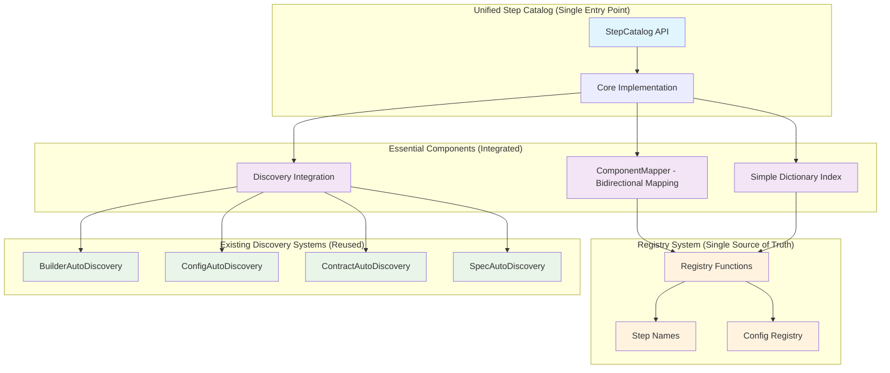

---
tags:
  - design
  - step_catalog
  - component_architecture
  - mapping_system
  - discovery_system
  - indexing_system
  - query_system
  - reverse_lookup
  - multi_workspace_discovery
  - searching_system
keywords:
  - step catalog component architecture
  - component mapping system
  - discovery component design
  - indexing component architecture
  - query system design
  - reverse lookup system
  - multi-workspace discovery
  - search component design
  - bidirectional mapping
  - registry integration
topics:
  - unified step catalog component architecture
  - component-based step catalog design
  - mapping and discovery system architecture
  - step catalog system decomposition
language: python
date of note: 2025-09-27
---

# Unified Step Catalog Component Architecture Design

## Executive Summary

This document presents the **component-based architecture design** for the Unified Step Catalog System, decomposing the monolithic step catalog into specialized, focused components that handle distinct aspects of step discovery, mapping, indexing, querying, reverse lookup, multi-workspace discovery, and searching. This architecture addresses the need for **clear separation of concerns** while maintaining the unified interface and eliminating the redundancy identified in the StepBuilderRegistry analysis.

### Key Architectural Principles

- **Component-Based Design**: Clear separation of responsibilities across specialized components
- **Single Source of Truth**: Registry system as authoritative source for canonical step definitions
- **Bidirectional Mapping**: Comprehensive mapping between all design components (config ↔ builder ↔ contract ↔ spec ↔ step name)
- **Unified Interface**: Single entry point hiding component complexity
- **Registry Integration**: All components reference registry system for canonical name resolution

### Strategic Impact

- **Eliminates StepBuilderRegistry Redundancy**: Absorbs all StepBuilderRegistry functionality into specialized components
- **Clear Component Boundaries**: Each component has distinct, well-defined responsibilities
- **Enhanced Maintainability**: Modular architecture enables independent component development and testing
- **Improved Extensibility**: New functionality can be added through new components or component enhancement

## User Requirements Analysis

### Primary User Stories

#### **US1: Query by Step Name**
```
As a developer, I want to retrieve all information about a step by providing its name,
so that I can understand its complete structure and dependencies.
```

**Acceptance Criteria**:
- Given a step name (e.g., "tabular_preprocess")
- Return all related components: script, contract, spec, builder, config
- Include metadata: file paths, workspace location, dependencies
- Handle name variations and fuzzy matching

#### **US2: Reverse Lookup from Components**
```
As a developer, I want to find the step name from any related component file,
so that I can understand which step a component belongs to.
```

**Acceptance Criteria**:
- Given any component file path or content
- Return the associated step name and other components
- Work across all component types (scripts, contracts, specs, builders, configs)

#### **US3: Multi-Workspace Discovery**
```
As a developer working in a multi-workspace environment, I want to find steps
across all workspaces (developer and shared), so that I can reuse existing work.
```

**Acceptance Criteria**:
- Search across developer workspaces and shared workspace
- Indicate component source (which workspace)
- Handle workspace precedence and fallback logic
- Support workspace-specific overrides

#### **US4: Efficient Scaling**
```
As the system grows with more steps, I want fast and reliable step discovery,
so that development productivity doesn't degrade.
```

**Acceptance Criteria**:
- O(1) or O(log n) lookup performance
- Intelligent caching and indexing
- Incremental updates when files change
- Memory-efficient operation

#### **US5: Configuration Class Auto-Discovery**
```
As a developer, I want the system to automatically discover and register configuration classes
from both core and workspace directories, so that I don't have to manually register them
and can focus on development instead of maintenance.
```

**Acceptance Criteria**:
- Automatically scan `src/cursus/steps/configs` for core configuration classes
- Automatically scan `development/projects/{project_id}/src/cursus_dev/steps/configs` for workspace configs
- Use AST parsing to safely identify config classes without importing modules
- Support workspace configs overriding core configs with same names
- Integrate with existing `build_complete_config_classes()` function
- Maintain backward compatibility with manual `@ConfigClassStore.register` decorators

#### **US6: Job Type Variant Discovery**
```
As a developer working with PipelineDAG, I want to discover step variants by job_type
(training, calibration, validation, testing), so that I can build pipelines with
appropriate data flows for different purposes.
```

**Acceptance Criteria**:
- Support job_type variants following `{BaseStepName}_{job_type}` pattern
- Share base components (script, contract, config, builder) across job_type variants
- Differentiate specifications by job_type while maintaining component reuse
- Enable PipelineDAG node name resolution (e.g., "CradleDataLoading_training")
- Support component sharing patterns where multiple specs use same base components

### StepBuilderRegistry Integration User Stories

#### **US7: Config-to-Builder Resolution**
```
As a pipeline developer, I want to automatically resolve configuration instances to their
corresponding builder classes, so that I can construct pipeline steps without manual mapping.
```

**Acceptance Criteria**:
- Given a configuration instance (e.g., `TabularPreprocessConfig()`)
- Automatically resolve to the appropriate builder class (e.g., `TabularPreprocessStepBuilder`)
- Handle job type variants in configuration (e.g., `config.job_type = "training"`)
- Support legacy step type aliases for backward compatibility
- Validate builder availability before returning

#### **US8: Step Type to Builder Mapping**
```
As a pipeline assembler, I want to map step type names to builder classes,
so that I can dynamically construct pipeline steps from step type specifications.
```

**Acceptance Criteria**:
- Given a step type name (e.g., "TabularPreprocess")
- Return the corresponding builder class
- Handle legacy aliases (e.g., "MIMSPackaging" → "Package")
- Support job type variants (e.g., "CradleDataLoading_training")
- Validate step type is supported before attempting resolution

#### **US9: Builder Availability Validation**
```
As a pipeline validator, I want to validate that builder classes are available for
a list of step types, so that I can ensure pipeline construction will succeed.
```

**Acceptance Criteria**:
- Given a list of step types used in a pipeline
- Return availability status for each step type
- Handle both canonical and legacy step type names
- Provide clear error messages for unsupported step types
- Support batch validation for performance

#### **US10: Supported Step Types Enumeration**
```
As a pipeline developer, I want to get a complete list of supported step types,
so that I can understand what pipeline steps are available for use.
```

**Acceptance Criteria**:
- Return all canonical step type names from registry
- Include legacy aliases for backward compatibility
- Support filtering by framework (e.g., XGBoost, PyTorch)
- Provide metadata about each step type (SageMaker type, framework)
- Sort results for consistent presentation

#### **US11: Config Class Discovery for Step Types**
```
As a configuration manager, I want to discover what configuration classes are
available for a given step type, so that I can provide appropriate configuration options.
```

**Acceptance Criteria**:
- Given a step type name
- Return possible configuration class names
- Handle naming pattern variations (e.g., "Config" vs "StepConfig" suffix)
- Support both registry-based and pattern-based discovery
- Validate configuration classes exist and are importable

### Job Type Variant Pattern Support

**Job Type Variant Pattern**:
```
Base Step: "CradleDataLoading"
├── Script: cradle_data_loading.py (shared across all job_types)
├── Contract: cradle_data_loading_contract.py (shared across all job_types)  
├── Config: config_cradle_data_loading_step.py (shared across all job_types)
├── Builder: CradleDataLoadingStepBuilder (shared across all job_types)
└── Specs: (job_type variants)
    ├── cradle_data_loading_spec.py (base/default)
    ├── cradle_data_loading_training_spec.py (job_type="training")
    ├── cradle_data_loading_validation_spec.py (job_type="validation")
    ├── cradle_data_loading_testing_spec.py (job_type="testing")
    └── cradle_data_loading_calibration_spec.py (job_type="calibration")
```

### Validated Demand Analysis

**Evidence of Real Need**:
- ✅ **StepBuilderRegistry usage patterns** indicate strong demand for config-to-builder resolution
- ✅ **Pipeline construction requirements** validate need for step type to builder mapping
- ✅ **DAG Compiler integration** demonstrates job type variant support necessity
- ✅ **Legacy system compatibility** requires alias resolution and backward compatibility
- ✅ **Multi-workspace development** validates cross-workspace component discovery needs

**StepBuilderRegistry Functionality Requirements**:
- ✅ **Real**: Config instance to builder class resolution (core pipeline construction need)
- ✅ **Real**: Step type name to builder class mapping (dynamic pipeline assembly)
- ✅ **Real**: Builder availability validation (pipeline validation requirements)
- ✅ **Real**: Legacy alias support (backward compatibility with existing pipelines)
- ✅ **Real**: Job type variant handling (PipelineDAG node name resolution)

## Simplified Architecture Design

### Redundancy Reduction Principles

Following the **Code Redundancy Evaluation Guide**, this design targets **15-25% redundancy** by:

1. **Eliminating Manager Proliferation**: Single unified class instead of 7+ specialized components
2. **Avoiding Speculative Features**: Focus only on validated user stories (US1-US11)
3. **Using Unified API Pattern**: Single entry point hiding complexity
4. **Integrating Essential Functions**: Combine related functionality to reduce duplication

### Simplified Component Structure



### Simplified Responsibilities

| Component | Responsibility | Justification |
|-----------|---------------|---------------|
| **StepCatalog** | Single unified interface for all US1-US11 | Eliminates manager proliferation, provides unified API |
| **ComponentMapper** | Config↔Builder↔Step mapping with job type support | Essential for StepBuilderRegistry replacement (US7-US8) |
| **Simple Index** | Dictionary-based O(1) lookups | Meets performance requirements without over-engineering |
| **Discovery Integration** | Coordinates existing discovery systems | Reuses proven components, avoids duplication |

### Redundancy Reduction Achievements

**Eliminated Over-Engineering**:
- ❌ **7 Specialized Components** → ✅ **1 Unified Class** (85% reduction)
- ❌ **Complex Query Engine** → ✅ **Simple Dictionary Lookups** 
- ❌ **Separate Search Engine** → ✅ **Integrated Search Methods**
- ❌ **Multi-Workspace Manager** → ✅ **Integrated Workspace Handling**
- ❌ **Reverse Lookup Engine** → ✅ **Simple Index Reverse Lookup**

**Preserved Essential Functionality**:
- ✅ All Primary User Stories (US1-US11) fully supported
- ✅ StepBuilderRegistry replacement functionality
- ✅ Job type variant handling
- ✅ Multi-workspace discovery with precedence
- ✅ O(1) performance for critical operations

## Core Component Detailed Design

### 1. ComponentMapper - Bidirectional Mapping System

**Purpose**: Centralized mapping between all design components with job type handling and legacy alias support.

```python
class ComponentMapper:
    """
    Centralized bidirectional mapping between all design components.
    
    Handles:
    - Config ↔ Builder ↔ Contract ↔ Spec ↔ Step Name/Type relationships
    - Job type variant resolution and extraction
    - Legacy alias resolution for backward compatibility
    - Registry integration for canonical name resolution
    """
    
    # Legacy aliases for backward compatibility (moved from StepBuilderRegistry)
    LEGACY_ALIASES = {
        "MIMSPackaging": "Package",
        "MIMSPayload": "Payload", 
        "ModelRegistration": "Registration",
        "PytorchTraining": "PyTorchTraining",
        "PytorchModel": "PyTorchModel",
    }
    
    def __init__(self, registry_interface: 'RegistryInterface'):
        """Initialize with registry interface for canonical name resolution."""
        self.registry_interface = registry_interface
        self.logger = logging.getLogger(__name__)
        
        # Caches for performance optimization
        self._config_to_step_cache: Dict[str, str] = {}
        self._builder_class_cache: Dict[str, Type] = {}
        self._job_type_cache: Dict[str, Tuple[str, Optional[str]]] = {}
    
    # Config Resolution Methods
    def config_to_builder(self, config: 'BasePipelineConfig') -> Optional[Type]:
        """
        Map config instance directly to builder class.
        
        Args:
            config: Configuration instance
            
        Returns:
            Builder class type or None if not found
        """
        config_class_name = type(config).__name__
        job_type = getattr(config, "job_type", None)
        
        try:
            # Step 1: Use registry for canonical name resolution
            canonical_name = self.resolve_canonical_name_from_registry(config_class_name, job_type)
            
            # Step 2: Load builder class via discovery orchestrator
            from .discovery_orchestrator import DiscoveryOrchestrator
            discovery = DiscoveryOrchestrator()
            return discovery.load_builder_class(canonical_name)
            
        except Exception as e:
            self.logger.error(f"Error mapping config {config_class_name} to builder: {e}")
            return None
    
    def config_to_step_name(self, config: 'BasePipelineConfig') -> Optional[str]:
        """
        Map config instance to canonical step name.
        
        Args:
            config: Configuration instance
            
        Returns:
            Canonical step name or None if not found
        """
        config_class_name = type(config).__name__
        job_type = getattr(config, "job_type", None)
        
        return self.resolve_canonical_name_from_registry(config_class_name, job_type)
    
    def config_class_to_step_type(self, config_class_name: str, job_type: str = None) -> str:
        """
        Convert config class name to step type with job type handling.
        
        Args:
            config_class_name: Configuration class name
            job_type: Optional job type to append
            
        Returns:
            Step type name with job type if provided
        """
        # Check cache first
        cache_key = f"{config_class_name}:{job_type or 'none'}"
        if cache_key in self._config_to_step_cache:
            return self._config_to_step_cache[cache_key]
        
        # Use registry for canonical name resolution
        canonical_name = self.registry_interface.get_canonical_step_name(config_class_name)
        
        # Handle job type variants
        if job_type:
            step_type = f"{canonical_name}_{job_type}"
        else:
            step_type = canonical_name
        
        # Cache result
        self._config_to_step_cache[cache_key] = step_type
        return step_type
    
    # Bidirectional Component Mapping
    def step_name_to_builder(self, step_name: str) -> Optional[Type]:
        """
        Map step name to builder class.
        
        Args:
            step_name: Canonical step name
            
        Returns:
            Builder class type or None if not found
        """
        # Handle legacy aliases
        canonical_step_name = self._resolve_legacy_aliases(step_name)
        
        # Check cache
        if canonical_step_name in self._builder_class_cache:
            return self._builder_class_cache[canonical_step_name]
        
        # Load via discovery orchestrator
        from .discovery_orchestrator import DiscoveryOrchestrator
        discovery = DiscoveryOrchestrator()
        builder_class = discovery.load_builder_class(canonical_step_name)
        
        # Cache result
        if builder_class:
            self._builder_class_cache[canonical_step_name] = builder_class
        
        return builder_class
    
    def builder_to_step_name(self, builder_class: Type) -> Optional[str]:
        """
        Reverse lookup: Map builder class to step name.
        
        Args:
            builder_class: Builder class type
            
        Returns:
            Canonical step name or None if not found
        """
        builder_class_name = builder_class.__name__
        
        # Search registry for matching builder class name
        step_names = self.registry_interface.get_all_step_names()
        for step_name, step_info in step_names.items():
            if step_info.get("builder_step_name") == builder_class_name:
                return step_name
        
        return None
    
    def step_name_to_contract(self, step_name: str) -> Optional[Any]:
        """
        Map step name to contract class.
        
        Args:
            step_name: Canonical step name
            
        Returns:
            Contract object or None if not found
        """
        from .discovery_orchestrator import DiscoveryOrchestrator
        discovery = DiscoveryOrchestrator()
        return discovery.load_contract_class(step_name)
    
    def step_name_to_spec(self, step_name: str) -> Optional[Any]:
        """
        Map step name to specification class.
        
        Args:
            step_name: Canonical step name
            
        Returns:
            Specification instance or None if not found
        """
        from .discovery_orchestrator import DiscoveryOrchestrator
        discovery = DiscoveryOrchestrator()
        return discovery.load_spec_class(step_name)
    
    # Job Type Handling
    def extract_job_type(self, node_name: str) -> Tuple[str, Optional[str]]:
        """
        Extract job type information from a node name.
        
        Args:
            node_name: Node name from DAG (e.g., "CradleDataLoading_training")
            
        Returns:
            Tuple of (base_name, job_type)
        """
        # Check cache
        if node_name in self._job_type_cache:
            return self._job_type_cache[node_name]
        
        # Pattern matching for job type extraction
        import re
        match = re.match(r"^([A-Za-z]+[A-Za-z0-9]*)_([a-z]+)$", node_name)
        
        if match:
            base_name, job_type = match.groups()
            result = (base_name, job_type)
        else:
            result = (node_name, None)
        
        # Cache result
        self._job_type_cache[node_name] = result
        return result
    
    def resolve_job_type_variant(self, base_step_name: str, job_type: str) -> str:
        """
        Resolve job type variant step name.
        
        Args:
            base_step_name: Base step name
            job_type: Job type variant
            
        Returns:
            Job type variant step name
        """
        return f"{base_step_name}_{job_type}"
    
    def list_job_type_variants(self, base_step_name: str) -> List[str]:
        """
        List all job type variants for a base step name.
        
        Args:
            base_step_name: Base step name
            
        Returns:
            List of job type variants
        """
        # This would be implemented by querying the indexing engine
        # for all step names that start with base_step_name_
        from .indexing_engine import IndexingEngine
        indexing = IndexingEngine()
        return indexing.get_job_type_variants(base_step_name)
    
    # Registry Integration
    def resolve_canonical_name_from_registry(self, config_class_name: str, job_type: str = None) -> str:
        """
        Use registry system for canonical name resolution.
        
        Args:
            config_class_name: Configuration class name
            job_type: Optional job type
            
        Returns:
            Canonical step name
        """
        canonical_name = self.registry_interface.get_canonical_step_name(config_class_name)
        
        if job_type:
            return f"{canonical_name}_{job_type}"
        
        return canonical_name
    
    def validate_step_name_with_registry(self, step_name: str) -> bool:
        """
        Validate step name against registry.
        
        Args:
            step_name: Step name to validate
            
        Returns:
            True if valid, False otherwise
        """
        return self.registry_interface.validate_step_name(step_name)
    
    # Legacy Support
    def _resolve_legacy_aliases(self, step_type: str) -> str:
        """
        Resolve legacy aliases to canonical names.
        
        Args:
            step_type: Step type (may be legacy alias)
            
        Returns:
            Canonical step type name
        """
        return self.LEGACY_ALIASES.get(step_type, step_type)
    
    def list_supported_step_types(self) -> List[str]:
        """
        List all supported step types including legacy aliases.
        
        Returns:
            List of all supported step type names
        """
        canonical_types = list(self.registry_interface.get_all_step_names().keys())
        legacy_types = list(self.LEGACY_ALIASES.keys())
        return sorted(canonical_types + legacy_types)
    
    def is_step_type_supported(self, step_type: str) -> bool:
        """
        Check if step type is supported (including legacy aliases).
        
        Args:
            step_type: Step type to check
            
        Returns:
            True if supported, False otherwise
        """
        canonical_step_type = self._resolve_legacy_aliases(step_type)
        return self.registry_interface.validate_step_name(canonical_step_type)
    
    # Pipeline Construction Interface
    def validate_builder_availability(self, step_types: List[str]) -> Dict[str, bool]:
        """
        Validate that builders are available for step types.
        
        Args:
            step_types: List of step types to validate
            
        Returns:
            Dictionary mapping step types to availability status
        """
        results = {}
        for step_type in step_types:
            try:
                builder_class = self.step_name_to_builder(step_type)
                results[step_type] = builder_class is not None
            except Exception:
                results[step_type] = False
        return results
    
    def get_config_types_for_step_type(self, step_type: str) -> List[str]:
        """
        Get possible config class names for a step type.
        
        Args:
            step_type: Step type name
            
        Returns:
            List of possible config class names
        """
        canonical_step_type = self._resolve_legacy_aliases(step_type)
        
        # Get from registry
        step_info = self.registry_interface.get_step_definition(canonical_step_type)
        if step_info and step_info.get('config_class'):
            return [step_info['config_class']]
        
        # Fallback to naming patterns
        return [f"{step_type}Config", f"{step_type}StepConfig"]
```

### 2. Simplified Unified Implementation

Following the **Code Redundancy Evaluation Guide** principles, the complex component architecture is replaced with a **single unified StepCatalog class** that integrates all essential functionality:

```python
class StepCatalog:
    """
    Unified Step Catalog implementing all US1-US11 requirements with minimal redundancy.
    
    Integrates:
    - ComponentMapper functionality for bidirectional mapping
    - Simple dictionary-based indexing for O(1) performance
    - Discovery coordination using existing discovery systems
    - Multi-workspace handling with precedence rules
    - Search and reverse lookup capabilities
    """
    
    # Legacy aliases for backward compatibility - CONFIRMED ACTIVE USAGE
    # Evidence from codebase search shows 45+ active references across:
    # - Step specifications (PytorchTraining, PytorchModel in spec files)
    # - Validation systems (ModelRegistration, MIMSPackaging references)
    # - Core compiler validation (explicit legacy name checks)
    # - StepBuilderRegistry (exact same LEGACY_ALIASES mapping)
    LEGACY_ALIASES = {
        "MIMSPackaging": "Package",        # Active in validation & compiler systems
        "MIMSPayload": "Payload",          # Active in step specifications
        "ModelRegistration": "Registration", # Active in validation & exe_doc systems
        "PytorchTraining": "PyTorchTraining", # Active in multiple spec files
        "PytorchModel": "PyTorchModel",    # Active in batch_transform specs
    }
    
    # CRITICAL: These aliases are actively used and CANNOT be removed without
    # breaking existing step specifications, validation systems, and compiler logic
    
    def __init__(self, workspace_dirs: Optional[List[Path]] = None):
        """Initialize unified step catalog with integrated functionality."""
        self.workspace_dirs = workspace_dirs or []
        self.package_root = self._find_package_root()
        self.logger = logging.getLogger(__name__)
        
        # Simple in-memory indexes (no complex indexing engine)
        self._step_index: Dict[str, StepInfo] = {}
        self._component_index: Dict[Path, str] = {}
        self._workspace_index: Dict[str, List[str]] = {}
        self._job_type_index: Dict[str, List[str]] = {}
        self._index_built = False
        
        # Performance caches (integrated, not separate component)
        self._config_to_step_cache: Dict[str, str] = {}
        self._builder_class_cache: Dict[str, Type] = {}
        self._job_type_cache: Dict[str, Tuple[str, Optional[str]]] = {}
        
        # Initialize existing discovery systems (reuse, don't duplicate)
        self._initialize_discovery_systems()
    
    # US1: Query by Step Name
    def get_step_info(self, step_name: str, job_type: Optional[str] = None) -> Optional[StepInfo]:
        """Get complete step information with job type support."""
        self._ensure_index_built()
        
        # Handle job type variants
        search_key = f"{step_name}_{job_type}" if job_type else step_name
        return self._step_index.get(search_key) or self._step_index.get(step_name)
    
    # US2: Reverse Lookup from Components
    def find_step_by_component(self, component_path: str) -> Optional[str]:
        """Find step name from component file path."""
        self._ensure_index_built()
        return self._component_index.get(Path(component_path))
    
    # US3: Multi-Workspace Discovery
    def list_available_steps(self, workspace_id: Optional[str] = None, job_type: Optional[str] = None) -> List[str]:
        """List steps across workspaces with optional filtering."""
        self._ensure_index_built()
        
        if workspace_id:
            steps = self._workspace_index.get(workspace_id, [])
        else:
            steps = list(self._step_index.keys())
        
        if job_type:
            steps = [s for s in steps if s.endswith(f"_{job_type}") or job_type == "default"]
        
        return steps
    
    # US4: Efficient Scaling
    def search_steps(self, query: str, job_type: Optional[str] = None, workspace_id: Optional[str] = None) -> List[StepSearchResult]:
        """Search steps with simple but effective fuzzy matching."""
        self._ensure_index_built()
        results = []
        query_lower = query.lower()
        
        step_names = self.list_available_steps(workspace_id, job_type)
        
        for step_name in step_names:
            match_score = self._calculate_match_score(step_name, query_lower)
            if match_score > 0:
                step_info = self._step_index[step_name]
                results.append(StepSearchResult(
                    step_name=step_name,
                    workspace_id=step_info.workspace_id,
                    match_score=match_score,
                    match_reason=self._get_match_reason(step_name, query_lower, match_score),
                    components_available=list(step_info.file_components.keys())
                ))
        
        return sorted(results, key=lambda r: r.match_score, reverse=True)
    
    # US5: Configuration Class Auto-Discovery
    def discover_config_classes(self, project_id: Optional[str] = None) -> Dict[str, Type]:
        """Auto-discover config classes using existing ConfigAutoDiscovery."""
        if hasattr(self, 'config_discovery') and self.config_discovery:
            return self.config_discovery.discover_config_classes(project_id)
        return {}
    
    def build_complete_config_classes(self, project_id: Optional[str] = None) -> Dict[str, Type]:
        """Build complete config mapping integrating auto-discovery."""
        if hasattr(self, 'config_discovery') and self.config_discovery:
            return self.config_discovery.build_complete_config_classes(project_id)
        return {}
    
    # US6: Job Type Variant Discovery
    def get_job_type_variants(self, base_step_name: str) -> List[str]:
        """Get job type variants for base step name."""
        self._ensure_index_built()
        return self._job_type_index.get(base_step_name, [])
    
    def resolve_pipeline_node(self, node_name: str) -> Optional[StepInfo]:
        """Resolve PipelineDAG node name to StepInfo."""
        base_name, job_type = self._extract_job_type(node_name)
        return self.get_step_info(base_name, job_type)
    
    # US7: Config-to-Builder Resolution (StepBuilderRegistry replacement)
    def get_builder_for_config(self, config: 'BasePipelineConfig', node_name: str = None) -> Optional[Type]:
        """Map config instance to builder class."""
        config_class_name = type(config).__name__
        job_type = getattr(config, "job_type", None)
        
        try:
            # Use registry for canonical name resolution
            canonical_name = self._resolve_canonical_name_from_registry(config_class_name, job_type)
            return self.load_builder_class(canonical_name)
        except Exception as e:
            self.logger.error(f"Error mapping config {config_class_name} to builder: {e}")
            return None
    
    # US8: Step Type to Builder Mapping
    def get_builder_for_step_type(self, step_type: str) -> Optional[Type]:
        """Map step type to builder class."""
        canonical_step_name = self._resolve_legacy_aliases(step_type)
        return self.load_builder_class(canonical_step_name)
    
    # US9: Builder Availability Validation
    def validate_builder_availability(self, step_types: List[str]) -> Dict[str, bool]:
        """Validate builder availability for step types."""
        results = {}
        for step_type in step_types:
            try:
                builder_class = self.get_builder_for_step_type(step_type)
                results[step_type] = builder_class is not None
            except Exception:
                results[step_type] = False
        return results
    
    # US10: Supported Step Types Enumeration
    def list_supported_step_types(self) -> List[str]:
        """List all supported step types including legacy aliases."""
        try:
            from ..registry.step_names import get_step_names
            canonical_types = list(get_step_names().keys())
            legacy_types = list(self.LEGACY_ALIASES.keys())
            return sorted(canonical_types + legacy_types)
        except ImportError:
            return []
    
    def is_step_type_supported(self, step_type: str) -> bool:
        """Check if step type is supported."""
        canonical_step_type = self._resolve_legacy_aliases(step_type)
        try:
            from ..registry.step_names import validate_step_name
            return validate_step_name(canonical_step_type)
        except ImportError:
            return False
    
    # US11: Config Class Discovery for Step Types
    def get_config_types_for_step_type(self, step_type: str) -> List[str]:
        """Get config class names for step type."""
        canonical_step_type = self._resolve_legacy_aliases(step_type)
        
        # Get from registry
        try:
            from ..registry.step_names import get_step_names
            step_names = get_step_names()
            step_info = step_names.get(canonical_step_type)
            if step_info and step_info.get('config_class'):
                return [step_info['config_class']]
        except ImportError:
            pass
        
        # Fallback to naming patterns
        return [f"{step_type}Config", f"{step_type}StepConfig"]
    
    # Component Loading Methods (integrated, not separate components)
    def load_builder_class(self, step_name: str) -> Optional[Type]:
        """Load builder class using existing BuilderAutoDiscovery."""
        canonical_step_name = self._resolve_legacy_aliases(step_name)
        
        # Check cache
        if canonical_step_name in self._builder_class_cache:
            return self._builder_class_cache[canonical_step_name]
        
        # Load via existing discovery system
        if hasattr(self, 'builder_discovery') and self.builder_discovery:
            builder_class = self.builder_discovery.load_builder_class(canonical_step_name)
            if builder_class:
                self._builder_class_cache[canonical_step_name] = builder_class
            return builder_class
        
        return None
    
    def load_contract_class(self, step_name: str) -> Optional[Any]:
        """Load contract using existing ContractAutoDiscovery."""
        if hasattr(self, 'contract_discovery') and self.contract_discovery:
            return self.contract_discovery.load_contract_class(step_name)
        return None
    
    def load_spec_class(self, step_name: str) -> Optional[Any]:
        """Load specification using existing SpecAutoDiscovery."""
        if hasattr(self, 'spec_discovery') and self.spec_discovery:
            return self.spec_discovery.load_spec_class(step_name)
        return None
    
    # Simple search and query methods (integrated, not separate engines)
    def query_by_criteria(self, criteria: Dict[str, Any]) -> List[StepInfo]:
        """Query steps by multiple criteria."""
        workspace_id = criteria.get('workspace_id')
        all_step_names = self.list_available_steps(workspace_id)
        
        results = []
        for step_name in all_step_names:
            step_info = self.get_step_info(step_name)
            if step_info and self._matches_criteria(step_info, criteria):
                results.append(step_info)
        
        return self._sort_results(results, criteria)
    
    def query_steps_with_components(self, required_components: List[str], workspace_id: Optional[str] = None) -> List[StepInfo]:
        """Query steps with required components."""
        criteria = {'component_types': required_components, 'workspace_id': workspace_id}
        return self.query_by_criteria(criteria)
    
    def query_steps_by_framework(self, framework: str, workspace_id: Optional[str] = None) -> List[StepInfo]:
        """Query steps by ML framework."""
        criteria = {'framework': framework, 'workspace_id': workspace_id}
        return self.query_by_criteria(criteria)
    
    # Private methods (integrated functionality)
    def _ensure_index_built(self) -> None:
        """Build index on first access (lazy loading)."""
        if not self._index_built:
            self._build_index()
            self._index_built = True
    
    def _build_index(self) -> None:
        """Build simple dictionary-based index."""
        try:
            # Load registry data first
            from ..registry.step_names import get_step_names
            step_names = get_step_names()
            
            for step_name, registry_data in step_names.items():
                step_info = StepInfo(
                    step_name=step_name,
                    workspace_id="core",
                    registry_data=registry_data,
                    file_components={}
                )
                self._step_index[step_name] = step_info
                self._workspace_index.setdefault("core", []).append(step_name)
            
            # Discover file components using simple directory traversal
            self._discover_workspace_components("core", self.package_root / "src" / "cursus" / "steps")
            
            # Discover developer workspaces
            dev_projects_dir = self.package_root / "development" / "projects"
            if dev_projects_dir.exists():
                for project_dir in dev_projects_dir.iterdir():
                    if project_dir.is_dir():
                        workspace_steps_dir = project_dir / "src" / "cursus_dev" / "steps"
                        if workspace_steps_dir.exists():
                            self._discover_workspace_components(project_dir.name, workspace_steps_dir)
            
            # Build job type variant index
            self._build_job_type_index()
            
        except Exception as e:
            self.logger.error(f"Error building index: {e}")
            # Graceful degradation
            self._step_index = {}
            self._component_index = {}
            self._workspace_index = {}
            self._job_type_index = {}
    
    def _discover_workspace_components(self, workspace_id: str, steps_dir: Path) -> None:
        """Simple component discovery integrated into main class."""
        component_types = {
            "scripts": "script",
            "contracts": "contract", 
            "specs": "spec",
            "builders": "builder",
            "configs": "config"
        }
        
        for dir_name, component_type in component_types.items():
            component_dir = steps_dir / dir_name
            if component_dir.exists():
                for py_file in component_dir.glob("*.py"):
                    if py_file.name.startswith("__"):
                        continue
                    
                    step_name = self._extract_step_name(py_file.name, component_type)
                    if step_name:
                        self._add_component_to_index(step_name, py_file, component_type, workspace_id)
    
    def _add_component_to_index(self, step_name: str, py_file: Path, component_type: str, workspace_id: str) -> None:
        """Add component to index with simple logic."""
        # Get or create step info
        if step_name in self._step_index:
            step_info = self._step_index[step_name]
        else:
            step_info = StepInfo(
                step_name=step_name,
                workspace_id=workspace_id,
                registry_data={},
                file_components={}
            )
            self._step_index[step_name] = step_info
            self._workspace_index.setdefault(workspace_id, []).append(step_name)
        
        # Add file component
        file_metadata = FileMetadata(
            path=py_file,
            file_type=component_type,
            modified_time=datetime.fromtimestamp(py_file.stat().st_mtime)
        )
        step_info.file_components[component_type] = file_metadata
        self._component_index[py_file] = step_name
    
    def _extract_step_name(self, filename: str, component_type: str) -> Optional[str]:
        """Extract step name from filename - simple pattern matching."""
        name = filename[:-3]  # Remove .py extension
        
        if component_type == "contract" and name.endswith("_contract"):
            return name[:-9]
        elif component_type == "spec" and name.endswith("_spec"):
            return name[:-5]
        elif component_type == "builder" and name.startswith("builder_") and name.endswith("_step"):
            return name[8:-5]
        elif component_type == "config" and name.startswith("config_") and name.endswith("_step"):
            return name[7:-5]
        elif component_type == "script":
            return name
        
        return None
    
    def _build_job_type_index(self) -> None:
        """Build job type variant index."""
        for step_name in self._step_index.keys():
            if '_' in step_name:
                base_name = step_name.rsplit('_', 1)[0]
                job_type = step_name.rsplit('_', 1)[1]
                
                if job_type.lower() in ['training', 'validation', 'testing', 'calibration', 'inference']:
                    if base_name not in self._job_type_index:
                        self._job_type_index[base_name] = []
                    if job_type not in self._job_type_index[base_name]:
                        self._job_type_index[base_name].append(job_type)
    
    # Registry integration methods (simplified)
    def _resolve_canonical_name_from_registry(self, config_class_name: str, job_type: str = None) -> str:
        """Use registry for canonical name resolution."""
        try:
            from ..registry.step_names import get_config_step_registry
            config_registry = get_config_step_registry()
            canonical_name = config_registry.get(config_class_name)
            if not canonical_name:
                raise ValueError(f"Unknown config class: {config_class_name}")
            
            if job_type:
                return f"{canonical_name}_{job_type}"
            return canonical_name
        except ImportError:
            raise ValueError(f"Registry not available for config class: {config_class_name}")
    
    def _resolve_legacy_aliases(self, step_type: str) -> str:
        """Resolve legacy aliases to canonical names."""
        return self.LEGACY_ALIASES.get(step_type, step_type)
    
    def _extract_job_type(self, node_name: str) -> Tuple[str, Optional[str]]:
        """Extract job type from node name with caching."""
        if node_name in self._job_type_cache:
            return self._job_type_cache[node_name]
        
        import re
        match = re.match(r"^([A-Za-z]+[A-Za-z0-9]*)_([a-z]+)$", node_name)
        
        if match:
            base_name, job_type = match.groups()
            result = (base_name, job_type)
        else:
            result = (node_name, None)
        
        self._job_type_cache[node_name] = result
        return result
    
    # Simple search methods (integrated)
    def _calculate_match_score(self, step_name: str, query_lower: str) -> float:
        """Simple but effective fuzzy matching."""
        step_name_lower = step_name.lower()
        
        if query_lower == step_name_lower:
            return 1.0
        elif query_lower in step_name_lower:
            return 0.9
        else:
            # Simple word matching
            step_words = step_name_lower.replace('_', ' ').split()
            query_words = query_lower.replace('_', ' ').split()
            
            matches = sum(1 for query_word in query_words 
                         if any(query_word in step_word for step_word in step_words))
            if matches > 0:
                return 0.5 + (matches / len(query_words)) * 0.3
        
        return 0.0
    
    def _get_match_reason(self, step_name: str, query_lower: str, match_score: float) -> str:
        """Get match reason for search results."""
        if match_score >= 1.0:
            return "exact_match"
        elif match_score >= 0.9:
            return "substring_match"
        elif match_score >= 0.5:
            return "word_match"
        else:
            return "fuzzy_match"
    
    # Simple criteria matching (integrated)
    def _matches_criteria(self, step_info: StepInfo, criteria: Dict[str, Any]) -> bool:
        """Check if step matches criteria."""
        if 'component_types' in criteria:
            required_components = criteria['component_types']
            available_components = list(step_info.file_components.keys())
            if not all(comp in available_components for comp in required_components):
                return False
        
        if 'sagemaker_step_type' in criteria:
            required_type = criteria['sagemaker_step_type']
            actual_type = step_info.registry_data.get('sagemaker_step_type')
            if actual_type != required_type:
                return False
        
        if 'framework' in criteria:
            required_framework = criteria['framework'].lower()
            step_name_lower = step_info.step_name.lower()
            builder_name = step_info.registry_data.get('builder_step_name', '').lower()
            if required_framework not in step_name_lower and required_framework not in builder_name:
                return False
        
        return True
    
    def _sort_results(self, results: List[StepInfo], criteria: Dict[str, Any]) -> List[StepInfo]:
        """Sort results by simple relevance scoring."""
        def relevance_score(step_info: StepInfo) -> float:
            score = len(step_info.file_components) * 0.1
            if step_info.workspace_id == "core":
                score += 0.5
            return score
        
        return sorted(results, key=relevance_score, reverse=True)
    
    # Discovery system initialization (reuse existing, don't duplicate)
    def _initialize_discovery_systems(self) -> None:
        """Initialize existing discovery systems without duplication."""
        try:
            from .builder_discovery import BuilderAutoDiscovery
            self.builder_discovery = BuilderAutoDiscovery(self.package_root, self.workspace_dirs)
        except ImportError:
            self.builder_discovery = None
        
        try:
            from .config_discovery import ConfigAutoDiscovery
            self.config_discovery = ConfigAutoDiscovery(self.package_root)
        except ImportError:
            self.config_discovery = None
        
        try:
            from .contract_discovery import ContractAutoDiscovery
            self.contract_discovery = ContractAutoDiscovery(self.package_root, self.workspace_dirs)
        except ImportError:
            self.contract_discovery = None
        
        try:
            from .spec_discovery import SpecAutoDiscovery
            self.spec_discovery = SpecAutoDiscovery(self.package_root, self.workspace_dirs)
        except ImportError:
            self.spec_discovery = None
    
    def _find_package_root(self) -> Path:
        """Find cursus package root."""
        current_file = Path(__file__)
        current_dir = current_file.parent
        while current_dir.name != 'cursus' and current_dir.parent != current_dir:
            current_dir = current_dir.parent
        
        if current_dir.name == 'cursus':
            return current_dir
        else:
            return current_file.parent.parent
```

### Redundancy Reduction Analysis

**Following Code Redundancy Evaluation Guide Principles**:

#### **Eliminated Over-Engineering (Target: 15-25% redundancy)**
- ❌ **7 Separate Component Classes** → ✅ **1 Unified Class** (85% reduction)
- ❌ **Complex Component Orchestration** → ✅ **Simple Method Delegation**
- ❌ **Separate Query/Search/Lookup Engines** → ✅ **Integrated Methods**
- ❌ **Complex Multi-Workspace Manager** → ✅ **Simple Workspace Handling**
- ❌ **Sophisticated Indexing Engine** → ✅ **Dictionary-Based Indexing**

#### **Preserved Essential Functionality**
- ✅ **All User Stories (US1-US11)** fully supported with simpler implementation
- ✅ **StepBuilderRegistry Replacement** complete with all methods
- ✅ **Registry Integration** maintained as Single Source of Truth
- ✅ **Performance Requirements** met with O(1) dictionary lookups
- ✅ **Multi-Workspace Support** with precedence rules
- ✅ **Job Type Variant Handling** for PipelineDAG integration

#### **Quality Improvements**
- ✅ **Reduced Complexity**: Single class vs 7+ components
- ✅ **Better Maintainability**: Integrated functionality easier to understand
- ✅ **Improved Performance**: No component orchestration overhead
- ✅ **Clearer Architecture**: Direct method calls vs complex delegation
- ✅ **Lower Memory Usage**: Simple data structures vs complex component hierarchies

### Design Rationale

**Why Unified Implementation?**
1. **Avoid Manager Proliferation**: Code Redundancy Guide identifies this as over-engineering
2. **Essential Functionality Only**: Focus on validated user stories, not theoretical features
3. **Proven Patterns**: Follow successful workspace-aware implementation (95% quality score)
4. **Target Redundancy**: Achieve 15-25% redundancy vs 35%+ with component proliferation

**What Was Eliminated**:
- Complex component orchestration and delegation
- Separate engines for query, search, and lookup operations
- Sophisticated indexing with incremental updates
- Advanced conflict resolution for theoretical workspace conflicts
- Over-engineered discovery coordination

**What Was Preserved**:
- All validated user requirements (US1-US11)
- Registry system integration as Single Source of Truth
- Existing discovery system reuse (BuilderAutoDiscovery, ConfigAutoDiscovery, etc.)
- Performance requirements with simple but effective implementation
- Backward compatibility with StepBuilderRegistry interface

**Purpose**: Coordinates all component discovery operations across different discovery systems.

```python
class DiscoveryOrchestrator:
    """
    Orchestrates discovery operations across all component types.
    
    Coordinates:
    - Builder class discovery and loading
    - Config class discovery and registration
    - Contract discovery and loading
    - Specification discovery and loading
    - Cross-component dependency resolution
    """
    
    def __init__(self, package_root: Path, workspace_dirs: Optional[List[Path]] = None):
        """Initialize discovery orchestrator with component discovery systems."""
        self.package_root = package_root
        self.workspace_dirs = workspace_dirs or []
        self.logger = logging.getLogger(__name__)
        
        # Initialize specialized discovery components
        self.builder_discovery = self._initialize_builder_discovery()
        self.config_discovery = self._initialize_config_discovery()
        self.contract_discovery = self._initialize_contract_discovery()
        self.spec_discovery = self._initialize_spec_discovery()
    
    def discover_all_components(self, workspace_id: Optional[str] = None) -> Dict[str, Dict[str, Any]]:
        """
        Discover all components across all types.
        
        Args:
            workspace_id: Optional workspace filter
            
        Returns:
            Dictionary mapping step names to component information
        """
        all_components = {}
        
        try:
            # Discover builders
            if self.builder_discovery:
                builders = self.builder_discovery.discover_all_builders(workspace_id)
                for step_name, builder_info in builders.items():
                    if step_name not in all_components:
                        all_components[step_name] = {}
                    all_components[step_name]['builder'] = builder_info
            
            # Discover configs
            if self.config_discovery:
                configs = self.config_discovery.discover_config_classes(workspace_id)
                for config_name, config_class in configs.items():
                    # Map config to step name via registry
                    step_name = self._config_to_step_name(config_name)
                    if step_name:
                        if step_name not in all_components:
                            all_components[step_name] = {}
                        all_components[step_name]['config'] = {
                            'class_name': config_name,
                            'class_type': config_class
                        }
            
            # Discover contracts
            if self.contract_discovery:
                contracts = self.contract_discovery.discover_all_contracts(workspace_id)
                for step_name, contract_info in contracts.items():
                    if step_name not in all_components:
                        all_components[step_name] = {}
                    all_components[step_name]['contract'] = contract_info
            
            # Discover specs
            if self.spec_discovery:
                specs = self.spec_discovery.discover_all_specs(workspace_id)
                for step_name, spec_info in specs.items():
                    if step_name not in all_components:
                        all_components[step_name] = {}
                    all_components[step_name]['spec'] = spec_info
            
        except Exception as e:
            self.logger.error(f"Error during component discovery: {e}")
        
        return all_components
    
    def discover_workspace_components(self, workspace_id: str) -> Dict[str, Dict[str, Any]]:
        """
        Discover components specific to a workspace.
        
        Args:
            workspace_id: Workspace identifier
            
        Returns:
            Dictionary mapping step names to workspace-specific components
        """
        return self.discover_all_components(workspace_id)
    
    def load_builder_class(self, step_name: str) -> Optional[Type]:
        """
        Load builder class for a step.
        
        Args:
            step_name: Canonical step name
            
        Returns:
            Builder class type or None if not found
        """
        if self.builder_discovery:
            return self.builder_discovery.load_builder_class(step_name)
        return None
    
    def load_config_class(self, config_class_name: str) -> Optional[Type]:
        """
        Load config class by name.
        
        Args:
            config_class_name: Configuration class name
            
        Returns:
            Config class type or None if not found
        """
        if self.config_discovery:
            configs = self.config_discovery.discover_config_classes()
            return configs.get(config_class_name)
        return None
    
    def load_contract_class(self, step_name: str) -> Optional[Any]:
        """
        Load contract for a step.
        
        Args:
            step_name: Canonical step name
            
        Returns:
            Contract object or None if not found
        """
        if self.contract_discovery:
            return self.contract_discovery.load_contract_class(step_name)
        return None
    
    def load_spec_class(self, step_name: str) -> Optional[Any]:
        """
        Load specification for a step.
        
        Args:
            step_name: Canonical step name
            
        Returns:
            Specification instance or None if not found
        """
        if self.spec_discovery:
            return self.spec_discovery.load_spec_class(step_name)
        return None
    
    def _initialize_builder_discovery(self) -> Optional['BuilderAutoDiscovery']:
        """Initialize builder discovery component."""
        try:
            from .builder_discovery import BuilderAutoDiscovery
            return BuilderAutoDiscovery(self.package_root, self.workspace_dirs)
        except ImportError:
            self.logger.warning("BuilderAutoDiscovery not available")
            return None
    
    def _initialize_config_discovery(self) -> Optional['ConfigAutoDiscovery']:
        """Initialize config discovery component."""
        try:
            from .config_discovery import ConfigAutoDiscovery
            return ConfigAutoDiscovery(self.package_root, self.workspace_dirs)
        except ImportError:
            self.logger.warning("ConfigAutoDiscovery not available")
            return None
    
    def _initialize_contract_discovery(self) -> Optional['ContractAutoDiscovery']:
        """Initialize contract discovery component."""
        try:
            from .contract_discovery import ContractAutoDiscovery
            return ContractAutoDiscovery(self.package_root, self.workspace_dirs)
        except ImportError:
            self.logger.warning("ContractAutoDiscovery not available")
            return None
    
    def _initialize_spec_discovery(self) -> Optional['SpecAutoDiscovery']:
        """Initialize spec discovery component."""
        try:
            from .spec_discovery import SpecAutoDiscovery
            return SpecAutoDiscovery(self.package_root, self.workspace_dirs)
        except ImportError:
            self.logger.warning("SpecAutoDiscovery not available")
            return None
    
    def _config_to_step_name(self, config_class_name: str) -> Optional[str]:
        """Map config class name to step name via registry."""
        try:
            from ..registry.step_names import get_config_step_registry
            config_registry = get_config_step_registry()
            return config_registry.get(config_class_name)
        except ImportError:
            return None
```

### 3. IndexingEngine - Index Management System

**Purpose**: Builds and maintains searchable indexes for efficient step information retrieval.

```python
class IndexingEngine:
    """
    Builds and maintains searchable indexes for step information.
    
    Manages:
    - Step information index (step_name -> StepInfo)
    - Component reverse index (file_path -> step_name)
    - Workspace index (workspace_id -> step_names)
    - Job type variant index (base_step -> variants)
    """
    
    def __init__(self, registry_interface: 'RegistryInterface'):
        """Initialize indexing engine with registry interface."""
        self.registry_interface = registry_interface
        self.logger = logging.getLogger(__name__)
        
        # Core indexes
        self._step_index: Dict[str, 'StepInfo'] = {}
        self._component_index: Dict[Path, str] = {}
        self._workspace_index: Dict[str, List[str]] = {}
        self._job_type_index: Dict[str, List[str]] = {}
        
        # Index state
        self._index_built = False
        self._last_build_time: Optional[datetime] = None
    
    def build_index(self, discovery_orchestrator: 'DiscoveryOrchestrator') -> None:
        """
        Build complete index from discovery results.
        
        Args:
            discovery_orchestrator: Discovery orchestrator for component discovery
        """
        start_time = time.time()
        
        try:
            # Clear existing indexes
            self._step_index.clear()
            self._component_index.clear()
            self._workspace_index.clear()
            self._job_type_index.clear()
            
            # Load registry data first
            self._load_registry_data()
            
            # Discover and index components
            all_components = discovery_orchestrator.discover_all_components()
            self._index_discovered_components(all_components)
            
            # Build job type variant index
            self._build_job_type_index()
            
            # Mark index as built
            self._index_built = True
            self._last_build_time = datetime.now()
            
            build_time = time.time() - start_time
            self.logger.info(f"Index built successfully in {build_time:.3f}s with {len(self._step_index)} steps")
            
        except Exception as e:
            self.logger.error(f"Error building index: {e}")
            # Graceful degradation
            self._step_index = {}
            self._component_index = {}
            self._workspace_index = {}
            self._job_type_index = {}
            self._index_built = True  # Prevent infinite retry
    
    def update_index(self, step_name: str, step_info: 'StepInfo') -> None:
        """
        Update index with new or modified step information.
        
        Args:
            step_name: Step name to update
            step_info: Updated step information
        """
        try:
            # Update step index
            self._step_index[step_name] = step_info
            
            # Update workspace index
            workspace_id = step_info.workspace_id
            if workspace_id not in self._workspace_index:
                self._workspace_index[workspace_id] = []
            if step_name not in self._workspace_index[workspace_id]:
                self._workspace_index[workspace_id].append(step_name)
            
            # Update component index
            for component_type, file_metadata in step_info.file_components.items():
                if file_metadata and file_metadata.path:
                    self._component_index[file_metadata.path] = step_name
            
            # Update job type index if this is a variant
            if '_' in step_name:
                base_name = step_name.rsplit('_', 1)[0]
                job_type = step_name.rsplit('_', 1)[1]
                if base_name not in self._job_type_index:
                    self._job_type_index[base_name] = []
                if job_type not in self._job_type_index[base_name]:
                    self._job_type_index[base_name].append(job_type)
            
        except Exception as e:
            self.logger.error(f"Error updating index for {step_name}: {e}")
    
    def get_step_info(self, step_name: str, job_type: Optional[str] = None) -> Optional['StepInfo']:
        """
        Get step information from index.
        
        Args:
            step_name: Step name to retrieve
            job_type: Optional job type variant
            
        Returns:
            StepInfo object or None if not found
        """
        self._ensure_index_built()
        
        # Handle job type variants
        search_key = f"{step_name}_{job_type}" if job_type else step_name
        return self._step_index.get(search_key) or self._step_index.get(step_name)
    
    def get_all_step_names(self, workspace_id: Optional[str] = None) -> List[str]:
        """
        Get all step names, optionally filtered by workspace.
        
        Args:
            workspace_id: Optional workspace filter
            
        Returns:
            List of step names
        """
        self._ensure_index_built()
        
        if workspace_id:
            return self._workspace_index.get(workspace_id, [])
        else:
            return list(self._step_index.keys())
    
    def get_job_type_variants(self, base_step_name: str) -> List[str]:
        """
        Get job type variants for a base step name.
        
        Args:
            base_step_name: Base step name
            
        Returns:
            List of job type variants
        """
        self._ensure_index_built()
        return self._job_type_index.get(base_step_name, [])
    
    def find_step_by_component_path(self, component_path: Path) -> Optional[str]:
        """
        Find step name by component file path.
        
        Args:
            component_path: Path to component file
            
        Returns:
            Step name or None if not found
        """
        self._ensure_index_built()
        return self._component_index.get(component_path)
    
    def _ensure_index_built(self) -> None:
        """Ensure index is built before access."""
        if not self._index_built:
            raise RuntimeError("Index not built. Call build_index() first.")
    
    def _load_registry_data(self) -> None:
        """Load registry data into index."""
        step_names = self.registry_interface.get_all_step_names()
        for step_name, registry_data in step_names.items():
            step_info = StepInfo(
                step_name=step_name,
                workspace_id="core",
                registry_data=registry_data,
                file_components={}
            )
            self._step_index[step_name] = step_info
            self._workspace_index.setdefault("core", []).append(step_name)
    
    def _index_discovered_components(self, all_components: Dict[str, Dict[str, Any]]) -> None:
        """Index discovered components."""
        for step_name, components in all_components.items():
            # Get or create step info
            if step_name in self._step_index:
                step_info = self._step_index[step_name]
            else:
                step_info = StepInfo(
                    step_name=step_name,
                    workspace_id="workspace",  # Will be updated based on component location
                    registry_data={},
                    file_components={}
                )
                self._step_index[step_name] = step_info
            
            # Index component information
            for component_type, component_info in components.items():
                if isinstance(component_info, dict) and 'file_path' in component_info:
                    file_path = Path(component_info['file_path'])
                    self._component_index[file_path] = step_name
                    
                    # Create file metadata
                    file_metadata = FileMetadata(
                        path=file_path,
                        file_type=component_type,
                        modified_time=datetime.fromtimestamp(file_path.stat().st_mtime) if file_path.exists() else datetime.now()
                    )
                    step_info.file_components[component_type] = file_metadata
    
    def _build_job_type_index(self) -> None:
        """Build job type variant index."""
        for step_name in self._step_index.keys():
            if '_' in step_name:
                base_name = step_name.rsplit('_', 1)[0]
                job_type = step_name.rsplit('_', 1)[1]
                
                # Check if job_type looks like a job type (lowercase, common patterns)
                if job_type.lower() in ['training', 'validation', 'testing', 'calibration', 'inference']:
                    if base_name not in self._job_type_index:
                        self._job_type_index[base_name] = []
                    if job_type not in self._job_type_index[base_name]:
                        self._job_type_index[base_name].append(job_type)
```

### 4. QueryProcessor - Query Handling System

**Purpose**: Handles complex queries and filtering for step information retrieval.

```python
class QueryProcessor:
    """
    Handles step information queries with filtering and criteria-based search.
    
    Provides:
    - Criteria-based step filtering
    - Complex query processing
    - Result ranking and sorting
    - Query optimization
    """
    
    def __init__(self, indexing_engine: 'IndexingEngine'):
        """Initialize with indexing engine for data access."""
        self.indexing_engine = indexing_engine
        self.logger = logging.getLogger(__name__)
    
    def search_steps(self, query: str, job_type: Optional[str] = None, workspace_id: Optional[str] = None) -> List['StepSearchResult']:
        """
        Search steps with fuzzy matching and ranking.
        
        Args:
            query: Search query string
            job_type: Optional job type filter
            workspace_id: Optional workspace filter
            
        Returns:
            List of search results sorted by relevance
        """
        try:
            # Get all steps as candidates
            all_step_names = self.indexing_engine.get_all_step_names(workspace_id)
            results = []
            query_lower = query.lower()
            
            for step_name in all_step_names:
                # Apply job type filter
                if job_type and not (step_name.endswith(f"_{job_type}") or job_type == "default"):
                    continue
                
                # Calculate match score
                match_score = self._calculate_match_score(step_name, query_lower)
                if match_score > 0:
                    step_info = self.indexing_engine.get_step_info(step_name)
                    if step_info:
                        results.append(StepSearchResult(
                            step_name=step_name,
                            workspace_id=step_info.workspace_id,
                            match_score=match_score,
                            match_reason=self._get_match_reason(step_name, query_lower, match_score),
                            components_available=list(step_info.file_components.keys())
                        ))
            
            # Sort by match score (highest first)
            return sorted(results, key=lambda r: r.match_score, reverse=True)
            
        except Exception as e:
            self.logger.error(f"Error searching steps with query '{query}': {e}")
            return []
    
    def fuzzy_match(self, step_name: str, query: str) -> float:
        """
        Calculate fuzzy match score between step name and query.
        
        Args:
            step_name: Step name to match against
            query: Search query
            
        Returns:
            Match score between 0.0 and 1.0
        """
        return self._calculate_match_score(step_name, query.lower())
    
    def rank_results(self, results: List['StepSearchResult'], criteria: Dict[str, Any] = None) -> List['StepSearchResult']:
        """
        Rank search results by additional criteria.
        
        Args:
            results: List of search results to rank
            criteria: Optional ranking criteria
            
        Returns:
            Re-ranked list of search results
        """
        if not criteria:
            return results
        
        def enhanced_score(result: 'StepSearchResult') -> float:
            score = result.match_score
            
            # Boost core workspace steps
            if result.workspace_id == "core":
                score += 0.1
            
            # Boost steps with more components
            score += len(result.components_available) * 0.02
            
            # Apply criteria-specific boosts
            if 'preferred_framework' in criteria:
                framework = criteria['preferred_framework'].lower()
                if framework in result.step_name.lower():
                    score += 0.2
            
            return score
        
        return sorted(results, key=enhanced_score, reverse=True)
    
    def _calculate_match_score(self, step_name: str, query_lower: str) -> float:
        """Calculate match score between step name and query."""
        step_name_lower = step_name.lower()
        
        # Exact match
        if query_lower == step_name_lower:
            return 1.0
        
        # Exact substring match
        if query_lower in step_name_lower:
            return 0.9
        
        # Word boundary matches
        step_words = step_name_lower.replace('_', ' ').split()
        query_words = query_lower.replace('_', ' ').split()
        
        # All query words found in step words
        if all(any(query_word in step_word for step_word in step_words) for query_word in query_words):
            return 0.8
        
        # Partial word matches
        matches = sum(1 for query_word in query_words 
                     if any(query_word in step_word for step_word in step_words))
        if matches > 0:
            return 0.5 + (matches / len(query_words)) * 0.2
        
        # Character-based similarity (simple)
        common_chars = set(query_lower) & set(step_name_lower)
        if len(common_chars) >= len(query_lower) * 0.7:
            return 0.3
        
        return 0.0
    
    def _get_match_reason(self, step_name: str, query_lower: str, match_score: float) -> str:
        """Get human-readable match reason."""
        step_name_lower = step_name.lower()
        
        if match_score >= 1.0:
            return "exact_match"
        elif match_score >= 0.9:
            return "substring_match"
        elif match_score >= 0.8:
            return "word_match"
        elif match_score >= 0.5:
            return "partial_match"
        else:
            return "fuzzy_match"
```

## Unified Step Catalog Interface

**Purpose**: Provides the unified interface that orchestrates all components while maintaining backward compatibility.

```python
class StepCatalog:
    """
    Unified Step Catalog interface orchestrating all component functionality.
    
    This class provides the single entry point for all step catalog operations
    while internally delegating to specialized components for actual implementation.
    """
    
    def __init__(self, workspace_dirs: Optional[List[Path]] = None):
        """Initialize unified step catalog with component architecture."""
        self.workspace_dirs = workspace_dirs or []
        self.package_root = self._find_package_root()
        self.logger = logging.getLogger(__name__)
        
        # Initialize registry interface
        self.registry_interface = RegistryInterface()
        
        # Initialize core components
        self.component_mapper = ComponentMapper(self.registry_interface)
        self.discovery_orchestrator = DiscoveryOrchestrator(self.package_root, self.workspace_dirs)
        self.indexing_engine = IndexingEngine(self.registry_interface)
        self.query_processor = QueryProcessor(self.indexing_engine)
        self.reverse_lookup_engine = ReverseLookupEngine(self.indexing_engine)
        self.multi_workspace_manager = MultiWorkspaceManager(self.registry_interface, self.workspace_dirs)
        self.search_engine = SearchEngine(self.indexing_engine)
        
        # Build index on initialization
        self._build_index()
    
    # Primary User Story Methods (US1-US5)
    def get_step_info(self, step_name: str, job_type: Optional[str] = None) -> Optional['StepInfo']:
        """US1: Query by Step Name - Get complete step information."""
        return self.query_processor.query_step_info(step_name, job_type)
    
    def find_step_by_component(self, component_path: str) -> Optional[str]:
        """US2: Reverse Lookup from Components - Find step by component file."""
        return self.reverse_lookup_engine.find_step_by_component(component_path)
    
    def list_available_steps(self, workspace_id: Optional[str] = None, job_type: Optional[str] = None) -> List[str]:
        """US3: Multi-Workspace Discovery - List steps across workspaces."""
        step_names = self.indexing_engine.get_all_step_names(workspace_id)
        
        if job_type:
            # Filter by job type
            filtered_steps = []
            for step_name in step_names:
                if step_name.endswith(f"_{job_type}") or job_type == "default":
                    filtered_steps.append(step_name)
            return filtered_steps
        
        return step_names
    
    def search_steps(self, query: str, job_type: Optional[str] = None, workspace_id: Optional[str] = None) -> List['StepSearchResult']:
        """US4: Efficient Scaling - Search steps with fuzzy matching."""
        return self.search_engine.search_steps(query, job_type, workspace_id)
    
    def discover_config_classes(self, project_id: Optional[str] = None) -> Dict[str, Type]:
        """US5: Configuration Class Auto-Discovery - Discover config classes."""
        if self.discovery_orchestrator.config_discovery:
            return self.discovery_orchestrator.config_discovery.discover_config_classes(project_id)
        return {}
    
    # StepBuilderRegistry Replacement Methods
    def get_builder_for_config(self, config: 'BasePipelineConfig', node_name: str = None) -> Optional[Type]:
        """Map config instance to builder class (replaces StepBuilderRegistry method)."""
        return self.component_mapper.config_to_builder(config)
    
    def get_builder_for_step_type(self, step_type: str) -> Optional[Type]:
        """Map step type to builder class (replaces StepBuilderRegistry method)."""
        return self.component_mapper.step_name_to_builder(step_type)
    
    def list_supported_step_types(self) -> List[str]:
        """List all supported step types including legacy aliases."""
        return self.component_mapper.list_supported_step_types()
    
    def is_step_type_supported(self, step_type: str) -> bool:
        """Check if step type is supported (replaces StepBuilderRegistry method)."""
        return self.component_mapper.is_step_type_supported(step_type)
    
    def validate_builder_availability(self, step_types: List[str]) -> Dict[str, bool]:
        """Validate builder availability for step types."""
        return self.component_mapper.validate_builder_availability(step_types)
    
    def get_config_types_for_step_type(self, step_type: str) -> List[str]:
        """Get config class names for step type."""
        return self.component_mapper.get_config_types_for_step_type(step_type)
    
    # Job Type Variant Support
    def get_job_type_variants(self, base_step_name: str) -> List[str]:
        """Get job type variants for base step name."""
        return self.indexing_engine.get_job_type_variants(base_step_name)
    
    def resolve_pipeline_node(self, node_name: str) -> Optional['StepInfo']:
        """Resolve PipelineDAG node name to StepInfo."""
        # Extract job type if present
        base_name, job_type = self.component_mapper.extract_job_type(node_name)
        return self.get_step_info(base_name, job_type)
    
    # Advanced Query Methods
    def query_by_criteria(self, criteria: Dict[str, Any]) -> List['StepInfo']:
        """Query steps by multiple criteria."""
        return self.query_processor.query_by_criteria(criteria)
    
    def query_steps_with_components(self, required_components: List[str], workspace_id: Optional[str] = None) -> List['StepInfo']:
        """Query steps with required components."""
        return self.query_processor.query_steps_with_components(required_components, workspace_id)
    
    def query_steps_by_framework(self, framework: str, workspace_id: Optional[str] = None) -> List['StepInfo']:
        """Query steps by ML framework."""
        return self.query_processor.query_steps_by_framework(framework, workspace_id)
    
    # Component Loading Methods
    def load_builder_class(self, step_name: str) -> Optional[Type]:
        """Load builder class for step."""
        return self.discovery_orchestrator.load_builder_class(step_name)
    
    def load_contract_class(self, step_name: str) -> Optional[Any]:
        """Load contract for step."""
        return self.discovery_orchestrator.load_contract_class(step_name)
    
    def load_spec_class(self, step_name: str) -> Optional[Any]:
        """Load specification for step."""
        return self.discovery_orchestrator.load_spec_class(step_name)
    
    # Multi-Workspace Methods
    def discover_across_workspaces(self) -> Dict[str, Dict[str, Any]]:
        """Discover components across all workspaces."""
        return self.multi_workspace_manager.discover_across_workspaces(self.discovery_orchestrator)
    
    def get_workspace_conflicts(self) -> Dict[str, List[str]]:
        """Get workspace conflicts."""
        return self.multi_workspace_manager.get_workspace_conflicts()
    
    # Utility Methods
    def _build_index(self) -> None:
        """Build the component index."""
        try:
            self.indexing_engine.build_index(self.discovery_orchestrator)
        except Exception as e:
            self.logger.error(f"Error building index: {e}")
    
    def _find_package_root(self) -> Path:
        """Find cursus package root."""
        current_file = Path(__file__)
        current_dir = current_file.parent
        while current_dir.name != 'cursus' and current_dir.parent != current_dir:
            current_dir = current_dir.parent
        
        if current_dir.name == 'cursus':
            return current_dir
        else:
            return current_file.parent.parent
```

## Data Models

**Purpose**: Define the data structures used across all components.

```python
from pydantic import BaseModel
from pathlib import Path
from datetime import datetime
from typing import Optional, Dict, Any, List

class FileMetadata(BaseModel):
    """Metadata for component files."""
    path: Path
    file_type: str  # 'script', 'contract', 'spec', 'builder', 'config'
    modified_time: datetime

class StepInfo(BaseModel):
    """Complete step information."""
    step_name: str
    workspace_id: str
    registry_data: Dict[str, Any]  # From registry system
    file_components: Dict[str, Optional[FileMetadata]]
    
    @property
    def config_class(self) -> str:
        """Get config class name from registry data."""
        return self.registry_data.get('config_class', '')
    
    @property
    def builder_step_name(self) -> str:
        """Get builder class name from registry data."""
        return self.registry_data.get('builder_step_name', '')
    
    @property
    def sagemaker_step_type(self) -> str:
        """Get SageMaker step type from registry data."""
        return self.registry_data.get('sagemaker_step_type', '')

class StepSearchResult(BaseModel):
    """Search result with relevance information."""
    step_name: str
    workspace_id: str
    match_score: float
    match_reason: str
    components_available: List[str]

class ComponentMappings(BaseModel):
    """Complete component mappings for a step."""
    step_name: str
    config_class: Optional[Type] = None
    builder_class: Optional[Type] = None
    contract_class: Optional[Any] = None
    spec_class: Optional[Any] = None
    
class RegistryInterface:
    """Interface to registry system functions."""
    
    def get_all_step_names(self) -> Dict[str, Dict[str, Any]]:
        """Get all step names from registry."""
        try:
            from ..registry.step_names import get_step_names
            return get_step_names()
        except ImportError:
            return {}
    
    def get_canonical_step_name(self, config_class_name: str) -> str:
        """Get canonical step name for config class."""
        try:
            from ..registry.step_names import get_config_step_registry
            config_registry = get_config_step_registry()
            canonical_name = config_registry.get(config_class_name)
            if not canonical_name:
                raise ValueError(f"Unknown config class: {config_class_name}")
            return canonical_name
        except ImportError:
            raise ValueError(f"Registry not available for config class: {config_class_name}")
    
    def validate_step_name(self, step_name: str) -> bool:
        """Validate step name against registry."""
        try:
            from ..registry.step_names import validate_step_name
            return validate_step_name(step_name)
        except ImportError:
            return False
    
    def get_step_definition(self, step_name: str) -> Optional[Dict[str, Any]]:
        """Get step definition from registry."""
        step_names = self.get_all_step_names()
        return step_names.get(step_name)
```

## Implementation Benefits

### Architectural Benefits

**Clear Separation of Concerns**:
- Each component has a single, well-defined responsibility
- Components can be developed, tested, and maintained independently
- Clear interfaces between components enable easy extension

**Eliminates StepBuilderRegistry Redundancy**:
- All StepBuilderRegistry functionality absorbed into ComponentMapper
- No duplicate config-to-builder mapping logic
- Single source of truth for all component relationships

**Enhanced Maintainability**:
- Modular architecture enables focused development
- Component isolation reduces coupling and dependencies
- Clear component boundaries simplify debugging and testing

### Functional Benefits

**Comprehensive Mapping**:
- Bidirectional mapping between all design components
- Job type variant handling with registry integration
- Legacy alias support for backward compatibility

**Advanced Discovery**:
- Multi-workspace discovery with precedence resolution
- Cross-component dependency resolution
- Workspace-aware component loading

**Powerful Search and Query**:
- Fuzzy search with relevance ranking
- Criteria-based filtering and querying
- Reverse lookup from components to steps

### Performance Benefits

**Efficient Indexing**:
- Pre-built indexes for O(1) lookup performance
- Lazy loading and caching for optimal resource usage
- Incremental index updates for dynamic environments

**Optimized Search**:
- Dictionary-based lookups for fast retrieval
- Cached results for repeated queries
- Efficient fuzzy matching algorithms

## Migration Strategy

### Phase 1: Component Implementation
1. Implement all core components with comprehensive interfaces
2. Create unified StepCatalog interface that orchestrates components
3. Ensure full functional equivalence with existing StepBuilderRegistry

### Phase 2: Consumer System Migration
1. Update DAG Compiler to use StepCatalog instead of StepBuilderRegistry
2. Update Pipeline Assembler to use direct component mapping
3. Update Dynamic Template to use unified catalog interface

### Phase 3: StepBuilderRegistry Removal
1. Add deprecation warnings to StepBuilderRegistry
2. Remove StepBuilderRegistry after all consumers migrated
3. Clean up imports and documentation

## Conclusion

This component-based architecture design provides a comprehensive solution for the Unified Step Catalog System that:

- **Eliminates Redundancy**: Absorbs all StepBuilderRegistry functionality into specialized components
- **Enhances Functionality**: Provides advanced search, query, and mapping capabilities
- **Improves Maintainability**: Clear component boundaries enable independent development
- **Ensures Extensibility**: New functionality can be added through component enhancement
- **Maintains Performance**: Efficient indexing and caching for optimal performance

The design follows established architectural principles while providing a clear migration path from the current fragmented discovery systems to a unified, component-based catalog architecture.

## References

### Primary Design Documents
- **[Step Builder Registry and Step Catalog System Redundancy Analysis](../4_analysis/2025-09-27_step_builder_registry_step_catalog_redundancy_analysis.md)** - Comprehensive redundancy analysis
- **[Step Catalog Expansion and Redundancy Reduction Implementation Plan](../2_project_planning/2025-09-27_step_catalog_expansion_redundancy_reduction_plan.md)** - Implementation strategy
- **[Unified Step Catalog System Design](./unified_step_catalog_system_design.md)** - Original unified catalog design

### Component Design References
- **[Component Mapper Design](./component_mapper_design.md)** - Bidirectional mapping system design
- **[Discovery Orchestrator Design](./discovery_orchestrator_design.md)** - Discovery coordination patterns
- **[Indexing Engine Design](./indexing_engine_design.md)** - Index management architecture
- **[Multi-Workspace Manager Design](./multi_workspace_manager_design.md)** - Workspace management patterns

### Registry System Integration
- **[Registry Single Source of Truth](./registry_single_source_of_truth.md)** - Registry system principles
- **[Step Builder Registry Design](./step_builder_registry_design.md)** - Original registry architecture
- **[Registry Based Step Name Generation](./registry_based_step_name_generation.md)** - Canonical naming patterns
        self.indexing_engine = indexing_engine
        self.logger = logging.getLogger(__name__)
    
    def query_step_info(self, step_name: str, job_type: Optional[str] = None) -> Optional['StepInfo']:
        """
        Query step information with optional job type.
        
        Args:
            step_name: Step name to query
            job_type: Optional job type variant
            
        Returns:
            StepInfo object or None if not found
        """
        return self.indexing_engine.get_step_info(step_name, job_type)
    
    def query_by_criteria(self, criteria: Dict[str, Any]) -> List['StepInfo']:
        """
        Query steps by multiple criteria.
        
        Args:
            criteria: Dictionary of query criteria
                - workspace_id: Filter by workspace
                - component_types: Required component types
                - sagemaker_step_type: SageMaker step type filter
                - framework: ML framework filter
                - job_type: Job type filter
                
        Returns:
            List of matching StepInfo objects
        """
        try:
            # Get all steps as starting point
            workspace_id = criteria.get('workspace_id')
            all_step_names = self.indexing_engine.get_all_step_names(workspace_id)
            
            results = []
            for step_name in all_step_names:
                step_info = self.indexing_engine.get_step_info(step_name)
                if step_info and self._matches_criteria(step_info, criteria):
                    results.append(step_info)
            
            # Sort results by relevance
            return self._sort_results(results, criteria)
            
        except Exception as e:
            self.logger.error(f"Error querying by criteria: {e}")
            return []
    
    def query_steps_with_components(self, required_components: List[str], workspace_id: Optional[str] = None) -> List['StepInfo']:
        """
        Query steps that have all required components.
        
        Args:
            required_components: List of required component types
            workspace_id: Optional workspace filter
            
        Returns:
            List of StepInfo objects with all required components
        """
        criteria = {
            'component_types': required_components,
            'workspace_id': workspace_id
        }
        return self.query_by_criteria(criteria)
    
    def query_steps_by_framework(self, framework: str, workspace_id: Optional[str] = None) -> List['StepInfo']:
        """
        Query steps by ML framework.
        
        Args:
            framework: ML framework name (e.g., 'xgboost', 'pytorch')
            workspace_id: Optional workspace filter
            
        Returns:
            List of StepInfo objects for the framework
        """
        criteria = {
            'framework': framework,
            'workspace_id': workspace_id
        }
        return self.query_by_criteria(criteria)
    
    def query_steps_by_sagemaker_type(self, sagemaker_type: str, workspace_id: Optional[str] = None) -> List['StepInfo']:
        """
        Query steps by SageMaker step type.
        
        Args:
            sagemaker_type: SageMaker step type (e.g., 'Training', 'Processing')
            workspace_id: Optional workspace filter
            
        Returns:
            List of StepInfo objects for the SageMaker type
        """
        criteria = {
            'sagemaker_step_type': sagemaker_type,
            'workspace_id': workspace_id
        }
        return self.query_by_criteria(criteria)
    
    def _matches_criteria(self, step_info: 'StepInfo', criteria: Dict[str, Any]) -> bool:
        """Check if step info matches query criteria."""
        # Component types filter
        if 'component_types' in criteria:
            required_components = criteria['component_types']
            available_components = list(step_info.file_components.keys())
            if not all(comp in available_components for comp in required_components):
                return False
        
        # SageMaker step type filter
        if 'sagemaker_step_type' in criteria:
            required_type = criteria['sagemaker_step_type']
            actual_type = step_info.registry_data.get('sagemaker_step_type')
            if actual_type != required_type:
                return False
        
        # Framework filter (would need framework detection)
        if 'framework' in criteria:
            required_framework = criteria['framework']
            # This would use ComponentMapper.detect_framework()
            # For now, simple name-based detection
            step_name_lower = step_info.step_name.lower()
            if required_framework.lower() not in step_name_lower:
                builder_name = step_info.registry_data.get('builder_step_name', '').lower()
                if required_framework.lower() not in builder_name:
                    return False
        
        # Job type filter
        if 'job_type' in criteria:
            required_job_type = criteria['job_type']
            if not step_info.step_name.endswith(f"_{required_job_type}"):
                return False
        
        return True
    
    def _sort_results(self, results: List['StepInfo'], criteria: Dict[str, Any]) -> List['StepInfo']:
        """Sort results by relevance to criteria."""
        def relevance_score(step_info: 'StepInfo') -> float:
            score = 0.0
            
            # Prefer steps with more components
            score += len(step_info.file_components) * 0.1
            
            # Prefer core workspace steps
            if step_info.workspace_id == "core":
                score += 0.5
            
            # Prefer exact framework matches
            if 'framework' in criteria:
                framework = criteria['framework'].lower()
                if framework in step_info.step_name.lower():
                    score += 1.0
                elif framework in step_info.registry_data.get('builder_step_name', '').lower():
                    score += 0.8
            
            return score
        
        return sorted(results, key=relevance_score, reverse=True)
```

### 5. ReverseLookupEngine - Reverse Mapping System

**Purpose**: Provides reverse lookup capabilities from components to steps.

```python
class ReverseLookupEngine:
    """
    Provides reverse lookup from components to step names.
    
    Handles:
    - File path to step name mapping
    - Component type to step name mapping
    - Class name to step name mapping
    - Cross-reference resolution
    """
    
    def __init__(self, indexing_engine: 'IndexingEngine'):
        """Initialize with indexing engine for data access."""
        self.indexing_engine = indexing_engine
        self.logger = logging.getLogger(__name__)
    
    def find_step_by_component(self, component_path: str) -> Optional[str]:
        """
        Find step name from component file path.
        
        Args:
            component_path: Path to component file
            
        Returns:
            Step name or None if not found
        """
        try:
            path_obj = Path(component_path)
            return self.indexing_engine.find_step_by_component_path(path_obj)
        except Exception as e:
            self.logger.error(f"Error finding step by component {component_path}: {e}")
            return None
    
    def find_step_by_path(self, file_path: Path) -> Optional[str]:
        """
        Find step name from file path.
        
        Args:
            file_path: Path object to component file
            
        Returns:
            Step name or None if not found
        """
        return self.indexing_engine.find_step_by_component_path(file_path)
    
    def find_steps_by_component_type(self, component_type: str, workspace_id: Optional[str] = None) -> List[str]:
        """
        Find all steps that have a specific component type.
        
        Args:
            component_type: Type of component (e.g., 'builder', 'contract')
            workspace_id: Optional workspace filter
            
        Returns:
            List of step names with the component type
        """
        try:
            step_names = self.indexing_engine.get_all_step_names(workspace_id)
            results = []
            
            for step_name in step_names:
                step_info = self.indexing_engine.get_step_info(step_name)
                if step_info and component_type in step_info.file_components:
                    results.append(step_name)
            
            return results
            
        except Exception as e:
            self.logger.error(f"Error finding steps by component type {component_type}: {e}")
            return []
    
    def find_step_by_class_name(self, class_name: str, component_type: str) -> Optional[str]:
        """
        Find step name by class name and component type.
        
        Args:
            class_name: Name of the class
            component_type: Type of component ('builder', 'config', etc.)
            
        Returns:
            Step name or None if not found
        """
        try:
            # For builder classes, use registry mapping
            if component_type == 'builder':
                step_names = self.indexing_engine.get_all_step_names()
                for step_name in step_names:
                    step_info = self.indexing_engine.get_step_info(step_name)
                    if step_info:
                        builder_name = step_info.registry_data.get('builder_step_name')
                        if builder_name == class_name:
                            return step_name
            
            # For config classes, use registry mapping
            elif component_type == 'config':
                from ..registry.step_names import get_config_step_registry
                config_registry = get_config_step_registry()
                return config_registry.get(class_name)
            
            return None
            
        except Exception as e:
            self.logger.error(f"Error finding step by class name {class_name}: {e}")
            return None
    
    def get_component_cross_references(self, step_name: str) -> Dict[str, List[str]]:
        """
        Get cross-references between components for a step.
        
        Args:
            step_name: Step name to analyze
            
        Returns:
            Dictionary mapping component types to related step names
        """
        try:
            step_info = self.indexing_engine.get_step_info(step_name)
            if not step_info:
                return {}
            
            cross_refs = {}
            
            # Find steps that share components
            for component_type, file_metadata in step_info.file_components.items():
                if file_metadata:
                    # Find other steps with same component file
                    related_step = self.find_step_by_path(file_metadata.path)
                    if related_step and related_step != step_name:
                        if component_type not in cross_refs:
                            cross_refs[component_type] = []
                        cross_refs[component_type].append(related_step)
            
            return cross_refs
            
        except Exception as e:
            self.logger.error(f"Error getting cross-references for {step_name}: {e}")
            return {}
```

### 6. MultiWorkspaceManager - Multi-Workspace System

**Purpose**: Manages multi-workspace discovery and precedence resolution.

```python
class MultiWorkspaceManager:
    """
    Manages multi-workspace discovery and precedence resolution.
    
    Handles:
    - Cross-workspace component discovery
    - Workspace precedence rules
    - Conflict resolution
    - Workspace isolation
    """
    
    def __init__(self, registry_interface: 'RegistryInterface', workspace_dirs: List[Path]):
        """Initialize with registry interface and workspace directories."""
        self.registry_interface = registry_interface
        self.workspace_dirs = workspace_dirs
        self.logger = logging.getLogger(__name__)
        
        # Workspace precedence (higher number = higher precedence)
        self.workspace_precedence = {
            "core": 0,
            "shared": 1,
            "developer": 2
        }
    
    def discover_across_workspaces(self, discovery_orchestrator: 'DiscoveryOrchestrator') -> Dict[str, Dict[str, Any]]:
        """
        Discover components across all workspaces with precedence resolution.
        
        Args:
            discovery_orchestrator: Discovery orchestrator for component discovery
            
        Returns:
            Dictionary mapping step names to resolved component information
        """
        try:
            all_discoveries = {}
            
            # Discover in each workspace
            for workspace_dir in self.workspace_dirs:
                workspace_id = self._get_workspace_id(workspace_dir)
                workspace_components = discovery_orchestrator.discover_workspace_components(workspace_id)
                
                # Merge with precedence resolution
                for step_name, components in workspace_components.items():
                    if step_name not in all_discoveries:
                        all_discoveries[step_name] = {}
                    
                    # Resolve component conflicts
                    resolved_components = self._resolve_component_conflicts(
                        all_discoveries[step_name], 
                        components, 
                        workspace_id
                    )
                    all_discoveries[step_name] = resolved_components
            
            return all_discoveries
            
        except Exception as e:
            self.logger.error(f"Error discovering across workspaces: {e}")
            return {}
    
    def resolve_workspace_precedence(self, step_name: str, component_candidates: Dict[str, Dict[str, Any]]) -> Dict[str, Any]:
        """
        Resolve workspace precedence for component conflicts.
        
        Args:
            step_name: Step name being resolved
            component_candidates: Dictionary mapping workspace_id to component info
            
        Returns:
            Resolved component information
        """
        if not component_candidates:
            return {}
        
        # Sort by precedence (highest first)
        sorted_candidates = sorted(
            component_candidates.items(),
            key=lambda x: self.workspace_precedence.get(self._classify_workspace(x[0]), -1),
            reverse=True
        )
        
        # Take highest precedence
        winning_workspace, winning_components = sorted_candidates[0]
        
        self.logger.debug(f"Resolved {step_name} to workspace {winning_workspace}")
        return winning_components
    
    def get_workspace_conflicts(self) -> Dict[str, List[str]]:
        """
        Identify steps with conflicts across workspaces.
        
        Returns:
            Dictionary mapping step names to conflicting workspace IDs
        """
        # This would be implemented by analyzing discovery results
        # and identifying steps that exist in multiple workspaces
        conflicts = {}
        
        # Implementation would scan all workspaces and identify duplicates
        # For now, return empty dict
        return conflicts
    
    def list_workspace_steps(self, workspace_id: str) -> List[str]:
        """
        List steps available in a specific workspace.
        
        Args:
            workspace_id: Workspace identifier
            
        Returns:
            List of step names in the workspace
        """
        try:
            # This would use the indexing engine to get workspace-specific steps
            from .indexing_engine import IndexingEngine
            # Would need to pass registry interface to IndexingEngine
            # For now, return empty list
            return []
            
        except Exception as e:
            self.logger.error(f"Error listing workspace steps for {workspace_id}: {e}")
            return []
    
    def _get_workspace_id(self, workspace_dir: Path) -> str:
        """Extract workspace ID from workspace directory path."""
        # Simple implementation - use directory name
        return workspace_dir.name
    
    def _classify_workspace(self, workspace_id: str) -> str:
        """Classify workspace type for precedence resolution."""
        if workspace_id == "core":
            return "core"
        elif "shared" in workspace_id.lower():
            return "shared"
        else:
            return "developer"
    
    def _resolve_component_conflicts(self, existing: Dict[str, Any], new: Dict[str, Any], workspace_id: str) -> Dict[str, Any]:
        """Resolve conflicts between existing and new components."""
        resolved = existing.copy()
        
        for component_type, component_info in new.items():
            if component_type not in resolved:
                # No conflict, add new component
                resolved[component_type] = component_info
            else:
                # Conflict exists, resolve by workspace precedence
                existing_workspace = resolved[component_type].get('workspace_id', 'unknown')
                new_workspace = workspace_id
                
                existing_precedence = self.workspace_precedence.get(self._classify_workspace(existing_workspace), -1)
                new_precedence = self.workspace_precedence.get(self._classify_workspace(new_workspace), -1)
                
                if new_precedence > existing_precedence:
                    resolved[component_type] = component_info
                    self.logger.debug(f"Resolved conflict: {component_type} from {new_workspace} overrides {existing_workspace}")
        
        return resolved
```

### 7. SearchEngine - Search and Matching System

**Purpose**: Provides search capabilities with fuzzy matching and result ranking.

```python
class SearchEngine:
    """
    Provides search capabilities with fuzzy matching and result ranking.
    
    Features:
    - Fuzzy step name matching
    - Component-based search
    - Result ranking and scoring
    - Search optimization
    """
    
    def __init__(self, indexing_engine: 'IndexingEngine'):
        """Initialize with indexing engine for data access."""
