---
tags:
  - design
  - implementation
  - xgboost
  - model_inference
  - script_separation
keywords:
  - xgboost inference
  - model loading
  - preprocessing
  - prediction generation
  - format support
  - modular architecture
topics:
  - model inference
  - script modularity
  - data preprocessing
  - prediction output
language: python
date of note: 2025-09-30
---

# XGBoost Model Inference Script Design

## What is the Purpose of XGBoost Model Inference Script?

The XGBoost Model Inference Script serves as a **focused inference engine** that extracts the model loading and prediction generation functionality from the existing `xgboost_model_eval.py` script. It provides a clean separation between inference (prediction generation) and evaluation (metrics computation), enabling modular pipeline architectures where inference results can be cached, reused, and processed by different downstream components.

The core purpose is to:
1. **Load XGBoost models** and preprocessing artifacts efficiently
2. **Apply preprocessing** (risk table mapping, imputation) to evaluation data
3. **Generate predictions** using the loaded model
4. **Output structured predictions** in multiple formats (CSV/Parquet/JSON)
5. **Enable pipeline modularity** by separating inference from metrics computation

## Core Design Principles

The XGBoost Model Inference Script is built on several key design principles:

1. **Single Responsibility** - Focus solely on model inference, not evaluation
2. **Format Flexibility** - Support multiple output formats for different use cases
3. **Preprocessing Consistency** - Apply the same preprocessing used during training
4. **Artifact Preservation** - Maintain all original data columns alongside predictions
5. **Performance Optimization** - Efficient model loading and batch prediction
6. **Error Resilience** - Graceful handling of missing features and data issues

## Architecture Overview

The inference script architecture consists of four main components:

```mermaid
graph TD
    subgraph "🔧 Model Loading Component"
        ModelLoader["Model Artifact Loader<br/>• XGBoost model (.bst)<br/>• Risk table mappings (.pkl)<br/>• Imputation dictionary (.pkl)<br/>• Feature columns (.txt)<br/>• Hyperparameters (.json)"]
    end
    
    subgraph "🔄 Data Preprocessing Component"
        DataPreprocessor["Data Preprocessor<br/>• Risk table mapping<br/>• Numerical imputation<br/>• Feature alignment<br/>• Type conversion"]
    end
    
    subgraph "🎯 Inference Engine Component"
        InferenceEngine["Inference Engine<br/>• XGBoost DMatrix creation<br/>• Batch prediction<br/>• Probability extraction<br/>• Binary/multiclass handling"]
    end
    
    subgraph "💾 Output Management Component"
        OutputManager["Output Manager<br/>• Format detection (CSV/Parquet/JSON)<br/>• Structured data output<br/>• Column preservation<br/>• Path management"]
    end
    
    ModelLoader --> DataPreprocessor
    DataPreprocessor --> InferenceEngine
    InferenceEngine --> OutputManager
    
    subgraph "📊 Input Data"
        InputData["Evaluation Data<br/>• CSV/Parquet files<br/>• Feature columns<br/>• ID and label columns<br/>• Optional metadata"]
    end
    
    subgraph "📈 Output Data"
        OutputData["Prediction Data<br/>• Original columns preserved<br/>• Raw prediction scores<br/>• Class probabilities<br/>• Configurable format"]
    end
    
    InputData --> DataPreprocessor
    OutputManager --> OutputData
```



## Core Components

### 1. Model Artifact Loading Component

The model loading component handles all XGBoost model artifacts:

```python
def load_model_artifacts(
    model_dir: str,
) -> Tuple[xgb.Booster, Dict[str, Any], Dict[str, Any], List[str], Dict[str, Any]]:
    """
    Load the trained XGBoost model and all preprocessing artifacts.
    
    Returns:
        - XGBoost Booster model
        - Risk table mappings dictionary
        - Imputation dictionary
        - Feature column names list
        - Hyperparameters dictionary
    """
    # Load XGBoost model
    model = xgb.Booster()
    model.load_model(os.path.join(model_dir, "xgboost_model.bst"))
    
    # Load preprocessing artifacts
    with open(os.path.join(model_dir, "risk_table_map.pkl"), "rb") as f:
        risk_tables = pkl.load(f)
    
    with open(os.path.join(model_dir, "impute_dict.pkl"), "rb") as f:
        impute_dict = pkl.load(f)
    
    # Load feature columns and hyperparameters
    with open(os.path.join(model_dir, "feature_columns.txt"), "r") as f:
        feature_columns = [line.strip().split(",")[1] for line in f if not line.startswith("#")]
    
    with open(os.path.join(model_dir, "hyperparameters.json"), "r") as f:
        hyperparams = json.load(f)
    
    return model, risk_tables, impute_dict, feature_columns, hyperparams
```

Key features:
- **Comprehensive artifact loading** - All necessary model components
- **Error handling** - Graceful failure for missing artifacts
- **Validation** - Verify artifact integrity and compatibility
- **Logging** - Detailed logging for debugging and monitoring

### 2. Data Preprocessing Component

The preprocessing component applies the same transformations used during training:

```python
def preprocess_inference_data(
    df: pd.DataFrame,
    feature_columns: List[str],
    risk_tables: Dict[str, Any],
    impute_dict: Dict[str, Any],
) -> pd.DataFrame:
    """
    Apply risk table mapping and numerical imputation to inference data.
    Preserves all original columns while ensuring features are model-ready.
    """
    # Preserve original dataframe structure
    result_df = df.copy()
    
    # Get available feature columns
    available_features = [col for col in feature_columns if col in df.columns]
    
    # Apply risk table mapping for categorical features
    for feature, risk_table in risk_tables.items():
        if feature in available_features:
            processor = RiskTableMappingProcessor(
                column_name=feature, 
                label_name="label", 
                risk_tables=risk_table
            )
            result_df[feature] = processor.transform(df[feature])
    
    # Apply numerical imputation
    imputer = NumericalVariableImputationProcessor(imputation_dict=impute_dict)
    feature_df = result_df[available_features].copy()
    imputed_df = imputer.transform(feature_df)
    
    # Update feature columns in result dataframe
    for col in available_features:
        if col in imputed_df:
            result_df[col] = imputed_df[col]
    
    # Ensure feature columns are numeric
    result_df[available_features] = (
        result_df[available_features].apply(pd.to_numeric, errors="coerce").fillna(0)
    )
    
    return result_df
```

Key features:
- **Column preservation** - Maintains all original data columns
- **Feature alignment** - Handles missing features gracefully
- **Consistent preprocessing** - Same transformations as training
- **Type safety** - Ensures numeric features for model input

### 3. Inference Engine Component

The inference engine handles XGBoost-specific prediction generation:

```python
def generate_predictions(
    model: xgb.Booster,
    df: pd.DataFrame,
    feature_columns: List[str],
    hyperparams: Dict[str, Any],
) -> np.ndarray:
    """
    Generate predictions using the XGBoost model.
    Handles both binary and multiclass scenarios.
    """
    # Get available features for prediction
    available_features = [col for col in feature_columns if col in df.columns]
    X = df[available_features].values
    
    # Create XGBoost DMatrix
    dmatrix = xgb.DMatrix(X)
    
    # Generate predictions
    y_prob = model.predict(dmatrix)
    
    # Handle binary vs multiclass output format
    if len(y_prob.shape) == 1:
        # Binary classification - convert to two-column probabilities
        y_prob = np.column_stack([1 - y_prob, y_prob])
    
    return y_prob
```

Key features:
- **XGBoost optimization** - Uses native XGBoost DMatrix for efficiency
- **Format handling** - Consistent output format for binary/multiclass
- **Feature flexibility** - Works with available features only
- **Memory efficiency** - Batch processing for large datasets

### 4. Output Management Component

The output component handles flexible format support including JSON:

```python
def save_predictions(
    df: pd.DataFrame,
    predictions: np.ndarray,
    output_dir: str,
    format: str = "csv",
    id_col: str = "id",
    label_col: str = "label",
    json_orient: str = "records"
) -> str:
    """
    Save predictions with original data in specified format.
    Supports CSV, Parquet, and JSON formats.
    """
    # Create output dataframe with original data
    output_df = df.copy()
    
    # Add prediction columns
    n_classes = predictions.shape[1]
    for i in range(n_classes):
        output_df[f"prob_class_{i}"] = predictions[:, i]
    
    # Save in specified format
    os.makedirs(output_dir, exist_ok=True)
    
    if format.lower() == "parquet":
        output_path = os.path.join(output_dir, "predictions.parquet")
        output_df.to_parquet(output_path, index=False)
    elif format.lower() == "json":
        output_path = os.path.join(output_dir, "predictions.json")
        # Convert numpy types to native Python types for JSON serialization
        output_df_json = output_df.copy()
        for col in output_df_json.columns:
            if output_df_json[col].dtype == 'object':
                continue
            elif 'int' in str(output_df_json[col].dtype):
                output_df_json[col] = output_df_json[col].astype(int)
            elif 'float' in str(output_df_json[col].dtype):
                output_df_json[col] = output_df_json[col].astype(float)
        
        # Save as JSON with specified orientation
        output_df_json.to_json(output_path, orient=json_orient, indent=2)
    else:  # Default to CSV
        output_path = os.path.join(output_dir, "predictions.csv")
        output_df.to_csv(output_path, index=False)
    
    return output_path
```

Key features:
- **Multi-format support** - CSV, Parquet, and JSON formats
- **JSON serialization** - Proper handling of numpy data types for JSON
- **JSON orientation** - Configurable JSON structure (records, index, values, etc.)
- **Data preservation** - All original columns maintained
- **Structured output** - Consistent column naming
- **Path management** - Automatic directory creation

## Environment Variables and Configuration

The script supports the following environment variables:

### Required Environment Variables
- `ID_FIELD` - Column name for record identifiers (default: "id")
- `LABEL_FIELD` - Column name for true labels (default: "label")

### Required Arguments
- `--job_type` - Type of evaluation job to perform (e.g., "evaluation", "validation")

### Optional Environment Variables
- `OUTPUT_FORMAT` - Output format: "csv", "parquet", or "json" (default: "csv")
- `JSON_ORIENT` - JSON orientation: "records", "index", "values", "split", "table" (default: "records")
- `BATCH_SIZE` - Batch size for prediction (default: 10000)
- `MEMORY_LIMIT` - Memory limit for processing (default: "8GB")

### Input/Output Paths
Following SageMaker container conventions (focused on inference only):
- **Model Input**: `/opt/ml/processing/input/model/`
- **Data Input**: `/opt/ml/processing/input/eval_data/`
- **Prediction Output**: `/opt/ml/processing/output/eval/`

## JSON Format Support

### JSON Output Orientations
The script supports multiple JSON orientations to accommodate different downstream requirements:

- **records** (default): `[{column -> value}, ... , {column -> value}]`
- **index**: `{index -> {column -> value}}`
- **values**: `[[row values], [row values], ...]`
- **split**: `{'index': [index], 'columns': [columns], 'data': [values]}`
- **table**: `{'schema': {schema}, 'data': [{row}, {row}, ...]}`

### JSON Data Type Handling
- **Automatic type conversion** - Converts numpy types to JSON-serializable Python types
- **Precision preservation** - Maintains floating-point precision for probability values
- **Memory optimization** - Efficient JSON serialization for large datasets

### JSON Performance Considerations
- **Memory usage** - JSON format may require more memory than binary formats
- **File size** - JSON files are typically larger than Parquet but more human-readable
- **Parsing speed** - JSON parsing may be slower than binary formats but offers universal compatibility

## Integration with Pipeline Architecture

### Upstream Integration
The inference script integrates with:
1. **Model Training Steps** - Consumes model artifacts from training
2. **Data Preparation Steps** - Processes prepared evaluation datasets
3. **Feature Engineering Steps** - Uses engineered features for prediction

### Downstream Integration
The inference script outputs to:
1. **Model Metrics Computation** - Provides predictions for evaluation
2. **Model Calibration** - Supplies raw scores for calibration (supports CSV/Parquet/JSON)
3. **Model Deployment** - Generates predictions for deployment validation

### Output Format Compatibility

#### **For Model Metrics Computation Script**
The inference output provides exactly what the metrics script expects:
- **ID Column**: As specified by `ID_FIELD` environment variable
- **Label Column**: As specified by `LABEL_FIELD` environment variable  
- **Prediction Columns**: `prob_class_0`, `prob_class_1`, etc. for probability scores
- **Original Data**: All original columns preserved for domain-specific metrics

#### **For Model Calibration Script**
The inference output matches the calibration contract requirements:
- **Input Path**: Inference output saved to `/opt/ml/processing/output/eval/` becomes calibration input at `/opt/ml/processing/input/eval_data`
- **Label Field**: `LABEL_FIELD` environment variable specifies the ground truth column
- **Score Fields**: 
  - Binary: `prob_class_1` column for `SCORE_FIELD`
  - Multiclass: `prob_class_*` columns matching `SCORE_FIELD_PREFIX` (default "prob_class_")
- **Format Support**: CSV, Parquet, and JSON formats all supported by calibration script

### Pipeline Flow

```mermaid
graph LR
    subgraph "🏗️ Upstream Steps"
        Training["Model Training<br/>Artifacts"]
        DataPrep["Data Preparation<br/>Evaluation Data"]
    end
    
    subgraph "🎯 Inference Step"
        Inference["XGBoost Model Inference<br/>• Load model artifacts<br/>• Preprocess data<br/>• Generate predictions<br/>• Output: ID + Labels + prob_class_* columns"]
    end
    
    subgraph "📊 Downstream Steps"
        Metrics["Model Metrics Computation<br/>Input: Inference output<br/>• Standard metrics<br/>• Domain-specific metrics"]
        Calibration["Model Calibration<br/>Input: Inference output<br/>• Expects LABEL_FIELD + prob_class_* columns<br/>• Calibrates probabilities"]
        Wiki["Model Wiki Generator<br/>Input: Metrics output<br/>• Documentation generation"]
    end
    
    Training --> Inference
    DataPrep --> Inference
    Inference --> Metrics
    Inference --> Calibration
    Metrics --> Wiki
```


## Performance Considerations

### Memory Management
- **Batch processing** - Process large datasets in configurable batches
- **Memory monitoring** - Track memory usage and optimize accordingly
- **Garbage collection** - Explicit cleanup of large objects
- **Format-specific optimization** - JSON may require additional memory for serialization

### Computational Efficiency
- **XGBoost optimization** - Use native XGBoost data structures
- **Vectorized operations** - Leverage pandas/numpy vectorization
- **Parallel processing** - Support for multi-core prediction when beneficial

### I/O Optimization
- **Format selection** - Parquet for large datasets, CSV for compatibility, JSON for interoperability
- **Compression** - Automatic compression for Parquet outputs
- **Streaming** - Support for streaming large datasets when memory-constrained
- **JSON optimization** - Efficient JSON serialization with proper data type handling

## Error Handling and Validation

### Input Validation
- **Model artifact validation** - Verify all required artifacts are present
- **Data schema validation** - Check for required columns and data types
- **Feature compatibility** - Validate features match training expectations

### Runtime Error Handling
- **Missing feature handling** - Graceful degradation for missing features
- **Data quality issues** - Handle null values, infinite values, data type mismatches
- **Memory constraints** - Automatic batch size adjustment for memory limits
- **JSON serialization errors** - Handle non-serializable data types gracefully

### Output Validation
- **Prediction validation** - Verify prediction shapes and ranges
- **Format validation** - Ensure output format compliance
- **Path validation** - Verify output paths are writable
- **JSON validation** - Verify JSON structure and data type compatibility

## Testing Strategy

### Unit Testing
- **Component isolation** - Test each component independently
- **Mock dependencies** - Mock XGBoost models and preprocessing artifacts
- **Edge case coverage** - Test missing features, empty data, format edge cases
- **JSON format testing** - Test all JSON orientations and data type handling

### Integration Testing
- **End-to-end testing** - Full pipeline from model artifacts to predictions
- **Format compatibility** - Test CSV, Parquet, and JSON output formats
- **Performance testing** - Validate performance with large datasets
- **Cross-format consistency** - Ensure consistent predictions across all formats

### Validation Testing
- **Prediction consistency** - Compare with original `xgboost_model_eval.py` output
- **Preprocessing accuracy** - Verify preprocessing matches training pipeline
- **Format integrity** - Validate output format compliance
- **JSON compatibility** - Test JSON output with downstream consumers

## Migration from Existing Implementation

### Extraction Strategy
The inference script extracts the following functions from `xgboost_model_eval.py`:
- `load_model_artifacts()` - Model and artifact loading
- `preprocess_eval_data()` - Data preprocessing pipeline
- `evaluate_model()` - Prediction generation (inference portion only)
- `save_predictions()` - Prediction output (enhanced with multi-format support)

### Backward Compatibility
- **Interface compatibility** - Maintains same input/output contracts
- **Environment variable compatibility** - Supports existing environment variables
- **Path compatibility** - Uses same SageMaker path conventions
- **Output format compatibility** - Default CSV output matches existing behavior

### Migration Benefits
- **Modularity** - Separate inference from evaluation concerns
- **Reusability** - Inference results can be cached and reused
- **Performance** - Optimized for inference-only workloads
- **Flexibility** - Multiple output formats for different downstream needs
- **Interoperability** - JSON format enables integration with diverse systems

## Future Enhancements

### Near Term (Next 3 months)
- **Streaming support** - Handle datasets larger than memory
- **GPU acceleration** - XGBoost GPU prediction support
- **Advanced batching** - Intelligent batch size optimization
- **Monitoring integration** - CloudWatch metrics and logging
- **JSON schema validation** - Validate JSON output against predefined schemas

### Medium Term (3-6 months)
- **Model versioning** - Support for multiple model versions
- **A/B testing** - Side-by-side model comparison
- **Feature drift detection** - Monitor feature distribution changes
- **Automated scaling** - Dynamic resource allocation based on workload
- **Advanced JSON features** - Custom JSON encoders, compression, streaming JSON

### Long Term (6+ months)
- **Multi-model support** - Ensemble and multi-model predictions
- **Real-time inference** - Streaming prediction capabilities
- **Model explanation** - SHAP value generation for predictions
- **Automated optimization** - Self-tuning performance parameters
- **API integration** - REST/GraphQL API endpoints for predictions

## References

- [Model Metrics Computation Design](model_metrics_computation_design.md) - Downstream metrics computation
- [Model Wiki Generator Design](model_wiki_generator_design.md) - Documentation generation
- [Script Contract](script_contract.md) - Script execution contracts
- [XGBoost Model Eval Contract](../cursus/steps/contracts/xgboost_model_eval_contract.py) - Original contract definition
- [Model Calibration Contract](../cursus/steps/contracts/model_calibration_contract.py) - Downstream calibration requirements
