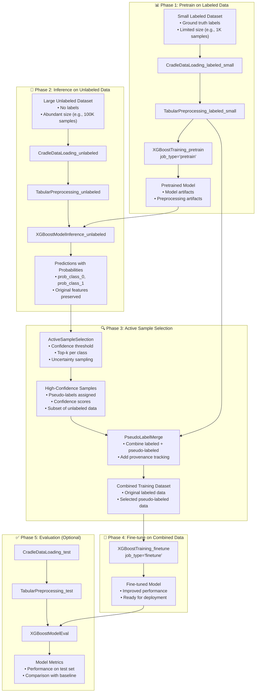

---
tags:
  - design
  - pipeline
  - xgboost
  - semi_supervised_learning
  - active_learning
keywords:
  - semi-supervised learning
  - pseudo-labeling
  - active sampling
  - confidence-based selection
  - pipeline architecture
  - ssl workflow
topics:
  - semi-supervised learning pipelines
  - active sample selection
  - pseudo-label generation
  - pipeline orchestration
language: python
date of note: 2025-11-17
---

# XGBoost Semi-Supervised Learning Pipeline Design

## What is the Purpose of the XGBoost Semi-Supervised Learning Pipeline?

The XGBoost Semi-Supervised Learning (SSL) Pipeline provides a complete end-to-end architecture for training XGBoost models on datasets where labeled data is scarce but unlabeled data is abundant. By leveraging **pseudo-labeling** and **active sample selection**, this pipeline enables models to learn from both labeled and high-confidence pseudo-labeled data, improving performance beyond standard supervised learning.

The core purpose is to:
1. **Maximize label efficiency** - Extract maximum value from limited labeled data
2. **Leverage unlabeled data** - Utilize abundant unlabeled data through pseudo-labeling
3. **Enable active learning** - Select most informative samples for pseudo-labeling
4. **Provide modular architecture** - Separate inference, selection, and training concerns
5. **Support iterative workflows** - Enable multiple rounds of SSL improvement
6. **Reuse existing components** - Build on proven XGBoost pipeline infrastructure

## Core Design Principles

The XGBoost SSL Pipeline is built on several key design principles:

1. **Modularity** - Each phase is a separate, reusable pipeline step
2. **Active Learning** - Intelligent sample selection based on model confidence
3. **Data Provenance** - Track origin of labeled vs pseudo-labeled data
4. **Format Preservation** - Maintain data format consistency throughout pipeline
5. **Artifact Reuse** - Leverage preprocessing artifacts across phases
6. **Incremental Learning** - Build on pretrained models rather than training from scratch

## Architecture Overview

The SSL pipeline consists of four sequential phases that transform small labeled datasets into larger, high-quality training datasets:



## Core Components

### 1. ActiveSampleSelection Step (NEW)

The ActiveSampleSelection step intelligently selects high-quality samples from model predictions for pseudo-labeling.

#### Purpose
Select samples from inference predictions where the model has high confidence, creating a reliable pseudo-labeled dataset that improves rather than degrades model performance.

#### Selection Strategies

##### Confidence Threshold Strategy
Selects samples where the model's maximum probability exceeds a threshold:

```python
def select_by_confidence_threshold(
    predictions_df: pd.DataFrame,
    prob_columns: List[str],
    threshold: float = 0.9,
    max_samples: int = None
) -> pd.DataFrame:
    """
    Select samples with confidence above threshold.
    
    Args:
        predictions_df: DataFrame with prediction probabilities
        prob_columns: List of probability column names (e.g., ['prob_class_0', 'prob_class_1'])
        threshold: Minimum confidence threshold (0.0 to 1.0)
        max_samples: Optional limit on number of samples selected
        
    Returns:
        DataFrame with selected samples including pseudo_label and confidence columns
    """
    # Calculate max probability and predicted class for each sample
    max_probs = predictions_df[prob_columns].max(axis=1)
    pred_labels = predictions_df[prob_columns].idxmax(axis=1)
    
    # Select high-confidence samples
    selected_mask = max_probs >= threshold
    selected_df = predictions_df[selected_mask].copy()
    
    # Add pseudo-label and confidence metadata
    selected_df['pseudo_label'] = pred_labels[selected_mask]
    selected_df['confidence'] = max_probs[selected_mask]
    
    # Limit sample count if specified
    if max_samples and len(selected_df) > max_samples:
        selected_df = selected_df.nlargest(max_samples, 'confidence')
    
    return selected_df
```

**Use cases:**
- Binary classification with clear decision boundaries
- High-confidence predictions on majority class
- Simple selection criteria for initial SSL experiments

**Configuration:**
```python
selection_config = ActiveSampleSelectionConfig(
    selection_strategy="confidence_threshold",
    confidence_threshold=0.9,  # 90% confidence minimum
    max_samples=10000,         # Limit to 10K samples
)
```

##### Top-K Per Class Strategy
Selects top-k most confident samples for each predicted class:

```python
def select_by_top_k_per_class(
    predictions_df: pd.DataFrame,
    prob_columns: List[str],
    k_per_class: int = 100
) -> pd.DataFrame:
    """
    Select top-k most confident samples per predicted class.
    Ensures balanced pseudo-labeling across classes.
    
    Args:
        predictions_df: DataFrame with prediction probabilities
        prob_columns: List of probability column names
        k_per_class: Number of samples to select per class
        
    Returns:
        DataFrame with selected samples (max k * n_classes samples)
    """
    max_probs = predictions_df[prob_columns].max(axis=1)
    pred_labels = predictions_df[prob_columns].idxmax(axis=1)
    
    predictions_df = predictions_df.copy()
    predictions_df['pseudo_label'] = pred_labels
    predictions_df['confidence'] = max_probs
    
    # Select top-k per class
    selected_dfs = []
    for label in pred_labels.unique():
        class_df = predictions_df[predictions_df['pseudo_label'] == label]
        top_k = class_df.nlargest(min(k_per_class, len(class_df)), 'confidence')
        selected_dfs.append(top_k)
    
    return pd.concat(selected_dfs, ignore_index=True)
```

**Use cases:**
- Imbalanced classification tasks
- Ensuring diverse pseudo-labeled samples
- Preventing majority class dominance

**Configuration:**
```python
selection_config = ActiveSampleSelectionConfig(
    selection_strategy="top_k_per_class",
    k_per_class=500,  # 500 samples per class
)
```

#### Script Contract

```python
ACTIVE_SAMPLE_SELECTION_CONTRACT = ProcessingScriptContract(
    entry_point="active_sample_selection.py",
    expected_input_paths={
        "inference_predictions": "/opt/ml/processing/input/predictions",
    },
    expected_output_paths={
        "selected_samples": "/opt/ml/processing/output/selected",
    },
    expected_arguments={"job_type": "ssl_selection"},
    required_env_vars=[],
    optional_env_vars={
        "SELECTION_STRATEGY": "confidence_threshold",
        "CONFIDENCE_THRESHOLD": "0.9",
        "MAX_SAMPLES": "0",  # 0 = no limit
        "K_PER_CLASS": "100",
    },
    description="Active sample selection for semi-supervised learning",
)
```

#### Configuration Class

```python
class ActiveSampleSelectionConfig(ProcessingStepConfigBase):
    """Configuration for active sample selection step."""
    
    # ===== Essential User Inputs (Tier 1) =====
    # None - all have reasonable defaults
    
    # ===== System Fields with Defaults (Tier 2) =====
    
    job_type: str = Field(
        default="ssl_selection",
        description="Job type for active sample selection"
    )
    
    processing_entry_point: str = Field(
        default="active_sample_selection.py",
        description="Script entry point"
    )
    
    selection_strategy: str = Field(
        default="confidence_threshold",
        description="Selection strategy: 'confidence_threshold' or 'top_k_per_class'"
    )
    
    confidence_threshold: float = Field(
        default=0.9,
        ge=0.5,
        le=1.0,
        description="Confidence threshold for sample selection (0.5-1.0)"
    )
    
    max_samples: int = Field(
        default=0,
        ge=0,
        description="Maximum samples to select (0 = no limit)"
    )
    
    k_per_class: int = Field(
        default=100,
        ge=1,
        description="Top-k samples per class (for top_k_per_class strategy)"
    )
    
    # ===== Validators =====
    
    @field_validator("selection_strategy")
    @classmethod
    def validate_strategy(cls, v: str) -> str:
        allowed = {"confidence_threshold", "top_k_per_class"}
        if v not in allowed:
            raise ValueError(f"selection_strategy must be one of {allowed}, got '{v}'")
        return v
```

### 2. PseudoLabelMerge Step (NEW)

The PseudoLabelMerge step combines original labeled data with pseudo-labeled samples, maintaining data provenance and ensuring schema compatibility.

#### Purpose
Create a combined training dataset that includes both ground-truth labeled data and high-confidence pseudo-labeled data, enabling the model to learn from both sources.

#### Core Functionality

```python
def merge_labeled_and_pseudo(
    original_labeled: pd.DataFrame,
    pseudo_labeled: pd.DataFrame,
    add_provenance: bool = True,
    label_column: str = "label"
) -> pd.DataFrame:
    """
    Merge original labeled data with pseudo-labeled samples.
    
    Args:
        original_labeled: Original labeled training data
        pseudo_labeled: Pseudo-labeled samples from active selection
        add_provenance: Add data_source column to track provenance
        label_column: Name of label column
        
    Returns:
        Combined DataFrame with unified schema
    """
    # Add provenance tracking
    if add_provenance:
        original_labeled = original_labeled.copy()
        original_labeled['data_source'] = 'original'
        
        pseudo_labeled = pseudo_labeled.copy()
        pseudo_labeled['data_source'] = 'pseudo_labeled'
    
    # Ensure schema compatibility
    # Original labeled data has 'label' column
    # Pseudo-labeled data has 'pseudo_label' column
    if 'pseudo_label' in pseudo_labeled.columns:
        # Convert pseudo_label to label column
        pseudo_labeled[label_column] = pseudo_labeled['pseudo_label']
        pseudo_labeled = pseudo_labeled.drop(columns=['pseudo_label'])
    
    # Get common columns
    common_columns = set(original_labeled.columns) & set(pseudo_labeled.columns)
    
    # Merge datasets
    combined = pd.concat([
        original_labeled[common_columns],
        pseudo_labeled[common_columns]
    ], ignore_index=True)
    
    return combined
```

#### Script Contract

```python
PSEUDO_LABEL_MERGE_CONTRACT = ProcessingScriptContract(
    entry_point="pseudo_label_merge.py",
    expected_input_paths={
        "original_labeled": "/opt/ml/processing/input/labeled",
        "pseudo_labeled": "/opt/ml/processing/input/pseudo_labeled",
    },
    expected_output_paths={
        "combined_data": "/opt/ml/processing/output/combined",
    },
    expected_arguments={"job_type": "ssl_merge"},
    required_env_vars=["LABEL_FIELD"],
    optional_env_vars={
        "ADD_PROVENANCE": "true",
        "OUTPUT_FORMAT": "csv",
    },
    description="Merge labeled and pseudo-labeled data for SSL training",
)
```

#### Configuration Class

```python
class PseudoLabelMergeConfig(ProcessingStepConfigBase):
    """Configuration for pseudo-label merge step."""
    
    # ===== Essential User Inputs (Tier 1) =====
    
    label_field: str = Field(
        description="Name of the label column in the data"
    )
    
    # ===== System Fields with Defaults (Tier 2) =====
    
    job_type: str = Field(
        default="ssl_merge",
        description="Job type for pseudo-label merge"
    )
    
    processing_entry_point: str = Field(
        default="pseudo_label_merge.py",
        description="Script entry point"
    )
    
    add_provenance: bool = Field(
        default=True,
        description="Add data_source column to track original vs pseudo-labeled data"
    )
    
    output_format: str = Field(
        default="csv",
        description="Output format: 'csv', 'tsv', or 'parquet'"
    )
    
    # ===== Validators =====
    
    @field_validator("output_format")
    @classmethod
    def validate_format(cls, v: str) -> str:
        allowed = {"csv", "tsv", "parquet"}
        if v not in allowed:
            raise ValueError(f"output_format must be one of {allowed}, got '{v}'")
        return v
```

### 3. Reused Existing Steps

The SSL pipeline leverages existing pipeline steps without modification:

#### XGBoostTraining (Extended)
- **Pretrain phase**: job_type="pretrain" on small labeled dataset
- **Fine-tune phase**: job_type="finetune" on combined dataset
- See [XGBoost Semi-Supervised Learning Training Design](xgboost_semi_supervised_learning_training_design.md) for details

#### XGBoostModelInference (Reused)
- Generates predictions on unlabeled data using pretrained model
- Outputs probabilities for all classes
- See [XGBoost Model Inference Design](xgboost_model_inference_design.md) for details

#### CradleDataLoading (Reused)
- Loads labeled, unlabeled, and test datasets
- Multiple instances with different configurations

#### TabularPreprocessing (Reused)
- Preprocesses all data splits consistently
- Applies same transformations to labeled, unlabeled, and test data

## Complete Pipeline DAG

### DAG Structure

```python
def create_xgboost_ssl_dag() -> PipelineDAG:
    """
    Create complete semi-supervised learning pipeline DAG.
    
    Returns:
        PipelineDAG with all SSL phases connected
    """
    dag = PipelineDAG()
    
    # ===== Phase 1: Pretrain on Small Labeled Data =====
    dag.add_node("CradleDataLoading_labeled_small")
    dag.add_node("TabularPreprocessing_labeled_small")
    dag.add_node("XGBoostTraining_pretrain")
    
    # ===== Phase 2: Inference on Unlabeled Data =====
    dag.add_node("CradleDataLoading_unlabeled")
    dag.add_node("TabularPreprocessing_unlabeled")
    dag.add_node("XGBoostModelInference_unlabeled")
    
    # ===== Phase 3: Active Selection and Merge =====
    dag.add_node("ActiveSampleSelection")
    dag.add_node("PseudoLabelMerge")
    
    # ===== Phase 4: Fine-tune on Combined Data =====
    dag.add_node("XGBoostTraining_finetune")
    
    # ===== Phase 5: Evaluation (Optional) =====
    dag.add_node("CradleDataLoading_test")
    dag.add_node("TabularPreprocessing_test")
    dag.add_node("XGBoostModelEval")
    
    # ===== Define Dependencies =====
    
    # Pretrain phase dependencies
    dag.add_edge("CradleDataLoading_labeled_small", "TabularPreprocessing_labeled_small")
    dag.add_edge("TabularPreprocessing_labeled_small", "XGBoostTraining_pretrain")
    
    # Inference phase dependencies
    dag.add_edge("CradleDataLoading_unlabeled", "TabularPreprocessing_unlabeled")
    dag.add_edge("TabularPreprocessing_unlabeled", "XGBoostModelInference_unlabeled")
    dag.add_edge("XGBoostTraining_pretrain", "XGBoostModelInference_unlabeled")  # Model dependency
    
    # Selection phase dependencies
    dag.add_edge("XGBoostModelInference_unlabeled", "ActiveSampleSelection")
    
    # Merge phase dependencies
    dag.add_edge("ActiveSampleSelection", "PseudoLabelMerge")
    dag.add_edge("TabularPreprocessing_labeled_small", "PseudoLabelMerge")  # Original labeled data
    
    # Fine-tune phase dependencies
    dag.add_edge("PseudoLabelMerge", "XGBoostTraining_finetune")
    
    # Evaluation phase dependencies
    dag.add_edge("CradleDataLoading_test", "TabularPreprocessing_test")
    dag.add_edge("TabularPreprocessing_test", "XGBoostModelEval")
    dag.add_edge("XGBoostTraining_finetune", "XGBoostModelEval")  # Use fine-tuned model
    
    return dag
```

### Configuration Assembly

```python
def create_ssl_pipeline_configs() -> Dict[str, BasePipelineConfig]:
    """
    Create configurations for all SSL pipeline steps.
    
    Returns:
        Dictionary mapping step names to their configurations
    """
    configs = {}
    
    # ===== Phase 1: Pretrain Configs =====
    configs["CradleDataLoading_labeled_small"] = CradleDataLoadingConfig(
        step_name="CradleDataLoading_labeled_small",
        job_type="training",
        table_name="labeled_training_data",
        # ... other config
    )
    
    configs["TabularPreprocessing_labeled_small"] = TabularPreprocessingConfig(
        step_name="TabularPreprocessing_labeled_small",
        job_type="training",
        label_name="label",
        # ... other config
    )
    
    configs["XGBoostTraining_pretrain"] = XGBoostTrainingConfig(
        step_name="XGBoostTraining_pretrain",
        job_type="pretrain",
        training_instance_type="ml.m5.4xlarge",
        hyperparameters=XGBoostHyperparameters(
            num_round=100,
            max_depth=6,
            eta=0.1,
            objective="binary:logistic",
        ),
        # ... other config
    )
    
    # ===== Phase 2: Inference Configs =====
    configs["CradleDataLoading_unlabeled"] = CradleDataLoadingConfig(
        step_name="CradleDataLoading_unlabeled",
        job_type="calibration",  # No labels needed
        table_name="unlabeled_pool_data",
        # ... other config
    )
    
    configs["TabularPreprocessing_unlabeled"] = TabularPreprocessingConfig(
        step_name="TabularPreprocessing_unlabeled",
        job_type="calibration",  # No labels needed
        label_name="",  # Empty for unlabeled data
        # ... other config
    )
    
    configs["XGBoostModelInference_unlabeled"] = XGBoostModelInferenceConfig(
        step_name="XGBoostModelInference_unlabeled",
        job_type="calibration",
        # ... other config
    )
    
    # ===== Phase 3: Selection and Merge Configs =====
    configs["ActiveSampleSelection"] = ActiveSampleSelectionConfig(
        step_name="ActiveSampleSelection",
        selection_strategy="confidence_threshold",
        confidence_threshold=0.9,
        max_samples=10000,
        # ... other config
    )
    
    configs["PseudoLabelMerge"] = PseudoLabelMergeConfig(
        step_name="PseudoLabelMerge",
        label_field="label",
        add_provenance=True,
        # ... other config
    )
    
    # ===== Phase 4: Fine-tune Config =====
    configs["XGBoostTraining_finetune"] = XGBoostTrainingConfig(
        step_name="XGBoostTraining_finetune",
        job_type="finetune",
        training_instance_type="ml.m5.4xlarge",
        hyperparameters=XGBoostHyperparameters(
            num_round=50,
            max_depth=6,
            eta=0.05,  # Lower learning rate for fine-tuning
            objective="binary:logistic",
        ),
        # ... other config
    )
    
    # ===== Phase 5: Evaluation Configs =====
    configs["CradleDataLoading_test"] = CradleDataLoadingConfig(
        step_name="CradleDataLoading_test",
        job_type="testing",
        table_name="test_data",
        # ... other config
    )
    
    configs["TabularPreprocessing_test"] = TabularPreprocessingConfig(
        step_name="TabularPreprocessing_test",
        job_type="testing",
        label_name="label",
        # ... other config
    )
    
    configs["XGBoostModelEval"] = XGBoostModelEvalConfig(
        step_name="XGBoostModelEval",
        job_type="calibration",
        # ... other config
    )
    
    return configs
```

## Data Flow and Format Preservation

### Input Data Requirements

#### Labeled Dataset (Small)
- **Size**: Limited (e.g., 1K-10K samples)
- **Format**: CSV, TSV, or Parquet
- **Required columns**: ID, features, label
- **Source**: CradleDataLoading_labeled_small

#### Unlabeled Dataset (Large)
- **Size**: Abundant (e.g., 10K-1M samples)
- **Format**: CSV, TSV, or Parquet
- **Required columns**: ID, features (no label)
- **Source**: CradleDataLoading_unlabeled

### Intermediate Data Formats

#### Preprocessed Data
```
train/
├── train_processed_data.csv
validation/
├── validation_processed_data.csv
test/
├── test_processed_data.csv
```

#### Inference Predictions
```
predictions.csv or predictions.parquet
Columns: id, feature1, feature2, ..., prob_class_0, prob_class_1, ...
```

#### Selected Pseudo-labeled Samples
```
selected_samples.csv or selected_samples.parquet
Columns: id, feature1, feature2, ..., prob_class_0, prob_class_1, pseudo_label, confidence, data_source
```

#### Combined Training Data
```
train/
├── train_processed_data.csv  # Labeled + Pseudo-labeled combined
Columns: id, feature1, feature2, ..., label, data_source
```

### Format Preservation Strategy

The pipeline automatically detects and preserves data formats:

1. **Detection**: Identify format from file extension (.csv, .tsv, .parquet)
2. **Propagation**: Maintain format through processing steps
3. **Conversion**: Convert only when necessary for tool compatibility
4. **Output**: Save in original or specified format

## Integration Patterns

### Upstream Integration

The SSL pipeline integrates with:
1. **Data Sources** - Cradle, S3, feature stores
2. **Feature Engineering** - Pre-computed features or on-the-fly generation
3. **Data Validation** - Quality checks before SSL training

### Downstream Integration

The SSL pipeline outputs to:
1. **Model Registry** - Fine-tuned model for deployment
2. **Model Evaluation** - Performance metrics and comparisons
3. **A/B Testing** - Side-by-side comparison with baseline models
4. **Deployment Pipelines** - Automated model deployment workflows

### Monitoring Integration

The pipeline provides monitoring at each phase:
- **Pretrain metrics**: Training loss, validation performance
- **Inference metrics**: Prediction confidence distribution
- **Selection metrics**: Number of samples selected, class balance
- **Fine-tune metrics**: Training loss, validation performance, comparison with pretrain

## Performance Considerations

### Memory Management
- **Batch processing**: Process large unlabeled datasets in batches
- **Format selection**: Use Parquet for large datasets to reduce memory
- **Streaming**: Support for datasets larger than memory

### Computational Efficiency
- **Parallel inference**: Distribute inference across multiple instances
- **Cached preprocessing**: Reuse preprocessing artifacts across phases
- **Incremental training**: Fine-tuning requires fewer iterations than training from scratch

### Cost Optimization
- **Instance selection**: Use appropriate instance types per phase
- **Spot instances**: Use spot for non-critical phases
- **Data caching**: Cache intermediate results to avoid recomputation

## Testing Strategy

### Unit Testing
- **Selection strategies**: Test confidence threshold and top-k selection
- **Merge logic**: Test schema compatibility and provenance tracking
- **Format handling**: Test CSV, TSV, and Parquet support

### Integration Testing
- **End-to-end workflow**: Test complete pipeline from labeled data to fine-tuned model
- **Data flow**: Verify data passing correctly between phases
- **Artifact compatibility**: Ensure artifacts work across phases

### Validation Testing
- **Performance improvement**: Verify SSL improves over supervised baseline
- **Quality metrics**: Validate pseudo-labels don't degrade model quality
- **Scalability**: Test with various dataset sizes

## Future Enhancements

### Near Term (Next 3 months)
- **Multi-round SSL**: Automatic iteration until convergence
- **Uncertainty sampling**: Additional selection strategies
- **Confidence calibration**: Calibrate prediction confidence before selection
- **Class balancing**: Advanced strategies for imbalanced datasets

### Medium Term (3-6 months)
- **Co-training**: Multiple models with agreement-based selection
- **Curriculum learning**: Progressive difficulty in pseudo-label selection
- **Active learning queries**: Interactive labeling of uncertain samples
- **Ensemble SSL**: Multiple models for robust pseudo-labeling

### Long Term (6+ months)
- **Self-training**: Iterative SSL without manual intervention
- **Meta-learning**: Learn optimal selection strategies
- **Cross-domain SSL**: Transfer learning across related domains
- **Automated hyperparameter tuning**: Optimize SSL hyperparameters

## Implementation Checklist

### New Step: ActiveSampleSelection
- [ ] Create script: `src/cursus/steps/scripts/active_sample_selection.py`
- [ ] Create contract: `src/cursus/steps/contracts/active_sample_selection_contract.py`
- [ ] Create spec: `src/cursus/steps/specs/active_sample_selection_spec.py`
- [ ] Create config: `src/cursus/steps/configs/config_active_sample_selection_step.py`
- [ ] Create builder: `src/cursus/steps/builders/builder_active_sample_selection_step.py`
- [ ] Add to registry: Update `src/cursus/registry/step_names_original.py`
- [ ] Add tests: Unit and integration tests
- [ ] Add documentation: Script and step documentation

### New Step: PseudoLabelMerge
- [ ] Create script: `src/cursus/steps/scripts/pseudo_label_merge.py`
- [ ] Create contract: `src/cursus/steps/contracts/pseudo_label_merge_contract.py`
- [ ] Create spec: `src/cursus/steps/specs/pseudo_label_merge_spec.py`
- [ ] Create config: `src/cursus/steps/configs/config_pseudo_label_merge_step.py`
- [ ] Create builder: `src/cursus/steps/builders/builder_pseudo_label_merge_step.py`
- [ ] Add to registry: Update `src/cursus/registry/step_names_original.py`
- [ ] Add tests: Unit and integration tests
- [ ] Add documentation: Script and step documentation

### Pipeline DAG
- [ ] Create DAG: `src/cursus/pipeline_catalog/shared_dags/xgboost/semi_supervised_learning_dag.py`
- [ ] Create DAG factory: Integration with DAGConfigFactory
- [ ] Add example configs: Complete configuration examples
- [ ] Add integration tests: End-to-end pipeline testing
- [ ] Add documentation: Pipeline usage guide

### Testing
- [ ] Unit tests for selection strategies
- [ ] Unit tests for merge logic
- [ ] Integration tests for full pipeline
- [ ] Performance benchmarks
- [ ] Quality validation tests

## Usage Example

### Basic SSL Pipeline

```python
from cursus.pipeline_catalog.shared_dags.xgboost import create_xgboost_ssl_dag
from cursus.core.dag_config_factory import DAGConfigFactory

# Create SSL pipeline DAG
dag = create_xgboost_ssl_dag()

# Create configurations
configs = create_ssl_pipeline_configs()

# Build SageMaker pipeline
factory = DAGConfigFactory(
    dag=dag,
    configs=
