---
tags:
  - design
  - pipeline
  - xgboost
  - semi_supervised_learning
  - active_learning
keywords:
  - semi-supervised learning
  - pseudo-labeling
  - active sampling
  - confidence-based selection
  - pipeline architecture
  - ssl workflow
topics:
  - semi-supervised learning pipelines
  - active sample selection
  - pseudo-label generation
  - pipeline orchestration
language: python
date of note: 2025-11-17
---

# XGBoost Semi-Supervised Learning Pipeline Design

## What is the Purpose of the XGBoost Semi-Supervised Learning Pipeline?

The XGBoost Semi-Supervised Learning (SSL) Pipeline provides a complete end-to-end architecture for training XGBoost models on datasets where labeled data is scarce but unlabeled data is abundant. By leveraging **pseudo-labeling** and **active sample selection**, this pipeline enables models to learn from both labeled and high-confidence pseudo-labeled data, improving performance beyond standard supervised learning.

The core purpose is to:
1. **Maximize label efficiency** - Extract maximum value from limited labeled data
2. **Leverage unlabeled data** - Utilize abundant unlabeled data through pseudo-labeling
3. **Enable active learning** - Select most informative samples for pseudo-labeling
4. **Provide modular architecture** - Separate inference, selection, and training concerns
5. **Support iterative workflows** - Enable multiple rounds of SSL improvement
6. **Reuse existing components** - Build on proven XGBoost pipeline infrastructure

## Core Design Principles

The XGBoost SSL Pipeline is built on several key design principles:

1. **Modularity** - Each phase is a separate, reusable pipeline step
2. **Active Learning** - Intelligent sample selection based on model confidence
3. **Data Provenance** - Track origin of labeled vs pseudo-labeled data
4. **Format Preservation** - Maintain data format consistency throughout pipeline
5. **Artifact Reuse** - Leverage preprocessing artifacts across phases
6. **Incremental Learning** - Build on pretrained models rather than training from scratch

## Architecture Overview

The SSL pipeline consists of four sequential phases that transform small labeled datasets into larger, high-quality training datasets:

```mermaid
graph TD
    subgraph "📊 Phase 1: Pretrain on Labeled Data"
        LabeledSmall["Small Labeled Dataset<br/>• Ground truth labels<br/>• Limited size (e.g., 1K samples)"]
        LoadLabeled["CradleDataLoading_training"]
        PreprocLabeled["TabularPreprocessing_training"]
        Pretrain["XGBoostTraining_pretrain<br/>job_type='pretrain'"]
        PretrainModel["Pretrained Model<br/>• Model artifacts<br/>• Preprocessing artifacts"]
    end
    
    subgraph "🎯 Phase 2: Inference on Unlabeled Data"
        UnlabeledLarge["Large Unlabeled Dataset<br/>• No labels<br/>• Abundant size (e.g., 100K samples)"]
        LoadUnlabeled["CradleDataLoading_validation"]
        PreprocUnlabeled["TabularPreprocessing_validation"]
        Inference["XGBoostModelInference_validation"]
        Predictions["Predictions with Probabilities<br/>• prob_class_0, prob_class_1<br/>• Original features preserved"]
    end
    
    subgraph "🔍 Phase 3: Active Sample Selection"
        Selection["ActiveSampleSelection<br/>• Confidence threshold<br/>• Top-k per class<br/>• Uncertainty sampling"]
        PseudoLabeled["High-Confidence Samples<br/>• Pseudo-labels assigned<br/>• Confidence scores<br/>• Subset of unlabeled data"]
        Merge["PseudoLabelMerge<br/>• Combine labeled + pseudo-labeled<br/>• Add provenance tracking"]
        Combined["Combined Training Dataset<br/>• Original labeled data<br/>• Selected pseudo-labeled data"]
    end
    
    subgraph "🚀 Phase 4: Fine-tune on Combined Data"
        Finetune["XGBoostTraining_finetune<br/>job_type='finetune'"]
        FinalModel["Fine-tuned Model<br/>• Improved performance<br/>• Ready for deployment"]
    end
    
    subgraph "✅ Phase 5: Evaluation (Optional)"
        LoadTest["CradleDataLoading_calibration"]
        PreprocTest["TabularPreprocessing_calibration"]
        Eval["XGBoostModelEval_calibration"]
        Metrics["Model Metrics<br/>• Performance on test set<br/>• Comparison with baseline"]
    end
    
    LabeledSmall --> LoadLabeled
    LoadLabeled --> PreprocLabeled
    PreprocLabeled --> Pretrain
    Pretrain --> PretrainModel
    
    UnlabeledLarge --> LoadUnlabeled
    LoadUnlabeled --> PreprocUnlabeled
    PreprocUnlabeled --> Inference
    PretrainModel --> Inference
    Inference --> Predictions
    
    Predictions --> Selection
    Selection --> PseudoLabeled
    PseudoLabeled --> Merge
    PreprocLabeled --> Merge
    Merge --> Combined
    
    Combined --> Finetune
    Finetune --> FinalModel
    
    LoadTest --> PreprocTest
    PreprocTest --> Eval
    FinalModel --> Eval
    Eval --> Metrics
```



## ⚠️ CRITICAL: Strategy Selection for SSL vs Active Learning

**The XGBoost SSL Pipeline uses CONFIDENCE-BASED selection strategies ONLY.** Using uncertainty-based strategies will degrade model performance!

### SSL (This Pipeline) vs Active Learning

| Aspect | SSL (Semi-Supervised Learning) | Active Learning |
|--------|-------------------------------|-----------------|
| **Goal** | Automatic pseudo-labeling (no human) | Human labeling of selected samples |
| **Selection** | HIGH confidence samples | HIGH uncertainty samples |
| **Downstream** | Pseudo-labels assigned automatically | Human provides ground truth labels |
| **Strategy** | confidence_threshold, top_k_per_class | uncertainty, diversity, BADGE |

### Strategy Compatibility Table

| Strategy | SSL ✓ | Active Learning ✓ | Why? |
|----------|-------|-------------------|------|
| **confidence_threshold** | ✅ YES | ❌ NO | Selects HIGH confidence → Safe for pseudo-labels |
| **top_k_per_class** | ✅ YES | ❌ NO | Selects HIGH confidence per class → Balanced pseudo-labels |
| **uncertainty** (margin/entropy) | ❌ NO | ✅ YES | Selects UNCERTAIN samples → Noisy pseudo-labels! |
| **diversity** (core-set) | ⚠️ Rarely | ✅ YES | Selects diverse → Usually want confidence for SSL |
| **BADGE** | ❌ NO | ✅ YES | Selects uncertain+diverse → Same issue as uncertainty |

### ⚠️ Common Mistake to Avoid

**WRONG - Using uncertainty for SSL:**
```python
# ❌ BAD: This will select UNCERTAIN samples
# Results in noisy pseudo-labels that hurt model performance!
selection_config = ActiveSampleSelectionConfig(
    selection_strategy="uncertainty",  # ❌ WRONG for SSL!
    uncertainty_mode="margin",
)
```

**Explanation**: Uncertainty strategies select samples where `prob=[0.51, 0.49]` (uncertain) instead of `prob=[0.95, 0.05]` (confident). When these uncertain predictions are used as pseudo-labels, they add noise and degrade the model.

**CORRECT - Using confidence for SSL:**
```python
# ✅ GOOD: This selects HIGH CONFIDENCE samples
# Results in reliable pseudo-labels that improve model performance
selection_config = ActiveSampleSelectionConfig(
    selection_strategy="confidence_threshold",  # ✅ CORRECT for SSL!
    confidence_threshold=0.9,
)
```

### Optional Safety Validation

The ActiveSampleSelection step supports optional `USE_CASE` validation to prevent strategy misuse:

```python
selection_config = ActiveSampleSelectionConfig(
    selection_strategy="confidence_threshold",
    use_case="ssl",  # ← Validates strategy is SSL-appropriate
    confidence_threshold=0.9,
)
```

With `use_case="ssl"`, the step will **reject** uncertainty/diversity/BADGE strategies and only allow confidence-based strategies.

See [Active Sampling Script Design](active_sampling_script_design.md) for complete validation details and all strategy implementations.

---

## Core Components

### 1. ActiveSampleSelection Step (NEW)

The ActiveSampleSelection step intelligently selects high-quality samples from model predictions for pseudo-labeling.

#### Purpose
Select samples from inference predictions where the model has **high confidence**, creating a reliable pseudo-labeled dataset that improves rather than degrades model performance.

**Critical**: This step MUST use confidence-based strategies for SSL. Uncertainty-based strategies will degrade performance by selecting samples with noisy predictions.

#### SSL-Appropriate Selection Strategies

**Only use these strategies for SSL pipelines:**

##### Confidence Threshold Strategy
Selects samples where the model's maximum probability exceeds a threshold:

```python
def select_by_confidence_threshold(
    predictions_df: pd.DataFrame,
    prob_columns: List[str],
    threshold: float = 0.9,
    max_samples: int = None
) -> pd.DataFrame:
    """
    Select samples with confidence above threshold.
    
    Args:
        predictions_df: DataFrame with prediction probabilities
        prob_columns: List of probability column names (e.g., ['prob_class_0', 'prob_class_1'])
        threshold: Minimum confidence threshold (0.0 to 1.0)
        max_samples: Optional limit on number of samples selected
        
    Returns:
        DataFrame with selected samples including pseudo_label and confidence columns
    """
    # Calculate max probability and predicted class for each sample
    max_probs = predictions_df[prob_columns].max(axis=1)
    pred_labels = predictions_df[prob_columns].idxmax(axis=1)
    
    # Select high-confidence samples
    selected_mask = max_probs >= threshold
    selected_df = predictions_df[selected_mask].copy()
    
    # Add pseudo-label and confidence metadata
    selected_df['pseudo_label'] = pred_labels[selected_mask]
    selected_df['confidence'] = max_probs[selected_mask]
    
    # Limit sample count if specified
    if max_samples and len(selected_df) > max_samples:
        selected_df = selected_df.nlargest(max_samples, 'confidence')
    
    return selected_df
```

**Use cases:**
- Binary classification with clear decision boundaries
- High-confidence predictions on majority class
- Simple selection criteria for initial SSL experiments

**Configuration:**
```python
selection_config = ActiveSampleSelectionConfig(
    selection_strategy="confidence_threshold",
    confidence_threshold=0.9,  # 90% confidence minimum
    max_samples=10000,         # Limit to 10K samples
)
```

##### Top-K Per Class Strategy
Selects top-k most confident samples for each predicted class:

```python
def select_by_top_k_per_class(
    predictions_df: pd.DataFrame,
    prob_columns: List[str],
    k_per_class: int = 100
) -> pd.DataFrame:
    """
    Select top-k most confident samples per predicted class.
    Ensures balanced pseudo-labeling across classes.
    
    Args:
        predictions_df: DataFrame with prediction probabilities
        prob_columns: List of probability column names
        k_per_class: Number of samples to select per class
        
    Returns:
        DataFrame with selected samples (max k * n_classes samples)
    """
    max_probs = predictions_df[prob_columns].max(axis=1)
    pred_labels = predictions_df[prob_columns].idxmax(axis=1)
    
    predictions_df = predictions_df.copy()
    predictions_df['pseudo_label'] = pred_labels
    predictions_df['confidence'] = max_probs
    
    # Select top-k per class
    selected_dfs = []
    for label in pred_labels.unique():
        class_df = predictions_df[predictions_df['pseudo_label'] == label]
        top_k = class_df.nlargest(min(k_per_class, len(class_df)), 'confidence')
        selected_dfs.append(top_k)
    
    return pd.concat(selected_dfs, ignore_index=True)
```

**Use cases:**
- Imbalanced classification tasks
- Ensuring diverse pseudo-labeled samples
- Preventing majority class dominance

**Configuration:**
```python
selection_config = ActiveSampleSelectionConfig(
    selection_strategy="top_k_per_class",
    k_per_class=500,  # 500 samples per class
)
```

##### Advanced Selection Strategies

For production SSL pipelines, more sophisticated selection strategies are available that combine uncertainty and diversity:

**Uncertainty Sampling Strategies:**
- **Margin Sampling**: Selects samples where model is uncertain (small difference between top-2 probabilities)
- **Entropy Sampling**: Selects samples with high prediction entropy (uniform distribution)
- **Least Confidence**: Selects samples with low maximum probability

See [Active Sampling Uncertainty Design](active_sampling_uncertainty_margin_entropy.md) for detailed algorithms and implementation.

**Diversity Sampling Strategies:**
- **Core-Set Selection**: K-center algorithm for diverse sample coverage in feature space
- **Leaf Core-Set**: XGBoost-specific diversity using leaf embeddings

See [Active Sampling Core-Set Design](active_sampling_core_set_leaf_core_set.md) for k-center algorithms and implementation.

**Hybrid Sampling (BADGE):**
- **BADGE (Batch Active learning by Diverse Gradient Embeddings)**: Combines uncertainty (gradient magnitude) with diversity (gradient embedding clustering)
- Provides both informativeness and coverage
- Suitable for deep learning and GBDT models

See [Active Sampling BADGE Design](active_sampling_badge.md) for gradient embedding algorithms and pseudo-gradient approximations for XGBoost.

**Complete Implementation:**
See [Active Sampling Script Design](active_sampling_script_design.md) for unified implementation supporting all strategies (uncertainty, diversity, BADGE) with model-agnostic architecture.

**When to Use Each Strategy:**
- **Confidence Threshold**: Simple baseline, fast, good for initial experiments
- **Top-K Per Class**: Balanced selection, prevents majority class dominance
- **Uncertainty Sampling**: Focuses on decision boundary, efficient for active learning
- **Diversity Sampling**: Ensures broad feature space coverage, reduces redundancy
- **BADGE**: Best for complex tasks requiring both uncertainty and diversity

#### Script Contract

```python
ACTIVE_SAMPLE_SELECTION_CONTRACT = ProcessingScriptContract(
    entry_point="active_sample_selection.py",
    expected_input_paths={
        "inference_predictions": "/opt/ml/processing/input/predictions",
    },
    expected_output_paths={
        "selected_samples": "/opt/ml/processing/output/selected",
    },
    expected_arguments={"job_type": "ssl_selection"},
    required_env_vars=[],
    optional_env_vars={
        "SELECTION_STRATEGY": "confidence_threshold",
        "CONFIDENCE_THRESHOLD": "0.9",
        "MAX_SAMPLES": "0",  # 0 = no limit
        "K_PER_CLASS": "100",
    },
    description="Active sample selection for semi-supervised learning",
)
```

#### Configuration Class

```python
class ActiveSampleSelectionConfig(ProcessingStepConfigBase):
    """Configuration for active sample selection step."""
    
    # ===== Essential User Inputs (Tier 1) =====
    # None - all have reasonable defaults
    
    # ===== System Fields with Defaults (Tier 2) =====
    
    job_type: str = Field(
        default="ssl_selection",
        description="Job type for active sample selection"
    )
    
    processing_entry_point: str = Field(
        default="active_sample_selection.py",
        description="Script entry point"
    )
    
    selection_strategy: str = Field(
        default="confidence_threshold",
        description="Selection strategy: 'confidence_threshold' or 'top_k_per_class'"
    )
    
    confidence_threshold: float = Field(
        default=0.9,
        ge=0.5,
        le=1.0,
        description="Confidence threshold for sample selection (0.5-1.0)"
    )
    
    max_samples: int = Field(
        default=0,
        ge=0,
        description="Maximum samples to select (0 = no limit)"
    )
    
    k_per_class: int = Field(
        default=100,
        ge=1,
        description="Top-k samples per class (for top_k_per_class strategy)"
    )
    
    # ===== Validators =====
    
    @field_validator("selection_strategy")
    @classmethod
    def validate_strategy(cls, v: str) -> str:
        allowed = {"confidence_threshold", "top_k_per_class"}
        if v not in allowed:
            raise ValueError(f"selection_strategy must be one of {allowed}, got '{v}'")
        return v
```

### 2. PseudoLabelMerge Step (NEW)

The PseudoLabelMerge step combines original labeled data with pseudo-labeled samples, maintaining data provenance and ensuring schema compatibility.

**Complete design documentation**: See [Pseudo Label Merge Script Design](pseudo_label_merge_script_design.md) for comprehensive implementation details including:
- Split-aware merge for training jobs (maintains train/test/val boundaries)
- Auto-inferred split ratios (adapts to base data proportions)
- Simple merge for validation/testing jobs
- Data format preservation (CSV/TSV/Parquet)
- Schema alignment and provenance tracking

#### Purpose
Create a combined training dataset that includes both ground-truth labeled data and high-confidence pseudo-labeled data, enabling the model to learn from both sources.

#### Core Functionality

```python
def merge_labeled_and_pseudo(
    original_labeled: pd.DataFrame,
    pseudo_labeled: pd.DataFrame,
    add_provenance: bool = True,
    label_column: str = "label"
) -> pd.DataFrame:
    """
    Merge original labeled data with pseudo-labeled samples.
    
    Args:
        original_labeled: Original labeled training data
        pseudo_labeled: Pseudo-labeled samples from active selection
        add_provenance: Add data_source column to track provenance
        label_column: Name of label column
        
    Returns:
        Combined DataFrame with unified schema
    """
    # Add provenance tracking
    if add_provenance:
        original_labeled = original_labeled.copy()
        original_labeled['data_source'] = 'original'
        
        pseudo_labeled = pseudo_labeled.copy()
        pseudo_labeled['data_source'] = 'pseudo_labeled'
    
    # Ensure schema compatibility
    # Original labeled data has 'label' column
    # Pseudo-labeled data has 'pseudo_label' column
    if 'pseudo_label' in pseudo_labeled.columns:
        # Convert pseudo_label to label column
        pseudo_labeled[label_column] = pseudo_labeled['pseudo_label']
        pseudo_labeled = pseudo_labeled.drop(columns=['pseudo_label'])
    
    # Get common columns
    common_columns = set(original_labeled.columns) & set(pseudo_labeled.columns)
    
    # Merge datasets
    combined = pd.concat([
        original_labeled[common_columns],
        pseudo_labeled[common_columns]
    ], ignore_index=True)
    
    return combined
```

#### Script Contract

```python
PSEUDO_LABEL_MERGE_CONTRACT = ProcessingScriptContract(
    entry_point="pseudo_label_merge.py",
    expected_input_paths={
        "original_labeled": "/opt/ml/processing/input/labeled",
        "pseudo_labeled": "/opt/ml/processing/input/pseudo_labeled",
    },
    expected_output_paths={
        "combined_data": "/opt/ml/processing/output/combined",
    },
    expected_arguments={"job_type": "ssl_merge"},
    required_env_vars=["LABEL_FIELD"],
    optional_env_vars={
        "ADD_PROVENANCE": "true",
        "OUTPUT_FORMAT": "csv",
    },
    description="Merge labeled and pseudo-labeled data for SSL training",
)
```

#### Step Specification

The PseudoLabelMerge spec uses **semantic differentiation** to handle symmetric inputs while enabling flexible dependency resolution across multiple pipeline patterns.

```python
from cursus.core.base import StepSpecification, DependencySpec, OutputSpec, DependencyType

PSEUDO_LABEL_MERGE_SPEC = StepSpecification(
    step_type="PseudoLabelMerge",
    
    dependencies={
        # Dependency 1: Augmentation data (pseudo-labeled, selected, or inference)
        "augmentation_data": DependencySpec(
            logical_name="augmentation_data",
            dependency_type=DependencyType.PROCESSING_OUTPUT,
            data_type="S3Uri",
            required=True,
            compatible_sources=[
                # Primary SSL sources
                "ActiveSampleSelection",      # SSL: Selected high-confidence samples
                "LabelRulesetExecution",      # Pattern A: Rule-generated labels
                "XGBoostModelInference",      # Pattern C: Direct inference output
                
                # Alternative model inference sources
                "LightGBMModelInference",     # LightGBM predictions
                "PyTorchModelInference",      # PyTorch predictions
                "BedrockBatchProcessing",     # LLM/Bedrock predictions
                
                # Fallback: preprocessing sources (if used symmetrically)
                "TabularPreprocessing",       # Preprocessed data
                "FeatureSelection",           # After feature selection
            ],
            semantic_keywords=[
                "augmentation", "pseudo", "selected", "inference",
                "predictions", "generated", "synthetic", "labeled"
            ],
            description="Data to augment training set (pseudo-labels, selected samples, predictions)"
        ),
        
        # Dependency 2: Base training data (original labeled data)
        "base_training_data": DependencySpec(
            logical_name="base_training_data",
            dependency_type=DependencyType.TRAINING_DATA,  # Compatible with PROCESSING_OUTPUT
            data_type="S3Uri",
            required=True,
            compatible_sources=[
                # Primary labeled data sources
                "TabularPreprocessing",       # Most common: preprocessed labeled data
                "CradleDataLoading",          # Direct data loading
                
                # After preprocessing steps
                "FeatureSelection",           # After feature selection
                "MissingValueImputation",     # After missing value imputation
                "TemporalFeatureEngineering", # After temporal feature engineering
                "TemporalSequenceNormalization", # After sequence normalization
                "StratifiedSampling",         # Sampled labeled data
                
                # Fallback: Can also accept inference sources (if used symmetrically)
                "ActiveSampleSelection",      # If roles are swapped
                "LabelRulesetExecution",      # If used as base data
            ],
            semantic_keywords=[
                "base", "original", "training", "preprocessed",
                "labeled", "ground_truth", "primary", "source"
            ],
            description="Base training dataset to augment with additional samples"
        ),
    },
    
    outputs={
        "merged_training_data": OutputSpec(
            logical_name="merged_training_data",
            aliases=[
                "combined_data",
                "augmented_training_data",
                "ssl_training_data",
                "merged_data",
                "input_path",
                "input_data",
                "processed_data",
            ],
            output_type=DependencyType.TRAINING_DATA,
            data_type="S3Uri",
            description="Combined training dataset (original + pseudo-labeled)"
        )
    },
    
    contract=PSEUDO_LABEL_MERGE_CONTRACT,
    
    description="""
    Merges original labeled training data with pseudo-labeled or augmentation data for
    semi-supervised learning. Handles symmetric inputs through semantic differentiation.
    
    Key Features:
    - Symmetric merge operation (order-independent processing)
    - Semantic dependency resolution via keywords and compatible sources
    - Schema compatibility enforcement
    - Data provenance tracking (original vs pseudo-labeled)
    - Format preservation (CSV, TSV, Parquet)
    
    Dependency Resolution Strategy:
    - Uses semantic differentiation to guide resolver towards natural pairings
    - "augmentation_data" dependency favors inference/selection sources
    - "base_training_data" dependency favors preprocessing sources
    - Comprehensive compatible_sources enables cross-pattern flexibility
    
    Supported Pipeline Patterns:
    
    Pattern A: Bedrock + LabelRuleset
      BedrockBatchInference -> LabelRulesetExecution -> PseudoLabelMerge
                                                         ↑
                               TabularPreprocessing ----+
    
    Pattern B: XGBoost + ActiveSampleSelection  
      XGBoostInference -> ActiveSampleSelection -> PseudoLabelMerge
                                                   ↑
                          TabularPreprocessing ---+
    
    Pattern C: Direct Inference Merge
      XGBoostInference -> PseudoLabelMerge
                          ↑
      TabularPreprocessing +
    
    Pattern D: Symmetric Preprocessing (Two datasets)
      TabularPreprocessing_A -> PseudoLabelMerge
                                ↑
      TabularPreprocessing_B ---+
    """,
)
```

#### Configuration Class

```python
class PseudoLabelMergeConfig(ProcessingStepConfigBase):
    """Configuration for pseudo-label merge step."""
    
    # ===== Essential User Inputs (Tier 1) =====
    
    label_field: str = Field(
        description="Name of the label column in the data"
    )
    
    id_field: str = Field(
        default="id",
        description="Name of the ID column for tracking sample provenance"
    )
    
    # ===== System Fields with Defaults (Tier 2) =====
    
    job_type: str = Field(
        default="ssl_merge",
        description="Job type for pseudo-label merge"
    )
    
    processing_entry_point: str = Field(
        default="pseudo_label_merge.py",
        description="Script entry point"
    )
    
    add_provenance: bool = Field(
        default=True,
        description="Add data_source column to track original vs pseudo-labeled data"
    )
    
    output_format: str = Field(
        default="csv",
        description="Output format: 'csv', 'tsv', or 'parquet'"
    )
    
    pseudo_label_column: str = Field(
        default="pseudo_label",
        description="Column name containing pseudo-labels in augmentation data"
    )
    
    preserve_confidence: bool = Field(
        default=True,
        description="Preserve confidence scores from selection step in merged data"
    )
    
    # ===== Validators =====
    
    @field_validator("output_format")
    @classmethod
    def validate_format(cls, v: str) -> str:
        allowed = {"csv", "tsv", "parquet"}
        if v not in allowed:
            raise ValueError(f"output_format must be one of {allowed}, got '{v}'")
        return v
```

#### Provider Step Output Aliases

For proper dependency resolution, provider steps must include appropriate aliases in their OutputSpec:

**ActiveSampleSelection:**
```python
outputs = {
    "selected_samples": OutputSpec(
        logical_name="selected_samples",
        aliases=["augmentation_data", "pseudo_labeled_data", "ssl_samples"],
        output_type=DependencyType.PROCESSING_OUTPUT,
    )
}
```

**LabelRulesetExecution:**
```python
outputs = {
    "labeled_data": OutputSpec(
        logical_name="labeled_data",
        aliases=["augmentation_data", "pseudo_labeled_data", "ruleset_output"],
        output_type=DependencyType.PROCESSING_OUTPUT,
    )
}
```

**XGBoostModelInference:**
```python
outputs = {
    "evaluation_data": OutputSpec(
        logical_name="evaluation_data",
        aliases=["augmentation_data", "predictions", "inference_output"],
        output_type=DependencyType.PROCESSING_OUTPUT,
    )
}
```

**TabularPreprocessing:**
```python
outputs = {
    "processed_data": OutputSpec(
        logical_name="processed_data",
        aliases=["base_training_data", "training_data", "preprocessed_data"],
        output_type=DependencyType.PROCESSING_OUTPUT,
    )
}
```

#### Dependency Resolution Examples

**Pattern B Resolution (XGBoost + ActiveSampleSelection):**
```
Available steps: [
    "TabularPreprocessing_training",
    "XGBoostTraining_pretrain",
    "XGBoostModelInference_validation", 
    "ActiveSampleSelection"
]

PseudoLabelMerge.augmentation_data:
  Candidates:
    - ActiveSampleSelection.selected_samples
      * Alias match: "augmentation_data" in aliases ✓
      * Compatible source: "ActiveSampleSelection" in list ✓
      * Semantic: "selected" matches keywords ✓
      * Score: 0.85
    - TabularPreprocessing.processed_data
      * Semantic: "processed" (lower match) 
      * Score: 0.65
  Winner: ActiveSampleSelection.selected_samples

PseudoLabelMerge.base_training_data:
  Candidates:
    - TabularPreprocessing.processed_data
      * Alias match: "base_training_data" in aliases ✓
      * Compatible source: "TabularPreprocessing" in list ✓
      * Semantic: "training" matches keywords ✓
      * Score: 0.85
    - ActiveSampleSelection.selected_samples
      * Semantic: "selected" (not a strong match for "base")
      * Score: 0.60
  Winner: TabularPreprocessing.processed_data

Result: Natural differentiation through semantic matching!
```

### 3. Reused Existing Steps

The SSL pipeline leverages existing pipeline steps without modification:

#### XGBoostTraining (Extended)
- **Pretrain phase**: job_type="pretrain" on small labeled dataset
- **Fine-tune phase**: job_type="finetune" on combined dataset
- See [XGBoost Semi-Supervised Learning Training Design](xgboost_semi_supervised_learning_training_design.md) for details

#### XGBoostModelInference (Reused)
- Generates predictions on unlabeled data using pretrained model
- Outputs probabilities for all classes
- See [XGBoost Model Inference Design](xgboost_model_inference_design.md) for details

#### CradleDataLoading (Reused)
- Loads labeled, unlabeled, and test datasets
- Multiple instances with different configurations

#### TabularPreprocessing (Reused)
- Preprocesses all data splits consistently
- Applies same transformations to labeled, unlabeled, and test data

## Complete Pipeline DAG

### DAG Structure

```python
def create_xgboost_ssl_dag() -> PipelineDAG:
    """
    Create complete semi-supervised learning pipeline DAG.
    
    Returns:
        PipelineDAG with all SSL phases connected
    """
    dag = PipelineDAG()
    
    # ===== Phase 1: Pretrain on Small Labeled Data =====
    dag.add_node("CradleDataLoading_training")
    dag.add_node("TabularPreprocessing_training")
    dag.add_node("XGBoostTraining_pretrain")
    
    # ===== Phase 2: Inference on Unlabeled Data =====
    dag.add_node("CradleDataLoading_validation")
    dag.add_node("TabularPreprocessing_validation")
    dag.add_node("XGBoostModelInference_validation")
    
    # ===== Phase 3: Active Selection and Merge =====
    dag.add_node("ActiveSampleSelection")
    dag.add_node("PseudoLabelMerge")
    
    # ===== Phase 4: Fine-tune on Combined Data =====
    dag.add_node("XGBoostTraining_finetune")
    
    # ===== Phase 5: Evaluation (Optional) =====
    dag.add_node("CradleDataLoading_calibration")
    dag.add_node("TabularPreprocessing_calibration")
    dag.add_node("XGBoostModelEval_calibration")
    
    # ===== Define Dependencies =====
    
    # Pretrain phase dependencies
    dag.add_edge("CradleDataLoading_training", "TabularPreprocessing_training")
    dag.add_edge("TabularPreprocessing_training", "XGBoostTraining_pretrain")
    
    # Inference phase dependencies
    dag.add_edge("CradleDataLoading_validation", "TabularPreprocessing_validation")
    dag.add_edge("TabularPreprocessing_validation", "XGBoostModelInference_validation")
    dag.add_edge("XGBoostTraining_pretrain", "XGBoostModelInference_validation")  # Model dependency
    
    # Selection phase dependencies
    dag.add_edge("XGBoostModelInference_validation", "ActiveSampleSelection")
    
    # Merge phase dependencies
    dag.add_edge("ActiveSampleSelection", "PseudoLabelMerge")
    dag.add_edge("TabularPreprocessing_training", "PseudoLabelMerge")  # Original labeled data
    
    # Fine-tune phase dependencies
    dag.add_edge("PseudoLabelMerge", "XGBoostTraining_finetune")
    
    # Evaluation phase dependencies
    dag.add_edge("CradleDataLoading_calibration", "TabularPreprocessing_calibration")
    dag.add_edge("TabularPreprocessing_calibration", "XGBoostModelEval_calibration")
    dag.add_edge("XGBoostTraining_finetune", "XGBoostModelEval_calibration")  # Use fine-tuned model
    
    return dag
```

### Configuration Assembly

```python
def create_ssl_pipeline_configs() -> Dict[str, BasePipelineConfig]:
    """
    Create configurations for all SSL pipeline steps.
    
    Returns:
        Dictionary mapping step names to their configurations
    """
    configs = {}
    
    # ===== Phase 1: Pretrain Configs =====
    configs["CradleDataLoading_training"] = CradleDataLoadingConfig(
        step_name="CradleDataLoading_training",
        job_type="training",
        table_name="labeled_training_data",
        # ... other config
    )
    
    configs["TabularPreprocessing_training"] = TabularPreprocessingConfig(
        step_name="TabularPreprocessing_training",
        job_type="training",
        label_name="label",
        # ... other config
    )
    
    configs["XGBoostTraining_pretrain"] = XGBoostTrainingConfig(
        step_name="XGBoostTraining_pretrain",
        job_type="pretrain",
        training_instance_type="ml.m5.4xlarge",
        hyperparameters=XGBoostHyperparameters(
            num_round=100,
            max_depth=6,
            eta=0.1,
            objective="binary:logistic",
        ),
        # ... other config
    )
    
    # ===== Phase 2: Inference Configs =====
    configs["CradleDataLoading_validation"] = CradleDataLoadingConfig(
        step_name="CradleDataLoading_validation",
        job_type="validation",  # No labels needed
        table_name="unlabeled_pool_data",
        # ... other config
    )
    
    configs["TabularPreprocessing_validation"] = TabularPreprocessingConfig(
        step_name="TabularPreprocessing_validation",
        job_type="validation",  # No labels needed
        label_name="",  # Empty for unlabeled data
        # ... other config
    )
    
    configs["XGBoostModelInference_validation"] = XGBoostModelInferenceConfig(
        step_name="XGBoostModelInference_validation",
        job_type="validation",
        # ... other config
    )
    
    # ===== Phase 3: Selection and Merge Configs =====
    configs["ActiveSampleSelection"] = ActiveSampleSelectionConfig(
        step_name="ActiveSampleSelection",
        selection_strategy="confidence_threshold",
        use_case="ssl",  # ← Validates strategy is SSL-appropriate
        confidence_threshold=0.9,
        max_samples=10000,
        # ... other config
    )
    
    configs["PseudoLabelMerge"] = PseudoLabelMergeConfig(
        step_name="PseudoLabelMerge",
        label_field="label",
        add_provenance=True,
        # ... other config
    )
    
    # ===== Phase 4: Fine-tune Config =====
    configs["XGBoostTraining_finetune"] = XGBoostTrainingConfig(
        step_name="XGBoostTraining_finetune",
        job_type="finetune",
        training_instance_type="ml.m5.4xlarge",
        hyperparameters=XGBoostHyperparameters(
            num_round=50,
            max_depth=6,
            eta=0.05,  # Lower learning rate for fine-tuning
            objective="binary:logistic",
        ),
        # ... other config
    )
    
    # ===== Phase 5: Evaluation Configs =====
    configs["CradleDataLoading_calibration"] = CradleDataLoadingConfig(
        step_name="CradleDataLoading_calibration",
        job_type="calibration",
        table_name="test_data",
        # ... other config
    )
    
    configs["TabularPreprocessing_calibration"] = TabularPreprocessingConfig(
        step_name="TabularPreprocessing_calibration",
        job_type="calibration",
        label_name="label",
        # ... other config
    )
    
    configs["XGBoostModelEval_calibration"] = XGBoostModelEvalConfig(
        step_name="XGBoostModelEval_calibration",
        job_type="calibration",
        # ... other config
    )
    
    return configs
```

## Data Flow and Format Preservation

### Input Data Requirements

#### Labeled Dataset (Small)
- **Size**: Limited (e.g., 1K-10K samples)
- **Format**: CSV, TSV, or Parquet
- **Required columns**: ID, features, label
- **Source**: CradleDataLoading_labeled_small

#### Unlabeled Dataset (Large)
- **Size**: Abundant (e.g., 10K-1M samples)
- **Format**: CSV, TSV, or Parquet
- **Required columns**: ID, features (no label)
- **Source**: CradleDataLoading_unlabeled

### Intermediate Data Formats

#### Preprocessed Data
```
train/
├── train_processed_data.csv
validation/
├── validation_processed_data.csv
test/
├── test_processed_data.csv
```

#### Inference Predictions
```
predictions.csv or predictions.parquet
Columns: id, feature1, feature2, ..., prob_class_0, prob_class_1, ...
```

#### Selected Pseudo-labeled Samples
```
selected_samples.csv or selected_samples.parquet
Columns: id, feature1, feature2, ..., prob_class_0, prob_class_1, pseudo_label, confidence, data_source
```

#### Combined Training Data
```
train/
├── train_processed_data.csv  # Labeled + Pseudo-labeled combined
Columns: id, feature1, feature2, ..., label, data_source
```

### Format Preservation Strategy

The pipeline automatically detects and preserves data formats:

1. **Detection**: Identify format from file extension (.csv, .tsv, .parquet)
2. **Propagation**: Maintain format through processing steps
3. **Conversion**: Convert only when necessary for tool compatibility
4. **Output**: Save in original or specified format

## Integration Patterns

### Upstream Integration

The SSL pipeline integrates with:
1. **Data Sources** - Cradle, S3, feature stores
2. **Feature Engineering** - Pre-computed features or on-the-fly generation
3. **Data Validation** - Quality checks before SSL training

### Downstream Integration

The SSL pipeline outputs to:
1. **Model Registry** - Fine-tuned model for deployment
2. **Model Evaluation** - Performance metrics and comparisons
3. **A/B Testing** - Side-by-side comparison with baseline models
4. **Deployment Pipelines** - Automated model deployment workflows

### Monitoring Integration

The pipeline provides monitoring at each phase:
- **Pretrain metrics**: Training loss, validation performance
- **Inference metrics**: Prediction confidence distribution
- **Selection metrics**: Number of samples selected, class balance
- **Fine-tune metrics**: Training loss, validation performance, comparison with pretrain

## Performance Considerations

### Memory Management
- **Batch processing**: Process large unlabeled datasets in batches
- **Format selection**: Use Parquet for large datasets to reduce memory
- **Streaming**: Support for datasets larger than memory

### Computational Efficiency
- **Parallel inference**: Distribute inference across multiple instances
- **Cached preprocessing**: Reuse preprocessing artifacts across phases
- **Incremental training**: Fine-tuning requires fewer iterations than training from scratch

### Cost Optimization
- **Instance selection**: Use appropriate instance types per phase
- **Spot instances**: Use spot for non-critical phases
- **Data caching**: Cache intermediate results to avoid recomputation

## Testing Strategy

### Unit Testing
- **Selection strategies**: Test confidence threshold and top-k selection
- **Merge logic**: Test schema compatibility and provenance tracking
- **Format handling**: Test CSV, TSV, and Parquet support

### Integration Testing
- **End-to-end workflow**: Test complete pipeline from labeled data to fine-tuned model
- **Data flow**: Verify data passing correctly between phases
- **Artifact compatibility**: Ensure artifacts work across phases

### Validation Testing
- **Performance improvement**: Verify SSL improves over supervised baseline
- **Quality metrics**: Validate pseudo-labels don't degrade model quality
- **Scalability**: Test with various dataset sizes

## Future Enhancements

### Near Term (Next 3 months)
- **Multi-round SSL**: Automatic iteration until convergence
- **Uncertainty sampling**: Additional selection strategies
- **Confidence calibration**: Calibrate prediction confidence before selection
- **Class balancing**: Advanced strategies for imbalanced datasets

### Medium Term (3-6 months)
- **Co-training**: Multiple models with agreement-based selection
- **Curriculum learning**: Progressive difficulty in pseudo-label selection
- **Active learning queries**: Interactive labeling of uncertain samples
- **Ensemble SSL**: Multiple models for robust pseudo-labeling

### Long Term (6+ months)
- **Self-training**: Iterative SSL without manual intervention
- **Meta-learning**: Learn optimal selection strategies
- **Cross-domain SSL**: Transfer learning across related domains
- **Automated hyperparameter tuning**: Optimize SSL hyperparameters

## Implementation Checklist

### New Step: ActiveSampleSelection
- [ ] Create script: `src/cursus/steps/scripts/active_sample_selection.py`
- [ ] Create contract: `src/cursus/steps/contracts/active_sample_selection_contract.py`
- [ ] Create spec: `src/cursus/steps/specs/active_sample_selection_spec.py`
- [ ] Create config: `src/cursus/steps/configs/config_active_sample_selection_step.py`
- [ ] Create builder: `src/cursus/steps/builders/builder_active_sample_selection_step.py`
- [ ] Add to registry: Update `src/cursus/registry/step_names_original.py`
- [ ] Add tests: Unit and integration tests
- [ ] Add documentation: Script and step documentation

### New Step: PseudoLabelMerge
- [ ] Create script: `src/cursus/steps/scripts/pseudo_label_merge.py`
- [ ] Create contract: `src/cursus/steps/contracts/pseudo_label_merge_contract.py`
- [ ] Create spec: `src/cursus/steps/specs/pseudo_label_merge_spec.py`
- [ ] Create config: `src/cursus/steps/configs/config_pseudo_label_merge_step.py`
- [ ] Create builder: `src/cursus/steps/builders/builder_pseudo_label_merge_step.py`
- [ ] Add to registry: Update `src/cursus/registry/step_names_original.py`
- [ ] Add tests: Unit and integration tests
- [ ] Add documentation: Script and step documentation

### Pipeline DAG
- [ ] Create DAG: `src/cursus/pipeline_catalog/shared_dags/xgboost/semi_supervised_learning_dag.py`
- [ ] Create DAG factory: Integration with DAGConfigFactory
- [ ] Add example configs: Complete configuration examples
- [ ] Add integration tests: End-to-end pipeline testing
- [ ] Add documentation: Pipeline usage guide

### Testing
- [ ] Unit tests for selection strategies
- [ ] Unit tests for merge logic
- [ ] Integration tests for full pipeline
- [ ] Performance benchmarks
- [ ] Quality validation tests

## Usage Example

### Basic SSL Pipeline

```python
from cursus.pipeline_catalog.shared_dags.xgboost import create_xgboost_ssl_dag
from cursus.core.dag_config_factory import DAGConfigFactory

# Create SSL pipeline DAG
dag = create_xgboost_ssl_dag()

# Create configurations
configs = create_ssl_pipeline_configs()

# Build SageMaker pipeline
factory = DAGConfigFactory(
    dag=dag,
    configs=
