---
tags:
  - design
  - xgboost
  - semi_supervised_learning
  - training_steps
  - job_types
keywords:
  - semi-supervised learning
  - pseudo-labeling
  - job_type pattern
  - pretrain
  - finetune
  - xgboost training
topics:
  - semi-supervised learning
  - training step design
  - job type management
  - model artifact reuse
language: python
date of note: 2025-11-17
---

# XGBoost Semi-Supervised Learning Training Design

## What is the Purpose of XGBoost Semi-Supervised Learning Training?

The XGBoost Semi-Supervised Learning (SSL) Training design extends the existing XGBoost training step to support semi-supervised learning workflows through a **job_type pattern**. Rather than creating a separate SSL training step, this design leverages the existing `XGBoostTraining` step with different job types to handle the three training scenarios: standard supervised learning, SSL pretraining, and SSL fine-tuning.

The core purpose is to:
1. **Enable pseudo-labeling workflows** - Support training on combined labeled and pseudo-labeled data
2. **Maintain backward compatibility** - Existing supervised training workflows continue unchanged
3. **Minimize code duplication** - Reuse existing training infrastructure for all job types
4. **Follow framework patterns** - Extend the established job_type pattern from processing steps to training steps
5. **Support iterative SSL** - Enable multiple rounds of pseudo-labeling and fine-tuning

## Core Design Principles

The XGBoost SSL Training design is built on several key design principles:

1. **Reusability Over Duplication** - Reuse existing training step rather than creating SSL-specific variant
2. **Job Type Differentiation** - Use job_type field to distinguish training phases
3. **Configuration Flexibility** - Support different hyperparameters per training phase
4. **Artifact Preservation** - Maintain consistent artifact structure across job types
5. **Framework Consistency** - Align with existing job_type pattern used in processing steps
6. **Minimal Modification** - Extend existing components with minimal changes

## Architecture Overview

The SSL training architecture introduces a job_type field that controls training behavior while reusing all existing infrastructure:

```mermaid
graph TD
    subgraph "🎯 Job Types"
        Standard["Standard Job Type<br/>• Regular supervised learning<br/>• Train on labeled data only<br/>• job_type='standard'"]
        Pretrain["Pretrain Job Type<br/>• Initial SSL phase<br/>• Train on small labeled set<br/>• job_type='pretrain'"]
        Finetune["Finetune Job Type<br/>• SSL fine-tuning phase<br/>• Train on labeled + pseudo-labeled<br/>• job_type='finetune'"]
    end
    
    subgraph "🏗️ Shared Training Infrastructure"
        Config["XGBoostTrainingConfig<br/>• job_type field (Tier 2)<br/>• training_entry_point<br/>• hyperparameters<br/>• instance configuration"]
        Builder["XGBoostTrainingStepBuilder<br/>• create_estimator()<br/>• get_inputs()<br/>• create_step()"]
        Script["xgboost_training.py<br/>• Load data<br/>• Preprocess features<br/>• Train model<br/>• Save artifacts"]
    end
    
    subgraph "📊 Data Sources"
        LabeledSmall["Small Labeled Data<br/>• Original training set<br/>• Ground truth labels"]
        Combined["Combined Data<br/>• Original labeled<br/>• Pseudo-labeled samples<br/>• Mixed provenance"]
    end
    
    Standard --> Config
    Pretrain --> Config
    Finetune --> Config
    
    Config --> Builder
    Builder --> Script
    
    LabeledSmall --> Pretrain
    LabeledSmall --> Standard
    Combined --> Finetune
    
    Pretrain --> PretrainModel["Pretrained Model<br/>Model artifacts<br/>for inference"]
    Finetune --> FinetuneModel["Fine-tuned Model<br/>Final SSL model<br/>artifacts"]
```



## Core Components

### 1. Configuration Extension: job_type Field

The `XGBoostTrainingConfig` is extended with a job_type field following the three-tier configuration design:

```python
class XGBoostTrainingConfig(BasePipelineConfig):
    """
    Configuration for XGBoost training step with SSL support.
    Extends existing configuration with job_type field.
    """
    
    # ===== System Inputs with Defaults (Tier 2) =====
    
    job_type: Optional[str] = Field(
        default=None,
        description=(
            "Training job type for semi-supervised learning workflows:\n"
            "• None (default): Standard supervised learning - no step name suffix\n"
            "• 'pretrain': SSL pretraining phase - adds '-Pretrain' suffix\n"
            "• 'finetune': SSL fine-tuning phase - adds '-Finetune' suffix"
        )
    )
    
    # ===== Validators =====
    
    @field_validator("job_type")
    @classmethod
    def validate_job_type(cls, v: Optional[str]) -> Optional[str]:
        """Validate job_type is one of allowed values."""
        if v is None:
            return None  # Standard supervised learning
        
        allowed = {"pretrain", "finetune"}
        if v not in allowed:
            raise ValueError(
                f"job_type must be None (standard) or one of {allowed}, got '{v}'. "
                f"Use None for standard training, 'pretrain' for SSL pretraining, "
                f"'finetune' for SSL fine-tuning."
            )
        return v
    
    # ===== Inheritance Support =====
    
    def get_public_init_fields(self) -> Dict[str, Any]:
        """Include job_type in child initialization."""
        base_fields = super().get_public_init_fields()
        training_fields = {
            # ... existing fields ...
            "job_type": self.job_type,
        }
        return {**base_fields, **training_fields}
```

**Key Design Decisions:**
- **Tier 2 placement** - job_type is a system input with reasonable default, not user-required
- **Default value** - `None` ensures backward compatibility and produces no step name suffix
- **Two values only** - Keeps design simple: "pretrain" and "finetune" for SSL workflows
- **Validation** - Clear error messages guide users to correct values
- **Inheritance support** - Properly propagates through configuration hierarchy
- **No base builder changes** - Leverages existing falsy check in base builder's `_get_step_name()`

### 2. Automatic Step Name Generation

The base builder's `_get_step_name()` method **automatically handles job_type** - no override needed!

**Base Builder Implementation (from `builder_base.py`):**
```python
def _get_step_name(self, include_job_type: bool = True) -> str:
    """
    Get standard step name from builder class name, optionally including job_type.
    """
    class_name = self.__class__.__name__
    
    # Extract canonical name by removing "StepBuilder" suffix
    if class_name.endswith("StepBuilder"):
        canonical_name = class_name[:-11]
    else:
        canonical_name = class_name
    
    # Add job_type suffix if requested and available
    if (
        include_job_type
        and hasattr(self.config, "job_type")
        and self.config.job_type  # ← Falsy check: None evaluates to False
    ):
        return f"{canonical_name}-{self.config.job_type.capitalize()}"
    
    return canonical_name
```

**How It Works:**
- The base builder checks if `self.config.job_type` is truthy
- `None` (default for standard) is falsy, so no suffix is added
- `"pretrain"` and `"finetune"` are truthy, so suffix is added

**Generated Step Names:**
- `job_type=None` → `"XGBoostTraining"` (standard supervised, no suffix)
- `job_type="pretrain"` → `"XGBoostTraining-Pretrain"` (SSL pretraining)
- `job_type="finetune"` → `"XGBoostTraining-Finetune"` (SSL fine-tuning)

**No Override Required!** The XGBoostTrainingStepBuilder inherits this behavior automatically. Simply adding the `job_type` field to the config is sufficient for the base builder to generate appropriate step names.

### 3. Job Arguments Handling (Following Processing Step Pattern)

The training script receives job_type via command-line arguments, **following the pattern used by ALL processing steps**:

```python
class XGBoostTrainingStepBuilder(StepBuilderBase):
    
    def _get_job_arguments(self) -> Optional[List[str]]:
        """
        Constructs command-line arguments including job_type.
        Follows the established pattern from processing steps.
        """
        # If job_type is None (standard training), no arguments needed
        if self.config.job_type is None:
            return None
        
        # Pass job_type as command-line argument
        job_type = self.config.job_type
        self.log_info("Setting job_type argument to: %s", job_type)
        return ["--job_type", job_type]
```

**Pattern Consistency Across Framework:**
```python
# Same pattern used by all processing steps:

# TabularPreprocessing
def _get_job_arguments(self) -> Optional[List[str]]:
    job_type = self.config.job_type
    return ["--job_type", job_type]

# FeatureSelection  
def _get_job_arguments(self) -> Optional[List[str]]:
    job_type = self.config.job_type
    return ["--job_type", job_type]

# RiskTableMapping
def _get_job_arguments(self) -> Optional[List[str]]:
    job_type = self.config.job_type
    return ["--job_type", job_type]

# XGBoostModelEval
def _get_job_arguments(self) -> Optional[List[str]]:
    return ["--job_type", job_type]
```

**Training script usage (consistent with processing scripts):**
```python
# In xgboost_training.py
def main(
    input_paths: Dict[str, str],
    output_paths: Dict[str, str],
    environ_vars: Dict[str, str],
    job_args: argparse.Namespace,
    logger: Optional[Callable[[str], None]] = None,
):
    """
    Main training logic.
    
    Args:
        input_paths: Dictionary of input paths (e.g., {"train": "s3://..."})
        output_paths: Dictionary of output paths (e.g., {"model": "/opt/ml/model"})
        environ_vars: Dictionary of environment variables
        job_args: Command-line arguments parsed by argparse
        logger: Optional logger function
    """
    # Get job_type from command-line arguments - direct access like processing scripts
    job_type = job_args.job_type
    log = logger or print
    log(f"Running XGBoost training with job_type: {job_type}")
    
    # Job type can influence behavior if needed
    # For basic pseudo-labeling, same training logic works for all types
    # But allows for future extensions (e.g., different early stopping for finetune)
    
    # ... training logic ...

if __name__ == "__main__":
    parser = argparse.ArgumentParser()
    parser.add_argument(
        "--job_type",
        type=str,
        required=False,  # Optional for backward compatibility
        default=None,    # Standard training when not provided
        choices=["pretrain", "finetune"],  # SSL-specific job types
        help="Training job type: 'pretrain' for SSL pretraining, 'finetune' for SSL fine-tuning. Omit for standard supervised training.",
    )
    args = parser.parse_args()
    
    # ... rest of script setup (input paths, output paths, env vars) ...
    
    # Execute main logic
    result = main(
        input_paths=input_paths,
        output_paths=output_paths,
        environ_vars=environ_vars,
        job_args=args,
        logger=logger.info,
    )
```

**Why Arguments Instead of Environment Variables:**
1. ✅ **Consistency** - All processing/eval/inference steps use arguments
2. ✅ **Visibility** - Arguments visible in SageMaker job configuration
3. ✅ **Type safety** - argparse handles type conversion and validation
4. ✅ **Debugging** - Easier to override during local testing
5. ✅ **Framework pattern** - Established pattern across entire codebase

### 4. Pipeline DAG Integration

The job_type enables multiple training instances in a single pipeline DAG:

```python
def create_xgboost_ssl_dag() -> PipelineDAG:
    """Create SSL pipeline DAG with multiple training phases."""
    dag = PipelineDAG()
    
    # Phase 1: Pretrain
    dag.add_node("XGBoostTraining_pretrain")  # job_type="pretrain"
    
    # Phase 2: Inference on unlabeled data
    dag.add_node("XGBoostModelInference_unlabeled")
    
    # Phase 3: Active selection and merge
    dag.add_node("ActiveSampleSelection")
    dag.add_node("PseudoLabelMerge")
    
    # Phase 4: Fine-tune
    dag.add_node("XGBoostTraining_finetune")  # job_type="finetune"
    
    # Define dependencies
    dag.add_edge("XGBoostTraining_pretrain", "XGBoostModelInference_unlabeled")
    dag.add_edge("PseudoLabelMerge", "XGBoostTraining_finetune")
    
    return dag
```

**Configuration per instance:**
```python
# Pretrain configuration
pretrain_config = XGBoostTrainingConfig(
    step_name="XGBoostTraining_pretrain",  # Base name for logging
    job_type="pretrain",  # Adds "-Pretrain" suffix to step name
    training_instance_type="ml.m5.4xlarge",
    hyperparameters=XGBoostHyperparameters(
        num_round=100,
        early_stopping_rounds=10,
        # ... pretrain-specific hyperparameters
    ),
    # ... other config
)

# Fine-tune configuration  
finetune_config = XGBoostTrainingConfig(
    step_name="XGBoostTraining_finetune",  # Base name for logging
    job_type="finetune",  # Adds "-Finetune" suffix to step name
    training_instance_type="ml.m5.4xlarge",
    hyperparameters=XGBoostHyperparameters(
        num_round=50,  # Fewer rounds for fine-tuning
        early_stopping_rounds=5,
        # ... finetune-specific hyperparameters
    ),
    # ... other config
)

# Standard configuration (backward compatible)
standard_config = XGBoostTrainingConfig(
    step_name="XGBoostTraining",
    job_type=None,  # No suffix - standard supervised learning
    training_instance_type="ml.m5.4xlarge",
    hyperparameters=XGBoostHyperparameters(
        num_round=100,
        # ... standard hyperparameters
    ),
    # ... other config
)
```

## Model Artifact Flow Pattern

### Pretrain Phase Artifacts
The pretrain phase produces standard XGBoost model artifacts:

```
/opt/ml/model/
├── xgboost_model.bst          # XGBoost model
├── risk_table_map.pkl         # Categorical feature mappings
├── impute_dict.pkl            # Numerical imputation values
├── feature_columns.txt        # Feature names and indices
└── hyperparameters.json       # Training hyperparameters
```

These artifacts are:
1. **Used for inference** - XGBoostModelInference loads pretrained model
2. **Reused in fine-tuning** - Preprocessing artifacts ensure consistency
3. **Optionally warm-started** - Fine-tuning can start from pretrained weights

### Fine-tune Phase Artifacts
The fine-tune phase produces identical artifact structure:

```
/opt/ml/model/
├── xgboost_model.bst          # Fine-tuned XGBoost model
├── risk_table_map.pkl         # Same preprocessing (or updated)
├── impute_dict.pkl            # Same preprocessing (or updated)
├── feature_columns.txt        # Same features
└── hyperparameters.json       # Fine-tune hyperparameters
```

**Artifact reuse options:**
1. **Use pretrain artifacts** - Set environment variables to reuse preprocessing
2. **Recompute artifacts** - Fresh computation on combined dataset
3. **Warm start model** - Initialize from pretrained model weights (future enhancement)

## Integration with Semi-Supervised Pipeline

### Upstream Integration
The training step integrates with:
1. **TabularPreprocessing** - Receives preprocessed training data
2. **PseudoLabelMerge** - Receives combined labeled + pseudo-labeled data for fine-tuning

### Downstream Integration
The training step outputs to:
1. **XGBoostModelInference** - Pretrained model used for unlabeled data inference
2. **XGBoostModelEval** - Fine-tuned model evaluated on test set
3. **Model Registration** - Final model registered for deployment

### Data Flow Pattern


## Configuration Patterns

### Shared Configuration Pattern
Common configuration shared across job types:

```python
# Base configuration shared by all training phases
base_training_config = {
    "training_instance_type": "ml.m5.4xlarge",
    "training_instance_count": 1,
    "training_volume_size": 30,
    "training_entry_point": "xgboost_training.py",
    "source_dir": "s3://bucket/code/",
    "framework_version": "1.3-1",
    "py_version": "py3",
}
```

### Phase-Specific Configuration Pattern
Job-type-specific customization:

```python
# Pretrain configuration
pretrain_config = XGBoostTrainingConfig(
    **base_training_config,
    step_name="XGBoostTraining_pretrain",
    job_type="pretrain",  # Adds "-Pretrain" suffix
    hyperparameters=XGBoostHyperparameters(
        num_round=100,
        max_depth=6,
        eta=0.1,
        objective="binary:logistic",
        early_stopping_rounds=10,
    )
)

# Fine-tune configuration with different hyperparameters
finetune_config = XGBoostTrainingConfig(
    **base_training_config,
    step_name="XGBoostTraining_finetune",
    job_type="finetune",  # Adds "-Finetune" suffix
    hyperparameters=XGBoostHyperparameters(
        num_round=50,           # Fewer rounds
        max_depth=6,
        eta=0.05,               # Lower learning rate
        objective="binary:logistic",
        early_stopping_rounds=5,
    )
)

# Standard configuration (no job_type)
standard_config = XGBoostTrainingConfig(
    **base_training_config,
    step_name="XGBoostTraining",
    job_type=None,  # Default - no suffix
    hyperparameters=XGBoostHyperparameters(
        num_round=100,
        max_depth=6,
        eta=0.1,
        objective="binary:logistic",
        early_stopping_rounds=10,
    )
)
```

## Backward Compatibility

### Default Behavior Preservation
The design maintains full backward compatibility:

```python
# Existing code continues to work without changes
standard_config = XGBoostTrainingConfig(
    # No job_type specified - defaults to None
    training_instance_type="ml.m5.4xlarge",
    # ... other parameters
)

# Step name remains unchanged
assert standard_config.job_type is None
# Step name generation: "XGBoostTraining" (no suffix when job_type is None)
```

### Migration Path
Users can adopt SSL gradually:

1. **Phase 1**: Continue using existing configurations (job_type="standard" by default)
2. **Phase 2**: Add SSL pipeline alongside existing pipelines
3. **Phase 3**: Gradually migrate to SSL where beneficial

## Performance Considerations

### Memory Management
- **Shared artifacts** - Preprocessing artifacts reused across phases
- **Model checkpointing** - Pretrained models saved for inference and warm start
- **Data caching** - Combined dataset cached between selection and fine-tuning

### Computational Efficiency
- **Incremental training** - Fine-tuning typically requires fewer iterations
- **Smaller pretrain set** - Initial training on small labeled set is fast
- **Parallel inference** - Unlabeled data inference can be distributed

### Cost Optimization
- **Right-sized instances** - Different instance types per phase if needed
- **Spot instances** - Use spot for pretrain and fine-tune phases
- **Artifact reuse** - Avoid recomputing preprocessing artifacts

## Testing Strategy

### Unit Testing
- **job_type validation** - Test all three values and invalid inputs
- **Step name generation** - Verify correct suffix application
- **Environment variable construction** - Validate JOB_TYPE propagation
- **Configuration inheritance** - Test job_type in child configs

### Integration Testing
- **Full SSL workflow** - Test pretrain → inference → finetune flow
- **Artifact compatibility** - Verify artifacts work across phases
- **Data flow** - Test data passing between training phases
- **Multiple rounds** - Test iterative SSL with multiple finetune phases

### Validation Testing
- **Backward compatibility** - Verify existing workflows unchanged
- **Performance comparison** - Compare SSL vs supervised learning
- **Model quality** - Validate SSL models meet quality standards

## Future Enhancements

### Near Term (Next 3 months)
- **Warm start support** - Initialize fine-tuning from pretrained model weights
- **Adaptive hyperparameters** - Automatically adjust hyperparameters per phase
- **Artifact optimization** - Selective artifact reuse based on job_type
- **Monitoring integration** - Phase-specific metrics and logging

### Medium Term (3-6 months)
- **Multi-round automation** - Automatic iteration until convergence
- **Active learning strategies** - Dynamic sample selection per round
- **Ensemble methods** - Train multiple models per phase
- **Model comparison** - Automatic comparison of pretrain vs finetune performance

### Long Term (6+ months)
- **Transfer learning** - Support for pretrained external models
- **Continual learning** - Incremental updates without full retraining
- **Automated SSL** - End-to-end automation with minimal configuration
- **Cross-framework SSL** - Extend pattern to LightGBM, PyTorch

## Implementation Checklist

### Configuration Changes
- [ ] Add job_type field to XGBoostTrainingConfig (Tier 2, Optional[str], default=None)
- [ ] Add field_validator for job_type (allow None, "pretrain", "finetune")
- [ ] Update get_public_init_fields() to include job_type
- [ ] Add unit tests for job_type validation

### Builder Changes
- [ ] Implement _get_job_arguments() to pass --job_type as command-line argument
- [ ] Add integration tests for multiple training instances with different job_types
- [ ] Update builder documentation

**Note:** No changes needed to `_get_step_name()` - base builder handles it automatically!

### Script Changes
- [ ] Add argparse support for --job_type argument in xgboost_training.py
- [ ] Update main() to extract job_type from job_args (not environ_vars)
- [ ] Add job_type logging for visibility
- [ ] Consider phase-specific optimizations if needed
- [ ] Add phase-specific metrics if beneficial
- [ ] Update script documentation

### Registry Changes
- [ ] No changes needed - same step type handles all job types
- [ ] Update step description if desired
- [ ] Add SSL-specific documentation references

### Testing
- [ ] Add unit tests for job_type configuration
- [ ] Add integration tests for SSL workflow
- [ ] Add validation tests for backward compatibility
- [ ] Update test documentation

## References

- [Training Step Builder Patterns](training_step_builder_patterns.md) - Base training step patterns
- [XGBoost Semi-Supervised Learning Pipeline Design](xgboost_semi_supervised_learning_pipeline_design.md) - Complete SSL pipeline architecture
- [Processing Step Alignment Validation Patterns](processing_step_alignment_validation_patterns.md) - job_type pattern examples
- [Config Tiered Design](config_tiered_design.md) - Three-tier configuration architecture
- [Step Specification](step_specification.md) - Step specification format
- [XGBoost Model Inference Design](xgboost_model_inference_design.md) - Inference step design for SSL pipeline
