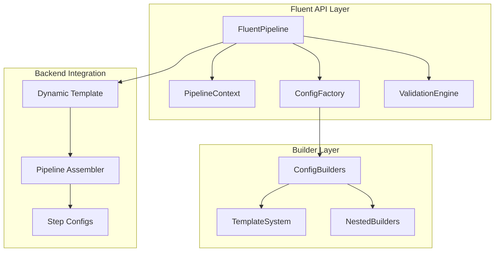

# Fluent API Implementation Plan

## Executive Summary

This plan outlines the implementation of a Fluent API for the cursus pipeline system, transforming complex configuration management into an intuitive, natural language-like interface. The implementation leverages existing infrastructure while providing progressive disclosure of complexity, context-aware defaults, and comprehensive validation.

**Based on:**
- Design specifications from `slipbox/1_design/fluent_api.md`
- Integration analysis from `slipbox/4_analysis/fluent_api_dag_compiler_integration_analysis.md`
- User input complexity analysis from `slipbox/4_analysis/fluent_api_user_input_collection_analysis.md`
- Existing Dynamic Template System architecture
- Current configuration classes in `src/cursus/steps/configs/`

## Project Objectives

### Primary Goals
1. **Improve Developer Experience**: Reduce pipeline configuration time from 30+ minutes to 2-3 minutes
2. **Reduce Configuration Errors**: Achieve 70% reduction in configuration-related errors
3. **Maintain Full Capability**: Preserve access to all existing configuration options
4. **Ensure Backward Compatibility**: Existing code continues to work unchanged
5. **Enable Progressive Learning**: Support users from beginner to expert levels

### Success Metrics
- **Adoption Rate**: 80% of new pipelines use Fluent API within 6 months
- **Configuration Time**: 90% reduction for common use cases
- **Error Rate**: 70% reduction in configuration errors
- **Developer Satisfaction**: Improved UX scores by 50%
- **Code Readability**: 50% improvement in readability metrics

## Architecture Overview

### Core Components



### Integration Strategy
- **Backend**: Leverage existing Dynamic Template System as execution engine (ref: `slipbox/1_design/dynamic_template_system.md`)
- **Configuration**: Use existing configuration classes as data models (ref: `src/cursus/steps/configs/`)
- **Validation**: Extend existing validation infrastructure (ref: `src/cursus/core/validation/`)
- **Assembly**: Delegate to existing Pipeline Assembler (ref: `src/cursus/core/pipeline_assembler.py`)

## Implementation Phases

### Phase 1: Core Progressive Disclosure (4-6 weeks)

#### Objectives
- Implement basic fluent methods with intelligent defaults
- Create context-aware configuration system
- Establish integration with existing backend
- Support Level 1 and Level 2 complexity

#### Deliverables

##### 1.1 Core FluentPipeline Class (Week 1-2)
```python
# Core implementation
class FluentPipeline:
    def __init__(self, name: str)
    def load_data(self, data_source: str, **kwargs) -> 'FluentPipeline'
    def train_xgboost(self, **kwargs) -> 'FluentPipeline'
    def execute(self) -> Pipeline
    
# Context management
class PipelineContext:
    def get_smart_defaults(self, step_type: str) -> Dict[str, Any]
    def infer_context_from_data_source(self, data_source: str) -> None
```

**Tasks**:
- [ ] Create `FluentPipeline` base class with method chaining (ref: `slipbox/4_analysis/fluent_api_dag_compiler_integration_analysis.md` - FluentPipeline Architecture)
- [ ] Implement `PipelineContext` for intelligent defaults (ref: `slipbox/4_analysis/fluent_api_user_input_collection_analysis.md` - Context-Aware Defaults)
- [ ] Add basic fluent methods: `load_data()`, `train_xgboost()` (ref: `slipbox/1_design/fluent_api.md` - Core Methods)
- [ ] Integrate with Dynamic Template System for execution (ref: `slipbox/4_analysis/fluent_api_dag_compiler_integration_analysis.md` - Integration Strategy)
- [ ] Create unit tests for core functionality

##### 1.2 Context-Aware Defaults (Week 2-3)
```python
# Context declaration methods
def for_classification_task(self) -> 'FluentPipeline'
def for_regression_task(self) -> 'FluentPipeline'
def with_large_dataset(self) -> 'FluentPipeline'
def for_production_environment(self) -> 'FluentPipeline'
```

**Tasks**:
- [ ] Implement context declaration methods (ref: `slipbox/4_analysis/fluent_api_user_input_collection_analysis.md` - Strategy 4: Context-Aware Defaults)
- [ ] Create smart defaults logic for different contexts (ref: `slipbox/4_analysis/fluent_api_user_input_collection_analysis.md` - PipelineContext.get_smart_defaults())
- [ ] Add context inference from data sources (ref: `slipbox/4_analysis/fluent_api_user_input_collection_analysis.md` - Context inference patterns)
- [ ] Test context-aware parameter selection

##### 1.3 Basic Validation and Error Prevention (Week 3-4)
```python
class FluentValidationMixin:
    def _validate_prerequisites(self, step_type: str) -> None
    def _validate_parameter_compatibility(self, step_type: str, **kwargs) -> None
    def _provide_helpful_suggestions(self, step_type: str, **kwargs) -> None
```

**Tasks**:
- [ ] Implement prerequisite validation
- [ ] Add parameter compatibility checks
- [ ] Create helpful error messages and suggestions
- [ ] Test validation with various parameter combinations

##### 1.4 Integration Testing (Week 4-5)
**Tasks**:
- [ ] Test integration with existing configuration classes
- [ ] Verify Dynamic Template System compatibility
- [ ] Performance benchmarking against direct configuration
- [ ] End-to-end pipeline execution testing

##### 1.5 Documentation and Examples (Week 5-6)
**Tasks**:
- [ ] Create API documentation
- [ ] Write basic usage examples
- [ ] Document migration from existing approaches
- [ ] Create developer onboarding guide

#### Success Criteria
- [ ] Basic fluent methods work for common use cases
- [ ] Context-aware defaults reduce required parameters by 60%
- [ ] Integration with existing backend is seamless
- [ ] Performance overhead is < 5%

### Phase 2: Builder Pattern and Templates (3-4 weeks)

#### Objectives
- Add nested configuration builders for complex objects
- Implement template-based configuration system
- Support Level 3 complexity (full configuration access)
- Enhanced validation with cross-field checks

#### Deliverables

##### 2.1 Nested Configuration Builders (Week 1-2)
```python
class CradleJobBuilder:
    def with_cluster_type(self, cluster_type: str) -> 'CradleJobBuilder'
    def with_account(self, account: str) -> 'CradleJobBuilder'
    def build(self) -> CradleJobSpecificationConfig

class DataSourcesBuilder:
    def add_mds_source(self, service_name: str, region: str, schema: List) -> 'DataSourcesBuilder'
    def add_edx_source(self, provider: str, subject: str, dataset: str) -> 'DataSourcesBuilder'
    def build(self) -> DataSourcesSpecificationConfig
```

**Tasks**:
- [ ] Implement `CradleJobBuilder` for complex job configuration (ref: `slipbox/4_analysis/fluent_api_user_input_collection_analysis.md` - Strategy 2: Builder Pattern)
- [ ] Create `DataSourcesBuilder` for data source management (ref: `slipbox/4_analysis/fluent_api_user_input_collection_analysis.md` - DataSourcesBuilder implementation)
- [ ] Add `HyperparametersBuilder` for ML parameter configuration (ref: `slipbox/1_design/fluent_api.md` - Advanced Configuration)
- [ ] Integrate builders with main fluent interface (ref: `slipbox/4_analysis/fluent_api_dag_compiler_integration_analysis.md` - Builder Integration)
- [ ] Test builder pattern with complex configurations

##### 2.2 Template-Based Configuration (Week 2-3)
```python
class ConfigurationTemplates:
    TEMPLATES = {
        "standard_mds_training": {...},
        "large_edx_batch": {...},
        "production_classification": {...}
    }

def load_data_with_template(self, template_name: str, **overrides) -> 'FluentPipeline'
def train_xgboost_with_template(self, template_name: str, **overrides) -> 'FluentPipeline'
```

**Tasks**:
- [ ] Design template system architecture (ref: `slipbox/4_analysis/fluent_api_user_input_collection_analysis.md` - Strategy 3: Template-Based Configuration)
- [ ] Create predefined templates for common use cases (ref: `slipbox/4_analysis/fluent_api_user_input_collection_analysis.md` - ConfigurationTemplates.TEMPLATES)
- [ ] Implement template loading and override mechanisms (ref: `slipbox/1_design/fluent_api.md` - Template Methods)
- [ ] Add template validation and error handling
- [ ] Test template-based configuration workflows

##### 2.3 Enhanced Validation (Week 3-4)
**Tasks**:
- [ ] Implement cross-field validation rules
- [ ] Add business logic validation
- [ ] Create comprehensive parameter compatibility checks
- [ ] Enhance error messages with actionable suggestions
- [ ] Test validation with complex parameter combinations

#### Success Criteria
- [ ] Complex configurations manageable through builders
- [ ] Templates reduce configuration effort by 80% for common cases
- [ ] Enhanced validation catches 90% of configuration errors early
- [ ] Full configuration access available when needed

### Phase 3: Advanced Features (2-3 weeks)

#### Objectives
- Add configuration import/export capabilities
- Implement advanced validation with suggestions
- Create configuration comparison and diff tools
- Performance optimization

#### Deliverables

##### 3.1 Configuration Import/Export (Week 1)
```python
class ConfigurationIOMixin:
    def load_config_from_file(self, config_path: str) -> 'FluentPipeline'
    def export_config_to_file(self, output_path: str) -> None
    def get_config_diff(self, other_config_path: str) -> Dict[str, Any]
```

**Tasks**:
- [ ] Implement configuration file loading (JSON/YAML)
- [ ] Add configuration export functionality
- [ ] Create configuration comparison and diff tools
- [ ] Support partial configuration loading and merging
- [ ] Test import/export with various configuration formats

##### 3.2 Advanced Validation and Suggestions (Week 1-2)
**Tasks**:
- [ ] Implement AI-powered parameter suggestions
- [ ] Add performance optimization recommendations
- [ ] Create configuration health checks
- [ ] Implement best practices validation
- [ ] Test advanced validation scenarios

##### 3.3 Performance Optimization (Week 2-3)
**Tasks**:
- [ ] Implement configuration object caching
- [ ] Add lazy validation mechanisms
- [ ] Optimize parameter merging algorithms
- [ ] Profile and optimize memory usage
- [ ] Benchmark performance improvements

#### Success Criteria
- [ ] Configuration I/O supports all existing formats
- [ ] Advanced validation provides actionable insights
- [ ] Performance overhead remains < 3%
- [ ] Configuration diff tools aid debugging

### Phase 4: Integration and Polish (2-3 weeks)

#### Objectives
- Complete integration with existing systems
- Add IDE support and type hints
- Comprehensive documentation and examples
- Production readiness

#### Deliverables

##### 4.1 IDE Support and Type Safety (Week 1)
```python
# Progressive type refinement
class DataLoadedPipeline:
    def preprocess(self, **kwargs) -> 'PreprocessedPipeline'
    def train_xgboost(self, **kwargs) -> 'TrainedPipeline'

class PreprocessedPipeline:
    def train_xgboost(self, **kwargs) -> 'TrainedPipeline'
    def train_pytorch(self, **kwargs) -> 'TrainedPipeline'
```

**Tasks**:
- [ ] Implement progressive type refinement
- [ ] Add comprehensive type hints
- [ ] Create IDE plugin/extension for IntelliSense
- [ ] Test type safety with various IDEs
- [ ] Document type system usage

##### 4.2 Comprehensive Documentation (Week 1-2)
**Tasks**:
- [ ] Create complete API reference documentation
- [ ] Write comprehensive usage examples
- [ ] Document migration strategies from existing approaches
- [ ] Create troubleshooting guide
- [ ] Record video tutorials for common workflows

##### 4.3 Production Readiness (Week 2-3)
**Tasks**:
- [ ] Comprehensive integration testing
- [ ] Performance benchmarking in production scenarios
- [ ] Security review and validation
- [ ] Error handling and logging improvements
- [ ] Production deployment preparation

#### Success Criteria
- [ ] Full IDE support with IntelliSense
- [ ] Complete documentation covers all use cases
- [ ] Production-ready with comprehensive testing
- [ ] Migration path clearly documented

## Technical Implementation Details

### Core Architecture

#### FluentPipeline Class Structure
```python
class FluentPipeline:
    def __init__(self, name: str):
        self.name = name
        self.dag = PipelineDAG()
        self.configs = {}
        self.context = PipelineContext()
        self.validation_engine = FluentValidationEngine()
    
    # Core fluent methods
    def load_data(self, data_source: str, **kwargs) -> 'FluentPipeline'
    def preprocess(self, **kwargs) -> 'FluentPipeline'
    def train_xgboost(self, **kwargs) -> 'FluentPipeline'
    def evaluate_model(self, **kwargs) -> 'FluentPipeline'
    def deploy(self, **kwargs) -> 'FluentPipeline'
    
    # Context declaration methods
    def for_classification_task(self) -> 'FluentPipeline'
    def for_regression_task(self) -> 'FluentPipeline'
    def with_large_dataset(self) -> 'FluentPipeline'
    def for_production_environment(self) -> 'FluentPipeline'
    
    # Advanced configuration methods
    def configure_cradle_job(self, configurator: Callable) -> 'FluentPipeline'
    def configure_data_sources(self, configurator: Callable) -> 'FluentPipeline'
    def configure_hyperparameters(self, configurator: Callable) -> 'FluentPipeline'
    
    # Template methods
    def load_data_with_template(self, template_name: str, **overrides) -> 'FluentPipeline'
    def train_xgboost_with_template(self, template_name: str, **overrides) -> 'FluentPipeline'
    
    # Execution and export
    def execute(self) -> Pipeline
    def preview_dag(self) -> Dict[str, Any]
    def export_config(self, output_path: str) -> None
```

#### Context Management System
```python
class PipelineContext:
    def __init__(self):
        self.task_type: Optional[str] = None
        self.data_scale: Optional[str] = None
        self.environment: Optional[str] = None
        self.performance_requirements: Optional[str] = None
        self.data_sources: List[str] = []
    
    def get_smart_defaults(self, step_type: str) -> Dict[str, Any]
    def infer_context_from_data_source(self, data_source: str) -> None
    def merge_contexts(self, other_context: 'PipelineContext') -> 'PipelineContext'
```

#### Configuration Factory System
```python
class ConfigurationFactory:
    def __init__(self, context: PipelineContext):
        self.context = context
        self.templates = ConfigurationTemplates()
    
    def create_data_loading_config(self, data_source: str, **kwargs) -> CradleDataLoadConfig
    def create_training_config(self, model_type: str, **kwargs) -> BasePipelineConfig
    def create_from_template(self, template_name: str, **overrides) -> BasePipelineConfig
```

### Integration Points

#### Dynamic Template Integration
```python
class FluentPipeline:
    def execute(self) -> Pipeline:
        """Execute using Dynamic Template System"""
        template = DynamicPipelineTemplate(
            dag=self.dag,
            config_map=self.configs,
            skip_validation=False
        )
        return template.build_pipeline()
    
    def preview_resolution(self) -> Dict[str, Any]:
        """Preview step resolution using existing resolver"""
        temp_template = DynamicPipelineTemplate(
            dag=self.dag,
            config_map=self.configs
        )
        return temp_template.get_resolution_preview()
```

#### Validation Engine Integration
```python
class FluentValidationEngine:
    def __init__(self, context: PipelineContext):
        self.context = context
        self.base_validator = ValidationEngine()  # Existing validator
    
    def validate_step_prerequisites(self, step_type: str, current_steps: List[str]) -> ValidationResult
    def validate_parameter_compatibility(self, step_type: str, **kwargs) -> ValidationResult
    def provide_suggestions(self, step_type: str, **kwargs) -> List[str]
```

## Resource Requirements

### Team Structure
- **Lead Developer** (1): Architecture design, core implementation
- **Backend Developer** (1): Integration with existing systems
- **Frontend/UX Developer** (1): IDE support, documentation, examples

### Development Environment
- **IDE**: VSCode with Python extensions
- **Testing**: pytest, coverage.py
- **Documentation**: Sphinx, MkDocs
- **CI/CD**: GitHub Actions
- **Performance**: cProfile, memory_profiler

### Infrastructure
- **Development**: Local development environments
- **Testing**: Automated test suites, integration test environment
- **Documentation**: Documentation hosting (GitHub Pages)
- **Performance**: Benchmarking infrastructure

## Risk Assessment and Mitigation

### High-Risk Areas

#### 1. API Design Consistency
**Risk**: Inconsistent naming and behavior patterns across fluent methods
**Mitigation**:
- Establish clear naming conventions early
- Regular API design reviews
- Comprehensive style guide
- Automated linting for consistency

#### 2. Performance Impact
**Risk**: Fluent API introduces significant performance overhead
**Mitigation**:
- Continuous performance benchmarking
- Lazy evaluation strategies
- Configuration object caching
- Performance regression testing

#### 3. Backward Compatibility
**Risk**: Changes break existing code or workflows
**Mitigation**:
- Maintain existing APIs unchanged
- Comprehensive integration testing
- Gradual migration strategies
- Clear deprecation policies

#### 4. Complexity Management
**Risk**: Fluent API becomes as complex as original system
**Mitigation**:
- Progressive disclosure principle
- Regular user testing
- Simplicity metrics tracking
- Continuous UX evaluation

### Medium-Risk Areas

#### 1. Context Management
**Risk**: Context pollution between pipeline instances
**Mitigation**:
- Immutable context objects
- Clear context scoping rules
- Context isolation testing
- Documentation of context behavior

#### 2. Template Maintenance
**Risk**: Templates become outdated or inconsistent
**Mitigation**:
- Automated template validation
- Regular template review process
- Version control for templates
- Template usage analytics

### Low-Risk Areas

#### 1. Integration Complexity
**Risk**: Difficult integration with existing systems
**Mitigation**: Leverage existing Dynamic Template System as proven integration point

#### 2. User Adoption
**Risk**: Users prefer existing approaches
**Mitigation**: Gradual rollout with clear migration benefits

## Testing Strategy

### Unit Testing
- **Coverage Target**: 95%
- **Focus Areas**: Core fluent methods, context management, validation
- **Tools**: pytest, coverage.py, hypothesis for property-based testing

### Integration Testing
- **Scope**: End-to-end pipeline execution
- **Focus**: Dynamic Template integration, configuration compatibility
- **Tools**: pytest, docker for environment isolation

### Performance Testing
- **Metrics**: Configuration time, memory usage, execution overhead
- **Benchmarks**: Compare against direct configuration approaches
- **Tools**: pytest-benchmark, memory_profiler

### User Acceptance Testing
- **Participants**: Internal developers, external beta users
- **Scenarios**: Common pipeline creation workflows
- **Metrics**: Task completion time, error rates, satisfaction scores

## Documentation Plan

### API Documentation
- **Format**: Sphinx with autodoc
- **Content**: Complete method reference, parameter descriptions, examples
- **Hosting**: GitHub Pages with search functionality

### User Guides
- **Getting Started**: Quick start guide for new users
- **Migration Guide**: Step-by-step migration from existing approaches
- **Advanced Usage**: Complex configuration scenarios, best practices
- **Troubleshooting**: Common issues and solutions

### Developer Documentation
- **Architecture**: System design, integration points
- **Contributing**: Development setup, coding standards
- **Testing**: Test strategy, running tests
- **Release Process**: Versioning, deployment procedures

## Deployment Strategy

### Rollout Phases

#### Phase 1: Internal Alpha (Week 12)
- **Audience**: Core development team
- **Scope**: Basic functionality testing
- **Duration**: 2 weeks
- **Success Criteria**: Core workflows functional

#### Phase 2: Internal Beta (Week 14)
- **Audience**: Extended development team
- **Scope**: Full feature testing
- **Duration**: 3 weeks
- **Success Criteria**: Feature completeness, performance targets met

#### Phase 3: External Beta (Week 17)
- **Audience**: Selected external users
- **Scope**: Real-world usage scenarios
- **Duration**: 4 weeks
- **Success Criteria**: User satisfaction, adoption metrics

#### Phase 4: General Availability (Week 21)
- **Audience**: All users
- **Scope**: Full production release
- **Support**: Complete documentation, support channels

### Version Control Strategy
- **Semantic Versioning**: Major.Minor.Patch
- **Release Branches**: Feature branches, release candidates
- **Backward Compatibility**: Maintain for at least 2 major versions

## Success Measurement

### Quantitative Metrics

#### Development Metrics
- **Code Coverage**: Target 95%
- **Performance Overhead**: < 5% compared to direct configuration
- **API Consistency**: 100% adherence to naming conventions
- **Documentation Coverage**: 100% of public APIs documented

#### User Experience Metrics
- **Configuration Time**: 90% reduction for common use cases
- **Error Rate**: 70% reduction in configuration errors
- **Adoption Rate**: 80% of new pipelines within 6 months
- **Support Tickets**: 50% reduction in configuration-related issues

### Qualitative Metrics

#### Developer Satisfaction
- **Ease of Use**: Survey scores > 4.0/5.0
- **Learning Curve**: Onboarding time < 2 hours
- **Productivity**: Self-reported productivity improvement
- **Recommendation**: Net Promoter Score > 50

#### Code Quality
- **Readability**: Improved readability scores
- **Maintainability**: Reduced time for pipeline modifications
- **Debugging**: Faster issue resolution
- **Documentation**: Self-documenting code characteristics

## Conclusion

This implementation plan provides a comprehensive roadmap for creating a Fluent API that transforms the complex configuration management challenge into a competitive advantage. The phased approach ensures incremental value delivery while maintaining system reliability and backward compatibility.

### Key Success Factors

1. **Leverage Existing Infrastructure**: Build on proven Dynamic Template System
2. **Progressive Implementation**: Deliver value incrementally across 4 phases
3. **User-Centric Design**: Focus on developer experience and usability
4. **Comprehensive Testing**: Ensure reliability through extensive testing
5. **Clear Documentation**: Support adoption with excellent documentation

### Expected Outcomes

- **Improved Developer Experience**: 90% reduction in configuration time
- **Reduced Errors**: 70% fewer configuration-related issues
- **Increased Adoption**: 80% of new pipelines use Fluent API
- **Enhanced Maintainability**: Self-documenting, readable pipeline code
- **Competitive Advantage**: Industry-leading pipeline configuration experience

The Fluent API implementation will establish the cursus system as the most user-friendly and powerful pipeline construction platform, enabling teams to focus on ML innovation rather than configuration complexity.
