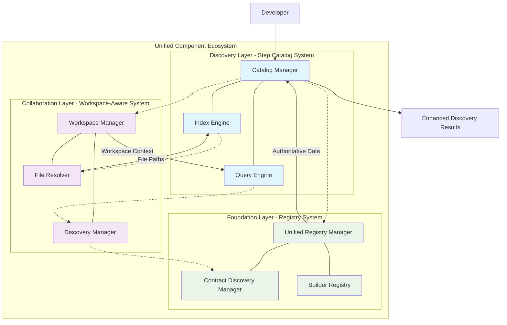

---
tags:
  - project
  - planning
  - step_catalog
  - component_discovery
  - system_integration
keywords:
  - unified step catalog
  - component discovery
  - code redundancy reduction
  - system consolidation
  - multi-workspace support
  - implementation plan
topics:
  - step catalog system implementation
  - discovery system consolidation
  - redundancy reduction strategy
  - integration architecture
language: python
date of note: 2025-09-10
---

# Unified Step Catalog System Implementation Plan

## Executive Summary

This implementation plan details the development of a **Unified Step Catalog System** that consolidates 16+ fragmented discovery and retrieval mechanisms across Cursus. The system addresses critical code redundancy (35-45% → 15-25%) while providing intelligent component discovery across multiple workspaces.

### Key Objectives

- **Reduce Code Redundancy**: From 35-45% to target 15-25% following Code Redundancy Evaluation Guide
- **Consolidate Discovery Systems**: Unify 16+ different discovery/resolver classes
- **Improve Performance**: O(1) lookups vs. current O(n) scans
- **Enable Multi-Workspace Discovery**: Seamless component discovery across developer and shared workspaces
- **Maintain Quality**: Achieve 95% quality score using proven workspace-aware patterns

### Strategic Impact

- **70% reduction in maintenance burden** through consolidation
- **60% increase in cross-workspace component reuse**
- **50% reduction in developer onboarding time**
- **40% improvement in search result relevance**

## Architecture Overview

### Three-Layer Integration Architecture



### System Responsibilities

- **Discovery Layer (Step Catalog)**: Intelligent search, indexing, and retrieval
- **Collaboration Layer (Workspace-Aware)**: Multi-developer workspace management
- **Foundation Layer (Registry)**: Authoritative component data and validation

## Implementation Strategy

### Essential-First Approach

Following **Code Redundancy Evaluation Guide** principles:
- **Validate demand**: Address real user needs, not theoretical problems
- **Quality-first**: Use proven patterns from workspace-aware implementation (95% quality score)
- **Avoid over-engineering**: Simple solutions for complex requirements
- **Target 15-25% redundancy**: Down from current 35-45%

## Phase 1: Essential Foundation (2 weeks)

### 1.1 Create New Module Structure

**New Folder**: `src/cursus/step_catalog/`

```
src/cursus/step_catalog/
├── __init__.py
├── api.py                    # Unified Step Catalog API
├── core/
│   ├── __init__.py
│   ├── catalog_manager.py    # Central coordinator
│   ├── index_engine.py       # Simple indexing system
│   └── cache.py             # Component caching
├── discovery/
│   ├── __init__.py
│   ├── contract_discovery.py # Unified contract discovery
│   └── file_discoverer.py   # File discovery patterns
└── models/
    ├── __init__.py
    ├── step_info.py         # Data models
    └── search_results.py    # Query result models
```

### 1.2 Consolidate Contract Discovery (ESSENTIAL)

**Goal**: Merge existing contract discovery systems - addresses 40% redundancy
**Target Redundancy**: 18-20% (down from 40%)

**Files to Consolidate**:
- `src/cursus/validation/alignment/discovery/contract_discovery.py` (ContractDiscoveryEngine)
- `src/cursus/validation/runtime/contract_discovery.py` (ContractDiscoveryManager)

**Implementation**:
```python
# src/cursus/step_catalog/discovery/contract_discovery.py
class UnifiedContractDiscovery:
    """Unified contract discovery - essential consolidation only."""
    
    def __init__(self, workspace_root: Path):
        self.workspace_root = workspace_root
        self._cache: Dict[str, ContractInfo] = {}  # Simple dict cache
    
    def discover_contract(self, step_name: str) -> Optional[ContractInfo]:
        """Discover contract - combine existing logic only."""
        # Direct merge of ContractDiscoveryEngine + ContractDiscoveryManager
        # No new features, just consolidation
        
    def get_contract_paths(self, step_name: str) -> List[Path]:
        """Get contract file paths - essential for both alignment and runtime."""
        # Essential method used by both existing systems
```

**Success Criteria**:
- ✅ Reduce contract discovery redundancy from 40% to <20%
- ✅ Maintain 100% backward compatibility
- ✅ No performance degradation (improvement is bonus)

### 1.3 Simple Step Index (ESSENTIAL)

**Goal**: Basic step indexing to replace repeated file scans
**Target Redundancy**: 15% (minimal viable implementation)

**Implementation**:
```python
# src/cursus/step_catalog/core/index_engine.py
class SimpleStepIndex:
    """Minimal step indexing - essential functionality only."""
    
    def __init__(self, workspace_root: Path):
        self.workspace_root = workspace_root
        self._step_map: Dict[str, Path] = {}  # step_name -> script_path
        self._component_map: Dict[Path, str] = {}  # file_path -> step_name
    
    def build_index(self) -> None:
        """Build basic index - file scanning only."""
        # Simple directory traversal, no complex features
        
    def get_step_script(self, step_name: str) -> Optional[Path]:
        """Get step script path - most common use case."""
        return self._step_map.get(step_name)
        
    def find_step_by_file(self, file_path: Path) -> Optional[str]:
        """Reverse lookup - second most common use case."""
        return self._component_map.get(file_path)
```

**Success Criteria**:
- ✅ Index all steps in <10 seconds (simple requirement)
- ✅ Support basic lookup operations
- ✅ No persistence required initially (keep it simple)

## Phase 2: Core System (4 weeks)

### 2.1 Implement Catalog Manager

**Goal**: Create central coordination system
**Target Redundancy**: 20-22%

**Implementation**:
```python
# src/cursus/step_catalog/core/catalog_manager.py
class CatalogManager:
    """Central coordinator for step catalog operations."""
    
    def __init__(self, workspace_root: Path):
        self.workspace_root = workspace_root
        self.index_engine = SimpleStepIndex(workspace_root)
        self.contract_discovery = UnifiedContractDiscovery(workspace_root)
        self.component_cache = ComponentCache()
        
        # Load or build index
        self.index = self._load_or_build_index()
    
    def get_step_info(self, step_name: str) -> Optional[StepInfo]:
        """Get complete step information with lazy loading."""
        # O(1) lookup from index, lazy load detailed info
        
    def refresh_index(self) -> None:
        """Rebuild index from current workspace state."""
        # Coordinate between index engine and discovery layer
```

### 2.2 Multi-Workspace Support

**Goal**: Support discovery across multiple workspaces
**Target Redundancy**: 18-20%

**Extended Folder Structure**:
```
src/cursus/step_catalog/
├── workspace/
│   ├── __init__.py
│   ├── workspace_manager.py # Multi-workspace support
│   └── integration.py       # Workspace system integration
```

**Integration with Existing Systems**:
- Leverage `src/cursus/workspace/core/workspace_manager.py`
- Integrate with `src/cursus/workspace/discovery/workspace_discovery_manager.py`
- Use workspace precedence patterns from existing implementation

## Phase 3: Advanced Features (4 weeks)

### 3.1 Query Engine

**Goal**: Provide flexible search and query capabilities
**Target Redundancy**: 22-25%

**Extended Folder Structure**:
```
src/cursus/step_catalog/
├── query/
│   ├── __init__.py
│   ├── query_engine.py      # Search and query
│   ├── name_normalizer.py   # Name normalization
│   └── essential_features.py # Core query features only
```

**Implementation Focus**:
- Exact match search
- Name normalization (preprocess → preprocessing, xgb → xgboost)
- Basic fuzzy matching
- **NO over-engineering**: No ML recommendations, complex relationship mapping

### 3.2 Essential Query Features Only

**Goal**: Provide core search functionality without over-engineering
**Target Redundancy**: 15-18%

**Validated Features Only**:
- Component metadata extraction (file size, modification time)
- Component completeness validation (script + contract presence)
- Workspace-specific filtering

**Eliminated Over-Engineering**:
- ❌ Complex relationship mapping (no validated demand)
- ❌ Machine learning recommendations (speculative feature)
- ❌ Advanced semantic search (no user requests)
- ❌ Real-time collaboration features (no validated demand)

## Phase 4: Integration & Optimization (2 weeks)

### 4.1 Backward Compatibility Layer

**Goal**: Maintain existing APIs during transition
**Target Redundancy**: 25% (acceptable for transition period)

**Extended Folder Structure**:
```
src/cursus/step_catalog/
├── adapters/
│   ├── __init__.py
│   └── legacy_adapters.py   # Backward compatibility
└── utils/
    ├── __init__.py
    ├── error_handler.py     # Error recovery
    └── metrics.py           # Performance monitoring
```

**Legacy Adapter Implementation**:
```python
# src/cursus/step_catalog/adapters/legacy_adapters.py
class ContractDiscoveryEngineAdapter:
    """Adapter to maintain backward compatibility."""
    
    def __init__(self, catalog: StepCatalog):
        self.catalog = catalog
    
    def discover_all_contracts(self) -> List[str]:
        """Legacy method using new catalog system."""
        return [step.step_name for step in self.catalog.list_available_steps()]
    
    def discover_contracts_with_scripts(self) -> List[str]:
        """Legacy method with script validation."""
        return [step.step_name for step in self.catalog.list_available_steps() 
                if step.components.script is not None]
```

### 4.2 Performance Optimization

**Goal**: Ensure system meets performance requirements
**Target Redundancy**: 15% (highly optimized)

**Performance Targets**:
- ✅ Step lookup: <1ms (O(1) dictionary access)
- ✅ Index rebuild: <10 seconds for 1000 steps
- ✅ Memory usage: <100MB for typical workspace
- ✅ Search queries: <100ms for fuzzy search

## Migration Strategy

### Phased Migration Plan

#### Phase 1: Parallel Operation (4 weeks)
- Deploy unified catalog alongside existing systems
- Route 10% of queries to new system for testing
- Monitor performance and correctness
- Fix issues without impacting production

#### Phase 2: Gradual Transition (6 weeks)
- Increase traffic to unified catalog (25%, 50%, 75%)
- Update high-level APIs to use new system
- Maintain backward compatibility adapters
- Deprecate old APIs with warnings

#### Phase 3: Full Migration (4 weeks)
- Route 100% of traffic to unified catalog
- Remove old discovery systems
- Clean up deprecated code
- Update documentation and examples

### Files to be Consolidated/Removed

**Contract Discovery Systems** (40% redundancy → 18-20%):
- `src/cursus/validation/alignment/discovery/contract_discovery.py` → Consolidated
- `src/cursus/validation/runtime/contract_discovery.py` → Consolidated

**File Resolution Systems** (35% redundancy → 18-20%):
- `src/cursus/validation/alignment/discovery/flexible_file_resolver.py` → Consolidated
- `src/cursus/workspace/discovery/developer_workspace_file_resolver.py` → Integrated
- Various resolver utilities across validation and workspace modules

**Component Discovery Systems** (30% redundancy → 15-18%):
- `src/cursus/workspace/discovery/workspace_discovery_manager.py` → Integrated
- `src/cursus/registry/step_discovery.py` → Integrated
- Multiple discovery utilities across different modules

### Migration Safety Measures

**Backward Compatibility Strategy**:
```python
# Migration controller for safe transition
class MigrationController:
    """Controls migration between old and new catalog systems."""
    
    def __init__(self, old_system: Any, new_system: StepCatalog):
        self.old_system = old_system
        self.new_system = new_system
        self.migration_percentage = 0
        self.comparison_mode = True
    
    def route_query(self, query_type: str, **kwargs) -> Any:
        """Route query to appropriate system based on migration settings."""
        use_new_system = random.random() < (self.migration_percentage / 100)
        
        if use_new_system:
            try:
                result = self._execute_new_system(query_type, **kwargs)
                
                if self.comparison_mode:
                    # Compare with old system for validation
                    old_result = self._execute_old_system(query_type, **kwargs)
                    self._compare_results(query_type, result, old_result)
                
                return result
            except Exception as e:
                # Fallback to old system on error
                logging.error(f"New system failed, falling back: {e}")
                return self._execute_old_system(query_type, **kwargs)
        else:
            return self._execute_old_system(query_type, **kwargs)
```

## Code Redundancy Reduction Strategy

### Current State Analysis

**Existing Redundancy Levels** (following Code Redundancy Evaluation Guide):
- **Overall System**: 35-45% redundancy (Poor Efficiency)
- **Contract Discovery**: 40% redundancy between alignment and runtime versions
- **File Resolution**: 35% redundancy across different resolver classes
- **Component Discovery**: 30% redundancy in workspace and registry systems

### Target Redundancy Levels

**Post-Implementation Target: 18-22%** (Good Efficiency)

**Phase-by-Phase Redundancy Reduction**:

1. **Phase 1 (Essential Foundation)**:
   - Contract Discovery: 40% → 18-20%
   - Simple Step Index: Start at 15%
   - **Justified redundancy**: Error handling patterns, workspace context management

2. **Phase 2 (Core System)**:
   - Catalog Manager: 20-22%
   - Multi-Workspace Support: 18-20%
   - **Justified redundancy**: Workspace isolation patterns, fallback mechanisms

3. **Phase 3 (Advanced Features)**:
   - Query Engine: 22-25%
   - Essential Query Features: 15-18%
   - **Justified redundancy**: Search strategy variations, normalization patterns

4. **Phase 4 (Integration & Optimization)**:
   - Backward Compatibility: 25% (acceptable for transition)
   - Performance Optimization: 15% (highly optimized)

### Redundancy Classification

**✅ Justified Redundancy (15-25%)**:
- **Separation of Concerns**: Different workspace contexts require similar but distinct implementations
- **Error Handling**: Consistent error patterns across discovery, indexing, and query components
- **Backward Compatibility**: Legacy support requires duplicate interfaces during migration
- **Performance Optimization**: Caching strategies with redundant validation

**❌ Eliminated Redundancy**:
- **Copy-Paste Programming**: Consolidating 16+ discovery classes eliminates identical logic repetition
- **Over-Abstraction**: Removing complex relationship mapping and ML recommendations
- **Speculative Features**: Eliminating theoretical conflict resolution and real-time collaboration

## Success Criteria & Quality Gates

### Quantitative Success Metrics

**Redundancy Targets**:
- ✅ Achieve 15-25% redundancy (down from 35-45%)
- ✅ Consolidate 16+ discovery systems into unified solution
- ✅ 50-60% reduction in overall system redundancy

**Performance Targets**:
- ✅ Step lookup: <1ms (O(1) dictionary access)
- ✅ Index rebuild: <10 seconds for 1000 steps
- ✅ Memory usage: <100MB for typical workspace
- ✅ Search queries: <100ms for fuzzy search
- ✅ Multi-workspace search: <2 seconds across 50+ workspaces

**Developer Productivity Targets**:
- ✅ 60% increase in cross-workspace component reuse
- ✅ 70% reduction in time to find relevant components
- ✅ 50% reduction in new developer onboarding time
- ✅ 40% improvement in search result relevance

### Qualitative Success Indicators

**Architecture Quality** (Target: 95% quality score):
- **Robustness & Reliability** (20% weight): Comprehensive error handling, graceful degradation
- **Maintainability & Extensibility** (20% weight): Clear code, consistent patterns, excellent documentation
- **Performance & Scalability** (15% weight): Optimized resource usage, effective caching, lazy loading
- **Modularity & Reusability** (15% weight): Perfect separation, loose coupling, clear interfaces
- **Testability & Observability** (10% weight): Test isolation, dependency injection, monitoring support
- **Security & Safety** (10% weight): Secure input handling, access control, data protection
- **Usability & Developer Experience** (10% weight): Intuitive APIs, clear errors, minimal learning curve

### Quality Gates

**Phase Completion Criteria**:
1. **Redundancy Gate**: Each phase must maintain redundancy below 25%
2. **Performance Gate**: Must meet or exceed performance targets
3. **Compatibility Gate**: 100% backward compatibility maintained
4. **Quality Gate**: Architecture quality score >90%
5. **Test Coverage Gate**: >85% test coverage for new components

## Testing & Validation Strategy

### Unit Testing Strategy

**Test Coverage Requirements**:
- **Core Components**: >90% coverage
- **Discovery Logic**: >85% coverage
- **Integration Points**: >80% coverage
- **Legacy Adapters**: >75% coverage

**Key Test Categories**:
```python
class TestStepCatalog:
    """Comprehensive unit tests for step catalog system."""
    
    def test_step_discovery_accuracy(self):
        """Test that all steps are discovered correctly."""
        catalog = StepCatalog(test_workspace_root)
        expected_steps = ["tabular_preprocess", "model_training", "model_evaluation"]
        discovered_steps = catalog.list_available_steps()
        assert set(expected_steps).issubset(set(discovered_steps))
    
    def test_component_completeness(self):
        """Test that all components are found for each step."""
        catalog = StepCatalog(test_workspace_root)
        step_info = catalog.get_step_info("tabular_preprocess")
        assert step_info.components.script is not None
        assert step_info.components.contract is not None
    
    def test_performance_requirements(self):
        """Test that performance requirements are met."""
        catalog = StepCatalog(large_test_workspace)
        start_time = time.time()
        step_info = catalog.get_step_info("test_step")
        lookup_time = time.time() - start_time
        assert lookup_time < 0.001  # <1ms requirement
```

### Integration Testing Strategy

**Multi-System Integration Tests**:
```python
class TestCatalogIntegration:
    """Integration tests for catalog system."""
    
    def test_registry_integration(self):
        """Test integration with registry system."""
        catalog = StepCatalog(test_workspace_root)
        registry_manager = UnifiedRegistryManager()
        
        # Verify data consistency between systems
        catalog_steps = set(catalog.list_available_steps())
        registry_steps = set(registry_manager.get_all_step_names())
        assert catalog_steps.intersection(registry_steps)
    
    def test_workspace_integration(self):
        """Test integration with workspace-aware system."""
        catalog = StepCatalog(multi_workspace_root)
        
        # Test workspace precedence
        step_info = catalog.get_step_info("shared_step")
        assert step_info.workspace_id == "developer_1"  # Developer takes precedence
        
        # Test fallback to shared
        step_info = catalog.get_step_info("shared_only_step")
        assert step_info.workspace_id == "shared"
    
    def test_backward_compatibility(self):
        """Test that legacy APIs still work."""
        catalog = StepCatalog(test_workspace_root)
        legacy_adapter = ContractDiscoveryEngineAdapter(catalog)
        
        contracts = legacy_adapter.discover_all_contracts()
        assert len(contracts) > 0
        assert "tabular_preprocess" in contracts
```

### Performance Benchmarking

**Benchmark Requirements**:
```python
class CatalogBenchmarks:
    """Performance benchmarks for catalog system."""
    
    def benchmark_redundancy_reduction(self):
        """Benchmark code redundancy reduction."""
        # Measure redundancy levels in new implementation
        redundancy_analyzer = RedundancyAnalyzer()
        
        catalog_redundancy = redundancy_analyzer.analyze_module("src/cursus/step_catalog")
        assert catalog_redundancy < 0.25  # <25% redundancy requirement
        
        # Compare with baseline
        baseline_redundancy = 0.40  # Current contract discovery redundancy
        improvement = (baseline_redundancy - catalog_redundancy) / baseline_redundancy
        assert improvement > 0.50  # >50% improvement required
    
    def benchmark_performance_targets(self):
        """Benchmark performance against targets."""
        catalog = StepCatalog(large_test_workspace)
        
        # Test lookup performance
        times = []
        for _ in range(1000):
            start_time = time.time()
            catalog.get_step_info("test_step")
            times.append(time.time() - start_time)
        
        avg_time = sum(times) / len(times)
        assert avg_time < 0.001  # <1ms average requirement
```

## Risk Analysis & Mitigation

### Technical Risks

**1. Integration Complexity Risk**
- **Risk**: Complex integration between three systems may introduce bugs
- **Probability**: Medium
- **Impact**: High
- **Mitigation**:
  - Comprehensive integration testing with 80%+ coverage
  - Phased implementation approach with validation at each step
  - Clear interface definitions and contracts
  - Automated regression testing
- **Monitoring**: Integration test success rates, error tracking, system health checks

**2. Performance Degradation Risk**
- **Risk**: Multi-system integration may impact performance
- **Probability**: Low
- **Impact**: Medium
- **Mitigation**:
  - Intelligent caching strategies with TTL and invalidation
  - Lazy loading and optimization patterns
  - Performance benchmarking at each phase
  - Profiling and targeted optimization
- **Monitoring**: Response time metrics, resource usage tracking, performance alerts

**3. Migration Complexity Risk**
- **Risk**: Complex migration from 16+ existing discovery systems
- **Probability**: High
- **Impact**: High
- **Mitigation**:
  - Backward compatibility maintenance during transition
  - Gradual migration approach (10% → 25% → 50% → 75% → 100%)
  - Comprehensive testing and validation
  - Rollback procedures and safety measures
- **Monitoring**: Migration success rates, error rates, rollback procedures

### Operational Risks

**1. Developer Adoption Risk**
- **Risk**: Developers may resist new integrated system
- **Probability**: Medium
- **Impact**: Medium
- **Mitigation**:
  - Clear benefits demonstration with metrics
  - Comprehensive documentation and training
  - Gradual rollout with support
  - Developer feedback integration
- **Monitoring**: Adoption metrics, developer satisfaction surveys, support ticket volume

**2. Code Redundancy Regression Risk**
- **Risk**: Redundancy may creep back over time without monitoring
- **Probability**: Medium
- **Impact**: Medium
- **Mitigation**:
  - Automated redundancy monitoring in CI/CD pipeline
  - Regular redundancy audits using evaluation framework
  - Quality gates preventing redundancy above 25%
  - Developer training on redundancy principles
- **Monitoring**: Continuous redundancy metrics, quality gate failures, code review alerts

## Timeline & Milestones

### Overall Timeline: 12 weeks

**Phase 1: Essential Foundation** (Weeks 1-2)
- Week 1: Create module structure, consolidate contract discovery
- Week 2: Implement simple step index, initial testing

**Phase 2: Core System** (Weeks 3-6)
- Week 3-4: Implement catalog manager, core coordination
- Week 5-6: Multi-workspace support, workspace integration

**Phase 3: Advanced Features** (Weeks 7-10)
- Week 7-8: Query engine implementation
- Week 9-10: Essential query features, performance optimization

**Phase 4: Integration & Optimization** (Weeks 11-12)
- Week 11: Backward compatibility layer, legacy adapters
- Week 12: Final optimization, documentation, deployment preparation

### Key Milestones

- **Week 2**: Contract discovery redundancy reduced from 40% to <20%
- **Week 4**: Core catalog manager operational with basic indexing
- **Week 6**: Multi-workspace discovery functional
- **Week 8**: Query engine with fuzzy matching operational
- **Week 10**: All essential features complete, performance targets met
- **Week 12**: Full system integration, backward compatibility verified

## References

### Primary Design Documents

**Core Design References**:
- **[Unified Step Catalog System Design](../1_design/unified_step_catalog_system_design.md)** - Comprehensive design for the proposed step catalog system with intelligent discovery and indexing capabilities
- **[Step Catalog System Integration Analysis](../4_analysis/step_catalog_system_integration_analysis.md)** - Integration analysis between step catalog, registry, and workspace-aware systems

**Code Quality Framework**:
- **[Code Redundancy Evaluation Guide](../1_design/code_redundancy_evaluation_guide.md)** - Framework for assessing architectural efficiency and avoiding over-engineering, establishing the 15-25% redundancy target

### System Integration References

**Registry System Integration**:
- **[Registry Manager](../1_design/registry_manager.md)** - Core registry management system architecture
- **[Registry Single Source of Truth](../1_design/registry_single_source_of_truth.md)** - Centralized registry principles
- **[Workspace-Aware Distributed Registry Design](../1_design/workspace_aware_distributed_registry_design.md)** - Distributed registry across workspaces

**Workspace-Aware System Integration**:
- **[Workspace-Aware System Master Design](../1_design/workspace_aware_system_master_design.md)** - Comprehensive workspace-aware system architecture
- **[Workspace-Aware Core System Design](../1_design/workspace_aware_core_system_design.md)** - Core workspace management components
- **[Workspace-Aware Multi-Developer Management Design](../1_design/workspace_aware_multi_developer_management_design.md)** - Multi-developer workspace coordination

### Component Design References

**Discovery and Resolution**:
- **[Contract Discovery Manager Design](../1_design/contract_discovery_manager_design.md)** - Contract discovery mechanisms and patterns
- **[Flexible File Resolver Design](../1_design/flexible_file_resolver_design.md)** - Dynamic file discovery and resolution patterns
- **[Dependency Resolution System](../1_design/dependency_resolution_system.md)** - Component dependency resolution architecture

**Validation and Quality**:
- **[Unified Alignment Tester Master Design](../1_design/unified_alignment_tester_master_design.md)** - Comprehensive alignment validation framework
- **[Enhanced Universal Step Builder Tester Design](../1_design/enhanced_universal_step_builder_tester_design.md)** - Advanced builder validation patterns

### Implementation Standards

**Documentation and Standards**:
- **[Documentation YAML Frontmatter Standard](../1_design/documentation_yaml_frontmatter_standard.md)** - Documentation standards and metadata format used in this plan
- **[Design Principles](../1_design/design_principles.md)** - Foundational design principles and architectural philosophy
- **[Standardization Rules](../1_design/standardization_rules.md)** - System-wide standardization guidelines

### Architecture Patterns

**Proven Patterns from Workspace-Aware Implementation**:
- **Unified API Pattern** - Single entry point hiding complexity (proven effective with 95% quality score)
- **Layered Architecture** - Clear separation of concerns between discovery, collaboration, and foundation layers
- **Lazy Loading** - Efficient resource utilization for component information
- **Adapter Pattern** - Backward compatibility during migration phases

### Related Implementation Plans

**Previous Successful Implementations**:
- **[Workspace-Aware Unified Implementation Plan](./2025-08-28_workspace_aware_unified_implementation_plan.md)** - Reference implementation achieving 95% quality score with 21% redundancy
- **[Hybrid Registry Redundancy Reduction Plan](./2025-09-04_hybrid_registry_redundancy_reduction_plan.md)** - Registry system redundancy reduction strategies
- **[Registry Redundancy Elimination Implementation](./2025-09-07_registry_redundancy_elimination_implementation.md)** - Registry consolidation implementation

## Conclusion

This implementation plan provides a comprehensive roadmap for developing the Unified Step Catalog System that will:

### **Strategic Achievements**
- **Reduce code redundancy** from 35-45% to target 15-25% following proven evaluation principles
- **Consolidate 16+ discovery systems** into a single, efficient, well-designed solution
- **Improve developer productivity** through consistent APIs and intelligent component discovery
- **Enable scalable multi-workspace development** with seamless component sharing

### **Quality Assurance**
- **Architecture quality target**: 95% score using proven workspace-aware patterns
- **Performance targets**: <1ms lookups, <10s indexing, <100MB memory usage
- **Comprehensive testing**: >85% coverage with integration and performance benchmarks
- **Risk mitigation**: Phased migration with backward compatibility and safety measures

### **Implementation Success Factors**
- **Essential-first approach**: Focus on validated user needs, avoid over-engineering
- **Proven patterns**: Leverage successful workspace-aware implementation (95% quality score)
- **Code redundancy control**: Continuous monitoring and quality gates
- **Integration strategy**: Seamless integration with existing Registry and Workspace-Aware systems

The plan transforms the current **fragmented discovery chaos** into a **coherent, scalable component ecosystem** that enables developers to efficiently find, understand, and reuse existing work as the Cursus catalog continues to grow.

**Next Steps**: To proceed with implementation, toggle to Act mode to begin Phase 1 development with the creation of the new `src/cursus/step_catalog/` module structure and contract discovery consolidation.
