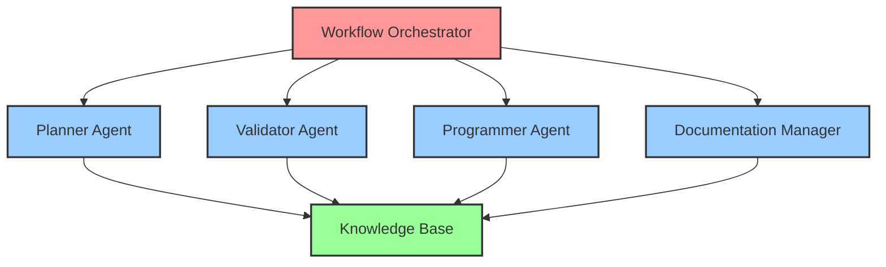

---
tags:
  - design
  - mcp
  - agent_integration
  - communication_patterns
  - coordination
keywords:
  - agent coordination
  - inter-agent communication
  - resource sharing
  - failure handling
  - load balancing
topics:
  - agent integration patterns
  - communication protocols
  - coordination mechanisms
  - failure recovery
language: python
date of note: 2025-08-09
---

# MCP Agent Integration Design

## Overview

This document defines the integration patterns, communication protocols, and coordination mechanisms for the MCP-based agentic workflow system. It focuses on how the six specialized MCP servers work together to deliver seamless workflow execution.

## Related Documents

### Master Design
- [MCP Agentic Workflow Master Design](mcp_agentic_workflow_master_design.md) - Complete system overview

### Related Components
- [MCP Server Architecture Design](mcp_agentic_workflow_server_architecture.md) - Individual server specifications
- [MCP Workflow Implementation Design](mcp_agentic_workflow_implementation.md) - Workflow sequences and phases
- [MCP Validation Framework Design](mcp_agentic_workflow_validation_framework.md) - Validation system details

## Agent Communication Architecture

### Communication Patterns

#### 1. Orchestrator-Centric Pattern


**Characteristics:**
- All workflow coordination flows through the orchestrator
- Agents communicate with orchestrator, not directly with each other
- Knowledge base serves as shared resource for all agents
- Clear command and control structure

#### 2. Event-Driven Communication
```python
class AgentCommunicationBus:
    """Event-driven communication system for MCP agents"""
    
    def __init__(self):
        self.event_handlers = {}
        self.message_queue = asyncio.Queue()
        self.agent_registry = {}
    
    async def register_agent(self, agent_id: str, agent_endpoint: str, 
                           capabilities: list) -> dict:
        """Register agent with communication bus"""
        self.agent_registry[agent_id] = {
            "endpoint": agent_endpoint,
            "capabilities": capabilities,
            "status": "active",
            "last_heartbeat": datetime.utcnow()
        }
        
        return {
            "status": "registered",
            "agent_id": agent_id,
            "bus_endpoint": self.get_bus_endpoint()
        }
    
    async def publish_event(self, event_type: str, payload: dict, 
                          source_agent: str) -> dict:
        """Publish event to interested agents"""
        event = {
            "event_id": str(uuid.uuid4()),
            "event_type": event_type,
            "payload": payload,
            "source_agent": source_agent,
            "timestamp": datetime.utcnow().isoformat(),
            "routing": self._determine_routing(event_type)
        }
        
        await self.message_queue.put(event)
        return {"status": "published", "event_id": event["event_id"]}
    
    async def subscribe_to_events(self, agent_id: str, 
                                event_types: list) -> dict:
        """Subscribe agent to specific event types"""
        for event_type in event_types:
            if event_type not in self.event_handlers:
                self.event_handlers[event_type] = []
            self.event_handlers[event_type].append(agent_id)
        
        return {
            "status": "subscribed",
            "agent_id": agent_id,
            "event_types": event_types
        }
    
    def _determine_routing(self, event_type: str) -> list:
        """Determine which agents should receive the event"""
        routing_rules = {
            "workflow_started": ["planner_agent", "documentation_manager"],
            "plan_created": ["validator_agent", "documentation_manager"],
            "plan_validated": ["workflow_orchestrator", "documentation_manager"],
            "code_generated": ["validator_agent", "documentation_manager"],
            "validation_completed": ["workflow_orchestrator", "programmer_agent"],
            "workflow_completed": ["all_agents"]
        }
        
        return routing_rules.get(event_type, [])
```

### Inter-Agent Communication Protocols

#### 1. Request-Response Protocol
```python
class AgentRequestResponse:
    """Standardized request-response protocol for agent communication"""
    
    REQUEST_TIMEOUT = 30  # seconds
    MAX_RETRIES = 3
    
    async def send_request(self, target_agent: str, tool_name: str, 
                          parameters: dict, workflow_context: dict = None) -> dict:
        """Send request to target agent"""
        
        request = {
            "request_id": str(uuid.uuid4()),
            "source_agent": self.agent_id,
            "target_agent": target_agent,
            "tool_name": tool_name,
            "parameters": parameters,
            "workflow_context": workflow_context or {},
            "timestamp": datetime.utcnow().isoformat(),
            "timeout": self.REQUEST_TIMEOUT
        }
        
        # Add request to tracking
        self.pending_requests[request["request_id"]] = request
        
        try:
            response = await self._execute_request_with_retry(request)
            return self._process_response(response)
        except Exception as e:
            return self._handle_request_error(request, e)
        finally:
            # Clean up tracking
            self.pending_requests.pop(request["request_id"], None)
    
    async def _execute_request_with_retry(self, request: dict) -> dict:
        """Execute request with retry logic"""
        
        last_exception = None
        
        for attempt in range(self.MAX_RETRIES):
            try:
                response = await self._send_mcp_request(
                    request["target_agent"],
                    request["tool_name"],
                    request["parameters"]
                )
                
                if response.get("status") == "success":
                    return response
                elif response.get("status") == "retry":
                    await asyncio.sleep(2 ** attempt)  # Exponential backoff
                    continue
                else:
                    raise Exception(f"Request failed: {response.get('error')}")
                    
            except Exception as e:
                last_exception = e
                if attempt < self.MAX_RETRIES - 1:
                    await asyncio.sleep(2 ** attempt)
                    continue
                else:
                    raise last_exception
        
        raise last_exception
```

#### 2. Streaming Protocol for Long-Running Operations
```python
class AgentStreamingProtocol:
    """Streaming protocol for long-running agent operations"""
    
    async def start_streaming_operation(self, target_agent: str, 
                                      operation: str, parameters: dict) -> AsyncIterator[dict]:
        """Start streaming operation with target agent"""
        
        stream_id = str(uuid.uuid4())
        
        # Initialize stream
        init_request = {
            "stream_id": stream_id,
            "operation": operation,
            "parameters": parameters,
            "stream_type": "bidirectional"
        }
        
        stream_endpoint = await self._establish_stream(target_agent, init_request)
        
        try:
            async for chunk in self._read_stream(stream_endpoint):
                yield self._process_stream_chunk(chunk)
        finally:
            await self._close_stream(stream_endpoint)
    
    async def _read_stream(self, stream_endpoint: str) -> AsyncIterator[dict]:
        """Read chunks from stream endpoint"""
        
        async with aiohttp.ClientSession() as session:
            async with session.get(stream_endpoint) as response:
                async for line in response.content:
                    if line:
                        try:
                            chunk = json.loads(line.decode('utf-8'))
                            yield chunk
                        except json.JSONDecodeError:
                            continue
```

## Resource Sharing Mechanisms

### 1. Knowledge Base Access Patterns

#### Shared Knowledge Pool
```python
class SharedKnowledgeManager:
    """Manage shared access to knowledge resources"""
    
    def __init__(self, knowledge_base_endpoint: str):
        self.kb_endpoint = knowledge_base_endpoint
        self.access_cache = {}
        self.access_locks = {}
    
    async def get_knowledge_resource(self, agent_id: str, resource_uri: str, 
                                   access_mode: str = "read") -> dict:
        """Get knowledge resource with appropriate access control"""
        
        # Check cache first
        cache_key = f"{resource_uri}:{access_mode}"
        if cache_key in self.access_cache:
            cached_resource = self.access_cache[cache_key]
            if not self._is_cache_expired(cached_resource):
                return cached_resource["data"]
        
        # Acquire lock for write operations
        if access_mode == "write":
            lock_key = f"write_lock:{resource_uri}"
            if lock_key in self.access_locks:
                raise Exception(f"Resource {resource_uri} is locked for writing")
            self.access_locks[lock_key] = agent_id
        
        try:
            # Fetch from knowledge base
            resource_data = await self._fetch_from_knowledge_base(
                resource_uri, access_mode
            )
            
            # Update cache
            self.access_cache[cache_key] = {
                "data": resource_data,
                "timestamp": datetime.utcnow(),
                "ttl": 300  # 5 minutes
            }
            
            return resource_data
            
        finally:
            # Release write lock
            if access_mode == "write":
                lock_key = f"write_lock:{resource_uri}"
                self.access_locks.pop(lock_key, None)
    
    async def invalidate_cache(self, resource_uri: str = None):
        """Invalidate cache for specific resource or all resources"""
        if resource_uri:
            # Invalidate specific resource
            keys_to_remove = [k for k in self.access_cache.keys() 
                            if k.startswith(resource_uri)]
            for key in keys_to_remove:
                self.access_cache.pop(key, None)
        else:
            # Invalidate all cache
            self.access_cache.clear()
```

#### Resource Versioning and Consistency
```python
class ResourceVersionManager:
    """Manage resource versions and consistency across agents"""
    
    def __init__(self):
        self.resource_versions = {}
        self.version_locks = asyncio.Lock()
    
    async def get_resource_version(self, resource_uri: str) -> str:
        """Get current version of resource"""
        async with self.version_locks:
            return self.resource_versions.get(resource_uri, "1.0.0")
    
    async def update_resource_version(self, resource_uri: str, 
                                    agent_id: str, changes: dict) -> str:
        """Update resource version after changes"""
        async with self.version_locks:
            current_version = self.resource_versions.get(resource_uri, "1.0.0")
            new_version = self._increment_version(current_version)
            
            # Record version change
            version_record = {
                "resource_uri": resource_uri,
                "old_version": current_version,
                "new_version": new_version,
                "agent_id": agent_id,
                "changes": changes,
                "timestamp": datetime.utcnow().isoformat()
            }
            
            self.resource_versions[resource_uri] = new_version
            await self._notify_version_change(version_record)
            
            return new_version
    
    async def _notify_version_change(self, version_record: dict):
        """Notify all agents of version change"""
        notification = {
            "event_type": "resource_version_changed",
            "payload": version_record
        }
        
        # Broadcast to all registered agents
        await self.communication_bus.publish_event(
            "resource_version_changed", 
            version_record, 
            "version_manager"
        )
```

### 2. Computational Resource Sharing

#### Load Balancing Across Agents
```python
class AgentLoadBalancer:
    """Load balancer for distributing work across agent instances"""
    
    def __init__(self):
        self.agent_instances = {}
        self.load_metrics = {}
        self.health_checker = AgentHealthChecker()
    
    async def register_agent_instance(self, agent_type: str, 
                                    instance_id: str, endpoint: str) -> dict:
        """Register new agent instance"""
        if agent_type not in self.agent_instances:
            self.agent_instances[agent_type] = {}
        
        self.agent_instances[agent_type][instance_id] = {
            "endpoint": endpoint,
            "status": "active",
            "current_load": 0,
            "max_capacity": 10,  # Configurable
            "last_heartbeat": datetime.utcnow()
        }
        
        return {"status": "registered", "instance_id": instance_id}
    
    async def select_agent_instance(self, agent_type: str, 
                                  operation_weight: int = 1) -> dict:
        """Select best agent instance for operation"""
        
        if agent_type not in self.agent_instances:
            raise Exception(f"No instances available for agent type: {agent_type}")
        
        available_instances = []
        
        for instance_id, instance_info in self.agent_instances[agent_type].items():
            # Check health
            if await self.health_checker.is_healthy(instance_info["endpoint"]):
                # Check capacity
                if instance_info["current_load"] + operation_weight <= instance_info["max_capacity"]:
                    load_ratio = instance_info["current_load"] / instance_info["max_capacity"]
                    available_instances.append((instance_id, instance_info, load_ratio))
        
        if not available_instances:
            raise Exception(f"No available instances for agent type: {agent_type}")
        
        # Select instance with lowest load ratio
        selected = min(available_instances, key=lambda x: x[2])
        instance_id, instance_info, _ = selected
        
        # Update load
        instance_info["current_load"] += operation_weight
        
        return {
            "instance_id": instance_id,
            "endpoint": instance_info["endpoint"],
            "operation_weight": operation_weight
        }
    
    async def release_agent_capacity(self, agent_type: str, 
                                   instance_id: str, operation_weight: int):
        """Release capacity after operation completion"""
        if (agent_type in self.agent_instances and 
            instance_id in self.agent_instances[agent_type]):
            
            instance_info = self.agent_instances[agent_type][instance_id]
            instance_info["current_load"] = max(0, 
                instance_info["current_load"] - operation_weight)
```

## Agent Failure Handling and Recovery

### 1. Health Monitoring System

#### Agent Health Checker
```python
class AgentHealthChecker:
    """Monitor health of all agent instances"""
    
    def __init__(self):
        self.health_status = {}
        self.health_check_interval = 30  # seconds
        self.failure_threshold = 3
    
    async def start_health_monitoring(self):
        """Start continuous health monitoring"""
        while True:
            await self._check_all_agents()
            await asyncio.sleep(self.health_check_interval)
    
    async def _check_all_agents(self):
        """Check health of all registered agents"""
        for agent_type, instances in self.agent_instances.items():
            for instance_id, instance_info in instances.items():
                health_status = await self._check_agent_health(
                    instance_info["endpoint"]
                )
                
                await self._update_health_status(
                    agent_type, instance_id, health_status
                )
    
    async def _check_agent_health(self, endpoint: str) -> dict:
        """Check health of individual agent"""
        try:
            async with aiohttp.ClientSession() as session:
                async with session.get(f"{endpoint}/health/live", 
                                     timeout=aiohttp.ClientTimeout(total=5)) as response:
                    if response.status == 200:
                        health_data = await response.json()
                        return {
                            "status": "healthy",
                            "response_time": health_data.get("response_time", 0),
                            "load": health_data.get("current_load", 0),
                            "memory_usage": health_data.get("memory_usage", 0)
                        }
                    else:
                        return {"status": "unhealthy", "reason": f"HTTP {response.status}"}
        
        except asyncio.TimeoutError:
            return {"status": "unhealthy", "reason": "timeout"}
        except Exception as e:
            return {"status": "unhealthy", "reason": str(e)}
    
    async def _update_health_status(self, agent_type: str, instance_id: str, 
                                  health_status: dict):
        """Update health status and trigger recovery if needed"""
        
        status_key = f"{agent_type}:{instance_id}"
        
        if status_key not in self.health_status:
            self.health_status[status_key] = {
                "consecutive_failures": 0,
                "last_healthy": datetime.utcnow(),
                "status": "unknown"
            }
        
        current_status = self.health_status[status_key]
        
        if health_status["status"] == "healthy":
            current_status["consecutive_failures"] = 0
            current_status["last_healthy"] = datetime.utcnow()
            current_status["status"] = "healthy"
        else:
            current_status["consecutive_failures"] += 1
            current_status["status"] = "unhealthy"
            
            # Trigger recovery if threshold exceeded
            if current_status["consecutive_failures"] >= self.failure_threshold:
                await self._trigger_agent_recovery(agent_type, instance_id)
```

### 2. Failure Recovery Strategies

#### Automatic Recovery Manager
```python
class AgentRecoveryManager:
    """Manage automatic recovery of failed agents"""
    
    RECOVERY_STRATEGIES = {
        "restart": "restart_agent_instance",
        "failover": "failover_to_backup",
        "scale_up": "create_new_instance",
        "circuit_breaker": "enable_circuit_breaker"
    }
    
    async def trigger_recovery(self, agent_type: str, instance_id: str, 
                             failure_context: dict) -> dict:
        """Trigger appropriate recovery strategy"""
        
        recovery_strategy = self._determine_recovery_strategy(
            agent_type, failure_context
        )
        
        recovery_method = getattr(self, self.RECOVERY_STRATEGIES[recovery_strategy])
        
        try:
            recovery_result = await recovery_method(agent_type, instance_id, failure_context)
            
            await self._log_recovery_action(
                agent_type, instance_id, recovery_strategy, recovery_result
            )
            
            return recovery_result
            
        except Exception as e:
            # Escalate to human intervention
            await self._escalate_to_human(agent_type, instance_id, str(e))
            return {"status": "escalated", "reason": str(e)}
    
    def _determine_recovery_strategy(self, agent_type: str, 
                                   failure_context: dict) -> str:
        """Determine appropriate recovery strategy based on failure context"""
        
        failure_reason = failure_context.get("reason", "unknown")
        consecutive_failures = failure_context.get("consecutive_failures", 0)
        
        if failure_reason == "timeout" and consecutive_failures < 3:
            return "restart"
        elif consecutive_failures >= 3:
            return "failover"
        elif failure_reason == "resource_exhaustion":
            return "scale_up"
        else:
            return "circuit_breaker"
    
    async def restart_agent_instance(self, agent_type: str, instance_id: str, 
                                   failure_context: dict) -> dict:
        """Restart failed agent instance"""
        
        # Get instance configuration
        instance_config = await self._get_instance_config(agent_type, instance_id)
        
        # Stop current instance
        await self._stop_instance(instance_id)
        
        # Start new instance with same configuration
        new_instance = await self._start_instance(agent_type, instance_config)
        
        # Update registry
        await self._update_instance_registry(agent_type, instance_id, new_instance)
        
        return {
            "status": "restarted",
            "new_instance_id": new_instance["instance_id"],
            "endpoint": new_instance["endpoint"]
        }
    
    async def failover_to_backup(self, agent_type: str, instance_id: str, 
                               failure_context: dict) -> dict:
        """Failover to backup agent instance"""
        
        # Find available backup instance
        backup_instance = await self._find_backup_instance(agent_type)
        
        if not backup_instance:
            # Create new backup instance
            backup_instance = await self._create_backup_instance(agent_type)
        
        # Transfer active workload to backup
        await self._transfer_workload(instance_id, backup_instance["instance_id"])
        
        # Mark failed instance as inactive
        await self._mark_instance_inactive(agent_type, instance_id)
        
        return {
            "status": "failed_over",
            "backup_instance_id": backup_instance["instance_id"],
            "endpoint": backup_instance["endpoint"]
        }
```

## Load Balancing and Scaling Strategies

### 1. Dynamic Scaling Manager

#### Auto-Scaling Based on Load
```python
class AgentAutoScaler:
    """Automatic scaling of agent instances based on load"""
    
    def __init__(self):
        self.scaling_policies = {}
        self.scaling_cooldown = 300  # 5 minutes
        self.last_scaling_action = {}
    
    async def configure_scaling_policy(self, agent_type: str, policy: dict):
        """Configure auto-scaling policy for agent type"""
        
        self.scaling_policies[agent_type] = {
            "min_instances": policy.get("min_instances", 1),
            "max_instances": policy.get("max_instances", 10),
            "target_cpu_utilization": policy.get("target_cpu_utilization", 70),
            "scale_up_threshold": policy.get("scale_up_threshold", 80),
            "scale_down_threshold": policy.get("scale_down_threshold", 30),
            "scale_up_increment": policy.get("scale_up_increment", 1),
            "scale_down_increment": policy.get("scale_down_increment", 1)
        }
    
    async def evaluate_scaling_needs(self, agent_type: str) -> dict:
        """Evaluate if scaling action is needed"""
        
        if agent_type not in self.scaling_policies:
            return {"action": "none", "reason": "no_policy_configured"}
        
        policy = self.scaling_policies[agent_type]
        current_metrics = await self._get_agent_metrics(agent_type)
        
        # Check cooldown period
        last_action_time = self.last_scaling_action.get(agent_type, datetime.min)
        if (datetime.utcnow() - last_action_time).seconds < self.scaling_cooldown:
            return {"action": "none", "reason": "cooldown_period"}
        
        # Evaluate scaling decision
        avg_cpu = current_metrics.get("avg_cpu_utilization", 0)
        current_instances = current_metrics.get("instance_count", 0)
        
        if avg_cpu > policy["scale_up_threshold"] and current_instances < policy["max_instances"]:
            return {
                "action": "scale_up",
                "current_instances": current_instances,
                "target_instances": min(
                    current_instances + policy["scale_up_increment"],
                    policy["max_instances"]
                ),
                "reason": f"CPU utilization {avg_cpu}% > threshold {policy['scale_up_threshold']}%"
            }
        
        elif avg_cpu < policy["scale_down_threshold"] and current_instances > policy["min_instances"]:
            return {
                "action": "scale_down",
                "current_instances": current_instances,
                "target_instances": max(
                    current_instances - policy["scale_down_increment"],
                    policy["min_instances"]
                ),
                "reason": f"CPU utilization {avg_cpu}% < threshold {policy['scale_down_threshold']}%"
            }
        
        return {"action": "none", "reason": "within_thresholds"}
    
    async def execute_scaling_action(self, agent_type: str, scaling_decision: dict) -> dict:
        """Execute scaling action"""
        
        action = scaling_decision["action"]
        
        if action == "scale_up":
            result = await self._scale_up_instances(
                agent_type, 
                scaling_decision["target_instances"] - scaling_decision["current_instances"]
            )
        elif action == "scale_down":
            result = await self._scale_down_instances(
                agent_type,
                scaling_decision["current_instances"] - scaling_decision["target_instances"]
            )
        else:
            return {"status": "no_action", "reason": scaling_decision["reason"]}
        
        # Update last scaling action time
        self.last_scaling_action[agent_type] = datetime.utcnow()
        
        return result
```

### 2. Geographic Distribution

#### Multi-Region Agent Deployment
```python
class MultiRegionAgentManager:
    """Manage agent deployment across multiple regions"""
    
    def __init__(self):
        self.regions = {}
        self.region_preferences = {}
        self.latency_matrix = {}
    
    async def register_region(self, region_id: str, region_config: dict):
        """Register new deployment region"""
        
        self.regions[region_id] = {
            "config": region_config,
            "agents": {},
            "status": "active",
            "capacity": region_config.get("capacity", 100)
        }
    
    async def deploy_agent_to_region(self, agent_type: str, region_id: str, 
                                   instance_count: int = 1) -> dict:
        """Deploy agent instances to specific region"""
        
        if region_id not in self.regions:
            raise Exception(f"Region {region_id} not registered")
        
        region = self.regions[region_id]
        deployment_results = []
        
        for i in range(instance_count):
            instance_config = {
                "agent_type": agent_type,
                "region_id": region_id,
                "instance_index": i,
                "deployment_config": region["config"]
            }
            
            instance = await self._deploy_instance(instance_config)
            deployment_results.append(instance)
            
            # Register with region
            if agent_type not in region["agents"]:
                region["agents"][agent_type] = []
            region["agents"][agent_type].append(instance)
        
        return {
            "status": "deployed",
            "region_id": region_id,
            "agent_type": agent_type,
            "instances": deployment_results
        }
    
    async def select_optimal_region(self, client_location: dict, 
                                  agent_type: str) -> str:
        """Select optimal region based on client location and agent availability"""
        
        available_regions = []
        
        for region_id, region in self.regions.items():
            if (region["status"] == "active" and 
                agent_type in region["agents"] and 
                len(region["agents"][agent_type]) > 0):
                
                # Calculate latency score
                latency = await self._estimate_latency(client_location, region_id)
                
                # Calculate availability score
                available_instances = len([
                    inst for inst in region["agents"][agent_type] 
                    if inst["status"] == "active"
                ])
                
                availability_score = available_instances / region["capacity"]
                
                # Combined score (lower is better)
                combined_score = latency * 0.7 + (1 - availability_score) * 0.3
                
                available_regions.append((region_id, combined_score))
        
        if not available_regions:
            raise Exception(f"No available regions for agent type: {agent_type}")
        
        # Select region with best score
        optimal_region = min(available_regions, key=lambda x: x[1])
        return optimal_region[0]
```

## Monitoring and Observability

### 1. Agent Performance Metrics

#### Metrics Collection System
```python
class AgentMetricsCollector:
    """Collect and aggregate metrics from all agents"""
    
    def __init__(self):
        self.metrics_storage = {}
        self.metric_definitions = self._define_metrics()
    
    def _define_metrics(self) -> dict:
        """Define standard metrics for all agents"""
        return {
            "request_count": {
                "type": "counter",
                "description": "Total number of requests processed",
                "labels": ["agent_type", "tool_name", "status"]
            },
            "request_duration": {
                "type": "histogram",
                "description": "Request processing duration in seconds",
                "labels": ["agent_type", "tool_name"],
                "buckets": [0.1, 0.5, 1.0, 2.0, 5.0, 10.0, 30.0]
            },
            "active_workflows": {
                "type": "gauge",
                "description": "Number of active workflows",
                "labels": ["agent_type"]
            },
            "error_rate": {
                "type": "gauge",
                "description": "Error rate percentage",
                "labels": ["agent_type", "error_type"]
            },
            "resource_utilization": {
                "type": "gauge",
                "description": "Resource utilization percentage",
                "labels": ["agent_type", "resource_type"]
            }
        }
    
    async def collect_metrics(self, agent_type: str, instance_id: str) -> dict:
        """Collect metrics from specific agent instance"""
        
        try:
            agent_endpoint = await self._get_agent_endpoint(agent_type, instance_id)
            
            async with aiohttp.ClientSession() as session:
                async with session.get(f"{agent_endpoint}/metrics") as response:
                    if response.status == 200:
                        metrics_data = await response.json()
                        
                        # Store metrics with timestamp
                        timestamp = datetime.utcnow()
                        storage_key = f"{agent_type}:{instance_id}"
                        
                        if storage_
