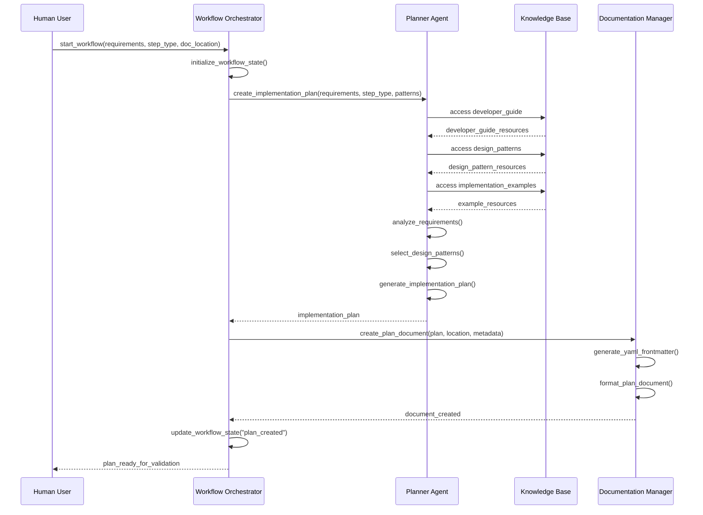
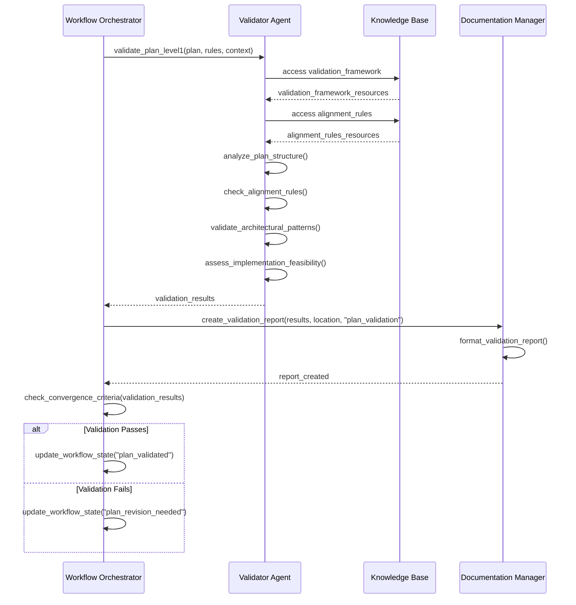
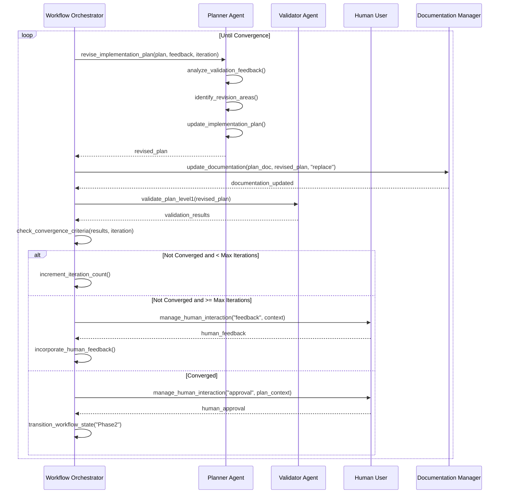
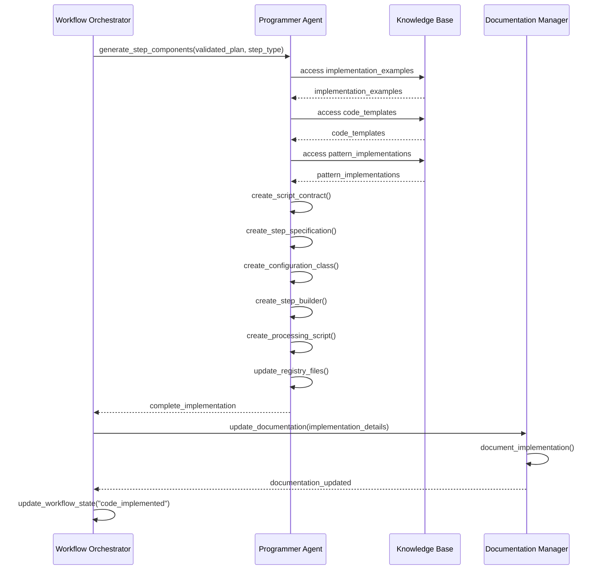
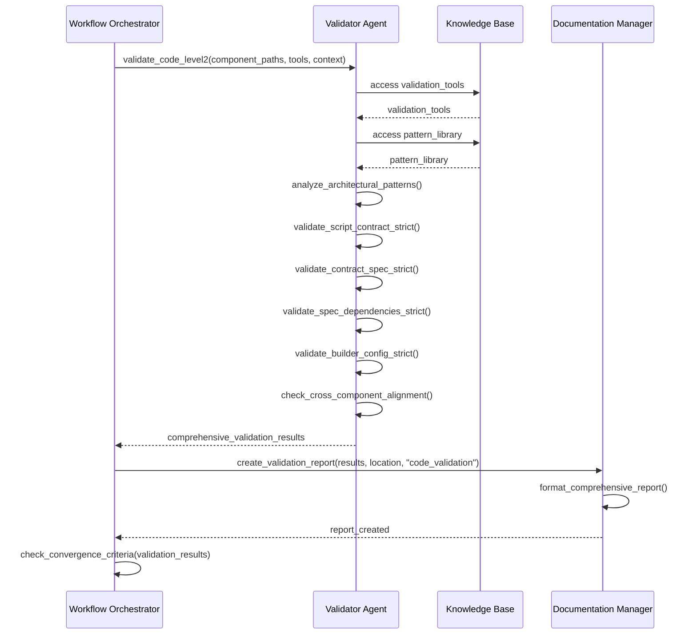

---
tags:
  - design
  - mcp
  - workflow_implementation
  - sequence_diagrams
  - phase_management
keywords:
  - workflow phases
  - sequence diagrams
  - state transitions
  - convergence criteria
  - human-in-the-loop
topics:
  - workflow implementation
  - phase management
  - state transitions
  - convergence evaluation
language: python
date of note: 2025-08-09
---

# MCP Agentic Workflow Implementation Design

## Overview

This document defines the detailed workflow implementation for the MCP-based agentic system, including phase sequences, state transitions, convergence criteria, and human-in-the-loop integration patterns.

## Related Documents

### Master Design
- [MCP Agentic Workflow Master Design](mcp_agentic_workflow_master_design.md) - Complete system overview

### Related Components
- [MCP Server Architecture Design](mcp_agentic_workflow_server_architecture.md) - Server specifications and tools
- [MCP Agent Integration Design](mcp_agentic_workflow_agent_integration.md) - Agent coordination patterns
- [MCP Validation Framework Design](mcp_agentic_workflow_validation_framework.md) - Validation system details

## Workflow Phases Overview

The MCP agentic workflow consists of two main phases with multiple steps each:

### Phase 1: Plan Development and Validation
1. **Initial Planning** - Requirements analysis and plan generation
2. **Plan Validation** - LLM-based validation of implementation plan
3. **Plan Revision** - Iterative refinement based on validation feedback
4. **Human Review** - Human approval of validated plan
5. **Phase Transition** - Move to implementation phase

### Phase 2: Code Implementation and Validation
6. **Code Implementation** - Generate all step components from validated plan
7. **Code Validation** - Two-level validation with deterministic tools
8. **Code Refinement** - Fix issues identified by validation
9. **Final Review** - Human approval of validated implementation
10. **Workflow Completion** - Finalize and document completed workflow

## Phase 1: Plan Development and Validation

### Step 1: Initial Planning

#### Sequence Diagram


#### Implementation Details
```python
class InitialPlanningStep:
    def __init__(self, orchestrator, planner_agent, knowledge_base, doc_manager):
        self.orchestrator = orchestrator
        self.planner = planner_agent
        self.knowledge_base = knowledge_base
        self.doc_manager = doc_manager
    
    async def execute(self, workflow_id: str, requirements: str, 
                     step_type: str, doc_location: str) -> dict:
        """Execute initial planning step"""
        
        # Initialize workflow state
        workflow_state = await self.orchestrator.initialize_workflow_state(
            workflow_id, requirements, step_type, doc_location
        )
        
        # Generate implementation plan
        plan_result = await self.planner.create_implementation_plan(
            requirements=requirements,
            step_type=step_type,
            design_patterns=await self._get_relevant_patterns(step_type),
            documentation_location=doc_location,
            workflow_context=workflow_state
        )
        
        # Create plan document
        doc_result = await self.doc_manager.create_plan_document(
            plan_content=plan_result["plan"],
            document_location=f"{doc_location}/implementation_plan.md",
            yaml_metadata=await self._generate_plan_metadata(plan_result),
            version_info={"version": "1.0", "iteration": 1}
        )
        
        # Update workflow state
        await self.orchestrator.update_workflow_state(
            workflow_id, "plan_created", {
                "plan": plan_result["plan"],
                "document_path": doc_result["document_path"],
                "creation_timestamp": datetime.utcnow().isoformat()
            }
        )
        
        return {
            "status": "success",
            "plan": plan_result["plan"],
            "document_path": doc_result["document_path"],
            "next_step": "plan_validation"
        }
    
    async def _get_relevant_patterns(self, step_type: str) -> list:
        """Get design patterns relevant to step type"""
        pattern_mapping = {
            "Processing": ["processing_step_builder_patterns"],
            "Training": ["training_step_builder_patterns"],
            "Transform": ["transform_step_builder_patterns"],
            "CreateModel": ["createmodel_step_builder_patterns"]
        }
        return pattern_mapping.get(step_type, [])
    
    async def _generate_plan_metadata(self, plan_result: dict) -> dict:
        """Generate YAML metadata for plan document"""
        return {
            "tags": ["implementation_plan", "agentic_workflow"],
            "step_type": plan_result.get("step_type"),
            "creation_date": datetime.utcnow().isoformat(),
            "status": "draft",
            "validation_status": "pending"
        }
```

### Step 2: Plan Validation

#### Sequence Diagram


#### Validation Criteria
```python
class PlanValidationCriteria:
    """Convergence criteria for plan validation phase"""
    
    CONVERGENCE_THRESHOLDS = {
        "alignment_score": 9,      # Out of 10
        "standardization_score": 8, # Out of 10
        "compatibility_score": 8,   # Out of 10
        "critical_issues": 0,       # Must be zero
        "max_iterations": 5,        # Maximum revision iterations
        "human_approval_required": True
    }
    
    def evaluate_convergence(self, validation_results: dict, 
                           iteration_count: int) -> dict:
        """Evaluate if plan validation has converged"""
        
        scores = validation_results.get("scores", {})
        issues = validation_results.get("issues", {})
        
        convergence_status = {
            "converged": True,
            "reasons": [],
            "next_action": "proceed"
        }
        
        # Check alignment score
        if scores.get("alignment_score", 0) < self.CONVERGENCE_THRESHOLDS["alignment_score"]:
            convergence_status["converged"] = False
            convergence_status["reasons"].append("alignment_score_below_threshold")
        
        # Check standardization score
        if scores.get("standardization_score", 0) < self.CONVERGENCE_THRESHOLDS["standardization_score"]:
            convergence_status["converged"] = False
            convergence_status["reasons"].append("standardization_score_below_threshold")
        
        # Check critical issues
        if issues.get("critical", 0) > self.CONVERGENCE_THRESHOLDS["critical_issues"]:
            convergence_status["converged"] = False
            convergence_status["reasons"].append("critical_issues_present")
        
        # Check iteration limit
        if iteration_count >= self.CONVERGENCE_THRESHOLDS["max_iterations"]:
            convergence_status["converged"] = False
            convergence_status["next_action"] = "human_escalation"
            convergence_status["reasons"].append("max_iterations_reached")
        
        return convergence_status
```

### Steps 3-5: Iterative Plan Revision

#### Sequence Diagram


#### Human Interaction Types
```python
class HumanInteractionManager:
    """Manage different types of human interactions"""
    
    INTERACTION_TYPES = {
        "approval": {
            "timeout_seconds": 3600,  # 1 hour
            "response_options": ["approve", "request_changes", "reject"],
            "context_required": ["plan_summary", "validation_results", "recommendations"]
        },
        "feedback": {
            "timeout_seconds": 1800,  # 30 minutes
            "response_format": "structured_feedback",
            "context_required": ["validation_issues", "current_plan", "revision_history"]
        },
        "clarification": {
            "timeout_seconds": 900,   # 15 minutes
            "response_format": "question_answers",
            "context_required": ["ambiguous_requirements", "clarification_questions"]
        }
    }
    
    async def create_interaction(self, workflow_id: str, interaction_type: str, 
                               context: dict) -> dict:
        """Create human interaction request"""
        
        interaction_config = self.INTERACTION_TYPES[interaction_type]
        
        interaction_request = {
            "workflow_id": workflow_id,
            "interaction_id": str(uuid.uuid4()),
            "type": interaction_type,
            "context": self._prepare_context(context, interaction_config["context_required"]),
            "timeout_at": datetime.utcnow() + timedelta(seconds=interaction_config["timeout_seconds"]),
            "status": "pending",
            "created_at": datetime.utcnow().isoformat()
        }
        
        if "response_options" in interaction_config:
            interaction_request["response_options"] = interaction_config["response_options"]
        
        if "response_format" in interaction_config:
            interaction_request["response_format"] = interaction_config["response_format"]
        
        return interaction_request
    
    def _prepare_context(self, context: dict, required_fields: list) -> dict:
        """Prepare context with required fields"""
        prepared_context = {}
        for field in required_fields:
            if field in context:
                prepared_context[field] = context[field]
            else:
                prepared_context[field] = f"Missing: {field}"
        return prepared_context
```

## Phase 2: Code Implementation and Validation

### Step 6: Code Implementation

#### Sequence Diagram


#### Component Generation Strategy
```python
class ComponentGenerationStrategy:
    """Strategy for generating step components"""
    
    COMPONENT_ORDER = [
        "step_specification",    # Define step interface first
        "script_contract",       # Define script interface
        "configuration_class",   # Define configuration structure
        "step_builder",         # Implement step builder
        "processing_script",    # Implement business logic
        "registry_updates"      # Update system registries
    ]
    
    async def generate_all_components(self, plan: dict, step_type: str) -> dict:
        """Generate all components in proper order"""
        
        generated_components = {}
        generation_context = {
            "plan": plan,
            "step_type": step_type,
            "generated_components": generated_components
        }
        
        for component_type in self.COMPONENT_ORDER:
            try:
                component_result = await self._generate_component(
                    component_type, generation_context
                )
                generated_components[component_type] = component_result
                
                # Update context with newly generated component
                generation_context["generated_components"] = generated_components
                
            except Exception as e:
                return {
                    "status": "error",
                    "failed_component": component_type,
                    "error": str(e),
                    "partial_components": generated_components
                }
        
        return {
            "status": "success",
            "components": generated_components,
            "generation_order": self.COMPONENT_ORDER
        }
    
    async def _generate_component(self, component_type: str, context: dict) -> dict:
        """Generate individual component"""
        
        generators = {
            "step_specification": self._generate_step_specification,
            "script_contract": self._generate_script_contract,
            "configuration_class": self._generate_configuration_class,
            "step_builder": self._generate_step_builder,
            "processing_script": self._generate_processing_script,
            "registry_updates": self._generate_registry_updates
        }
        
        generator = generators.get(component_type)
        if not generator:
            raise ValueError(f"Unknown component type: {component_type}")
        
        return await generator(context)
```

### Step 7: Code Validation

#### Sequence Diagram


#### Two-Level Validation Implementation
```python
class TwoLevelValidationSystem:
    """Implementation of two-level validation system"""
    
    def __init__(self, llm_validator, deterministic_validator):
        self.llm_validator = llm_validator
        self.deterministic_validator = deterministic_validator
    
    async def validate_code_comprehensive(self, component_paths: dict, 
                                        pattern_context: dict) -> dict:
        """Perform comprehensive two-level validation"""
        
        validation_results = {
            "level1_results": {},
            "level2_results": {},
            "combined_assessment": {},
            "validation_summary": {}
        }
        
        # Level 1: LLM-based validation
        level1_results = await self.llm_validator.validate_code_level1(
            component_code=await self._load_components(component_paths),
            architectural_patterns=pattern_context.get("patterns", []),
            validation_scope="comprehensive"
        )
        validation_results["level1_results"] = level1_results
        
        # Level 2: Deterministic validation (only if Level 1 passes)
        if level1_results.get("overall_score", 0) >= 7:  # Threshold for Level 2
            level2_results = await self._run_deterministic_validation(
                component_paths, pattern_context
            )
            validation_results["level2_results"] = level2_results
        else:
            validation_results["level2_results"] = {
                "status": "skipped",
                "reason": "level1_score_below_threshold"
            }
        
        # Combine results
        validation_results["combined_assessment"] = self._combine_validation_results(
            level1_results, validation_results["level2_results"]
        )
        
        # Generate summary
        validation_results["validation_summary"] = self._generate_validation_summary(
            validation_results
        )
        
        return validation_results
    
    async def _run_deterministic_validation(self, component_paths: dict, 
                                          pattern_context: dict) -> dict:
        """Run all deterministic validation tools"""
        
        deterministic_results = {}
        
        # Script-Contract alignment
        if "script" in component_paths and "contract" in component_paths:
            deterministic_results["script_contract"] = await self.deterministic_validator.validate_script_contract_strict(
                script_path=component_paths["script"],
                contract_path=component_paths["contract"],
                pattern_context=pattern_context
            )
        
        # Contract-Specification alignment
        if "contract" in component_paths and "specification" in component_paths:
            deterministic_results["contract_spec"] = await self.deterministic_validator.validate_contract_spec_strict(
                contract_path=component_paths["contract"],
                spec_path=component_paths["specification"],
                pattern_context=pattern_context
            )
        
        # Specification dependencies
        if "specification" in component_paths:
            deterministic_results["spec_dependencies"] = await self.deterministic_validator.validate_spec_dependencies_strict(
                spec_path=component_paths["specification"],
                pipeline_context=pattern_context.get("pipeline_context", {}),
                dependency_patterns=pattern_context.get("dependency_patterns", [])
            )
        
        # Builder-Configuration alignment
        if "builder" in component_paths and "config" in component_paths:
            deterministic_results["builder_config"] = await self.deterministic_validator.validate_builder_config_strict(
                builder_path=component_paths["builder"],
                config_path=component_paths["config"],
                usage_patterns=pattern_context.get("usage_patterns", [])
            )
        
        # Cross-component alignment
        deterministic_results["cross_component"] = await self.deterministic_validator.check_cross_component_alignment(
            component_set=component_paths,
            alignment_rules=pattern_context.get("alignment_rules", []),
            consistency_checks=pattern_context.get("consistency_checks", [])
        )
        
        return deterministic_results
```

### Steps 8-9: Code Refinement and Convergence

#### Convergence Criteria for Code Phase
```python
class CodeValidationConvergence:
    """Convergence criteria for code validation phase"""
    
    CONVERGENCE_THRESHOLDS = {
        "tool_validation_pass_rate": 100,  # All tools must pass
        "critical_issues": 0,              # No critical issues
        "minor_issues": 2,                 # Max 2 minor issues
        "test_coverage": 85,               # Minimum test coverage
        "max_iterations": 3,               # Maximum refinement iterations
        "human_approval_required": True
    }
    
    def evaluate_code_convergence(self, validation_results: dict, 
                                iteration_count: int) -> dict:
        """Evaluate if code validation has converged"""
        
        level2_results = validation_results.get("level2_results", {})
        
        convergence_status = {
            "converged": True,
            "reasons": [],
            "next_action": "proceed"
        }
        
        # Check tool validation pass rate
        tool_results = level2_results.get("deterministic_results", {})
        passed_tools = sum(1 for result in tool_results.values() 
                          if result.get("status") == "passed")
        total_tools = len(tool_results)
        pass_rate = (passed_tools / total_tools * 100) if total_tools > 0 else 0
        
        if pass_rate < self.CONVERGENCE_THRESHOLDS["tool_validation_pass_rate"]:
            convergence_status["converged"] = False
            convergence_status["reasons"].append("tool_validation_failures")
        
        # Check critical issues
        issues = validation_results.get("combined_assessment", {}).get("issues", {})
        if issues.get("critical", 0) > self.CONVERGENCE_THRESHOLDS["critical_issues"]:
            convergence_status["converged"] = False
            convergence_status["reasons"].append("critical_issues_present")
        
        # Check iteration limit
        if iteration_count >= self.CONVERGENCE_THRESHOLDS["max_iterations"]:
            convergence_status["converged"] = False
            convergence_status["next_action"] = "human_escalation"
            convergence_status["reasons"].append("max_iterations_reached")
        
        return convergence_status
```

## Workflow State Management

### State Transition Model
```python
class WorkflowStateManager:
    """Manage workflow state transitions"""
    
    VALID_STATES = [
        "initialized",
        "plan_created",
        "plan_validated",
        "plan_revision_needed",
        "plan_approved",
        "code_implemented",
        "code_validated",
        "code_revision_needed",
        "code_approved",
        "workflow_completed",
        "workflow_failed"
    ]
    
    VALID_TRANSITIONS = {
        "initialized": ["plan_created"],
        "plan_created": ["plan_validated", "workflow_failed"],
        "plan_validated": ["plan_approved", "plan_revision_needed"],
        "plan_revision_needed": ["plan_created", "workflow_failed"],
        "plan_approved": ["code_implemented"],
        "code_implemented": ["code_validated", "workflow_failed"],
        "code_validated": ["code_approved", "code_revision_needed"],
        "code_revision_needed": ["code_implemented", "workflow_failed"],
        "code_approved": ["workflow_completed"],
        "workflow_completed": [],
        "workflow_failed": []
    }
    
    async def transition_state(self, workflow_id: str, current_state: str, 
                             new_state: str, transition_data: dict = None) -> dict:
        """Transition workflow to new state"""
        
        if new_state not in self.VALID_TRANSITIONS.get(current_state, []):
            raise ValueError(f"Invalid transition from {current_state} to {new_state}")
        
        transition_record = {
            "workflow_id": workflow_id,
            "from_state": current_state,
            "to_state": new_state,
            "transition_data": transition_data or {},
            "timestamp": datetime.utcnow().isoformat()
        }
        
        # Persist state transition
        await self._persist_state_transition(transition_record)
        
        # Update workflow state
        await self._update_workflow_state(workflow_id, new_state, transition_data)
        
        return {
            "status": "success",
            "new_state": new_state,
            "transition_record": transition_record
        }
    
    async def get_workflow_status(self, workflow_id: str) -> dict:
        """Get current workflow status"""
        
        workflow_state = await self._load_workflow_state(workflow_id)
        
        return {
            "workflow_id": workflow_id,
            "current_state": workflow_state.get("current_state"),
            "phase": self._determine_phase(workflow_state.get("current_state")),
            "progress": self._calculate_progress(workflow_state),
            "last_updated": workflow_state.get("last_updated"),
            "metadata": workflow_state.get("metadata", {})
        }
    
    def _determine_phase(self, current_state: str) -> str:
        """Determine which phase the workflow is in"""
        phase1_states = ["initialized", "plan_created", "plan_validated", 
                        "plan_revision_needed", "plan_approved"]
        phase2_states = ["code_implemented", "code_validated", 
                        "code_revision_needed", "code_approved"]
        
        if current_state in phase1_states:
            return "Phase1_PlanDevelopment"
        elif current_state in phase2_states:
            return "Phase2_CodeImplementation"
        elif current_state == "workflow_completed":
            return "Completed"
        else:
            return "Failed"
```

## Error Handling and Recovery

### Workflow Recovery Strategies
```python
class WorkflowRecoveryManager:
    """Handle workflow errors and recovery"""
    
    async def handle_workflow_error(self, workflow_id: str, error: Exception, 
                                  context: dict) -> dict:
        """Handle workflow errors with appropriate recovery strategy"""
        
        error_type = type(error).__name__
        recovery_strategy = self._determine_recovery_strategy(error_type, context)
        
        recovery_result = {
            "error_type": error_type,
            "error_message": str(error),
            "recovery_strategy": recovery_strategy,
            "recovery_actions": []
        }
        
        if recovery_strategy == "retry_with_backoff":
            recovery_result["recovery_actions"] = await self._retry_with_backoff(
                workflow_id, context
            )
        elif recovery_strategy == "fallback_to_human":
            recovery_result["recovery_actions"] = await self._fallback_to_human(
                workflow_id, error, context
            )
        elif recovery_strategy == "rollback_and_retry":
            recovery_result["recovery_actions"] = await self._rollback_and_retry(
                workflow_id, context
            )
        elif recovery_strategy == "fail_gracefully":
            recovery_result["recovery_actions"] = await self._fail_gracefully(
                workflow_id, error, context
            )
        
        return recovery_result
    
    def _determine_recovery_strategy(self, error_type: str, context: dict) -> str:
        """Determine appropriate recovery strategy"""
        
        strategy_mapping = {
            "TimeoutError": "retry_with_backoff",
            "ValidationError": "fallback_to_human",
            "NetworkError": "retry_with_backoff",
            "AgentUnavailableError": "rollback_and_retry",
            "CriticalSystemError": "fail_gracefully"
        }
        
        return strategy_mapping.get(error_type, "fallback_to_human")
```

## Conclusion

This workflow implementation design provides a comprehensive framework for executing the MCP-based agentic workflow. The detailed sequence diagrams, state management, and convergence criteria ensure reliable and predictable workflow execution.

The two-phase approach with iterative refinement and human-in-the-loop integration maintains quality while enabling automation. The robust error handling and recovery mechanisms ensure system resilience and graceful degradation when issues occur.

The implementation supports both automated execution and human oversight, providing the flexibility needed for complex pipeline development tasks while maintaining the quality standards required for production systems.
