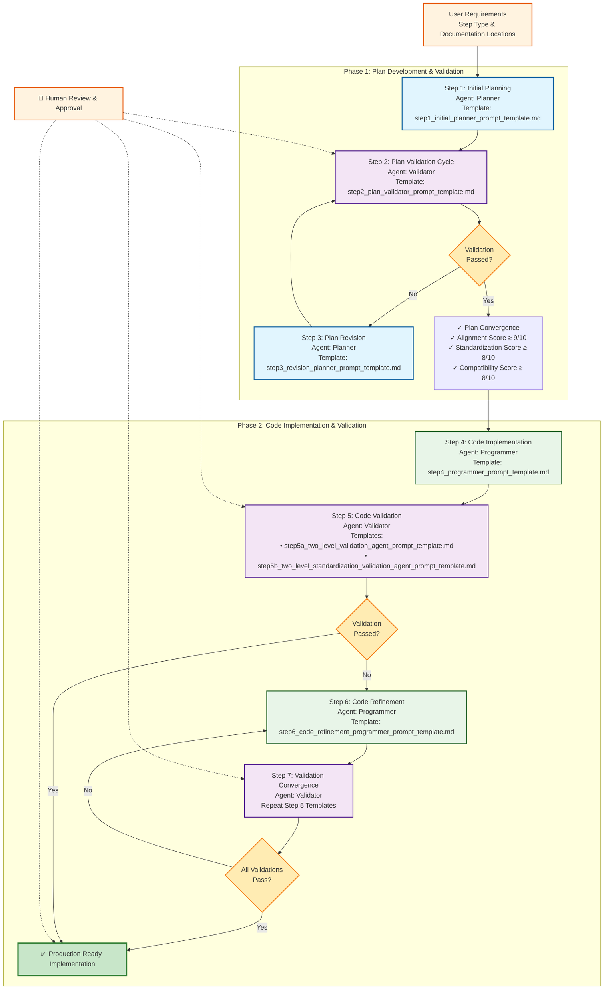

# Agentic ML Pipeline Development Workflow Prompts

This directory contains the specialized prompt templates that power our **7-step agentic workflow** for automated ML pipeline step development. These prompts enable a multi-agent system with human-in-the-loop validation to ensure high-quality, compliant pipeline step implementations.

> **📋 Complete Design Reference**: See [Agentic Workflow Design](../../1_design/agentic_workflow_design.md) for the complete system architecture and detailed specifications.

## 🔄 Agentic Workflow Overview

Our agentic ML pipeline development system employs **four specialized AI agents** working in **two main phases** across **7 structured steps**:

### 🤖 Agent Roles

| Agent | Role | Color Code | Primary Function |
|-------|------|------------|------------------|
| 🎯 **Planner Agent** | Blue | Plan Creation & Revision | Creates and revises implementation plans |
| 🔍 **Validator Agent** | Purple | Quality Assurance | Validates plans and code with adaptive approaches: • **Plan Validation**: Level 1 only (LLM analysis) • **Code Validation**: Two-level (LLM + tools) |
| 💻 **Programmer Agent** | Green | Code Implementation | Generates and refines production-ready code |
| 👤 **Human-in-the-Loop** | Orange | Oversight & Guidance | Provides requirements, reviews, and approvals |

### 📊 Workflow Phases

**Phase 1: Plan Development & Validation** (Steps 1-3)
- Iterative plan creation and validation cycle
- Human guidance on requirements and documentation locations
- Convergence to a validated, implementable plan

**Phase 2: Code Implementation & Validation** (Steps 4-7)
- Code generation based on validated plan
- Two-level code validation with tool integration
- Iterative code refinement until validation passes

### 🗺️ Complete Workflow Diagram

## 📝 Detailed Workflow Steps

### Step 1: Initial Planning 🎯
**Agent**: Planner | **Template**: `step1_initial_planner_prompt_template.md`
- **Input**: User requirements, step type categorization, documentation locations
- **Output**: Initial implementation plan with architectural design
- **Key Features**: Knowledge base integration, design pattern selection, alignment planning

### Step 2: Plan Validation Cycle 🔍
**Agent**: Validator | **Template**: `step2_plan_validator_prompt_template.md`
- **Input**: Implementation plan from Step 1
- **Output**: Validation report with scored assessment
- **Key Features**: **Level 1 validation only** (LLM-based analysis), compatibility analysis, standardization compliance
- **Process**: Iterative validation until convergence criteria met (Alignment ≥9/10, Standardization ≥8/10, Compatibility ≥8/10)
- **Important Note**: Plan validation uses Level 1 only because code-based validation tools cannot be applied without actual program code

### Step 3: Plan Revision 🎯
**Agent**: Planner | **Template**: `step3_revision_planner_prompt_template.md`
- **Input**: Validation report + original plan
- **Output**: Revised implementation plan addressing all issues
- **Key Features**: Issue-driven revision, architectural integrity maintenance
- **Process**: Cycles back to Step 2 until plan convergence is achieved

### Step 4: Code Implementation 💻
**Agent**: Programmer | **Template**: `step4_programmer_prompt_template.md`
- **Input**: Validated implementation plan
- **Output**: Complete code implementation (contracts, specs, builders, scripts)
- **Key Features**: Pattern-driven implementation, alignment enforcement

### Step 5: Code Validation 🔍
**Agent**: Validator | **Templates**: 
- `step5a_two_level_validation_agent_prompt_template.md` (alignment validation)
- `step5b_two_level_standardization_validation_agent_prompt_template.md` (standardization validation)
- **Input**: Generated code implementation
- **Output**: Two-level validation report with tool integration
- **Key Features**: LLM analysis + deterministic tool validation

### Step 6: Code Refinement 💻
**Agent**: Programmer | **Template**: `step6_code_refinement_programmer_prompt_template.md`
- **Input**: Validation report + original code
- **Output**: Refined code addressing all validation issues
- **Key Features**: Validation-driven fixes, pattern preservation

### Step 7: Validation Convergence ✅
**Agent**: Validator | **Process**: Repeat Steps 5-6 until all validations pass
- All tool-based validations pass
- No critical alignment violations
- Production readiness achieved

## 📋 Prompt Template Files

### Step 1: [Initial Planner Prompt Template](step1_initial_planner_prompt_template.md)
- **Agent**: Planner
- **Purpose**: Create an initial implementation plan for a new pipeline step
- **Input**: Step requirements, architectural documentation
- **Output**: Comprehensive implementation plan with all required components
- **Key Focus**: Understanding requirements and designing an architecturally sound approach

### Step 2: [Plan Validator Prompt Template](step2_plan_validator_prompt_template.md)
- **Agent**: Validator
- **Purpose**: Validate implementation plans against architectural standards (Level 1 validation only)
- **Input**: Implementation plan, architectural documentation
- **Output**: Detailed validation report with issues and recommendations
- **Key Focus**: Alignment rules, cross-component compatibility, standardization compliance

### Step 3: [Revision Planner Prompt Template](step3_revision_planner_prompt_template.md)
- **Agent**: Planner
- **Purpose**: Update implementation plans based on validation feedback
- **Input**: Current implementation plan, validation report
- **Output**: Revised implementation plan addressing all issues
- **Key Focus**: Addressing compatibility issues, especially integration with other components

### Step 4: [Programmer Prompt Template](step4_programmer_prompt_template.md)
- **Agent**: Programmer
- **Purpose**: Implement code based on the validated implementation plan
- **Input**: Validated implementation plan, architectural documentation, example implementations
- **Output**: Complete code files in the correct project structure locations
- **Key Focus**: Following the plan precisely while ensuring alignment across components

### Step 5a: [Two-Level Validation Agent Prompt Template](step5a_two_level_validation_agent_prompt_template.md)
- **Agent**: Validator
- **Purpose**: Validate code implementation using two-level validation (LLM + tools)
- **Input**: Implementation code, implementation plan
- **Output**: Comprehensive validation report with tool integration results
- **Key Focus**: Alignment validation with deterministic tool verification

### Step 5b: [Two-Level Standardization Validation Agent Prompt Template](step5b_two_level_standardization_validation_agent_prompt_template.md)
- **Agent**: Validator
- **Purpose**: Validate code standardization using two-level validation (LLM + tools)
- **Input**: Implementation code, standardization requirements
- **Output**: Standardization compliance report with tool results
- **Key Focus**: Naming conventions, interface standards, code quality

### Step 6: [Code Refinement Programmer Prompt Template](step6_code_refinement_programmer_prompt_template.md)
- **Agent**: Programmer
- **Purpose**: Refine code implementation based on validation feedback
- **Input**: Validation report, original code implementation
- **Output**: Refined code addressing all validation issues
- **Key Focus**: Validation-driven fixes while preserving architectural integrity

## Priority Assessment Areas

All validation prompts focus on these key areas, with special emphasis on:

1. **Alignment Rules Adherence** (40% weight)
   - Contract-to-specification alignment
   - Script-to-contract alignment
   - Builder-to-configuration alignment
   - Property path correctness

2. **Cross-Component Compatibility** (30% weight)
   - Dependency resolver compatibility scores
   - Output to input type matching
   - Logical name consistency
   - Semantic keyword effectiveness

3. **Standardization Rules Compliance** (30% weight)
   - Naming conventions
   - Interface standardization
   - Documentation standards
   - Error handling standards

## Example Usage

A typical workflow might proceed as:

1. **Initial Planning**: Requirements provided to the Planner Agent
2. **Plan Validation Cycle**: Implementation plan validated iteratively until convergence
3. **Plan Revision**: Any issues addressed through revision cycles
4. **Code Implementation**: Approved plan implemented by Programmer Agent
5. **Code Validation**: Implementation validated using two-level validation approach
6. **Code Refinement**: Any validation issues fixed through refinement cycles
7. **Validation Convergence**: Final validation ensures production readiness

This streamlined approach ensures high-quality, compatible pipeline components that integrate seamlessly into the existing architecture while eliminating redundant validation steps.
