# Agentic ML Pipeline Development Workflow Prompts

This directory contains the specialized prompt templates that power our **9-step agentic workflow** for automated ML pipeline step development. These prompts enable a multi-agent system with human-in-the-loop validation to ensure high-quality, compliant pipeline step implementations.

> **📋 Complete Design Reference**: See [Agentic Workflow Design](../../1_design/agentic_workflow_design.md) for the complete system architecture and detailed specifications.

## 🔄 Agentic Workflow Overview

Our agentic ML pipeline development system employs **four specialized AI agents** working in **two main phases** across **9 structured steps**:

### 🤖 Agent Roles

| Agent | Role | Color Code | Primary Function |
|-------|------|------------|------------------|
| 🎯 **Planner Agent** | Blue | Plan Creation & Revision | Creates and revises implementation plans |
| 🔍 **Validator Agent** | Purple | Quality Assurance | Validates plans and code using two-level validation |
| 💻 **Programmer Agent** | Green | Code Implementation | Generates and refines production-ready code |
| 👤 **Human-in-the-Loop** | Orange | Oversight & Guidance | Provides requirements, reviews, and approvals |

### 📊 Workflow Phases

**Phase 1: Plan Development & Validation** (Steps 1-5)
- Iterative plan creation and validation
- Human guidance on requirements and documentation locations
- Convergence to a validated, implementable plan

**Phase 2: Code Implementation & Validation** (Steps 6-9)
- Code generation based on validated plan
- Two-level code validation with tool integration
- Iterative code refinement until validation passes

### 🗺️ Complete Workflow Diagram

```mermaid
flowchart TD
    %% User Input
    A[User Requirements<br/>Step Type & Documentation Locations] --> B[Step 1: Initial Planning]
    
    %% Phase 1: Plan Development and Validation
    subgraph Phase1 ["Phase 1: Plan Development & Validation"]
        B[Step 1: Initial Planning<br/>Agent: Planner<br/>Template: initial_planner_prompt_template.md] --> C[Step 2: Plan Validation<br/>Agent: Validator<br/>Template: plan_validator_prompt_template.md]
        
        C --> D{Validation<br/>Passed?}
        D -->|No| E[Step 3: Plan Revision<br/>Agent: Planner<br/>Template: revision_planner_prompt_template.md]
        E --> F[Step 4: Iterative Validation<br/>Agent: Validator<br/>Template: plan_validator_prompt_template.md]
        F --> G{All Issues<br/>Resolved?}
        G -->|No| E
        G -->|Yes| H[Step 5: Plan Convergence<br/>✓ Alignment Score ≥ 9/10<br/>✓ Standardization Score ≥ 8/10<br/>✓ Compatibility Score ≥ 8/10]
        D -->|Yes| H
    end
    
    %% Phase 2: Code Implementation and Validation
    subgraph Phase2 ["Phase 2: Code Implementation & Validation"]
        H --> I[Step 6: Code Implementation<br/>Agent: Programmer<br/>Template: programmer_prompt_template.md]
        
        I --> J[Step 7: Code Validation<br/>Agent: Validator<br/>Templates:<br/>• two_level_validation_agent_prompt_template.md<br/>• two_level_standardization_validation_agent_prompt_template.md]
        
        J --> K{Validation<br/>Passed?}
        K -->|No| L[Step 8: Code Refinement<br/>Agent: Programmer<br/>Template: code_refinement_programmer_prompt_template.md]
        L --> M[Step 9: Validation Convergence<br/>Agent: Validator<br/>Repeat Step 7 Templates]
        M --> N{All Validations<br/>Pass?}
        N -->|No| L
        N -->|Yes| O[✅ Production Ready Implementation]
        K -->|Yes| O
    end
    
    %% Human-in-the-Loop Integration
    P[👤 Human Review & Approval] -.-> C
    P -.-> F
    P -.-> J
    P -.-> M
    P -.-> O
    
    %% Styling
    classDef plannerAgent fill:#e1f5fe,stroke:#01579b,stroke-width:2px
    classDef validatorAgent fill:#f3e5f5,stroke:#4a148c,stroke-width:2px
    classDef programmerAgent fill:#e8f5e8,stroke:#1b5e20,stroke-width:2px
    classDef userInput fill:#fff3e0,stroke:#e65100,stroke-width:2px
    classDef decision fill:#ffecb3,stroke:#f57f17,stroke-width:2px
    classDef success fill:#c8e6c9,stroke:#2e7d32,stroke-width:3px
    classDef phase fill:#f5f5f5,stroke:#424242,stroke-width:2px,stroke-dasharray: 5 5
    
    class B,E plannerAgent
    class C,F,J,M validatorAgent
    class I,L programmerAgent
    class A,P userInput
    class D,G,K,N decision
    class O success
```

## 📝 Detailed Workflow Steps

### Step 1: Initial Planning 🎯
**Agent**: Planner | **Template**: `initial_planner_prompt_template.md`
- **Input**: User requirements, step type categorization, documentation locations
- **Output**: Initial implementation plan with architectural design
- **Key Features**: Knowledge base integration, design pattern selection, alignment planning

### Step 2: Plan Validation 🔍
**Agent**: Validator | **Template**: `plan_validator_prompt_template.md`
- **Input**: Implementation plan from Step 1
- **Output**: Validation report with scored assessment
- **Key Features**: Two-level validation, compatibility analysis, standardization compliance

### Step 3: Plan Revision 🎯
**Agent**: Planner | **Template**: `revision_planner_prompt_template.md`
- **Input**: Validation report + original plan
- **Output**: Revised implementation plan addressing all issues
- **Key Features**: Issue-driven revision, architectural integrity maintenance

### Step 4: Iterative Validation 🔍
**Agent**: Validator | **Template**: `plan_validator_prompt_template.md` (repeat)
- **Process**: Repeat validation until convergence criteria met
- **Convergence**: Alignment ≥9/10, Standardization ≥8/10, Compatibility ≥8/10

### Step 5: Plan Convergence ✅
**Process**: Plan approval and readiness for implementation
- All critical issues resolved
- Quality metrics meet targets
- Human approval obtained

### Step 6: Code Implementation 💻
**Agent**: Programmer | **Template**: `programmer_prompt_template.md`
- **Input**: Validated implementation plan
- **Output**: Complete code implementation (contracts, specs, builders, scripts)
- **Key Features**: Pattern-driven implementation, alignment enforcement

### Step 7: Code Validation 🔍
**Agent**: Validator | **Templates**: 
- `two_level_validation_agent_prompt_template.md` (alignment validation)
- `two_level_standardization_validation_agent_prompt_template.md` (standardization validation)
- **Input**: Generated code implementation
- **Output**: Two-level validation report with tool integration
- **Key Features**: LLM analysis + deterministic tool validation

### Step 8: Code Refinement 💻
**Agent**: Programmer | **Template**: `code_refinement_programmer_prompt_template.md`
- **Input**: Validation report + original code
- **Output**: Refined code addressing all validation issues
- **Key Features**: Validation-driven fixes, pattern preservation

### Step 9: Validation Convergence ✅
**Process**: Repeat Steps 7-8 until all validations pass
- All tool-based validations pass
- No critical alignment violations
- Production readiness achieved

## 📋 Prompt Template Files

### [Initial Planner Prompt](initial_planner_prompt.md)
- **Purpose**: Create an initial implementation plan for a new pipeline step
- **Input**: Step requirements, architectural documentation
- **Output**: Comprehensive implementation plan with all required components
- **Key Focus**: Understanding requirements and designing an architecturally sound approach

### [Plan Validator Prompt](plan_validator_prompt.md)
- **Purpose**: Validate implementation plans against architectural standards
- **Input**: Implementation plan, architectural documentation
- **Output**: Detailed validation report with issues and recommendations
- **Key Focus**: Alignment rules, cross-component compatibility, standardization compliance

### [Revision Planner Prompt](revision_planner_prompt.md)
- **Purpose**: Update implementation plans based on validation feedback
- **Input**: Current implementation plan, validation report
- **Output**: Revised implementation plan addressing all issues
- **Key Focus**: Addressing compatibility issues, especially integration with other components

### [Programmer Prompt](programmer_prompt.md)
- **Purpose**: Implement code based on the validated implementation plan
- **Input**: Validated implementation plan, architectural documentation, example implementations
- **Output**: Complete code files in the correct project structure locations
- **Key Focus**: Following the plan precisely while ensuring alignment across components

### [Validator Prompt](validator_prompt.md)
- **Purpose**: Validate code implementation against architectural standards
- **Input**: Implementation code, implementation plan
- **Output**: Detailed validation report with issues and recommendations
- **Key Focus**: Verifying alignment across all components, cross-component compatibility

## Priority Assessment Areas

All validation prompts focus on these key areas, with special emphasis on:

1. **Alignment Rules Adherence** (40% weight)
   - Contract-to-specification alignment
   - Script-to-contract alignment
   - Builder-to-configuration alignment
   - Property path correctness

2. **Cross-Component Compatibility** (30% weight)
   - Dependency resolver compatibility scores
   - Output to input type matching
   - Logical name consistency
   - Semantic keyword effectiveness

3. **Standardization Rules Compliance** (30% weight)
   - Naming conventions
   - Interface standardization
   - Documentation standards
   - Error handling standards

## Example Usage

A typical workflow might proceed as:

1. Initial requirements provided to the Initial Planner
2. Implementation plan created and passed to Plan Validator
3. Validation report identifies issues in cross-component compatibility
4. Implementation plan sent to Revision Planner with validation report
5. Revised plan created with fixes for compatibility issues
6. Revised plan validated and approved by Plan Validator
7. Approved plan implemented by Programmer
8. Implementation validated by Validator
9. Any implementation issues fixed by Programmer
10. Final implementation approved for production use

This approach ensures high-quality, compatible pipeline components that integrate seamlessly into the existing architecture.
