---
tags:
  - llm_developer
  - workflow_orchestrator
  - documentation
  - agentic_workflow
keywords:
  - workflow orchestration
  - automation
  - agent coordination
  - end-to-end execution
topics:
  - workflow orchestrator
  - agentic automation
  - system documentation
language: python
date of note: 2025-09-05
---

# Workflow Orchestrator

## Overview

The **Workflow Orchestrator** is a new LLM agentic role designed to enable fully automated end-to-end execution of the 7-step agentic ML pipeline development workflow. It serves as the central coordination agent that makes intelligent decisions about phase transitions, agent invocations, and step sequencing to ensure seamless workflow automation.

## Purpose

The Workflow Orchestrator addresses the need for **complete workflow automation** by:

1. **Phase Management**: Automatically determining the current workflow phase and managing transitions
2. **Agent Coordination**: Intelligently selecting and invoking the appropriate agents (Planner, Validator, Programmer)
3. **Template Selection**: Choosing the correct prompt templates based on workflow context
4. **Step Sequencing**: Determining the next logical step in the workflow progression
5. **Decision Automation**: Making autonomous decisions based on validation results and convergence criteria
6. **Human Integration**: Coordinating human-in-the-loop interactions at critical decision points

## Architecture Integration

### Position in the Agentic Ecosystem

```mermaid
graph TD
    WO[🎛️ Workflow Orchestrator<br/>Central Coordination] --> PA[🎯 Planner Agent<br/>Plan Creation & Revision]
    WO --> VA[🔍 Validator Agent<br/>Quality Assurance]
    WO --> PR[💻 Programmer Agent<br/>Code Implementation]
    WO --> H[👤 Human-in-the-Loop<br/>Oversight & Approval]
    
    PA --> KB[📚 Knowledge Base<br/>Documentation & Examples]
    VA --> KB
    PR --> KB
    
    classDef orchestrator fill:#ff9999,stroke:#333,stroke-width:3px
    classDef agent fill:#99ccff,stroke:#333,stroke-width:2px
    classDef human fill:#fff3e0,stroke:#e65100,stroke-width:2px
    classDef knowledge fill:#99ff99,stroke:#333,stroke-width:2px
    
    class WO orchestrator
    class PA,VA,PR agent
    class H human
    class KB knowledge
```



### Enhanced 5-Agent System

The Workflow Orchestrator transforms the original 4-agent system into a **5-agent system**:

| Agent | Role | Color Code | Primary Function |
|-------|------|------------|------------------|
| 🎛️ **Workflow Orchestrator** | Red | Central Coordination | Manages workflow execution, phase transitions, and agent coordination |
| 🎯 **Planner Agent** | Blue | Plan Creation & Revision | Creates and revises implementation plans |
| 🔍 **Validator Agent** | Purple | Quality Assurance | Validates plans and code with adaptive approaches |
| 💻 **Programmer Agent** | Green | Code Implementation | Generates and refines production-ready code |
| 👤 **Human-in-the-Loop** | Orange | Oversight & Guidance | Provides requirements, reviews, and approvals |

## Core Capabilities

### 1. Intelligent Phase Management

The orchestrator automatically manages the two main workflow phases:

**Phase 1: Plan Development & Validation (Steps 1-3)**
- Monitors plan creation and validation cycles
- Tracks convergence criteria (Alignment ≥9/10, Standardization ≥8/10, Compatibility ≥8/10)
- Manages iterative revision loops until convergence

**Phase 2: Code Implementation & Validation (Steps 4-7)**
- Oversees code generation and validation cycles
- Coordinates two-level validation (LLM + deterministic tools)
- Manages refinement loops until all validations pass

### 2. Dynamic Agent Selection

The orchestrator intelligently selects agents based on workflow context:

```python
# Example agent selection logic
step_to_agent_mapping = {
    1: "planner",     # Initial planning
    2: "validator",   # Plan validation
    3: "planner",     # Plan revision
    4: "programmer",  # Code implementation
    5: "validator",   # Code validation (two-level)
    6: "programmer",  # Code refinement
    7: "validator"    # Validation convergence
}
```

### 3. Template Selection Automation

Automatically selects the appropriate prompt template for each step:

- **Step 1**: `step1_initial_planner_prompt_template.md`
- **Step 2**: `step2_plan_validator_prompt_template.md`
- **Step 3**: `step3_revision_planner_prompt_template.md`
- **Step 4**: `step4_programmer_prompt_template.md`
- **Step 5**: `step5a_two_level_validation_agent_prompt_template.md` + `step5b_two_level_standardization_validation_agent_prompt_template.md`
- **Step 6**: `step6_code_refinement_programmer_prompt_template.md`
- **Step 7**: Repeat Step 5 templates for validation convergence

### 4. Workflow State Management

Maintains comprehensive workflow state including:

- Current phase and step
- Step execution history
- Validation scores and convergence status
- Human approval status
- Workspace context (shared vs isolated development)

### 5. Decision Automation

Makes autonomous decisions based on:

- **Validation Scores**: Automatic phase transitions when convergence criteria are met
- **Error Conditions**: Intelligent retry and recovery strategies
- **Loop Management**: Prevents infinite loops while allowing necessary iterations
- **Human Escalation**: Knows when to request human intervention

## Usage Examples

### Example 1: Workflow Initialization

```json
{
  "input": {
    "requirements": "Create a new data preprocessing step for tabular data",
    "workspace_type": "shared",
    "documentation_locations": ["slipbox/0_developer_guide/", "src/cursus/steps/"]
  },
  "orchestrator_decision": {
    "action_type": "invoke_agent",
    "target_agent": "planner",
    "template_to_use": "step1_initial_planner_prompt_template.md",
    "step_number": 1
  }
}
```

### Example 2: Phase Transition

```json
{
  "input": {
    "validation_scores": {
      "alignment_score": 9.2,
      "standardization_score": 8.5,
      "compatibility_score": 8.8
    }
  },
  "orchestrator_decision": {
    "action_type": "transition_phase",
    "target_agent": "programmer",
    "template_to_use": "step4_programmer_prompt_template.md",
    "step_number": 4,
    "rationale": "All validation scores exceed thresholds - ready for implementation"
  }
}
```

### Example 3: Error Recovery

```json
{
  "input": {
    "agent_error": {
      "agent": "validator",
      "step": 5,
      "error_type": "validation_timeout"
    }
  },
  "orchestrator_decision": {
    "action_type": "retry_with_recovery",
    "target_agent": "validator",
    "template_to_use": "step5a_two_level_validation_agent_prompt_template.md",
    "recovery_strategy": "extended_timeout",
    "step_number": 5
  }
}
```

## Integration with Existing System

### Backward Compatibility

The Workflow Orchestrator is designed to work seamlessly with the existing prompt templates and agent roles:

- **No Changes Required**: Existing prompt templates remain unchanged
- **Enhanced Automation**: Adds orchestration layer without modifying agent behavior
- **Gradual Adoption**: Can be introduced incrementally alongside manual workflow execution

### MCP Integration

Designed to integrate with the MCP (Model Context Protocol) architecture:

- **MCP Server**: Can be deployed as a dedicated MCP server
- **Tool Integration**: Provides tools for workflow state management and agent coordination
- **Resource Sharing**: Integrates with shared knowledge base and documentation resources

## Benefits

### 1. Full Automation
- **End-to-End Execution**: Complete workflow automation from requirements to production-ready code
- **Reduced Manual Intervention**: Minimizes need for manual step-by-step execution
- **Consistent Execution**: Ensures consistent workflow execution across different scenarios

### 2. Intelligent Decision Making
- **Context-Aware Decisions**: Makes decisions based on full workflow context
- **Adaptive Behavior**: Adjusts behavior based on validation results and error conditions
- **Optimal Path Selection**: Chooses the most efficient path through the workflow

### 3. Quality Assurance
- **Convergence Enforcement**: Ensures quality standards are met before phase transitions
- **Error Prevention**: Prevents common workflow execution errors
- **Human Oversight**: Maintains human control at critical decision points

### 4. Scalability
- **Parallel Execution**: Can manage multiple concurrent workflows
- **Resource Optimization**: Optimizes agent utilization and resource allocation
- **Performance Monitoring**: Tracks workflow performance and identifies bottlenecks

## Implementation Considerations

### 1. State Persistence
- Workflow state must be persisted to handle system failures and restarts
- State recovery mechanisms needed for robust operation

### 2. Error Handling
- Comprehensive error handling for agent failures and timeout conditions
- Escalation procedures for critical errors requiring human intervention

### 3. Performance Monitoring
- Metrics collection for workflow execution times and success rates
- Performance optimization based on execution patterns

### 4. Security
- Access control for workflow execution and state modification
- Audit logging for compliance and debugging

## Future Enhancements

### 1. Machine Learning Integration
- **Predictive Analytics**: Predict workflow outcomes based on historical data
- **Optimization**: Optimize workflow paths based on success patterns
- **Anomaly Detection**: Detect unusual workflow patterns and potential issues

### 2. Advanced Orchestration
- **Parallel Execution**: Execute independent workflow steps in parallel
- **Resource Scheduling**: Optimize resource allocation across multiple workflows
- **Load Balancing**: Distribute workload across multiple agent instances

### 3. Enhanced Human Integration
- **Smart Notifications**: Intelligent notification system for human approvals
- **Context-Rich Interfaces**: Provide rich context for human decision making
- **Approval Workflows**: Configurable approval workflows for different scenarios

## Related Documentation

- **[Workflow Orchestrator Prompt Template](workflow_orchestrator_prompt_template.md)**: Complete prompt template for the orchestrator agent
- **[Developer Prompt Templates](../developer_prompt_templates/README.md)**: Original 7-step workflow documentation
- **[MCP Agentic Workflow Master Design](../../1_design/mcp_agentic_workflow_master_design.md)**: Complete system architecture
- **[Agent Integration Design](../../1_design/mcp_agentic_workflow_agent_integration.md)**: Agent coordination patterns

## Conclusion

The Workflow Orchestrator represents a significant advancement in agentic workflow automation, enabling fully automated end-to-end execution of complex ML pipeline development workflows while maintaining high quality standards and appropriate human oversight. It transforms the existing 4-agent system into a more powerful and autonomous 5-agent system capable of handling complete workflow automation.
