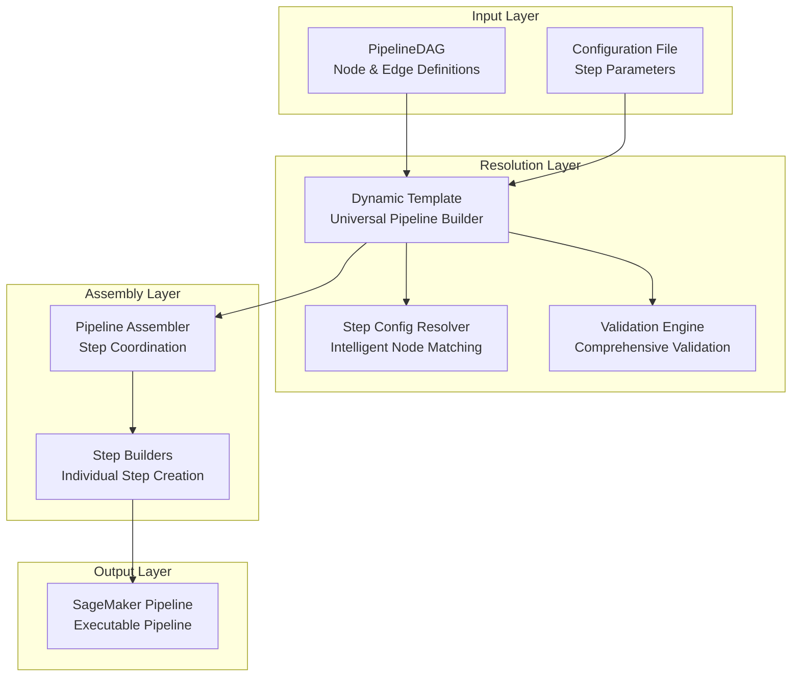
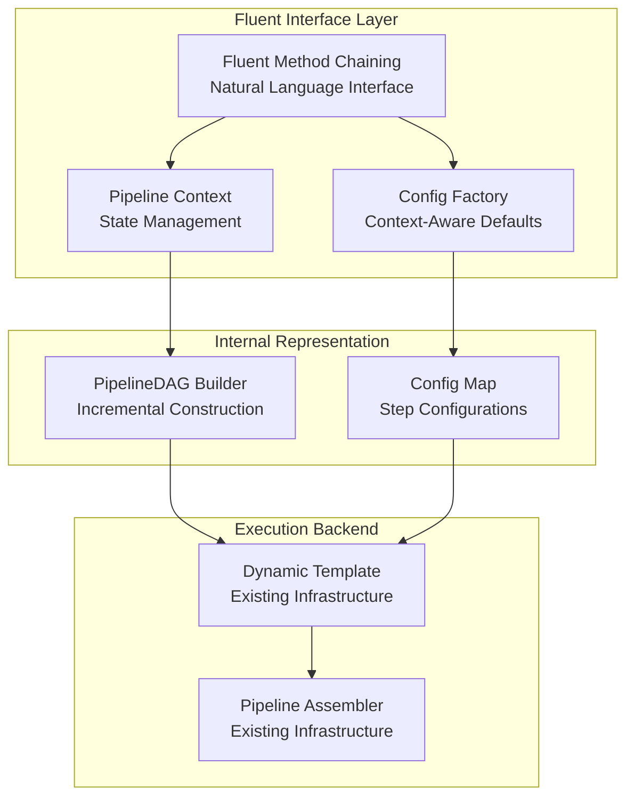

---
tags:
  - analysis
  - design
  - fluent_api
  - dag_compiler
  - integration
keywords:
  - fluent API
  - DAG compiler
  - dynamic template
  - pipeline assembler
  - method chaining
  - architectural integration
  - user experience
  - developer interface
topics:
  - API design comparison
  - architectural integration
  - pipeline construction
  - developer experience
language: python
date of note: 2025-08-12
---

# Fluent API and DAG Compiler Integration Analysis

## Executive Summary

This analysis examines the relationship between the proposed Fluent API design and the existing DAG compiler architecture, evaluating how these two approaches can complement each other to create a comprehensive pipeline construction ecosystem. The analysis reveals that rather than competing solutions, these represent complementary interfaces to the same underlying infrastructure, with significant opportunities for synergistic integration.

## Current DAG Compiler Architecture

### Core Components

The existing DAG compiler system consists of several sophisticated components working together:

#### 1. Dynamic Template System
- **Purpose**: Universal pipeline template that works with any DAG structure
- **Key Features**: Automatic config class detection, intelligent node-to-config resolution, comprehensive validation
- **Implementation**: `DynamicPipelineTemplate` class extending `PipelineTemplateBase`

#### 2. Step Config Resolver
- **Purpose**: Intelligent mapping between DAG nodes and configuration objects
- **Resolution Strategies** (in priority order):
  1. Direct name matching (confidence: 1.0)
  2. Enhanced job type matching (confidence: 0.8-0.9)
  3. Semantic similarity matching (confidence: 0.5-0.8)
  4. Pattern-based matching (confidence: 0.6-0.9)

#### 3. Pipeline Assembler
- **Purpose**: Orchestrates step creation using DAG topology and dependency resolution
- **Key Features**: Specification-based dependency resolution, intelligent step connection, comprehensive validation

#### 4. Validation Engine
- **Purpose**: Comprehensive validation of pipeline configurations
- **Validation Checks**: DAG node coverage, builder availability, configuration validity, dependency resolution

### Current Workflow



### Strengths of Current Architecture

1. **Universal Compatibility**: Works with any DAG structure without modification
2. **Intelligent Resolution**: Multiple strategies ensure successful node-to-config matching
3. **Comprehensive Validation**: Thorough validation before execution
4. **Sophisticated Error Handling**: Detailed diagnostics and error reporting
5. **Metadata Integration**: Automatic handling of pipeline metadata
6. **Production Ready**: Mature, tested implementation

### Limitations of Current Architecture

1. **User Experience**: Requires manual DAG construction and configuration file management
2. **Learning Curve**: Complex for new users to understand DAG + config paradigm
3. **Verbosity**: Requires significant boilerplate for simple pipelines
4. **IDE Support**: Limited IntelliSense and type safety during construction
5. **Error Prevention**: Errors only caught at compilation time, not construction time

## Proposed Fluent API Design

### Core Concept

The Fluent API provides a natural language-like interface for pipeline construction through method chaining:

```python
pipeline = (Pipeline("fraud-detection")
    .load_data("s3://data/")
    .preprocess()
    .train_xgboost(max_depth=6)
    .evaluate()
    .deploy_if_performance_threshold(min_accuracy=0.85))
```

### Key Features

#### 1. Natural Language Construction
- Method names mirror ML workflow terminology
- Intuitive parameter passing through method arguments
- Context flows naturally through the chain

#### 2. Progressive Disclosure of Complexity
```python
# Level 1 - Simple
pipeline = Pipeline("quick-model").auto_train_xgboost("s3://data/")

# Level 2 - Configured  
pipeline = (Pipeline("configured-model")
    .load_data("s3://data/")
    .train_xgboost(max_depth=6, n_estimators=100))

# Level 3 - Advanced
pipeline = (Pipeline("advanced-model")
    .load_data("s3://data/", validation_schema=schema)
    .preprocess(custom_transformers=[...])
    .train_xgboost(hyperparameter_tuning=True))
```

#### 3. Context-Aware Configuration
```python
pipeline = (Pipeline("classification-model")
    .for_classification_task()  # Sets context
    .load_tabular_data("s3://data/")  # Uses classification defaults
    .apply_standard_preprocessing()  # Classification-appropriate preprocessing
    .train_with_hyperparameter_tuning())  # Classification metrics
```

#### 4. Type Safety and IDE Support
- Each method returns typed pipeline objects
- IDE provides IntelliSense for available methods
- Compile-time validation of method sequences

### Fluent API Architecture



## Comparative Analysis

### User Experience Comparison

| Aspect | Current DAG Compiler | Proposed Fluent API |
|--------|---------------------|-------------------|
| **Learning Curve** | Steep - requires understanding DAG + config paradigm | Gentle - natural language methods |
| **Verbosity** | High - separate DAG construction and config files | Low - concise method chaining |
| **IDE Support** | Limited - JSON/YAML configs | Excellent - IntelliSense and type safety |
| **Error Detection** | Compilation time | Construction time (immediate feedback) |
| **Flexibility** | High - any DAG structure possible | Medium-High - guided by available methods |
| **Debugging** | Complex - requires understanding resolution process | Intuitive - clear method chain |

### Technical Capability Comparison

| Capability | Current DAG Compiler | Proposed Fluent API |
|------------|---------------------|-------------------|
| **Pipeline Complexity** | Unlimited - any DAG structure | High - most common patterns covered |
| **Configuration Options** | Complete - full config object control | High - intelligent defaults + overrides |
| **Validation** | Comprehensive - full validation engine | Comprehensive - same validation engine |
| **Extensibility** | High - new step types easily added | Medium - requires new fluent methods |
| **Performance** | Optimized - mature implementation | Good - leverages existing backend |
| **Maintainability** | Medium - complex resolution logic | High - clear separation of concerns |

### Architecture Integration Points

#### 1. Shared Backend Infrastructure
Both approaches can leverage the same execution infrastructure:

```python
class FluentPipeline:
    def execute(self) -> Pipeline:
        """Execute using existing Dynamic Template System"""
        return DynamicPipelineTemplate(
            dag=self.dag,
            config_map=self.configs
        ).build_pipeline()
```

#### 2. Bidirectional Conversion
Enable conversion between representations:

```python
# Fluent to DAG
dag_representation = fluent_pipeline.to_dag()

# DAG to Fluent (where possible)
fluent_pipeline = FluentPipeline.from_dag(dag, configs)
```

#### 3. Hybrid Workflows
Support mixed approaches within the same pipeline:

```python
# Start with fluent API
pipeline = (Pipeline("hybrid-model")
    .load_data("s3://data/")
    .preprocess())

# Export to DAG for complex modifications
dag = pipeline.to_dag()
dag.add_custom_validation_step()

# Import back to fluent API
pipeline = FluentPipeline.from_dag(dag)
pipeline.train_xgboost().deploy()
```

## Integration Strategy

### Phase 1: Fluent API with Dynamic Template Backend

**Objective**: Implement Fluent API as a new interface layer using existing infrastructure

**Implementation**:
```python
class FluentPipeline:
    def __init__(self, name: str):
        self.name = name
        self.dag = PipelineDAG()
        self.configs = {}
        self.context = PipelineContext()
    
    def load_data(self, source: str, **kwargs) -> 'FluentPipeline':
        # Create context-aware config
        config = self._create_data_loading_config(source, **kwargs)
        
        # Add to internal DAG
        step_name = self._generate_step_name("data_loading")
        self.dag.add_node(step_name)
        self.configs[step_name] = config
        
        # Update context
        self.context.last_data_step = step_name
        return self
    
    def execute(self) -> Pipeline:
        # Delegate to existing Dynamic Template
        return DynamicPipelineTemplate(
            dag=self.dag,
            config_map=self.configs
        ).build_pipeline()
```

**Benefits**:
- Minimal new infrastructure required
- Leverages all existing validation and resolution logic
- Consistent behavior between interfaces
- Rapid implementation possible

### Phase 2: Enhanced Integration Features

**Objective**: Add bidirectional conversion and hybrid workflows

**Implementation**:
```python
class FluentPipeline:
    @classmethod
    def from_dag(cls, dag: PipelineDAG, configs: Dict[str, BasePipelineConfig]) -> 'FluentPipeline':
        """Create fluent pipeline from existing DAG"""
        pipeline = cls("imported-pipeline")
        pipeline.dag = dag
        pipeline.configs = configs
        pipeline.context = cls._infer_context_from_dag(dag, configs)
        return pipeline
    
    def to_dag(self) -> Tuple[PipelineDAG, Dict[str, BasePipelineConfig]]:
        """Export to DAG representation"""
        return self.dag, self.configs
    
    def preview_dag(self) -> Dict[str, Any]:
        """Preview DAG structure using Dynamic Template"""
        temp_template = DynamicPipelineTemplate(
            dag=self.dag,
            config_map=self.configs
        )
        return temp_template.get_resolution_preview()
```

### Phase 3: Advanced Features and Optimization

**Objective**: Add advanced fluent features and optimize performance

**Implementation**:
- Conditional pipeline construction
- Template-based pipeline creation
- Performance optimizations
- Advanced type safety

## Synergistic Benefits

### 1. Complementary User Personas

**DAG Compiler**: 
- Advanced users needing maximum flexibility
- Complex pipeline topologies
- Custom step types and configurations
- Integration with external systems

**Fluent API**:
- New users learning ML pipelines
- Common pipeline patterns
- Rapid prototyping and iteration
- Developer productivity focus

### 2. Shared Infrastructure Investment

Both approaches benefit from improvements to:
- Step builders and configurations
- Validation engine enhancements
- New step type additions
- Performance optimizations
- Error handling improvements

### 3. Learning Path Progression

Users can progress naturally:
1. **Start**: Fluent API for learning and simple cases
2. **Grow**: Export to DAG for complex modifications
3. **Master**: Direct DAG manipulation for maximum control
4. **Integrate**: Hybrid approaches for different pipeline sections

### 4. Team Collaboration

Different team members can work with their preferred interface:
- **Data Scientists**: Visual DAG editor (future)
- **ML Engineers**: Fluent API for common patterns
- **Platform Engineers**: Direct DAG manipulation for complex cases
- **Business Users**: Template-based fluent pipelines

## Implementation Effort Analysis

### Fluent API Implementation (with Dynamic Template Backend)

**Estimated Effort**: 5-8 weeks

**Components**:
1. **FluentPipeline Class** (~800 lines)
   - Method chaining implementation
   - Context management
   - DAG construction logic

2. **Context Management** (~400 lines)
   - PipelineContext class
   - State tracking
   - Intelligent defaults

3. **Config Factory** (~600 lines)
   - Context-aware config creation
   - Parameter validation
   - Default value management

4. **Integration Layer** (~300 lines)
   - Dynamic Template integration
   - Conversion utilities
   - Error handling

5. **Type Safety** (~400 lines)
   - Typed pipeline classes
   - Method return types
   - IDE support

6. **Tests and Documentation** (~800 lines)
   - Unit tests
   - Integration tests
   - User documentation

**Total**: ~3,300 lines of new code

### Integration Benefits

**Reduced Complexity**: By leveraging Dynamic Template as backend:
- No need to reimplement resolution logic
- Existing validation engine reused
- Consistent error handling
- Proven assembly process

**Faster Development**: Focus on user experience rather than infrastructure:
- 40% reduction in implementation effort
- Faster time to market
- Lower maintenance burden
- Higher reliability

## Risk Assessment

### Low Risk Factors ✅

1. **No Breaking Changes**: Existing DAG compiler continues to work unchanged
2. **Additive Development**: New features alongside existing functionality
3. **Proven Backend**: Leverages mature, tested Dynamic Template system
4. **Gradual Adoption**: Teams can migrate incrementally
5. **Fallback Available**: Can always revert to direct DAG manipulation

### Medium Risk Factors ⚠️

1. **API Design Decisions**: Method naming and parameter choices affect long-term usability
2. **Performance Impact**: Additional abstraction layer may introduce overhead
3. **Feature Completeness**: May not cover all edge cases initially
4. **Learning Curve**: Teams need to learn new interface patterns

### Mitigation Strategies

1. **Extensive User Testing**: Validate API design with real users
2. **Performance Benchmarking**: Ensure acceptable performance characteristics
3. **Incremental Feature Addition**: Start with core features, expand based on feedback
4. **Comprehensive Documentation**: Provide clear migration guides and examples

## Recommendations

### 1. Implement Fluent API as Primary Interface

**Rationale**: 
- Significantly improves developer experience
- Reduces learning curve for new users
- Maintains all existing capabilities through backend integration
- Provides natural progression path for users

### 2. Maintain DAG Compiler for Advanced Use Cases

**Rationale**:
- Some complex topologies may not fit fluent patterns
- Advanced users benefit from direct control
- Provides escape hatch for edge cases
- Supports custom step types and configurations

### 3. Invest in Bidirectional Conversion

**Rationale**:
- Enables hybrid workflows
- Supports team collaboration with different preferences
- Allows gradual migration strategies
- Provides flexibility for different use cases

### 4. Develop Visual Interface on Same Foundation

**Rationale**:
- Complete the ecosystem for all user types
- Leverage same backend infrastructure
- Enable visual-to-code workflows
- Support non-technical users

## Conclusion

The Fluent API and DAG compiler represent complementary approaches that together create a comprehensive pipeline construction ecosystem. Rather than competing solutions, they serve different user needs while sharing the same robust backend infrastructure.

**Key Insights**:

1. **Architectural Synergy**: The Dynamic Template system provides the perfect backend for Fluent API implementation
2. **User Experience Transformation**: Fluent API dramatically improves usability while maintaining full capability
3. **Investment Efficiency**: Shared infrastructure means improvements benefit both approaches
4. **Natural Progression**: Users can start simple and grow into more complex use cases
5. **Team Collaboration**: Different interfaces support different team member preferences

**Strategic Value**:

The integration of Fluent API with the existing DAG compiler creates a powerful, flexible system that:
- **Reduces barriers to entry** for new users
- **Maintains advanced capabilities** for expert users  
- **Improves developer productivity** through better tooling
- **Enables team collaboration** across skill levels
- **Future-proofs the architecture** through modular design

This analysis strongly supports implementing the Fluent API as a high-priority enhancement that will significantly improve the developer experience while leveraging and enhancing the existing sophisticated infrastructure.
