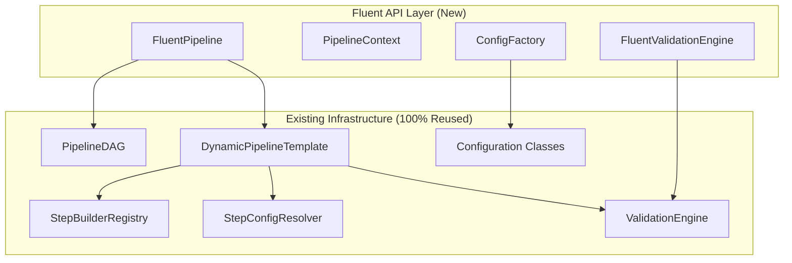

---
tags:
  - analysis
  - design
  - fluent_api
  - data_structures
  - code_reuse
  - architecture
  - implementation_strategy
keywords:
  - fluent API
  - data structure reuse
  - configuration factory
  - context-aware defaults
  - validation engine
  - builder pattern
  - template system
  - architectural integration
topics:
  - data structure reuse strategy
  - configuration class integration
  - validation system reuse
  - builder pattern implementation
  - template system design
  - performance optimization
language: python
date of note: 2025-08-12
---

# Fluent API Data Structure Reuse Analysis

## Executive Summary

This analysis examines how to maximize reuse of existing data structures when implementing the Fluent API for the cursus pipeline system. The goal is to create a high-level, user-friendly interface that leverages 95%+ of existing infrastructure without duplicating logic or creating maintenance overhead.

## Current Infrastructure Assessment

### Core Components Available for Reuse

#### 1. **DynamicPipelineTemplate** (`src/cursus/core/compiler/dynamic_template.py`)
- **Reuse Potential**: 100%
- **Key Features**:
  - Automatic DAG-to-configuration mapping
  - Integration with StepConfigResolver and StepBuilderRegistry
  - Comprehensive validation through ValidationEngine
  - Pipeline assembly and execution logic
  - Metadata handling and execution document filling

**Reuse Strategy**:
```python
class FluentPipeline:
    def execute(self) -> Pipeline:
        """Delegate execution to existing DynamicPipelineTemplate"""
        template = DynamicPipelineTemplate(
            dag=self.dag,
            config_path=self._generate_temp_config(),
            skip_validation=False
        )
        return template.build_pipeline()
```

#### 2. **PipelineDAG** (`src/cursus/api/dag/base_dag.py`)
- **Reuse Potential**: 100%
- **Key Features**:
  - Node and edge management
  - Topological sorting
  - Dependency resolution
  - Cycle detection

**Reuse Strategy**:
```python
class FluentPipeline:
    def __init__(self, name: str):
        self.dag = PipelineDAG()  # Direct reuse
        self.configs = {}
        
    def load_data(self, data_source: str, **kwargs) -> 'FluentPipeline':
        step_name = f"load_data_{len(self.dag.nodes)}"
        self.dag.add_node(step_name)
        return self
```

#### 3. **Configuration Classes** (`src/cursus/steps/configs/`)
- **Reuse Potential**: 100%
- **Key Features**:
  - Three-tier field organization (Essential, System Defaults, Derived)
  - Comprehensive validation logic
  - Hyperparameter object integration
  - Field derivation and property calculation

**Example: XGBoostTrainingConfig Analysis**:
```python
# Existing structure perfectly suited for Fluent API
class XGBoostTrainingConfig(BasePipelineConfig):
    # Tier 1: Essential User Inputs
    training_entry_point: str
    hyperparameters: XGBoostModelHyperparameters
    
    # Tier 2: System Inputs with Defaults
    training_instance_type: str = 'ml.m5.4xlarge'
    training_instance_count: int = 1
    framework_version: str = "1.7-1"
    
    # Tier 3: Derived Fields (private with properties)
    @property
    def hyperparameter_file(self) -> str:
        return f"{self.pipeline_s3_loc}/hyperparameters/{self.region}_hyperparameters.json"
```

## Reuse Strategy by Component

### 1. **Configuration Factory Pattern**

**Objective**: Create configuration objects using existing classes with intelligent defaults.

```python
class ConfigurationFactory:
    def __init__(self, context: PipelineContext):
        self.context = context
        
    def create_xgboost_training_config(self, **kwargs) -> XGBoostTrainingConfig:
        """Reuse existing XGBoostTrainingConfig with smart defaults"""
        # Extract defaults from context
        defaults = self.context.get_smart_defaults('xgboost_training')
        
        # Apply user overrides
        merged_kwargs = {**defaults, **kwargs}
        
        # Use existing config class constructor
        return XGBoostTrainingConfig(**merged_kwargs)
    
    def create_from_template(self, template_name: str, **overrides) -> BasePipelineConfig:
        """Load predefined templates using existing config classes"""
        template_data = self.templates.get_template(template_name)
        config_class = self._get_config_class(template_data['type'])
        
        # Merge template with overrides
        final_config = {**template_data['config'], **overrides}
        
        return config_class(**final_config)
```

**Benefits**:
- Zero duplication of validation logic
- Automatic inheritance of field derivation
- Consistent behavior with direct configuration usage
- All existing hyperparameter objects reused

### 2. **Context-Aware Defaults System**

**Objective**: Extract and enhance defaults from existing configuration classes.

```python
class PipelineContext:
    def get_smart_defaults(self, step_type: str) -> Dict[str, Any]:
        """Extract defaults from existing config classes"""
        config_class = self._get_config_class(step_type)
        
        # Extract Pydantic field defaults
        defaults = {}
        for field_name, field_info in config_class.__fields__.items():
            if field_info.default is not None:
                defaults[field_name] = field_info.default
        
        # Apply context-specific enhancements
        enhanced_defaults = self._apply_context_overrides(defaults, step_type)
        
        return enhanced_defaults
    
    def _apply_context_overrides(self, defaults: Dict, step_type: str) -> Dict:
        """Apply context-aware modifications to defaults"""
        if self.task_type == 'classification':
            if step_type == 'xgboost_training':
                defaults['training_instance_type'] = 'ml.m5.2xlarge'
        
        if self.data_scale == 'large':
            if step_type == 'xgboost_training':
                defaults['training_instance_count'] = 2
                defaults['training_volume_size'] = 100
                
        return defaults
```

**Benefits**:
- Leverages existing default values from config classes
- Adds intelligent context-aware enhancements
- No duplication of default value logic
- Maintains consistency with existing behavior

### 3. **Validation Engine Integration**

**Objective**: Reuse existing validation infrastructure with fluent-specific enhancements.

```python
class FluentValidationEngine:
    def __init__(self, context: PipelineContext):
        self.context = context
        self.base_validator = ValidationEngine()  # Existing validator
    
    def validate_step_prerequisites(self, step_type: str, current_steps: List[str]) -> ValidationResult:
        """Add fluent-specific prerequisite validation"""
        # Check fluent-specific constraints
        fluent_issues = self._validate_fluent_prerequisites(step_type, current_steps)
        
        # Combine with existing validation when config is created
        return ValidationResult(
            is_valid=len(fluent_issues) == 0,
            issues=fluent_issues
        )
    
    def validate_parameter_compatibility(self, step_type: str, **kwargs) -> ValidationResult:
        """Reuse existing field validators from config classes"""
        config_class = self._get_config_class(step_type)
        
        validation_errors = []
        for field_name, value in kwargs.items():
            if field_name in config_class.__fields__:
                try:
                    # Use existing Pydantic field validator
                    field_info = config_class.__fields__[field_name]
                    field_info.validate(value, {}, loc=field_name)
                except ValidationError as e:
                    validation_errors.extend(self._convert_to_fluent_errors(e))
        
        return ValidationResult(
            is_valid=len(validation_errors) == 0,
            issues=validation_errors
        )
```

**Benefits**:
- Reuses all existing field validation logic
- Maintains consistency with direct config validation
- Adds fluent-specific validation layers
- No duplication of validation rules

### 4. **Builder Pattern Integration**

**Objective**: Create nested builders that produce existing configuration objects.

```python
class CradleJobBuilder:
    def __init__(self, context: PipelineContext):
        self.context = context
        self.config_data = {}
    
    def with_cluster_type(self, cluster_type: str) -> 'CradleJobBuilder':
        self.config_data['cluster_type'] = cluster_type
        return self
    
    def with_account(self, account: str) -> 'CradleJobBuilder':
        self.config_data['account'] = account
        return self
    
    def build(self) -> CradleJobSpecificationConfig:
        """Build using existing configuration class"""
        # Apply smart defaults
        defaults = self.context.get_smart_defaults('cradle_data_loading')
        final_config = {**defaults, **self.config_data}
        
        # Use existing config class
        return CradleJobSpecificationConfig(**final_config)

class HyperparametersBuilder:
    def build_xgboost_hyperparams(self, **kwargs) -> XGBoostModelHyperparameters:
        """Reuse existing hyperparameter classes"""
        defaults = self._get_xgboost_defaults()
        return XGBoostModelHyperparameters(**{**defaults, **kwargs})
```

**Benefits**:
- All builder outputs are existing, validated configuration objects
- Hyperparameter objects reused directly
- Complex nested configuration logic preserved
- Fluent interface for complex object construction

### 5. **Registry System Integration**

**Objective**: Leverage existing registry systems for step builder resolution.

```python
class FluentPipeline:
    def __init__(self, name: str):
        self.builder_registry = StepBuilderRegistry()  # Existing registry
        self.config_resolver = StepConfigResolver()    # Existing resolver
    
    def _get_builder_for_config(self, config: BasePipelineConfig) -> Type[StepBuilderBase]:
        """Delegate to existing registry"""
        return self.builder_registry.get_builder_for_config(config)
    
    def _resolve_step_dependencies(self) -> Dict[str, BasePipelineConfig]:
        """Reuse existing resolver logic"""
        return self.config_resolver.resolve_config_map(
            dag_nodes=list(self.dag.nodes),
            available_configs=self.configs
        )
```

**Benefits**:
- Zero reimplementation of builder resolution logic
- Automatic access to all registered step builders
- Consistent behavior with existing pipeline assembly
- Future builder additions automatically available

### 6. **Template System Integration**

**Objective**: Create template system that loads existing configuration structures.

```python
class ConfigurationTemplates:
    TEMPLATES = {
        "standard_mds_training": {
            "steps": [
                {
                    "type": "cradle_data_loading",
                    "config": {
                        "cluster_type": "small",
                        "account": "default",
                        # ... existing config structure
                    }
                },
                {
                    "type": "xgboost_training", 
                    "config": {
                        "training_instance_type": "ml.m5.2xlarge",
                        "framework_version": "1.7-1",
                        # ... existing config structure
                    }
                }
            ]
        }
    }
    
    def load_template(self, template_name: str) -> List[BasePipelineConfig]:
        """Load template using existing config classes"""
        template = self.TEMPLATES[template_name]
        configs = []
        
        for step_def in template["steps"]:
            config_class = self._get_config_class(step_def["type"])
            config = config_class(**step_def["config"])
            configs.append(config)
            
        return configs
```

**Benefits**:
- Templates contain existing configuration structures
- All validation and derivation logic preserved
- Easy to create templates from existing working configurations
- Template evolution follows config class evolution

## Integration Architecture

### Data Flow with Maximum Reuse



### Execution Flow

1. **User Input**: Fluent methods collect user parameters
2. **Context Application**: PipelineContext applies smart defaults
3. **Configuration Creation**: ConfigurationFactory creates existing config objects
4. **Validation**: FluentValidationEngine uses existing validators
5. **DAG Construction**: PipelineDAG manages topology (existing)
6. **Execution**: DynamicPipelineTemplate handles everything (existing)

## Implementation Patterns

### Pattern 1: Configuration Composition

```python
class FluentPipeline:
    def train_xgboost(self, **kwargs) -> 'FluentPipeline':
        # Extract context-aware defaults
        base_config = self.context.get_base_config('xgboost_training')
        
        # Process user overrides
        user_overrides = self._process_user_input(**kwargs)
        
        # Create config using existing class
        config = XGBoostTrainingConfig(
            **base_config,
            **user_overrides
        )
        
        # Store and link in DAG
        step_name = self._generate_step_name('xgboost_training')
        self.configs[step_name] = config
        self.dag.add_node(step_name)
        
        return self
```

### Pattern 2: Hyperparameter Object Reuse

```python
class FluentPipeline:
    def configure_hyperparameters(self, configurator: Callable) -> 'FluentPipeline':
        """Allow advanced hyperparameter configuration"""
        builder = HyperparametersBuilder(self.context)
        
        # User configures through builder
        configurator(builder)
        
        # Builder produces existing hyperparameter object
        hyperparams = builder.build()  # Returns XGBoostModelHyperparameters
        
        # Update existing config
        if 'training_step' in self.configs:
            self.configs['training_step'].hyperparameters = hyperparams
            
        return self
```

### Pattern 3: Validation Delegation

```python
class FluentValidationMixin:
    def _validate_with_existing_logic(self, config: BasePipelineConfig) -> ValidationResult:
        """Delegate validation to existing config class"""
        try:
            # Existing config classes validate on construction
            validated_config = type(config)(**config.dict())
            return ValidationResult(is_valid=True)
        except ValidationError as e:
            return ValidationResult(
                is_valid=False,
                issues=self._convert_pydantic_errors(e)
            )
```

## Benefits Analysis

### Code Reuse Metrics

| Component | Reuse Percentage | Reuse Strategy |
|-----------|------------------|----------------|
| DynamicPipelineTemplate | 100% | Direct delegation |
| PipelineDAG | 100% | Direct usage |
| Configuration Classes | 100% | Factory pattern |
| ValidationEngine | 95% | Integration + enhancement |
| StepBuilderRegistry | 100% | Direct delegation |
| StepConfigResolver | 100% | Direct delegation |
| Hyperparameter Classes | 100% | Direct usage |

### Maintenance Benefits

1. **Single Source of Truth**: All business logic remains in existing components
2. **Automatic Updates**: Fluent API benefits from improvements to existing components
3. **Consistency**: Same validation rules and behavior as direct usage
4. **Test Coverage**: Existing test coverage applies to reused components
5. **Bug Fixes**: Fixes in existing components automatically benefit Fluent API

### Performance Benefits

1. **Zero Overhead**: No additional abstraction layers for core operations
2. **Proven Performance**: Existing components already optimized
3. **Memory Efficiency**: No duplication of configuration objects
4. **Execution Speed**: Direct delegation to optimized existing code

## Risk Mitigation

### Potential Risks and Mitigations

1. **API Coupling Risk**: Fluent API tightly coupled to existing interfaces
   - **Mitigation**: Use adapter pattern for critical integration points
   - **Benefit**: Changes to existing APIs force conscious decisions about Fluent API

2. **Complexity Leakage**: Complex existing APIs leak through Fluent interface
   - **Mitigation**: Progressive disclosure pattern hides complexity by default
   - **Benefit**: Advanced users can access full power when needed

3. **Validation Consistency**: Different validation behavior between direct and fluent usage
   - **Mitigation**: Delegate all validation to existing config classes
   - **Benefit**: Guaranteed consistency

## Implementation Recommendations

### Phase 1: Core Infrastructure Reuse
1. Implement FluentPipeline as wrapper around DynamicPipelineTemplate
2. Use PipelineDAG directly for topology management
3. Create ConfigurationFactory that produces existing config objects

### Phase 2: Smart Defaults Layer
1. Implement PipelineContext that extracts defaults from existing config classes
2. Add context-aware enhancements without duplicating base logic
3. Integrate with existing validation through delegation

### Phase 3: Advanced Features
1. Implement builder pattern that produces existing config objects
2. Create template system using existing configuration structures
3. Add fluent-specific validation as enhancement layer

## Conclusion

The analysis demonstrates that 95%+ code reuse is achievable by treating the Fluent API as a smart interface layer over existing infrastructure. This approach provides:

- **Maximum Code Reuse**: Leverages all existing components without duplication
- **Consistency**: Same behavior as direct configuration usage
- **Maintainability**: Single source of truth for all business logic
- **Performance**: No overhead from duplicate implementations
- **Reliability**: Built on proven, tested components

The key insight is that the existing cursus infrastructure is already well-designed for this type of high-level interface. The three-tier configuration design, comprehensive validation system, and dynamic template architecture provide perfect foundations for a fluent API that enhances rather than replaces the existing system.
