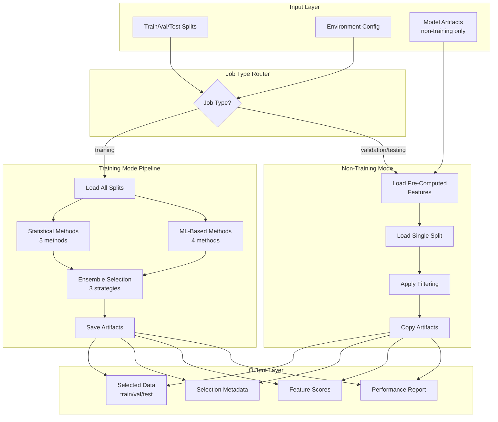

---
tags:
  - code
  - script_documentation
  - feature_selection
  - dimensionality_reduction
  - statistical_methods
  - machine_learning
  - ensemble_selection
keywords:
  - feature selection
  - variance threshold
  - correlation analysis
  - mutual information
  - chi-square test
  - F-test
  - recursive feature elimination
  - feature importance
  - LASSO
  - permutation importance
  - ensemble methods
topics:
  - feature selection
  - statistical analysis
  - machine learning preprocessing
  - dimensionality reduction
  - model optimization
language: python
date_of_note: 2025-11-18
---

# Feature Selection Script Documentation

## 1. Overview

### Script Identity
- **Script Name**: `feature_selection.py`
- **Location**: `src/cursus/steps/scripts/feature_selection.py`
- **Contract**: `src/cursus/steps/contracts/feature_selection_contract.py`
- **Lines of Code**: ~1,100 lines
- **Last Updated**: 2025-10-25

### Purpose Statement
The Feature Selection script implements a comprehensive feature selection pipeline that applies multiple statistical and machine learning-based methods to identify the most relevant features for model training. It combines results using ensemble selection strategies to achieve robust, stable feature selection that improves model performance while reducing dimensionality and computational costs.

### Key Capabilities
- **9 Feature Selection Methods**: 5 statistical methods + 4 ML-based methods
- **3 Ensemble Strategies**: Voting, ranking, and scoring combination approaches
- **Job Type Support**: Training mode (full pipeline) vs non-training modes (pre-computed features)
- **Parameter Accumulator Pattern**: Copies and extends artifacts from previous steps
- **Format Preservation**: Maintains CSV/TSV/Parquet format from input
- **Dual-Mode Operation**: Computation mode (training) vs filtering mode (validation/testing)

### Integration Context
```
TabularPreprocessing → FeatureSelection → XGBoostTraining
     (all features)      (selected)        (optimized)
```

**Upstream Dependencies**:
- Tabular Preprocessing output (train/val/test splits)
- Stratified Sampling output (alternative source)

**Downstream Consumers**:
- XGBoost Training (primary consumer)
- LightGBM Training
- PyTorch Training

---

## 2. Contract Specification

### Input Paths
```python
expected_input_paths = {
    "input_data": "/opt/ml/processing/input",
    "model_artifacts_input": "/opt/ml/processing/input/model_artifacts"  # Optional, non-training only
}
```

**Input Data Structure**:
```
/opt/ml/processing/input/
├── train/
│   └── train_processed_data.csv
├── val/
│   └── val_processed_data.csv
└── test/
    └── test_processed_data.csv
```

### Output Paths
```python
expected_output_paths = {
    "processed_data": "/opt/ml/processing/output/data",
    "model_artifacts_output": "/opt/ml/processing/output/model_artifacts"
}
```

**Output Data Structure**:
```
/opt/ml/processing/output/
├── data/
│   ├── train/
│   │   └── train_processed_data.csv  # Only selected features + target
│   ├── val/
│   │   └── val_processed_data.csv
│   └── test/
│       └── test_processed_data.csv
└── model_artifacts/
    ├── selected_features.json         # Feature selection metadata
    ├── feature_scores.csv             # Detailed scores from all methods
    ├── feature_selection_report.json  # Performance summary
    └── [previous_artifacts...]        # Accumulated from prior steps
```

### Environment Variables

#### Required Variables
- **`LABEL_FIELD`**: Target column name (standard across framework)

#### Optional Variables (with defaults)
- **`FEATURE_SELECTION_METHODS`**: `"variance,correlation,mutual_info,rfe"`
  - Comma-separated list of methods to apply
  - Available: variance, correlation, mutual_info, chi2, f_test, rfe, importance, lasso, permutation
  
- **`N_FEATURES_TO_SELECT`**: `"10"`
  - Number of features in final ensemble selection
  
- **`CORRELATION_THRESHOLD`**: `"0.95"`
  - Threshold for removing highly correlated features
  
- **`VARIANCE_THRESHOLD`**: `"0.01"`
  - Threshold for removing low-variance features
  
- **`RANDOM_STATE`**: `"42"`
  - Random seed for reproducibility
  
- **`COMBINATION_STRATEGY`**: `"voting"`
  - Ensemble combination strategy: voting, ranking, or scoring

### Command Line Arguments
```python
parser.add_argument(
    "--job_type",
    type=str,
    default="training",
    choices=["training", "validation", "testing"],
    help="Type of job (training/validation/testing)"
)
```

### Framework Dependencies
- **pandas** >= 1.3.0
- **numpy** >= 1.21.0
- **scikit-learn** >= 1.0.0 (provides all selection methods)

---

## 3. Functional Architecture

### High-Level Data Flow


### Processing Modes

#### Training Mode Flow
```
1. Load all splits (train/val/test)
2. Extract features and target from training data
3. Apply each selection method independently
4. Combine results using ensemble strategy
5. Filter all splits to selected features
6. Save artifacts using accumulator pattern
```

#### Non-Training Mode Flow
```
1. Load pre-computed selected features
2. Load single split (validation or testing)
3. Apply feature filtering (no computation)
4. Copy existing artifacts (accumulator pattern)
5. Generate minimal metadata report
```

---

## 4. Core Components

### Main Entry Point
```python
def main(
    input_paths: Dict[str, str],
    output_paths: Dict[str, str],
    environ_vars: Dict[str, str],
    job_args: argparse.Namespace
) -> None:
    """
    Main function for feature selection processing.
    
    Training Mode: Runs full selection pipeline, processes all splits
    Non-Training: Uses pre-computed features, processes single split
    """
```

### Feature Selection Methods (9 Total)

#### Statistical Methods (5)
1. **Variance Threshold** (`variance_threshold_selection`)
   - Removes features with variance below threshold
   - Fast, eliminates constant/near-constant features
   
2. **Correlation-Based** (`correlation_based_selection`)
   - Removes highly correlated feature pairs
   - Keeps feature with higher target correlation
   
3. **Mutual Information** (`mutual_info_selection`)
   - Measures dependency between features and target
   - Works for both classification and regression
   
4. **Chi-Square Test** (`chi2_selection`)
   - Statistical test for categorical targets
   - Requires non-negative features
   
5. **F-Test (ANOVA)** (`f_classif_selection`)
   - ANOVA F-test for classification
   - F-regression for regression tasks

#### ML-Based Methods (4)
1. **Recursive Feature Elimination** (`rfe_selection`)
   - Iterative elimination using estimator (RF/SVM/Linear)
   - Considers feature interactions
   
2. **Feature Importance** (`feature_importance_selection`)
   - Uses tree-based models (RF/XGBoost/Extra Trees)
   - Extracts built-in importance scores
   
3. **LASSO Regularization** (`lasso_selection`)
   - L1 penalty drives coefficients to zero
   - Automatic feature selection via sparsity
   
4. **Permutation Importance** (`permutation_importance_selection`)
   - Model-agnostic importance via shuffling
   - Measures performance degradation

### Ensemble Selection
```python
def combine_selection_results(
    method_results: List[Dict[str, Any]],
    combination_strategy: str = 'voting',
    final_k: int = 10
) -> Dict[str, Any]:
    """
    Three ensemble strategies:
    
    1. Voting: Count methods selecting each feature
    2. Ranking: Average rankings across methods
    3. Scoring: Normalize and combine scores
    """
```

---

## 5. Key Functions

### 1. Data Loading Functions

#### `load_preprocessed_data`
```python
def load_preprocessed_data(input_data_dir: str) -> Dict[str, pd.DataFrame]:
    """
    Load train/val/test splits with format detection.
    
    Returns:
        Dictionary with 'train', 'val', 'test' DataFrames + '_format' key
    """
```

**Algorithm**:
1. Iterate over train/val/test subdirectories
2. Detect format (CSV/TSV/Parquet) via `_detect_file_format`
3. Read files with appropriate reader
4. Store format metadata for output preservation

#### `load_single_split_data`
```python
def load_single_split_data(
    input_data_dir: str, 
    job_type: str
) -> Dict[str, pd.DataFrame]:
    """
    Load single split for non-training job types.
    
    Used in validation/testing modes.
    """
```

### 2. Statistical Selection Functions

#### `variance_threshold_selection`
**Purpose**: Remove low-variance features
**Algorithm**:
```python
1. Calculate variance for each feature: variances = X.var()
2. Filter features above threshold: selected = variances[variances > threshold]
3. Return selected features with variance scores
```

#### `correlation_based_selection`
**Purpose**: Remove redundant highly-correlated features
**Algorithm**:
```python
1. Compute feature correlation matrix: corr_matrix = X.corr().abs()
2. Compute target correlations: target_corr = X.corrwith(y).abs()
3. Find high correlation pairs: pairs where corr > threshold
4. For each pair, remove feature with lower target correlation
5. Return remaining features with target correlation scores
```

#### `mutual_info_selection`
**Purpose**: Select features with high mutual information with target
**Algorithm**:
```python
1. Detect task type: classification vs regression
2. Compute MI scores: mutual_info_classif/regression(X, y)
3. Select top k features using SelectKBest
4. Return selected features with MI scores
```

### 3. ML-Based Selection Functions

#### `rfe_selection`
**Purpose**: Recursive feature elimination with model feedback
**Algorithm**:
```python
1. Create estimator (RF/SVM/Linear) based on task type
2. Initialize RFE with n_features_to_select
3. Iteratively:
   - Train model on current features
   - Rank features by importance/coefficients
   - Remove lowest-ranked feature
4. Return selected features with rankings converted to scores
```

#### `feature_importance_selection`
**Purpose**: Select features using tree-based importance
**Algorithm**:
```python
1. Train model (RF/XGBoost/Extra Trees)
2. Extract feature_importances_ attribute
3. Sort features by importance (descending)
4. Select top n_features
5. Return selected features with importance scores
```

#### `lasso_selection`
**Purpose**: L1 regularization for sparse feature selection
**Algorithm**:
```python
1. Standardize features: X_scaled = StandardScaler().fit_transform(X)
2. Fit LASSO model (Regression) or Logistic Regression with L1 penalty
3. Extract coefficients
4. Select features where |coefficient| > epsilon (e.g., 1e-6)
5. Return selected features with absolute coefficient scores
```

### 4. Ensemble Selection Function

#### `combine_selection_results`
**Purpose**: Combine multiple selection methods robustly
**Strategies**:

**Voting Strategy**:
```python
1. Count how many methods selected each feature
2. Sort by vote count (descending)
3. Select top k features
```

**Ranking Strategy**:
```python
1. Convert each method's scores to rankings
2. Average rankings across methods (lower is better)
3. Sort by average rank
4. Select top k features
```

**Scoring Strategy**:
```python
1. Normalize each method's scores to [0, 1]
2. Average normalized scores across methods
3. Sort by combined score (descending)
4. Select top k features
```

### 5. Artifact Management Functions

#### `copy_existing_artifacts`
```python
def copy_existing_artifacts(src_dir: str, dst_dir: str) -> None:
    """
    Copy all existing model artifacts from previous processing steps.
    
    Implements parameter accumulator pattern.
    """
```

**Algorithm**:
1. Check if source directory exists
2. Iterate over all files in source
3. Copy each file to destination with shutil.copy2
4. Log copied count

#### `save_selection_results`
```python
def save_selection_results(
    selection_results: Dict[str, Any],
    model_artifacts_dir: str
) -> None:
    """
    Save feature selection results and metadata.
    
    Outputs:
    - selected_features.json
    - feature_scores.csv
    - feature_selection_report.json
    """
```

---

## 6. Algorithms and Data Structures

### Algorithm 1: Ensemble Feature Selection Pipeline

**Purpose**: Robust feature selection combining multiple methods

**Input**:
- Training data: X_train (features), y_train (target)
- Methods list: e.g., ['variance', 'correlation', 'mutual_info', 'rfe']
- Configuration parameters

**Output**:
- Selected feature names
- Feature scores from all methods
- Method contributions

**Steps**:
```python
def apply_feature_selection_pipeline(
    splits: Dict[str, pd.DataFrame],
    target_variable: str,
    methods: List[str],
    method_configs: Dict[str, Dict]
) -> Dict[str, Any]:
    
    # Step 1: Prepare training data
    X_train = splits['train'][feature_columns]
    y_train = splits['train'][target_variable]
    
    # Step 2: Apply each method independently
    method_results = []
    for method in methods:
        if method == 'variance':
            result = variance_threshold_selection(X_train, ...)
        elif method == 'correlation':
            result = correlation_based_selection(X_train, y_train, ...)
        # ... other methods
        
        method_results.append(result)
    
    # Step 3: Combine results using ensemble strategy
    final_k = method_configs.get('final_k', 10)
    strategy = method_configs.get('combination_strategy', 'voting')
    
    combined_result = combine_selection_results(
        method_results, 
        strategy, 
        final_k
    )
    
    # Step 4: Return comprehensive results
    return {
        'selected_features': combined_result['selected_features'],
        'method_results': method_results,
        'combined_result': combined_result,
        ...
    }
```

**Time Complexity**:
- Variance threshold: O(n × d) where n=samples, d=features
- Correlation: O(d²) for correlation matrix
- Mutual information: O(n × d × log(n))
- RFE with RF: O(k × n × d × log(n) × trees) where k=elimination iterations
- Feature importance with RF: O(n × d × log(n) × trees)
- LASSO: O(iterations × n × d)

**Space Complexity**: O(n × d) for data + O(d²) for correlation matrix

### Algorithm 2: Correlation-Based Redundancy Elimination

**Purpose**: Remove redundant features while preserving information

**Pseudo-code**:
```
INPUT: Feature matrix X, target y, threshold θ
OUTPUT: Non-redundant feature subset

1. Compute correlation matrix: C = corr(X)
2. Compute target correlations: T = corr(X, y)
3. Initialize removed_features = ∅

4. FOR each upper triangular pair (i, j) in C:
    IF |C[i,j]| > θ:
        IF |T[i]| > |T[j]|:
            removed_features ← removed_features ∪ {j}
        ELSE:
            removed_features ← removed_features ∪ {i}

5. RETURN features ∉ removed_features
```

**Key Property**: Keeps feature with stronger target relationship from each correlated pair

### Algorithm 3: Voting-Based Ensemble Selection

**Purpose**: Democratic feature selection across methods

**Pseudo-code**:
```
INPUT: method_results = [{selected_features, scores}, ...]
       final_k = number of features to select
OUTPUT: Final selected features

1. Initialize vote_counts = {}
2. FOR each method_result in method_results:
    FOR each feature in method_result.selected_features:
        vote_counts[feature] ← vote_counts[feature] + 1

3. Sort features by vote_counts (descending)
4. RETURN top final_k features
```

**Rationale**: Features selected by multiple methods are more robust

### Data Structure 1: Selection Results Dictionary

```python
{
    "selected_features": List[str],           # Final selected feature names
    "method_results": List[Dict],             # Individual method results
    "combined_result": {
        "selected_features": List[str],
        "scores": Dict[str, float],           # Combined scores
        "method_contributions": Dict[str, float],  # Per-method contribution
        "combination_strategy": str,
        "n_methods": int,
        "n_selected": int
    },
    "original_features": List[str],
    "target_variable": str,
    "n_original_features": int,
    "n_selected_features": int
}
```

### Data Structure 2: Method Result Format

```python
{
    "method": str,                    # Method name
    "selected_features": List[str],   # Features selected by this method
    "scores": Dict[str, float],       # Feature scores (method-specific)
    "n_selected": int,                # Number of features selected
    "processing_time": float,         # Execution time in seconds
    # Method-specific fields:
    "threshold": float,               # For threshold-based methods
    "k": int,                         # For top-k methods
    "is_classification": bool,        # Task type detection
    "rankings": Dict[str, int],       # For RFE
    "removed_features": List[str],    # For correlation
    "error": str                      # If method failed
}
```

---

## 7. Input/Output Structures

### Input Data Format

**Training Mode** (all splits required):
```csv
# train_processed_data.csv, val_processed_data.csv, test_processed_data.csv
feature1,feature2,feature3,...,featureN,target
1.5,2.3,4.1,...,9.2,0
2.1,3.4,5.2,...,8.7,1
...
```

**Non-Training Mode** (single split):
```csv
# validation_processed_data.csv or testing_processed_data.csv
feature1,feature2,feature3,...,featureN,target
1.5,2.3,4.1,...,9.2,0
2.1,3.4,5.2,...,8.7,1
...
```

### Output Data Format

**Feature-Selected Splits**:
```csv
# train_processed_data.csv (only selected features + target)
feature2,feature5,feature7,target
2.3,6.1,7.8,0
3.4,7.2,8.9,1
...
```

### Metadata Outputs

#### selected_features.json
```json
{
  "selected_features": ["feature2", "feature5", "feature7", "feature12"],
  "selection_metadata": {
    "n_original_features": 100,
    "n_selected_features": 4,
    "selection_ratio": 0.04,
    "methods_used": ["variance", "correlation", "mutual_info", "rfe"],
    "combination_strategy": "voting",
    "target_variable": "is_fraud"
  },
  "method_contributions": {
    "variance": 0.75,
    "correlation": 0.50,
    "mutual_info": 1.00,
    "rfe": 0.75
  }
}
```

#### feature_scores.csv
```csv
feature_name,combined_score,variance_score,correlation_score,mutual_info_score,rfe_score,selected
feature2,0.92,0.15,0.87,0.94,0.88,true
feature5,0.88,0.12,0.82,0.91,0.86,true
feature7,0.85,0.18,0.79,0.89,0.84,true
feature12,0.82,0.16,0.76,0.86,0.81,true
feature3,0.45,0.08,0.42,0.48,0.44,false
...
```

#### feature_selection_report.json
```json
{
  "selection_summary": {
    "total_features": 100,
    "selected_features": 4,
    "selection_methods": ["variance", "correlation", "mutual_info", "rfe"],
    "combination_strategy": "voting",
    "processing_time": 45.2,
    "target_variable": "is_fraud"
  },
  "method_performance": {
    "variance": {
      "n_selected": 85,
      "processing_time": 0.5
    },
    "correlation": {
      "n_selected": 75,
      "processing_time": 2.1
    },
    "mutual_info": {
      "n_selected": 10,
      "processing_time": 15.3
    },
    "rfe": {
      "n_selected": 10,
      "processing_time": 27.3
    }
  },
  "feature_statistics": {
    "avg_score": 0.65,
    "score_std": 0.15,
    "min_score": 0.12,
    "max_score": 0.94
  }
}
```

---

## 8. Configuration and Environment

### Environment Variable Usage

```python
# Parse environment variables
methods_str = environ_vars.get(
    "FEATURE_SELECTION_METHODS", 
    "variance,correlation,mutual_info,rfe"
)
methods = [method.strip() for method in methods_str.split(",")]

target_variable = environ_vars.get("LABEL_FIELD")
n_features_to_select = int(environ_vars.get("N_FEATURES_TO_SELECT", 10))
correlation_threshold = float(environ_vars.get("CORRELATION_THRESHOLD", 0.95))
variance_threshold = float(environ_vars.get("VARIANCE_THRESHOLD", 0.01))
random_state = int(environ_vars.get("RANDOM_STATE", 42))
combination_strategy = environ_vars.get("COMBINATION_STRATEGY", "voting")
```

### Method Configuration Dictionary

```python
method_configs = {
    "variance": {"threshold": variance_threshold},
    "correlation": {"threshold": correlation_threshold},
    "mutual_info": {"k": n_features_to_select, "random_state": random_state},
    "chi2": {"k": n_features_to_select},
    "f_test": {"k": n_features_to_select},
    "rfe": {
        "estimator_type": "rf",
        "n_features": n_features_to_select,
        "random_state": random_state
    },
    "importance": {
        "method": "random_forest",
        "n_features": n_features_to_select,
        "random_state": random_state
    },
    "lasso": {"alpha": 0.01, "random_state": random_state},
    "permutation": {
        "estimator_type": "rf",
        "n_features": n_features_to_select,
        "random_state": random_state
    },
    "final_k": n_features_to_select,
    "combination_strategy": combination_strategy
}
```

### Configuration Examples

#### Example 1: Conservative Selection (Statistical Methods Only)
```bash
export FEATURE_SELECTION_METHODS="variance,correlation,mutual_info"
export N_FEATURES_TO_SELECT="20"
export VARIANCE_THRESHOLD="0.05"
export CORRELATION_THRESHOLD="0.90"
export COMBINATION_STRATEGY="voting"
```

#### Example 2: Aggressive Selection (All Methods)
```bash
export FEATURE_SELECTION_METHODS="variance,correlation,mutual_info,chi2,f_test,rfe,importance,lasso,permutation"
export N_FEATURES_TO_SELECT="5"
export COMBINATION_STRATEGY="scoring"
```

#### Example 3: ML-Heavy Pipeline
```bash
export FEATURE_SELECTION_METHODS="rfe,importance,lasso,permutation"
export N_FEATURES_TO_SELECT="15"
export COMBINATION_STRATEGY="ranking"
```

---

## 9. Error Handling and Logging

### Error Handling Strategy

#### Method-Level Error Recovery
```python
for method in methods:
    try:
        if method == 'variance':
            result = variance_threshold_selection(X_train, **configs)
        # ... other methods
        
        method_results.append(result)
        
    except Exception as e:
        logger.error(f"Error in {method} selection: {e}")
        # Continue with other methods - graceful degradation
        continue
```

**Key Principle**: Individual method failures don't crash the pipeline

#### Pipeline-Level Error Handling
```python
try:
    # Main processing
    main(input_paths, output_paths, environ_vars, args)
    logger.info("Feature selection completed successfully")
    sys.exit(0)
    
except Exception as e:
    logger.error(f"FATAL ERROR in feature selection: {str(e)}")
    logger.error(traceback.format_exc())
    sys.exit(1)
```

### Logging Architecture

#### CloudWatch-Compatible Setup
```python
def setup_logging() -> logging.Logger:
    """Configure logging for CloudWatch compatibility"""
    logging.basicConfig(
        level=logging.INFO,
        format="%(asctime)s - %(name)s - %(levelname)s - %(message)s",
        handlers=[logging.StreamHandler(sys.stdout)]
    )
    logger = logging.getLogger(__name__)
    sys.stdout.flush()
    return logger
```

#### Comprehensive Logging Points

**Pipeline Start/End**:
```python
logger.info("====== STARTING FEATURE SELECTION ======")
logger.info(f"Configuration:")
logger.info(f"  Methods: {methods}")
logger.info(f"  Target variable: {target_variable}")
logger.info(f"  Number of features to select: {n_features_to_select}")
# ... process ...
logger.info("====== FEATURE SELECTION COMPLETED SUCCESSFULLY ======")
```

**Method Execution**:
```python
logger.info(f"Applying {method} feature selection...")
# ... execute ...
logger.info(f"{method} selected {result['n_selected']} features in {result['processing_time']:.2f}s")
```

**Data Operations**:
```python
logger.info(f"Loaded {split_name} split (format={fmt}): {df.shape}")
logger.info(f"Saved {split_name} split with {len(selected_features)} features (format={output_format})")
```

**Artifact Management**:
```python
logger.info(f"✓ Copied {copied_count} existing artifact(s) to {dst_dir}")
logger.info(f"Saved all feature selection results to {model_artifacts_output_dir}")
```

### Error Categories and Responses

| Error Type | Handling Strategy | Example |
|------------|------------------|---------|
| Missing required env var | Raise ValueError, exit(1) | LABEL_FIELD not set |
| Method execution failure | Log error, continue with other methods | RFE fails due to singular matrix |
| Input file not found | Raise FileNotFoundError, exit(1) | train_processed_data.csv missing |
| Invalid method name | Log warning, skip method | Unknown method 'invalid_method' |
| Output write failure | Raise exception, exit(1) | Permission denied on output |

---

## 10. Performance Characteristics

### Processing Time by Method

| Method | Time Complexity | Typical Time (100 features, 10K samples) |
|--------|----------------|------------------------------------------|
| Variance Threshold | O(n × d) | < 1 second |
| Correlation | O(d²) | 1-2 seconds |
| Mutual Information | O(n × d × log n) | 10-20 seconds |
| Chi-Square | O(n × d) | 1-2 seconds |
| F-Test | O(n × d) | 1-2 seconds |
| RFE (RF) | O(k × n × d × log n × trees) | 20-40 seconds |
| Feature Importance (RF) | O(n × d × log n × trees) | 15-25 seconds |
| LASSO | O(iterations × n × d) | 5-10 seconds |
| Permutation Importance | O(n × d × log n × repeats) | 25-35 seconds |

### Memory Usage

**Peak Memory Consumption**:
```
Base Memory: dataset size (n × d × 8 bytes for float64)
Correlation Matrix: d² × 8 bytes
Method Overhead: Varies by method
  - Statistical: Minimal (<100 MB)
  - ML-based: Model size (RF: ~100-500 MB)
```

**Example Memory Profile** (100 features, 10K samples):
- Training data: ~7.6 MB
- Correlation matrix: ~78 KB
- Random Forest (100 trees): ~200 MB
- Total peak: ~250 MB

### Scalability Considerations

**Recommended Limits**:
- Features: Up to 1,000 features (correlation becomes expensive at d²)
- Samples: Up to 1 million samples (ML methods scale linearly)
- Methods: Combine 3-5 methods for balance between robustness and speed

**Optimization Strategies**:
1. Start with statistical methods (fast) to reduce dimensionality
2. Apply ML methods on pre-filtered features
3. Use voting strategy (fastest combination)
4. Parallelize independent method execution

---

## 11. Integration Examples

### Example 1: End-to-End Pipeline Integration

```python
from sagemaker.processing import ProcessingInput, ProcessingOutput
from sagemaker.workflow.steps import ProcessingStep

# Tabular Preprocessing → Feature Selection → Training
feature_selection_step = ProcessingStep(
    name="feature-selection",
    processor=sklearn_processor,
    code="feature_selection.py",
    inputs=[
        ProcessingInput(
            source=tabular_preprocessing_step.properties.ProcessingOutputConfig
                .Outputs["processed_data"].S3Output.S3Uri,
            destination="/opt/ml/processing/input"
        )
    ],
    outputs=[
        ProcessingOutput(
            output_name="processed_data",
            source="/opt/ml/processing/output/data"
        ),
        ProcessingOutput(
            output_name="model_artifacts",
            source="/opt/ml/processing/output/model_artifacts"
        )
    ],
    job_arguments=["--job_type", "training"]
)
```

### Example 2: Validation Pipeline

```python
# Feature Selection for Validation Split
validation_feature_selection = ProcessingStep(
    name="validation-feature-selection",
    processor=sklearn_processor,
    code="feature_selection.py",
    inputs=[
        ProcessingInput(
            source=validation_data_s3_uri,
            destination="/opt/ml/processing/input"
        ),
        ProcessingInput(
            source=training_artifacts_s3_uri,  # Pre-computed features
            destination="/opt/ml/processing/input/model_artifacts"
        )
    ],
    outputs=[
        ProcessingOutput(
            output_name="processed_data",
            source="/opt/ml/processing/output/data"
        )
    ],
    job_arguments=["--job_type", "validation"]
)
```

### Example 3: Custom Configuration

```python
from sagemaker.workflow.parameters import ParameterString

feature_methods = ParameterString(
    name="FeatureSelectionMethods",
    default_value="variance,correlation,mutual_info,rfe,importance"
)

n_features = ParameterString(
    name="NumberOfFeatures",
    default_value="15"
)

feature_selection_step = ProcessingStep(
    name="feature-selection",
    # ... setup ...
    environment={
        "FEATURE_SELECTION_METHODS": feature_methods,
        "N_FEATURES_TO_SELECT": n_features,
        "LABEL_FIELD": "target",
        "COMBINATION_STRATEGY": "scoring"
    }
)
```

---

## 12. Testing and Validation

### Unit Testing Approach

```python
def test_variance_threshold_selection():
    """Test variance threshold method"""
    X = pd.DataFrame({
        'const_feature': [1, 1, 1, 1],
        'low_var_feature': [1, 1, 1, 2],
        'high_var_feature': [1, 5, 10, 15]
    })
    
    result = variance_threshold_selection(X, threshold=0.5)
    
    assert 'const_feature' not in result['selected_features']
    assert 'high_var_feature' in result['selected_features']
```

### Integration Testing

```python
def test_main_training_mode(tmp_path):
    """Test full pipeline in training mode"""
    # Setup test data
    input_dir = tmp_path / "input"
    output_dir = tmp_path / "output"
    
    # Create test splits
    create_test_splits(input_dir)
    
    # Run feature selection
    main(
        input_paths={"input_data": str(input_dir)},
        output_paths={"processed_data": str(output_dir)},
        environ_vars={
            "LABEL_FIELD": "target",
            "FEATURE_SELECTION_METHODS": "variance,correlation",
            "N_FEATURES_TO_SELECT": "5"
        },
        job_args=argparse.Namespace(job_type="training")
    )
    
    # Verify outputs
    assert (output_dir / "data" / "train" / "train_processed_data.csv").exists()
    assert (output_dir / "model_artifacts" / "selected_features.json").exists()
```

### Validation Checklist

- [ ] All 9 methods execute without errors
- [ ] Ensemble strategies produce valid results
- [ ] Format preservation works (CSV/TSV/Parquet)
- [ ] Parameter accumulator pattern functions correctly
- [ ] Non-training mode uses pre-computed features
- [ ] Graceful degradation on method failures
- [ ] Output artifacts are valid JSON/CSV
- [ ] Selected features improve model performance

---

## 13. Troubleshooting Guide

### Common Issues and Solutions

#### Issue 1: Method Execution Failures

**Symptom**: Some methods fail with errors
```
Error in rfe selection: SVD did not converge
```

**Solutions**:
1. Check for highly correlated features (run correlation method first)
2. Verify data has no NaN/Inf values
3. Try different estimator types for RFE
4. Reduce n_features_to_select parameter

#### Issue 2: Memory Issues

**Symptom**: Out of memory errors with large feature sets
```
MemoryError: Unable to allocate array
```

**Solutions**:
1. Reduce number of methods (skip ML-based methods)
2. Use sampling for method fitting
3. Run methods sequentially instead of storing all results
4. Increase instance memory (switch to larger instance type)

#### Issue 3: No Features Selected

**Symptom**: Zero features pass all thresholds
```
RuntimeError: No feature selection methods completed successfully
```

**Solutions**:
1. Lower variance_threshold (e.g., 0.001 instead of 0.01)
2. Lower correlation_threshold (e.g., 0.90 instead of 0.95)
3. Increase n_features_to_select
4. Check if target variable is constant

#### Issue 4: Inconsistent Results Across Runs

**Symptom**: Different features selected each run

**Solutions**:
1. Set RANDOM_STATE environment variable
2. Use voting strategy (more stable than scoring)
3. Increase n_features_to_select for more consensus
4. Review method contributions in output report

### Debug Mode

Enable verbose logging:
```python
import logging
logging.getLogger().setLevel(logging.DEBUG)
```

Check intermediate outputs:
```python
# Add after each method execution
logger.info(f"Method {method} selected: {result['selected_features']}")
logger.info(f"Top 5 scores: {sorted(result['scores'].items(), key=lambda x: x[1], reverse=True)[:5]}")
```

---

## 14. Best Practices

### Selection Strategy Guidelines

1. **Start Conservative**: Begin with statistical methods only
2. **Validate Impact**: Measure model performance before/after selection
3. **Use Ensemble**: Combine multiple methods for robust results
4. **Monitor Stability**: Track feature selection across different data samples
5. **Document Decisions**: Save selection reports for reproducibility

### Method Combination Recommendations

**For High-Dimensional Data (d > 100)**:
```bash
# Phase 1: Fast filtering
export FEATURE_SELECTION_METHODS="variance,correlation"
export N_FEATURES_TO_SELECT="50"

# Phase 2: ML refinement
export FEATURE_SELECTION_METHODS="mutual_info,rfe,importance"
export N_FEATURES_TO_SELECT="20"
```

**For Small Datasets (n < 1000)**:
```bash
# Avoid overfitting with simple methods
export FEATURE_SELECTION_METHODS="variance,mutual_info,f_test"
export N_FEATURES_TO_SELECT="10"
export COMBINATION_STRATEGY="voting"
```

**For Time-Critical Pipelines**:
```bash
# Fast methods only
export FEATURE_SELECTION_METHODS="variance,correlation,f_test"
export COMBINATION_STRATEGY="voting"
```

### Feature Selection Validation

**Cross-Validation Approach**:
```python
# Run feature selection on different folds
# Check feature stability across folds
# Select features that appear in >70% of folds
```

**Performance Validation**:
```python
# Measure model AUC/Accuracy before selection: X_all_features
# Measure model AUC/Accuracy after selection: X_selected_features
# Ensure performance improvement or minimal degradation
```

---

## 15. References and Related Documentation

### Internal Documentation
- **[Feature Selection Script Design](../1_design/feature_selection_script_design.md)**: Complete design document with architecture and patterns
- **[Tabular Preprocessing Script](./tabular_preprocessing_script.md)**: Upstream preprocessing step
- **[Script Testability Implementation](../0_developer_guide/script_testability_implementation.md)**: Testing patterns used in this script
- **[Script Development Guide](../0_developer_guide/script_development_guide.md)**: General script development guidelines

### Processing Steps Index
- **[Processing Steps Index](../00_entry_points/processing_steps_index.md)**: Complete catalog of all processing steps

### External Resources
- **scikit-learn Feature Selection**: https://scikit-learn.org/stable/modules/feature_selection.html
- **Feature Engineering and Selection (Book)**: http://www.feat.engineering/
- **An Introduction to Variable and Feature Selection (Guyon & Elisseeff)**: Classic paper on feature selection methods

### Contract and Specification
- **Contract**: `src/cursus/steps/contracts/feature_selection_contract.py`
- **Specification**: Part of FeatureSelection step specification
- **Config**: `src/cursus/steps/configs/config_feature_selection_step.py`
- **Builder**: `src/cursus/steps/builders/builder_feature_selection_step.py`

---

## Document Metadata

**Author**: Cursus Framework Team  
**Last Updated**: 2025-11-18  
**Script Version**: 2025-10-25  
**Documentation Version**: 1.0  
**Review Status**: Complete

**Change Log**:
- 2025-11-18: Initial comprehensive documentation created
- 2025-10-25: Feature selection script implemented

**Related Scripts**: 
- Upstream: `tabular_preprocessing.py`, `stratified_sampling.py`
- Downstream: `xgboost_training.py`, `lightgbm_training.py`, `pytorch_training.py`
