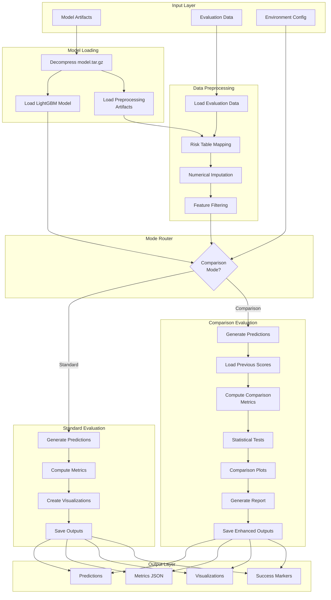

---
tags:
  - code
  - script
  - model_evaluation
  - lightgbm
  - performance_metrics
  - model_comparison
language: python
date_of_note: 2025-11-18
---

# LightGBM Model Evaluation Script Documentation

## 1. Overview

### Script Identity
- **Script Name**: `lightgbm_model_eval.py`
- **Location**: `src/cursus/steps/scripts/lightgbm_model_eval.py`
- **Contract**: `src/cursus/steps/contracts/lightgbm_model_eval_contract.py`
- **Lines of Code**: ~1,400 lines
- **Last Updated**: 2025-11-18

### Purpose Statement
The LightGBM Model Evaluation script provides comprehensive model evaluation capabilities for trained LightGBM models. It loads trained models with preprocessing artifacts, processes evaluation data, computes performance metrics, generates visualizations, and optionally performs detailed comparisons with previous model versions including statistical significance testing and automated deployment recommendations.

### Key Capabilities
- **Dual-Mode Operation**: Standard evaluation vs comparison mode with previous models
- **Complete Preprocessing Pipeline**: Risk table mapping + numerical imputation embedded
- **Comprehensive Metrics**: Binary and multiclass classification metrics
- **Rich Visualizations**: ROC curves, PR curves, score distributions, scatter plots
- **Statistical Testing**: McNemar's test, paired t-test, Wilcoxon signed-rank test
- **Format Preservation**: Maintains CSV/TSV/Parquet format from input
- **Automated Recommendations**: Deployment guidance based on performance analysis

### Integration Context
```
LightGBMTraining → LightGBMModelEval → [Deployment Decision]
  (model.tar.gz)      (metrics + viz)      (based on comparison)
```

**Upstream Dependencies**:
- LightGBM Training output (model artifacts)
- Evaluation dataset (preprocessed data)

**Downstream Consumers**:
- Model deployment pipelines
- Performance monitoring systems
- A/B testing frameworks

---

## 2. Contract Specification

### Input Paths
```python
expected_input_paths = {
    "model_input": "/opt/ml/processing/input/model",
    "processed_data": "/opt/ml/processing/input/eval_data"
}
```

**Model Input Structure**:
```
/opt/ml/processing/input/model/
├── model.tar.gz (optional, auto-extracted if present)
├── lightgbm_model.txt          # Trained LightGBM model
├── risk_table_map.pkl          # Categorical feature mappings
├── impute_dict.pkl             # Numerical feature imputation values
├── feature_columns.txt         # Feature names and order
└── hyperparameters.json        # Model metadata and config
```

**Evaluation Data Structure**:
```
/opt/ml/processing/input/eval_data/
└── eval_data.csv (or .tsv, .parquet)
    # Must contain: id, label, features
    # For comparison mode: also previous_score column
```

### Output Paths
```python
expected_output_paths = {
    "eval_output": "/opt/ml/processing/output/eval",
    "metrics_output": "/opt/ml/processing/output/metrics"
}
```

**Standard Output Structure**:
```
/opt/ml/processing/output/
├── eval/
│   └── eval_predictions.csv      # ID, true label, class probabilities
└── metrics/
    ├── metrics.json               # All computed metrics
    ├── metrics_summary.txt        # Human-readable summary
    ├── roc_curve.jpg              # ROC curve visualization
    ├── pr_curve.jpg               # Precision-Recall curve
    ├── _SUCCESS                   # Success marker
    └── _HEALTH                    # Health check file
```

**Comparison Mode Additional Outputs**:
```
/opt/ml/processing/output/
├── eval/
│   └── eval_predictions_with_comparison.csv
└── metrics/
    ├── comparison_report.txt              # Executive summary
    ├── comparison_roc_curves.jpg          # Side-by-side ROC
    ├── comparison_pr_curves.jpg           # Side-by-side PR
    ├── score_scatter_plot.jpg             # Score correlation
    ├── score_distributions.jpg            # 4-panel comparison
    ├── new_model_roc_curve.jpg            # Individual new model plots
    ├── new_model_pr_curve.jpg
    ├── previous_model_roc_curve.jpg       # Individual previous model plots
    └── previous_model_pr_curve.jpg
```

### Environment Variables

#### Required Variables
- **`ID_FIELD`**: Name of ID column in evaluation data (e.g., "customer_id")
- **`LABEL_FIELD`**: Name of label/target column (e.g., "is_fraud")

#### Optional Variables (Comparison Mode)
- **`COMPARISON_MODE`**: `"false"` (default) or `"true"` - Enable model comparison
- **`PREVIOUS_SCORE_FIELD`**: `""` (default) - Column name with previous model scores
- **`COMPARISON_METRICS`**: `"all"` (default) or `"basic"` - Metric computation level
- **`STATISTICAL_TESTS`**: `"true"` (default) or `"false"` - Enable significance tests
- **`COMPARISON_PLOTS`**: `"true"` (default) or `"false"` - Generate comparison visualizations

### Command Line Arguments
```python
parser.add_argument(
    "--job_type",
    type=str,
    required=True,
    help="Type of evaluation job (e.g., 'evaluation', 'validation')"
)
```

### Framework Dependencies
- **lightgbm** >= 3.3.0, <4.0.0 (core model framework)
- **pandas** >= 1.3.0
- **numpy** >= 1.21.0
- **scikit-learn** >= 1.0.0 (metrics)
- **matplotlib** >= 3.3.0, <3.7.0 (visualizations)
- **scipy** >= 1.7.0 (statistical tests)

---

## 3. Functional Architecture

### High-Level Data Flow



### Processing Modes

#### Standard Evaluation Mode
```
1. Load model and preprocessing artifacts
2. Load evaluation data with format detection
3. Apply risk table mapping to categorical features
4. Apply numerical imputation
5. Generate predictions using trained model
6. Compute performance metrics (binary/multiclass)
7. Create ROC and PR curve visualizations
8. Save predictions and metrics
```

#### Comparison Evaluation Mode
```
1-6. Same as standard mode
7. Load previous model scores from data
8. Compute comparison metrics (deltas, correlations)
9. Perform statistical significance tests
10. Generate comparison visualizations
11. Create automated recommendation report
12. Save enhanced predictions and comprehensive outputs
```

---

## 4. Core Components

### Main Entry Point
```python
def main(
    input_paths: Dict[str, str],
    output_paths: Dict[str, str],
    environ_vars: Dict[str, str],
    job_args: argparse.Namespace
) -> None:
    """
    Main function for LightGBM model evaluation.
    
    Standard Mode: Loads model, generates predictions, computes metrics
    Comparison Mode: Additionally performs model comparison analysis
    """
```

### Model Loading Components

#### `decompress_model_artifacts`
```python
def decompress_model_artifacts(model_dir: str) -> None:
    """
    Auto-detects and extracts model.tar.gz if present.
    Supports both compressed and uncompressed model artifacts.
    """
```

#### `load_model_artifacts`
```python
def load_model_artifacts(model_dir: str) -> Tuple[
    lgb.Booster,           # Trained LightGBM model
    Dict[str, Any],        # Risk table mappings
    Dict[str, Any],        # Imputation dictionary
    List[str],             # Feature column names
    Dict[str, Any]         # Hyperparameters
]:
    """
    Load complete model artifacts package.
    Returns all components needed for inference and preprocessing.
    """
```

### Preprocessing Components

#### Embedded Processor Classes

**RiskTableMappingProcessor**: Maps categorical features to risk scores
```python
class RiskTableMappingProcessor:
    """
    Converts categorical values to continuous risk scores.
    
    Methods:
    - fit(): Compute risk tables from training data
    - process(): Map single value
    - transform(): Map DataFrame/Series
    """
```

**NumericalVariableImputationProcessor**: Imputes missing numerical values
```python
class NumericalVariableImputationProcessor:
    """
    Handles missing numerical values using mean/median/mode.
    
    Methods:
    - fit(): Compute imputation values
    - process(): Impute single value
    - transform(): Impute DataFrame/Series
    """
```

#### `preprocess_eval_data`
```python
def preprocess_eval_data(
    df: pd.DataFrame,
    feature_columns: List[str],
    risk_tables: Dict[str, Any],
    impute_dict: Dict[str, Any]
) -> pd.DataFrame:
    """
    Complete preprocessing pipeline:
    1. Apply risk table mapping to categorical features
    2. Apply numerical imputation
    3. Convert features to numeric
    4. Preserve non-feature columns (id, label, etc.)
    """
```

### Evaluation Components

#### Standard Metrics
```python
def compute_metrics_binary(
    y_true: np.ndarray, 
    y_prob: np.ndarray
) -> Dict[str, float]:
    """
    Binary classification metrics:
    - AUC-ROC
    - Average Precision
    - F1 Score (multiple thresholds: 0.3, 0.5, 0.7)
    - Precision and Recall at thresholds
    """
```

```python
def compute_metrics_multiclass(
    y_true: np.ndarray,
    y_prob: np.ndarray,
    n_classes: int
) -> Dict[str, Union[int, float]]:
    """
    Multiclass metrics:
    - Per-class AUC-ROC and Average Precision
    - Per-class F1 scores
    - Micro/Macro averages for all metrics
    - Class distribution statistics
    """
```

#### Comparison Metrics
```python
def compute_comparison_metrics(
    y_true: np.ndarray,
    y_new_score: np.ndarray,
    y_prev_score: np.ndarray,
    is_binary: bool = True
) -> Dict[str, float]:
    """
    Comparison analysis:
    - Pearson and Spearman correlations
    - AUC/AP delta and lift percentages
    - F1 score improvements at multiple thresholds
    - Score distribution comparisons
    - Prediction agreement metrics
    """
```

#### Statistical Testing
```python
def perform_statistical_tests(
    y_true: np.ndarray,
    y_new_score: np.ndarray,
    y_prev_score: np.ndarray,
    is_binary: bool = True
) -> Dict[str, float]:
    """
    Statistical significance tests:
    - McNemar's test (binary classification)
    - Paired t-test (parametric)
    - Wilcoxon signed-rank test (non-parametric)
    
    Returns p-values and significance flags (α = 0.05)
    """
```

### Visualization Components

#### Standard Plots
```python
def plot_and_save_roc_curve(
    y_true: np.ndarray,
    y_score: np.ndarray,
    output_dir: str,
    prefix: str = ""
) -> None:
    """Generate and save ROC curve as JPG"""
```

```python
def plot_and_save_pr_curve(
    y_true: np.ndarray,
    y_score: np.ndarray,
    output_dir: str,
    prefix: str = ""
) -> None:
    """Generate and save Precision-Recall curve as JPG"""
```

#### Comparison Plots
```python
def plot_comparison_roc_curves(...) -> None:
    """Side-by-side ROC curves for both models"""

def plot_comparison_pr_curves(...) -> None:
    """Side-by-side PR curves for both models"""

def plot_score_scatter(...) -> None:
    """Scatter plot of score correlations"""

def plot_score_distributions(...) -> None:
    """4-panel distribution comparison"""
```

### Output Management

#### `save_predictions`
```python
def save_predictions(
    ids: np.ndarray,
    y_true: np.ndarray,
    y_prob: np.ndarray,
    id_col: str,
    label_col: str,
    output_eval_dir: str,
    input_format: str = "csv"
) -> None:
    """
    Save predictions preserving input format.
    Includes: ID, true label, probability for each class
    """
```

#### `save_metrics`
```python
def save_metrics(
    metrics: Dict[str, Union[int, float, str]],
    output_metrics_dir: str
) -> None:
    """
    Save metrics in two formats:
    - metrics.json: Machine-readable complete metrics
    - metrics_summary.txt: Human-readable summary
    """
```

#### `create_comparison_report`
```python
def create_comparison_report(
    metrics: Dict[str, Union[int, float, str]],
    output_metrics_dir: str,
    is_binary: bool
) -> None:
    """
    Generate executive summary with:
    - Performance summary
    - Correlation analysis
    - Statistical significance
    - Automated deployment recommendations
    """
```

---

## 5. Key Functions

### 1. Model Artifact Management

#### `decompress_model_artifacts`
**Purpose**: Auto-extract compressed model artifacts
**Algorithm**:
```python
1. Check for model.tar.gz in model_dir
2. If exists:
   - Extract all files to model_dir
   - Log extraction completion
3. Else:
   - Log that artifacts are directly available
   - Continue with uncompressed files
```

#### `load_model_artifacts`
**Purpose**: Load complete model package
**Algorithm**:
```python
1. Call decompress_model_artifacts(model_dir)
2. Load lightgbm_model.txt → lgb.Booster
3. Load risk_table_map.pkl → Dict (pickle)
4. Load impute_dict.pkl → Dict (pickle)
5. Load feature_columns.txt → List[str]
   - Parse format: "index,feature_name"
   - Skip comment lines starting with #
6. Load hyperparameters.json → Dict
7. Return tuple of all artifacts
```

**Returns**:
- model: LightGBM Booster object
- risk_tables: {feature_name: {bins: {}, default_bin: float}}
- impute_dict: {feature_name: impute_value}
- feature_columns: ["feature1", "feature2", ...]
- hyperparams: {is_binary: bool, ...}

### 2. Data Loading and Preprocessing

#### `load_eval_data`
**Purpose**: Load evaluation data with format detection
**Algorithm**:
```python
1. Search eval_data_dir for files with extensions: .csv, .tsv, .parquet
2. Sort files and select first match
3. Detect format using _detect_file_format()
4. Load with appropriate reader:
   - CSV: pd.read_csv()
   - TSV: pd.read_csv(sep='\t')
   - Parquet: pd.read_parquet()
5. Return (DataFrame, format_string)
```

#### `preprocess_eval_data`
**Purpose**: Apply complete preprocessing pipeline
**Algorithm**:
```python
1. Copy input DataFrame to avoid mutation
2. Filter feature_columns to only those present in data
3. For each feature in risk_tables:
   - Create RiskTableMappingProcessor with risk_table
   - Transform feature values to risk scores
4. Create NumericalVariableImputationProcessor with impute_dict
5. Transform feature DataFrame through imputer
6. Convert all features to numeric (coerce errors → 0)
7. Return DataFrame with all original columns preserved
```

**Key Property**: Non-feature columns (id, label, previous_score) are preserved throughout

### 3. Metrics Computation

#### `compute_metrics_binary`
**Purpose**: Comprehensive binary classification metrics
**Algorithm**:
```python
1. Extract positive class probability: y_score = y_prob[:, 1]
2. Compute core metrics:
   - auc_roc = roc_auc_score(y_true, y_score)
   - average_precision = average_precision_score(y_true, y_score)
   - f1_score = f1_score(y_true, y_score > 0.5)
3. Compute precision-recall curve
4. Extract precision/recall at threshold 0.5
5. For each threshold in [0.3, 0.5, 0.7]:
   - Compute F1 score at that threshold
6. Log formatted metrics summary
7. Return metrics dictionary
```

#### `compute_comparison_metrics`
**Purpose**: Model performance comparison analysis
**Algorithm**:
```python
1. Compute correlations with error handling:
   - Try scipy.stats.pearsonr() and spearmanr()
   - Fallback to numpy.corrcoef() if scipy fails
2. For binary classification:
   - Compute AUC for both models
   - Calculate delta: new_auc - prev_auc
   - Calculate lift %: ((new - prev) / prev) * 100
   - Repeat for Average Precision
   - Compute F1 comparisons at thresholds 0.3, 0.5, 0.7
3. Compute score distribution statistics:
   - Means and standard deviations
   - Mean delta
4. Compute prediction agreement at thresholds
5. Return comprehensive comparison dictionary
```

#### `perform_statistical_tests`
**Purpose**: Statistical significance testing
**Algorithm**:
```python
1. For binary classification:
   - Create 2x2 contingency table:
     * Both correct
     * New correct, prev wrong
     * New wrong, prev correct
     * Both wrong
   - Compute McNemar's statistic
   - Calculate chi-square p-value
   - Flag significance if p < 0.05

2. Paired t-test:
   - Test if mean(new_scores - prev_scores) ≠ 0
   - Use scipy.stats.ttest_rel()
   
3. Wilcoxon signed-rank test:
   - Non-parametric alternative to t-test
   - Use scipy.stats.wilcoxon()
   - Handle errors gracefully

4. Return test statistics and p-values
```

### 4. Visualization Functions

#### `plot_comparison_roc_curves`
**Purpose**: Side-by-side ROC comparison
**Algorithm**:
```python
1. Compute ROC curves for both models:
   - fpr_new, tpr_new, _ = roc_curve(y_true, y_new_score)
   - fpr_prev, tpr_prev, _ = roc_curve(y_true, y_prev_score)
2. Compute AUCs
3. Create matplotlib figure (10x6 inches)
4. Plot new model ROC (blue solid line)
5. Plot previous model ROC (red dashed line)
6. Plot random baseline (black dotted line)
7. Add title with delta: f"Δ AUC = {auc_new - auc_prev:+.3f}"
8. Save as JPG with 150 DPI
```

#### `plot_score_distributions`
**Purpose**: 4-panel distribution analysis
**Algorithm**:
```python
1. Create 2x2 subplot grid with error handling:
   - Try standard plt.subplots()
   - Fallback to manual subplot creation if needed
2. Separate data by true labels:
   - pos_mask = (y_true == 1)
   - neg_mask = (y_true == 0)
3. Panel 1: New model score histograms by class
4. Panel 2: Previous model score histograms by class
5. Panel 3: Score difference distribution (new - prev)
6. Panel 4: Box plots comparing both models and classes
7. Save as JPG
```

### 5. Report Generation

#### `create_comparison_report`
**Purpose**: Executive summary with recommendations
**Algorithm**:
```python
1. Open comparison_report.txt for writing
2. Write header with timestamp
3. Performance Summary section:
   - New vs Previous model AUC-ROC
   - AUC delta and lift percentage
   - Same for Average Precision
4. Correlation Analysis section:
   - Pearson and Spearman correlations
5. Statistical Significance section:
   - McNemar's test results
   - Paired t-test results
6. Recommendations section:
   - If AUC delta > 0.01: "✓ NEW MODEL RECOMMENDED"
   - If 0.005 < delta <= 0.01: "? MARGINAL IMPROVEMENT"
   - If -0.005 < delta <= 0.005: "≈ SIMILAR PERFORMANCE"
   - If delta <= -0.005: "✗ PREVIOUS MODEL PREFERRED"
7. Add references to other output files
8. Close file
```

---

## 6. Algorithms and Data Structures

### Algorithm 1: Complete Model Evaluation Pipeline

**Purpose**: End-to-end evaluation from model artifacts to comprehensive reports

**Input**:
- Model artifacts directory
- Evaluation dataset
- Configuration (comparison mode, fields, etc.)

**Output**:
- Predictions with probabilities
- Performance metrics JSON
- Visualizations (ROC, PR curves)
- Optional: Comparison analysis and recommendations

**Steps**:
```python
def evaluate_model_pipeline(
    model_artifacts_dir: str,
    eval_data_path: str,
    config: Dict[str, Any]
) -> Dict[str, Any]:
    
    # Step 1: Load model and preprocessing artifacts
    model, risk_tables, impute_dict, features, hyperparams = \
        load_model_artifacts(model_artifacts_dir)
    
    # Step 2: Load and preprocess evaluation data
    df, input_format = load_eval_data(eval_data_path)
    df = preprocess_eval_data(df, features, risk_tables, impute_dict)
    
    # Step 3: Extract data components
    X = df[features].values
    y_true = df[config['label_field']].values
    ids = df[config['id_field']].values
    
    # Step 4: Generate predictions
    y_prob = model.predict(X)
    if y_prob.ndim == 1:  # Binary case
        y_prob = np.column_stack([1 - y_prob, y_prob])
    
    # Step 5: Compute metrics
    is_binary = hyperparams.get('is_binary', True)
    if is_binary:
        metrics = compute_metrics_binary(y_true, y_prob)
    else:
        metrics = compute_metrics_multiclass(y_true, y_prob, n_classes)
    
    # Step 6: Comparison mode (if enabled)
    if config.get('comparison_mode'):
        prev_scores = df[config['previous_score_field']].values
        comp_metrics = compute_comparison_metrics(
            y_true, y_prob[:, 1], prev_scores, is_binary
        )
        stat_tests = perform_statistical_tests(
            y_true, y_prob[:, 1], prev_scores, is_binary
        )
        metrics.update(comp_metrics)
        metrics.update(stat_tests)
    
    # Step 7: Generate visualizations
    create_all_plots(y_true, y_prob, config)
    
    # Step 8: Save all outputs
    save_predictions(ids, y_true, y_prob, ...)
    save_metrics(metrics, ...)
    
    return metrics
```

**Time Complexity**:
- Model loading: O(1) - fixed size artifacts
- Data preprocessing: O(n × d) where n=samples, d=features
- Prediction: O(n × d × trees) for LightGBM
- Metrics computation: O(n log n) for ROC/PR curves
- Statistical tests: O(n) for most tests
- Total: O(n × d × trees) dominated by prediction

**Space Complexity**: O(n × d) for data + O(model_size) for LightGBM model

### Algorithm 2: Risk Table Preprocessing

**Purpose**: Convert categorical features to continuous risk scores

**Pseudo-code**:
```
INPUT: DataFrame X, feature_columns, risk_tables
OUTPUT: Preprocessed DataFrame X'

FOR each feature in feature_columns:
    IF feature in risk_tables:
        risk_table = risk_tables[feature]
        
        # Map each value to its risk score
        FOR each row_idx in X:
            value = X[feature][row_idx]
            str_value = str(value)
            
            IF str_value in risk_table['bins']:
                X'[feature][row_idx] = risk_table['bins'][str_value]
            ELSE:
                X'[feature][row_idx] = risk_table['default_bin']

RETURN X'
```

**Key Property**: Unknown categories fall back to default risk (typically label mean)

### Algorithm 3: McNemar's Test for Model Comparison

**Purpose**: Test if two models make significantly different predictions

**Pseudo-code**:
```
INPUT: y_true, y_new_pred, y_prev_pred
OUTPUT: test_statistic, p_value, is_significant

# Create contingency table
b = COUNT(y_new_pred == y_true AND y_prev_pred != y_true)  # New correct, Prev wrong
c = COUNT(y_new_pred != y_true AND y_prev_pred == y_true)  # New wrong, Prev correct

# McNemar's test statistic (with continuity correction)
IF (b + c) > 0:
    statistic = ((|b - c| - 1)²) / (b + c)
    p_value = 1 - chi_square_cdf(statistic, df=1)
    is_significant = (p_value < 0.05)
ELSE:
    statistic = 0
    p_value = 1.0
    is_significant = False

RETURN statistic, p_value, is_significant
```

**Interpretation**:
- p < 0.05: Models perform significantly differently
- Low p-value + positive b-c: New model significantly better
- Low p-value + negative b-c: Previous model significantly better

### Data Structure 1: Model Artifacts Package

```python
{
    "model": lgb.Booster,                    # Trained model object
    "risk_tables": {
        "categorical_feature_1": {
            "bins": {
                "value_a": 0.15,             # Risk score for value_a
                "value_b": 0.82,
                ...
            },
            "default_bin": 0.45              # Fallback for unknown values
        },
        "categorical_feature_2": {...},
        ...
    },
    "impute_dict": {
        "numerical_feature_1": 42.5,         # Mean/median/mode value
        "numerical_feature_2": 18.3,
        ...
    },
    "feature_columns": [
        "feature_1",
        "feature_2",
        ...
    ],
    "hyperparameters": {
        "is_binary": True,                   # Classification type
        "num_class": 1,
        "objective": "binary",
        "num_boost_round": 100,
        ...
    }
}
```

### Data Structure 2: Metrics Output Format

**Binary Classification**:
```python
{
    # Core metrics
    "auc_roc": 0.8542,
    "average_precision": 0.7823,
    "f1_score": 0.7234,
    
    # Threshold-specific metrics
    "f1_score_at_0.3": 0.7456,
    "f1_score_at_0.5": 0.7234,
    "f1_score_at_0.7": 0.6891,
    "precision_at_threshold_0.5": 0.7812,
    "recall_at_threshold_0.5": 0.6723,
    
    # Comparison mode additions (if enabled)
    "pearson_correlation": 0.9234,
    "spearman_correlation": 0.9156,
    "new_model_auc": 0.8542,
    "previous_model_auc": 0.8321,
    "auc_delta": 0.0221,
    "auc_lift_percent": 2.66,
    "new_model_ap": 0.7823,
    "previous_model_ap": 0.7601,
    "ap_delta": 0.0222,
    "ap_lift_percent": 2.92,
    "mcnemar_statistic": 12.45,
    "mcnemar_p_value": 0.0004,
    "mcnemar_significant": True,
    "paired_t_statistic": 3.21,
    "paired_t_p_value": 0.0013,
    "paired_t_significant": True,
    "wilcoxon_statistic": 145678.0,
    "wilcoxon_p_value": 0.0008,
    "wilcoxon_significant": True
}
```

**Multiclass Classification**:
```python
{
    # Per-class metrics
    "auc_roc_class_0": 0.8234,
    "auc_roc_class_1": 0.8456,
    "auc_roc_class_2": 0.8123,
    "average_precision_class_0": 0.7512,
    "average_precision_class_1": 0.7834,
    "average_precision_class_2": 0.7223,
    "f1_score_class_0": 0.7123,
    "f1_score_class_1": 0.7456,
    "f1_score_class_2": 0.6912,
    
    # Aggregate metrics
    "auc_roc_micro": 0.8312,
    "auc_roc_macro": 0.8271,
    "average_precision_micro": 0.7645,
    "average_precision_macro": 0.7523,
    "f1_score_micro": 0.7234,
    "f1_score_macro": 0.7164,
    
    # Class distribution
    "class_0_count": 3456,
    "class_0_ratio": 0.35,
    "class_1_count": 4123,
    "class_1_ratio": 0.41,
    "class_2_count": 2421,
    "class_2_ratio": 0.24
}
```

---

## 7. Input/Output Structures

### Input Data Format

**Evaluation Dataset** (CSV/TSV/Parquet):
```csv
id,feature_1,feature_2,...,feature_n,label,previous_score
cust_001,1.5,2.3,...,9.2,0,0.23
cust_002,2.1,3.4,...,8.7,1,0.67
...
```

**Required Columns**:
- ID column (name specified by ID_FIELD)
- Label column (name specified by LABEL_FIELD)
- Feature columns matching feature_columns.txt from model

**Optional Columns**:
- Previous score column (for comparison mode)

### Output Data Formats

#### Predictions Output (Standard Mode)
```csv
# eval_predictions.csv
id,label,prob_class_0,prob_class_1
cust_001,0,0.7234,0.2766
cust_002,1,0.3145,0.6855
...
```

#### Predictions Output (Comparison Mode)
```csv
# eval_predictions_with_comparison.csv
id,label,new_model_prob_class_0,new_model_prob_class_1,previous_model_score,score_difference
cust_001,0,0.7234,0.2766,0.2300,0.0466
cust_002,1,0.3145,0.6855,0.6700,0.0155
...
```

#### Metrics JSON
```json
{
  "auc_roc": 0.8542,
  "average_precision": 0.7823,
  "f1_score": 0.7234,
  "f1_score_at_0.3": 0.7456,
  "f1_score_at_0.5": 0.7234,
  "f1_score_at_0.7": 0.6891,
  "precision_at_threshold_0.5": 0.7812,
  "recall_at_threshold_0.5": 0.6723,
  "pearson_correlation": 0.9234,
  "auc_delta": 0.0221,
  "mcnemar_p_value": 0.0004
}
```

#### Comparison Report (Text)
```
MODEL COMPARISON REPORT
Generated: 2025-11-18 17:20:15

PERFORMANCE SUMMARY
------------------------------
New Model AUC-ROC:      0.8542
Previous Model AUC-ROC: 0.8321
AUC Delta:              +0.0221
AUC Lift:               +2.66%

New Model Avg Precision: 0.7823
Previous Model Avg Precision: 0.7601
AP Delta:               +0.0222
AP Lift:                +2.92%

CORRELATION ANALYSIS
------------------------------
Pearson Correlation:    0.9234
Spearman Correlation:   0.9156

STATISTICAL SIGNIFICANCE
------------------------------
McNemar's Test p-value: 0.0004
McNemar's Test Result:  Significant

Paired t-test p-value:  0.0013
Paired t-test Result:   Significant

RECOMMENDATIONS
------------------------------
✓ NEW MODEL RECOMMENDED: Significant AUC improvement detected.

For detailed metrics, see metrics.json
For visualizations, see generated plot files
```

---

## 8. Configuration and Environment

### Environment Variable Usage

```python
# Required variables
id_field = environ_vars.get("ID_FIELD", "id")
label_field = environ_vars.get("LABEL_FIELD", "label")

# Comparison mode configuration
comparison_mode = environ_vars.get("COMPARISON_MODE", "false").lower() == "true"
previous_score_field = environ_vars.get("PREVIOUS_SCORE_FIELD", "")
comparison_metrics = environ_vars.get("COMPARISON_METRICS", "all")
statistical_tests = environ_vars.get("STATISTICAL_TESTS", "true").lower() == "true"
comparison_plots = environ_vars.get("COMPARISON_PLOTS", "true").lower() == "true"
```

### Configuration Examples

#### Example 1: Standard Evaluation
```bash
export ID_FIELD="customer_id"
export LABEL_FIELD="is_fraud"
# COMPARISON_MODE defaults to false
```

#### Example 2: Comparison Mode with Full Analysis
```bash
export ID_FIELD="customer_id"
export LABEL_FIELD="is_fraud"
export COMPARISON_MODE="true"
export PREVIOUS_SCORE_FIELD="baseline_model_score"
export COMPARISON_METRICS="all"
export STATISTICAL_TESTS="true"
export COMPARISON_PLOTS="true"
```

#### Example 3: Comparison Mode with Limited Analysis
```bash
export ID_FIELD="txn_id"
export LABEL_FIELD="label"
export COMPARISON_MODE="true"
export PREVIOUS_SCORE_FIELD="prod_model_score"
export COMPARISON_METRICS="basic"
export STATISTICAL_TESTS="false"
export COMPARISON_PLOTS="false"
```

---

## 9. Error Handling and Logging

### Error Handling Strategy

#### Graceful Degradation
```python
# Comparison mode guard rail
if comparison_mode and (not previous_score_field or previous_score_field.strip() == ""):
    logger.warning("COMPARISON_MODE enabled but PREVIOUS_SCORE_FIELD empty. Disabling comparison.")
    comparison_mode = False

# SciPy compatibility fallback
try:
    pearson_corr, pearson_p = pearsonr(y_new_score, y_prev_score)
except (TypeError, AttributeError) as e:
    logger.warning(f"SciPy correlation failed: {e}. Using numpy fallback.")
    pearson_corr = float(np.corrcoef(y_new_score, y_prev_score)[0, 1])
```

#### Matplotlib Compatibility
```python
# Robust subplot creation
try:
    fig, axes = plt.subplots(2, 2, figsize=(15, 10))
except Exception as e:
    logger.warning(f"Standard subplots failed: {e}. Using fallback.")
    fig = plt.figure(figsize=(15, 10))
    axes = [fig.add_subplot(2, 2, i+1) for i in range(4)]
    axes = np.array(axes).reshape(2, 2)
```

### Logging Architecture

#### Structured Logging
```python
logger.info("=" * 80)
logger.info("METRICS SUMMARY - 2025-11-18 17:20:15")
logger.info("=" * 80)
for name, value in metrics.items():
    logger.info(f"METRIC: {name.ljust(25)} = {value:.4f}")
logger.info("=" * 80)
```

#### Key Logging Points
- Model artifact loading
- Data preprocessing steps
- Prediction generation
- Metrics computation
- Visualization creation
- File I/O operations

---

## 10. Performance Characteristics

### Processing Time

| Operation | Typical Time (10K samples, 100 features) |
|-----------|------------------------------------------|
| Model loading | 1-2 seconds |
| Data preprocessing | 2-3 seconds |
| Prediction generation | 1-2 seconds |
| Binary metrics | < 1 second |
| Multiclass metrics | 1-2 seconds |
| ROC/PR curves | 1-2 seconds each |
| Comparison metrics | 1-2 seconds |
| Statistical tests | < 1 second |
| Total (standard mode) | 8-12 seconds |
| Total (comparison mode) | 12-18 seconds |

### Memory Usage

**Typical Memory Profile**:
```
Model artifacts: 10-50 MB (LightGBM model size)
Evaluation data: n × d × 8 bytes (float64)
Predictions: n × num_classes × 8 bytes
Visualizations: 5-10 MB per plot
Peak: ~500 MB for 100K samples, 100 features
```

---

## 11. Integration Examples

### Example 1: SageMaker Pipeline Integration

```python
from sagemaker.processing import ProcessingInput, ProcessingOutput
from sagemaker.workflow.steps import ProcessingStep

evaluation_step = ProcessingStep(
    name="model-evaluation",
    processor=sklearn_processor,
    code="lightgbm_model_eval.py",
    inputs=[
        ProcessingInput(
            source=training_step.properties.ModelArtifacts.S3ModelArtifacts,
            destination="/opt/ml/processing/input/model"
        ),
        ProcessingInput(
            source=test_data_s3_uri,
            destination="/opt/ml/processing/input/eval_data"
        )
    ],
    outputs=[
        ProcessingOutput(
            output_name="eval_output",
            source="/opt/ml/processing/output/eval"
        ),
        ProcessingOutput(
            output_name="metrics_output",
            source="/opt/ml/processing/output/metrics"
        )
    ],
    job_arguments=["--job_type", "evaluation"],
    environment={
        "ID_FIELD": "customer_id",
        "LABEL_FIELD": "is_fraud"
    }
)
```

### Example 2: A/B Testing with Comparison Mode

```python
comparison_evaluation_step = ProcessingStep(
    name="model-comparison",
    processor=sklearn_processor,
    code="lightgbm_model_eval.py",
    inputs=[
        ProcessingInput(
            source=new_model_s3_uri,
            destination="/opt/ml/processing/input/model"
        ),
        ProcessingInput(
            source=test_data_with_baseline_scores_s3_uri,
            destination="/opt/ml/processing/input/eval_data"
        )
    ],
    outputs=[...],
    environment={
        "ID_FIELD": "customer_id",
        "LABEL_FIELD": "is_fraud",
        "COMPARISON_MODE": "true",
        "PREVIOUS_SCORE_FIELD": "baseline_model_score",
        "COMPARISON_METRICS": "all",
        "STATISTICAL_TESTS": "true",
        "COMPARISON_PLOTS": "true"
    }
)
```

---

## 12. Testing and Validation

### Unit Testing Approach

```python
def test_compute_metrics_binary():
    """Test binary metrics computation"""
    y_true = np.array([0, 1, 1, 0, 1])
    y_prob = np.array([
        [0.8, 0.2],
        [0.3, 0.7],
        [0.2, 0.8],
        [0.9, 0.1],
        [0.4, 0.6]
    ])
    
    metrics = compute_metrics_binary(y_true, y_prob)
    
    assert "auc_roc" in metrics
    assert "average_precision" in metrics
    assert 0 <= metrics["auc_roc"] <= 1
```

### Integration Testing

```python
def test_full_evaluation_pipeline(tmp_path):
    """Test complete evaluation workflow"""
    # Setup
    model_dir = tmp_path / "model"
    eval_dir = tmp_path / "eval"
    output_dir = tmp_path / "output"
    
    # Create test artifacts and data
    create_test_model_artifacts(model_dir)
    create_test_eval_data(eval_dir)
    
    # Run evaluation
    main(
        input_paths={
            "model_input": str(model_dir),
            "processed_data": str(eval_dir)
        },
        output_paths={
            "eval_output": str(output_dir / "eval"),
            "metrics_output": str(output_dir / "metrics")
        },
        environ_vars={
            "ID_FIELD": "id",
            "LABEL_FIELD": "label"
        },
        job_args=argparse.Namespace(job_type="evaluation")
    )
    
    # Verify outputs
    assert (output_dir / "metrics" / "metrics.json").exists()
    assert (output_dir / "eval" / "eval_predictions.csv").exists()
```

---

## 13. Troubleshooting Guide

### Common Issues and Solutions

#### Issue 1: Model Loading Fails

**Symptom**:
```
FileNotFoundError: lightgbm_model.txt not found
```

**Solutions**:
1. Verify model.tar.gz exists and is valid
2. Check extraction succeeded (look for extracted files)
3. Ensure all required artifacts present

#### Issue 2: Feature Mismatch

**Symptom**:
```
Warning: Found 85 out of 100 expected feature columns
```

**Solutions**:
1. Check eval data has all required features
2. Verify preprocessing applied correctly
3. Review feature_columns.txt for expected features

#### Issue 3: Comparison Mode Not Activating

**Symptom**: No comparison metrics or plots generated

**Solutions**:
1. Verify COMPARISON_MODE="true" (case-sensitive)
2. Ensure PREVIOUS_SCORE_FIELD is set and non-empty
3. Check previous score column exists in eval data
4. Review logs for guard rail warnings

#### Issue 4: Matplotlib Plot Failures

**Symptom**:
```
RuntimeError: Failed to create matplotlib plots
```

**Solutions**:
1. Check matplotlib backend is set to 'Agg'
2. Verify sufficient memory for plot generation
3. Review error logs for specific subplot issues
4. Try with comparison_plots=false if persistent

---

## 14. Best Practices

### Evaluation Strategy Guidelines

1. **Always Use Held-Out Data**: Never evaluate on training data
2. **Consistent Preprocessing**: Use same preprocessing as training
3. **Multiple Metrics**: Don't rely on single metric (AUC, AP, F1)
4. **Threshold Analysis**: Test multiple decision thresholds
5. **Statistical Significance**: Use comparison mode for model updates

### Comparison Mode Recommendations

**When to Enable Comparison Mode**:
- Model updates or retraining
- A/B testing scenarios
- Production model replacement decisions
- Performance regression detection

**Interpretation Guidelines**:
- AUC delta > 0.01: Meaningful improvement
- 0.005 < delta < 0.01: Marginal improvement, consider business impact
- |delta| < 0.005: Effectively equivalent performance
- p < 0.05: Statistically significant difference

### Deployment Decision Framework

```
IF auc_delta > 0.01 AND mcnemar_p < 0.05:
    → DEPLOY NEW MODEL (significant improvement)
ELSE IF 0.005 < auc_delta < 0.01:
    → EVALUATE BUSINESS IMPACT (marginal improvement)
ELSE IF |auc_delta| < 0.005:
    → KEEP CURRENT MODEL (no meaningful difference)
ELSE IF auc_delta < -0.005:
    → DO NOT DEPLOY (performance regression)
```

---

## 15. References and Related Documentation

### Internal Documentation
- **[XGBoost Model Eval Script](./xgboost_model_eval_script.md)**: Similar evaluation script for XGBoost
- **[LightGBM Training Script](./lightgbm_training_script.md)**: Upstream training script
- **[Script Development Guide](../0_developer_guide/script_development_guide.md)**: General script guidelines

### Processing Steps Index
- **[Processing Steps Index](../00_entry_points/processing_steps_index.md)**: Complete catalog of processing steps

### External Resources
- **LightGBM Documentation**: https://lightgbm.readthedocs.io/
- **scikit-learn Metrics**: https://scikit-learn.org/stable/modules/model_evaluation.html
- **McNemar's Test**: Statistical test for paired nominal data
- **ROC Analysis**: Receiver Operating Characteristic curves for binary classification

### Contract and Specification
- **Contract**: `src/cursus/steps/contracts/lightgbm_model_eval_contract.py`
- **Specification**: Part of LightGBMModelEval step specification
- **Config**: `src/cursus/steps/configs/config_lightgbm_model_eval_step.py`
- **Builder**: `src/cursus/steps/builders/builder_lightgbm_model_eval_step.py`

---

## Document Metadata

**Author**: Cursus Framework Team  
**Last Updated**: 2025-11-18  
**Script Version**: 2025-11-18  
**Documentation Version**: 1.0  
**Review Status**: Complete

**Change Log**:
- 2025-11-18: Initial comprehensive documentation created
- 2025-11-18: LightGBM model evaluation script implemented

**Related Scripts**: 
- Upstream: `lightgbm_training.py`
- Related: `xgboost_model_eval.py`, `model_calibration.py`
- Downstream: Deployment pipelines, monitoring systems
