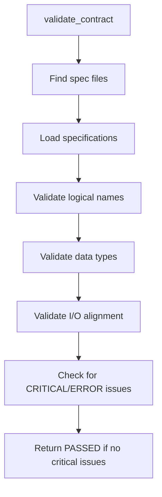
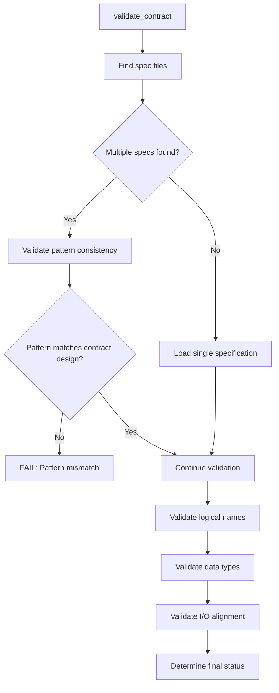

---
tags:
  - test
  - validation
  - alignment
  - contract_specification
  - failure_analysis
keywords:
  - level 2 alignment
  - contract specification alignment
  - false positive
  - validation failure
  - specification pattern mismatch
  - unified vs job-specific specs
  - currency conversion
  - alignment tester
topics:
  - alignment validation
  - contract specification consistency
  - validation framework debugging
  - specification design patterns
language: python
date of note: 2025-08-09
---

# Level 2 Alignment Validation Failure Analysis

## Executive Summary

The Level 2 contract-to-specification alignment validation is producing **false positives**, incorrectly reporting "PASSED" status when critical misalignments exist. This analysis identifies the root cause and provides a comprehensive solution plan.

## Problem Statement

### False Positive Identified
- **Script**: `currency_conversion.py`
- **Level 2 Status**: PASSED (incorrect)
- **Actual Status**: Should be FAILING
- **Impact**: Critical misalignments are not being detected

### Symptoms
1. Level 2 validation reports `"passed": true`
2. Multiple job-specific specification files exist instead of expected unified specification
3. Contract expects single unified specification but finds fragmented job-specific specs
4. No validation errors are raised for specification pattern mismatch

## Root Cause Analysis

### 1. Specification Pattern Mismatch

**Expected Pattern**: Single unified specification
```
currency_conversion_contract.py → currency_conversion_spec.py
```

**Actual Pattern**: Multiple job-specific specifications
```
currency_conversion_contract.py → currency_conversion_training_spec.py
                                → currency_conversion_validation_spec.py
                                → currency_conversion_testing_spec.py
                                → currency_conversion_calibration_spec.py
```

### 2. Validation Logic Flaws

The `ContractSpecificationAlignmentTester` in `src/cursus/validation/alignment/contract_spec_alignment.py` has several critical issues:

#### Issue A: Incorrect Pass/Fail Logic
```python
# Current flawed logic in validate_contract()
has_critical_or_error = any(
    issue['severity'] in ['CRITICAL', 'ERROR'] for issue in all_issues
)
return {
    'passed': not has_critical_or_error,  # This is insufficient
    'issues': all_issues,
    'contract': contract,
    'specifications': specifications
}
```

**Problem**: The logic only checks for CRITICAL/ERROR issues but doesn't validate specification pattern consistency.

#### Issue B: Missing Pattern Validation
The current validation process:
1. ✅ Finds specification files that reference the contract
2. ✅ Loads specifications successfully
3. ✅ Validates logical name alignment
4. ❌ **MISSING**: Validates specification pattern (unified vs job-specific)
5. ❌ **MISSING**: Detects specification fragmentation

#### Issue C: Inadequate Specification Discovery
```python
def _find_specifications_by_contract(self, contract_name: str) -> Dict[Path, Dict[str, Any]]:
    # Current logic finds ALL specs that reference the contract
    # But doesn't validate if this pattern is correct
```

**Problem**: The method finds multiple specifications but doesn't determine if this is the expected pattern.

### 3. Contract Design Intent vs Implementation

**Contract Intent**: `currency_conversion_contract.py` is designed as a unified contract that should work across all job types.

**Implementation Reality**: The system has created separate job-specific specifications, fragmenting what should be a unified specification.

**Validation Gap**: The alignment tester doesn't detect this fundamental design mismatch.

## Detailed Technical Analysis

### Current Validation Flow


### Missing Validation Steps


### Evidence from Currency Conversion Report

From `currency_conversion_alignment_report.json`:

```json
{
  "level2": {
    "passed": true,  // FALSE POSITIVE
    "issues": [],    // Should contain pattern mismatch issues
    "specifications": {
      "currency_conversion_training_spec": { ... },
      "currency_conversion_calibration_spec": { ... },
      "currency_conversion_validation_spec": { ... },
      "currency_conversion_testing_spec": { ... }
    }
  }
}
```

**Analysis**: 
- 4 separate specifications found
- No issues reported (incorrect)
- Should flag specification fragmentation

## Impact Assessment

### Immediate Impact
1. **False Confidence**: Developers believe alignment is correct when it's not
2. **Hidden Technical Debt**: Specification fragmentation goes undetected
3. **Maintenance Burden**: Multiple specs to maintain instead of unified approach
4. **Integration Issues**: Potential runtime failures due to misaligned specifications

### Long-term Impact
1. **Architecture Drift**: System architecture becomes inconsistent
2. **Scalability Issues**: Pattern inconsistencies compound over time
3. **Developer Confusion**: Unclear specification patterns across the codebase
4. **Quality Degradation**: Validation framework loses credibility

## Solution Design

### 1. Enhanced Pattern Detection

Add specification pattern validation to detect:
- **Unified Pattern**: Single spec file for job-agnostic contracts
- **Job-Specific Pattern**: Multiple spec files for job-specific contracts
- **Mixed Pattern**: Invalid combination of unified and job-specific specs

### 2. Contract Design Intent Detection

Implement logic to determine contract design intent:
```python
def _determine_contract_pattern(self, contract: Dict[str, Any]) -> str:
    """
    Determine if contract is designed for unified or job-specific specifications.
    
    Returns:
        'unified' - Single spec expected
        'job_specific' - Multiple job-specific specs expected
        'ambiguous' - Cannot determine intent
    """
    # Analysis logic based on:
    # - Contract arguments (job-type parameter presence)
    # - Entry point naming patterns
    # - Description content analysis
```

### 3. Specification Pattern Validation

Add validation method:
```python
def _validate_specification_pattern(self, contract: Dict[str, Any], 
                                   specifications: Dict[str, Any], 
                                   contract_name: str) -> List[Dict[str, Any]]:
    """
    Validate that specification pattern matches contract design intent.
    
    Returns:
        List of issues if pattern mismatch detected
    """
    issues = []
    
    contract_pattern = self._determine_contract_pattern(contract)
    actual_pattern = self._analyze_specification_pattern(specifications)
    
    if contract_pattern != actual_pattern:
        issues.append({
            'severity': 'ERROR',
            'category': 'specification_pattern_mismatch',
            'message': f'Contract expects {contract_pattern} specification but found {actual_pattern}',
            'details': {
                'contract_name': contract_name,
                'expected_pattern': contract_pattern,
                'actual_pattern': actual_pattern,
                'specification_count': len(specifications)
            },
            'recommendation': f'Create unified specification or refactor contract for job-specific pattern'
        })
    
    return issues
```

### 4. Updated Validation Logic

Modify `validate_contract()` method:
```python
def validate_contract(self, contract_name: str) -> Dict[str, Any]:
    # ... existing code ...
    
    # NEW: Validate specification pattern
    pattern_issues = self._validate_specification_pattern(contract, specifications, contract_name)
    all_issues.extend(pattern_issues)
    
    # UPDATED: Enhanced pass/fail logic
    has_critical_issues = any(issue['severity'] == 'CRITICAL' for issue in all_issues)
    has_error_issues = any(issue['severity'] == 'ERROR' for issue in all_issues)
    
    return {
        'passed': not (has_critical_issues or has_error_issues),
        'issues': all_issues,
        'contract': contract,
        'specifications': specifications,
        'pattern_analysis': {
            'expected_pattern': self._determine_contract_pattern(contract),
            'actual_pattern': self._analyze_specification_pattern(specifications),
            'pattern_valid': len(pattern_issues) == 0
        }
    }
```

## Implementation Plan

### Phase 1: Pattern Detection Enhancement
1. Implement `_determine_contract_pattern()` method
2. Implement `_analyze_specification_pattern()` method
3. Add pattern validation logic
4. Update test cases

### Phase 2: Validation Logic Update
1. Modify `validate_contract()` method
2. Add pattern validation to validation flow
3. Update pass/fail determination logic
4. Enhance error reporting

### Phase 3: Testing and Validation
1. Test with currency_conversion case
2. Verify false positive is resolved
3. Test with other contracts
4. Validate no regressions introduced

### Phase 4: Documentation and Rollout
1. Update alignment validation documentation
2. Add pattern validation examples
3. Update validation reports format
4. Deploy to validation pipeline

## Expected Outcomes

### Immediate Outcomes
1. **Currency Conversion**: Level 2 validation will correctly report FAILING
2. **Pattern Detection**: System will identify specification pattern mismatches
3. **Clear Errors**: Developers will receive actionable error messages
4. **Validation Integrity**: False positives eliminated

### Long-term Outcomes
1. **Architecture Consistency**: Specification patterns will be consistent
2. **Maintenance Efficiency**: Clear guidance on specification design
3. **Quality Assurance**: Validation framework reliability restored
4. **Developer Experience**: Clear feedback on alignment issues

## Risk Assessment

### Implementation Risks
- **Low Risk**: Changes are additive, minimal disruption to existing functionality
- **Testing Required**: Comprehensive testing needed to avoid regressions
- **Documentation**: Clear documentation needed for new validation rules

### Mitigation Strategies
1. **Incremental Implementation**: Phase-based rollout
2. **Comprehensive Testing**: Test with all existing contracts
3. **Rollback Plan**: Ability to disable new validation if issues arise
4. **Clear Communication**: Document changes and expectations

## Conclusion

The Level 2 alignment validation false positive is caused by inadequate specification pattern validation. The proposed solution adds pattern detection and validation logic to correctly identify specification design mismatches.

This fix will:
- ✅ Resolve the currency_conversion false positive
- ✅ Prevent similar issues in other contracts
- ✅ Improve validation framework reliability
- ✅ Provide clear guidance on specification design patterns

The implementation is low-risk and high-value, addressing a critical gap in the validation framework while maintaining backward compatibility.
